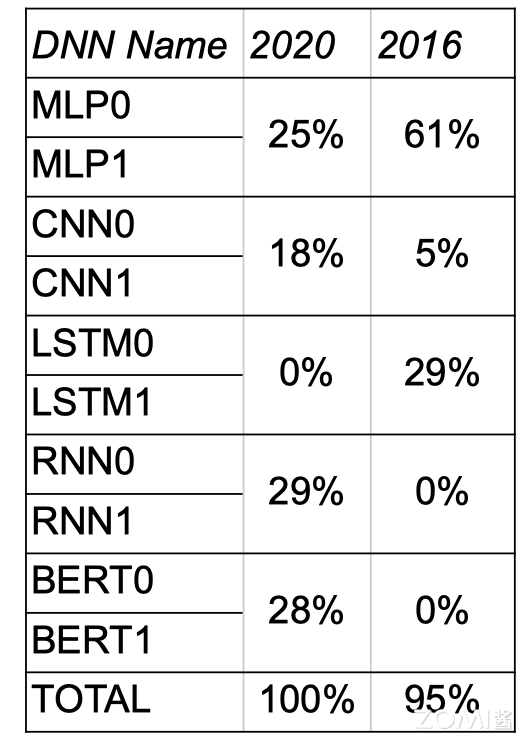

# AI芯片的思考

为了满足数据中心算力需求，Google在2014年开始研发基于特定领域架构（Domain-specific Architecture，DSA）的TPU（Tensor Processing Unit），专门为深度学习任务设计的定制硬件加速器，加速谷歌的机器学习工作负载，特别是训练和推理大规模神经网络模型。

David Patterson是计算机体系结构领域科学家，自1976年起担任加州大学伯克利分校的计算机科学教授并在2016年宣布退休，在2017年加入Google TPU团队，2020年在加州大学伯克利分校发表演讲《A Decade of Machine Learning Accelerators:Lessons Learned and Carbon Footprint》，分享了TPU近几年的发展历程以及心得体会，本节主要摘录并深入探讨其中的8点思考。

## Thought 1：模型 Memory & FLOPs 增长

AI模型近几年所需的内存空间和算力平均每年增长50%，模型所需内存和算力增长大约10~20倍。但是芯片设计到实际应用需要一定的周期，其中芯片设计需要1年，部署需要1年，实际使用并优化大约需要3年，因此总共需要5年时间。

训练模型的增长速度比推理模型更快，2016-2023年，SOTA训练模型的算力需求年均增长10倍，GPT-2模型的参数量从15亿增长到GPT-3 1750亿，提高了100倍。

但是AI芯片的内存容量增长相比来说就比较缓慢，A100的HBM最大内存是80 G，H100最大内存是188 G，谷歌TPU v5内存是32 G，特斯拉DOJO内存是16 G，华为昇腾内存是64 G，寒武纪MLU 370内存是16 G。

## Thought 2：模型快速演变

深度神经网络（DNN）是一个发展迅速的领域，2016年MLP（Multilayer Perceptron，多层感知器）和LSTM（Long Short-Term Memory，长短期记忆网络）是主流的深度学习模型，2020年CNN（Convolutional Neural Network，卷积神经网络）、RNN（Recurrent Neural Network，循环神经网络）和BERT（Bidirectional Encoder Representations from Transformers）被广泛应用。

大型语言模型（Large Language Model，LLM）基于transformer，参数规模从五年前的仅有十亿参数（例如GPT-2的1.5B参数）稳步增长到如今的万亿参数，例如OpenAI的GPT-3.5、微软的Phi-3、谷歌的Gemma、Meta的Llamma等，未来可能会出现新的网络模型，因此DSA架构需要足够通用以支持新的模型。

## Thought 3：生产部署需要多租户技术

大部分AI相关论文假设同一时间NPU只需运行一个模型。实际应用需要切换不同模型：

- 机器翻译涉及语言对比，因此需要使用不同的模型；

- 用一个主模型和配套多个模型进行实验；

- 对吞吐量和延迟有不同要求，不同模型使用不用batch size。

因此需要多租户技术（Multi-tenancy）实现算力切分、显存虚拟化、内存寻址、虚拟内存页等技术。GPU虚拟化技术可以将物理GPU资源虚拟化为多个逻辑GPU资源，使多个用户或应用程序能够共享同一块物理GPU而不会相互干扰。这种技术可以提高GPU资源的利用率和性能，并且能够为不同用户提供独立的GPU环境，增强系统的安全性和隔离性。目前常见的GPU虚拟化技术包括NVIDIA的vGPU、AMD的MxGPU以及Intel的GVT-g虚拟化方案。

## Thought 4：较大的SRAM和存取速度极快的DRAM

通过统计8个模型的基准数据，其中有6个模型涉及到多租户技术。如果从CPU主机重新加载参数，上下文切换需要10秒，因此需要更快的DRAM（片外存储）用来交换多种模型的数据。

红色虚线表示单芯片的最大SRAM（片上存储），而实际情况下不少模型需要的内存远大于此。部分芯片的设计思路是期望利用SRAM解决所有任务，减少内存数据搬运的时间，但是在多租户场景下很难实现。所以AI芯片不仅需要更大的SRAM内存空间，更需要存储速度更快的DRAM。

## Thought 5：重要的是内存，而非FLOPs

现代微处理器最大的瓶颈是能耗，而不是芯片集成度，访问片外DRAM需要的能耗是访问片上SRAM的100倍，是算术运算能耗的5000 ~ 10,000倍。因此AI芯片通过增加浮点运算单元（FPU）来分摊内存访问开销。AI芯片开发者一般通过减少浮点运算数FLOPs来优化模型，减少内存访问是更有效的办法，GPGPU的功耗大多浪费在数据搬运上，而非核心计算，而优化数据流正是AI芯片的核心价值。

英伟达Ampere架构使用第三代Tensor Core，使不同的Warp线程组更好地访问多级缓存。Ampere架构Tensor Core的一个warp中有32个线程共享数据，而Volta架构Tensor Core只有8个线程，更多的线程之间共享数据，可以更好地在线程间减少矩阵的数据搬运。

谷歌TPU v1有 65536 （256x256）个矩阵乘法单元（Matrix Multiply Unit），时钟周期是700 MHz，在其中做了专门的数据流编排，从而使数据可以流动地更快，快速的传输给计算单元进行计算。峰值算力达到92 T Operations/s（65,000×2×700M ≈ 90 TeraOPS），Accumulator内存大小是4 MB，Activation Storage内存大小是24 MB。

TPU使用脉动阵列（systolic array），以固定时间间隔使数据从不同方向流入阵列中的处理单元，最后将数据累积，以完成大型矩阵乘法运算。在70年代的芯片只有单金属层，不能很好地实现互连，Kung和Leiserson提出”脉动阵列“以减少布线，简化连接。如今芯片多达10个金属层，最大难点是能耗，脉动阵列能效高，使用脉动阵列可以使芯片容纳更多乘法单元，从而分摊内存访问开销。

## Thought 6：DSA既要专业也要灵活

DSA难点在于既要对模型进行针对性的优化，同时还须保持一定的灵活性。训练之所以比推理更加复杂，是因为训练的计算量更大，包含反向传播、转置和求导等运算。训练时需要将大量运算结果储存起来用于反向传播的计算，因此也需要更大的内存空间。

此外，支持更加广泛的计算数据格式（如BF16、FP16、HF32）用于AI计算，指令、流水、可编程性也更高，需要灵活的编译器和上层软硬件配套，CUDA在这个方面已经积累了很多年，TPU逐渐支持了INT8、BFloat16等。

## Thought 7：半导体技术发展速度不同，要做好选型

计算逻辑的进步速度很快，但是芯片布线（制程工艺）的发展速度则较慢。 SRAM 和 HBM 比 DDR4 和 GDDR6 速度更快，能效更高，因此AI芯片需要根据数据的操作格式选用一定的存储设备。在大模型训练过程中普遍使用BF16，部分会使用FP8进行推理，如果选型有问题，比如只能用FP32模拟BF16，将减慢大模型训练迭代的速度。

TPU v2中有两个互连的Tensor Core，更加方便布线，同时对编译器也更加友好。

## Thought 8：编译器优化和AI应用兼容

DSA 的编译器需要对AI模型进行分析和优化，通过编译器把AI使用的指令转换为高效的底层代码，以便在特定硬件上运行时能够更快地执行，充分发挥硬件的性能，具体可分为与机器无关高级操作和与相关低级操作，从而提供不同维度的优化 API 和 PASS（LLVM编译器所采用的一种结构化技术，用于完成编译对象（如IR）的分析、优化或转换等功能）。

目前编译器维度比较多，有类似于CUDA提供编程体系，有类似于TVM（深度学习编译器）和XLA（加速线性代数）提供编译优化，包括对计算图进行图优化、内存优化、并行化、向量化等操作，以提高模型的执行速度和减少资源消耗，优化的具体方式如下：

- 实现4096个芯片的多核并行；

- 向量、矩阵、张量等功能单元的数据级并行；

- 322~400 位 VLIW（Very Long Instruction Word） 指令集的指令级并行，一条指令可以同时包含多个操作，这些操作可以在同一时钟周期内并行执行；

- 编译优化取决于软硬件能否进行缓存，编译器需要管理内存传输；

- 编译器能够兼容不同功能单元和内存中的数据布局（如 Trans data）。

实际上可以通过算子融合（Operator Fusion）减少内存，从而优化性能。例如可以将矩阵乘法与激活函数进行融合，省略将中间结果写入HBM之后再读取出来的步骤，通过MLPerf基准测试结果可知，算子融合平均可以带来超过两倍的性能提升。

与CPU中的GCC和NVIDIA GPU CUDA相比，DSA的软件栈还不够成熟。但是编译器优化能够带来更好的性能提升，蓝色表示使用GPU，红色表示使用TPU，通过编译器优化后模型的性能大约有2倍提升提升。对于C++编译器而言，能在一年内把性能提升5%-10%已经算是达到很好的效果了。

当输入序列（sequence length）较长时，Transformer的计算过程缓慢且耗费内存。Flash Attention（FlashAttention: Fast and Memory-Efficient Exact Attention with IO-Awareness（FlashAttention：一种具有 IO 感知，且兼具快速、内存高效的新型注意力算法））是 GPT-3.5 中引入的一种注意力机制，是一种改进的自注意力机制，它重新排序了注意力计算的顺序，以提高处理长序列数据时的效率。

GPU中存储单元主要有HBM和SRAM，HBM容量大但是访问速度慢，SRAM容量小却有着较高的访问速度。GPU SRAM的读写（I/O）的速度为19TB/s 和GPU HBM 的读写（I/O）速度相差十几倍，而对比存储容量也相差了好几个数量级。FlashAttention通过减少GPU内存读取/写入，运行速度比PyTorch标准注意力快 2-4 倍，所需内存减少5-20倍。而且Flash Attention的计算是从HBM中读取块，在SRAM中计算之后再写到HBM中，因此想避免从HBM里读取或写入注意力矩阵。算法没有减少计算量，而是从 IO 感知出发，减少 HBM 访问次数，从而减少了计算时间。

## 参考文献

[1] 演讲视频. "David Patterson: A Decade of Machine Learning Accelerators:Lessons Learned and Carbon Footprint" YouTube, [[https://www.youtube.com/watch?v=PLK3pGELbSs](https://www.youtube.com/watch?v=PLK3pGELbSs).](https://www.youtube.com/watch?v=PLK3pGELbSs](https://www.youtube.com/watch?v=PLK3pGELbSs).)

[2] 视频内容翻译. "TPU演进十年：Google的十大经验教训" 知乎, [[https://zhuanlan.zhihu.com/p/573794328](https://zhuanlan.zhihu.com/p/573794328).](https://zhuanlan.zhihu.com/p/573794328](https://zhuanlan.zhihu.com/p/573794328).)

## 本节视频

<html>
<iframe src="////player.bilibili.com/player.html?aid=237147839&bvid=BV1te411y7UC&cid=1367020095&p=1&as_wide=1&high_quality=1&danmaku=0&t=30&autoplay=0" width="100%" height="500" scrolling="no" border="0" frameborder="no" framespacing="0" allowfullscreen="true"> </iframe>
</html>