# AI 芯片的思考(DONE)

为了满足数据中心算力需求，谷歌在 2014 年开始研发基于特定领域架构（Domain-specific Architecture，DSA）的 TPU（Tensor Processing Unit），专门为深度学习任务设计的定制硬件加速器，加速谷歌的机器学习工作负载，特别是训练和推理大模型。

David Patterson（大卫·帕特森）是计算机体系结构领域科学家，自 1976 年起担任加州大学伯克利分校的计算机科学教授并在 2016 年宣布退休，在 2017 年加入谷歌 TPU 团队，2020 年在加州大学伯克利分校发表演讲《A Decade of Machine Learning Accelerators:Lessons Learned and Carbon Footprint》，分享了 TPU 近几年的发展历程以及心得体会，本节主要摘录并深入探讨其中的 8 点思考。

## 模型对内存和算力的需求

AI 模型近几年所需的内存空间和算力平均每年增长 50%，模型所需内存和算力增长大约 10~20 倍。但是芯片设计到实际应用需要一定的周期，其中芯片设计需要 1 年，部署需要 1 年，实际使用并优化大约需要 3 年，因此总共需要 5 年时间。

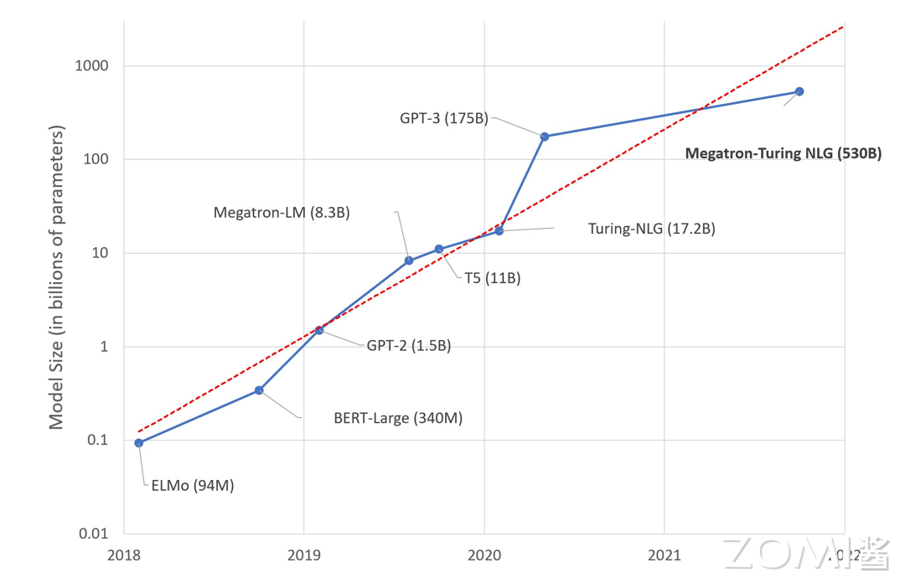

训练模型参数量的增长速度比推理模型更快，2016-2023 年，SOTA 训练模型的算力需求年均增长 10 倍，GPT-2 模型的参数量从 15 亿增长到 GPT-3 1750 亿，提高了 100 倍。

但是 AI 芯片的内存容量增长相比来说就比较缓慢，A100 的 HBM 最大内存是 80 G，H100 最大内存是 188 G，谷歌 TPU v5 内存是 32 G，特斯拉 DOJO 内存是 16 G，华为昇腾内存是 64 G，寒武纪 MLU 370 内存是 16 G。

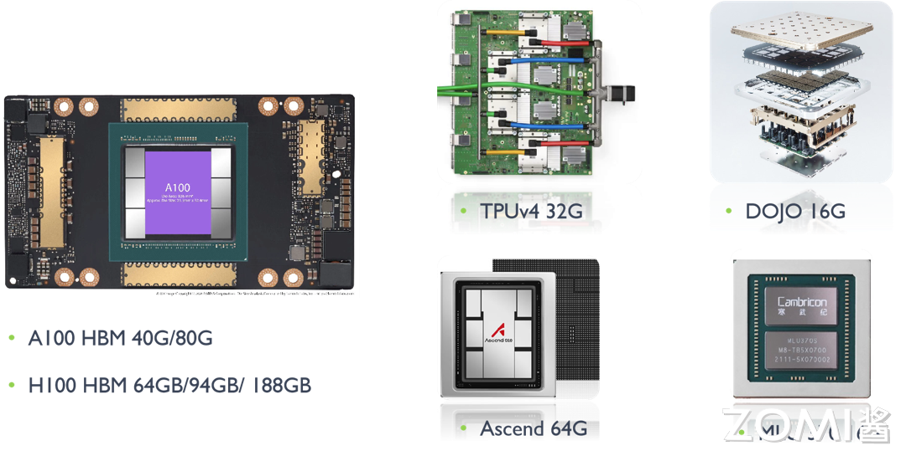

## 模型结构快速演变

深度神经网络（DNN）是一个发展迅速的领域，2016 年 MLP（Multilayer Perceptron，多层感知器）和 LSTM（Long Short-Term Memory，长短期记忆网络）是主流的神经网络模型，2020 年 CNN（Convolutional Neural Network，卷积神经网络）、RNN（Recurrent Neural Network，循环神经网络）和 BERT（Bidirectional Encoder Representations from Transformers）被广泛应用。

大型语言模型（Large Language Model，LLM）基于 transformer，参数规模从五年前的仅有十亿参数（例如 GPT-2 的 1.5B 参数）稳步增长到如今的万亿参数，例如 OpenAI 的 GPT-3.5、微软的 Phi-3、谷歌的 Gemma、Meta 的 Llamma 等，未来可能会出现新的网络模型，因此 DSA 架构需要足够通用以支持新的模型。

## 生产部署提供多租户

大部分 AI 相关论文假设同一时间 NPU 只需运行一个模型。实际应用需要切换不同模型：

- 机器翻译涉及语言对比，因此需要使用不同的模型；

- 用一个主模型和配套多个模型进行实验；

- 对吞吐量和延迟有不同要求，不同模型使用不用 batch size。

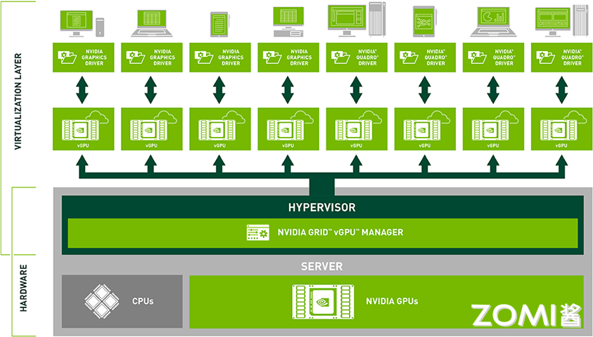

因此需要多租户技术（Multi-tenancy）实现算力切分、显存虚拟化、内存寻址、虚拟内存页等技术。GPU 虚拟化技术可以将物理 GPU 资源虚拟化为多个逻辑 GPU 资源，使多个用户或应用程序能够共享同一块物理 GPU 而不会相互干扰。这种技术可以提高 GPU 资源的利用率和性能，并且能够为不同用户提供独立的 GPU 环境，增强系统的安全性和隔离性。目前常见的 GPU 虚拟化技术包括 NVIDIA vGPU、AMD MxGPU 以及 Intel GVT-g 等虚拟化方案。

## SRAM 与 DRAM 的权衡

通过统计 8 个模型的基准数据，其中有 6 个模型涉及到多租户技术。如果从 CPU 主机重新加载参数，上下文切换需要 10 秒，因此需要更快的 DRAM（片外存储）用来交换多种模型的数据。

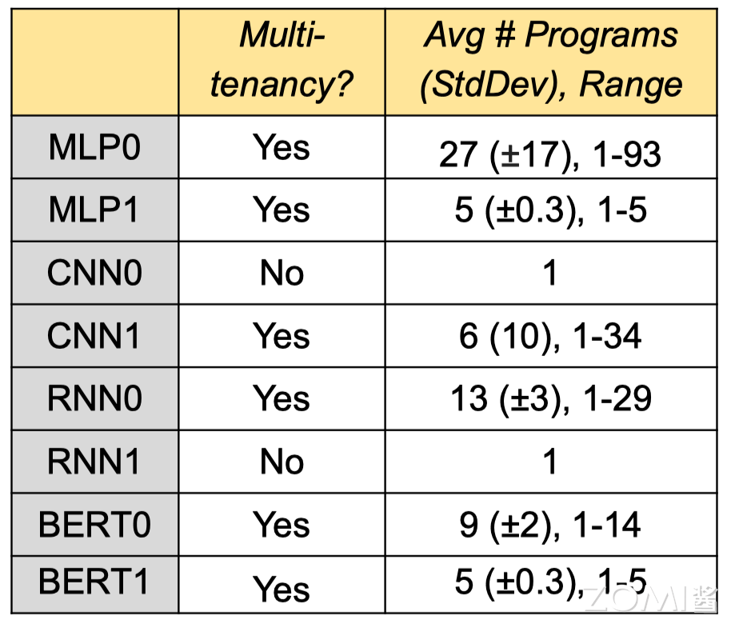

红色虚线表示单芯片的最大 SRAM（片上存储），而实际情况下不少模型需要的内存远大于此。部分芯片的设计思路是期望利用 SRAM 解决所有任务，减少内存数据搬运的时间，但是在多租户场景下很难实现。所以 AI 芯片不仅需要更大的 SRAM 片上存储内存空间，更需要存储速度更快的片外存储 DRAM。

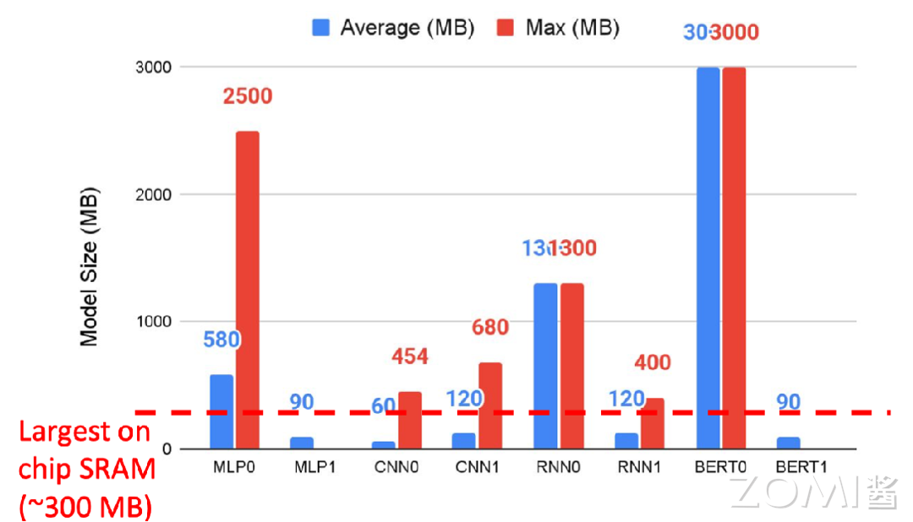

## 内存比非算力重要

现代微处理器最大的瓶颈是能耗，而不是芯片集成度，访问片外 DRAM 需要的能耗是访问片上 SRAM 的 100 倍，是算术运算能耗的 5000 ~ 10,000 倍。因此 AI 芯片通过增加浮点运算单元（FPU）来分摊内存访问开销。AI 芯片开发者一般通过减少浮点运算数 FLOPs 来优化模型，减少内存访问是更有效的办法，GPGPU 的功耗大多浪费在数据搬运上，而非核心计算，而优化数据流正是 AI 芯片的核心价值。

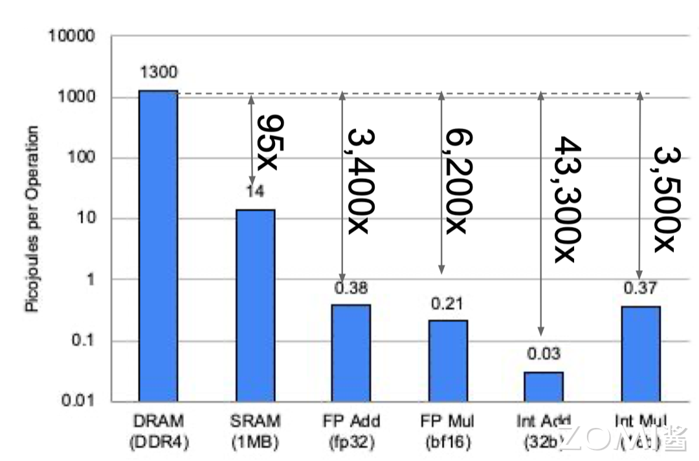

英伟达 Ampere 架构使用第三代 Tensor Core，使不同的 Warp 线程组更好地访问多级缓存。Ampere 架构 Tensor Core 的一个 warp 中有 32 个线程共享数据，而 Volta 架构 Tensor Core 只有 8 个线程，更多的线程之间共享数据，可以更好地在线程间减少矩阵的数据搬运。

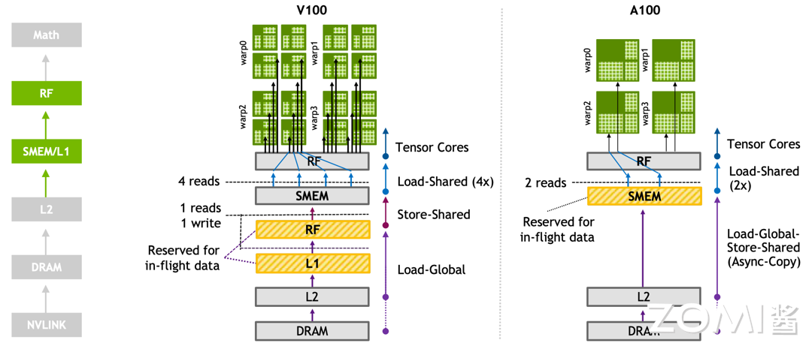

谷歌 TPU v1 有 65536 （256x256）个矩阵乘法单元（Matrix Multiply Unit），时钟周期是 700 MHz，在其中做了专门的数据流编排，从而使数据可以流动地更快，快速地传输给计算单元进行计算。峰值算力达到 92 T Operations/s（65,000×2×700M ≈ 90 TeraOPS），Accumulator 内存大小是 4 MB，Activation Storage 内存大小是 24 MB。

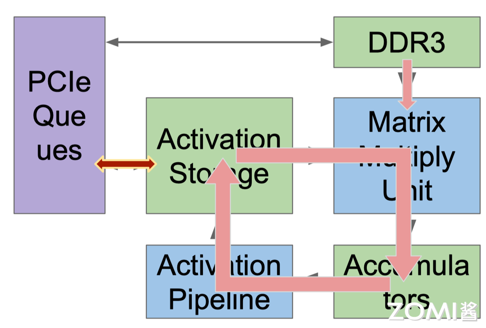

TPU 使用脉动阵列（systolic array），以固定时间间隔使数据从不同方向流入阵列中的处理单元，最后将数据累积，以完成大型矩阵乘法运算。在 70 年代的芯片只有单金属层，不能很好地实现互连，Kung 和 Leiserson 提出”脉动阵列“以减少布线，简化连接。如今芯片多达 10 个金属层，最大难点是能耗，脉动阵列能效高，使用脉动阵列可以使芯片容纳更多乘法单元，从而分摊内存访问开销。

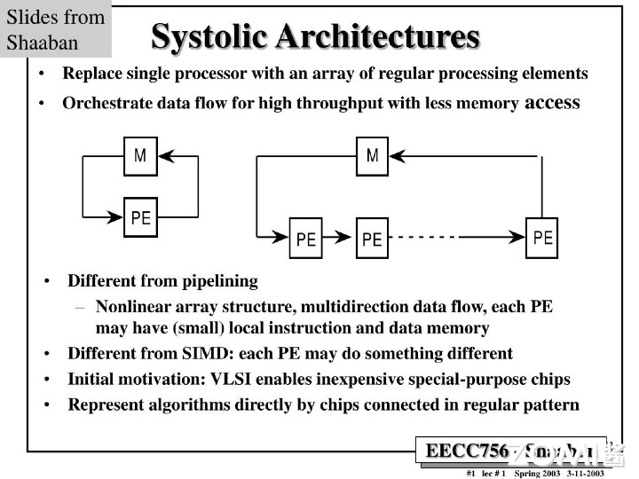

## DSA 既要专业也要灵活

DSA 难点在于既要对模型进行针对性的优化，同时还须保持一定的灵活性。训练之所以比推理更加复杂，是因为训练的计算量更大，包含反向传播、转置和求导等运算。训练时需要将大量运算结果储存起来用于反向传播的计算，因此也需要更大的内存空间。

此外，支持更加广泛的计算数据格式（如 BF16、FP16、HF32）用于 AI 计算，指令、流水、可编程性也更高，需要灵活的编译器和上层软硬件配套，CUDA 在这个方面已经积累了很多年，TPU 逐渐支持了 INT8、BFloat16 等。

## 半导体供应链的选型

计算逻辑的进步速度很快，但是芯片布线（制程工艺）的发展速度则较慢。 SRAM 和 HBM 比 DDR4 和 GDDR6 速度更快，能效更高，因此 AI 芯片需要根据数据的操作格式选用一定的存储设备。在大模型训练过程中普遍使用 BF16，部分会使用 FP8 进行推理，如果选型有问题，比如只能用 FP32 模拟 BF16，将减慢大模型训练迭代的速度。

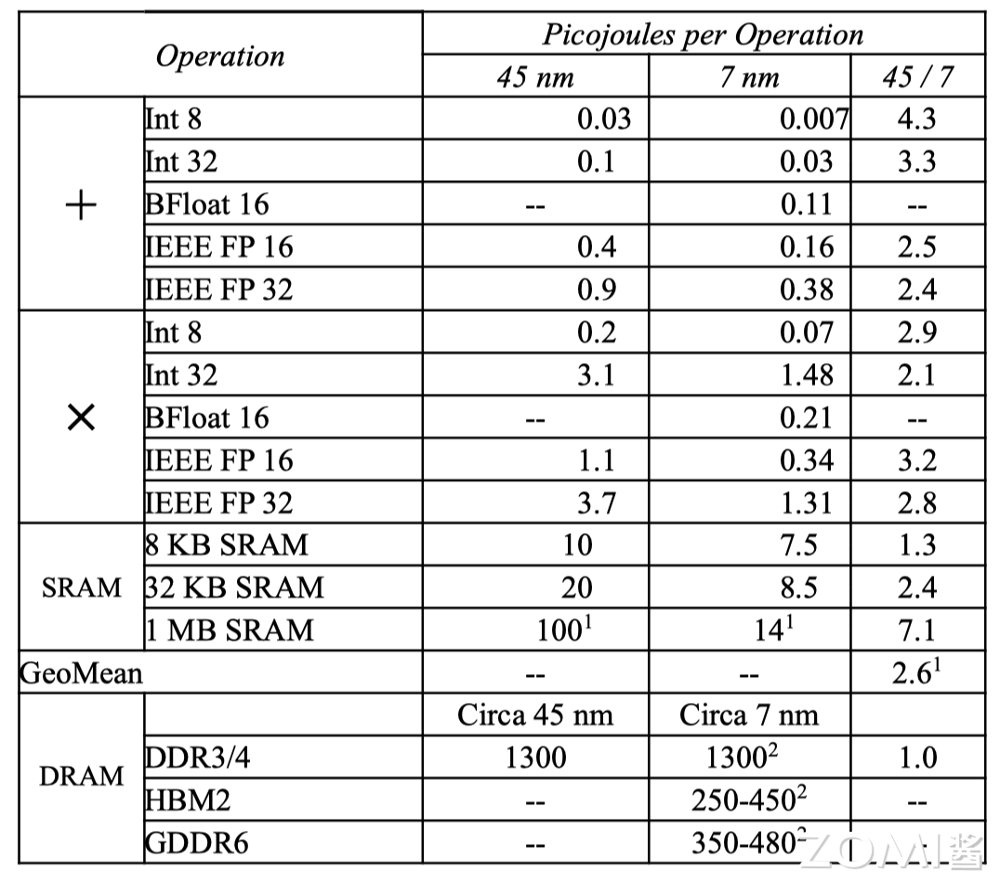

TPU v2 中有两个互连的 Tensor Core，更加方便布线，同时对编译器也更加友好。

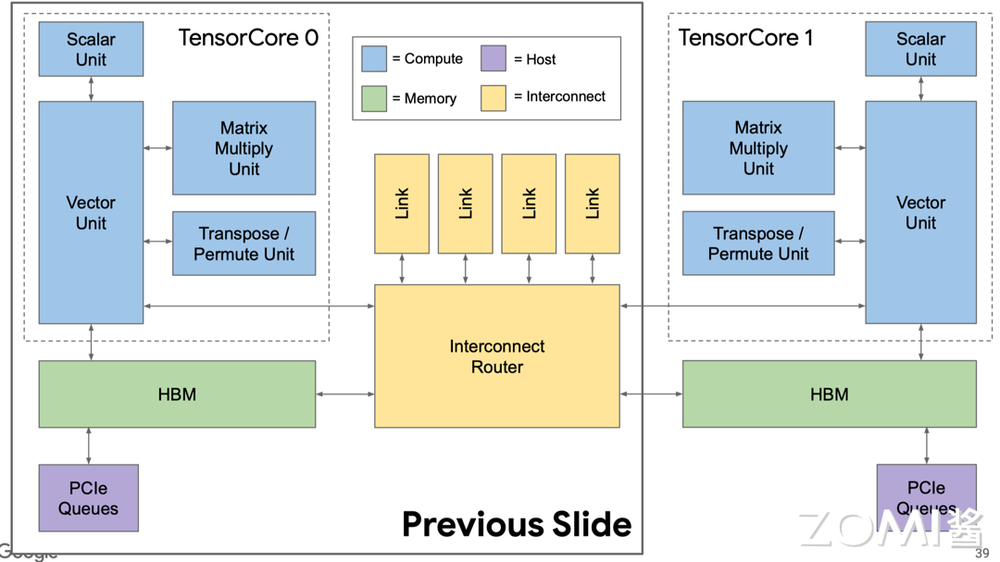

## 编译器优化和 AI 应用兼容

DSA 的编译器需要对 AI 模型进行分析和优化，通过编译器把 AI 使用的指令转换为高效的底层代码，以便在特定硬件上运行时能够更快地执行，充分发挥硬件的性能，具体可分为与机器无关高级操作和与相关低级操作，从而提供不同维度的优化 API 和 PASS（LLVM 编译器所采用的一种结构化技术，用于完成编译对象（如 IR）的分析、优化或转换等功能）。

目前编译器维度比较多，有类似于 CUDA 提供编程体系，有类似于 TVM（深度学习编译器）和 XLA（加速线性代数）提供编译优化，包括对计算图进行图优化、内存优化、并行化、向量化等操作，以提高模型的执行速度和减少资源消耗，优化的具体方式如下：

- 实现 4096 个芯片的多核并行；

- 向量、矩阵、张量等功能单元的数据级并行；

- 322~400 位 VLIW（Very Long Instruction Word） 指令集的指令级并行，一条指令可以同时包含多个操作，这些操作可以在同一时钟周期内并行执行；

- 编译优化取决于软硬件能否进行缓存，编译器需要管理内存传输；

- 编译器能够兼容不同功能单元和内存中的数据布局（如 Trans data）。

实际上可以通过算子融合（Operator Fusion）减少内存，从而优化性能。例如可以将矩阵乘法与激活函数进行融合，省略将中间结果写入 HBM 之后再读取出来的步骤，通过 MLPerf 基准测试结果可知，算子融合平均可以带来超过两倍的性能提升。

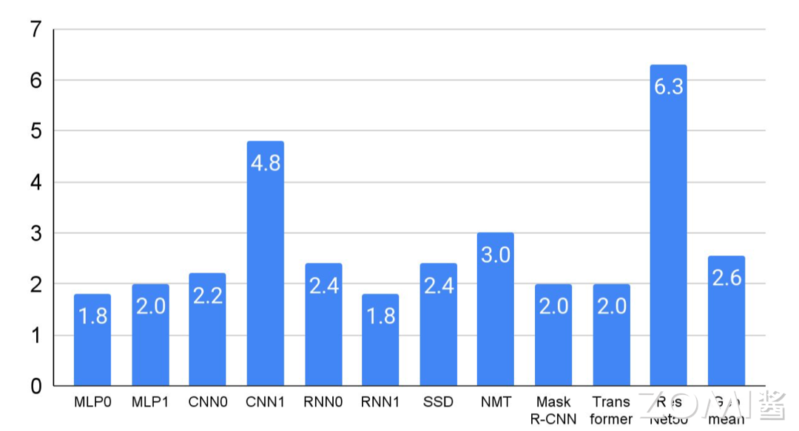

与 CPU 中的 GCC 和 NVIDIA GPU CUDA 相比，DSA 的软件栈还不够成熟。但是编译器优化能够带来更好的性能提升，蓝色表示使用 GPU，红色表示使用 TPU，通过编译器优化后模型的性能大约有 2 倍提升提升。对于 C++编译器而言，能在一年内把性能提升 5%-10%已经算是达到很好的效果了。

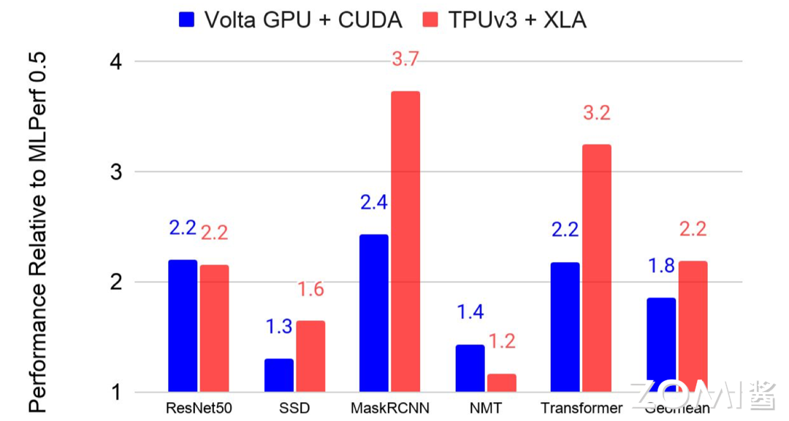

当输入序列（sequence length）较长时，Transformer 的计算过程缓慢且耗费内存。Flash Attention（FlashAttention: Fast and Memory-Efficient Exact Attention with IO-Awareness（FlashAttention：一种具有 IO 感知，且兼具快速、内存高效的新型注意力算法））是 GPT-3.5 中引入的一种注意力机制，是一种改进的自注意力机制，它重新排序了注意力计算的顺序，以提高处理长序列数据时的效率。

GPU 中存储单元主要有 HBM 和 SRAM，HBM 容量大但是访问速度慢，SRAM 容量小却有着较高的访问速度。GPU SRAM 的读写（I/O）的速度为 19 TB/s 和 GPU HBM 的读写（I/O）速度相差十几倍，而对比存储容量也相差了好几个数量级。FlashAttention 通过减少 GPU 内存读取/写入，运行速度比 PyTorch 标准注意力快 2-4 倍，所需内存减少 5-20 倍。而且 Flash Attention 的计算是从 HBM 中读取块，在 SRAM 中计算之后再写到 HBM 中，因此想避免从 HBM 里读取或写入注意力矩阵。算法没有减少计算量，而是从 IO 感知出发，减少 HBM 访问次数，从而减少了计算时间。

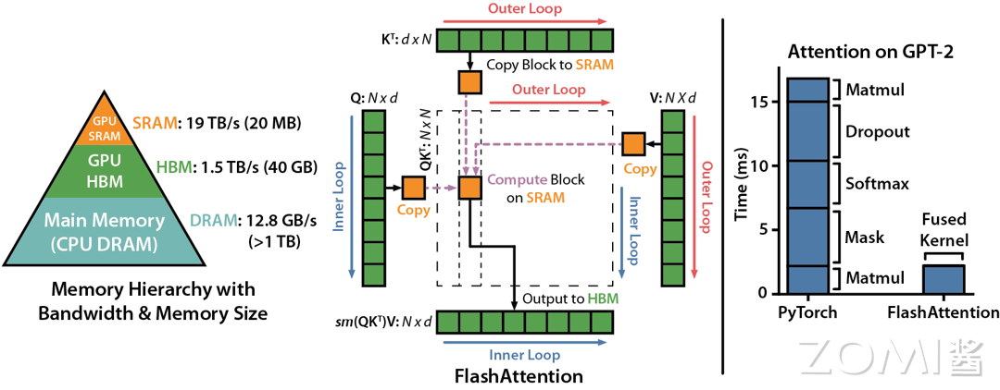

## 本节视频

<html>
<iframe src="////player.bilibili.com/player.html?aid=237147839&bvid=BV1te411y7UC&cid=1367020095&p=1&as_wide=1&high_quality=1&danmaku=0&t=30&autoplay=0" width="100%" height="500" scrolling="no" border="0" frameborder="no" framespacing="0" allowfullscreen="true"> </iframe>
</html>
