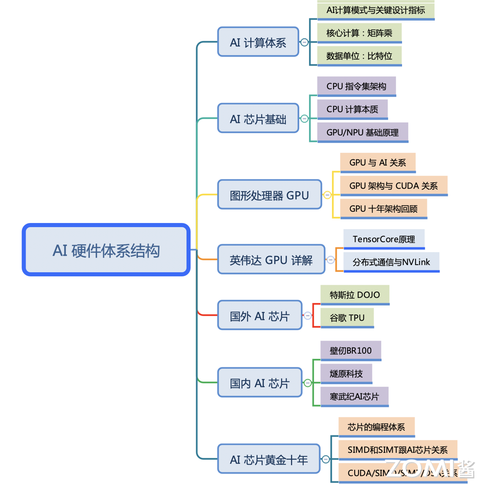

<!--Copyright © ZOMI 适用于[License](https://github.com/chenzomi12/AISystem)版权许可-->

# AI 硬件体系架构概述

AI 芯片，作为 AI 的硬件体系架构主要是指 AI 芯片，这里就很硬核了，从CPU、GPU 的芯片基础到 AI 芯片的原理、设计和应用场景范围，AI 芯片的设计不仅仅考虑针对 AI 计算的加速，还需要充分考虑到AI 的应用算法、AI 框架等中间件，而不是停留在天天喊着吊打英伟达和 CUDA，实际上芯片难以用起来。

## 课程简介

- [**《AI 计算体系》**](./01Foundation/)：《AI 计算体系》深入 AI 的计算模式，从而理解 AI 的“计算”需要什么。通过 AI 芯片关键指标，了解 AI 芯片要更好的支持“计算”，需要关注那些重点工作。最后通过深度学习的计算核心“矩阵乘”来看对“计算”的实际需求和情况，为了提升计算性能、降低功耗和满足训练推理不同场景应用，对“计算”引入 TF32/BF16，甚至是 FP8 等复杂多样比特位宽的数据精度格式。

- [**《AI 芯片基础》**](./02ChipBase/)：简单从 CPU 开始看通用逻辑架构（冯诺依曼架构）开始，通过打开计算的本质（数据与时延）从而引出对于并行计算 GPU 作用和解决的业务场景，到目前最火的 AI 芯片 NPU。最后迈入超异构并行 CPU、GPU、NPU 并存的计算系统架构黄金十年。

- [**《图形处理器 GPU》**](./03GPUBase/)：主要是深入地讲解 GPU 的工作原理，其最重要的指标是计算吞吐和存储和传输带宽，并对英伟达的 GPU 的十年 5 代架构进行梳理。此外，《NVIDIA GPU 详解》英伟达架构里面专门为 AI 而生的 Tensor Core 和 NVLink 对 AI 加速尤为重要，因此重点对 Tensor Core 和 NVLink 进行深入剖析其发展、演进和架构。

- [**《英伟达 GPU 详解》**](./04NVIDIA/): 英伟达架构里面专门为 AI 而生的 Tensor Core 和 NVLink 对 AI 加速尤为重要，因此重点对 Tensor Core 和 NVLink 进行深入剖析其发展、演进和架构。

- [**《国外 AI 芯片》**](./05Abroad/)：深入地剖析国外谷歌 TPU 和特斯拉 DOJO 相关 AI 芯片的架构，以 TPU 为主主要使用了数据流（Data FLow）的方式的脉动阵列来加速矩阵的运算，而特斯拉则使用了近存计算（Near Memory）两种不同的产品形态。

- [**《国内 AI 芯片》**](./06Domestic/)：深入地解读国内 AI 芯片厂商，首先第一个肯定是华为昇腾 Ascend，还有初创芯片厂商如国内第一 AI 芯片上市公司寒武纪、国内造 GPU 声势最大的壁仞科技、腾讯重头的燧原科技等科技公司的 AI 芯片架构。

- [**《AI 芯片黄金十年》**](./07Thought/)：基于 AI 芯片的 SIMD 硬件结构和 SIMT 的硬件结构原理，分析其上层的编程模型 SPMD 与 CUDA 之间的关系，去了解做好 AI 芯片其实跟软件的关联性也有着密切的关系，并对 AI 芯片近 10 年的发展进行一个总结和思考。

希望这个系列能够给朋友们带来一些帮助，也希望 ZOMI 能够继续坚持完成所有内容哈！欢迎您也参与到这个开源课程的贡献！

## 课程脑图

## 备注

文字课程开源在 [AISys](https://chenzomi12.github.io/)，系列视频托管[B 站](https://space.bilibili.com/517221395)和[油管](https://www.youtube.com/@ZOMI666/videos)，PPT 开源在[github](https://github.com/chenzomi12/AISystem)，欢迎取用！！！

> 非常希望您也参与到这个开源课程中，B 站给 ZOMI 留言哦！
> 
> 欢迎大家使用的过程中发现 bug 或者勘误直接提交代码 PR 到开源社区哦！
>
> 欢迎大家使用的过程中发现 bug 或者勘误直接提交 PR 到开源社区哦！
>
> 请大家尊重开源和 ZOMI 的努力，引用 PPT 的内容请规范转载标明出处哦！