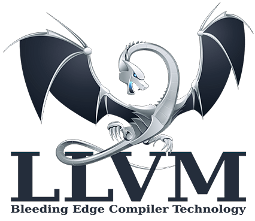
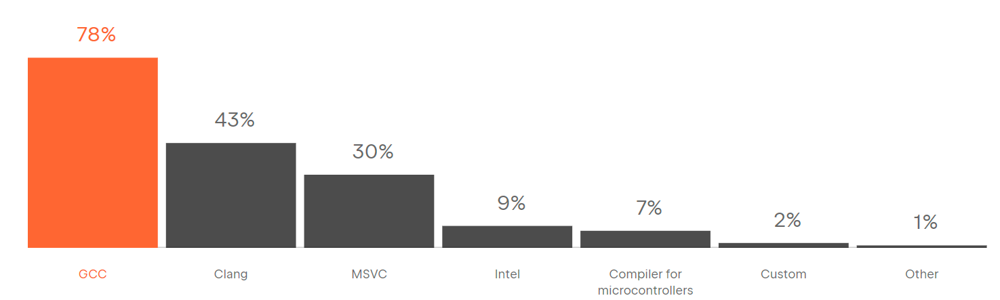

# LLVM架构设计和原理



在上一节中，我们详细探讨了GCC的编译过程和原理。然而，由于GCC存在代码耦合度高、难以进行独立操作以及庞大的代码量等缺点。正是由于对这些问题的意识，人们开始期待新一代编译器LLVM的出现。

在本节，我们将深入研究LLVM的架构设计和原理，以探索其与GCC不同之处。

## LLVM项目发展历程[<sup>2</sup>](#ref2)

LLVM项目起源于2000年伊利诺伊大学厄巴纳-香槟分校的维克拉姆·艾夫（Vikram Adve）和克里斯·拉特纳（Chris Lattner）的研究，旨在为所有静态和动态语言创建动态编译技术。LLVM是以BSD许可证开发的开源软件。2005年，苹果公司雇用了克里斯·拉特纳及其团队为macOS和iOS开发工具，LLVM成为了这些平台开发工具的一部分。

项目最初的命名来源于底层虚拟机（Low Level Virtual Machine）的首字母缩写。随着LLVM项目的发展，该缩写引起了混淆，因为项目范围不仅限于创建虚拟机。随着LLVM发展壮大，它成为了许多编译工具和低级工具技术的统称，这使得缩写变得不再合适。于是开发者决定摒弃缩写的含义，现在LLVM已经成为一个品牌，用于指代LLVM项目下的所有子项目，包括LLVM中介码（LLVM IR）、LLVM调试工具、LLVM C++标准库等。

由于LLVM对产业的重大贡献，计算机协会在2012年授予维克拉姆·艾夫、克里斯·拉特纳和Evan ChengACM软件系统奖。

从9.0.0版本开始，LLVM改用带有LLVM额外条款的Apache许可证2.0。自2019年10月起，LLVM项目的代码存储已正式迁移到GitHub[<sup>3</sup>](#ref3)。

### 苹果与GCC


长期以来，苹果选择使用GNU编译器集合（GCC）作为官方编译器。尽管GCC在开源世界中表现良好，但苹果对编译工具提出了更高要求。苹果在增强Objective-C和C语言方面投入了大量努力，但GCC开发者对苹果在Objective-C支持方面的努力表示不满。因此，苹果基于GCC分为两个分支进行独立开发，导致苹果的编译器版本明显落后于官方GCC版本。

另一方面，GCC的代码过于耦合，难以独立开发。随着版本更新，代码质量逐渐下降，而GCC无法以模块化方式调用实现Apple渴望的更好集成开发环境支持，这限制了LLVM-GCC的发展。

面对这些问题，苹果一直寻找高效、模块化和更自由的开源替代方案。最终，苹果聘请了编译器领域的专家克里斯·拉特纳来领导LLVM项目的实现，标志着LLVM编译器的诞生。


## LLVM架构特点

### LLVM的IR

LLVM提供了一套适合编译器系统的中间语言（Intermediate Representation，IR），围绕这个中间语言进行了大量的变换和优化。经过这些变换和优化，IR可以被转换为目标平台相关的汇编语言代码。  

根据2011年的测试结果，LLVM的性能在运行时平均比GCC低10%。2013年的测试显示，LLVM能够编译出与GCC性能相近的执行代码。

GCC：

 

LLVM：


与传统GCC的前端直接对应于后端不同，LLVM的IR是统一的，可以适用于多种平台、进行优化和代码生成。

### LLVM组件独立性与库化特点

LLVM具有一个重要的特点，就是它的组件独立性和库化架构。使用LLVM，前端工程师在需要添加一门新的编程语言时，只需实现相应的前端，而不需要修改后端部分。这是因为后端只需将中间表示（IR）翻译成目标平台的机器码即可。

对于后端工程师来说，他们只需将目标硬件的特性如寄存器、硬件调度以及指令调度对接到IR上，而无需修改前端部分。这种灵活的架构使得编译器的前端和后端工程师可以相对独立地开展工作，大大提高了开发效率和维护性。

在LLVM中，IR扮演着至关重要的角色。它是一种类似汇编语言的底层语言，但具有强类型和精简指令集的特点（RISC），并对目标指令集进行了抽象。例如，在IR中，目标指令集的函数调用惯例会被抽象为call和ret指令，并使用明确的参数。

此外，LLVM支持三种不同的IR表达形式：人类可读的汇编形式、在C++中的对象形式以及序列化后的bitcode形式。这种多样化的表达形式使得开发人员更好地理解和处理IR，进而实现更加灵活和高效的编译工作。通过IR的抽象和统一，LLVM极大地创新了编译体系的概念，为编程语言的快速开发和跨平台支持提供了强大的基础。

### gcc的IR

GCC 生成的中间表示（Intermediate Representation，IR）通常是一种名为GIMPLE的表示形式。它对源代码进行了简化，但仍保留了必要的信息以进行优化和代码生成。

GIMPLE与LLVM的IR系统相比，GIMPLE和LLVM IR在核心上并没有太大的不同。它们都是基于基本块的标准控制流图，每个基本块都包含一个线性序列的输入和输出指令，通常被称为“三地址代码”，并且已经转换为SSA形式。然而，它们在设计和应用上有一些重要的差异。

LLVM IR的优点包括： 
- 更独立：LLVM IR设计为可以在编译器之外的任意工具中重用，使得可以轻松集成其他类型的工具，例如静态分析器和插桩器。 
- 更正式的定义和更好的C++ API：这使得处理、转换和分析变得更加容易。 
- 更接近硬件行为：LLVM IR提供了类似RISCV的模拟指令集和强类型系统，实现了其“通用表示”的目的。足够底层的指令和细粒度的类型使得上层语言和IR的隔离变得容易，同时IR的行为更加贴近硬件，使得在LLVM IR上的进一步分析成为可能。

GIMPLE的优点： 
- 降低控制流复杂度：GIMPLE通过降低控制流复杂度、采用三地址表示和限制语法，使得优化变得相对容易。

在选择使用哪种IR系统时，可以考虑以下因素[<sup>4</sup>](#ref4) ：
- 面向工业应用或期望商业产品的开发，可以自己生成统一的AST进行数据流分析，或者生成类似GCC GIMPLE形式及更高层次的三地址码进行分析，而不适合使用像LLVM BC这样偏底层的中间表示。
- 面向学术界的应用，可以考虑使用像LLVM BC这样的中间表示，因为它已经做了较大简化，可以更快地得出结果。

## LLVM架构设计

LLVM项目已经迅速发展成为一个庞大的编译器工具集合。LLVM激发了许多人为多种编程语言开发新的编译器，其中最引人注目的之一是Clang。作为一个新的编译器，Clang 提供对 C、Objective-C 和 C++ 的支持，并且得到了苹果公司的大力支持。Clang 的目标是取代GCC在系统中的 C 和 Objective-C 编译器，它能够更轻松地集成到现代开发环境（IDE）中，并且支持线程的更好处理。从Clang 3.8版本开始，它还开始支持OpenMP。GCC 在 Objective-C 方面的发展已经停滞，苹果已经将其支持转移到其他维护分支上。

在2021年jetbrains开发者调查中[<sup>1</sup>](#ref1) 
GCC编译器拥有78%的用户使用率，Clean编译器有43%的用户使用率。



在使用过程中使用C,C++,ObjC都会用到Clang的前端，后面就附用了LLVM的优化器和后端。


所以用户看到的就只是Clang的前端，而后面LLVM的优化器和后端都隐藏在幕后。


首先我们以C,C++,ObjC高级语言作为输入，输入到Clang前端，Clang前端会对这些高级语言做一些词法分析、语法分析、语义分析等操作，生成抽象语法树（AST）。然后Clang会将AST转换为LLVM的中间表示（IR）。

LLVM的中间表示（IR）连接前端和后端。然后LLVM的优化器会对IR进行优化，优化器会将IR转换为更高效的IR。最后，LLVM的后端会将IR转换为目标平台相关的汇编代码，并生成可执行文件。

LLVM的架构图：


在详细的架构图中，我们可以看到LLVM的前端、优化器、后端等各个组件的交互。在前端，Clang会将高级语言代码转换为为LLVM的中间表示（IR）。

在中间的编译优化层中，LLVM会有非常多的pass，不同的pass会对IR进行不同的优化处理，将IR转换为更高效的IR。这里有关pass的详细内容将在下一节进行介绍。对IR的优化完成之后，编译器还是会以LLVM的中间表示（IR）作为输出，然后LLVM的后端会将IR转换为目标平台相关的机器码。

在后端中LLVM会进行指令选择，选择适合特定机器架构的指令。接下来，会进行寄存器分配，为指令分配合适的寄存器。然后，进行指令调度，优化指令执行顺序以提高性能。之后经过指令调度，会对代码进行布局，调整代码的排列顺序以适应目标硬件的执行特性。最后，会进行代码组装，生成目标硬件对应的汇编指令。

这就是LLVM的整体架构，涵盖了从指令选择到最终汇编指令生成的完整优化流程，在下一节中将会对各个组件进行详细介绍。


## LLVM核心流程分析

编译器前端工作流程（词法、语法、语义分析）
中间优化层大数据中的Pass优化
编译器后端工作流程（机器指令选择、寄存器分配、指令调度）


在使用LLVM时，我们会从原始的C代码开始。这个C代码会经过一系列的预处理步骤，最终被转换为LLVM的中间表示文件（.ll文件）或者LLVM字节码文件（.bc文件）。

接下来使用LLVM的前端工具将中间表示文件编译成IR。IR的表示有两种方式，一种是LLVM汇编语言（.ll文件），另一种是LLVM字节码（.bc文件）。LLVM汇编语言更为易读，方便人类阅读和理解。

IR经过LLVM的后端编译器工具llc将IR转换为汇编代码（assembly code），这个汇编代码是特定机器（目标机器）的机器码指令的文本表示。

最后的两个步骤是将汇编代码汇编（assemble）成机器码文件，然后链接（link）生成可执行二进制文件，可以在特定平台上运行。

## 实践：Clang编译流程

### 生成.i文件
```shell
clang -E -c .\hello.c -o .\hello.i
```


### 将预处理过后的.i文件转化为.bc文件
```shell
clang -emit-llvm .\hello.i -c -o .\hello.bc
```

```shell
clang -emit-llvm .\hello.c -S -o .\hello.ll
```

### llc

lld链接器子项目旨在为LLVM开发一个内置的，平台独立的链接器[23]，去除对所有第三方链接器的依赖。在2017年5月，lld已经支持ELF、PE/COFF、 和Mach-O。在lld支持不完全的情况下，用户可以使用其他项目，如GNU ld链接器。 lld支持链接时优化。当LLVM链接时优化被启用时，LLVM可以输出bitcode而不是本机代码，而本机代码生成由链接器优化处理。
```shell
llc .\hello.ll -o .\hello.s
llc .\hello.bc -o .\hello2.s
```
此时hello.s与hello2.s是相同的汇编代码

### 转变为可执行的二进制文件
```
clang .\hello.s -o hello
```

查看编译过程
```
clang -ccc-print-phases .\hello.c
```

```shell
                +- 0: input, ".\hello.c", c
            +- 1: preprocessor, {0}, cpp-output
        +- 2: compiler, {1}, ir
    +- 3: backend, {2}, assembler
    +- 4: assembler, {3}, object
  +-5: linker, {4}, image
6: bind-arch,"x86_64", {5}, image
```

其中0是输入，1是预处理，2是编译，3是后端优化，4是产生汇编指令，5是库链接，6是生成可执行的x86_64二进制文件。


## 总结

对于LLVM来说把编译器移植给新的语言只需要实现一个新的编译前端，已有的优化和后端都能实现复用；  

LLVM组件之间交互发生在高层次抽象，不同组件隔离为单独程序库，易于在整个编译流水线中集成转换和优化Pass。现在被作为实现各种静态和运行时编译语言的通用基础结构； 

在接下来的小节中，我们将对LLVM的IR、前端、优化、后端、编译过程等进行详细的介绍。

## 引用

1.<a id="ref1"  href="https://www.jetbrains.com/lp/devecosystem-2021/cpp/">https://www.jetbrains.com/lp/devecosystem-2021/cpp/</a>

2.<a id="ref2"  href="https://zh.wikipedia.org/wiki/LLVM">https://zh.wikipedia.org/wiki/LLVM</a>

3.<a id="ref3"  href="https://github.com/llvm/llvm-project">https://github.com/llvm/llvm-project</a>

4.<a id="ref4"  href="https://bbs.huaweicloud.com/blogs/398739">https://bbs.huaweicloud.com/blogs/398739</a>
## 本节视频

<html>
<iframe src="https:&as_wide=1&high_quality=1&danmaku=0&t=30&autoplay=0" width="100%" height="500" scrolling="no" border="0" frameborder="no" framespacing="0" allowfullscreen="true"> </iframe>
</html>
