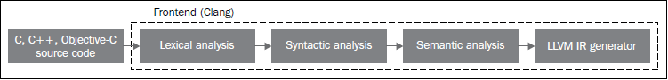
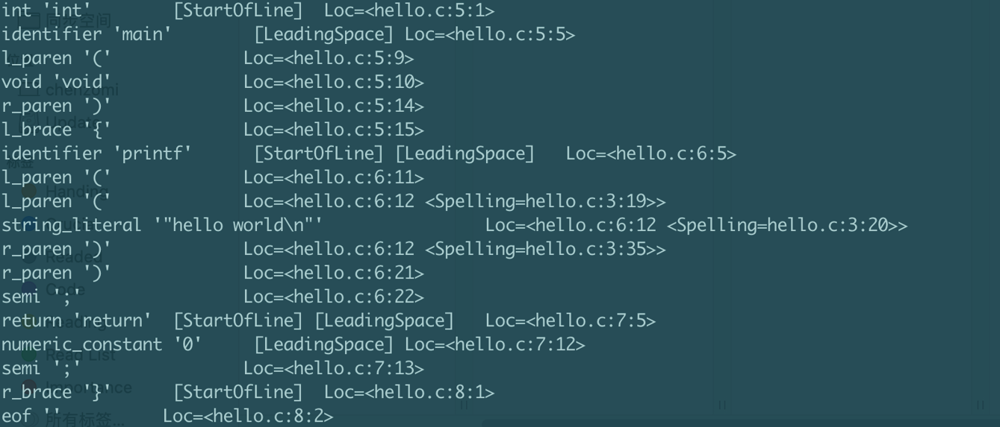
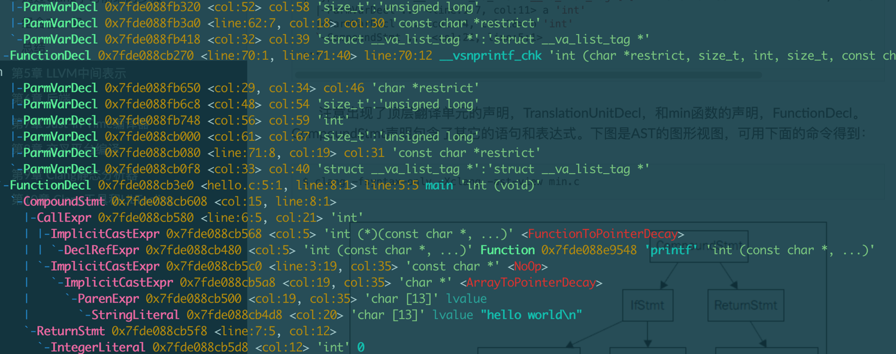
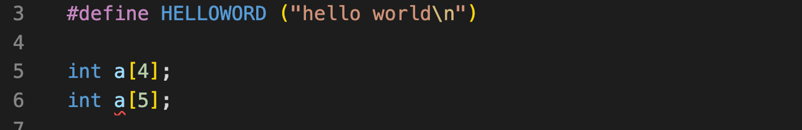
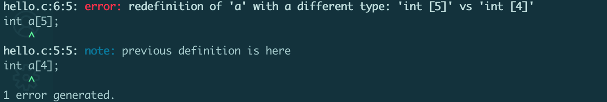
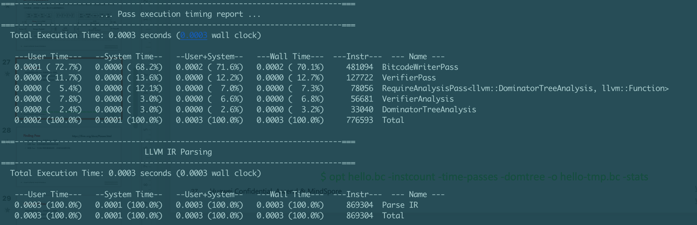

<!--Copyright © ZOMI 适用于[License](https://github.com/chenzomi12/AISystem)版权许可-->

# LLVM 前端和优化层

在上一节讲到了 LLVM 的 IR 贯穿了 LLVM 编译器的全生命周期，里面的每一个箭头都是一个 IR 的过程，这个就是整体 LLVM 最重要的核心概念。

有了 LVM IR 之后这并不意味着 LLVM 或者编译器的整个 Pipeline 都是使用一个单一的 IR，而是在编译的不同阶段会采用不同的数据结构，但总体来说还是会维护一个比较标准的 IR。接下来本节就具体的介绍一下 LLVM 的前端和优化层。

## LLVM 前端

LLVM 的前端其实是把源代码也就是 C,C++,Python 这些高级语言变为编译器的中间表示 LLVM IR 的过程。这个阶段属于代码生成之前的过程，和硬件与目标无关，所以在前端的最后一个环节是 IR 的生成。


Clang 是一个强大的编译器工具，作为 LLVM 的前端承担着将 C、C++和 Objective-C 语言代码转换为 LLVM 中间表示（IR）的任务。

通过 Clang 的三个关键步骤：词法分析、语法分析和语义分析，源代码被逐步转化为高效的中间表示形式，为进一步的优化和目标代码生成做准备。

1. 词法分析：负责将源代码分解为各种标记的流，例如关键字、标识符、运算符和常量等，这些标记构成了编程语言的基本单元。

2. 语法分析：则负责根据编程语言的语法规则，将这些标记流组织成符合语言语法结构的语法树。

3. 语义分析：确保语法树的各部分之间的关系和含义是正确的，比如类型匹配、变量声明的范围等，以确保程序的正确性和可靠性。



每个编程语言前端都会有自己的词法分析器、语法分析器和语义分析器，它们的任务是将程序员编写的源代码转换为通用的抽象语法树（AST），这样可以为后续的处理步骤提供统一的数据结构表示。AST 是程序的一个中间表示形式，它便于进行代码分析、优化和转换。

首先我们编写代码 hello.c，内容如下：

```c
#include <stdio.h>

#define HELLOWORD ("Hello World\n")
int main() {
    printf(HELLOWORD);
    return 0;
}
```

### 词法分析

前端的第一个步骤处理源代码的文本输入，词法分析（lexical analyze）用于标记源代码，将语言结构分解为一组单词和标记，去除注释、空白、制表符等。每个单词或者标记必须属于语言子集，语言的保留字被变换为编译器内部表示。

对 hello.c 文件进行词法分析，执行以下代码：

```shell
clang -cc1 -dump-tokens hello.c
```



编译器会将每一个符号、每一个括号、每一个字符都进行分解，并记录它们出现的位置，每个标记都包含一个 SourceLocation 类的实例，例如通过类似`Loc=<hello.c:6:11>`这样的标记来表示在 hello.c 文件的第 6 行第 11 个位置。通过这样的方式，编译器能够准确地确定每个符号的位置，然后将它们切分成一个个语言的原子，以便进行下一步的分析。

在这个过程中，编译器实际上在对代码进行解析和分析的同时，也在建立起符号与位置的映射关系，这有助于后续的语法分析和语义分析。通过精准记录每个字符的位置信息，编译器能够更好地理解代码的结构，进而更有效地进行编译和优化。

这种精细的位置记录和符号切分过程是编译器中至关重要的一部分，它为编译过程的后续阶段奠定了坚实的基础，也为程序员提供了更准确的编译器信息反馈，帮助他们更好地理解和调试代码。

### 语法分析

分组标记的目的是为了形成语法分析器（Syntactic analyze）可以识别并验证其正确性的数据结构，最终构建出抽象语法树（AST）。通过将代码按照特定规则进行分组，使得语法分析器能够逐级检查每个标记是否符合语法规范。

在分组标记的过程中，可以通过不同的方式对表达式、语句和函数体等不同类型的标记进行分类。这种层层叠加的分组结构可以清晰地展现代码的层次结构，类似于树的概念。对于语法分析器而言，并不需要深入分析代码的含义，只需验证其结构是否符合语法规则。

对 hello.c 文件进行语法分析，执行以下代码：

```shell
clang -fsyntax-only -Xclang -ast-dump hello.c
```



抽象语法树（AST）的每一个节点都有自己的定义，每个节点代表源代码中的一个语法结构，如表达式、语句或声明，节点之间的边表示这些语法结构之间的关系。下图是 AST 的图形视图，可用下面的命令得到：

```shell
clang -fsyntax-only -Xclang -ast-view min.c
```


AST 节点 CompoundStmt 包含 if 和 return 语句，IfStmt 和 ReturnStmt。每次对 a 和 b 的使用都生成一个到 int 类型的 ImplicitCastExpr，如 C 标准的要求。

ASTContext 类包含翻译单元的完整 AST。利用 ASTContext::getTranslationUnitDecl()接口，从顶层 TranslationUnitDecl 实例开始，我们可以访问任何一个 AST 节点。

### 语义分析

语法分析主要关注代码结构是否符合语法规则，而语义分析（Semantic analyze）则负责确保代码的含义和逻辑正确。在语义分析阶段，编译器会检查变量的类型是否匹配、函数调用是否正确、表达式是否合理等，以确保代码在运行时不会出现逻辑错误。

语义分析借助符号表来检验代码是否符合语言类型系统。符号表存储标识符和其对应的类型之间的映射，以及其他必要信息。一种直观的类型检查方法是在解析阶段之后，遍历抽象语法树（AST），同时从符号表中获取关于类型的信息。

语义分析报错案例：



执行

```shell
clang -c hello.c
```

这里的错误源于两个不同的变量用了相同的名字，它们的类型不同。这个错误必须在语义分析时被发现，相应地 Clang 报告了这个问题：



语义分析的主要任务是检查代码的语义是否正确，并确保代码的类型正确。语义分析器检查代码的类型是否符合语言的类型系统，并确保代码的语义正确。

语义分析器的输出是类型无误的 AST，它是编译器后端的输入。

## LLVM 优化层

LLVM 中间表示（IR）是连接前端和后端的中枢，让 LLVM 能够解析多种源语言，为多种目标生成代码。前端产生 IR，而后端接收 IR。IR 也是大部分 LLVM 目标无关的优化发生的地方。

LLVM 优化层在输入的时候是一个 AST 语法树，输出的时候已经是一个 DAG 图

优化层每一种优化的方式叫做 pass，pass 就是对程序做一次遍历

### Pass 类别

优化通常由分析 Pass 和转换 Pass 组成。

- 分析 Pass（Analysis Pass）：分析 Pass 用于分析程序的特定属性或行为而不对程序进行修改。它们通常用于收集程序的信息或执行静态分析，以便其他 Pass 可以使用这些信息进行进一步的优化。分析 Pass 通常是只读的，不会修改程序代码。

- 转换 Pass（Transformation Pass）：转换 Pass 用于修改程序代码以进行优化或重构。它们会改变程序的结构或行为，以改善性能或满足特定的需求。转换 Pass 通常会应用各种优化技术来重写程序的部分或整体，以产生更高效的代码。

分析 Pass 用于收集信息和了解程序的行为，而转换 Pass 则用于修改程序以实现优化或修改功能。在 LLVM 中，这两种 Pass 通常结合使用，以实现对程序进行全面优化和改进。

优化过程需要执行以下代码：

```shell
opt hello.bc -instcount -time-passes -domtree -o hello-tmp.bc -stats
```



在上述过程中有很多不同阶段的 pass 而组成，主要有：

- 以 ADCE（Aggressive Dead Code Elimination）为例：ADCE 是 Analysis Pass 类似死代码消除(Dead Code Elimination)，它会分析代码中是否存在冗余的计算，如果存在，则将冗余的计算消除掉。

- 以 MDGC（Merged Duplicates Global Constant）为例：MDGC 是 Transform Pass，它会合并多个全局常量，以减少内存占用。

### Pass 依赖类型

在转换 Pass 和分析 Pass 之间，有两种主要的依赖类型：

1. **显式依赖**

转换 Pass 需要一种分析，则 Pass 管理器自动地安排它所依赖的分析 Pass 在它之前运行。如果运行单个 Pass，它依赖其它 Pass，则 Pass 管理器会自动地安排必需的 Pass 在它之前运行。

```shell
DominatorTree &DT getAnalysis<DominatorTree>(Func);
```

在上面的例子 mdgc 中，分析 pass 会分析有多少全局常量，然后转换 pass 会将这些常量合并。

2. **隐式依赖**

转换或者分析 Pass 要求 IR 代码运用特定表达式。需要手动地以正确的顺序把这个 Pass 加到 Pass 队列中，通过命令行工具(clang 或者 opt)或者 Pass 管理器。

### Pass API

Pass 类是实现优化的主要资源。然而，我们从不直接使用它，而是通过清楚的子类使用它。当实现一个 Pass 时，你应该选择适合你的 Pss 的最佳粒度，适合此粒度的最佳子类，例如基于函数、模块、循环、强联通区域，等等。常见的这些子类如下：

- ModulePass：这是最通用的 Pass；它一次分析整个模块，函数的次序不确定。它不限定使用者的行为，允许删除函数和其它修改。为了使用它，你需要写一个类继承 ModulePass，并重载 runOnModule()方法。

- FunctionPass：这个子类允许一次处理一个函数，处理函数的次序不确定。这是应用最多的 Pass 类型。它禁止修改外部函数、删除函数、删除全局变量。为了使用它，需要写一个它的子类，重载 runOnFunction()方法。

- BasicBlockPass：这个类的粒度是基本块。FunctionPass 类禁止的修改在这里也是禁止的。它还禁止修改或者删除外部基本块。使用者需要写一个类继承 BasicBlockPass，并重载它的 runOnBasicBlock()方法。

## 总结

- LLVM 的前端负责将源代码转换为 LLVM IR，相当于一个解释器，将高级程序语句转换成机器码的过程。
- LLVM 的优化层类似编译器，负责对 LLVM IR 进行优化，即将人可读的 LLVM IR 代码转换成性能更高的代码。
- Pass 是针对 LLVM IR 的一次完整扫描或处理，类似于编译器中的处理过程。
- LLVM IR 是编译器中的中间表示，负责串联起前端和优化层，相当于编译器中的中间数据结构。

如果你想要自己实现一个 pass，可以参考 LLVM 的官方文档 pass[<sup>2</sup>](#ref2)。

## 本节视频

<html>
<iframe src="https://player.bilibili.com/player.html?aid=390513023&bvid=BV1vd4y1t7vS&cid=903052026&p=1&as_wide=1&high_quality=1&danmaku=0&t=30&autoplay=0" width="100%" height="500" scrolling="no" border="0" frameborder="no" framespacing="0" allowfullscreen="true"> </iframe>
</html>

## 引用

1. https://llvm.org/docs/Passes.html

2. https://getting-started-with-llvm-core-libraries-zh-cn.readthedocs.io/zh-cn/latest/ch04.html
