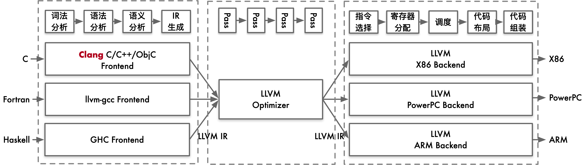
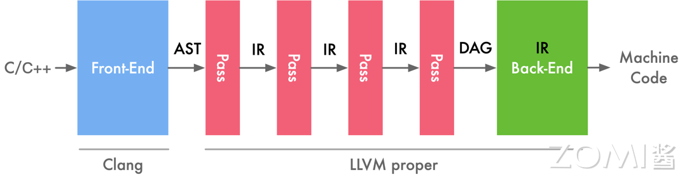

<!--Copyright © ZOMI 适用于[License](https://github.com/chenzomi12/AISystem)版权许可-->

# LLVM IR 基本概念

在上一节中，我们已经简要介绍了 LLVM 的基本概念和架构，我们现在将更深入地研究 LLVM 的 IR（中间表示）的概念。

了解 LLVM IR 的重要性是为了能够更好地理解编译器的运作原理，以及在编译过程中 IR 是如何被使用的。LLVM IR 提供了一种抽象程度适中的表示形式，同时能够涵盖绝大多数源代码所包含的信息，这使得编译器能够更为灵活地操作和优化代码。

本节将进一步探究 LLVM IR 的不同表示形式，将有助于我们更好地理解代码在编译器中是如何被处理和转换的。

## LLVM IR 概述

编译器常见的作用是将源高级语言的代码编译到某种中间表示（Intermediate Representation，一般称为 IR），然后再将 IR 翻译为目标体系结构（具体硬件比如 MIPS 或 X86）的汇编语言或者硬件指令。

LLVM IR 提供了一种抽象层，使程序员可以更灵活地控制程序的编译和优化过程，同时保留了与硬件无关的特性。通过使用 LLVM IR，开发人员可以更好地理解程序的行为，提高代码的可移植性和性能优化的可能性。

### LLVM 基本架构

目前常见的编译器都分为了三个部分，前端（Frontend），优化层（Optimizeation）以及后端（Backend），每一部分都承担了不同的功能：

- 前端：负责将高级源语言代码转换为 LLVM 的中间表示（IR），为后续的编译阶段打下基础。

- 优化层：对生成的中间表示 IR 进行深入分析和优化，提升代码的性能和效率。

- 后端：将优化后的中间表示 IR 转换成目标机器的特定语言，确保代码能够在特定硬件上高效运行。

这种分层的方法不仅提高了编译过程的模块化，还使得编译器能够更灵活地适应不同的编程语言和目标平台。同理，LLVM 也是按照这一结构设计进行架构设计：



在 LLVM 中不管是前端、优化层、还是后端都有大量的 IR，使得 LLVM 的模块化程度非常高，可以大量的复用一些相同的代码，非常方便的集成到不同的 IDE 和编译器当中。

经过中间表示 IR 这种做法相对于直接将源代码翻译为目标体系结构的好处主要有两个：

1. 有一些优化技术是目标平台无关的，我们只需要在 IR 上做这些优化，再翻译到不同的汇编，这样就能够在所有支持的体系结构上实现这种优化，这大大的减少了开发的工作量。

2. 其次，假设我们有 m 种源语言和 n 种目标平台，如果我们直接将源代码翻译为目标平台的代码，那么我们就需要编写 m * n 个不同的编译器。然而，如果我们采用一种 IR 作为中转，先将源语言编译到这种 IR ，再将这种 IR 翻译到不同的目标平台上，那么我们就只需要实现 m + n 个编译器。

值得注意的是，LLVM 并非使用单一的 IR 进行表达，前端传给优化层时传递的是一种抽象语法树（Abstract Syntax Tree，AST）的 IR。因此 IR 是一种抽象表达，没有固定的形态。



抽象语法树的作用在于牢牢抓住程序的脉络，从而方便编译过程的后续环节（如代码生成）对程序进行解读。AST 就是开发者为语言量身定制的一套模型，基本上语言中的每种结构都与一种 AST 对象相对应。

在中端优化完成之后会传一个 DAG 图的 IR 给后端，DAG 图能够非常有效的去表示硬件的指定的顺序。

> DAG（Directed Acyclic Graph，有向无环图）是图论中的一种数据结构，它是由顶点和有向边组成的图，其中顶点之间的边是有方向的，并且图中不存在任何环路（即不存在从某个顶点出发经过若干条边之后又回到该顶点的路径）。
>
> 在计算机科学中，DAG 图常常用于描述任务之间的依赖关系，例如在编译器和数据流分析中。DAG 图具有拓扑排序的特性，可以方便地对图中的节点进行排序，以确保按照依赖关系正确地执行任务。

编译的不同阶段会产生不同的数据结构和中间表达，如前端的抽象语法树（AST）、优化层的 DAG 图、后端的机器码等。后端优化时 DAG 图可能又转为普通的 IR 进行优化，最后再生产机器码。

### LLVM IR 表示形式

LLVM IR 具有三种表示形式，这三种中间格式是完全等价的：

- 在内存中的编译中间语言（无法通过文件的形式得到的指令类等）

- 在硬盘上存储的二进制中间语言（格式为.bc）

- 人类可读的代码语言（格式为.ll）

接下来我们就看一下具体的 .ll 文件格式。

## LLVM IR 示例与语法

### 示例程序

我们编写一个简单的 C 语言程序，并将其编译为 LLVM IR。

test.c 文件内容如下：

```c
#include <stdio.h>

void test(int a, int b)
{
    int c = a + b;
}

int main(void)
{
    int a = 10;
    int b = 20;
    test(a, b);
    return 0;
}
```

接下来我们使用 Clang 编译器将 C 语言源文件 test.c 编译成 LLVM 格式的中间代码。具体参数的含义如下：

- clang：Clang 编译器
- -S：生成汇编代码而非目标文件
- -emit-llvm：生成 LLVM IR 中间代码
- .\test.c：要编译的 C 语言源文件

```shell
clang -S -emit-llvm .\test.c
```

在 LLVM IR 中，所生成的 .ll 文件的基本语法为：

1. 指令以分号 `;` 开头表示注释
2. 全局表示以 `@` 开头，局部变量以 `%` 开头
3. 使用 `define` 关键字定义函数，在本例中定义了两个函数：`@test` 和 `@main`
4. `alloca` 指令用于在堆栈上分配内存，类似于 C 语言中的变量声明
5. `store` 指令用于将值存储到指定地址
6. `load` 指令用于加载指定地址的值
7. `add` 指令用于对两个操作数进行加法运算
8. `i32` 32 位 4 个字节的意思
9. `align` 字节对齐
10. `ret` 指令用于从函数返回

编译完成后，生成的 test.ll 文件内容如下：

```llvm
; ModuleID = '.\test.c'
source_filename = ".\\test.c"
target datalayout = "e-m:w-p270:32:32-p271:32:32-p272:64:64-i64:64-f80:128-n8:16:32:64-S128"
target triple = "x86_64-w64-windows-gnu"

; Function Attrs: noinline nounwind optnone uwtable
define dso_local void @test(i32 noundef %0, i32 noundef %1) #0 { ;定义全局函数@test(a,b)
  %3 = alloca i32, align 4 ; 局部变量 c
  %4 = alloca i32, align 4 ; 局部变量 d
  %5 = alloca i32, align 4 ; 局部变量 e
  store i32 %0, ptr %3, align 4 ; %0 赋值给%3 c=a
  store i32 %1, ptr %4, align 4 ; %1 赋值给%4 d=b
  %6 = load i32, ptr %3, align 4 ; 读取%3，值给%6 就是参数 a
  %7 = load i32, ptr %4, align 4 ; 读取%4，值给%7 就是参数 b
  %8 = add nsw i32 %6, %7
  store i32 %8, ptr %5, align 4 ; 参数 %8 赋值给%5 e 就是转换前函数写的 int c 变量
  ret void
}

; Function Attrs: noinline nounwind optnone uwtable
define dso_local i32 @main() #0 {
  %1 = alloca i32, align 4
  %2 = alloca i32, align 4
  %3 = alloca i32, align 4
  store i32 0, ptr %1, align 4
  store i32 10, ptr %2, align 4
  store i32 20, ptr %3, align 4
  %4 = load i32, ptr %2, align 4
  %5 = load i32, ptr %3, align 4
  call void @test(i32 noundef %4, i32 noundef %5)
  ret i32 0
}

attributes #0 = { noinline nounwind optnone uwtable "min-legal-vector-width"="0" "no-trapping-math"="true" "stack-protector-buffer-size"="8" "target-cpu"="x86-64" "target-features"="+cmov,+cx8,+fxsr,+mmx,+sse,+sse2,+x87" "tune-cpu"="generic" }

!llvm.module.flags = !{!0, !1, !2, !3}
!llvm.ident = !{!4}

!0 = !{i32 1, !"wchar_size", i32 2}
!1 = !{i32 8, !"PIC Level", i32 2}
!2 = !{i32 7, !"uwtable", i32 2}
!3 = !{i32 1, !"MaxTLSAlign", i32 65536}
!4 = !{!"(built by Brecht Sanders, r4) clang version 17.0.6"}
```

以上程序中包含了两个函数：`@test` 和 `@main`。`@test` 函数接受两个整型参数并计算它们的和，将结果存储在一个局部变量中。`@main` 函数分配三个整型变量的内存空间，然后分别赋予初始值，并调用 `@test` 函数进行计算。最后 `@main` 函数返回整数值 0。

程序的完整执行流程如下：

1. 在 `@main` 函数中，首先分配三个整型变量的内存空间 %1，%2，%3，分别存储 0，10，20
2. 接下来加载 %2 和 %3 的值，将 10 和 20 作为参数调用 `@test` 函数
3. 在 `@test` 函数中，分别将传入的参数 %0 和 %1 存储至本地变量 %3 和 %4 中
4. 然后加载 %3 和 %4 的值，进行加法操作，并将结果存储至 %5 中
5. 最后，程序返回整数值 0

LLVM IR 的代码和 C 语言编译生成的代码在功能实现上具有完全相同的特性。.ll 文件作为 LLVM IR 的一种中间语言，可以通过 LLVM 编译器将其转换为机器码，从而实现计算机程序的执行。

### 基本语法

除了上述示例代码中涉及到的基本语法外，LLVM IR 作为中间语言也同样有着条件语句、循环体和对指针操作的语法规则。

1. 条件语句

例如以下 C 语言代码：

```C
#include <stdio.h>
 
int main()
{
   int a = 10;
   if(a%2 == 0)
	   return 0;
   else 
	   return 1;
}
```

在经过编译后的 .ll 文件的内容如下所示：

```llvm
define i32 @main() #0 {
entry:
  %retval = alloca i32, align 4
  %a = alloca i32, align 4
  store i32 0, i32* %retval, align 4
  store i32 10, i32* %a, align 4
  %0 = load i32, i32* %a, align 4
  %rem = srem i32 %0, 2
  %cmp = icmp eq i32 %rem, 0
  br i1 %cmp, label %if.then, label %if.else

if.then:                                          ; preds = %entry
  store i32 0, i32* %retval, align 4
  br label %return

if.else:                                          ; preds = %entry
  store i32 1, i32* %retval, align 4
  br label %return

return:                                           ; preds = %if.else, %if.then
  %1 = load i32, i32* %retval, align 4
  ret i32 %1
}
```

`icmp` 指令是根据比较规则，比较两个操作数，将比较的结果以布尔值或者布尔值向量返回，且对于操作数的限定是操作数为整数或整数值向量、指针或指针向量。其中，eq 是比较规则，%rem 和 0 是操作数，i32 是操作数类型，比较 %rem 与 0 的值是否相等，将比较的结果存放到 %cmp 中。

`br` 指令有两种形式，分别对应于条件分支和无条件分支。该指令的条件分支在形式上接受一个“i1”值和两个“label”值，用于将控制流传输到当前函数中的不同基本块，上面这条指令是条件分支，类似于 c 中的三目条件运算符 `< expression ？Statement：statement>`；无条件分支的话就是不用判断，直接跳转到指定的分支，类似于 c 中 goto ，比如说这个就是无条件分支 br label %return。`br i1 %cmp, label %if.then, label %if.else` 指令的意思是，i1 类型的变量 %cmp 的值如果为真，执行 `if.then` 否则执行 `if.else`。

2. 循环体

例如以下 C 程序代码：

```C
#include <stdio.h>
 
int main()
{
   int a = 0, b = 1;
   while(a < 5)
   {
	   a++;
	   b *= a;
   }
   return b;
}
```

在经过编译后的 .ll 文件的内容如下所示：

```llvm
define i32 @main() #0 {
entry:
  %retval = alloca i32, align 4
  %a = alloca i32, align 4
  %b = alloca i32, align 4
  store i32 0, i32* %retval, align 4
  store i32 0, i32* %a, align 4
  store i32 1, i32* %b, align 4
  br label %while.cond

while.cond:                                       ; preds = %while.body, %entry
  %0 = load i32, i32* %a, align 4
  %cmp = icmp slt i32 %0, 5
  br i1 %cmp, label %while.body, label %while.end

while.body:                                       ; preds = %while.cond
  %1 = load i32, i32* %a, align 4
  %inc = add nsw i32 %1, 1
  store i32 %inc, i32* %a, align 4
  %2 = load i32, i32* %a, align 4
  %3 = load i32, i32* %b, align 4
  %mul = mul nsw i32 %3, %2
  store i32 %mul, i32* %b, align 4
  br label %while.cond

while.end:                                        ; preds = %while.cond
  %4 = load i32, i32* %b, align 4
  ret i32 %4
}
```

对比 if 语句可以发现，while 中几乎没有新的指令出现，所以说所谓的 while 循环，也就是“跳转+分支”这一结构。同理，for 循环也可以由“跳转+分支”这一结构构成。

3. 指针

例如以下 C 程序代码：

```C
int main(){
	int i = 10;
	int* pi = &i;
	printf("i 的值为：%d",i);
	printf("*pi 的值为：%d",*pi);
	printf("&i 的地址值为：",%d);
	printf("pi 的地址值为：",%d);
}
```

在经过编译后的 .ll 文件的内容如下所示：

```llvm
@.str = private unnamed_addr constant [16 x i8] c"i\E7\9A\84\E5\80\BC\E4\B8\BA\EF\BC\9A%d\00", align 1
@.str.1 = private unnamed_addr constant [18 x i8] c"*pi\E7\9A\84\E5\80\BC\E4\B8\BA\EF\BC\9A%d\00", align 1
@.str.2 = private unnamed_addr constant [23 x i8] c"&i\E7\9A\84\E5\9C\B0\E5\9D\80\E5\80\BC\E4\B8\BA\EF\BC\9A%p\00", align 1
@.str.3 = private unnamed_addr constant [23 x i8] c"pi\E7\9A\84\E5\9C\B0\E5\9D\80\E5\80\BC\E4\B8\BA\EF\BC\9A%p\00", align 1

define i32 @main(){
entry:
  %i = alloca i32, align 4
  %pi = alloca i32*, align 8
  store i32 10, i32* %i, align 4
  store i32* %i, i32** %pi, align 8
  
  %0 = load i32, i32* %i, align 4
  %call = call i32 (i8*, ...) @printf(i8* getelementptr inbounds ([16 x i8], [16 x i8]* @.str, i32 0, i32 0), i32 %0)
  %1 = load i32, i32* %i, align 4
  %call1 = call i32 (i8*, ...) @printf(i8* getelementptr inbounds ([18 x i8], [18 x i8]* @.str.1, i32 0, i32 0), i32 %1)
  
  %call2 = call i32 (i8*, ...) @printf(i8* getelementptr inbounds ([23 x i8], [23 x i8]* @.str.2, i32 0, i32 0), i32* %i)
  %2 = load i32*, i32** %pi, align 8
  %call3 = call i32 (i8*, ...) @printf(i8* getelementptr inbounds ([23 x i8], [23 x i8]* @.str.3, i32 0, i32 0), i32* %2)
  ret i32 0
}

declare i32 @printf(i8*, ...)
```

对指针的操作就是指针的指针，开辟一块指针类型的内存，里面放个指针`%pi = alloca i32*, align 8

## 小结与思考
    
- LLVM IR 表示形式：LLVM IR 是一种中间表示形式，类似汇编语言但更抽象，用于表示高级语言到机器码的转换过程。
    
- LLVM IR 基本语法：LLVM IR 使用类似文本的语法表示，包括指令、注释、变量声明等内容。
    
- LLVM IR 指令集：LLVM IR 包含一系列指令用于描述计算、内存访问、分支等操作，能够表示复杂的算法和数据流。
    
## 本节视频

<html>
<iframe src="https://player.bilibili.com/player.html?aid=305431124&bvid=BV1PP411u7NR&cid=900781834&p=1&as_wide=1&high_quality=1&danmaku=0&t=30&autoplay=0" width="100%" height="500" scrolling="no" border="0" frameborder="no" framespacing="0" allowfullscreen="true"> </iframe>
</html>

