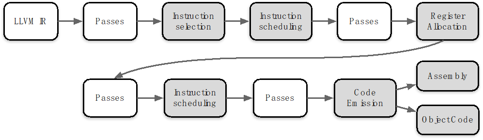
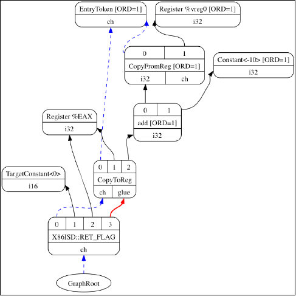
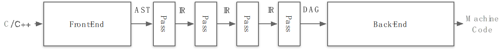
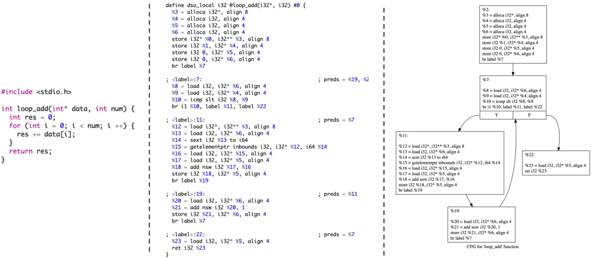
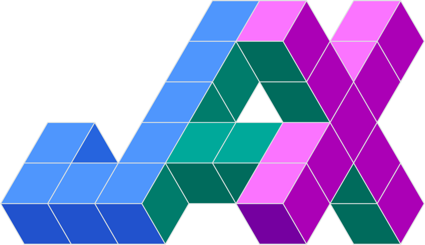

# LLVM后端代码生成

上一节主要讲了LLVM的前端和优化层，前端主要对高级语言做一些词法的分析，把高级语言的特性转变为token，再交给语法分析对代码的物理布局进行判别，之后交给语义分析对代码的的逻辑进行检查。优化层则是对代码进行优化，比如常量折叠、死代码消除、循环展开、内存分配优化等。

本节将介绍LLVM后端的生成代码过程，LLVM后端的作用主要是将优化后的代码生成目标代码，目标代码可以是汇编语言、机器码。

## Cortogen 

LLVM的后端是与特定硬件平台紧密相关的部分，它负责将经过优化的LLVM IR转换成目标代码，这个过程也被称为代码生成（Codegen）。不同硬件平台的后端实现了针对该平台的专门化指令集，例如ARM后端实现了针对ARM架构的汇编指令集，X86后端实现了针对X86架构的汇编指令集，PowerPC后端实现了针对PowerPC架构的汇编指令集。

在代码生成过程中，LLVM后端会根据目标硬件平台的特性和要求，将LLVM IR转换为适合该平台的机器码或汇编语言。这个过程涉及到指令选择（Instruction Selection）、寄存器分配（Register Allocation）、指令调度（Instruction Scheduling）等关键步骤，以确保生成的目标代码在目标平台上能够高效运行。

LLVM的代码生成能力使得开发者可以通过统一的编译器前端（如Clang）生成针对不同硬件平台的优化代码，从而更容易实现跨平台开发和优化。同时，LLVM后端的可扩展性也使得它能够应对新的硬件架构和指令集的发展，为编译器技术和工具链的进步提供了强大支持。

## LLVM Backend Pass
整个后端流水线涉及到四种不同层次的指令表示，包括：

- 内存中的LLVM IR：LLVM中间表现形式，提供了高级抽象的表示，用于描述程序的指令和数据流。

- SelectionDAG节点：在编译优化阶段生成的一种抽象的数据结构，用以表示程序的计算过程，帮助优化器进行高效的指令选择和调度。

- Machinelnstr：机器相关的指令格式，用于描述特定目标架构下的指令集和操作码。

- MCInst：机器指令，是具体的目标代码表示，包含了特定架构下的二进制编码指令。

在将LLVM IR转化为目标代码需要非常多的步骤，其Pipeline如下图所示：

LLVM IR会变成和后端非常很接近的一些指令、函数、全局变量和寄存器的具体表示，流水线越向下就越接近实际硬件的目标指令。其中白色的pass是非必要pass，灰色的pass是必要pass,也叫做Super Path

### Instruction Selection指令选择

- 内存中LLVM IR变换为目标特定SelectionDAG节点；
- 每个DAG能够表示单一基本块的计算；
- DAG图中的节点表示具体执行的指令，而边编码了指令间的数据流依赖关系；
- 目标是让LLVM代码生成程序库能够运用基于树的模式匹配指令选择算法。

以上是一个SelectionDAG节点的例子
- 红色线：红色连接线主要用于强制相邻的节点在执行时紧挨着，表示这些节点之间必须没有其他指令。
- 蓝色虚线：蓝色虚线连接代表非数据流链，用以强制两条指令的顺序，否则它们就是不相关的。

### Instruction Scheduling指令调度

- 第1次指令调度(Instruction Scheduling),也称为前寄存器分配(RA)调度；
- 对指令(节点)进行排序，同时尝试发现尽可能多的指令层次的并行；
- 指令将被转换为三地址表示的MachineInstr。

### Register Allocation寄存器分配

- LLVMIR两个重要的特性之一：LLVM IR寄存器集是无限；这个性质一直保持着，直到寄存器分配(Register Allocation);
- 寄存器分配的基本任务是将无限数量的虚拟寄存器转换为有限的物理寄存器；
- 编译器会使用挤出（spill）策略将某些寄存器的内容存储到内存中。
- 寄存器分配算法有很多，比如Greedy Register Allocation,Iterated Register Coalescing,Graph Coloring,和基于图的寄存器分配算法。

### Instruction Scheduling指令调度

- 第2次指令调度，也称为后寄存器分配(RA)调度；
- 此时可获得真实的寄存器信息，某些类型寄存器存在延迟，它们可被用以改进指令顺序。

若上一步分析中寄存器不足，或者存在计算延迟的风险时可以通过指令的调度改变指令的顺序

### Code Emission代码输出

- 代码输出阶段将指令从MachineInstr表示变换为MCInst实例；
- 新的表示更适合汇编器和链接器，可以输出汇编代码或者输出二进制块特定目标代码格式。

## LLVM编译器全流程

编译器工作流程概述:

在高级语言 C/C++ 编译过程中，源代码经历了多个重要阶段，从词法分析到生成目标代码。整个过程涉及前端和后端的多个步骤，并通过中间表示（IR）在不同阶段对代码进行转换、优化和分析。

1. 前端阶段  
词法分析（Lexical Analysis）：源代码被分解为词法单元，如标识符、关键字和常量。  
语法分析（Syntax Analysis）：词法单元被组织成语法结构，构建抽象语法树（AST）。  
语义分析（Semantic Analysis）：AST被分析以确保语义的正确性和一致性。
2. 中间表示（IR）阶段  
将AST转化为中间表示（IR），采用SSA形式的三地址指令表示代码结构。  
通过多段pass进行代码优化，包括常量传播、死代码消除、循环优化等，以提高代码性能和效率。  
IR进一步转化为DAG图，其中每个节点代表一个指令，边表示数据流动。
3. 后端阶段  
指令选择（Instruction Selection）：根据目标平台特性选择合适的指令。  
寄存器分配（Register Allocation）：分配寄存器以最大程度减少内存访问。  
指令调度（Instruction Scheduling）：优化指令执行顺序以减少延迟。  
最终生成目标代码，用于目标平台的执行。

Pass管理:  

在编译器的每个模块和pass均可通过pass manager进行管理，可以动态添加、删除或调整pass来优化编译过程中的各个阶段。

## 基于LLVM的项目

### Chris Lattner
Youtube上LLVM之父Chris Lattner:编译器的黄金时代[1](#ref1)

之后Chris Lattner创建了Modular[2](#ref2),目标是重建全球ML基础设施，包括编译器、运行时，异构计算、边缘到数据中心并重
并专注于可用性，提升开发人员的效率。

### XLA：优化机器学习编译器[3](#ref3)

XLA(加速线性代数)是Google推出的一种针对特定领域的线性代数编译器，能够加快TensorFlow模型的运行速度，而且可能完全不需要更改源代码。

TensorFlow中大部分代码和算子都是通过XLA编译的，XLA的底层就是LLVM，所以XLA可以利用到LLVM的很多特性，比如优化、代码生成、并行计算等。

### JAX:高性能的数值计算库[4](#ref4)

JAX是Autograd和XLA的结合，JAX本身不是一个深度学习的框架，他是一个高性能的数值计算库，更是结合了可组合的函数转换库，用于高性能机器学习研究。

### TensorFlow:机器学习平台[5](#ref5)

TensorFlow是一个端到端开源机器学习平台。它拥有一个全面而灵活的生态系统，其中包含各种工具、库和社区资源，可助力研究人员推动先进机器学习技术。

TensorFlow可以更好的应用于工业生产环境，因为它可以利用到硬件加速器，并提供可靠的性能。

### TVM到端深度学习编译器[6](#ref6)

为了使得各种硬件后端的计算图层级和算子层级优化成为可能，TVM从现有框架中取得DL程序的高层级表示，并产生多硬件平台后端上低层级的优化代码，其目标是展示与人工调优的竞争力。

### Julia:面向科学计算的高性能动态编程语言[7](#ref7)

在其计算中，Julia使用LLVM JIT编译。LLVM JIT编译器通常不断地分析正在执行的代码，并且识别代码的一部分，使得从编译中获得的性能加速超过编译该代码的性能开销。

## 总结

本节介绍了LLVM后端的生成代码过程，LLVM后端的作用主要是将优化后的代码生成目标代码，目标代码可以是汇编语言、机器码。LLVM后端的生成过程包括指令选择、寄存器分配、指令调度、代码输出等步骤，这些步骤都可以被不同的后端实现。

LLVM后端的可扩展性使得它能够应对新的硬件架构和指令集的发展，为编译器技术和工具链的进步提供了强大支持。同时，LLVM的前端和优化层也为开发者提供了统一的编译器前端，使得开发者可以更容易实现跨平台开发和优化。基于LLVM的项目包括Chris Lattner的Modular、XLA、JAX、TensorFlow、TVM、Julia等。

## 引用

1.<a id="ref1"  href="https://www.youtube.com/watch?v=4HgShra-KnY">https://www.youtube.com/watch?v=4HgShra-KnY</a>

2.<a id="ref2"  href="https://www.modular.com/">https://www.modular.com</a>

3.<a id="ref3"  href="https://scottamain.github.io/xla">https://scottamain.github.io/xla</a>

4.<a id="ref4"  href="https://jax.readthedocs.io">https://jax.readthedocs.io</a>

5.<a id="ref5"  href="https://www.tensorflow.org">https://www.tensorflow.org</a>

6.<a id="ref6"  href="https://tvm.apache.org/">https://tvm.apache.org/</a>

7.<a id="ref7"  href="https://julialang.org/">https://julialang.org/</a>

## 本节视频

<html>
<iframe src="https:&as_wide=1&high_quality=1&danmaku=0&t=30&autoplay=0" width="100%" height="500" scrolling="no" border="0" frameborder="no" framespacing="0" allowfullscreen="true"> </iframe>
</html>
