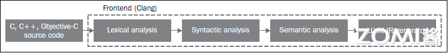
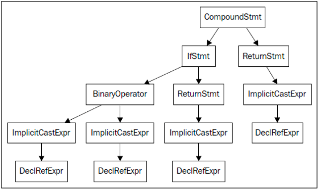

<!--Copyright © ZOMI 适用于[License](https://github.com/chenzomi12/AISystem)版权许可-->

# LLVM 前端和优化层

在上一节讲到了 LLVM 的 IR 贯穿了 LLVM 编译器的全生命周期，里面的每一个箭头都是一个 IR 的过程，这个就是整体 LLVM 最重要的核心概念。

有了 LVM IR 之后这并不意味着 LLVM 或者编译器的整个 Pipeline 都是使用一个单一的 IR，而是在编译的不同阶段会采用不同的数据结构，但总体来说还是会维护一个比较标准的 IR。接下来本节就具体的介绍一下 LLVM 的前端和优化层。

## LLVM 前端 - Clang

LLVM 的前端其实是把源代码也就是 C、C++、Python 这些高级语言变为编译器的中间表示 LLVM IR 的过程。

这个阶段属于代码生成之前的过程，和硬件与目标无关，所以在前端的最后一个环节是 IR 的生成


Clang 是一个强大的编译器工具，作为 LLVM 的前端承担着将 C、C++ 和 Objective-C 语言代码转换为 LLVM 中间表示（IR）的任务。

通过 Clang 的三个关键步骤：词法分析、语法分析和语义分析，源代码被逐步转化为高效的中间表示形式，为进一步的优化和目标代码生成做准备。

- 词法分析阶段负责将源代码分解为各种标记的流，例如关键字、标识符、运算符和常量等，这些标记构成了编程语言的基本单元。

- 语法分析器则负责根据编程语言的语法规则，将这些标记流组织成符合语言语法结构的语法树。

- 语义分析阶段则确保语法树的各部分之间的关系和含义是正确的，比如类型匹配、变量声明的范围等，以确保程序的正确性和可靠性。



每个编程语言前端都会有自己的词法分析器、语法分析器和语义分析器，它们的任务是将程序员编写的源代码转换为通用的抽象语法树（AST），这样可以为后续的处理步骤提供统一的数据结构表示。AST 是程序的一个中间表示形式，它便于进行代码分析、优化和转换。

### 词法分析

前端的第一个步骤处理源代码的文本输入，词法分析 lexical analyze 用于标记源代码，将语言结构分解为一组单词和标记，去除注释、空白、制表符等。每个单词或者标记必须属于语言子集，语言的保留字被变换为编译器内部表示。

首先我们编写代码 hello.c，内容如下：

```C++
#include <stdio.h>

#define HELLOWORD ("Hello World\n")
int main() {
    printf(HELLOWORD);
    return 0;
}
```

对 hello.c 文件进行词法分析，执行以下代码： 

```shell
clang -cc1 -dump-tokens hello.c
```

词法分析输出如下：

```
int 'int'        [StartOfLine]  Loc=<hello.c:5:1>
identifier 'main'        [LeadingSpace] Loc=<hello.c:5:5>
l_paren '('             Loc=<hello.c:5:9>
void 'void'             Loc=<hello.c:5:10>
r_paren ')'             Loc=<hello.c:5:14>
l_brace '{'             Loc=<hello.c:5:15>
identifier 'printf'      [StartOfLine] [LeadingSpace]   Loc=<hello.c:6:5>
l_paren '('             Loc=<hello.c:6:11>
l_paren '('             Loc=<hello.c:6:12 <Spelling=hello.c:3:19>>
string_literal '"hello world\n"'                Loc=<hello.c:6:12 <Spelling=hello.c:3:20>>
r_paren ')'             Loc=<hello.c:6:12 <Spelling=hello.c:3:35>>
r_paren ')'             Loc=<hello.c:6:21>
semi ';'                Loc=<hello.c:6:22>
return 'return'  [StartOfLine] [LeadingSpace]   Loc=<hello.c:7:5>
numeric_constant '0'     [LeadingSpace] Loc=<hello.c:7:12>
semi ';'                Loc=<hello.c:7:13>
r_brace '}'      [StartOfLine]  Loc=<hello.c:8:1>
eof ''          Loc=<hello.c:8:2>
```

编译器通过词法分析过程将源代码解析为一系列符号，并准确记录它们在源文件中的位置。每个符号都被赋予一个 `SourceLocation` 类的实例，以便表示其在源文件中的确切位置，例如 `Loc=<hello.c:6:11>` 表示该符号出现在文件 hello.c 的第 6 行第 11 个位置。这种位置信息的精确记录为后续的语法分析和语义分析提供了重要的基础。

词法分析过程同时也在建立符号与位置之间的映射关系。这种精细的位置记录有助于编译器更好地理解代码的结构，并能够更有效地进行编译和优化。此外，它为程序员提供了更准确的编译器信息反馈，帮助他们更好地理解和调试代码。

在编译器的工作流程中，这种精准的位置记录和符号切分过程至关重要，为后续阶段的处理提供了可靠的基础，也为代码分析提供了更深层次的支持。

### 语法分析

分组标记的目的是为了形成语法分析器（Syntactic Analyze）可以识别并验证其正确性的数据结构，最终构建出抽象语法树（AST）。通过将代码按照特定规则进行分组，使得语法分析器能够逐级检查每个标记是否符合语法规范。

在分组标记的过程中，可以通过不同的方式对表达式、语句和函数体等不同类型的标记进行分类。这种层层叠加的分组结构可以清晰地展现代码的层次结构，类似于树的概念。对于语法分析器而言，并不需要深入分析代码的含义，只需验证其结构是否符合语法规则。

对 hello.c 文件进行语法分析，执行以下代码：

```shell
clang -fsyntax-only -Xclang -ast-dump hello.c
```

语法分析输出如下：

```shell
TranslationUnitDecl 0x1c08a71cf28 <<invalid sloc>> <invalid sloc>
|-TypedefDecl 0x1c08a71d750 <<invalid sloc>> <invalid sloc> implicit __int128_t '__int128'
| `-BuiltinType 0x1c08a71d4f0 '__int128'
|-TypedefDecl 0x1c08a71d7c0 <<invalid sloc>> <invalid sloc> implicit __uint128_t 'unsigned __int128'
| `-BuiltinType 0x1c08a71d510 'unsigned __int128'
|-TypedefDecl 0x1c08a71dac8 <<invalid sloc>> <invalid sloc> implicit __NSConstantString 'struct __NSConstantString_tag'
| `-RecordType 0x1c08a71d8a0 'struct __NSConstantString_tag'
|   `-Record 0x1c08a71d818 '__NSConstantString_tag'
|-TypedefDecl 0x1c08a71db60 <<invalid sloc>> <invalid sloc> implicit __builtin_ms_va_list 'char *'
| `-PointerType 0x1c08a71db20 'char *'
|   `-BuiltinType 0x1c08a71cfd0 'char'
|-TypedefDecl 0x1c08a71dbd0 <<invalid sloc>> <invalid sloc> implicit referenced __builtin_va_list 'char *'
| `-PointerType 0x1c08a71db20 'char *'
|   `-BuiltinType 0x1c08a71cfd0 'char'
|-TypedefDecl 0x1c08a71dcc0 <D:/package/mingw64/x86_64-w64-mingw32/include/vadefs.h:24:3, col:29> col:29 referenced __gnuc_va_list '__builtin_va_list':'char *'
| `-ElaboratedType 0x1c08a71dc80 '__builtin_va_list' sugar
|   `-TypedefType 0x1c08a71dc50 '__builtin_va_list' sugar
|     |-Typedef 0x1c08a71dbd0 '__builtin_va_list'
|     `-PointerType 0x1c08a71db20 'char *'
|       `-BuiltinType 0x1c08a71cfd0 'char'
|-TypedefDecl 0x1c08a71dd90 <line:31:3, col:26> col:26 referenced va_list '__gnuc_va_list':'char *'
| `-ElaboratedType 0x1c08a71dd50 '__gnuc_va_list' sugar
|   `-TypedefType 0x1c08a71dd20 '__gnuc_va_list' sugar
|     |-Typedef 0x1c08a71dcc0 '__gnuc_va_list'
|     `-ElaboratedType 0x1c08a71dc80 '__builtin_va_list' sugar
|       `-TypedefType 0x1c08a71dc50 '__builtin_va_list' sugar
|         |-Typedef 0x1c08a71dbd0 '__builtin_va_list'
|         `-PointerType 0x1c08a71db20 'char *'
|           `-BuiltinType 0x1c08a71cfd0 'char'
|-FunctionDecl 0x1c08c19e690 <D:/package/mingw64/x86_64-w64-mingw32/include/_mingw.h:580:1, col:31> col:14 __debugbreak 'void (void) __attribute__((cdecl))':'void (void)'
|-FunctionDecl 0x1c08c19e848 prev 0x1c08c19e690 <line:90:31, line:592:1> line:581:36 __debugbreak 'void (void) __attribute__((cdecl))':'void (void)' extern inline
| |-CompoundStmt 0x1c08c19ea20 <line:582:1, line:592:1>
| | `-GCCAsmStmt 0x1c08c19e9c8 <line:584:3, col:35>
| |-AlwaysInlineAttr 0x1c08c19e8f0 <line:90:64> always_inline
| `-GNUInlineAttr 0x1c08c19e948 <col:82>

...

|-FunctionDecl 0x1c08c259c58 <col:24, D:/package/mingw64/x86_64-w64-mingw32/include/sec_api/stdio_s.h:870:117> col:26 _fread_nolock_s 'size_t (void *, size_t, size_t, size_t, FILE *) __attribute__((cdecl))':'size_t (void *, size_t, size_t, size_t, FILE *)'
| |-ParmVarDecl 0x1c08c259990 <col:42, col:48> col:48 _DstBuf 'void *'
| |-ParmVarDecl 0x1c08c259a08 <col:56, col:63> col:63 _DstSize 'size_t':'unsigned long long'
| |-ParmVarDecl 0x1c08c259a80 <col:72, col:79> col:79 _ElementSize 'size_t':'unsigned long long'
| |-ParmVarDecl 0x1c08c259af8 <col:92, col:99> col:99 _Count 'size_t':'unsigned long long'
| |-ParmVarDecl 0x1c08c259b78 <col:106, col:112> col:112 _File 'FILE *'
| `-DLLImportAttr 0x1c08c259d28 <D:/package/mingw64/x86_64-w64-mingw32/include/_mingw.h:52:40>
`-FunctionDecl 0x1c08c259e20 <hello.c:5:1, line:8:1> line:5:5 main 'int (void)'
  `-CompoundStmt 0x1c08c25a058 <col:15, line:8:1>
    |-CallExpr 0x1c08c259fd0 <line:6:5, col:21> 'int'
    | |-ImplicitCastExpr 0x1c08c259fb8 <col:5> 'int (*)(const char *, ...)' <FunctionToPointerDecay>
    | | `-DeclRefExpr 0x1c08c259ec8 <col:5> 'int (const char *, ...)' Function 0x1c08c1bb9d8 'printf' 'int (const char *, ...)'
    | `-ImplicitCastExpr 0x1c08c25a010 <line:3:19, col:35> 'const char *' <NoOp>
    |   `-ImplicitCastExpr 0x1c08c259ff8 <col:19, col:35> 'char *' <ArrayToPointerDecay>
    |     `-ParenExpr 0x1c08c259f50 <col:19, col:35> 'char[13]' lvalue
    |       `-StringLiteral 0x1c08c259f28 <col:20> 'char[13]' lvalue "hello world\n"
    `-ReturnStmt 0x1c08c25a048 <line:7:5, col:12>
      `-IntegerLiteral 0x1c08c25a028 <col:12> 'int' 0
```

以上输出结果反映了对源代码进行语法分析后得到的抽象语法树（AST）。AST 是对源代码结构的一种抽象表示，其中各种节点代表了源代码中的不同语法结构，如声明、定义、表达式等。这些节点包括：

- `TypedefDecl`：用于定义新类型的声明，如 `__int128` 和 `char`。
- `RecordType`：描述了记录类型，例如 `struct __NSConstantString_tag`。
- `FunctionDecl`：表示函数声明，包括函数名称、返回类型和参数信息。
- `ParmVarDecl`：参数变量的声明，包括参数名称和类型。
- `CompoundStmt`：表示由多个语句组成的语句块。
- 函数调用表达式、声明引用表达式和隐式类型转换表达式等，用于描述不同的语法结构。
- 各种属性信息，如内联属性和 DLL 导入属性，用于描述代码的特性和行为。

这些节点之间通过边相连，反映了它们在源代码中的关系和层次。AST 为进一步的语义分析和编译过程提供了基础，是编译器理解和处理源代码的重要工具。

下图是 AST 的图形视图，可用下面的命令得到：

```shell
clang -fsyntax-only -Xclang -ast-view hello.c
```



AST 节点 CompoundStmt 包含 `if` 和 `return` 语句，`IfStmt` 和 `ReturnStmt`。每次对 a 和 b 的使用都生成一个到 int 类型的 `ImplicitCastExpr`，如 C 标准的要求。

`ASTContext` 类包含翻译单元的完整 AST。利用 `ASTContext::getTranslationUnitDecl()` 接口，从顶层 `TranslationUnitDecl` 实例开始，我们可以访问任何一个 AST 节点。

### 语义分析

语法分析（Semantic Analyze）主要关注代码结构是否符合语法规则，而语义分析则负责确保代码的含义和逻辑正确。在语义分析阶段，编译器会检查变量的类型是否匹配、函数调用是否正确、表达式是否合理等，以确保代码在运行时不会出现逻辑错误。

语义分析借助符号表来检验代码是否符合语言类型系统。符号表存储标识符和其对应的类型之间的映射，以及其他必要信息。一种直观的类型检查方法是在解析阶段之后，遍历抽象语法树（AST），同时从符号表中获取关于类型的信息。

语义分析报错案例：

```c
#include <stdio.h>

#define HELLOWORD ("hello world\n")

int a[4];
int a[5];

int main(void){
    printf(HELLOWORD);
    return 0;
}
```

执行
```shell
clang -c hello.c
```

这里的错误源于两个不同的变量用了相同的名字，它们的类型不同。这个错误必须在语义分析时被发现，相应地 Clang 报告了这个问题：

```shell
hello.c:6:5: error: redefinition of 'a' with a different type: 'int[5]' vs 'int[4]'
    6 | int a[5];
      |     ^
hello.c:5:5: note: previous definition is here
    5 | int a[4];
      |     ^
1 error generated.
```

语义分析的主要任务是检查代码的语义是否正确，并确保代码的类型正确。语义分析器检查代码的类型是否符合语言的类型系统，并确保代码的语义正确。

语义分析器的输出是类型无误的 AST，它是编译器后端的输入。

## LLVM 优化层

LLVM 中间表示（IR）是连接前端和后端的中枢，让 LLVM 能够解析多种源语言，为多种目标生成代码。前端产生 IR，而后端接收 IR。IR 也是大部分 LLVM 目标无关的优化发生的地方。

LLVM 优化层在输入的时候是一个 AST 语法树，输出的时候已经是一个 DAG 图。优化层每一种优化的方式叫做 pass，pass 就是对程序做一次遍历。

### Pass 基础概念 

优化通常由分析 Pass 和转换 Pass 组成。

- **分析 Pass（Analysis Pass）**：分析 Pass 用于分析程序的特定属性或行为而不对程序进行修改。它们通常用于收集程序的信息或执行静态分析，以便其他 Pass 可以使用这些信息进行进一步的优化。分析 Pass 通常是只读的，不会修改程序代码。

- **转换 Pass（Transformation Pass）**：转换 Pass 用于修改程序代码以进行优化或重构。它们会改变程序的结构或行为，以改善性能或满足特定的需求。转换 Pass 通常会应用各种优化技术来重写程序的部分或整体，以产生更高效的代码。

分析 Pass 用于收集信息和了解程序的行为，而转换 Pass 则用于修改程序以实现优化或修改功能。在 LLVM 中，这两种 Pass 通常结合使用，以实现对程序进行全面优化和改进。

优化过程需要执行以下代码：

首先我们需要生成 hello.bc 文件：

```shell
clang -emit-llvm -c hello.c -o hello.bc
```
然后执行优化过程：

```shell
opt -passes='instcount,adce,mdgc' -o hello-tmp.bc hello.bc -stats
```
就可以生成 hello-tmp.bc 文件，其中包含了优化后的 IR。

在上述过程中有很多不同阶段的 pass。

- 以 adce(Aggressive Dead Code Elimination)为例：adce 是 Analysis Pass 类似死代码消除(Dead Code Elimination)，它会分析代码中是否存在冗余的计算，如果存在，则将冗余的计算消除掉。

- 以 mdgc(Merged Duplicates Global Constant)为例：mdgc 是  Transform Pass，它会合并多个全局常量，以减少内存占用。

### Pass 依赖关系

在转换 Pass 和分析 Pass 之间，有两种主要的依赖类型：

1. 显式依赖

转换 Pass 需要一种分析，则 Pass 管理器自动地安排它所依赖的分析 Pass 在它之前运行；  

如果你运行单个 Pass，它依赖其它 Pass，则 Pass 管理器会自动地安排必需的 Pass 在它之前运行。

```c++
DominatorTree &DT getAnalysis<DominatorTree>(Func);
```

在上面的例子 mdgc 中，分析 Pass 会分析有多少全局常量，然后转换 Pass 会将这些常量合并。

2. 隐式依赖

转换或者分析 Pass 要求 IR 代码运用特定表达式。需要手动地以正确的顺序把这个 Pass 加到 Pass 队列中，通过命令行工具(clang 或者 opt)或者 Pass 管理器。

### Pass API

Pass 类是实现优化的主要资源。然而，我们从不直接使用它，而是通过清楚的子类使用它。当实现一个 Pass 时，你应该选择适合你的 Pss 的最佳粒度，适合此粒度的最佳子类，例如基于函数、模块、循环、强联通区域，等等。常见的这些子类如下：

- `ModulePass`：这是最通用的 Pass；它一次分析整个模块，函数的次序不确定。它不限定使用者的行为，允许删除函数和其它修改。为了使用它，你需要写一个类继承 `ModulePass`，并重载 `runOnModule()` 方法。

- `FunctionPass`：这个子类允许一次处理一个函数，处理函数的次序不确定。这是应用最多的 Pass 类型。它禁止修改外部函数、删除函数、删除全局变量。为了使用它，需要写一个它的子类，重载 `runOnFunction()` 方法。

- `BasicBlockPass`：这个类的粒度是基本块。`FunctionPass` 类禁止的修改在这里也是禁止的。它还禁止修改或者删除外部基本块。使用者需要写一个类继承 `BasicBlockPass`，并重载它的 `runOnBasicBlock()` 方法。

## 小结与思考

- LLVM 的前端使用的是 Clang，其负责将源代码转换为 LLVM IR；

- LLVM 的优化层则负责对 IR 进行优化，以提高代码的性能；

- LLVM 的前端和优化层是 LLVM 编译器的核心，它们共同构成了 LLVM 编译器的整个生命周期。

## 本节视频

<html>
<iframe src="//player.bilibili.com/player.html?isOutside=true&aid=390513023&bvid=BV1vd4y1t7vS&cid=903052026&p=1&as_wide=1&high_quality=1&danmaku=0&t=30&autoplay=0" width="100%" height="500" scrolling="no" border="0" frameborder="no" framespacing="0" allowfullscreen="true"> </iframe>
</html>

## 引用

1. https://llvm.org/docs/Passes.html
2. https://getting-started-with-llvm-core-libraries-zh-cn.readthedocs.io/zh-cn/latest/ch04.html
