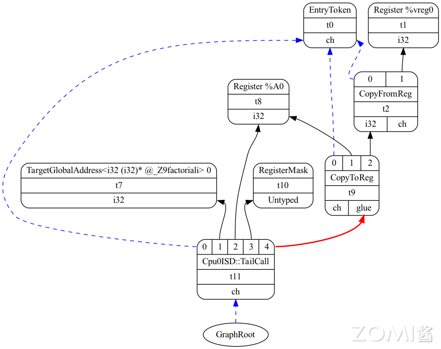
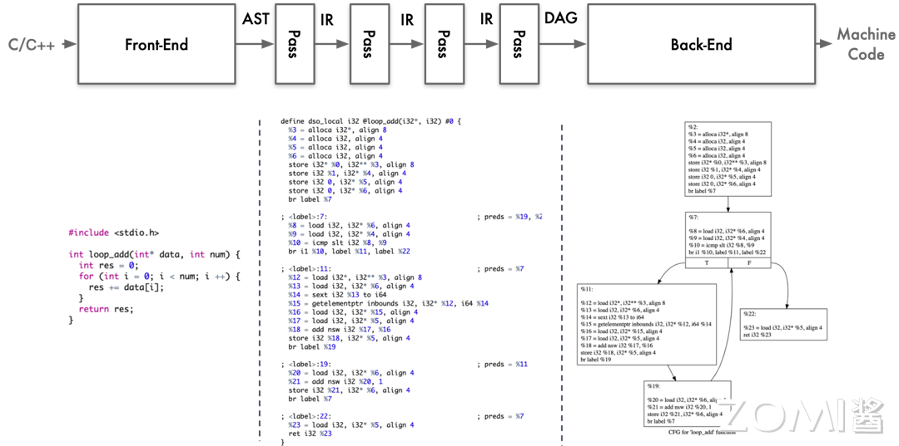
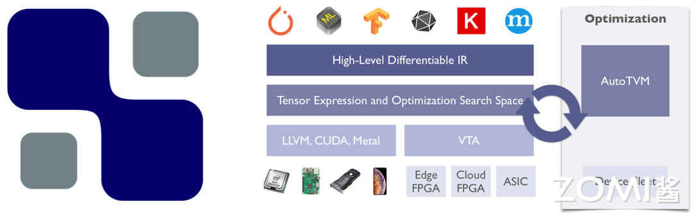

<!--Copyright © ZOMI 适用于[License](https://github.com/chenzomi12/AISystem)版权许可-->

# LLVM 后端代码生成

上一节主要讲了 LLVM 的前端和优化层，前端主要对高级语言做一些词法的分析，把高级语言的特性转变为 token，再交给语法分析对代码的物理布局进行判别，之后交给语义分析对代码的的逻辑进行检查。优化层则是对代码进行优化，比如常量折叠、死代码消除、循环展开、内存分配优化等。

本节将介绍 LLVM 后端的生成代码过程，LLVM 后端的作用主要是将优化后的代码生成目标代码，目标代码可以是汇编语言、机器码。

## 代码生成 

LLVM 的后端是与特定硬件平台紧密相关的部分，它负责将经过优化的 LLVM IR 转换成目标代码，这个过程也被称为代码生成（Codegen）。不同硬件平台的后端实现了针对该平台的专门化指令集，例如 ARM 后端实现了针对 ARM 架构的汇编指令集，X86 后端实现了针对 X86 架构的汇编指令集，PowerPC 后端实现了针对 PowerPC 架构的汇编指令集。

在代码生成过程中，LLVM 后端会根据目标硬件平台的特性和要求，将 LLVM IR 转换为适合该平台的机器码或汇编语言。这个过程涉及到指令选择（Instruction Selection）、寄存器分配（Register Allocation）、指令调度（Instruction Scheduling）等关键步骤，以确保生成的目标代码在目标平台上能够高效运行。

LLVM 的代码生成能力使得开发者可以通过统一的编译器前端（如 Clang）生成针对不同硬件平台的优化代码，从而更容易实现跨平台开发和优化。同时，LLVM 后端的可扩展性也使得它能够应对新的硬件架构和指令集的发展，为编译器技术和工具链的进步提供了强大支持。

## LLVM 后端 Pass

整个后端流水线涉及到四种不同层次的指令表示，包括：

- 内存中的 LLVM IR：LLVM 中间表现形式，提供了高级抽象的表示，用于描述程序的指令和数据流。

- SelectionDAG 节点：在编译优化阶段生成的一种抽象的数据结构，用以表示程序的计算过程，帮助优化器进行高效的指令选择和调度。

- Machinelnstr：机器相关的指令格式，用于描述特定目标架构下的指令集和操作码。

- MCInst：机器指令，是具体的目标代码表示，包含了特定架构下的二进制编码指令。

在将 LLVM IR 转化为目标代码需要非常多的步骤，其 Pipeline 如下图所示：

LLVM IR 会变成和后端非常很接近的一些指令、函数、全局变量和寄存器的具体表示，流水线越向下就越接近实际硬件的目标指令。其中白色的 pass 是非必要 pass，灰色的 pass 是必要 pass，叫做 Super Path

### 指令选择

在编译器的优化过程中，指令选择（Instruction Selection）是非常关键的一环。指令选择的主要任务是将中间表示（例如 LLVM IR）转换为目标特定的 SelectionDAG 节点，生成目标机器代码的指令序列，实现从高级语言表示到底层机器指令的转换。

具体来说，指令选择的过程包括以下几个关键步骤：

1. 将内存中的 LLVM IR 变换为目标特定的 SelectionDAG 节点。

2. 每个 SelectionDAG 节点能够表示单一基本块的计算过程。

3. 在 DAG 图中，节点表示具体执行的指令，而边则编码了指令之间的数据流依赖关系。

4. 目标是让 LLVM 代码生成程序库能够利用基于树的模式匹配指令选择算法，以实现高效的指令选择过程。

以上是一个 SelectionDAG 节点的例子。

- 红色线：红色连接线主要用于强制相邻的节点在执行时紧挨着，表示这些节点之间必须没有其他指令。

- 蓝色虚线：蓝色虚线连接代表非数据流链，用以强制两条指令的顺序，否则它们就是不相关的。

### 指令调度

指令调度（Instruction Scheduling）是编译器优化的一部分，旨在通过重新排序程序中的指令来提高计算机程序的性能。这个过程通常包括**前寄存器分配（Pre-Register Allocation, Pre-RA）调度**和**后寄存器分配（Post-Register Allocation, Post-RA）调度**两个阶段。

#### 前寄存器分配调度

在前寄存器分配调度（Pre-RA Scheduling）阶段，编译器会对程序中的指令进行排序，同时尝试发现能够并行执行的指令。这种并行执行可以提高程序的吞吐量和执行效率。在现代计算机体系结构中，由于存在多级缓存和流水线等技术，指令调度可以帮助减少指令执行的停顿，并充分利用硬件资源。

一种常见的技术是基于数据依赖性进行指令调度。编译器会分析指令之间的数据依赖关系，然后将独立的指令重排序以并行执行，而不会改变程序的语义。这种优化可以通过重排指令来避免数据冒险（Data Hazard）和控制冒险（Control Hazard），从而提高程序的性能。

在指令调度的过程中，编译器可能会引入一些额外的指令（如填充指令）或调整指令的执行顺序，以最大程度地利用计算资源。例如，可以调整指令的执行顺序，以便在执行整数运算的同时进行浮点运算，或者在内存访问受限时插入其他计算指令。指令最终将被转换为三地址表示的 MachineInstr。

#### 寄存器分配

寄存器分配（Register Allocation）是编译器优化的重要步骤之一，其主要任务是将虚拟寄存器分配到有限数量的物理寄存器上，从而减少对内存的访问，提高程序的性能和效率。在 LLVM IR 中，寄存器分配的过程较为特殊，因为 LLVM IR 寄存器集是无限的，直到实施寄存器分配为止。

在寄存器分配中，编译器会尝试将虚拟寄存器映射到物理寄存器上，以便在执行指令时能够直接访问这些寄存器而不必通过内存。然而，由于物理寄存器数量有限，当虚拟寄存器的数量超过物理寄存器时，就需要使用一些策略来处理这种溢出（Spill）情况，将部分寄存器的内容存储到内存中，并在需要时重新加载。

寄存器分配算法可以分为多种类型，常见的包括：

1. **贪心寄存器分配（Greedy Register Allocation）**：这是一种简单直接的算法，它会顺序地将虚拟寄存器分配给可用的物理寄存器，一旦物理寄存器被占用完时就进行溢出处理。虽然效率较高，但可能会导致局部最优解。
    
2. **迭代寄存器合并（Iterated Register Coalescing）**：该算法尝试合并虚拟寄存器，使得原本需要分配到不同物理寄存器的虚拟寄存器可以合并到同一个物理寄存器上。这样可以减少溢出和重加载的次数，提高程序性能。
    
3. **图着色（Graph Coloring）**：基于图的寄存器分配算法，将寄存器分配问题转化为图着色问题。通过建立虚拟寄存器之间的冲突图，尝试对图进行着色，从而确定哪些虚拟寄存器可以分配到同一个物理寄存器上，以最小化溢出次数。

寄存器分配在编译器优化中扮演着至关重要的角色，通过有效的寄存器分配算法可以显著提高程序的执行效率和性能。

#### 后寄存器分配调度

在后寄存器分配调度（Post-RA Scheduling）阶段，编译器对已经分配了寄存器的机器代码进行进一步优化。此阶段的目标是最大化硬件资源的利用，减少指令执行的停顿，并优化寄存器的使用。具体包括：

- **处理资源冲突**：调整指令顺序以避免资源冲突，例如寄存器使用冲突、流水线停顿等。

- **插入填充指令**：在必要时插入填充指令（如 NOP 指令）以消除潜在的流水线停顿。

- **优化执行顺序**：通过重新排列指令，使得整数运算、浮点运算、内存访问等能够并行执行，从而提高性能。

以上是对指令调度和寄存器分配的基本介绍和常见算法。通过有效的指令调度和寄存器分配，可以显著提高程序的执行效率和性能。

### 代码输出

Code Emission（代码生成）是 LLVM 后端的重要阶段，其目标是将中间表示（Intermediate Representation, IR）转化为高效的目标机器代码。LLVM 的 Code Emission 阶段由多个组件协同工作，并使用多种优化技术来生成高质量的代码。

#### 代码输出阶段优化

1. **延迟槽填充（Delay Slot Filling）** 在某些处理器架构（如 MIPS）中，分支指令后的指令会有一个延迟槽。LLVM 通过将不影响程序正确性的指令填充到这些延迟槽中，避免处理器空转，提高指令执行效率。延迟槽填充在 LLVM 的指令调度器中完成。
    
2. **指令融合（Instruction Fusion）** LLVM 利用指令融合技术将多条简单指令合并为一条复杂指令，减少指令数量和调度开销。例如，可以将两个相邻的加载和加法指令融合为一个加载并加法的指令。这种优化通常在指令选择器或指令调度器中完成。
    
3. **启发式优化（Heuristic Optimization）** 在 LLVM 的指令选择和调度过程中，使用启发式算法快速找到接近最优的解决方案。启发式算法通过评估指令组合的代价和收益，选择出最适合当前上下文的指令序列。LLVM 使用基于图形的调度算法，如 DAG（Directed Acyclic Graph）调度器，来实现启发式优化。
    
4. **Profile-Guided Optimization（PGO）** Profile-Guided Optimization 是 LLVM 中的一种基于性能数据的优化技术。PGO 通过收集程序运行时的性能数据（如热点函数和分支预测信息），指导编译器在代码生成阶段进行优化，使生成的代码在实际运行时更高效。LLVM 在前端使用`llvm-profdata`工具收集性能数据，在后端的指令选择和调度过程中利用这些数据进行优化。
    
5. **Loop Optimization** LLVM 在代码生成阶段对循环结构进行多种优化，包括：
    
    - **循环展开（Loop Unrolling）**：通过展开循环体，减少循环控制开销，提高指令流水线效率。
    - **循环交换（Loop Exchange）**：调整嵌套循环的顺序，提高数据局部性。
    - **循环合并（Loop Fusion）**：将多个循环合并为一个循环，减少循环开销。这些优化在 LLVM 的循环优化器（Loop Optimizer）中实现，优化后的循环结构会在代码生成阶段进一步优化。

#### 代码输出的实现

在 LLVM 中，Code Emission 由以下组件共同完成：

1. **指令选择器（Instruction Selector）** 指令选择器负责从 LLVM IR 中选择合适的目标机器指令。LLVM 使用多种指令选择算法，包括基于树模式匹配的`SelectionDAG`和基于表格驱动的`GlobalISel`。指令选择器将中间表示转化为机器指令的中间表示。
    
2. **指令调度器（Instruction Scheduler）** 指令调度器优化指令的执行顺序，以减少依赖关系和提高指令级并行性。LLVM 的调度器包括`SelectionDAG`调度器和机器码层的调度器，后者在目标机器码生成前优化指令序列。
    
3. **寄存器分配器（Register Allocator）** 寄存器分配器负责将虚拟寄存器映射到物理寄存器。LLVM 提供了多种寄存器分配算法，包括线性扫描分配器和基于图着色的分配器。寄存器分配器的目标是最小化寄存器溢出和寄存器间的冲突。
    
4. **汇编生成器（Assembly Generator）** 汇编生成器将优化后的机器指令转化为汇编代码。LLVM 的汇编生成器支持多种目标架构，生成的汇编代码可以通过汇编器转化为目标机器码。
    
5. **机器代码生成器（Machine Code Generator）** 机器代码生成器将汇编代码转化为最终的二进制机器代码。LLVM 的机器代码生成器直接生成目标文件或内存中的可执行代码，支持多种目标文件格式和平台。
    
通过这些组件的协同工作，LLVM 在 Code Emission 阶段能够生成高效、正确的目标代码，满足不同应用场景的性能需求。LLVM 的模块化设计和丰富的优化技术使其成为现代编译器技术的领先者。

## LLVM 编译器全流程

最后，我们再来复习一遍 LLVM 编译器的全部优化流程

编译器工作流程为在高级语言 C/C++ 编译过程中，源代码经历了多个重要阶段，从词法分析到生成目标代码。整个过程涉及前端和后端的多个步骤，并通过中间表示（IR）在不同阶段对代码进行转换、优化和分析。

通过上述图像分别展示了 LLVM 的各个流程，和代码在不同流程下的状态，在本节的最后我们再回顾一下各个阶段所代表的功能和内容。

1. 前端阶段

- 词法分析（Lexical Analysis）：源代码被分解为词法单元，如标识符、关键字和常量。

- 语法分析（Syntax Analysis）：词法单元被组织成语法结构，构建抽象语法树（AST）。

- 语义分析（Semantic Analysis）：AST 被分析以确保语义的正确性和一致性。

2. 中间表示（IR）阶段

- 将 AST 转化为中间表示（IR），采用 SSA 形式的三地址指令表示代码结构。

- 通过多段 pass 进行代码优化，包括常量传播、死代码消除、循环优化等，以提高代码性能和效率。

- IR 进一步转化为 DAG 图，其中每个节点代表一个指令，边表示数据流动。

3. 后端阶段
 
- 指令选择（Instruction Selection）：根据目标平台特性选择合适的指令。

- 寄存器分配（Register Allocation）：分配寄存器以最大程度减少内存访问。

- 指令调度（Instruction Scheduling）：优化指令执行顺序以减少延迟。

最终生成目标代码，用于目标平台的执行。

Pass 管理：

在编译器的每个模块和 Pass 均可通过 Pass manager 进行管理，可以动态添加、删除或调整 Pass 来优化编译过程中的各个阶段。

## 基于 LLVM 课程

1. Modular

Youtube 上 LLVM 之父 Chris Lattner：编译器的黄金时代

随后，Chris Lattner 创立了 Modular，旨在重塑全球机器学习基础设施，涵盖编译器、运行时、异构计算，以及从边缘到数据中心的全方位支持，并特别注重可用性。Modular 旨在提升开发人员的效率，使他们能够更高效地开展工作。

2. Julia：面向科学计算的高性能动态编程语言

在其计算中，Julia 使用 LLVM JIT 编译。LLVM JIT 编译器通常不断地分析正在执行的代码，并且识别代码的一部分，使得从编译中获得的性能加速超过编译该代码的性能开销。

2. XLA：优化机器学习编译器

XLA(加速线性代数)是谷歌推出的一种针对特定领域的线性代数编译器，能够加快 TensorFlow 模型的运行速度，而且可能完全不需要更改源代码。

TensorFlow 中大部分代码和算子都是通过 XLA 编译的，XLA 的底层就是 LLVM，所以 XLA 可以利用到 LLVM 的很多特性，比如优化、代码生成、并行计算等。

3. JAX：高性能的数值计算库

JAX 是 Autograd 和 XLA 的结合，JAX 本身不是一个深度学习的框架，他是一个高性能的数值计算库，更是结合了可组合的函数转换库，用于高性能机器学习研究。

4. TensorFlow：机器学习平台

TensorFlow 是一个端到端开源机器学习平台。它拥有一个全面而灵活的生态系统，其中包含各种工具、库和社区资源，可助力研究人员推动先进机器学习技术。

TensorFlow 可以更好的应用于工业生产环境，因为它可以利用到硬件加速器，并提供可靠的性能。

5. TVM 到端深度学习编译器

为了使得各种硬件后端的计算图层级和算子层级优化成为可能，TVM 从现有框架中取得 DL 程序的高层级表示，并产生多硬件平台后端上低层级的优化代码，其目标是展示与人工调优的竞争力。

## 小结与思考

- LLVM 后端的作用是将优化后的代码生成目标代码，可以是汇编语言或机器码。
- 生成过程包括指令选择、寄存器分配、指令调度、代码输出等步骤，可被不同后端实现。
- LLVM 后端的可扩展性支持新硬件架构和指令集发展，推动编译器技术和工具链进步。
- 前端和优化层提供统一的编译器前端，实现跨平台开发和优化。
- 基于 LLVM 的课程有 Modular、XLA、JAX、TensorFlow、TVM、Julia 等。

## 本节视频

<html>
<iframe src="https://player.bilibili.com/player.html?aid=390568348&bvid=BV1cd4y1b7ho&cid=903537014&p=1&as_wide=1&high_quality=1&danmaku=0&t=30&autoplay=0" width="100%" height="500" scrolling="no" border="0" frameborder="no" framespacing="0" allowfullscreen="true"> </iframe>
</html>
