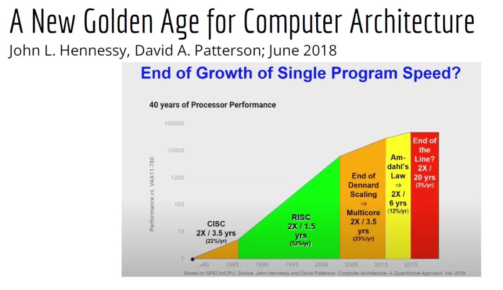
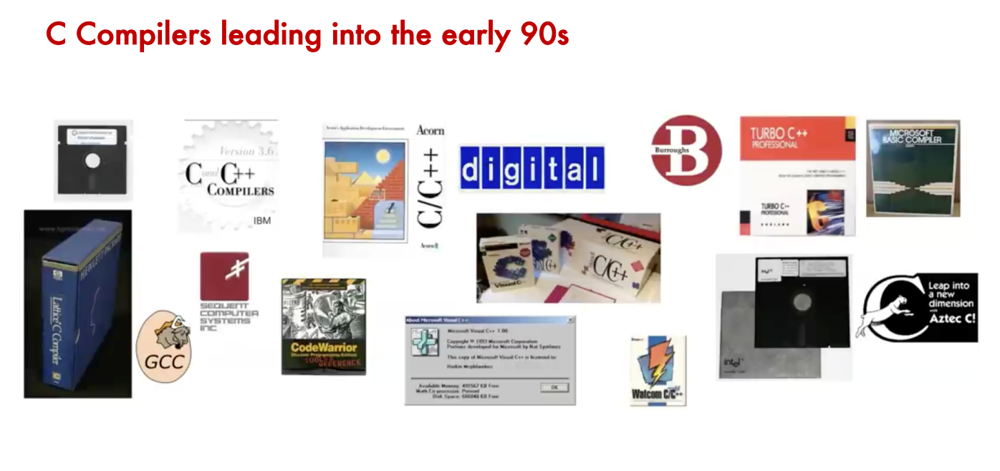
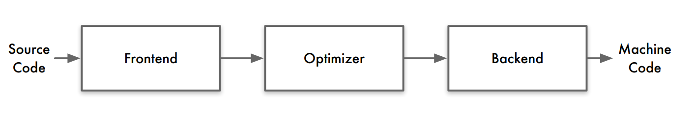
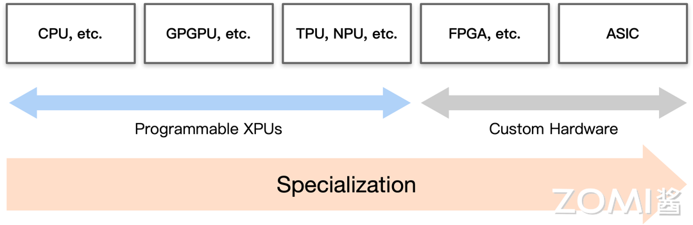
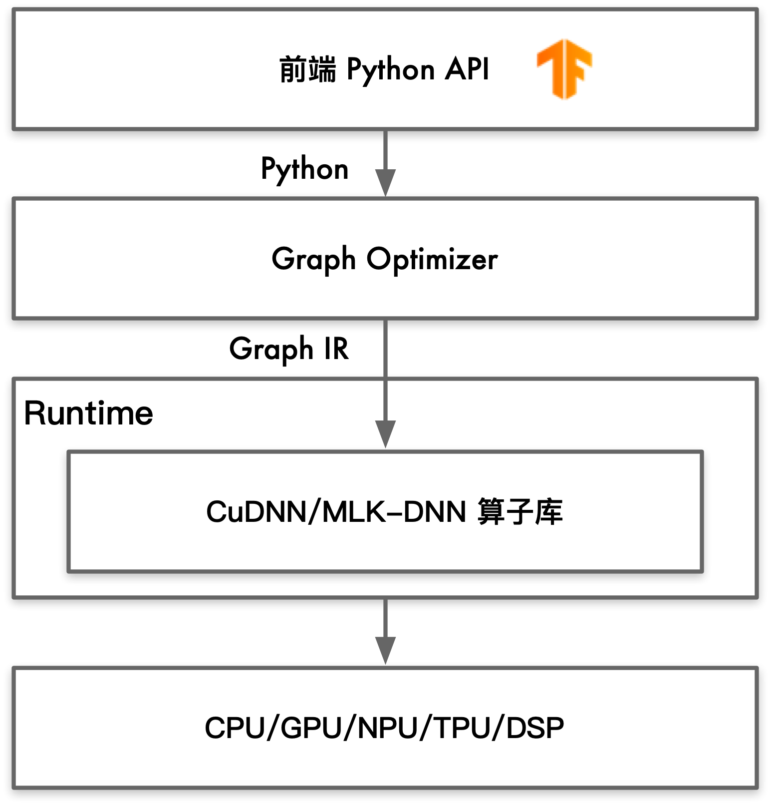

# 为什么需要 AI 编译器

## 硬件架构和编译器的黄金年代

图灵奖获得者 David Patterson 在2019年5月发表了一个名为“计算机架构新的黄金年代”的演讲，他通过回顾自20世纪60年代以来的计算机架构的发展，来介绍当前的难题与未来的机遇。他预测未来十年计算机架构领域将会迎来下一个黄金时代，就像20世纪80年代一样。

> John Hennessy 和 David Patterson 是 2017 年图灵奖获得者，目前这两位学者都供职于谷歌，前者是谷歌母公司 Alphabet 的董事会主席，后者任谷歌杰出工程师，致力于研究机器学习和人工智能。他们更为人所知的就是共同完成的计算机系统结构学科「圣经」《计算机体系结构：量化研究方法》了。该讲座也是基于两人在 2019 年新发表的文章《计算机架构的新黄金时代》。

David Patterson 介绍了从最初诞生的复杂指令计算机到精简指令计算机，再从单核处理器到多核处理器的发展，再到如今随着人工智能的飞速发展，DSA(Domain-specific architectures)迅速崛起，比如AI芯片、GPU芯片以及NPU芯片，这些都是DSA。他认为高级、特定于领域的语言和体系结构，将为计算机架构师带来一个新的黄金时代。

类似的，LLVM之父 Chris Lattner 在2021年ASPLOS会议的主题演讲中发表了名为“编译器的黄金时代”的演讲，主要分享了关于编译器的发展现状和未来、编程语言、加速器和摩尔定律失效论，并且讨论业内人士如何去协同创新，推动行业发展，实现处理器运行速度的大幅提升。Chris认为世界出现了越来越多的专属硬件，同时也出现了各种各样的应用。尽管现在硬件越来越多样，硬件生态迅速壮大，但软件还是很难充分利用它们来提高性能。而且如果软硬件协同不到位，性能就会受到巨大影响，那不止是10%左右的浮动。

> Chris Lattner，LLVM项目的主要发起人与作者之一，Swift语言的创始人，并于2022年3月离开Swift核心团队，Clang编译器的作者。现为他共同创立的人工智能公司Modular AI的首席执行官

各种不同硬件的爆发式增长，会逐渐导致软件的碎片化，这种碎片化的发展带来了巨大成本，也会反噬硬件行业。

90年代开始GCC编译器极大程度上解决了当时编译体系生态化碎片的问题。之后LLVM的出现极大地促进了整个编译器领域的发展。不同的芯片厂商推出不同芯片，而在芯片之上一定要有与自家芯片相匹配的编译器，因为我们需要将高级语言转化为芯片真正可以执行的机器码，让芯片的能力发挥出来！而当前AI编译器的发展阶段，就更像当时GCC编译器出现之前的样子。每一家AI芯片公司都会推出自己的AI编译器或者自己的AI框架，甚至的自己的AI软件栈，极度碎片化。因此 Chris 认为未来的十年一定是AI编译器风起云涌的十年，之后就会有新的技术重新整合，整个编译器领域将会重新洗牌，经历新的“大一统”。

### 为什么需要 AI 编译器

随着硬件技术的不断进步，我们进入了一个新的计算加速时代，这个时代的硬件平台变得越来越复杂和多层次。现代计算加速平台采用了多层架构，包括标量、向量、多核、多包、多机架等不同层次的并行处理能力。这种设计不仅提高了性能，也增加了硬件设计的复杂性.同时，现代计算平台的架构设计是明确的，意味着开发者可以清楚地识别和利用不同层次的计算资源。每个级别的性能特征都是明确的，如向量处理的高吞吐量、多核处理的并行能力等，这有助于开发者针对特定任务优化软件。显式架构还意味着资源管理和任务调度是明确和可控的。开发者可以根据任务的需求，明确地分配计算资源。这种多层次和显式的架构设计，使得现代计算加速平台能够提供前所未有的计算能力和灵活性。然而，这也要求开发者具备更深入的硬件知识，以及更高级的编程技能，以便有效地为这些平台开发和优化软件。

硬件的异构计算特性也日益显著，特别是在高端SoCs和FPGAs中，集成了特定领域的加速器，这些加速器针对特定类型的计算任务进行了优化。这种异构计算不仅提高了特定任务的处理速度，也为硬件设计带来了新的挑战。

许多加速器的IP（知识产权）现在是可配置的，这意味着可以根据不同的应用需求进行定制。可选的扩展、瓦片计数、内存层次结构等都可以根据需要进行调整，以满足特定的性能和功能要求。

这些硬件进步为提高计算性能提供了强大的工具，但同时也带来了软件开发方面的挑战。开发者如何为这些复杂的硬件平台编写软件，尤其是在面对多级显式内存架构和异构计算特性时。其次，面对硬件平台的快速迭代，开发者如何承担得起为特定硬件代际编写软件的成本？这涉及到软件的可移植性和可重用性问题。总之，现代硬件的发展为软件开发带来了前所未有的挑战。开发者需要不断学习和适应这些复杂的硬件平台，同时采用创新的编程方法和技术，以充分利用硬件的潜力，开发出高效、可移植且成本效益高的软件解决方案。

随着计算技术的飞速发展，我们迫切需要下一代编译器来满足现代硬件和软件开发的需求。这些编译器将面临一系列新的挑战和机遇，以支持日益复杂的计算环境。

首先，下一代编译器需要提供硬件抽象，以跨越多样化的加速器。随着GPU、FPGA、ASIC等不同类型的加速器的出现，编译器必须能够抽象出硬件的具体细节，为开发者提供一个统一的编程接口。这样，开发者就可以专注于算法和应用的开发，而不必深入了解底层硬件的复杂性。

其次，编译器必须支持异构计算平台。现代计算系统常常包含多种类型的处理器和加速器，它们各自擅长处理不同类型的任务。下一代编译器需要能够识别这些平台的特性，并有效地调度和优化任务，以实现最佳的性能和资源利用率。

此外，随着特定领域计算需求的增长，领域特定语言（DSL）和编程模型变得越来越重要。这些语言和模型为特定类型的应用提供了定制化的编程环境，使得开发者可以更高效地表达和优化算法。下一代编译器需要支持这些DSL，并能够将它们映射到底层硬件上，以实现高性能的执行。

最后，下一代编译器还需要确保基础设施的质量、可靠性和可扩展性。随着软件系统变得越来越复杂，编译器生成的代码必须经过严格的测试和验证，以确保其质量和性能。同时，编译器本身也需要具备高度的可扩展性，以适应不断变化的硬件环境和应用需求。

当前AI编译器领域的竞争非常激烈，众多参与者正致力于开发和优化针对不同异构计算平台的编译器。随着硬件技术的多样化，包括GPU、FPGA、ASIC、以及多核CPU等在内的各种加速器和处理器，市场上涌现了一大批企业和研究机构，它们专注于为不同平台提供定制化的编译器解决方案。这些参与者不仅包括传统的硬件制造商和软件开发商，还有许多初创公司，它们都在积极探索如何通过创新的编译技术来提高性能、降低能耗，并简化异构平台上的软件开发过程。这种多元化的竞争环境推动了编译器技术的快速发展，为开发者提供了丰富的工具和选择，同时也为整个行业带来了前所未有的活力和创新。

总之，下一代编译器的开发是应对现代计算挑战的关键。它们将为开发者提供强大的工具，以支持多样化的硬件加速器、异构计算平台、领域特定语言和可扩展的基础设施。通过这些工具，开发者将能够更高效、更可靠地开发和部署软件，推动计算技术的进步。

然而现实情况远没有这么乐观，当前主要开发编译器的还是这些卖芯片的公司，他们彼此是竞争关系，因此为了保持其短时间内的技术壁垒，绝大多数代码并不开源，并且彼此之间并不兼容。甚至不同编译器的质量差异巨大，这使得当前异构计算平台是十分碎片化的。并不利于软件开发者。

## 换一个角度来看为什么需要AI编译器？

上一小章节是从**硬件角度**以及**底层软件**的角度来看待为什么需要AI编译器的，而现在我们可以换一个上层应用视角来看待这个问题。

以深度神经网络为技术基础的人工智能领域在近些年发展十分迅速，从10年前，AI技术可能只能解决图形分类等较为简单的任务，但如今无论是推荐系统、大语言模型、自动驾驶甚至AI4S等领域已经取得了十分显著的发展。

如今，AI算法已经在很多领域取得了显著成果，这直接促进了AI算法的爆发式增长。同时，当前越来越多的公司愿意投入人力物理去开发自己的AI框架，这却间接导致了AI框架的碎片化和多样化。还有因地缘政治等因素，AI芯片也变得加多样性，而不同的AI芯片都有着自己的编译体系。

目前，AI领域的快速发展，导致每天都有各种各样的不同的AI算法被提出，这直接导致了两个重要的挑战。

第一个就是对于算子的优化，随着越来越来多的AI算法的诞生，这带来了更多的新算子。虽然简单的实现一个算子并不算是特别难的事情，但是这些算子还需要放在特定的AI芯片上进行优化，充分发挥硬件性能。而目前阶段算子的开发和维护还是以人工手动实现、优化、测试为主的，人工优化算子的工作量是非常大的。

虽然硬件供应商会发布一些通用性的优化算子库（如MKL-DNN和CuDNN），但从人力成本的角度来说，这种工作是极度重复性的，MKL-DNN和CuDNN背后是相似的算法，只不过由不同的公司两批不同的人来做的而已。从现实意义的角度，感觉意义并没有那么大。同时，硬件供应商提供优化后的算子库，一定程度上会限制用户编程的灵活性导致无法真正充分的发挥硬件性能。

第二个重大挑战是性能可移植性十分困难。由于大多数NPU使用ASIC设计芯片，其在神经网络场景对计算、存储和数据搬运做了很多特殊的指令优化，这使得与AI相关的计算得到了巨大的性能提升，比如NVIDIA在其一些芯片中提供的Tensor Core计算单元。如果相关AI框架使用了Tensor Core来优化其计算性能，必然会带来难以移植的问题。不同芯片有的提供类似Tenosr Core的矩阵计算单元，有的不提供。提供了矩阵计算单元的不同芯片，其编程范式又极不相同，这是限制可移植性的重要原因。

不同芯片厂商提供XPU的ISA（Instruction Set Architectrue）千奇百怪，各不相同。而当前阶段又缺乏如GCC、LLVM等编译工具链，这使得针对CPU和GPU已有的优化算子库和针对语言的优化Pass很难移植到NPU上。这样的现状可能对于某个较为领先的硬件厂商来说是技术壁垒，是一种优势，但随着技术的不断发展，很多idea会被不断地相互借鉴，不断整合类似的Pass，在AI编译器领域推出一个类似于GCC或者LLVM的编译器是非常有必要的。这会极大的促进AI领域的发展！

## 传统编译器与AI编译器的区别？

接下来，我们来了解一下AI编译器与传统编译器的区别与联系。

* 目标相同：AI编译器与传统编译器都是通过自动化的方式进行程序优化和代码生成，从而节省大量的人力对不同底层硬件的手动优化。

* 优化方式类似：在编译优化层，AI编译器与传统编译器都是通过统一 IR 执行不同的 Pass 进行优化，从而提高程序执行时的性能。

* 软件栈结构类似：它们都分成前端、优化、后端三段式，通过IR解耦前端和后端使得可以进行模块化表示。

* AI编译器依赖传统编译器：AI编译器对 Graph IR 进行优化后，将优化后的IR转化成传统编译器IR，最后依赖传统编译器进行机器码生成。因为传统编译器经过几十年的发展已经趋于稳定，所以AI编译器的角色更像是对传统编译器的一种补充。

传统编译器的输入是一些高级语言输出是硬件可以运行的机器码；而AI编译器输入则是计算图输出也是机器码。输入是传统编译器与AI编译器最大的不同。

其次的不同是编译器的目标，对于传统给编译器来说，它的主要目的是降低编程的难度，我们很难直接去写机器码让芯片运行，传统编译器就实现了将我们所写的高级语言转化为机器码的作用。其次传统编译器还可以通过一些特定的技巧优化程序的性能，比如在用GCC编译C程序的时候开`-O3`。而对于AI编译器来说，其主要目标则变成了优化整个程序的性能，其次才是降低编程的难度。

下面这张图左边就是传统编译器的软件栈结构，右边就是AI编译器的软件栈结构，我们可以通过这张图很清晰的看出来这两者之间的区别。

我们可以看到传统编译器的前端主要是对高级语言做一些语义分析、语法分析、词法分析；而中间的优化主要是针对高级语言做各种各样的Pass；后端则是处理代码布局、寄存器分配等。

而AI编译器则有较大的区别，前端主要是对深度神经网络的API进行表达，转化计算图等；中间优化则是针对图算融合、算子融合、自动微分、并行切分等等；而后端则是针对不同硬件对于kernel进行针对性优化的。之后交给不同的硬件去执行，而如果分到CPU、TPU等芯片则可能会调用LLVM类似的传统编译器。

所以我们可以说AI编译器是构建于传统编译器之上的，他们之间是相互补充的关系！

### IR的差异

AI编译器的IR和传统编译器的IR所抽象出来的概念和意义并不相同。

* AI编译器一般会是 high-level IR，用来抽象描述深度学习模型中的运算，比如：卷积、矩阵乘等操作。

* 传统编译器相对而言是更加 low-level IR，用于描述基本指令运算，如 load、store等。

有了high-level IR, AI编译器在描述深度学习模型类DSL更加方便。

### 优化策略的差异

AI编译器面向AI领域，优化时引入了更多领域特定知识。

* AI编译器再 high-level IR 执行算子融合。
* AI编译器可以降低计算精度，引入 int8、fp6、bf16等精度。因为深度学习对于计算精度不那么敏感。但传统编译器不会改变变量类型和精度。

## 参考资料：
1. https://learning.acm.org/techtalks/computerarchitecture
2. https://segmentfault.com/a/1190000041739045