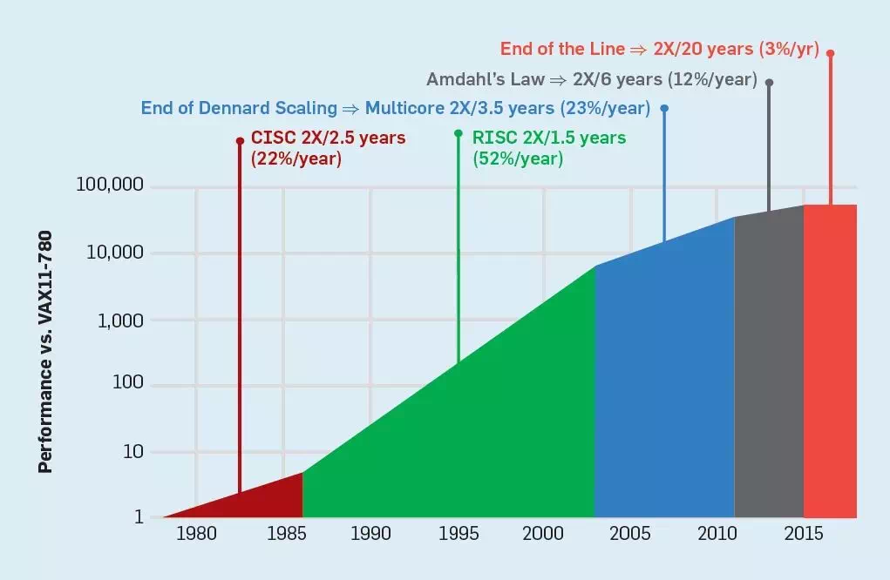
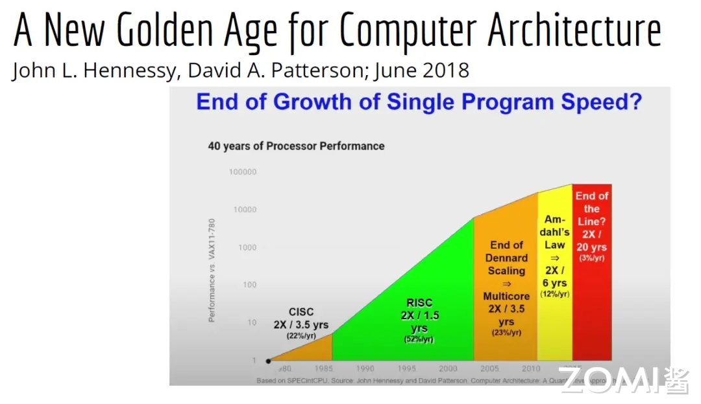
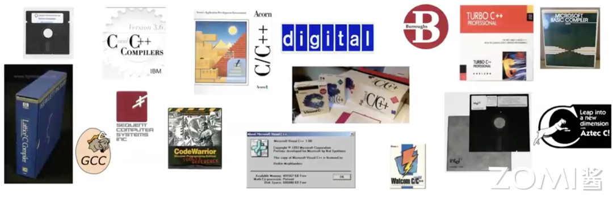
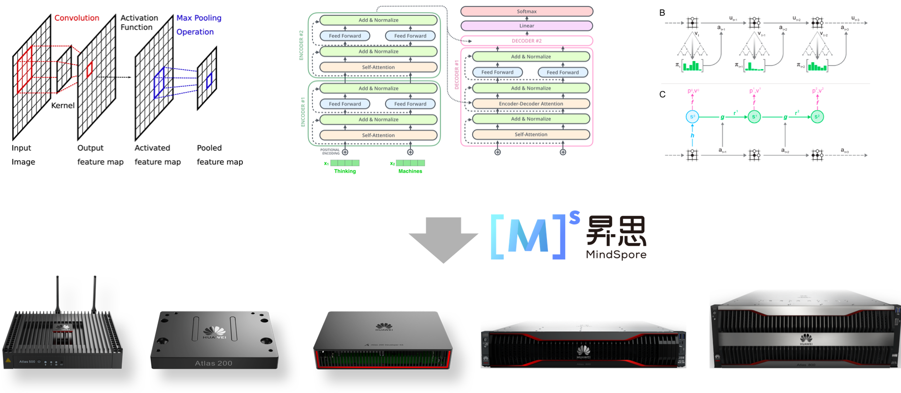
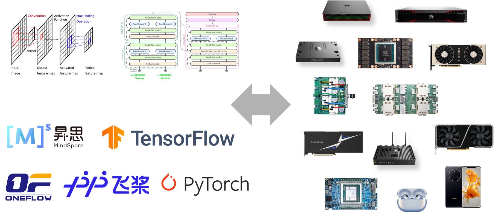
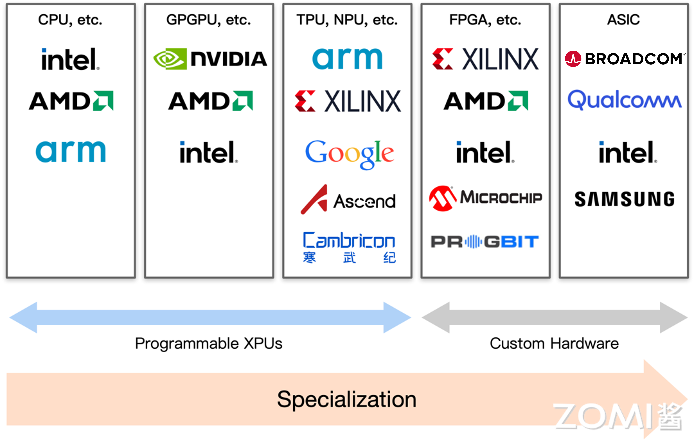
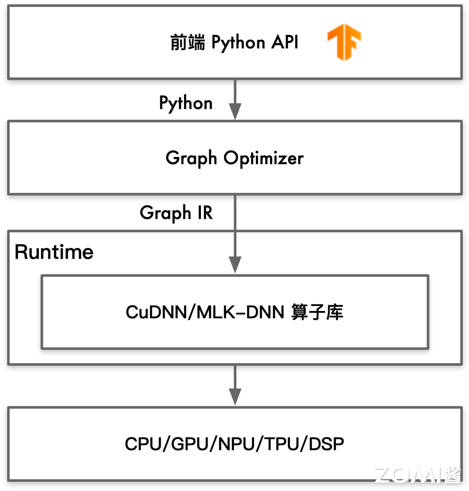
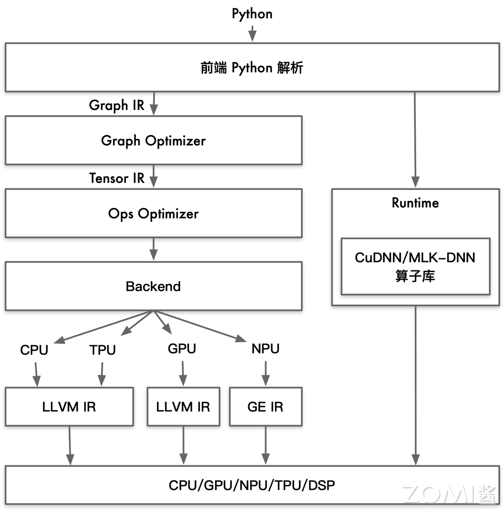
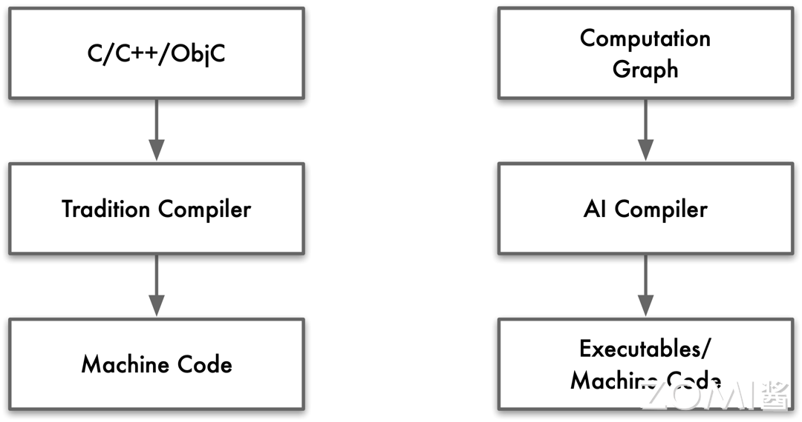
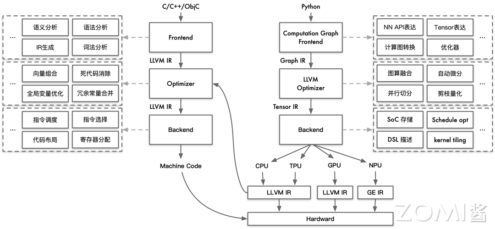

<<<<<<< HEAD
# 为什么需要 AI 编译器

本章节将通过探讨AI编译器的黄金年代以及传统编译器与AI编译器的区别等角度，来介绍为什么需要AI编译器。
=======
<!--Copyright 适用于[License](https://github.com/chenzomi12/AISystem)版权许可-->

# 为什么需要 AI 编译器

本节节将通过探讨 AI 编译器的黄金年代以及传统编译器与 AI 编译器的区别等角度，来介绍为什么需要 AI 编译器。
>>>>>>> upstream/main

## AI 编译器黄金年代

图灵奖获得者 David Patterson 在 2019 年 5 月发表了一个名为“计算机架构新的黄金年代”的演讲，他通过回顾自 20 世纪 60 年代以来的计算机架构的发展，来介绍当前的难题与未来的机遇。他预测未来十年计算机架构领域将会迎来下一个黄金时代，就像 20 世纪 80 年代一样。

> John Hennessy 和 David Patterson 是 2017 年图灵奖获得者，目前这两位学者都供职于谷歌，前者是谷歌母公司 Alphabet 的董事会主席，后者任谷歌杰出工程师，致力于研究机器学习和人工智能。他们更为人所知的就是共同完成的计算机系统结构学科「圣经」《计算机体系结构：量化研究方法》了。该讲座也是基于两人在 2019 年新发表的文章《计算机架构的新黄金时代》。

David Patterson 介绍了从最初诞生的复杂指令计算机到精简指令计算机，再从单核处理器到多核处理器的发展，再到如今随着人工智能的飞速发展，DSA(Domain-specific architectures)迅速崛起，比如 AI 芯片、GPU 芯片以及 NPU 芯片，这些都是 DSA。他认为高级、特定于领域的语言和体系结构，将为计算机架构师带来一个新的黄金时代。

类似的，LLVM 之父 Chris Lattner 在 2021 年 ASPLOS 会议的主题演讲中发表了名为“编译器的黄金时代”的演讲，主要分享了关于编译器的发展现状和未来、编程语言、加速器和摩尔定律失效论，并且讨论业内人士如何去协同创新，推动行业发展，实现处理器运行速度的大幅提升。

Chris 认为世界出现了越来越多的专属硬件，同时也出现了各种各样的应用。尽管现在硬件越来越多样，硬件生态迅速壮大，但软件还是很难充分利用它们来提高性能。而且如果软硬件协同不到位，性能就会受到巨大影响，那不止是 10%左右的浮动。

> Chris Lattner，LLVM 课程的主要发起人与作者之一，Swift 语言的创始人，并于 2022 年 3 月离开 Swift 核心团队，Clang 编译器的作者。现为他共同创立的人工智能公司 Modular AI 的首席执行官

人工智能领域正经历着硬件的爆发式增长，这为 AI 应用的创新和扩展提供了强大的动力。随着各种不同的 AI 硬件的快速涌现，我们正面临一个软件碎片化的时代。软件碎片化意味着需要为不同的 AI 硬件平台开发和维护多种版本的基础软件，这无疑增加了研发和运营的成本。

此外，AI 基础软件碎片化还可能导致用户体验的不一致，因为不同硬件上运行的基础软件可能在性能和功能上存在差异。这种不一致性不仅增加了用户的学习成本，也可能影响用户对品牌和产品的忠诚度。

最终，软件碎片化的问题还可能反噬硬件行业本身。如果硬件制造商无法提供兼容和优化良好的软件解决方案，那么他们在市场上的竞争力将受到削弱。用户可能会选择那些能够提供更好软件支持的硬件产品，就像截至到目前为止大部分研究者仍然大量地使用英伟达的 GPU，而不是 DSA 架构的 AI 芯片。

因此，硬件行业的参与者需要认识到 AI 基础软件碎片化的潜在风险，并采取措施来缓解这一问题。这可能包括开发更加通用和可移植的软件架构，或者与软件开发商合作，共同提供跨平台的解决方案。

否则随着各种不同 AI 硬件的爆发式增长，会逐渐导致基础软件的碎片化，这种碎片化的发展带来了巨大成本，也会反噬 AI 硬件行业。

回顾历史，自 90 年代以来，GCC 编译器的出现极大地解决了当时编译体系生态的碎片化问题，为软件开发带来了统一的标准和便利。随后，LLVM 的诞生进一步推动了整个编译器领域的发展，为不同硬件平台提供了强大的编译支持。

在硬件领域，不同的芯片厂商纷纷推出了自家的芯片。为了充分发挥这些芯片的性能，必须有与之相匹配的编译器，将高级语言转化为机器码，让芯片的能力得到充分利用。

当前，AI 编译器的发展阶段似乎回到了 GCC 出现之前的时代。每家 AI 芯片公司都在推出自己的 AI 编译器、框架甚至软件栈，市场上出现了极度碎片化的现象。

Chris 预见，未来十年将是 AI 编译器快速发展的十年。随着技术的进步和市场的整合，新的技术将会出现，重新塑造编译器领域的格局。我们将迎来一个新的"大一统"时代，编译器领域将会经历一次全面的革新和整合。

### 为什么需要 AI 编译器

随着硬件技术的不断进步，我们进入了一个新的计算加速时代，这个时代的硬件平台变得越来越复杂和多层次。现代计算加速平台采用了多层架构，包括标量、向量、多核、多包、多机架等不同层次的并行处理能力。这种设计不仅提高了性能，也增加了硬件设计的复杂性。同时，现代计算平台的架构设计是明确的，意味着开发者可以清楚地识别和利用不同层次的计算资源。

每个级别的性能特征都是明确的，如向量处理的高吞吐量、多核处理的并行能力等，这有助于开发者针对特定任务优化软件。显式架构还意味着资源管理和任务调度是明确和可控的。开发者可以根据任务的需求，明确地分配计算资源。这种多层次和显式的架构设计，使得现代计算加速平台能够提供前所未有的计算能力和灵活性。然而，这也要求开发者具备更深入的硬件知识，以及更高级的编程技能，以便有效地为这些平台开发和优化软件。

硬件的异构计算特性也日益显著，特别是在高端 SoCs 和 FPGAs 中，集成了特定领域的加速器，这些加速器针对特定类型的计算任务进行了优化。这种异构计算不仅提高了特定任务的处理速度，也为硬件设计带来了新的挑战。

许多加速器的 IP（知识产权）现在是可配置的，这意味着可以根据不同的应用需求进行定制。可选的扩展、瓦片计数、内存层次结构等都可以根据需要进行调整，以满足特定的性能和功能要求。

这些硬件进步为提高计算性能提供了强大的工具，但同时也带来了软件开发方面的挑战。开发者如何为这些复杂的硬件平台编写软件，尤其是在面对多级显式内存架构和异构计算特性时。其次，面对硬件平台的快速迭代，开发者如何承担得起为特定硬件代际编写软件的成本？这涉及到软件的可移植性和可重用性问题。总之，现代硬件的发展为软件开发带来了前所未有的挑战。开发者需要不断学习和适应这些复杂的硬件平台，同时采用创新的编程方法和技术，以充分利用硬件的潜力，开发出高效、可移植且成本效益高的软件解决方案。

随着计算技术的飞速发展，我们迫切需要下一代编译器来满足现代硬件和软件开发的需求。这些编译器将面临一系列新的挑战和机遇，以支持日益复杂的计算环境。

<<<<<<< HEAD

如上图所示，多种多样的AI算法与不同硬件厂商出品的不同类型的硬件加速器之间有着巨大的鸿沟，AI算法无法高效的在不同的底层硬件中运行。这中间缺少了AI编译器。
=======
如下图所示，多种多样的 AI 算法与不同硬件厂商出品的不同类型的硬件加速器之间有着巨大的鸿沟，AI 算法无法高效的在不同的底层硬件中运行。这中间缺少了 AI 编译器。

>>>>>>> upstream/main

首先，下一代编译器需要提供硬件抽象，以跨越多样化的加速器。随着 GPU、FPGA、ASIC 等不同类型的加速器的出现，编译器必须能够抽象出硬件的具体细节，为开发者提供一个统一的编程接口。这样，开发者就可以专注于算法和应用的开发，而不必深入了解底层硬件的复杂性。

其次，编译器必须支持异构计算平台。现代计算系统常常包含多种类型的处理器和加速器，它们各自擅长处理不同类型的任务。下一代编译器需要能够识别这些平台的特性，并有效地调度和优化任务，以实现最佳的性能和资源利用率。

<<<<<<< HEAD
如下图所示，在不同AI编译器的帮助下，不同的AI算法模型可以方便高效的部署在不同的硬件设备上，甚至包括移动设备、可穿戴设备等。

=======
如下图所示，在不同 AI 编译器的帮助下，不同的 AI 算法模型可以方便高效的部署在不同的硬件设备上，甚至包括移动设备、可穿戴设备等。

>>>>>>> upstream/main

此外，随着特定领域计算需求的增长，领域特定语言（DSL）和编程模型变得越来越重要。这些语言和模型为特定类型的应用提供了定制化的编程环境，使得开发者可以更高效地表达和优化算法。下一代编译器需要支持这些 DSL，并能够将它们映射到底层硬件上，以实现高性能的执行。

最后，下一代编译器还需要确保基础设施的质量、可靠性和可扩展性。随着软件系统变得越来越复杂，编译器生成的代码必须经过严格的测试和验证，以确保其质量和性能。同时，编译器本身也需要具备高度的可扩展性，以适应不断变化的硬件环境和应用需求。

当前 AI 编译器领域的竞争非常激烈，众多参与者正致力于开发和优化针对不同异构计算平台的编译器。随着硬件技术的多样化，包括 GPU、FPGA、ASIC、以及多核 CPU 等在内的各种加速器和处理器，市场上涌现了一大批企业和研究机构，它们专注于为不同平台提供定制化的编译器解决方案。这些参与者不仅包括传统的硬件制造商和软件开发商，还有许多初创公司，它们都在积极探索如何通过创新的编译技术来提高性能、降低能耗，并简化异构平台上的软件开发过程。这种多元化的竞争环境推动了编译器技术的快速发展，为开发者提供了丰富的工具和选择，同时也为整个行业带来了前所未有的活力和创新。

如下图所示，在硬件领域，有大量的企业研究机构，其竞争十分激烈。

如图所示，一大批企业和研究机构在不同的硬件技术赛道上百花齐放。

总之，下一代编译器的开发是应对现代计算挑战的关键。它们将为开发者提供强大的工具，以支持多样化的硬件加速器、异构计算平台、领域特定语言和可扩展的基础设施。通过这些工具，开发者将能够更高效、更可靠地开发和部署软件，推动计算技术的进步。

然而现实情况远没有这么乐观，当前主要开发编译器的还是这些卖芯片的公司，他们彼此是竞争关系，因此为了保持其短时间内的技术壁垒，绝大多数代码并不开源，并且彼此之间并不兼容。甚至不同编译器的质量差异巨大，这使得当前异构计算平台是十分碎片化的。并不利于软件开发者。

### 应用层需要 AI 编译器

上面是从**硬件角度**以及**底层软件**的角度来看待为什么需要 AI 编译器的，而现在我们可以换一个上层应用视角来看待这个问题。

以深度神经网络为技术基础的人工智能领域在近些年发展十分迅速，从 10 年前，AI 技术可能只能解决图形分类等较为简单的任务，但如今无论是推荐系统、大语言模型、自动驾驶甚至 AI4S 等领域已经取得了十分显著的发展。

如今，AI 算法已经在很多领域取得了显著成果，这直接促进了 AI 算法的爆发式增长。同时，当前越来越多的公司愿意投入人力物理去开发自己的 AI 框架，这却间接导致了 AI 框架的碎片化和多样化。还有因地缘政治等因素，AI 芯片也变得加多样性，而不同的 AI 芯片都有着自己的编译体系。

<<<<<<< HEAD
下图展示了AI算法横跨不同领域：自然语言处理，计算机视觉、科学智能等。这不仅展示了AI算法的复杂性也展示了AI算法的多样性。

=======
下图展示了 AI 算法横跨不同领域：自然语言处理，计算机视觉、科学智能等。这不仅展示了 AI 算法的复杂性也展示了 AI 算法的多样性。

>>>>>>> upstream/main

目前，AI 领域的快速发展，导致每天都有各种各样的不同的 AI 算法被提出，这直接导致了两个重要的挑战。

第一个就是对于算子的优化，随着越来越来多的 AI 算法的诞生，这带来了更多的新算子。虽然简单的实现一个算子并不算是特别难的事情，但是这些算子还需要放在特定的 AI 芯片上进行优化，充分发挥硬件性能。而目前阶段算子的开发和维护还是以人工手动实现、优化、测试为主的，人工优化算子的工作量是非常大的。

虽然硬件供应商会发布一些通用性的优化算子库（如 MKL-DNN 和 CuDNN），但从人力成本的角度来说，这种工作是极度重复性的，MKL-DNN 和 CuDNN 背后是相似的算法，只不过由不同的公司两批不同的人来做的而已。从现实意义的角度，感觉意义并没有那么大。同时，硬件供应商提供优化后的算子库，一定程度上会限制用户编程的灵活性导致无法真正充分的发挥硬件性能。

<<<<<<< HEAD
如下图我们可以看到TensorFlow早期的实现，就是通过调用一些通用性的优化算子库（如 MKL-DNN 和 CuDNN）实现高效计算的。
=======
如下图我们可以看到 TensorFlow 早期的实现，就是通过调用一些通用性的优化算子库（如 MKL-DNN 和 CuDNN）实现高效计算的。
>>>>>>> upstream/main

第二个重大挑战是性能可移植性十分困难。由于大多数 NPU 使用 ASIC 设计芯片，其在神经网络场景对计算、存储和数据搬运做了很多特殊的指令优化，这使得与 AI 相关的计算得到了巨大的性能提升，比如英伟达在其一些芯片中提供的 Tensor Core 计算单元。如果相关 AI 框架使用了 Tensor Core 来优化其计算性能，必然会带来难以移植的问题。不同芯片有的提供类似 Tenosr Core 的矩阵计算单元，有的不提供。提供了矩阵计算单元的不同芯片，其编程范式又极不相同，这是限制可移植性的重要原因。

不同芯片厂商提供 XPU 的 ISA（Instruction Set Architectrue）千奇百怪，各不相同。而当前阶段又缺乏如 GCC、LLVM 等编译工具链，这使得针对 CPU 和 GPU 已有的优化算子库和针对语言的优化 Pass 很难移植到 NPU 上。这样的现状可能对于某个较为领先的硬件厂商来说是技术壁垒，是一种优势，但随着技术的不断发展，很多 idea 会被不断地相互借鉴，不断整合类似的 Pass，在 AI 编译器领域推出一个类似于 GCC 或者 LLVM 的编译器是非常有必要的。这会极大的促进 AI 领域的发展！

<<<<<<< HEAD
下图展示了AI编译器大致的框架图。

=======
下图展示了 AI 编译器大致的框架图。

>>>>>>> upstream/main

## 传统编译器与 AI 编译器区别

接下来，我们来了解一下 AI 编译器与传统编译器的区别与联系。

### 主要区别与联系

* 目标相同：AI 编译器与传统编译器都是通过自动化的方式进行程序优化和代码生成，从而节省大量的人力对不同底层硬件的手动优化。

* 优化方式类似：在编译优化层，AI 编译器与传统编译器都是通过统一 IR 执行不同的 Pass 进行优化，从而提高程序执行时的性能。

* 软件栈结构类似：它们都分成前端、优化、后端三段式，通过 IR 解耦前端和后端使得可以进行模块化表示。

* AI 编译器依赖传统编译器：AI 编译器对 Graph IR 进行优化后，将优化后的 IR 转化成传统编译器 IR，最后依赖传统编译器进行机器码生成。因为传统编译器经过几十年的发展已经趋于稳定，所以 AI 编译器的角色更像是对传统编译器的一种补充。

### 编译目标的差异

传统编译器的起点是高级编程语言，终点则是硬件能够执行的机器码。相对地，AI 编译器的输入是神经网络模型的计算图，而输出同样是机器码。这在输入层面构成了传统编译器与 AI 编译器最根本的区别。

进一步的区别体现在编译器的目标上。如下图所示，对于传统编译器而言，其核心使命是简化编程过程，将人类可读的高级语言代码转化为机器可执行的代码。我们通常不会直接编写机器码来让芯片运行，传统编译器便扮演了这一桥梁的角色。此外，传统编译器通过各种优化技巧，如使用 GCC 编译 C 程序时开启-O3 选项，进一步提升程序性能。

<<<<<<< HEAD
如图所示，图片的左边展示传统编译器的输入和输出，右边展示的是AI编译器的输入和输出，这是它们编译目标的差异。
=======
如图所示，图片的左边展示传统编译器的输入和输出，右边展示的是 AI 编译器的输入和输出，这是它们编译目标的差异。
>>>>>>> upstream/main

而对于 AI 编译器，其主要目标则是优化整个程序的性能，确保神经网络模型在硬件上高效运行。降低编程难度虽然也是 AI 编译器的目标之一，但相较于性能优化，它退居次要位置。

### 依赖的层级关系

在下面的图表中，左侧展示了传统编译器的软件栈结构，右侧则呈现了 AI 编译器的架构。通过对比这两部分，我们可以清晰地辨识出它们之间的差异。

传统编译器的前端专注于对高级编程语言进行深入的语义分析、语法分析和词法分析，将源代码转化为中间表示（IR）。在中间阶段，编译器执行一系列优化 Pass，专门针对高级语言代码进行性能提升。而在后端，编译器负责处理代码的具体布局、寄存器分配等任务。

相比之下，AI 编译器的架构则有显著的不同。它的前端主要负责将深度神经网络的 API 表达为计算图，这一过程涉及到模型的构建和转换。在中间优化阶段，AI 编译器专注于图算融合、算子融合、自动微分和并行切分等特定优化技术。后端则根据目标硬件平台，对 kernel 进行定制化优化，确保代码在不同硬件上都能高效运行。在某些情况下，如 CPU 或 TPU 等芯片，AI 编译器甚至可能利用类似 LLVM 这样的传统编译器技术。

如下图所示，AI 编译器在很多方面是站在传统编译器的肩膀上，它们之间形成了一种互补和协同的关系。

<<<<<<< HEAD

=======

>>>>>>> upstream/main

### 中间表达 IR 的差异

AI 编译器的 IR 和传统编译器的 IR 所抽象出来的概念和意义并不相同。这些区别主要体现在它们处理的中间表示（IR）的抽象层次上。

1. AI 编译器的 IR

- AI 编译器通常针对的是神经网络模型，它们处理的是高度抽象的 IR，这种 IR 通常是为了描述复杂的数学运算而设计的。这些运算包括但不限于卷积层（Convolutional Layers）、矩阵乘法（Matrix Multiplications）、激活函数（Activation Functions）等。

- 高层次的 IR 使得 AI 编译器能够更直接地表达和优化神经网络模型中的操作，因为它们与模型的高级结构和数学概念紧密相关。

2. 传统编译器的 IR

- 传统编译器处理的是更为底层的 IR，这种 IR 更接近于机器指令，用于描述基本的计算操作。

- 这些操作包括加载（Load）、存储（Store）、算术运算（Arithmetic Operations）、控制流（Control Flow）等。

- 低层次的 IR 允许传统编译器进行更细致的优化，比如指令调度、寄存器分配、内存访问优化等。

3. 抽象层次的意义

- 高层次 IR（如 AI 编译器使用的）使得编译器能够更专注于算法和模型级别的优化，例如通过融合操作、量化、剪枝等技术来提高模型的效率和性能。

- 低层次 IR（如传统编译器使用的）则让编译器能够进行更底层的优化，比如利用特定硬件的特性来提升性能。

4. DSL（领域特定语言）

- 当提到 AI 编译器在描述神经网络模型类 DSL 时更加方便，这指的是高层次 IR 能够更自然地映射到神经网络模型的结构和操作。

- DSL 通常是为了特定领域或应用而设计的，它们提供了一种更直观和高效的方式来表达特定类型的程序或模型。

总结来说，AI 编译器和传统编译器的 IR 在抽象层次上的差异，反映了它们服务的不同领域和优化目标。AI 编译器的高层次 IR 使得它们在处理神经网络模型时更为高效，而传统编译器的低层次 IR 则让它们能够进行更细致的底层优化。

5. 优化策略的差异

AI 编译器与传统编译器在优化策略上有所不同，主要体现在它们针对的领域和优化目标上。

- 领域特定优化：AI 编译器面向 AI 领域，优化时会引入更多领域特定知识，如算子融合，即将多个连续的运算操作合并，以减少内存访问和提高计算效率。

- 计算精度：AI 编译器可以降低计算精度，使用如 int8、fp16、bf16 等较低精度的数据类型，因为神经网络模型对精度的容忍度较高。而传统编译器通常不会改变变量类型和精度，以保证程序正确性。

- 硬件适配：AI 编译器在优化时会考虑特定硬件的特性，如 GPU、TPU 等，这些硬件针对深度学习任务进行了优化。传统编译器则需要考虑更广泛的硬件平台。

AI 编译器的优化策略更专注于提高性能和效率，而传统编译器更侧重于保持程序的正确性和稳定性。

## 小结与思考

- AI 编译器的发展受到硬件技术进步和 AI 算法多样化的推动，需要解决软件碎片化问题，提供硬件抽象和异构计算平台支持，以提高性能和简化软件开发。

- 与传统编译器相比，AI 编译器专注于优化神经网络模型在硬件上的执行效率，使用高层次的中间表示（IR）进行领域特定优化，并可能依赖传统编译器进行最终的机器码生成。

- AI 编译器面临的挑战包括算子优化、性能可移植性、硬件适配以及与领域特定语言（DSL）的兼容性，需要创新的编程方法和技术来充分利用硬件潜力，同时保持软件的质量和可扩展性。

## 本节视频

<html>
<iframe src="https://player.bilibili.com/player.html?isOutside=true&aid=520719563&bvid=BV1pM41167KP&cid=911851506&p=1&as_wide=1&high_quality=1&danmaku=0&t=30&autoplay=0" width="100%" height="500" scrolling="no" border="0" frameborder="no" framespacing="0" allowfullscreen="true"> </iframe>
</html>
