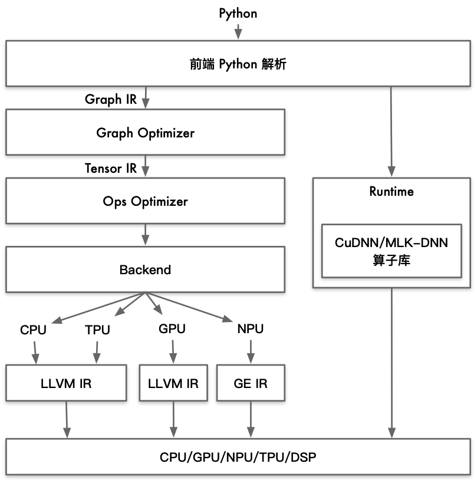
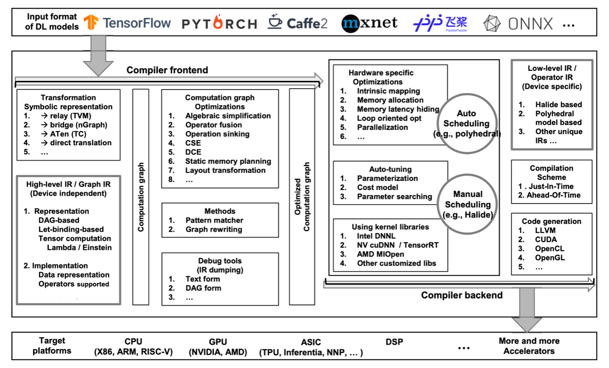
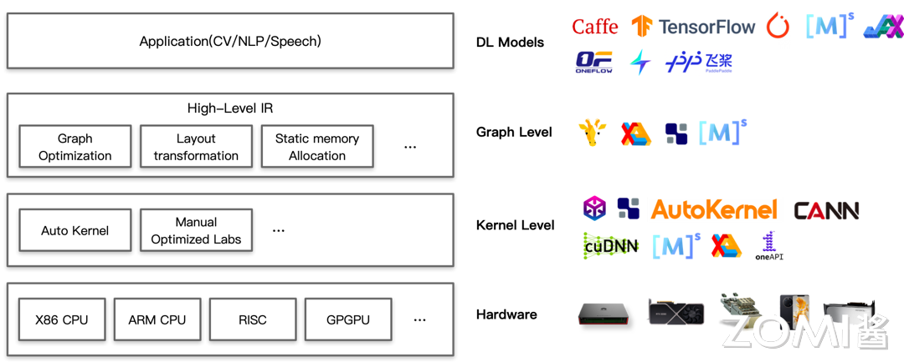

# AI 编译器的通用架构

在上一节中将 AI 编译器的发展大致分为了 3 个阶段，分别为 1）朴素编译器、2）专用编译器以及 3）通用编译器。

本节作为上一节 AI 编译器架构的一个延续，着重讨论 AI 编译器的通用架构。首先将回顾现有 AI 编译器架构（以 PyTorch 作为标杆），随后引出通用 AI 编译器的架构模型，并进一步介绍其 IR 中间表达层、前端优化以及后端优化的细节，最后以图的形式展示现有 AI 编译器全栈产品。

## AI 编译器架构回顾

现有 AI 编译器架构即是专用 AI 编译器的架构：在表达上以 PyTorch 作为标杆，对静态图做转换，转换到计算图层 IR 进行优化；性能上希望打开计算图和算子的边界，进行重新组合优化以发挥芯片尽可能多的算力。

现有 AI 编译器架构图如下图所示。

此编译器接受的高级语言为 Python，编译器前端会对 Python 代码进行解析，解析器会将高层次的代码转换为一个中间表示（IR），以便进一步处理。这里编译器前端会生成 Graph IR 传递给 Graph Optimizer（图优化器）。

Graph Optimizer 接收到 Graph IR 后，会对解析后的计算图进行优化。优化的目的是减少计算图的冗余部分，提高执行效率。这可能包括算子融合、常量折叠等技术。Graph Optimizer 在优化完成后会向 Ops Optimizer（操作优化器）传递一个 Tensor IR。

Ops Optimizer 接收到 Tensor IR 后，其会针对每个算子进行具体的性能优化，例如重排计算顺序、内存优化等。

所有的中间表达都传递至后端之后，后端会生成不同的硬件代码以及可执行程序。

## AI 编译器通用架构

在回顾完现有 AI 编译器架构后，来看看一个理想化的 AI 编译器通用架构应该是什么样的。

笔者推荐各位读者了解一篇关于 AI 编译器的综述，名称为 The Deep Learning Compiler: A Comprehensive Survey。其中有一副插图展示了一个通用 AI 编译器的完整架构，涵盖从模型输入到在不同硬件平台上执行的整个流程。它分为编译器前端（Compiler Frontend）和编译器后端（Compiler Backend）两个主要部分。下面将结合此图对通用 AI 编译器进行初步分析。

### 编译器前端

编译器前端（Compiler Frontend）主要负责接收和处理来自不同深度学习框架的模型，并将其转换为通用的中间表示（IR），进行初步优化。

========== 下面的一堆重点 mark 的内容之间是什么关系？有没有一段话进行介绍？

**Input Format of DL Models（输入格式）**：支持多种深度学习框架，如 TensorFlow、PyTorch、Caffe2、MXNet、飞桨（PaddlePaddle）和 ONNX 等。

**Transformation（转换）**：将来自不同框架的模型转换为统一的表示形式。常见的转换方式包括：TVM 的 Relay、nGraph 的 Bridge、PyTorch 的 ATen（TorchScript）或直接翻译等。

**High-level IR / Graph IR（高层次 IR/图 IR）**：这些 IR 是设备无关的，主要用于表示计算图。表示方法包括 DAG（有向无环图）和基于绑定的张量计算等。实现部分涉及数据表示和操作符支持。

当初步生成 Computation Graph(计算图)后，会通过一些方法对计算图进行进一步的优化。

**Computation Graph Optimizations（计算图优化策略）**：构建计算图并进行优化，具体优化包括：Algebraic simplification（代数简化）、Operator fusion（算子融合）、Operation sinking（操作下沉）、CSE（公共子表达式消除）、DCE（死代码消除）、Static memory planning（静态内存优化）、Layout transformation（布局转换）等。

**Methods（计算图进一步优化方法）**：对计算图进行进一步优化，使用各种方法如 Pattern matcher（模式匹配）和 Graph rewriting（图重写）等。

**Debug Tools（调试工具）**：提供调试工具，如 IR 转储（文本形式和 DAG 形式）等。

### 编译器后端

编译器后端（Compiler Backend）负责将优化后的计算图转换为特定硬件平台的低层次表示，并进行硬件特定优化和代码生成。

========== 下面的一堆重点 mark 的内容之间是什么关系？有没有一段话进行介绍？

**Hardware Specific Optimizations（硬件特定优化）**：针对特定硬件的优化技术，包括：Intrinsic mapping（内在映射）、Memory allocation（内存分配）、Memory latency hiding（内存延迟隐藏）、Loop oriented optimization（面向循环的优化）以及 Parallelization（并行化）等。

**Scheduling（调度）**：包括 Auto Scheduling（自动调度），如 polyhedral（多面体模型）；也包括 Manual Scheduling（手动调度），如 Halide。

**Auto-tuning（自动调优）**：使用自动调优策略，方法包括 Parameterization（参数化模型）、Cost model（成本模型）以及 Parameter searching（参数搜索）等。

**Using Kernel Libraries（使用内核库）**：使用优化的内核库提高执行效率，如：Intel DNNL、NVIDIA cuDNN/TensorRT、AMD MIOpen 或者其他定制化库。

**Low-level IR / Operator IR（低层次 IR/操作符 IR）**：生成设备特定的低层次 IR，包括：基于 Halide 的 IR、多面体模型的 IR 或者其他特有的 IR。

**Compilation Scheme（编译方案）**：支持即时编译（Just-In-Time，JIT）和提前编译（Ahead-Of-Time，AOT）等编译方案。

**Code Generation（代码生成）**：生成适用于特定硬件平台的代码，如：LLVM、CUDA、OpenCL、OpenGL 等。

**Target Platforms（目标平台）**：最终生成的代码可以在多种硬件平台上运行。例如能在 x86、ARM、RISC-V 等架构的 CPU 上运行；或在 NVIDIA、AMD 的 GPU 上运行；亦可在 ASIC（应用专用集成电路）上运行，例如 TPU、Inferentia、NNP 等；也可在 DSP（数字信号处理器）上运行；同时也需要对越来越多新出现的 Accelerators（加速器）拥有一定的兼容性。

在介绍完通用 AI 编译器架构的基本组成后，将继续深入，从 IR、前端优化以及后端优化三个层面更加细致地对通用架构进行分析。

## 中间表达 IR

编译器主要分为前后端，分别针对于硬件无关和硬件相关的处理。每一个部分都有自己的 IR (Intermediate Representation，中间表达)，每个部分也会对进行优化。

### High-level IR（高级 IR）

高级 IR 主要用于表示计算图，它的设计目的是为了解决传统编译器在表达深度学习模型等复杂运算时遇到的困难，同时为实现更高效的优化提供支持。高级 IR 拥有下列显著特点以及功能。

**高级抽象**：高级 IR 是对源代码进行高级抽象的中间表示形式。它将复杂的计算过程和数据流以更简洁、更易于理解的形式表示出来。通过高级 IR，编译器可以更容易地理解和处理深度学习模型等复杂计算图的结构和逻辑。

**支持深度学习模型**：深度学习模型通常由大量的神经网络层和复杂的运算组成，如卷积、池化、全连接等。这些运算在传统的编译器中难以直接表示和优化。高级 IR 的设计考虑到了这些特点，能够更自然地表示深度学习模型的计算图结构，从而为针对这些模型的优化提供了基础。

**优化支持**：高级 IR 不仅仅是一种表示形式，还提供了丰富的优化支持。编译器可以基于高级 IR 进行各种优化，以提高代码执行效率、减少资源消耗等。这些优化包括常见的优化技术，如常量折叠、死代码消除、循环优化等，以及针对深度学习模型特有的优化策略，如张量融合、内存布局优化等。

**硬件无关性**：高级 IR 的设计通常是硬件无关的，也就是说，它不依赖于特定的硬件架构。这使得编译器可以在不同的硬件平台上使用相同的中间表示形式，从而提高了编译器的通用性和可移植性。

**跨平台支持**:由于高级 IR 是硬件无关的，因此可以在不同的平台上进行跨平台的编译和优化。这使得开发人员可以更方便地将他们的代码部署到不同的硬件设备上，而无需对代码进行重写或调整。

### Low-level IR（低级 IR）

低级 IR 描述了深度学习模型的计算过程，其表示比高级 IR 更细粒度，从而可以通过提供接口来调整计算和内存访问，实现针对特定目标的优化。在 The Deep Learning Compiler: A Comprehensive Survey 文中，将常见的低级 IR 实现分类为三类：基于 Halide 的 IR、基于多面体模型的 IR 和其他独特的 IR。

**基于 Halide 的 IR**：Halide 是一种用于图像处理领域的编程语言和库，它提供了一种高效的方式来定义图像处理算法并生成高性能的代码。基于 Halide 的 IR 主要针对计算密集型的图像处理和计算任务，它将计算过程表示为图像上的像素级操作，并提供了丰富的接口来调整计算和内存访问方式。这种 IR 的优势在于其灵活性和高效性，可以针对不同的目标平台生成高度优化的代码。

**基于多面体模型的 IR**:多面体模型是一种用于表示循环嵌套的计算结构和数据访问模式的数学模型，它在并行编程和优化领域得到了广泛应用。基于多面体模型的 IR 将计算过程表示为多维循环的嵌套，同时考虑了数据依赖性和访存模式等方面的信息。这种 IR 的优势在于其对于循环优化和数据访问模式的建模能力，可以帮助编译器生成高效的并行化代码，并充分利用目标硬件的并行计算能力。

**其他独特的 IR**:除了以上两种常见的低级 IR 实现外，还存在一些其他独特的 IR 实现，它们可能针对特定的应用场景或硬件平台进行了定制和优化。这些独特的 IR 可能包括了一些特殊的优化技术或数据结构表示方式，以满足特定应用的需求并提高代码的执行效率。

## 前端优化

构建计算图后，前端会进行图级优化。许多优化在图级别更容易被识别和执行，因为图提供了对计算的全局视图。这些优化仅应用于计算图，而不是后端的实现。因此，它们与硬件无关，可以应用于各种后端目标。

前端优化（Frontend Optimizations）通常由一系列 passes 定义，通过遍历计算图节点并执行图转换来应用这些优化。优化 passes 可以捕获计算图的特定特征，并对其进行重写以实现优化。除了预定义的 passes 外，开发人员还可以在前端定义自定义 passes，以满足特定的优化需求或实现定制化的优化策略。大多数深度学习编译器能够确定每个操作的输入和输出张量的形状，这使得它们可以根据形状信息进行优化。

> 在 The Deep Learning Compiler: A Comprehensive Survey 文中，将前端优化分为三类：节点级优化、块级（窥孔、局部）优化以及数据流级（全局）优化。

### 节点级优化

节点级优化是指针对计算图中的单个节点或操作进行的优化。这些优化是针对单个计算节点的，旨在改进节点级别的计算效率和性能。常用的节点级优化方法包括 Zero-dim-tensor elimination（零维张量消除）、Nop Elimination（空操作消除）等。

### 块级（窥孔、局部）优化

块级优化是指在计算图中针对连续的一组节点或者局部区域进行的优化。这些优化更关注局部区域的性能改进，而不是单个节点。窥孔优化指的是通过在计算图中寻找具有特定模式的子图，并将其替换为更高效的等效形式来提高性能。局部优化则更广泛地指涉到对一组节点或者一个子图进行的各种优化。常用的方法包括代数简化、常量折叠、算子融合等。

### 数据流级（全局）优化

数据流级优化是针对整个计算图或者数据流进行的优化，目标是最大化整体计算效率和性能。这些优化通常涉及到对数据流的分析和优化，以最大程度地减少数据依赖、提高并行性，或者优化数据传输和存储等方面的操作。全局优化可能包括流水线调度、内存布局优化、并行化、数据流重构等技术，以实现对整个计算过程的全局性改进。常用的方法包括 Common sub-expression elimination（公共子表达式消除）、DCE（死代码消除）等。

## 后端优化

通用 AI 编译器的后端通常包含各种特定硬件优化、自动调整和优化内核库。特定硬件优化能够实现针对不同硬件目标的高效代码生成。与此同时，自动调整在编译器后端中至关重要，可以减轻手动确定最佳参数配置的工作量。此外，高度优化的内核库也被广泛用于通用处理器和其他定制的 AI 加速硬件上。

### 特定硬件优化

特定硬件优化，也称为目标相关优化，是为了获得针对特定硬件的高性能代码而应用的。应用后端优化的一种方法是将低级 IR 转换为 LLVM IR，利用 LLVM 基础设施来生成优化的 CPU or GPU 代码。另一种方法是利用深度学习领域的专业知识设计定制化的优化，更有效地利用目标硬件。

### 自动调整

由于硬件特定优化中参数调优的巨大搜索空间，利用自动调优确定最佳参数配置是必要的。例如 TVM、TC 和 XLA 等 AI 编译器支持自动调优功能。这里提出两个常见的自动调优方法。

**Halide/TVM 方法**：Halide 和 TVM 是两个常用的深度学习编译器，它们提供了一种将调度和计算表达分开的方式。这意味着用户可以通过调整调度策略和计算表达来优化程序的性能。借助自动调整技术，Halide 和 TVM 可以自动搜索和评估不同的调度和计算表达组合，从而找到性能最优的配置方案。

**应用多面体模型进行参数调整**：多面体模型（Polyhedral model）是一种用于描述嵌套循环的数学模型，在并行编程和优化中得到了广泛应用。使用多面体模型进行参数调整，可以将优化问题转化为对多面体的参数化表示和优化，从而实现对程序执行的更精细的控制和调整。

### 优化内核库

各厂商会针对自己的加速硬件优化本厂商提供的特定优化内核库。在 The Deep Learning Compiler: A Comprehensive Survey 文中提到了几个常用的核心库，例如英特尔的 DNNL、NVIDIA 的 cuDNN、AMD 的 MIOpen 等。这些库针对计算密集型和内存带宽受限的基本操作进行了高度优化，如卷积、矩阵乘法（GEMM）、循环神经网络（RNN）、批量归一化、池化等。同时根据硬件特性（如 AVX-512 ISA、张量核心等），针对不同硬件架构进行了优化。

这些库支持可定制的数据布局，使其易于集成到深度学习应用程序中，避免频繁的数据布局转换。支持低精度训练和推断，包括 FP32、FP16、INT8 和非 IEEE 浮点格式（如 bfloat16）。

DL 编译器（如 TVM、nGraph 和 TC）在代码生成阶段可以生成对这些库的函数调用。然而，如果 DL 编译器需要利用现有的优化核心库，则需要将数据布局和融合风格转换为核心库中预定义的类型，可能会破坏最优的控制流。此外，DL 编译器将核心库视为黑盒，无法在调用核心库时应用跨操作的优化（例如操作融合）。

使用优化的核心库可以显著提高性能，特别是对于特定的高度优化基本操作。然而，如果计算无法满足特定的高度优化基本操作，则可能会受到进一步优化的限制，并且性能可能不够优化。

## AI 编译器全栈产品

现用一图流来展示 AI 编译器全栈产品。

针对上图，现在从下向上分层介绍。

### Hardware

最下层的为硬件层，包括 X86 架构的 CPU、ARM 架构的 CPU、RISC、GPU 以及各种 NPU 例如华为昇腾 Ascend 系列等。硬件层包罗万象，是目前所有能拥有计算加速功能的设备的统称。

### Kernel Level

拥有了计算加速硬件，现在需要把算法编译到硬件上真正地去执行。Kernel 层需要提供一些真正能执行的算子，本层包括了各个厂商推出的异构计算架构，包括 Meta AI Research 的 Tensor Comprehensions、Apache 的 TVM、Cambricon Technologies 的 AutoKernel、华为昇腾的 CANN 以及 NVIDIA 的 cuDNN 等。Kernel 层编译器均直接作用于硬件，是直接给硬件赋能的一层，需要尽可能释放硬件的全部潜力。

### Graph Level

再往上层走，来到计算图层的 IR 或者编译器，包括 Meta 的 Glow、Intel 的 N-Graph、谷歌的 XLA、Apache 的 TVM 以及华为的 MindSpore 等。

### DL Models

来到最顶层，则是一众深度学习的框架。包括稍早期的 Caffe、TensorFlow，以及目前较为主流的 PyTorch、MindSpore、JX、OneFlow，还包括国内诸多厂商自研的深度学习框架例如 Jittor、PaddlePaddle 等。

## 小结与讨论

======= 接总结几个要点，如 - XXXX：XXXX 一句话形式。

## 本节视频

<html>
<iframe src="https://player.bilibili.com/player.html?isOutside=true&aid=733374660&bvid=BV1qD4y1Y73e&cid=911969354&p=1&as_wide=1&high_quality=1&danmaku=0&t=30&autoplay=0" width="100%" height="500" scrolling="no" border="0" frameborder="no" framespacing="0" allowfullscreen="true"> </iframe>
</html>
