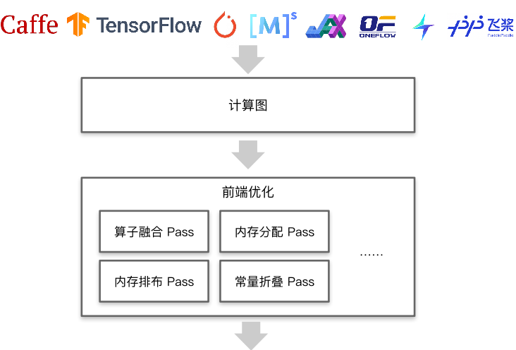
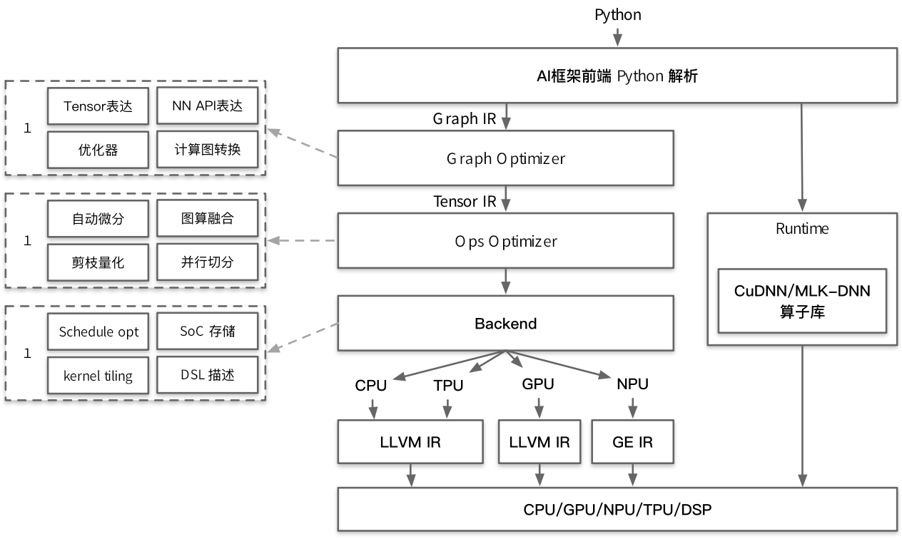

<!--Copyright © 适用于[License](https://github.com/chenzomi12/AISystem)版权许可-->

# AI 编译器前端优化

AI 编译器的前端优化的整体框图如下图所示，最上层为 AI 框架，例如 TensorFlow、PyTorch、MindSpore 等，这些 AI 框架的主要作用为解析 Python 代码产生计算图，并将计算图传递给 AI 编译器进行前端优化。

## 前端优化整体架构

其中，AI 编译器的前端优化中包含许多图层优化的技术点，本节将介绍一些优化 Pass，包括算子融合 Pass、内存分配 Pass、内存排布 Pass、常量折叠 Pass 等，不同的 Pass 执行不同的优化逻辑，相互组合共同完成 AI 编译器的前端优化。

AI 编译器整体架构图如图所示。在图中最上层，AI 框架前端将对 Python 代码进行解析产生 GraphIR，而 AI 编译器的前端优化将对生成的 GraphIR 进行多种优化处理，处理方式包括但不限于上文中提及的各种优化 Pass 等。

在 AI 编译器整体架构图中其他的部分，如 AI 编译器的后端优化等，将在后续章节中进行介绍。

在如下图所示的 AI 编译器前端优化流程图中，AI 编译器将对输入的 GraphIR，依次执行包括但不限于常量折叠、常量传播、算子融合、表达式简化、表达式替换、公共子表达式消除等各种前端优化 Pass，各个 Pass 的执行结果仍然为 GraphIR 并将输入到下一个 Pass 中，直到前端优化结束并输出最终优化后的 GraphIR。

## 本节视频

<html>
<iframe src="//player.bilibili.com/player.html?isOutside=true&aid=263727934&bvid=BV1ne411w7n2&cid=922979928&p=1" scrolling="no" border="0" frameborder="no" framespacing="0" allowfullscreen="true"></iframe>
</html>
