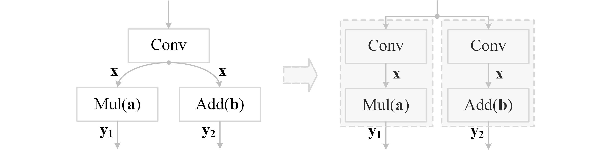

# 算子融合

> 待更新中，卷的不行了卷得不行了！ZOMI 一个人晚上下班后才能更新视频和文章，如果您有兴趣也非常希望您能够参与进来（Github Issues 区留言或者 B 站私信 ZOMI 哦），一起写 AI 系统，一起分享 AI 系统的知识。

算子融合主要是解决 AI 处理器两方面性能难题：**内存墙**与**并行墙**。算子融合的核心目的是减少访存次数与 kernel 开销。

- **内存墙**：主要是访存瓶颈引起。算子融合主要通过对计算图上存在数据依赖的“生产者-消费者”算子进行融合，从而提升中间 Tensor 数据的访存局部性，以此来解决内存墙问题。这种融合技术也统称为“Buffer 融合”。在很长一段时间，Buffer 融合一直是算子融合的主流技术。早期的 AI 框架，主要通过手工方式实现固定 Pattern 的 Buffer 融合。

-  **并行墙**：主要是由于芯片多核增加与单算子多核并行度不匹配引起。可以将计算图中的算子节点进行并行编排，从而提升整体计算并行度。特别是对于网络中存在可并行的分支节点，这种方式可以获得较好的并行加速效果。

## 算子融合方式

### kernel 融合

将多个卷积核融合成一个卷积核，可以显著减少内存占用和访存的开销，从而提高卷积操作的速度。在执行如下图的卷积操作时，可以将两个卷积算子融合为一个算子，以增加计算复杂度为代价，降低访存次数与内存占用。


通过示例代码模拟卷积核扩张与融合过程，将两个卷积算子融合成一个更大的卷积算子，具体如下所示：

```python
import torch
import torch.nn.functional as F

# kernel fusion 示例
if __name__ == "__main__":
    torch.manual_seed(0)
    # 生成输入
    input = torch.randn(1, 3, 32, 32)

    # 生成 conv1 的权重和偏，out_channels=16, in_channels=3, kernel_height=3, kernel_width=3
    conv1_weight = torch.randn(16, 3, 3, 3)
    conv1_bias = torch.randn(16)
    conv1_output = F.conv2d(input, conv1_weight, bias=conv1_bias, stride=1, padding=1)
    print('conv1_output: ', conv1_output)

    # 生成 conv2 的权重和偏置，out_channels=16, in_channels=3, kernel_height=1, kernel_width=1
    conv2_weight = torch.randn(16, 3, 1, 1)
    conv2_bias = torch.randn(16)
    conv2_output = F.conv2d(input, conv2_weight, bias=conv2_bias, stride=1, padding=0)
    print('conv2_output: ', conv2_output)

    # ============================== kernel fusion ================================== #
    # 将 conv2 的卷积核权重由(1, 1)扩展到(3, 3)
    weight_expanded = F.interpolate(conv2_weight, size=(3, 3), mode='bilinear', align_corners=False)
    # conv1 卷积核与 conv2 卷积核融合
    weight_fusion = torch.concatenate([conv1_weight, weight_expanded], dim=0)
    # conv1 偏置与 conv2 偏置融合
    bias_fusion = torch.concatenate([conv1_bias, conv2_bias], dim=0)
    # 1 次融合后的权重与偏置卷积，替代 conv1 与 conv2 两次卷积
    kernel_fusion_output = F.conv2d(input, weight_fusion, bias=bias_fusion, stride=1, padding=1)
    print(kernel_fusion_output)
```

### 层融合

#### 纵向融合

下图所示，将 C 与 D 两个算子融合成一个算子，可减少一次访存与 kernel 的开销。


下图左侧，Conv 算子输出$\bold{x}$，顺序经过 Add、Mul、Add 算子处理后得到$\bold{y}$，处理过程可表示为$\bold{y}=\overbrace{\bold{a}\underbrace{(\bold{x}+\bold{b})}_{\bold{x}_{1}}}^{\bold{x}_{2}}+\bold{x}$。其中，$\bold{x}+\bold{b}=\bold{x}_{1}$为第一个 Add 算子的中间结果，$\bold{a}x_{1}=\bold{x}_{2}$为 Mul 算子输出的中间结果；在执行 Mul 算子时，需要对中间结果$x_{1}$进行访存。下图右侧，将 Add 与 Mul 算子融合后，可减少一次对中间结果$x_{1}$的访存。 


下图左侧 A 算子执行后，B 与 C 算子访问 A 计算结果，并行执行；将 A 与 B，A 与 C 算子融合后，可对 AB 与 AC 算子并行执行无需访存算子 A 的中间计算结果。


下图左侧，$\bold{y}_{1}=\bold{a}\bold{x}$，$\bold{y}_{2}=\bold{b}+\bold{x}$；Conv 算子执行后对中间结果$\bold{x}$缓存；Mul 与 Add 算子可并行执行，但 Mul 与 Add 算子均需访问中间结果$\bold{x}$。下图右侧，分别将 Conv 与 Mul，Conv 与 Add 算子融合后再并行执行，可避免对 Conv 算子中间结果$\bold{x}$的缓存与访问。



下图左侧需要 3 次 kernel 开销；右侧将 A 与 B 算子融合后仅需 2 次 kernel 开销，将 A 与 B 的结果保存供 C 访问，以提高内存访效率。


下图左侧，融合前分别执行 Conv, Mul, Add 算子需要 3 次 kernel 开销，1 次中间结果$\bold{x}$的缓存，2 次中间结果$\bold{x}$的访问；下图左侧，将 Conv 算子与 Mul 算子融合后，将融合后算子输出的中间结果$\bold{y}_{1}$与$\bold{x}$缓存至同一块内存中；下图右侧将 Conv 与 Mul 算子融合后仅需 2 次 kernel 开销，一次中间结果$[\bold{y}_{1};\bold{x}]$缓存，1 次中间结果$[\bold{y}_{1};\bold{x}]$的访问；


#### 横向融合

下图左侧 B 与 C 并发，执行 ABC 算子共需 3 次 kernel 开销；右侧将 BC 算子融合后仅需 2 次 kernel 开销，两者计算都依赖 A 的结果放入内存，以提高内存访效率。


下图左侧融合前，Conv、Mul 与 Add 算子分别需要 3 次 kernel 开销，1 次中间结果$\bold{x}$的缓存，2 次中将结果$\bold{x}$的访问；将 Mul 与 Add 算子融合后，仅需要 2 次 kernel 开销，1 次中间结果$\bold{x}$缓存，一次中间结果$\bold{x}$访问。


### 算子融合方式小结

算子融合主要解决模型训练或推理过程中的读入数据量；同时，减少中间结果的写回操作，降低访存次数。如下图所示，通过 kernel 融合方式与层融合方式，将 5 个算子融合成 2 个算子。


- kernel 融合：Enlarge conv & Fuse conv，扩大卷积核权重，实现横向算子融合；本质以是增大计算复杂度为代价，减小访存次数与 kernel 的开销。

- 层融合：Fuse conv + add，将 conv 与 add 算子进行纵向融合；

- 层融合：Fuse conv + relu，将 conv 与 relu 算子进行纵向融合。

## Conv-BN-ReLU 算子融合

### BN 计算流程

在 BN 前向计算过程中，首先求输入数据的均值$\mu$与方差$\sigma^{2}$，然后使用$\mu$、$\sigma^{2}$对每个输入数据进行归一化及缩放操作。其中，$\mu$、$\sigma^{2}$依赖于输入数据；归一化及缩放计算的输入则依赖于输入数据、均值、方差以及两个超参数。下图为前向计算过程中 BN 的数据依赖关系：


其中，$\gamma$和$\beta$是一个可学习的参数，在训练过程中，和其他层的权重参数一样，通过梯度下降进行学习。在训练过程中，为保持稳定，一般使用滑动平均法更新$\mu$与$\sigma^{2}$，滑动平均就是在更新当前值时，保留一定比例上一时刻的值，以均值$\mu$为例，根据比例$\theta$（如，$\theta=0.99$）保存之前的均值，当前只更新 $1-\theta$ 倍的本 Batch 的均值，计算方法如下：

$$
\mu_{i}=\theta_{\mu_{i-1}}+(1-\theta)\mu_{i}
$$

BN 反向计算过程中，首先求参数误差；然后使用参数误差$\Delta\gamma$、$\Delta\beta$ 计算输入误差$\Delta X$ 。参数误差导数依赖于输出结果误差$\Delta Y$以及输入$X$；输入误差$\Delta X$ 依赖于参数误差导数及输入$X$、输出误差$\Delta Y$。反向过程包括求参数误差以及输入误差两部分，BN 反向计算的关键访存特征是两次使用输入特征$X$及输出误差$\Delta Y$，分别用于计算参数误差$\Delta\gamma$、$\Delta\beta$ 及输入数据误差$\Delta X$。


### 计算访存分析

前向计算过程中，每层的计算结果需写出主存，用于反向计算过程中计算输入误差；反向计算过程中，每层的结果误差也需写出到主存，原因是反向计算时 BN 层及卷积层都需要进行两次计算，分别求参数误差及输入数据误差，$X$、$\Delta Y$ 加载两次来计算参数误差$\Delta\gamma$、$\Delta\beta$  及输入误差$\Delta X$ 。ReLU 输入$Y$ 不需要保存，直接依据结果$Z$ 即可计算出其输入数据误差。


### 模型重构及算子融合

前向过程中，BN 重构为两个子层：BN_A 和 BN_B。其中 BN_A 计算均值与方差，BN_B 完成归一化与缩放，分别融合于相邻卷积层及激活层。首先从主存读取输入$X$、均值$\mu$、方差$\sigma^{2}$ 、参数$\gamma$、$\beta$，计算 BN_B，完成归一化及缩放计算，将结果 Y 用于激活计算，输出$Z$用于卷积计算，卷积结果$X^{'}$写出到主存之前，计算 BN_A，即求均值$\mu^{'}$与方差$\sigma^{2}$。完成“**归一化缩放->激活层->卷积层->计算卷积结果均值与方差**”结构模块的前向计算过程只需要读取一次，并写回卷积计算结果$X^{'}$及相关参数。


具体融合计算过程如下所示：

- 卷积计算：

$$
{z} = {w} * {x} + {b}
$$

- BN 计算：

$$
y = \gamma\frac{{\left( {z - mean} \right)}}{{\sqrt {\operatorname{var} } }} + \beta
$$

- ReLU 计算：
  
  $$
  y=max(0,y)
  $$
  
- 融合卷积、BN 与 ReLU 的运算：

  将卷积计算公式带入到 BN 计算公式中，可得到下式：
  
  $$
  y = \gamma\frac{{\left( {(w*x+b) - mean} \right)}}{{\sqrt {\operatorname{var} } }} + \beta
  $$
  
  展开后可得到：
  
  $$
  y =\gamma\frac{w}{{\sqrt {\operatorname{var}}}}*x+\gamma\frac{{\left( {b - mean} \right)}}{{\sqrt {\operatorname{var} } }}  + \beta
  $$
  
  也即将卷积与 BN 融合后的新权重$w'$与$b'$，可表示为如下所示：
  
  $$
  \begin{gathered}
    w' = \gamma\frac{w}{{\sqrt {\operatorname{var} } }}  \hfill \\
    b' = \gamma\frac{{\left( {b - mean} \right)}}{{\sqrt {\operatorname{var} } }}  + \beta \end{gathered}
  $$
  
  最后，将卷积、BN 与 ReLU 融合，可得到如下表达式：
  
  $$
  \hfill \\
    y=max(0,w'*x+b') \hfill \\
  $$

## TVM 融合规则与算法

[TVM](https://github.com/apache/tvm)是一个端到端的机器学习编译框架，它的目标是优化机器学习模型让其高效运行在不同的硬件平台上。它前端支持 TensorFlow, Pytorch, MXNet, ONNX 等几乎所有的主流框架。它支持多种后端(CUDA，ROCm，Vulkan，Metal，OpenCL，LLVM，C，WASM)及不同的设备平台(GPU, CPU, FPGA 及各种自定义 NPU)。

TVM 主要用于推理场景。在架构上，主要包括 Relay 和 TIR 两层。其通过 Relay 导入推理模型，随后进行融合优化，最后通过 TIR 生成融合算子。TVM 整体的算子融合策略是基于支配树来实现的，下面将介绍支配树等相关概念。

### TVM 支配树

支配树与支配点：
- 支配树：各个点的支配点构成的树
- 支配点：所有能够到达当前节点的路径的公共祖先点（ Least Common Ancestors，LCA）

具体而言，对于一张有向图(可以有环)我们规定一个起点$r$, 从$r$点到图上另一个点$w$可能存在很多条路径(下面将$r$到$w$简写为$r→w$)。如果对于$r→w$的任意一条路径中都存在一个点$p$, 那么我们称点$p$为$w$的支配点(也可以称作是$r→w$的必经点), 注意$r$点不讨论支配点。下面用$idom[u]$表示离点$u$最近的支配点。对于原图上除$r$外每一个点$u$, 从$idom[u]$向$u$建一条边, 最后我们可以得到一个以$r$为根的树。这个树我们就叫它"支配树"。如下图所示，到达 Node8 的路径有 Node3->4->7->8，Node3->5->7->8，Node3->6->7->8，因此 Node4，Node5，Node6,，Node7 为 Node8 的支配点。


TVM 的算子融合策略就是检查每个 Node 到其支配点的 Node 是否符合融合条件，如果符合就对其进行融合。如上图，检查 Node4->Node7->Node8 是否能融合，若可以融合，则用新的算子替代原来路径上的算子。因此支配树作用如下：

- 检查每个 Node 到其支配点的 Node 是否符合融合条件
- 融合的基本规则是融合掉的 Node 节点不会对剩下的节点产生影响

支配树生成方式：

- 根据 DAG 进行深度优先遍历，生成 DFS 树；注意，生成的 DFS 树是倒序的，也即最后一个节点为 0，然后依次递增
- 根据 DFS 树及对应的边生成 DOM 树
- 使用 Group 来描述多个 Node 是否能被融合；如果一个算子不能和任何其他算子融合，那么这个 group 就只有一个独立的算子；如果几个算子能够融合，则能融合的算子就构成了一个 group

### TVM 算子融合流程

&emsp;&emsp;TVM 算子算子融合流程如下：

- 通过 AST 转换为 Relay IR，遍历 Relay IR
- 建立 DAG 用于后支配树分析
- 应用算子融合算法，遍历每个 Node 到它的支配带你的所有路径是否符合融合规则，完成融合后，遍历节点创新的 DAG 图

&emsp;&emsp;TVM 提供了 4 种融合规则，具体如下：

- injective(one-to-one map)：映射函数，比如加法，点乘等。
- reduction：约简，如 sum/max/min，输入到输出具有降维性质，如 sum/max/min。
- complex-out-fusable(can fuse element-wise map to output)，计算复杂类型，如 conv2d。
- opaque(cannot be fused) 无法被融合的算子，如 sort。

## 小结

- 算子的融合方式有横向融合和纵向融合，但根据 AI 模型结构和算子的排列，可以衍生出更多不同的融合方式。
- 通过 Conv-BN-ReLU 算子融合栗子，了解到如何对算子进行融合和融合后的计算，可以减少对于对访存的压力。
- 在编译器中，一般融合规则都是通过 Pass 来承载，不同的 Pass 处理不同的融合规则，而融合规则主要是人工定义好。

## 本节视频

<html>

<iframe src="https:&as_wide=1&high_quality=1&danmaku=0&t=30&autoplay=0" width="100%" height="500" scrolling="no" border="0" frameborder="no" framespacing="0" allowfullscreen="true"> </iframe>
</html>
