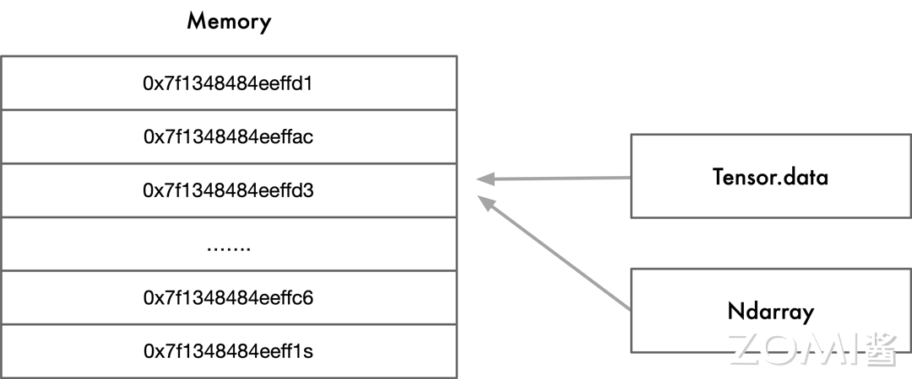
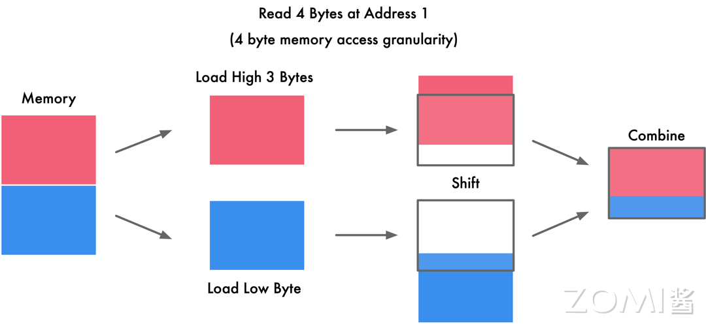
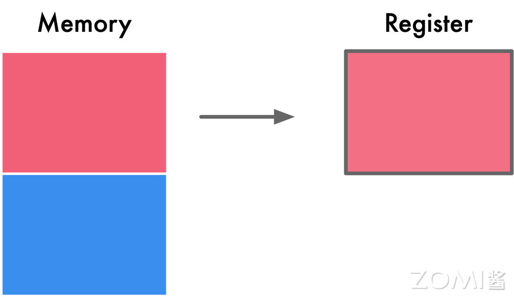
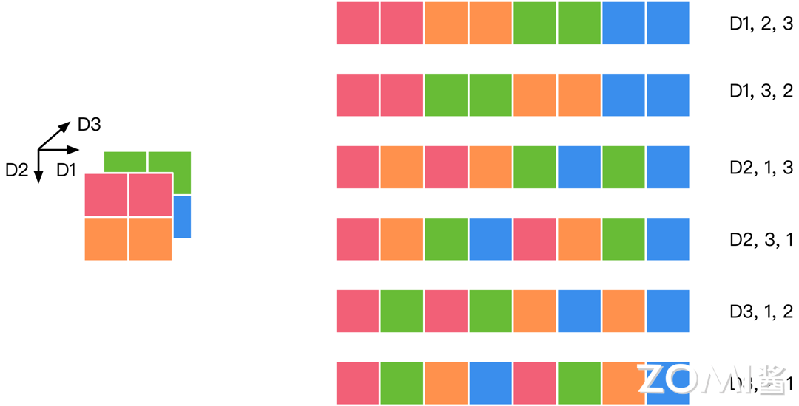
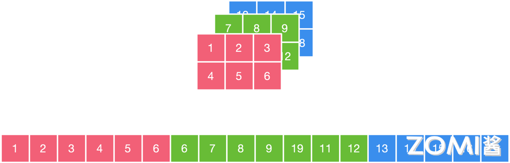
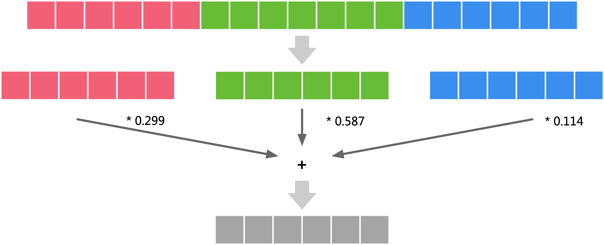
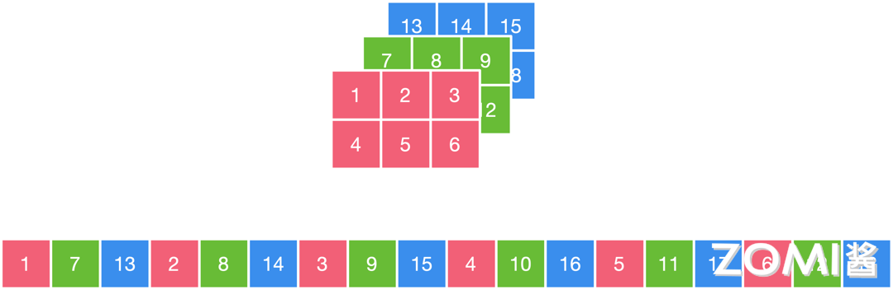
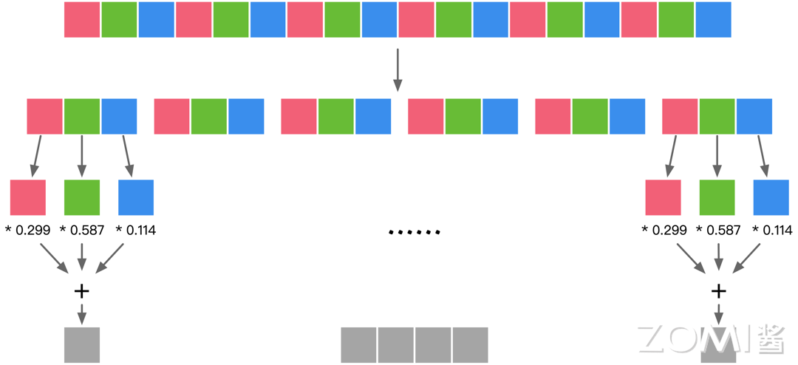
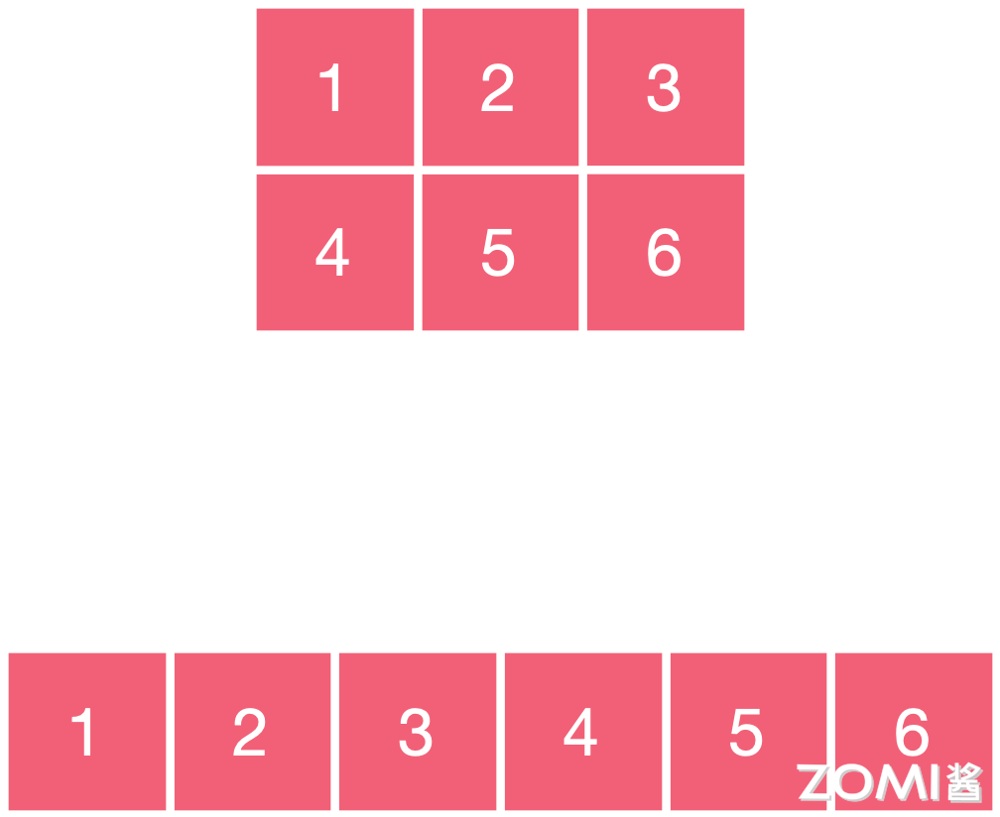
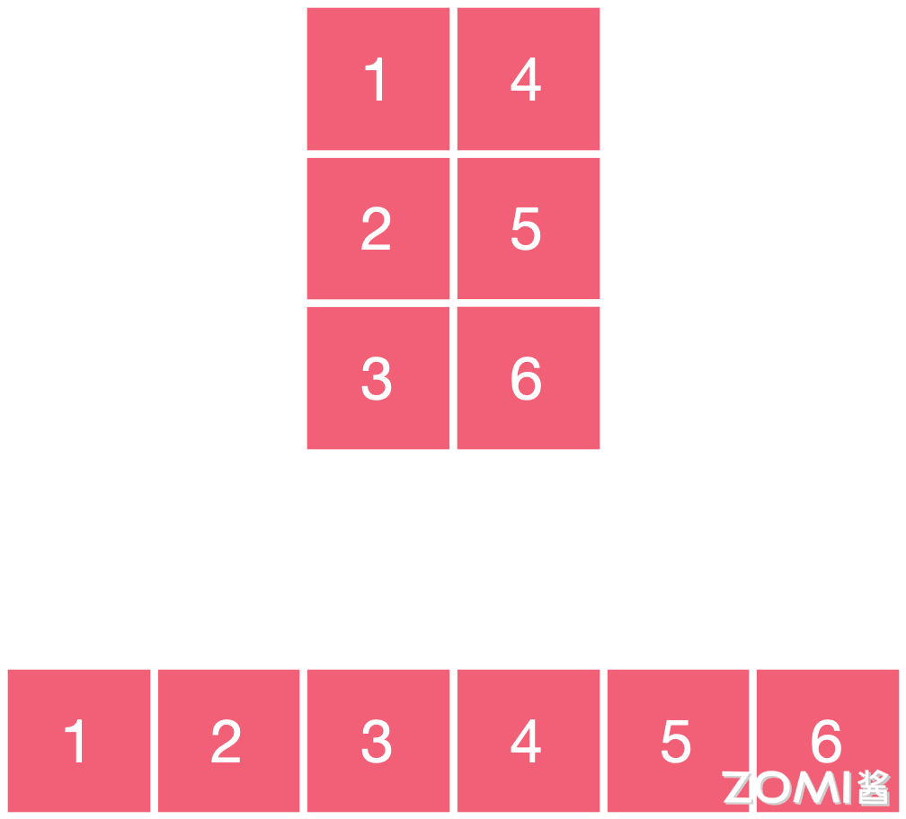

<!--Copyright © 适用于[License](https://github.com/chenzomi12/AISystem)版权许可-->

# 布局转换原理

数据布局转换目前已经越来越多地用于编译器的前端优化，将内部数据布局转换为后端设备友好的形式。数据布局转换主要影响程序的空间局部性，所谓空间局部性指的是如果一个内存位置被引用了一次，那么程序很可能在不远的将来引用其附近的一个内存位置，它会影响到程序执行中的缓存及其他性能。目前已经有许多数据布局转换技术：数组维度的排列，数据分块等等。

接下来，我们将简单介绍数据布局转换，包括数据在内存如何排布，张量数据在内存中如何排布，以及数组维度排列的具体应用如 NCHW 与 NHWC 这两种数据排布方式。

## 数据内存排布

在内存中，数据的排布主要依赖于操作系统的内存管理机制和数据结构的实现方式。内存主要分为栈，堆，数据段，代码段等几个主要区域，数据在内存空间中按照字节进行划分，那么从理论上来说对于任何类型的变量访问都可以从任意地址开始，但实际情况中，在访问特定类型变量的时候经常需要在特定的内存地址访问，接下来我们将通过内存对齐这个概念详细解释这一现象。

### 内存对齐

如下图所示，右侧代表着数据，左侧代表着内存的多个地址，数据存放在内存的某个地址中。内存对齐指的是数据元素按照一定的规则在空间上排列，而不是顺序的一个接一个的排放。数据在内存中存储时相对于起始地址的偏移量是数据大小的整数倍，称为自然对齐，相对应的通过编译器或语言的指令强制变量按照特定的对齐方式存储，称为强制对齐。

内存对齐的原因：从硬件的层面来看，虽然数据在内存中是按照字节进行存储，但是处理器从内存中读取数据是通过总线通信，总线默认传输的是字，即处理器按照字节块的方式读取内存。

举个例子，比如 32 位系统从内存中以 4 字节为粒度进行读取，64 位系统从内存中以 8 字节为粒度进行读取，所以当在处理器上进行未对齐的地址访问时，处理器将读取多个字，还有些处理器平台不支持访问任意地址上的任意数据。

详细展开来讲，以 4 字节存取粒度的处理器为例，如下图所示，我们现在要读取一个 int 变量，其有 4 个字节，假如没有内存对齐机制，将一个 int 放在地址为 1 的位置，那么我们需要读取的有地址 1234，具体操作时首先需要从地址 0 开始读取，然后取其较高的三位 123，剔除首字节 0，第二次从地址 4 开始读取，然后只取其较低的一位 4，之后将两个数据合并。

总体上来说，如果有内存对齐，如下图所示，我们只需读取一次，而没有内存对齐机制，将导致访问请求数据所需的内存事务数增加至 2 倍。

总结一下，现代处理器上的内存子系统仅限于以其字大小的粒度和对齐方式访问内存，下面我们来总结一下内存中字粒度访问和内存对齐的原因。

原因一为速度问题，现代处理器具有多个级别的高速缓存，数据必须通过这些缓存；支持单字节读取将使内存子系统的吞吐量与执行单元的吞吐量紧密地绑定，会消耗大量 CPU 资源，成为瓶颈。CPU 总是以其字的大小进行内存读取，进行未对齐的内存访问时，处理器将读取多个字，需要读取变量所跨越内存的所有字，同时进行处理。将导致访问请求数据所需要的内存事务增加 2 倍。

原因二为原子性，CPU 可以在一个对齐的内存字上操作，意味着没有指令可以中断该操作。这对于许多无锁数据结构和其他并发范式的正确性至关重要。除此之外，内存对齐还可以用于优化缓存和 SIMD 指令，内存对齐有助于利用缓存行的特性。缓存通常以固定大小的缓存行存储数据，如果数据按照缓存行对齐，可以最大程度地减少对内存的访问次数，提高缓存的命中率。对齐的内存访问对于使用 SIMD 指令集的操作更为重要。这些指令集通常要求数据在内存中按照一定的对齐方式排列，以便能够一次性处理多个数据。

### 大小端存储

数据在内存中是按照字节进行存储，但是有些数据类型的长度是超过 1 个字节的，比如 C/C++中，short 类型一般是 2 个字节，int 类型一般 4 个字节等，存在着一个如何安排多个字节数据中各字节存放顺序的问题。

- 大端存储：大端模式，是指数据的高字节保存在内存的低地址中，而数据的低字节保存在内存的高地址中，这样的存储模式有点儿类似于把数据当作字符串顺序处理：地址由小向大增加，而数据从高位往低位放，更符合人们阅读的习惯。

- 小端存储：小端模式，是指数据的高字节保存在内存的高地址中，而数据的低字节保存在内存的低地址中。

假设目前有一个 4 字节数据为 0x12 34 56 78，大端模式按照地址从低到高的顺序为 0x12  |  0x34  |  0x56  |  0x78，小端模式按照地址从低到高的顺序则为 0x78  |  0x56  |  0x34  |  0x12，计算机总是从内存低地址到高地址的顺序，按字节读取。

两者各有优缺点，大端模式优点：符号位在所表示的数据的内存的第一个字节中，便于快速判断数据的正负和大小，小端模式优点：1. 内存的低地址处存放低字节，所以在强制转换数据时不需要调整字节的内容（比如把 int 的 4 字节强制转换成 short 的 2 字节时，就直接把 int 数据存储的前两个字节给 short 就行，因为其前两个字节刚好就是最低的两个字节，符合转换逻辑）； 2. CPU 做数值运算时从内存中依顺序依次从低位到高位取数据进行运算，直到最后刷新最高位的符号位，这样的运算方式会更高效。

## 张量数据布局

如下图所示，张量可以有零维，一维，二维，三维等等多种形式，张量可以看作是一个多维数组，其在内存中排布为按字节存储。

零维张量只有一个数，我们称为标量。一维张量有多个数，我们称为向量，这两者在内存中的存储并没有什么疑议，是按顺序存储。二维张量是一个矩阵，其有两个维度，那么在内存中排布是按照行的维度，还是按照列的维度优先进行存储，这个也就是我们接下来要讲的行优先排布方式与列优先排布方式。

在 AI 研究中，经常会有图片格式的数据的存在，如果其是彩色图像，那么其每个像素点包括[r,g,b]三个通道，此时就需要三个维度来进行描述，那么其在内存排布的时候是优先行，列还是通道进行存储呢，接下来我们来详细介绍一下高维张量在数据中的排布方式。

### 行/列优先排布方式

如下图的左侧所示，我们针对的案例是一个 3*2*2 的三维张量，在图形中它可以轻松表示为三个维度，但是在计算机内存里存储的时候，是线性的存储，也就是说所有三个维度的元素都被存储到了一行。下图右侧所示为行优先排布方式，按行的顺序依次存储红行橙行，然后第二个通道绿行蓝行这些颜色的元素。

下图为列优先排布方式，按列的顺序以红橙红橙红橙的排布方式，第二个通道绿蓝绿蓝绿蓝的排布方式进行存储。

行优先存储和列优先存储并没有绝对的好坏关系，相对比较通用的结论是：对于行优先遍历的，使用行优先存储，对于列优先遍历的，使用列优先存储。相邻操作访存地址应该尽可能接近。通常根据这个原则去排布数据能够得到较优的访存。这是由缓存的结构决定的。这个原则被称为访存的空间局部性，也即相近的代码（指令）最好访问相邻的数据，这样硬件能够提供更好的性能。

三维张量的数据布局方式实际上并不止行优先排布方式和列优先排布方式，按照排列组合来进行计算，三个维度按顺序排列共有六种排列方式，如下图所示，我们将三个维度按照横行，列，通道分别定义为 D1，D2，D3，那么按照图示我们有 D1，2，3、D1，3，2、D2，1，3、D2，3，1、D3，1，2、D3，2，1 足足六种排列方式，可见高维张量在内存中的数据排布方式的选择相当复杂和多样。

## NCHW 与 NHWC

在深度学习领域中，多维数据通过多维数组存储，比如卷积神经网络的特征图通常用四维数组保存：四个维度分别为“N”batch 批量大小，一般指图像数量，“C”channels 特征图通道数，“H”height 特征图的高度，和“W”width 特征图的宽度。我们可以将数据分为多个维度，然而对于计算机而言，数据的存储只能是线性的，数据的不同排布方式会导致数据访问特性不一致，所以为了考虑程序的执行性能，我们接下来讨论在哪些情况下数据排布方式适合 NCHW，哪些情况下适合 NHWC。

### NCHW

下面，我们来举个 NCHW 数据排布方式的例子，如下图所示，这个例子中的图片分为红绿蓝三个通道，假设我们使用的是"NCHW"的数据排布方式，这里我们先将各方向的定义在这个图中详细说明，1 2 3 这个方向为 W，1 4 这个方向为 H，1 7 13 这个方向为 C，N 方向只有一个图片，暂时不讨论，"NCHW"的数据排布方式，是先取 W 方向的数据，即 123，再取 H 方向的数据，即 123 456，再取 C 方向的数据，即 123456 789/10/11/12 13/14/15/16/17/18，在计算机中存储时即为图示下侧的序列，简单地来说，也就是先在一个通道中，按照 W 方向/H 方向存储数据，接着再到剩余通道中按同样方式存储数据，其突出特点是同一个通道的数值连续排布，更适合需要对每个通道单独运算的操作，如 MaxPooling 最大池化操作，"NCHW"的计算时需要的存储更多，一次存储对应一个通道的数据，适合 GPU 运算，正好利用了 GPU 内存带宽较大并且并行性强的特点，其访存与计算的控制逻辑相对简单。

如下图所示，按照"NCHW"的数据排布方式，目标是计算灰度值，那么我们需要先将通道一的数据加载进内存，乘以 0.299，然后每次计算都可能需要加载一整个完整通道的数据，通道二所有数据值乘以 0.587，通道三所有数据值乘以 0.114，最后将三个通道结果相加得到灰度值，三个操作是独立的，可以在 GPU 上并行完成。

### NHWC

同样的图片，假设我们使用的是"NHWC"的数据排布方式，按照上文定义的方向，我们先取 C 方向的数据，即 17/13，再取 W 方向的数据，即 17/13 28/14 39/15，再取 H 方向的数据，即 17/13 28/14 39/15 4/10/16 5/11/17 6/12/18。

在计算机中存储时即为下图所示下侧的序列，简单地来说，先把不同通道中同一位置的元素存储，再按照 W 方向/H 方向按照同样方式存储数据，其突出特点为不同通道中的同一位置元素顺序存储，因此更适合那些需要对不同通道的同一数据做某种运算的操作。

如“Conv1x1”1x1 卷积操作："NHWC"更适合多核 CPU 运算，CPU 的内存带宽相对较小，每个像素计算的时延较低，临时空间也很小，有时计算机采取异步的方式边读边算来减小访存时间，计算控制灵活且复杂。如下图所示，按照"NHWC"的数据排布方式，目标是计算灰度值，假设我们现在有 3 个 cpu 的核，那么就可以通过 3 个核分别并行处理这三个通道的同一位置元素，最后进行累加得到灰度值。

### AI 框架排布默认选择

常用的AI 框架中默认使用 NCHW 的有 caffe、NCNN、PyTorch、mxnet 等，默认使用 NHWC 的有 TensorFlow、OpenCV 等，设置非默认排布格式只需要修改一些参数即可。

### 非连续与连续张量

如果元素在存储的逻辑结构上相邻，在存储的物理结构中也相邻，则称为连续存储的张量。如果元素在存储的逻辑结构上相邻，但是在存储的物理结构中不相邻，则称为不连续存储的张量，即非连续张量。如下图所示，元素 123456 在存储逻辑上 12 相邻，23 相邻，34 相邻等等，其在存储的物理结构上也相邻，这就是连续张量。

我们对其进行了转置操作，但实际上并没有改变其实际的存储，换句话说，交换维度后的张量与原始张量共享同一块内存，那么此时元素在存储逻辑上 14 相邻，42 相邻，25 相邻等等，但其在存储的物理结构上还是 12 相邻，23 相邻，不一样，如下图所示，即为非连续张量，转置操作、索引操作、部分赋值操作、重新排序操作以及对非连续内存的张量进行进一步操作，这些操作都会导致张量的内存变为非连续。对不连续存储的张量执行连续变换，也就是重新开辟内存，按逻辑结构填入对应的物理结构。

## 小结与思考

本小节中我们主要介绍了

1.数据在内存中是按照字节进行存储的，但在访问方面：现代处理器上的内存子系统仅限于以其字大小的粒度和对齐方式访问内存，多字节数据还会存在大端小端的存储方式区别。

2.张量在内存中的数据布局排布方式相当多，常见的有行优先存储和列优先存储，我们应该根据硬件特点来选择其数据排布方式能够优化性能。

3.卷积神经网络的特征图通常用四维数组保存，有两种常见的数据排布方式，"NHWC"更适合多核 CPU 运算，"NCHW"更适合在 GPU 上并行完成。以及如果元素在存储的逻辑结构和物理结构上都相邻，则称为连续存储的张量，如果元素在存储的逻辑结构上相邻，但是在存储的物理结构中不相邻，则称为不连续存储的张量，即非连续张量。

## 本节视频

<html>
<iframe src="https://player.bilibili.com/player.html?isOutside=true&aid=476434599&bvid=BV1xK411z7Uw&cid=927300566&p=1&as_wide=1&high_quality=1&danmaku=0&t=30&autoplay=0" width="100%" height="500" scrolling="no" border="0" frameborder="no" framespacing="0" allowfullscreen="true"> </iframe>
</html>