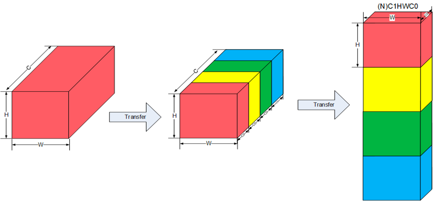
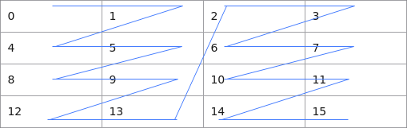
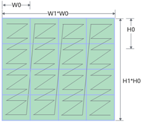
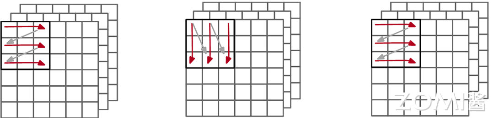
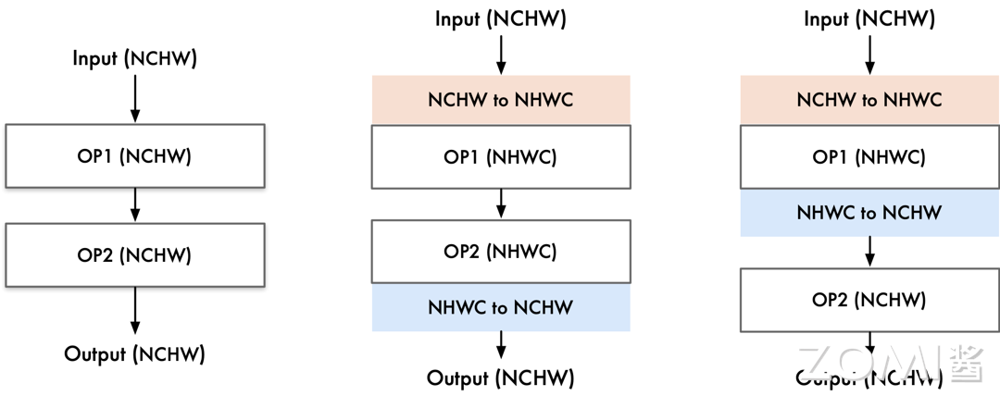

# 布局转换算法

接着上节中我们对卷积神经网络的特征图存储方式的讨论。"NHWC"的数据排布方式更适合多核 CPU 运算，"NCHW"的数据排布方式更适合GPU并行运算。那么接下来让我们了解一下在华为昇腾的NPU中，这种特征图的存储方式。

## 华为昇腾数据排布

我们在上半篇曾提到过，数据排布格式的转换主要是将内部数据布局转换为硬件设备友好的形式，实际在华为昇腾的AI处理器中，为了提高通用矩阵乘法运算和访存的效率，一般既不选择NHWC,也不选择NCHW来对多维数据进行存储。

这里我们将华为昇腾的数据排布作为一个案例，这种多维数据统一采用NC1HWC0的五维数据格式进行存储，具体的含义是将数据从C维度分割成C1份C0。

如下图中所示，下图中将N这个维度进行了省略，原先的红色长方体展现的是CHW三个维度，将它在C维度分割成C1个长方体，每个长方体的三个维度为C0HW，而后将这C1份长方体在内存中连续排列，此处的C1=C/C0，如果不能除尽则向上取整，对应着上半篇中的内存对齐，也就是通道现在变成了C0个，其中C0对于FP16类型为16，对于INT8类型则为32，这部分数据需要连续存储。



这样子的数据排布我们从硬件的角度来进行分析，华为的达芬奇架构在AI Core中特意优化了矩阵乘法单元，矩阵计算单元可以快速完成两个16✖16矩阵的相乘运算，等同于可以在极短时间内进行$16^3$=4096个乘加运算，并且可以实现FP16的运算精度，也就是说其可以针对16个FP16类型的数据进行快速的计算。这也就是我们对C0在FP16类型取16，INT8类型取32的部分原因。

下面我们来介绍一下如何转换出NC1HWC0数据格式：

将NHWC转换为NC1HWC0数据格式

具体操作：1.将NHWC数据在C维度进行分割，变成C1份NHWC0。

2.将C1份NHWC0在内存中连续排列，由此变成NC1HWC0。

pytorch中代码如下所示

```
1 
2  Tensor.reshape( [N, H, W, C1, C0]).transpose( [0, 3, 1, 2, 4] )
3
```

将NCHW转换为NC1HWC0数据格式

```
1 
2  Tensor.reshape( [N, C1, C0, H, W]).transpose( [0, 1, 3, 4, 2] )
3
```
## Fractal Z & NZ

ND格式 （N-Dimension），是深度学习网络中最常见且最基本的张量存储格式，代表N维度的张量数据。

为了在达芬奇架构中更高效的搬运和进行矩阵计算，引入一种特殊的数据分形格式，NZ格式。<br>如下图所示，我们以4*4的矩阵来进行举例，按照NZ格式数据在内存中的排布格式为[0，1，4，5，8，9，12，13，2，3，6，7，10，11，14，15]，按照ND格式数据在内存中的排布格式为[0， 1，2，3，4，5，6，7，8，9，10，11，12，13，14，15]。



如下图所示，NZ分形操作中，整个矩阵被分为（H1 * W1）个分形，分形之间按照列主序排布，即类比行主序的存储方式，列主序是先存储一列再存储相邻的下一列，这样整体存储形状形如N字形；每个分形内部有（H0 * W0）个元素，按照行主序排布，形状如Z字形。



下面我们详细地对NZ格式（也被称为NW1H1H0W0格式）具体在内存中存储的维度优先顺序进行展开。先对一个分形内部进行行主序存储，再在一个完整矩阵中以分形宽度为划分，进行列主序存储，再依次对相邻的下一个矩阵进行存储。即此方式先按W0方向存储，再按H0方向存储，接着按照H1方向存储，随后按照W1方向存储，最后按N方向存储，直到所有数据存储完成。

下面我们介绍一下如何将ND数据格式转换为NZ数据格式：

将ND转换为NZ数据格式

```
1  (..., N，H, W )->pad->(..., N, H1*H0, W1*W0)->reshape->(..., N, H1, H0, W1, W0)->transpose->(..., N, W1, H1, H0, W0)
```

其中pad为平铺操作，reshape将张量进行拆分，形状重塑，transpose为转置操作。

除了ND和NZ格式，还有其他数据格式，如下图所示，图中最左侧小z大Z，即为ND格式示意图，块内按照行排序，块间也按照行排序，常用于特征图的数据存储。图中中间部分为小n大Z，块内按照列排序，块间按照行排序，常用于权重的数据存储。图中右侧部分为小z大N，即为NZ格式示意图，块内按照行排序，块间按照列排序，常用于卷积结果的输出。



## AI编译器布局转换算法

了解了基础知识与部分硬件中应用后，我们来了解一下在AI编译器中如何对数据布局进行转换优化。

首先，我们转换数据布局的目的是将将内部数据布局转化为后端设备（硬件）友好的形式，我们需要做的是尝试找到在计算图中存储张量的最佳数据布局，然后将布局转换节点插入到图中。但其中有个需要十分注意的地方，布局转换也是需要很大的开销的，一旦涉及布局转换，就会有I/O操作，其产生的代价能否比的上数据格式转换后带来的性能优化也是需要我们重点考虑的部分。

具体地来说，比如NCHW格式操作在GPU上通常运行得更快，所以在GPU上转换为NCHW格式是较为有效的操作。<br>一些AI编译器依赖于特定于硬件的库来实现更高的性能，而这些库可能需要特定的布局，比如华为昇腾的AI编译器就依赖于CANN库，其中的特定布局我们在上文中已经提到。<br>同时也有许多设备需要配备异构计算单元，比如手机，其SOC中有丰富的IP，arm端侧的GPU还有ISP以及DPU等一系列不同计算单元。不同的单元可能需要不同的数据布局以更好地利用数据，这就需要AI编译器提供一种跨各种硬件执行布局转换的方法。

下面我们来看看数据转换具体是如何操作的。如下图所示，这两个都是数据转换的算子，数据转换我们在这里用CASTDATA算子来表示，左侧输入的数据格式为NHWC，输出的数据格式为NCHW，那么就需要一个数据转换算子节点来将数据格式由NHWC转换为NCHW，右侧则相反过来，此处不再赘述。


接下来，我们来看略复杂一些的数据转换。<br>如下图所示，首先像最左侧，此处我们两个算子使用的数据格式与输入输出时都相同，为NCHW，那么此时AI编译器中就不需要加入数据转换节点。<br>中间部分，输入的数据格式为NCHW，算子一需求的数据格式为NHWC，需要在两者之间插入一个CASTDATA NCHW TO NHWC算子进行数据转换，算子二格式也为NHWC，数据格式相同，不需要转换，输出的数据格式为NCHW，那么在算子二到输出间需要插入一个CASTDATA NHWC TO NCHW算子进行数据转换。<br>最右侧这张图中，输入的数据格式为NCHW，算子一需求的数据格式为NHWC，需要在两者之间插入一个CASTDATA NCHW TO NHWC算子进行数据转换，算子二格式为NCHW，需要在算子一到算子二之间插入一个CASTDATA NHWC TO NCHW算子进行数据转换。输出与算子二数据格式相同，不做额外处理。



接下来我们讲两个例子，首先我们来讲解一下训练场景下AI编译器的例子，例如1×1的卷积常常使用NHWC的数据格式，而如果到后面使用的是3×3的卷积常常使用NCHW的数据格式，AI编译器此时能够感知上下文，得到这些存储格式的信息，这时候AI编译器就会根据具体的数据格式插入需要的转换算子，并且整个过程不会改变原先原计算图的其他内容。

再假设此时我们使用的是三个连续的1×1的卷积算子，使用的都是NHWC的数据格式，算子之间的数据格式是一样的，那么此时AI编译器需要取消掉多余的转换算子。

接着我们来讲解一下推理场景下AI编译器与训练场景下有什么不同，其中较大的区别是与会有在权重数据进行布局的转换。假设训练时使用的是GPU对神经网络进行训练，但是推理的时候会在更多的场景下进行使用，比如手机上进行推理，手机上较多使用的是CPU，其进行推理时与在GPU上进行训练时的权重数据的布局可能会有所不同，那么此时就需要AI推理编译器插入一个权重布局的转换。

## 小结

本小节中我们主要介绍了

1.卷积神经网络的特征图在华为昇腾NPU中的存储的数据排布格式，为NC1HWC0的五维数据格式，是将数据从C维度分割成C1份C0，原因是能够更好地贴合华为的达芬奇架构中优化的矩阵乘法单元。
  
2.华为昇腾NPU中的张量存储的数据排布格式，有ND，NZ，以及小n大Z等等数据格式。

3.AI编译器中具体对数据布局进行转换优化的方式：插入CASTDATA算子进行数据转换，或者消除CASTDATA算子，亦或是推理场景下对权重布局的转换，都是为了计算图在对应硬件环境下能够完整执行。

## 本节视频

<html>
<iframe src="https://www.bilibili.com/video/BV1gd4y1Y7dc/?vd_source=2f45292201835520d512b8f7c607b1fd" width="100%" height="500" scrolling="no" border="0" frameborder="no" framespacing="0" allowfullscreen="true"> </iframe>
</html>
