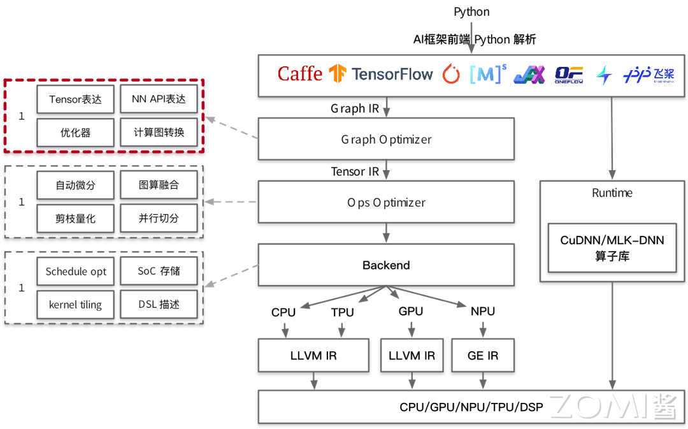
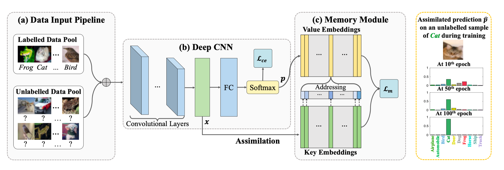
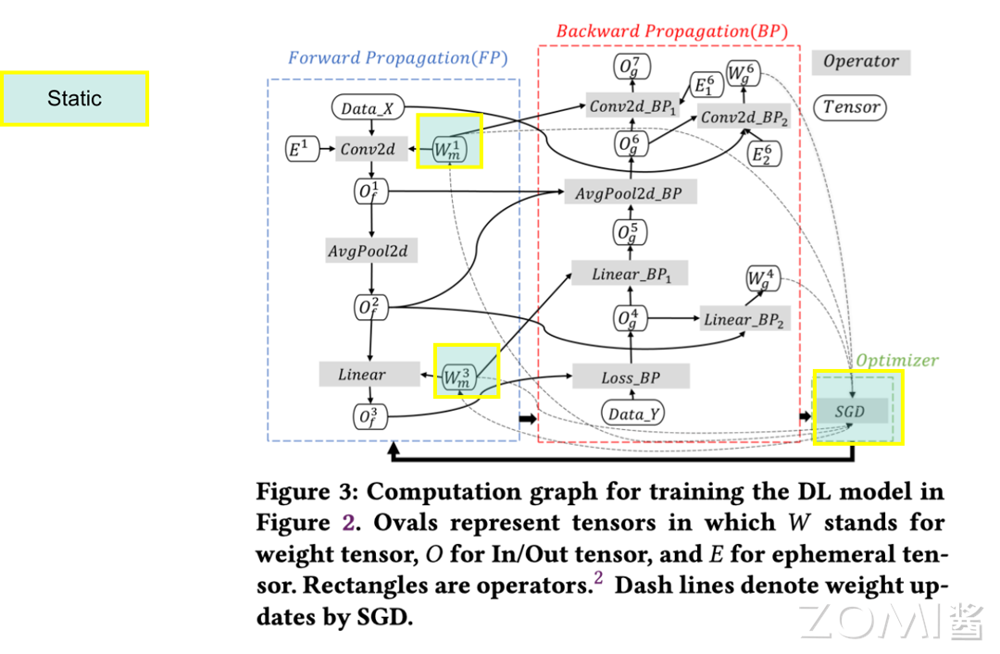
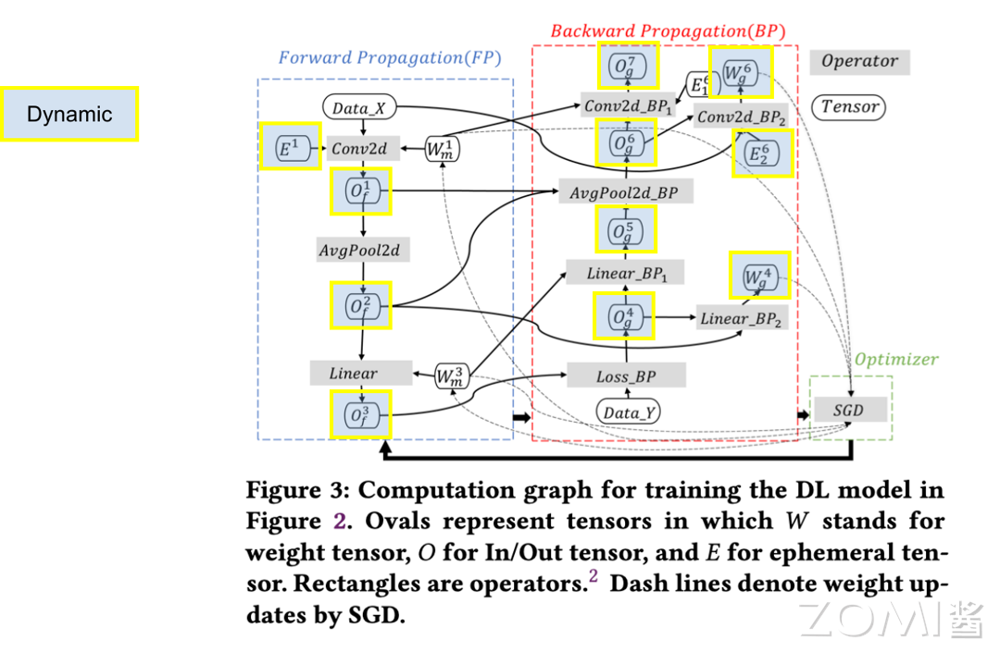
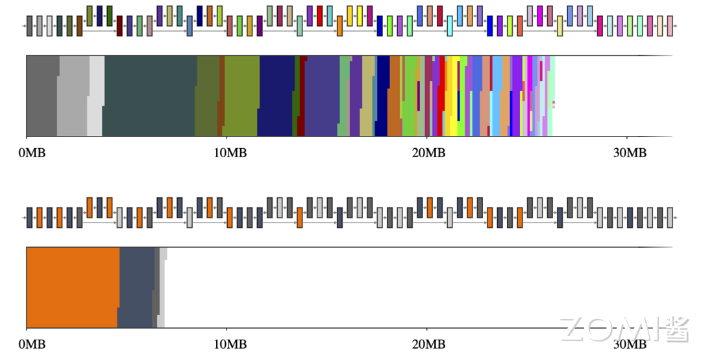
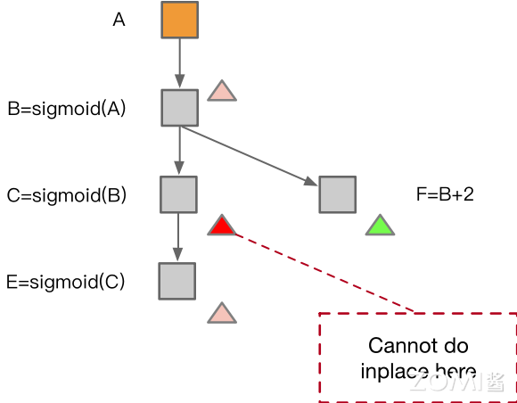
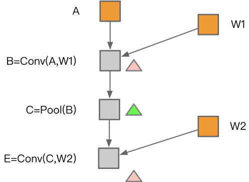
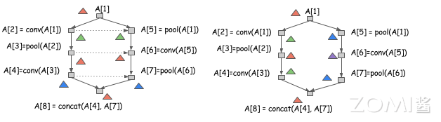

<!--Copyright © 适用于[License](https://github.com/chenzomi12/AISystem)版权许可-->

# 内存分配算法

本节将介绍 AI 编译器前端优化部分的内存分配相关内容。在 AI 编译器的前端优化中，内存分配是指基于计算图进行分析和内存的管理，而实际上内存分配的实际执行是在 AI 编译器的后端部分完成的。本节将包括三部分内容，分别介绍模型和硬件的内存演进，内存的划分与复用好处，节省内存的算法。

在下图所示的 AI 编译器技术栈示意图中，内存分配位于计算图优化部分。

## 模型/硬件内存演进

随着 AI 技术的迅速发展，神经网络模型在图像识别、自然语言处理等领域的应用日益广泛，模型的参数规模也逐渐增大，通常具有数百万甚至数十亿个参数，这使得神经网络模型在训练过程中需要消耗大量的 NPU 内存资源，以至于部分神经网络模型难以使用单张 NPU 进行训练而需要使用多张 NPU 共同完成训练任务。

例如，以 ImageNet 数据集为例，它是一个包含数百万张图片的数据集，常用于图像识别任务的训练和测试。在使用 ImageNet 数据集训练 Inception v4 模型时，如果将 BatchSize 设置为 32，则需要大约 40GB 的 GPU 内存空间，而使用 ImageNet 数据集训练 Wide ResNet-152 模型时，若 BatchSize 设置为 64，则训练过程中需要的内存空间高达 180GB，这充分展示了神经网络模型在训练过程中对 GPU 内存的高需求。

在过去多年间，NVIDIA 公司推出了若干具有代表性的 NVIDIA GPU 产品，其基本的硬件性能指标如下表所示：

||Tesla K80|Tesla P40|Tesla V100|Tesla T4/T4S|Tesla V100S|Tesla A100|
| :----: | :----: | :----: | :----: | :----: | :----: | :----: |
|CUDA 核心数量|2496|3840|5120|2560|5120|6912|14592|
|单精度浮点性能|8.7 TFLOPS|12 TFLOPS|14 TFLOPS|8.1 TFLOPS|16.35 TFLOPS|19.49 TFLOPS|
|INT8 性能|N/A|47 TOPS|N/A|130 TOPS|N/A|N/A|
|Tensor 性能|N/A|N/A|112 TFLOPS|N/A|130 TFLOPS|312 TFLOPS|
|内存容量|12 GB|24 GB|16 GB|16 GB|32 GB|80 GB|
|功耗|300 W|250 W|250 W|70 W|300 W|300 W|
|架构|Kepler|Pascal|Volta|Turing|Volta|Ampere|

由上表可以看出，随着 NVIDIA 公司的 GPU 产品的不断升级和更新，GPU 所具有的 CUDA 核心数量迅速增长，同时其单精度浮点数运算能力也得到了极大的提升，然而 GPU 的内存容量却增长相对较慢，与此同时神经网络模型对于 GPU 内存的需求逐渐增加，这种发展趋势在某种程度上导致了 GPU 的计算性能与内存容量之间的不匹配，GPU 内存资源的利用效率变得越来越重要。

回顾神经网络模型的训练流程，如下图所示。在图示的训练过程中，需要将训练数据加载到 GPU 内存中，同时也需要将正向传播和反向传播的神经网络计算图也加载到 GPU 内存中，这些数据将占用大量的 GPU 内存空间，在 GPU 内存增长相对较慢的硬件发展趋势下，对有限的 GPU 内存进行高效地使用具有重要的意义。而在 AI 编译器前端优化部分，此部分工作通常称为内存分配。

围绕模型/硬件的内存演进，本节最后提出 1 个基本的问题：

一般认为，估计神经网络模型的 NPU 内存占用情况有助于提高 NPU 利用率，为准确估计神经网络模型的 NPU 内存占用情况，构建一个 N 层的神经网络需要消耗多大的 NPU 内存空间，应该如何估算？

## 内存的划分

本节将介绍内存分配中内存划分的相关内容，内存分配主要包括两类情况————静态内存和动态内存。

### 静态内存

静态内存主要包含三部分内容。首先是模型的权重参数（Parameter），这些权重参数占用的 NPU 内存空间在训练过程中基本保持不变，它们在训练过程中会原地更新数值。

其次是值节点（Value Node），这部分内存用于存储模型中在整个训练过程中会持续被使用的那些不能被折叠的常量，从而作为静态内存的一部分并占用相应的 NPU 内存空间。

最后是输出（Output），模型的输出同样需要占用 NPU 内存的一部分空间。这三部分共同构成了神经网络模型在训练时所需的静态内存，它们对于维持模型的稳定运行至关重要。

============== 上面的理解不太准确，请参考这个系列视频的理解，output 肯定是不对的。值节点也不知道是什么，优化器参数和动量这个在哪里？https://www.bilibili.com/video/BV1fb421t7KN/?spm_id_from=333.337.search-card.all.click&vd_source=26de035c60e6c7f810371fdfd13d14b6

一般情况下，对于一些在整个计算图中都会使用的固定的算子，在模型初始化时将一次性申请完所需要的 NPU 内存空间，在实际训练和推理过程中不再需要频繁地进行 NPU 内存申请操作，从而提高系统的性能。下图展示了某一计算图所对应的具体的 NPU 内存占用情况，图中浅绿色部分所标注的为使用静态内存的部分。

### 动态内存

动态内存主要包含两部分内容。

第一部分是输出张量（Output Tensor），指的是神经网络中每一层算子的输出的 Tensor 张量所占用的 NPU 内存，这些输出张量在计算过程中存在许多可以复用的部分，从而提高了内存的利用效率。

第二部分是工作区张量（Workspace Tensor），部分算子需要额外的内存空间来存储中间结果或进行其他计算操作，以便完成所需的计算任务，这部分内存为网络中某些算子在计算过程中作为临时缓冲区动态使用。这两部分动态内存共同支持着神经网络在训练过程中的灵活性和高效性。

============== 上面的理解不太准确，请参考这个系列视频的理解 https://www.bilibili.com/video/BV1fb421t7KN/?spm_id_from=333.337.search-card.all.click&vd_source=26de035c60e6c7f810371fdfd13d14b6

一般情况下，对于临时的 NPU 内存需求，可以进行临时的申请和释放，以节省 NPU 内存的使用，提高模型的并发能力。此外，动态内存在神经网络中占据了大部分的 NPU 内存，例如在图中浅绿色部分所标注的为动态内存的部分，与上节中静态内存的部分相比，可见动态内存所消耗的 NPU 内存更多。

在上述内容中提到，神经网络中每一层的算子的输出 Tensor 张量所占用的 NPU 内存分配为动态内存，那么如何在每一个计算图的输出节点上分配内存？怎样才能正确地分配内存？

## 内存优化算法

### 内存优化效果示例

下图为 MobileNet v2 模型在内存优化前后的内存占用示意图，上半所示为 MobileNet v2 在未经内存优化的情况下 NPU 内存申请的空间的示意图，可以发现在模型中存在许多碎片化的内存占用情况，模型总体占用的内存较多，而下半所示为经过内存优化后的 MobileNet v2 内存占用示意图。

可见经过内存优化之后，MobileNet v2 模型整体的 NPU 内存消耗量明显减少，内存申请的碎片数量明显降低，有效的整合了不同算子的内存需求，因此内存优化具有重要的价值。那么应当如何进行内存优化呢？下文将介绍常见的节省内存的算法。

### 节省内存算法

常见的节省内存的算法分为四种类型，包括空间换内存、计算换内存、模型压缩、内存复用等。

以空间换内存的算法将 GPU 或 NPU 内存中的部分模块卸载到 CPU 内存中（CPU Offload），该类算法更多地常见于针对 MoE 的模型结构进行算法优化。

以计算换内存的算法将在部分场景下重新计算数据的效率比从存储空间中读取数据的效率高，那么可以选择不保存数据而在需要数据时进行重计算，例如使用梯度检查点（Gradient Checkpointing）技术。

模型压缩的算法在端侧推理场景下应用较多，包括但不限于量化训练 Quantification、模型剪枝、模型蒸馏等压缩算法。

本节将介绍的节省内存的算法的重点为内存复用，利用 AI 编译器对计算图中的数据流进行分析，以允许重用内存。

> AI 编译器的内存分配算法与传统编译器的寄存器分配非常相似，可以借鉴许多思想。

### 内存替代

在内存复用中存在若干常见操作，例如替换操作 Inplace Operation，即当一块内存不再被需要时，且下一个操作是 element-wise 时，可以在原地覆盖内存。

如下图中左图所示，在计算完成 B 算子之后，所分配的内存可以被算子 C 所复用，同理计算完成算子 C 之后，所分配的内存可以被算子 E 所复用。但是在右图中，因为在计算完成算子 B 之后算子 F 需要使用算子 B 的计算结果，因此算子 C 无法复用算子 B 所分配的内存。

### 内存共享

当两个数据所使用的内存大小相同、且有一个数据在参与计算后不再需要，那么后一个数据可以覆盖前一个数据，前一个数据所分配的内存无需重复申请和释放，只需要进行内存共享即可。

如下图所示，算子 B 的数据在算子 C 使用过之后不再需要，那么在算子 E 可以对算子 B 所使用的内存空间进行内存共享。

### 内存优化方法

从总体的角度看，上文中提到的两种内存优化方法 Inplace Operation 和 Memory Sharing，如果要较为复杂的模型，如下图中右侧图所示计算图，进行内存优化的操作复杂度较高，为此研究者提出了一些新的内存优化算法。

本节将针对下图所展示的计算图，对一种内存优化算法进行解读，其方法与传统编译器的内存优化方法具有一定的相似之处。在下图中，最左侧为计算图，中间的虚线为计算图中数据的流动，在初始化时 AI 编译器将感知每一个算子被使用的次数并标记。

在第一步时将对算子 B 分配一个 tag；在第二步为算子 C 分配新的 tag 时发现此时不能进行 Inplace 操作，因为算子 B 的生命周期仍存在；在第三步中计算算子 F 时，为其分配一个 tag，此时算子 F 已经计算完成，B 算子的生命周期结束，其分配的内存空间也释放到队列中；第四步中继续执行时，算子 C 已计算完成，其内存空间也将进入内存队列中，但是此时将执行算子 E，因此会将之前存放在队列中的红色的 tag 对应的内存分配给算子 E 来进行 Memory Sharing 同时修改对应 tag 的标记；第五步中可以复用算子 E 所占用的内存，进行 inplace 操作。

最终可以看到在上图左下角为最终内存分配的方案，需要注意的是此处为预执行的操作而非模型真实运行中进行的内存分配，不同的颜色代表不同的内存分配的空间。

### 并行分配

在上文中介绍的内存分配算法主要为串行逻辑的算法，本节将探索并行逻辑的内存分配算法。

如下图所示，左右分别为两种不同的内存分配方案，以串行方式运行从 A[1] 到 A[8]，那这两种分配方案是都有效的。然而左侧的分配方案引入更多的依赖，意味着不能以并行方式运行 A[2] 和 A[5] 的计算，而右边可以运行，因此右侧的分配方式更为高效。

## 小结与思考

- 内存分配的重要性：随着神经网络模型规模的增长，NPU 内存资源变得紧张，高效的内存分配对于提高 NPU 利用率至关重要。

- 内存的划分：内存分配包括静态内存和动态内存，静态内存包括模型参数、值节点和输出，而动态内存包括输出张量和工作区张量，它们支持模型训练的灵活性和高效性。

- 内存优化算法：包括空间换内存、计算换内存、模型压缩和内存复用等策略，以及具体的内存优化技术如Inplace Operation和Memory Sharing，旨在减少内存占用并提高计算效率。

## 本节视频

<html>
<iframe src="//player.bilibili.com/player.html?isOutside=true&aid=522954339&bvid=BV1nM411879s&cid=968362497&p=1" scrolling="no" border="0" frameborder="no" framespacing="0" allowfullscreen="true"></iframe>
</html>
