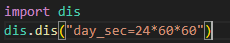
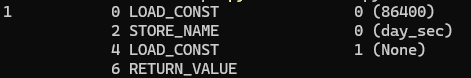
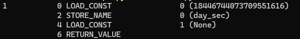
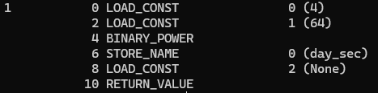

# 常量折叠原理

## 传统编译器的常量折叠

### 传统编译器的常量折叠概述

在编译期间，编译器会设法识别出常量表达式，对其进行求值，然后用求值的结果来替换表达式，从而使得运行时更精简。

day_ sec = 24×60×60 ,当编译器遇到这样的一个常量表达式时，表达式会被”抽象语法树(AST)”中的计算值所替换。因此上述表达式可以等效地被执行为 day_sec = 86400。

以python为例，在python中，使用反汇编模块 Disassembler 获取day_ sec = 24×60×60的CPython的字节码。

这表明CPython解释器在解析和构建抽象语法树期间，会将常量表达式24×60×60替换成其计算值86400，对于day_sec的赋值值需要Load_constant 86400即可。

当然不是所有的常量表达式都会被折叠。在python中，下面两种情况就不会进行常量折叠：

- 当常量表达式计算的结果溢出时，编译器不会进行常量折叠。比如2的64次幂会被折叠，而4的64次幂不会被折叠，如下图所示：

上面两图分别是2的64次幂和4的64次幂的CPython字节码，可以看出2的64次幂会被折叠成一个具体的数，而4的64次幂不会。

- 当进行字符串运算的时候，比如两个字符串相加，当且仅当字符串相加的结果小于等于4096个字节时，该常量表达式才会被折叠，否者不会进行折叠。

### 传统编译器的常量折叠实现细节

不同编译器的常量折叠的实现细节不尽相同，下面以python为例来描述传统编译器的常量折叠的一种实现。

在python中，CPython会调用astfold_expr来对表达式进行常量折叠。astfold_expr以递归的方式遍历AST，并尝试折叠所有的常量表达式。对于一个常量表达式，astfold_expr会先尝试折叠其子表达式，然后将此折叠操作代理给特定的折叠函数，比如fold_binop会折叠二值运算的常量表达式。在特定的折叠函数中，折叠函数会判断执行的运算的种类，然后调用基本运算操作，比如ADD运算，会调用PyNumber_Add。

通过这样一个过程，python会完成所有可折叠的常量表达式的折叠。

## AI编译器的常量折叠

### AI编译器的常量折叠概述

将计算图中可以预先确定输出值的节点替换成常量，并对计算图进行结构简化的操作，以下是AI 编译器常量折叠的几个类型：

- 类似与传统编译器中的常量折叠，当计算图中某个节点的数据输入节点均为常量的节点，则可以提前计算出该节点的值来完全替换该节点。以AddN为例，对于两个形状大小为(N,C,H,W)四维常量Tensor，Add结果是一定，可以将其合成一个常量放在编译器生成。这样就不需要给Add节点分配额外的存储资源，在计算图执行的过程中，也不需要反复计算add这个操作，可直接进行访问。
- shape类型的操作，比如Size、Shape等操作，这些操作都只与输入的形状有关，与输入的具体值无关，而相比于具体输入值来说，当输入的形状是一个已经确定的值时，就可以通过计算图推导出输入的形状，当数据输入都为常量就可以将其结果在编译的时候直接计算出来，用来代替原来的节点。

### AI编译器的常量折叠实现细节

不同的AI编译器对于常量折叠的细节不尽相同，这里以tensorflow为例，描述其常量折叠的实现细节方式。

在tensorflow中，首先需要维护4个变量，下面一一介绍：

constant_foldable_nodes: 用于存储计算图中所有可能可以进行常量折叠的节点。这个过程需要经过两次筛选，首先需要判断某个节点是否能够成为可能常量折叠的节点，下面是判断的依据：

- a类节点：节点是常量节点，在 TensorFlow 中，常量节点（Constant Node）是指在图中具有固定值的节点。常量节点的输出在图的执行过程中不会改变，其值在图构建阶段就被确定并保持不变。创建常量节点的方式有两种，第一种是使用tf.constant创建常量节点，第二种是使用tf.Variable()创建变量，但是需要将trainable设置为False，这样创建的变量才会被认定为常量节点。
- b类节点：节点是已知输入形状的shape操作节点，如Rank，Shape，ShapeN，Size。并且需要保证节点是可计算的，比如Size操作，如果计算出的结果溢出了则无法进行常量折叠。
- c类节点：除了上述两类必可以常量折叠的节点外，有一些节点是不能进行常量折叠的。比如源节点，输出节点，不可计算的shape操作节点等等，这些节点无法进行常量折叠，除了这些明确指定不能常量折叠的节点，其他的节点都是有可能进行常量折叠的。

对于a类和b类的节点类型会被直接认定为可常量折叠的节点，并直接插入到constant_foldable_nodes中。而对于c类节点，还需要判断其所有的非控制依赖入边都是常量节点才行。

constant_control_deps：这是一个unordered_map对象，用于维护常量节点所对应的控制依赖。对于某个可折叠常量节点A，tensorflow会遍历A的所有入边，对于控制边，tensorflow会将控制边的源节点插入到A所对应的值中。对于非控制边，tensorflow会将非控制边的源节点所对应的值全部插入到A所对应的值中。这里对于控制依赖的传递是有意义的，在后续的实现步骤中会描述原因。

shape_replacement_map：这是一个unordered_map对象，用于维护上述提到的b类节点，它的键是节点，而值是一个向量，存储该算子执行后的结果，比如对于Size操作，该向量的值就是输入所对应的大小。后续对于常量节点的处理，shape节点和其他的可常量折叠的节点处理不同，需要使用shape_replacement_map对Shape操作节点单独标记，便于后续操作中区分这两类节点。

tensors_to_fetch：这是一个map对象，用来维护真正会常量折叠节点。在后续描述会对该变量进行详细描述。

下面具体介绍tensorflow常量折叠流程：
首先第一步是找到所有的可常量折叠的节点。tensorflow采用反向深度优先搜索对计算图进行遍历，其具体的流程如下所示：

- 对于某一张计算图，tensorflow维护一个栈，首先将所有汇(sink)节点压入栈中。在 TensorFlow 中，"汇节点"（Sink Node）是指计算图中没有输出边的节点，也就是没有被其他节点所依赖的节点。汇节点是计算图的终点，表示计算的最终结果或输出。并且给每个入栈的节点维护两个状态visited 和 leave。Visited表示该节点是否已经被访问过了，当将节点弹出栈时会将该节点的visited设置为true。Leave表示该节点是否不会在入栈了，当一个节点弹出栈后，除非它是源节点，否则还是需要将其压入栈中，确保在对该点进行操作时，其依赖节点都已经处理完毕。当该节点再次入栈后，将leave设置为true，因为在下一次弹出该节点时，其所有的依赖节点都已经处理完毕了。

- 弹出栈顶元素，首先判断其leave属性，如果leave为true，则处理leave操作，leave操作是判断该节点是否是可常量折叠的节点，这个放到后续的部分进行讲解。如果leave为False，则判断该是否被访问过了，如果已经访问过则直接跳过后续操作，弹出下个节点。如果没访问，则将该节点的visited和leave设置为True，并将该节点重新压入栈中。

- 遍历上一步弹出栈的那个节点所有的入边，将所有visited为False的源节点排序后依次压入栈中，排序的规则是比较两个节点的名字。

在遍历的过程中需要对每个点进行判断，判断其是否是可常量折叠的节点，并填充需要维护的三个变量。这个过程就是反向深度优先搜索中的leave操作，具体的操作流程如下：

- 对于一个需要判断的节点，首选需要判断其是否是可能进行常量折叠的节点，判断规则就是上述提到的a，b，c三类，对于b类判断成功后，会对节点做相应的处理，比如Size操作就是计算出输入的具体大小，然后插入shape_replacement_map中。
- 接着需要判断是否所有的非控制依赖边所对应的源节点都是常量节点。这里的判断标准是在constant_control_deps 的键中能否找到该源节点，这是因为对于每个常量节点都需要维护其控制依赖，所以如果在constant_control_deps中没有找到，则其一定不是常量节点。
- 当确定节点是可常量折叠的节点后，需要维护其控制依赖。遍历该节点所有入边，如果入边的源节点不在constant_control_deps中，则该入边为控制边，这是因为如果不是控制边，那么一定能在constant_control_deps中，将该源节点插入以该节点为键的值中。如果入边的源节点在constant_control_deps 中，则将该源节点所对应的控制依赖全部插入以该节点为键的值中。
- 最后将可常量折叠的节点插入constant_foldable_nodes 中。

获取到所有的可常量折叠的节点后，在进行下一步折叠之前，需要先构建常量折叠图。这一步是有意义的，常量折叠的优化是针对常量节点和与其相关的其他节点之间的边关系。在常量图中，只含有可常量折叠的点，当常量折叠图构建好后，如果所有点的出边的目的节点都在常量图中，则说明进行常量折叠优化可能没有实际的优化效果。因为所有可常量节点的计算结果不会对原始图产生影响，折叠它的计算结果并不会改变原始图的计算结果。所以当构建好常量折叠图后，判断图中是否有真正需要常量折叠的点，如果没有则不需要进行常量折叠处理。如果有，由于常量图只包含常量节点，对于这些节点的计算将会更加快速。常量图的构建流程如下：

- 使用原图的op_registry()创建一张图，命名为常量折叠图，并且会维护一个node_map，用来表示原图中的节点到常量折叠图的节点的映射关系。
- 遍历constant_control_deps中的节点，如果该节点是shape类型的节点，因为已经在shape_replacement_map中记录了每个shape类型节点的输出结果，所以可以使用shape_replacement_map中保存的输出结果构建常量节点，并插入常量表中。对于非shape类型的节点，将该节点的副本插入到常量折叠表中，然后遍历该节点的数据入边，将所有数据入边的源节点和该节点在常量折叠图中连接起来，由于反向深度优先搜索的关系，该节点的所有父节点都已经处理过了，所以不会出现遗漏的情况。
- 完成遍历后，则常量折叠图也构建好了，并且node_map也构建好了。此时需要遍历node_map,对于原图中某个节点n，遍历其的所有出边，如果存在一条出边的目的节点不在node_map中，说明节点n是一个需要常量折叠的节点，将其插入到tensors_to_fetch中，tensors_to_fetch会保留节点n，以及其在常量折叠图的对应点 n_ 。

常量折叠图构建完成后，检查tensor_to_fetch是否为空，如果为空，说明没有需要常量折叠的节点。如果不为空，使用graph_runner处理常量折叠图，计算出tensor_to_fetch中对应节点的结果，将这些结果保存在outputs中。最后遍历outputs，为outputs中的每个结果构建常量节点，因为在tensor_to_fetch存储了该节点在原图中的节点，以及需要替换的边，所以构建好常量节点后，将该常量节点与原图中需要替换的边的目的节点相连，并删除原节点与该目的节点之间的边。最后需要重新构建依赖，由于constant_control_deps中保留了所有常量节点所对应的控制依赖节点，将被替换的点的常量依赖节点与新创建的常量节点相连即可。

上述就是tensorflow对于常量折叠的具体流程，为读者提供一种AI编译器实现常量折叠的实例。

## 常量折叠总结

无论是传统编译器还是AI编译都是希望通过常量折叠将将程序中的常量表达式计算为一个常量值，并将其替换为该常量值的结果，以此来减少程序的运行时间和资源消耗，提高代码的性能和效率。不过传统编译器通常处理较为简单的常量类型，如整数和浮点数，而AI编译器可能会处理各种类型的常量，例如张量、矩阵等，以适应神经网络的复杂计算。

## 本节视频

<html>
<iframe src="https:&as_wide=1&high_quality=1&danmaku=0&t=30&autoplay=0" width="100%" height="500" scrolling="no" border="0" frameborder="no" framespacing="0" allowfullscreen="true"> </iframe>
</html>
