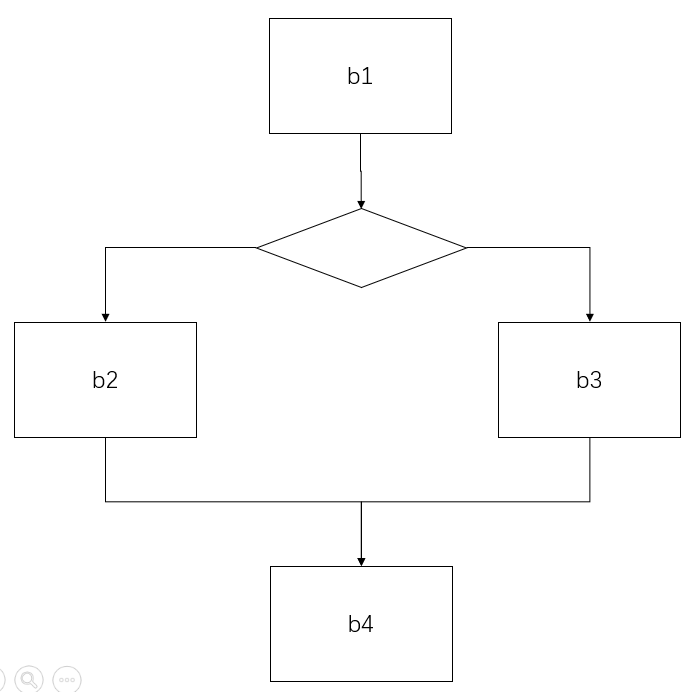
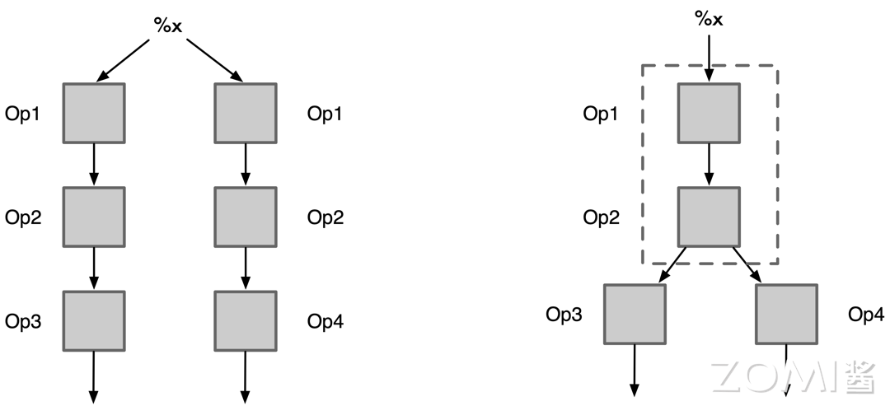

# 公共表达式消除

公共子表达式消除（Common Subexpression Elimination，CSE）也成为冗余表达式消除，是普遍应用于各种编译器的经典优化技术。旨在消除程序中重复计算的公共表达式，从而减少计算量和提高执行效率。下面分别介绍传统编译器和 AI 编译器中的公共子表达式消除

## 传统编译器的公共表达式消除

在程序中，有时会出现多个地方使用相同的表达式进行计算，并且这些表达式的计算结果相同。重复计算这些表达式，会增加不必要的计算开销。公共表达式消除的目标就是识别出这些重复的计算，并将其提取出来，只计算一次，然后将结果保存起来供后续使用。

以下是一个简单的公共子表达式：

```python
a = b * c + g
d = b * c + e
```

在计算 a 和 d 的时候都使用到了 b * c 这个表达式，并且在这个过程中，b 或 c 的值并没有发生改变，则可以将 b * c 这个表达式提取出来，能够将以上代码转化成以下代码:

```python
temp = b * c
a = temp + g 
d = temp + e
```

对于 b * c，程序只需要计算一次，并将结果保存在 temp 中，当计算 a 和 d 使用到时直接载入 temp 中保存的值即可，避免了 b * c 的重复计算，提高程序的执行效率。

在例子中，提取 b * c 作为公共子表达式的前提是 b * c 在计算 a 和 d 期间，b 或者 c 没有被重新赋值。

观察下面的这个例子：

```python
b = 2
c = 3
a = b * c + g
b = 3
d = b * c + e
```

在 a 计算完成后，程序对 b 进行重新赋值后才计算 d，此时计算 a 和 d 中的 b * c 这个表达式的计算结果不相同。编译器会认为 b * c 这个表达式在计算 a 和 d 中是两个不同的表达式，所以 b*c 不能作为公共子表达式被提取出去。

从上述例子可知，执行公共子表达式的优化需要满足一定的条件。对于一个表达式 s：x op y 和一个指令 d：a = x op y，指令 d 执行公共子表达式优化需要满足以下条件：

- 从程序开始到指令 d 的每条路径都经过同一个计算表达式 s 的指令 $d^{'}$。
- 经过计算表达式 s 的指令 $d^{'}$ 后，到达指令 d 的每条路径都没有对 x 或者 y 重新赋值。

对于表达式 s，编译器会计算其结果并保存，然后将所有使用表达式 s 且满足条件的指令中的表达式 s 的计算替换成计算结果，避免了表达式 s 的重复计算。

是否对一个表达式进行消除，除了满足以上条件，编译器还会进行计算的成本效益分析。如果重复计算该表达式的开销小于存储该表达式的计算结果，编译器会认为消除该表达式会产生负优化，则不会对该表达式进行消除。

编译器开发者将公共子表达式消除分成两类。如果这种优化仅限于程序的基本块内，便称为局部公共子表达式消除；如果这种优化范围涵盖了多个基本块，那就称为全局公共子表达式消除。

不同编译器在实现公共子表达式优化的细节上不尽相同，下面以 Golang 为例，介绍一种实现方式：

Golang 是对 SSA IR 进行公共子表达式优化的。在 SSA IR 中包含基本块(Block)和值(Value)。基本块（Basic Block）是一段连续的代码，其中没有分支或跳转语句。它是程序中的一个基本执行单元，顺序地执行其中的语句，不会中断或转移控制流程。而值的含义是在基本块中，不会出现分支或者跳转语句，而是连续的操作，而编译器会为这些操作生成赋值操作，赋值的结果就是值。

```Golang
b := 1
c := 2
d := 3
a := b + c - d
```

上面代码这个转化成 SSA IR 代码为：

```Golang
v1 = Const64 <int> [1]
v2 = Const64 <int> [2]
v3 = Const64 <int> [3]
v4 = Add64 <int> v1 v2
v5 = Sub64 <int> v4 v3
```

这里的 v_就是值，值包含了很多信息，比如操作类型，操作的数据类型，操作数等等。

1. 粗粒度划分等价集。遍历所有的 Block，将值存储在一个数组 a 中，然后根据诸如操作类型，操作的数据类型，操作数类型等粗粒度判断标准进行排序，对于粗粒度标准相同的值按照值的 ID（值的标号）进行排序。排序完成后对数组 a 进行切分，将粗粒度标准相同的值切分到同一个数组中，然后存入粗粒度划分等价集中。
2. 细粒度划分等价集。在进行后续处理之前，需要给粗粒度划分等价集中的每个集合中的值分配一个等价 ID。如果集合的个数大于 1，该集合为等价集，为该等价集里的每个值分配一个相同的正数等价 ID；如果个数等于 1，说明该集合为非等价集，为值分配一个负数等价 ID，其大小为该值的 ID。遍历粗粒度划分等价集中所有的等价集，按照细粒度标准进行划分。以 Add 为例：

    ```Golang
    v1 = Const64 <int> [1]
    v2 = Const64 <int> [2]
    v3 = Const64 <int> [3]
    v4 = Add64 <int> v1 v2
    v5 = Add64 <int> v2 v3
    v6 = Add64 <int> v2 v1
    ```

    在粗粒度等价集中存在一个等价集：

    ```Golang
    {v4, v5, v6}
    ```

    将该等价集按照细粒度标准排序，即按照操作数的等价 ID 排序,由于加法满足交换律，在进行排序前，还需要将两个操作数按照等价 ID 进行从小到大的排序。可得：

    ```Golang
    {v6, v4, v5}
    ```

    不难发现，v4 和 v5 的两个操作数是一模一样的，而又与 v6 不同，所以对该等价集进行切分，获得非等价集{v6}和等价集{v4，v5}。此时粗粒度等价集如下：

     ```Golang
    {{v4, v5}, {v1}, {v2}, {v3}, {v6}}
    ```

    划分完成后，对粗粒度等价集重新分配等价 ID，然后继续上面的步骤，直到前后两次粗粒度等价集没有发生变化，此时得到细粒度等价集。

3. 替换重复表达式。在细粒度等价集中的每一个等价集都可以看成是一组重复的表达式，但是这些表达式不能随意消除，需要判断 Value 所在的块是否支配需要替换的 Value 所在的块，如果支配则可以进行替换消除。
    
    
    如上图，b1 的支配者是{b1},b2 的支配者是{b1,b2}，b3 的支配者是{b1,b3}，b4 的支配者是{b1,b4}。
    为了降低算法的复杂度，首先需要将遍历细粒度划分等价集中的所有等价集按照支配性进行排序。然后遍历细粒度划分等价集中的某个等价集的值，如果满足支配，则将所有引用被支配的值替换成支配的值。而被支配的值的定义则不需要做任何调整，因为这部分会被后续的死代码消除优化给消除掉。

## AI 编译器的公共表达式消除

公共表达式是传统编译器常用的前端优化的一种，经过迁移也可以应用到深度学习编译器中。

AI 编译器中公共子表达式消除采取相同的思路，区别在于 AI 编译器中子表达式是基于计算图或图层 IR。通过在计算图中搜索相同结构的子图，简化计算图的结构，从而减少计算开销。



图中 Op3 和 Op4 都经过了相同的图结构{{Op1,Op2},{Op1->Op2}}, AI 编译器会将相同子图的所有不同输出都连接到同一个子图上，然后会在后续的死代码消除中删除其他相同的子图，从而达到简化计算图的目的。减少计算开销。

以 tensorflow 为例，给出 AI 编译器实现公共表达式消除的一种实现：

1. 获得逆后续节点集。tensorflow 使用反向深度优先搜索遍历计算图，获得逆后续节点集。这样处理的目的是为了确保在处理某个节点时，其所有的输入节点已经处理完毕。
2. 遍历逆后续节点集，由于公共子表达式优化只与操作节点有关，所以在遍历的时候忽略非操作节点。tensorflow 使用混合哈希的计算模式为每个操作节点计算其对应的哈希值。参与混合哈希计算的节点属性包括输出节点的个数，每个输出节点的类型，输入节点的信息等等。这样处理的目的是为了确保一个表达式对应一个 hash 值，达到检索公共表达式的目的。
3. 维护公共子表达式候选集，将节点和哈希值一一对应，当处理一个新的操作节点时，判断该节点的哈希值是否在公共子表达式候选集中，如果不存在，则将该操作节点及其哈希值添加到公共子表达式候选集中。如果存在，则用公共子表达式候选集中的节点连接到该操作节点的所有输出节点，但对于该操作节点并不会做任何处理，这会在后续的死代码删除中被删除掉。

## 本章小结

公共子表达式消除就是去掉程序中相同的结构，减少重复计算。传统编译器通过找到重复表达式，存储表达式的计算结果，并用该计算结果替换重复表达式的引用。AI 编译器通过找到相同的子图，将相同子图的所有输出都连接到同一个子图，从而达到公共子表达式消除的目的。

通过公共子表达式消除，可以减少重复计算和冗余代码，从而提高程序的性能。然而，需要注意的是，CSE 可能会增加代码的复杂性和内存消耗，因此在实际应用中需要权衡考虑。

## 本节视频

<html>
<iframe src="https:&as_wide=1&high_quality=1&danmaku=0&t=30&autoplay=0" width="100%" height="500" scrolling="no" border="0" frameborder="no" framespacing="0" allowfullscreen="true"> </iframe>
</html>
