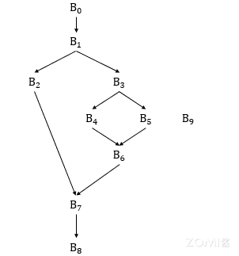
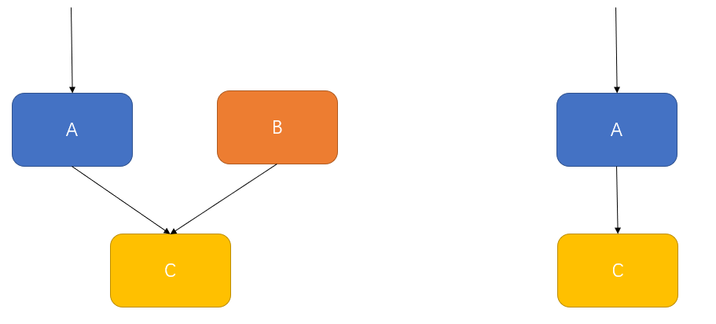
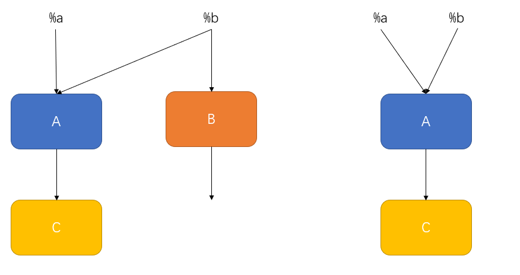

# 死代码消除

死代码消除（Dead Code Elimination）是一种编译器优化技术，旨在删除程序中不会被执行的代码，从而提高程序的执行效率和资源利用率。死代码是指在程序的当前执行路径下不会被访问或执行的代码片段。

## 传统编译器的死代码消除

死代码消除的目的是删除程序中无用和不可达操作对应的代码。在传统编译器中，死代码消除通常是通过分析控制流图(CFG)，从而找到并删除无用和不可达操作对应的代码。

### 不可达操作

不可达操作通常有两类：

第一种是不可达基本块中的操作。在控制流图中，对于某个基本块 $b_i$ ,如果从入口基本块 $b_0$ 存在一条路径能够到达 基本块 $b_i$ ,则 $b_i$ 是可达基本块，反之则为不可达基本块。当一个操作位于不可达基本块块中，根据不可达基本块的定义，该操作将不可能被执行到，所以该操作为不可达操作。

第二种是由条件分支优化导致的舍弃基本块中的操作。在控制流图中，当某个基本块 $b_i$ 进行条件转移时，如果其条件在编译阶段是可以直接被计算出来的话，那么编译器在编译阶段就可以很清楚条件转移将会前往那个分支。相比于执行的分支，另一个分支将不会被编译器所执行，这个分支所对应的所有操作都是不可达操作。



如上面的控制流图所示，其中 $b_9$ 是一个不可达的基本块，因为不存在一条路径从 $b_0$ 到达 $b_9$ ，所以 $b_9$ 中的所有操作都是不可达操作。对于基本块 $b_3$ 以及其两个条件转移目的基本块 $b_4$ 和 $b_5$，假设 $b_3$ 的条件转移条件始终为true 且 $b_4$ 为true所对应的条件转移目的基本块，在这种情况下，$b_5$ 将不会被执行到，$b_5$中所对应的操作为不可达操作。

以下是一个简单的不可达操作删除的例子：

```python
def test(flag):
    if(flag):
        print("Flag is True")
    else:
        print("Flag is False.")
    return
    print("This code is unreachable.")

test(False)
```

上面是用python实现的一段代码。在该程序中，test函数的输入始终为False，所以在test函数内部，`print("Flag is True")` 这条语句将永远不会被执行到，所以这条语句为不可达操作。编译会将上述代码优化为：

```python
def test(flag):
    print("Flag is False.")
    return
    print("This code is unreachable.")

test(False)
```

在test函数中，当test进行return后任有一个打印操作 `print("This code is unreachable.")` ,由于该操作位于return后，永远不会被执行到，编译器会将上述代码进一步优化成：

```python
def test(flag):
    print("Flag is False.")
    return

test(False)
```

在传统编译器中，第一种不可达操作的删除通常是通过深度优先搜索遍历基本块集合。从入口基本块 $b_0$ 开始，遍历基本块集合，找到所有的可达基本块并打上标记，之后再遍历一次基本块集合，找到所有的不可达基本块，然后删除不可达基本块到可达基本块的边。第二种不可达操作的删除，通常在编译阶段，对于已确定条件的条件转移，编译器会进行特殊标记，在死代码消除阶段，编译器根据标记删除掉不流动的那条边，这样该分支对应的基本块就从可达基本块变成不可达基本块，之后通过不可达基本块的删除即可。

### 无用操作

无用操作是指其结果没有外部可见效应，比如冗余的变量赋值操作，该变量在定义后没有在后续的操作中使用到，不会对后续操作产生任何影响，所以可以直接删除该变量赋值操作。在传统编译器中，编译器如何判断一个操作是否是无用操作呢？

在传统编译器中，有一些操作可以被认为是一定有用的，一些书中将这种操作称为关键操作。而参与关键操作计算的或者控制流程图流向关键操作所在基本块的条件转移或跳转操作也可以认为是有用的，编译器可以通过。

以下是一个简单的删除无用操作的例子：

```python
def test(a,b,c):
    x = a + b
    y = x + c
    return y

test(1,2,3)
```

上面是用python实现的一段代码。在test函数中，因为最后的结果需要返回变量y，此时变量 y 对于test函数来说是有用的，而y又需要通过x计算得到，所以变量x对于test函数来说也是有用的。简单修改一下代码：

```python
def test(a,b,c):
    x = a + b
    y = x + c
    return a+b+c

test(1,2,3)
```

上面是用python实现的一段代码。在test函数中，返回值从变量y变成了a+b+c，此时变量y和x并不会影响到test函数的功能，所以变量y和x都是无用的代码。

从上面可以看出，函数的return操作是关键操作中的一种。关键操作的特点是它们的执行结果或副作用会直接或间接地影响程序的状态、数据流或与外部环境的交互。下面给出几种的关键操作：

- 操作与过程的返回结果有关：这包括对引用调用参数进行修改、对全局变量进行赋值、通过具有歧义的指针进行赋值、作为返回值通过 return 语句返回等。这些操作的结果可能会影响到调用该过程的代码或其他代码对应的内存值。

- 输入输出语句：输入输出语句是指与程序的输入和输出相关的操作，例如读取用户输入、打印输出到控制台或文件等。这些操作可以影响程序的交互性和与外部环境的通信。

- 可以影响当前过程外可访问的内存值：这包括对共享内存区域进行读写、对全局变量进行修改等操作。这些操作可能会影响到其他代码对应的内存值，从而引起并发问题或数据不一致性。

在确定关键操作后，编译器就可以通过关键操作找到所有的有用操作，这里的有用操作分为两类：

- 第一类是关键操作操作数所对应的操作，这类操作的结果通常是参与了关键操作的计算，所以这类操作是有用的。

- 第二类是引导控制流流向关键操作所在基本块所对应的条件转移操作。

在了解传统编译器中通常是如何进行无用代码消除之前，首先需要了解后支配性和控制依赖性。

后支配性：在控制流图中，对于基本块 $b_i$ 和 $b_j$，如果所有非空路径从$b_i$到出口基本块都经过$b_j$，则称$b_j$后支配$b_i$。其计算公式为

$$
RDOM(n) = \{n\} \cup (\bigcap_{m\in{succ(n)}}RDOM(m))
$$

其中 RDOM(n) 表示 基本块 $b_n$ 所对应的后支配节点，succ(n)表示 基本块 $b_n$ 的所有后继节点。在此处并不考虑支配性的严格性，所以RDOM(n) 中包含自身。而对于后继节点的后支配节点，由后支配性的定义，需要所有路径同时经过的基本块，所以这里取所有后继节点的后支配节点的交集。


如上图，其中 $b_3$ 的后支配节点为 {$b_3$，$b_6$，$b_7$，$b_8$}，$b_4$ 的后支配节点为 {$b_4$，$b_6$，$b_7$，$b_8$}，其余节点的后支配节点读者可以自行探索。

控制依赖性：在控制流图中，对于基本块 $b_i$ 和 $b_j$，如果存在一条或多条非空路径从$b_i$ 到 出口基本块，且路径经过 $b_j$ 。同时也存在一条或多条非空路径从$b_i$ 到 出口基本块，且路径不经过$b_j$，直观上看，$b_j$ 能否执行取决于 $b_i$ 的条件转移，$b_j$ 在控制上依赖$b_i$，称 $b_i$ 是 $b_j$ 的控制依赖点。


如上图，$B_4$ 和 $B_5$ 的控制依赖点为 $B_3$ ，以$B_4$为例，从$B_3$到出口节点$B_8$，存在非空路径{$B_3$->$B_4$->$B_6$->$B_8$}经过$B_4$，又存在非空路径{$B_3$->$B_5$->$B_6$->$B_8$}不经过$B_4$，所以 $B_4$ 的控制依赖点为 $B_3$ ， $B_5$ 同理。

在传统编译器中，对于某个关键操作 i ，假设i：v <- x op y，如果操作 x 和 y的定义没有被标记上有用，则将其标记为有用操作。然后遍历关机操作d所在块的控制依赖块，将控制依赖块的条件转移操作标记为有用。在标记操作完成后，需要将无用的条件转移操作转化为跳转操作，跳转到该基本块的第一个含有用操作的后支配节点。因为当一个基本块的条件转移操作没有被标记为有用，那么从其后继结点一直到其直接的后向支配者结点，都不包含有用操作。如果其直接后继节点不包含有用的操作，也是同样。由于出口节点是一定含有有用操作，所以上述操作在向后查找的过程中，一定会停止。

## AI编译器中的死代码消除

AI编译器通常是通过分析计算图，找到无用的计算节点或不可达的计算节点，然后消除这些节点。

在计算图中，不可达节点是指从输入节点通过图中的有向边无法到达的节点。如下图，计算图中有A，B，C三个算子，假设三个算子都不是输入节点。不存在一条路径从输入节点到B节点，所以B节点是不可达节点，AI编译器会删除该节点，并删除其到可达节点的边，即边 B ->C。



在计算图中，无用节点是指某个计算节点的结果或副作用不会对输出节点产生影响。如下图，计算图中有A，B，C三个算子，B节点输出没有后继节点，不会对后续的计算图流程产生影响，所以B节点是无用节点，AI编译器会将该节点删除。



除此之外，训练的时候会产生大量的子图，而这些子图通常对于推理来说是无用的，所以在推理的时候可以删除这些无用的子图。

## 死代码消除案例

以Golang为例，简单了解一下传统编译器是死代码消除的一种实现。

1. 通过控制流分析，找到可达的基本块（ReachableBlocks 函数）。编译器通过深度优先搜索，从入口基本块开始遍历控制流图。将遍历到的所有基本块都标记为可达。
2. 从不可达的基本块中删除出边。遍历控制流图中的所有基本块，如果某个基本块 $b_n$ 未被标记为可达，则遍历 $b_n$ 的所有后继节点，如果后继节点是可达的，则删除 $b_n$ 到该节点的边。
3. 从可达的基本块中删除无效的出边。如果某个基本块 $b_n$ 的条件转移操作的条件已经确定，Golang在lower pass优化阶段会将此条件操作进行标记，并确定需要前往的后继节点，而其他后继节点将不会被执行到，所以需要删除 $b_n$ 到这些节点的边。
4. 找到有用操作，并删除无用操作。根据关键操作找到所有有用的操作，然后将无用的操作删除。在Golang中，每一步操作都会用一个Value对象来表示操作得到的结果。所以Value对象可以代表一个操作，将无用的操作所对应的Value对象值设置为空值，然后遍历所有基本块，将基本块中值为空的所有Value对象删除，从而达到删除无用操作的目的。
5. 删除不可达操作。不可达操作对应的基本块是第二步和第三步产生的，在经历过第四步之后，这些基本块一个Value对象都没有，即空块。编译器通过遍历所有的基本块，找到空块并删除，从而达到删除不可达操作的目的。

## 总结

在传统编译器和AI编译器中，死代码消除优化是一项常见的优化技术，用于删除程序中不会被执行的代码。无论是传统编译器还是AI编译器，死代码消除优化都具有类似的好处，包括提高执行效率、减小程序大小、简化代码维护和减少错误的可能性。在AI编译器中，死代码消除优化还可以带来模型推理效率的提升、模型尺寸的压缩、训练加速和能源消耗的降低。

## 本节视频

<html>
<iframe src="https:&as_wide=1&high_quality=1&danmaku=0&t=30&autoplay=0" width="100%" height="500" scrolling="no" border="0" frameborder="no" framespacing="0" allowfullscreen="true"> </iframe>
</html>
