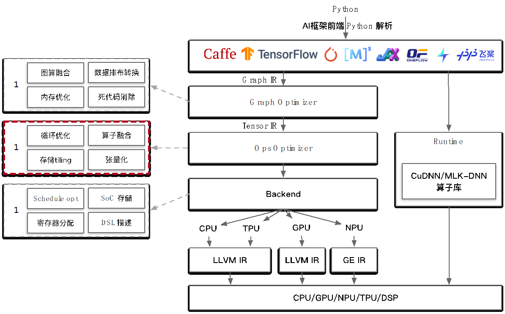
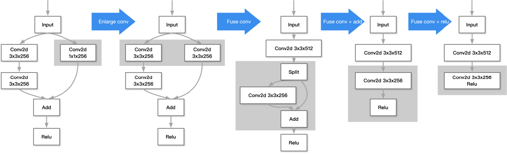

# AI 编译器后端优化

## AI 编译器架构

AI 编译器分为多层架构，最顶层由各种 AI 训练框架编写的神经网络模型架构，一般由 python 编写，常见的 AI 训练框架有 PyTorch、oneflow、TensorFlow、MindSpore 等。在导入 AI 编译器时需要用对应框架的`converter`转换为 AI 编译器统一的 Graph IR，并在计算图级别由`Graph Optimizer`进行计算图级优化，也叫前端优化。主要的计算图优化包括图算融合、数据排布转换、内存优化、死代码消除，这些优化是硬件无关的通用优化。在得到优化后的计算图后，将其转换为`TensorIR`，送入`OpsOptimizer`进行算子级优化，也叫后端优化，这类优化是硬件相关的，主要包括循环优化、算子融合、存储 tiling、张量化。在算子级优化结束后，即进入代码生成阶段。

## 后端优化概念

在 AI 编译器中存在两层中间表示，相应也存在两类优化，即前端优化和后端优化。

前端优化：针对计算图整体拓扑结构优化，不关心算子的具体实现。主要优化流程为对算子节点进行融合、消除、化简，使得计算图的计算和存储开销最小。

后端优化：针对单个算子的内部具体实现优化，使得算子的性能达到最优。主要优化流程为对算子节点的输入、输出、内存循环方式和计算逻辑进行编排与转换。

二者的区别在于关注点不同，前端优化具有局部或全局的视野，而后端优化只关注单个算子节点。

## 后端优化流程

后端优化的流程一般分为三步：

1）生成低级 IR：将高级或计算图级别 IR（Graph IR）转换为低级 IR（Tensor IR）。

不同 AI 编译器内部低级 IR 形式和定义不同，但是对于同一算子，算法的原理实质相同。对于每个具体的算子，需要用 AI 编译器底层的接口来定义算法，再由编译器来生成内部的低级 IR。

2）后端优化：进行后端优化，并将 IR 转换为更低级的 IR。

针对不同的硬件架构/微架构，不同的算法实现的方式有不同的性能，目的是找到算子的最优实现方式，达到最优性能。同一算子不同形态如 Conv1x1、 Conv3x3、 Conv7x7 都会有不同的循环优化方法。实现方式多种多样，可以人工凭借经验手写算子实现，也可以通过自动调优搜索一个高性能实现。传统编译器如 GCC、LLVM 也具有后端优化的部分，为什么不直接将 AI 编译器的后端优化委托给它们做？有两个关键原因：1）数据形式不同：深度学习中数据形式主要为张量（Tensor）。而传统编译器不擅长对张量计算优化，更擅长对标量进行计算。2）缺乏必要的支持：传统编译器主要针对通用编程语言，缺乏对领域特定语言 DSL 的支持，特别是对神经网络，以及相关的特殊优化。

3）代码生成：根据硬件进行代码生成。

对优化后的低级 IR 转化为机器指令执行，现阶段最广泛的做法为借助成熟的编译工具来实现，代码生成不是 AI 编译器的核心内容。如把低级 IR 转化成为 LLVM、NVCC 等编译工具的输入形式，然后调用其生成机器指令。

## 算子优化的挑战

算子根据其计算形式的特点可分为访存密集型与计算密集型。

访存密集（Memory-Bound Operation）型：指的是在执行过程中主要涉及大量内存读取和写入操作的计算任务。这类算子通常需要频繁地从内存中读取数据，执行一些简单的计算操作，然后将结果写回内存。访存密集型算子的性能受限于内存带宽和访问延迟，而不太受计算能力的限制。如 RNN 训练任务，其网络结构的计算密度很低，因此瓶颈转移到 host 端的 Op Launch 上，算子的计算 kernel 之间出现大量空白。

计算密集（Compute-Bound ）型：指的是在执行过程中主要涉及大量的计算操作，而对内存的访问相对较少的计算任务。这类算子主要依赖于 CPU 或 GPU 的计算能力，并且往往对内存带宽和访问延迟的需求不是特别高。一些数值计算密集型的算法，比如矩阵乘法、卷积运算、复杂的数学函数计算等，通常被认为是计算密集型的操作。

由于算子种类的多样性，并没有一个一网打尽的优化手段能解决所有算子的高性能执行方式。算子优化存在以下挑战：

优化手段多样：要在不同情况下权衡优化及其对应参数，例如针对不同种类算子、相同算子有不同的参数可采用不同优化，对于优化专家来说也是相当耗费精力。

通用性与移植性：不同类型的硬件架构差异，使得优化方法要考虑的因素也有很大。例如硬件可使用的指令集，硬件的内存带宽，算力以及存储层次的影响。

不同优化间相互影响：各种优化之间可能会相互制约，相互影响。这意味着找到最优的优化方法组合与序列就是一个困难的组合优化问题，甚至是 NP 问题。

## 算子优化的方法

算子的不同实现其性能差距千差万别，最好的与最差的相比甚至能达到上百倍的时间开销。为了实现高性能算子，业界有多种做法。

### 算子库

业界一个最为常见的方式是将预置的算子实现封装成**计算库**。算子库是指一组高度优化的计算核心函数，用于加速特定类型的计算任务，例如常见的矩阵乘法、卷积、循环神经网络等。这些算子库通常是由硬件厂商或第三方开发者编写的，旨在充分利用硬件平台的计算能力，并提供易于使用和高效的接口。

以 CuDNN 为例，它是一个由英伟达公司开发的深度学习加速库，专门针对各种常见的深度学习算法进行了高度优化，使其在英伟达 GPU 上运行时达到最佳性能。CuDNN 中的算子函数使用 CUDA 架构实现，并且在计算时利用了 GPU 硬件的并行性和向量化特性。此外，CuDNN 还通过使用半精度浮点数运算、算法重排等技术来进一步加速计算速度。

类似地，Eigen 是一个由 C++编写的线性代数库，用于实现各种矩阵操作，包括矩阵乘法、矩阵求解、特征值分解等。Eigen 中的算子函数使用 SIMD（单指令多数据）指令集实现，并且可以在不同的 CPU 架构上进行自动优化，以提供最佳性能。

这种方法存在三个问题：

1）如何应对 AI 领域算子迭代更新快：AI 领域的算法和模型经常迭代更新，导致算子库需要及时跟进以支持新的算法或模型结构。这可能需要算子库开发者不断更新和优化现有的算子实现，以适应新的需求。

2）如何解决同一算子在多平台移植后一致性问题： 算子库通常是为特定硬件平台（如 GPU、CPU）进行优化设计的。但是，在将算子库移植到不同的平台上时，可能会遇到一致性问题。不同平台上的硬件架构和指令集可能存在差异，可能需要进行特定的优化和调整，以确保在多平台上实现一致的计算结果。

3）如何面对算子组合爆炸问题？如参数多样，融合大算子等：在 AI 计算中，经常会遇到大量算子的组合，例如复杂的模型结构或多阶段数据处理流程。这可能导致算子的组合爆炸问题，其中算子之间的参数和组合方式变得多样化和复杂化。

### 自动生成

那么如何能解决这些问题？是否可以通过自动化生成高性能 kernel 生成的方式来减小算子开发的开销？

目前有两种主流的自动生成算法：

1. Auto Tuning： Auto Tuning 是一种通过自动搜索和优化参数组合来生成高效的 kernel 代码的方法。该方法通常基于启发式算法或机器学习技术，自动探索不同参数组合以找到最佳的性能配置。Auto Tuning 可以根据具体的硬件平台和任务特性，自动选择适当的优化策略，从而提高计算核心的性能和效率。

2. Polyhedral：Polyhedral 方法是一种基于数学多面体理论的编译优化方法，用于描述循环嵌套的迭代空间和数据依赖关系，并生成高效的循环 kernel 代码。通过对循环迭代空间进行变换和重组，Polyhedral 方法可以实现循环并行化、内存局部性优化等优化，从而提高计算核心的性能和效率。

## 本节视频

<iframe src="https://player.bilibili.com/player.html?bvid=BV17D4y177bP&as_wide=1&high_quality=1&danmaku=0&t=30&autoplay=0" width="100%" height="500" scrolling="no" border="0" frameborder="no" framespacing="0" allowfullscreen="true"> </iframe>

