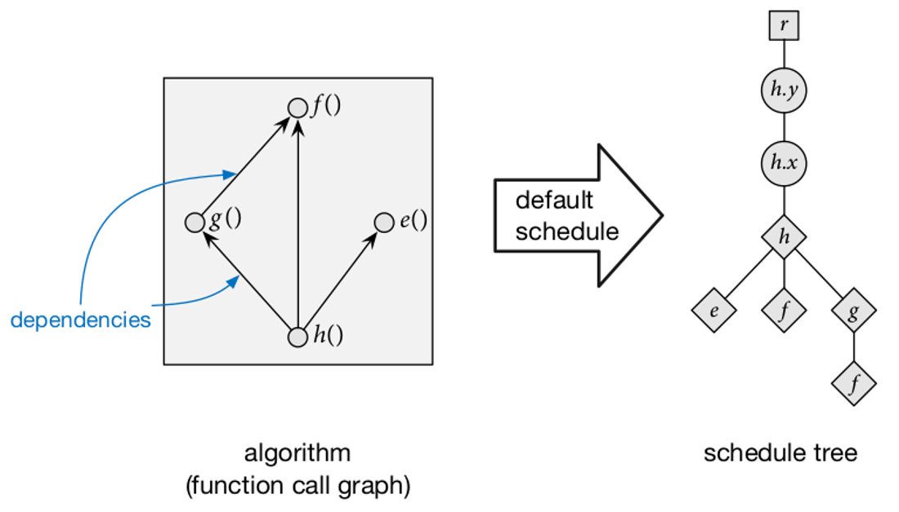
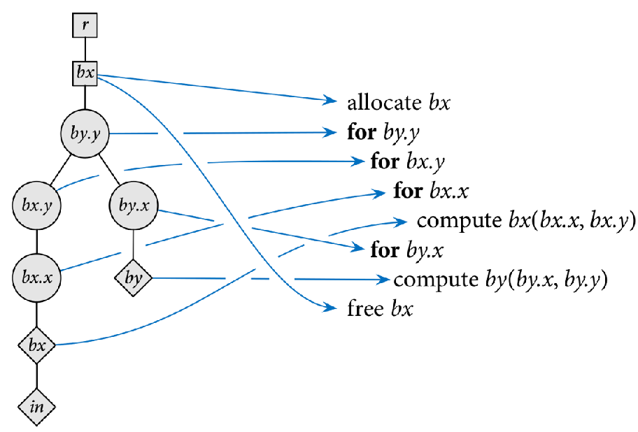
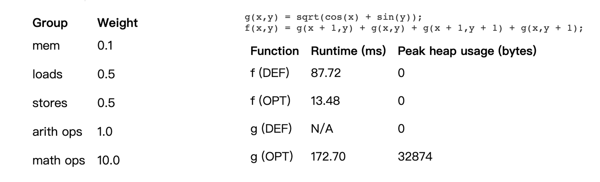
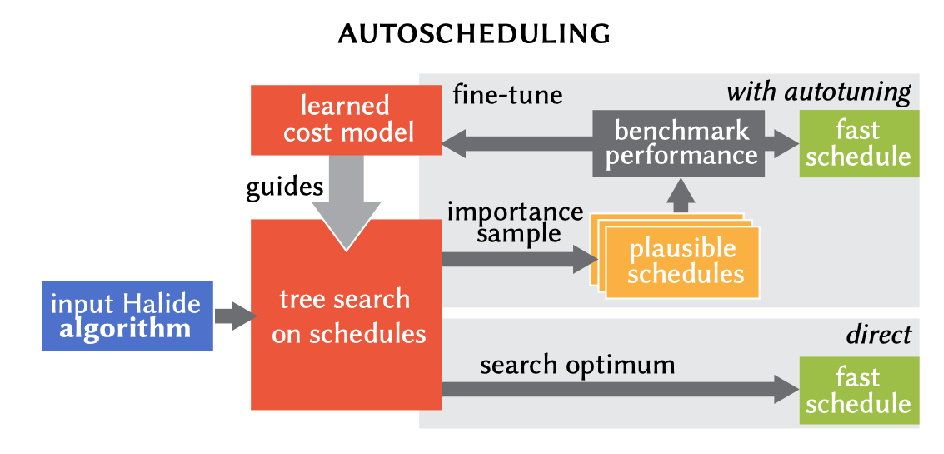

# 计算与调度

上一节我们了解了什么是算子，神经网络模型中由大量的算子来组成，但是算子之间是如何执行的？组成算子的算法逻辑跟具体的硬件指令代码之间的调度是如何配合？这些内容将会在本节进行深入介绍。

## 计算与调度

### 计算与调度的来源

图像处理在当今物理世界中是十分基础且开销巨大的计算应用。图像处理算法在实践中需要高效的实现，尤其是在功耗受限的移动设备上。随着算法和计算硬件的不断发展和改进，开发者越来越难以编写高效的图像处理代码。这不是使用 C 或 C++ 这类语言进行编程就能解决的问题，原生 C 和高度优化的 C 代码之间的性能差异通常能达到数量级级别。

此外，现代硬件上的高效实现需要计算和数据结构的复杂全局转换，这种优化通常以程序员的痛苦和代码复杂性为代价，因为必须重新组织计算才能有效地利用内存层次结构和并行执行硬件。

这一挑战的根源来自传统的编程语言将图像处理算法的定义及其计算和数据在底层机器上的组织方式混为一谈。这使得编写算法、将它们组合成更大的应用程序、组织它们以在给定机器上高效执行或重新组织它们以在不同架构上高效执行变得困难。

现在以 Halide 为例。Halide 的独特之处在于将算法定义和如何组织计算两个过程独立。其作为一种强大的编程工具，能让图像处理程序变得更简单，但性能却比之前的手动调优方法快很多倍。它的好处在于，无论是什么类型的处理器，都可以轻松地进行调优。而且，它还能让代码更易于组合和修改，这在传统的实现方法中是很难做到的。

Halide 是用 C++ 作为宿主语言的一个图像处理相关的 DSL（Domain Specified Language）语言。主要的作用为在软硬层面上（与算法本身的设计无关）实现对算法的底层加速。

在 Halide 中计算定义了如何生成输出图像像素的方式，可以包括简单的像素级操作、复杂的算法表达式以及各种变换和滤波操作。并且 Halide 提供了丰富的调度器来帮助用户优化他们的计算图，包括并行化、向量化、内存布局优化等技术，使得用户可以更灵活地控制计算的执行方式。Halide 将计算与其实现解耦合，可以更加高效的设计算法的具体执行过程，使得用户可以专注于底层加速。

### 计算与调度的含义

有一个耳熟能详的高斯得出求和公式的故事，当时，老师让学生计算 1 到 100 的和，本来需要逐个相加，但是高斯很快就找到了一个简便的方法。他观察到，如果将这些数字按照顺序两两配对，比如 1 和 100、2 和 99、3 和 98，以此类推，每对数字的和都是 101。而总共有 50 对这样的数字组合，所以他通过 50 乘以 101 来得到 1 到 100 的和，即 5050。

对于计算机运算来说，也存在这样的”捷径“。一个计算，可以简单的按照最原始的模式一个一个执行，也可以利用各种特殊硬件如专门的存储或者计算组件来加速这个过程。这是一个一对多的映射，这个计算本身可以有多种不同的实现方式，这些实现方式在不同场景、不同输入、不同机器、不同参数上各有千秋，没有一个最佳的覆盖所有面的实现。在这个背景下，分离出了计算和调度两个概念：

- 计算：描述实现算法的具体逻辑，而不关心具体的代码实现。

- 调度：对计算进行优化和控制的过程。通过调度，可以指定计算的执行顺序、内存布局、并行策略等以实现对计算性能的优化。

在神经网络中，深度学习算法由一个个计算单元组成，我们称这些计算单元为算子（Operator，简称 Op）。算子是一个函数空间到函数空间上的映射 $O：X→Y$；从广义上讲，对任何函数进行某一项操作都可以认为是一个算子。于 AI 框架而言，所开发的算子是网络模型中涉及到的计算函数。

在神经网络中矩阵乘法是最常见的算子，矩阵乘法的公式为：

$$C_{ij} = \sum_{k=1}^{n} A_{ik} \cdot B_{kj}$$

，其最朴实的实现如下代码：

```C++
void matrixMultiplication(int A[][128], int B[][128], int result[][128], int size) {
    for (int i = 0; i < size; ++i) {
        for (int j = 0; j < size; ++j) {
            result[i][j] = 0;
            for (int k = 0; k < size; ++k) {
                result[i][j] += A[i][k] * B[k][j];
            }
        }
    }
}
```

使用循环分块对其进行优化：

```c++
void matrixMultiplicationTiled(int A[][128], int B[][128], int result[][128], int size, int tileSize) {
    for (int i = 0; i < size; i += tileSize) {
        for (int j = 0; j < size; j += tileSize) {
            for (int k = 0; k < size; k += tileSize) {
                for (int ii = i; ii < i + tileSize; ++ii) {
                    for (int jj = j; jj < j + tileSize; ++jj) {
                        int sum = 0;
                        for (int kk = k; kk < k + tileSize; ++kk) {
                            sum += A[ii][kk] * B[kk][jj];
                        }
                        result[ii][jj] += sum;
                    }
                }
            }
        }
    }
}
```

抑或是使用向量化对其优化：

```C++
#include <immintrin.h>

void matrixMultiplicationVectorized(int A[][128], int B[][128], int result[][128], int size) {
    for (int i = 0; i < size; ++i) {
        for (int j = 0; j < size; j += 4) {
            __m128i row = _mm_set1_epi32(A[i][j]);
            for (int k = 0; k < size; ++k) {
                __m128i b = _mm_loadu_si128((__m128i*)&B[k][j]);
                __m128i product = _mm_mullo_epi32(row, b);
                __m128i currentResult = _mm_loadu_si128((__m128i*)&result[i][j]);
                __m128i updatedResult = _mm_add_epi32(currentResult, product);
                _mm_storeu_si128((__m128i*)&result[i][j], updatedResult);
            }
        }
    }
}
```

我们还可以使用更多的优化方式来实现矩阵乘法，或是将它们组合起来。上面三种操作的算法功能是一样的，但是速度是有差异的。这种差异是和硬件设计强相关的，计算机为加快运算做了许多特殊设计，如存储层次、向量加速器、多个核心等，当我们充分这些硬件特性，可以极大地提升程序执行的速度，优化后的运行效率是原始程序效率的几十倍甚至几百倍。

算子调度具体执行的所有可能的调度方式称为调度空间。AI 编译器优化的目的在于通过对算子进行最佳调度，使得算子在特定硬件上的运行时间达到最优水平。这种优化涉及到对算子调度空间的全面搜索和分析，以确定最适合当前硬件架构的最佳调度方案。这样的优化过程旨在最大程度地利用硬件资源，提高算子的执行效率，并最终实现整体计算任务的高性能执行。

## 调度树基本概念

在构建一个算子的调度空间时，首先要确定我们能使用哪些优化手段。同样以 Halide 为例，可以使用的优化有 Reorder(交换)、Split(拆分)、Fuse(融合)、Tile(平铺)、Vector(向量化)、展开(Unrolling)、并行(Parallelizing)等，以 Halide 思想为指导的 AI 编译器 TVM 继承了这些优化方式：

- **Reorder（交换）**：重新排列计算的顺序，可以改变计算的依赖关系，有助于提高缓存命中率，降低内存访问延迟，从而提高性能。

- **Split（拆分）**：将一个维度的计算拆分成多个较小的维度，可以帮助并行化和向量化，并优化内存访问模式。

- **Fuse（融合）**：合并多个计算，减少内存访问和数据传输的开销，提高计算的局部性，以及减少调度开销。

- **Tile（平铺）**：将计算划分成小的块，有利于并行化和向量化，并且可以提高缓存的命中率。

- **Vector（向量化）**：通过将多个数据元素打包成矢量操作，充分利用 SIMD 指令集，提高计算密集型任务的效率。

- **展开（Unrolling）**：循环展开，减少循环的开销，减少分支预测失败的可能性，提高指令级并行性。

- **并行（Parallelizing）**：将计算任务分解成多个并行执行的子任务，充分利用多核处理器或者并行处理单元，提高整体计算速度。

对于神经网络中的算子来说，其计算形式一般比较规则，是多层嵌套的循环，也很少有复杂的控制流，并且输入主要是多维张量。分析完计算的特点后，我们来分析下调度的要素。对于一个计算，其首先要进行存储的分配以容纳输入，之后在多层循环下进行计算，得出最终结果后再存储回结果位置。

```C++
// in 为输入原始图像 blury 为输出模糊后的图像
void box_filter_3x3(const Mat &in, Mat &blury)
{
    Mat blurx(in.size(), in.type());  // 存储

    for(int x = 1; x < in.cols-1; x ++)
        for(int y = 0 ; y < in.rows; y ++)   //循环
            blurx.at<uint8_t >(y, x) = static_cast<uint8_t>(
                    (in.at<uint8_t >(y, x-1) + in.at<uint8_t >(y, x) + in.at<uint8_t >(y, x+1)) / 3);  //计算

    for(int x = 0; x < in.cols; x ++)
        for(int y = 1 ; y < in.rows-1; y ++) //循环
            blury.at<uint8_t >(y, x) = static_cast<uint8_t>(
                    (blurx.at<uint8_t >(y-1, x) + blurx.at<uint8_t >(y, x) + blurx.at<uint8_t >(y+1, x)) / 3);  //计算
}
```

根据调度的要素，可以将其抽象为一个树结构，称为调度树：

- 循环节点：表示函数如何沿着给定维度进行遍历计算。循环节点与一个函数和一个变量（维度）相关联。循环节点还包含循环是按顺序运行、并行运行还是矢量化运行等信息。

- 存储节点：表示存储待使用的中间结果。

- 计算节点：调度树的叶子，表示正在执行的计算。计算节点可以有其他计算节点作为子节点，以表示内联函数而不是从中间存储加载。

调度树需要满足几个约束才能使调度合法：

- 函数必须在使用之前进行计算：在调度树的深度优先遍历中，函数的计算节点必须出现在其调用函数的计算节点之前。

- 存储必须已分配并在要使用的作用域内：函数的存储节点必须是其计算节点及其调用者的计算节点的祖先。

- 实际代码生成的限制使得某些模式非法。特别是，我们只允许最内层循环（不是任何其他循环节点的祖先的循环节点）的矢量化，并且只允许确定宽度循环的矢量化和展开。

对于任意的算子，可以定义其默认调度。其以行主序的形式遍历所有输出，并且内联所有函数调用，如下图所示：



我们将调度树与原有的程序进行对应：



在给定一个调度树后，可以通过深度优先搜索的方式进行遍历，然后转换成对应的程序代码：

- 如果它是一个循环节点，它将使用适当的属性（并行、矢量化、展开）开始相应的循环，按顺序递归访问每个子节点，并结束相应的循环。

- 如果是存储节点，则分配相应的存储，递归访问每个子节点，并释放存储。

- 如果它是计算节点，则它在其循环定义的域中的位置处计算相应函数的值，并将该值存储在其分配的存储中。

这里就体现计算与调度分离的好处，对于一个计算，可以有多个调度树生成不同性能的程序，只要调度树是合法的，就可以在结果正确的前提下提升程序的性能。

## 调度变换的方式

### Halide 调度变换

在调度中可以使用许多优化手段，这些方式可以通过变换调度树来体现。当然在代码中 Halide 提供了封装好的 api，原始代码：

```cpp
Var x("x"), y("y"); //定义两个变量
Func gradient("gradient");  //定义一个待执行的 function
gradient(x, y) = x + y;
// realize 即为实现这个操作 到了这一步才会对上述的操作进行编译并执行
Buffer<int> output = gradient.realize(4, 4);
```

这个代码转换为 C++ 就是：

```C++
for (int y = 0; y < 4; y++) {
    for (int x = 0; x < 4; x++) {
        printf("Evaluating at x = %d, y = %d: %d\n", x, y, x + y);
    }
}
```

接下来使用一些调度提供的变换来进行优化。例如对于 Fuse：

```cpp
Var fused;
gradient.fuse(x, y, fused);

//对应的 C++代码
for (int fused = 0; fused < 4*4; fused++) {
    int y = fused / 4;
    int x = fused % 4;
    printf("Evaluating at x = %d, y = %d: %d\n", x, y, x + y);
}
```

在调度树中，它就进行这样的变换：将树中同一函数的两个相邻循环节点合并为一个循环节点，新节点与原始外部循环节点保持在树中的相同位置，并且每个节点的子节点都连接起来，原始外部变量的子节点位于原始内部变量的子节点之前。


在这一步首先对 x 轴和 y 轴进行循环分块，分块因子为 4，然后将外侧的 y 和外侧的 x 轴循环进行融合(2+2=4)，再将这个融合后的操作进行并行操作。

```cpp
Var x_outer, y_outer, x_inner, y_inner, tile_index;
gradient.tile(x, y, x_outer, y_outer, x_inner, y_inner, 4, 4);
gradient.fuse(x_outer, y_outer, tile_index);
gradient.parallel(tile_index);

//对应的 C++代码
// This outermost loop should be a parallel for loop, but that's hard in C.
for (int tile_index = 0; tile_index < 4; tile_index++) {
    int y_outer = tile_index / 2;
    int x_outer = tile_index % 2;
    for (int y_inner = 0; y_inner < 4; y_inner++) {
        for (int x_inner = 0; x_inner < 4; x_inner++) {
            int y = y_outer * 4 + y_inner;
            int x = x_outer * 4 + x_inner;
            printf("Evaluating at x = %d, y = %d: %d\n", x, y, x + y);
        }
    }
}
```

在调度树中使用 Parallel：改变循环类型为并行化；类似还有顺序执行、向量化、循环展开，只需更改相应循环节点上的属性。


如果用 Halide 实现一个完整的算子，它就是这样的风格：

```C++
Func blur_3x3(Func input) {
  Func blur_x, blur_y;
  Var x, y, xi, yi;

  // The algorithm - no storage or order
  blur_x(x, y) = (input(x-1, y) + input(x, y) + input(x+1, y))/3;
  blur_y(x, y) = (blur_x(x, y-1) + blur_x(x, y) + blur_x(x, y+1))/3;

  // The schedule - defines order, locality; implies storage
  blur_y.tile(x, y, xi, yi, 256, 32)
        .vectorize(xi, 8).parallel(y);
  blur_x.compute_at(blur_y, x).vectorize(x, 8);

  return blur_y;
}
```

### 其他调度优化

除了这些，其他的优化类型也可以对调度树进行相应的变换。

有效的调度树定义了算法的可能调度空间，而变换是在该空间中的点之间映射的运算符。不同调度树对应了不同的程序实现，具有不同的性能，我们如何能获得一个最优的调度树呢？

最简单的方法就是通过静态分析来获得最优调度树。一旦循环大小确定，我们就有足够的信息来确定调度树的重要执行特征，例如它将分配多少内存和执行多少操作。计调度的成本就是这些数据点的加权总和。



然而这个方法过于简单和天真了，首先我们无法确定每个操作的成本，只可能有一个大概的预估。其次这些操作是相互影响的，并不独立，也就是成本是动态变化的。成本的总和也并不是简单的线性叠加。总之寻找一个最优调度树是非常复杂的过程，

目前主流的方法如 TVM 中采用的是自动调优法。即根据可利用的优化手段，将它们组合，生成一个十分庞大的调度空间，然后利用一些探索器如启发式算法或者机器学习算法，对这个调度空间进行遍历，去实际运行或者用模型预测其性能，根据实际性能反馈对调度空间的探索，最终在一定时间内选择一个相对最优的调度。



## 小结

- 计算：描述实现算法的具体逻辑，而不关心具体的代码实现。

- 调度：对计算进行优化和控制的过程。通过调度可以指定计算的执行顺序、内存布局、并行策略等对计算性能优化。

- Halide 和 TVM 都提供调度优化方式有 Reorder（交换）、Split（拆分）、Fuse（融合）、Tile（平铺）、向量化（Vector）、展开（Unrolling）、并行（Parallelizing）等。

## 本节视频

<html>
<iframe src="https://player.bilibili.com/player.html?bvid=BV1K84y1x7Be&as_wide=1&high_quality=1&danmaku=0&t=30&autoplay=0" width="100%" height="500" scrolling="no" border="0" frameborder="no" framespacing="0" allowfullscreen="true"> </iframe>
</html>
