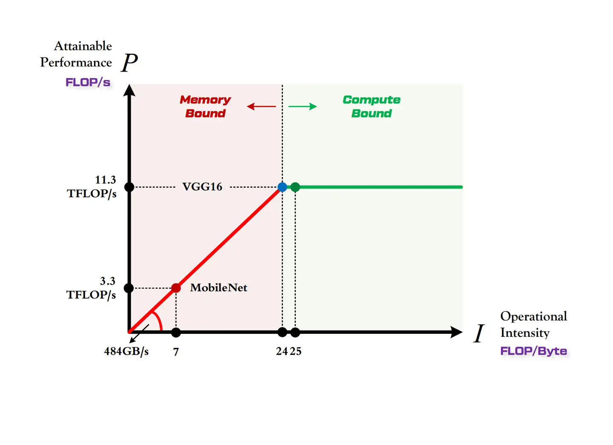
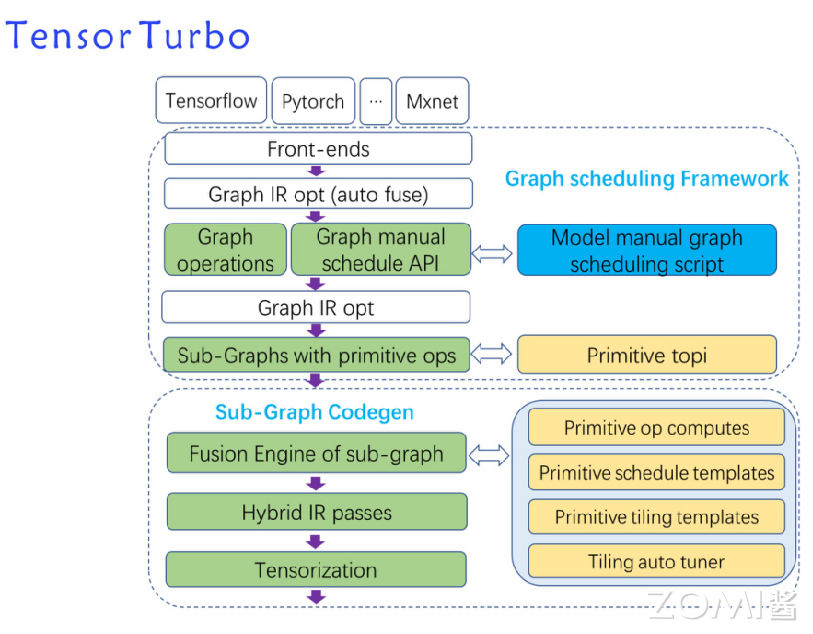
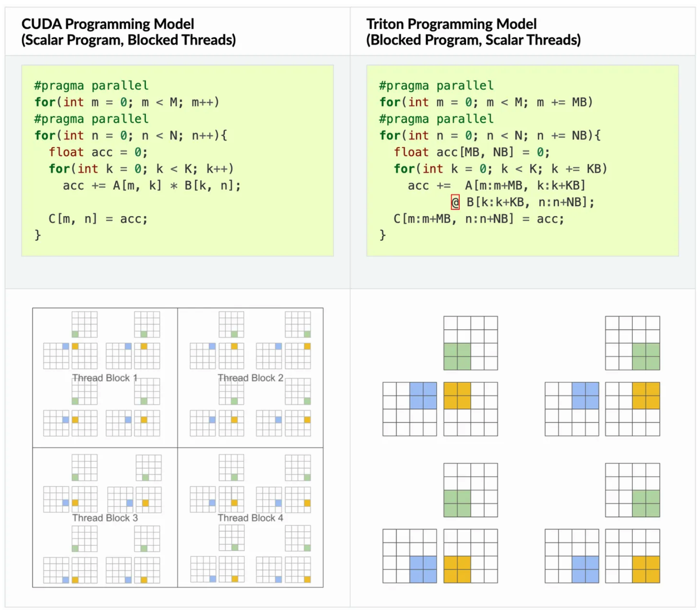
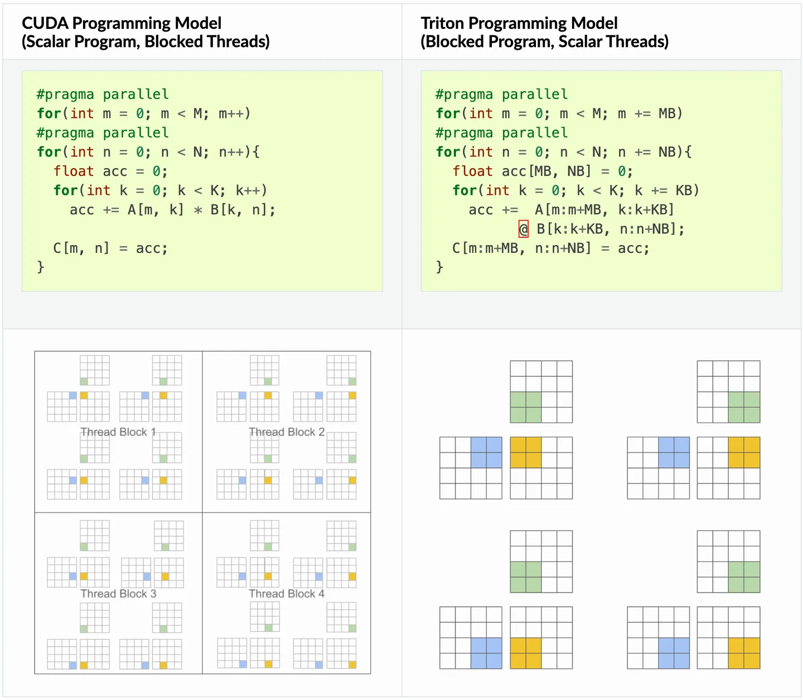

# 算子手工优化方式

在上一节中，探讨了算子计算和调度的概念，并强调了高效调度策略在释放硬件性能和降低延迟方面的重要性。本节，我们将深入讨论手写算子调度时需要考虑的关键因素，并介绍一些著名的高性能算子库。

## 计算分析

在优化算子前，首先需要知道当前程序的瓶颈在哪里，是计算瓶颈还是访存瓶颈。对于这两者，往往是通过RoofLine模型进行分析。首先定义几个关键指标：

+   计算量：指当前程序经过一次完整计算发生的浮点运算个数，即时间复杂度，单位为Flops。例如卷积层的计算量为$M^2*K^2*C_{in}*C_{out}$，其中M为输入特征图大小，K为卷积核大小，C为通道数。
+   访存量：指当前程序经过一次完整计算发生的内存交换总量，即空间复杂度。在理想的情况下，程序的访存量就是模型的参数和输出的特征图的内存占用总和（输入的内存占用算作上一个算子的输出占用上），单位为Byte，在float32类型下需要乘以4。对于卷积层，内存占用为$K^2*C_{in}*C_{out}+M^{2}*C_{out}$。

+   模型的计算强度：计算量除以访存量就是算子的计算强度，表示计算过程中，每字节内存交换用于进行多少次浮点计算。计算强度越大，其内存使用效率越高。

+   模型的理论性能：模型在计算平台上所能达到的每秒浮点运算次数的上限，Roofline模型给出的就是计算这个指标的方法。

Roofline模型是一种用于评估和分析高性能计算平台性能的有效工具。它通过分析计算量和访存量来确定在特定算力和带宽条件下，计算任务所能达到的理论性能上限。[^1]。Roofline模型的核心在于，它能够揭示硬件资源的限制，并帮助开发者和研究人员理解在现有计算平台的约束下，他们的应用程序能够实现的理论性能上限。

-   算力决定“屋顶”的高度（绿色线段）

-   带宽决定“房檐”的斜率（红色线段）

    

-   Compute-Bound:  当算子的计算强度大于计算平台的计算强度上限时，算子在当前计算平台上处于计算瓶颈。从充分利用计算平台算力的角度来看，此时算子已经利用了计算平台的全部算力。

-   Memory-Bound: 当算子的计算强度小于计算平台的强度上限时，算子的性能完全由计算平台的带宽上限以及模型自身的计算强度所决定，因此这时候就称模型处于Memory-Bound 状态。可见，在模型处于带宽瓶颈区间的前提下，计算平台的带宽越大（房檐越陡），或者模型的计算强度越大，模型的理论性能可呈线性增长。

在（3,224,224）的输入下，VGG16模型的前向传播计算量为15GFLOPs，访存量大约为600MB，则计算强度为25FLOPSs/Byte。MobileNet计算量为0.5GFLOPs，访存量为74MB，那么它的计算强度只有7FLOPs/Byte。在1080Ti GPU上，其算力为11.3TFLOP/s，带宽为484GB/s，因此该平台的最大计算强度约为24。



由上图可以看出，MobileNet处于Memory-Bound区域，在1080Ti上的理论性能只有3.3TFLOPs，VGG处于Compute-Bound区域，完全利用1080Ti的全部算力。通过Roofline模型，我们可以清晰地看到，当计算量和访存量增加时，性能提升会受到硬件算力和带宽的限制。这种分析对于优化计算密集型和内存带宽密集型应用至关重要，因为它可以帮助开发者识别性能瓶颈，并作出相应的优化策略。

此外，Roofline模型还可以用来指导硬件设计和软件算法的选择。例如，如果一个应用的性能受限于内存带宽，那么开发者可能会考虑使用更高效的数据结构或算法来减少内存访问。同样，硬件设计师也可以利用Roofline模型来评估不同硬件配置对特定应用性能的影响，从而做出更合理的设计决策。

要注意的是，Roofline模型是理论性能上界，在实际运行中，除了算力和带宽，还有其他许多因素会影响程序的执行，例如缓存大小与速度。

## 优化策略

在深入探讨具体的优化策略时，主要关注三大核心领域：循环优化、指令优化和存储优化。这些优化策略旨在针对算子的计算特性以及硬件资源的特点进行量身定制。本节内容将简要概述这些优化技术，而在后续章节中，将提供更为详尽的分析和讨论。

+   循环优化

由于AI算子普遍具有高度规则化的多层嵌套循环结构，这为优化提供了丰富的技术手段。以逐元素操作为例，如ReLU、加法（Add）和乘法（Mul）等，可以通过在所有循环轴上进行迭代来执行计算。即使是较为复杂的操作，比如卷积（Conv），也可以通过七层的嵌套循环来实现。然而，如果仅仅采用这些直观的原生计算方法，往往会导致效率低下。通过对算子的数据布局和内存访问特性进行深入分析，然后相应地调整循环结构，可以显著减少不必要的开销，更高效地利用硬件资源，从而降低延迟。常见的循环优化技术包括循环分块（Loop Blocking）、循环展开（Loop Unrolling）、循环重排（Loop Reordering）、循环融合（Loop Fusion）和循环拆分（Loop Splitting）等。这些优化技术通过精心设计的循环变换，不仅能够提升计算密度，还能改善数据的局部性，进而优化内存访问模式，最终实现性能的飞跃。

+   指令优化

现代处理器，如Intel的AVX-512或ARM的SVE，提供了强大的向量处理能力，允许单个指令同时操作多个数据点。通过这种方式，指令优化能够减少指令的数量和执行周期，进而降低延迟并提升性能。此外，针对特定硬件定制的指令集，如NVIDIA的Tensor Cores，可以进一步增强并行处理能力，为深度学习中的张量运算提供专门优化。在指令优化中，开发者需要深入理解目标硬件的架构特性，以及如何将这些特性映射到算法实现中。这可能涉及到对现有算法的重新设计，以确保它们能够充分利用硬件的并行处理单元。例如，通过将数据重新排列以适应SIMD（单指令多数据）架构，或者通过调整算法以利用特定的硬件加速器。除了硬件特性的利用，指令优化还涉及到编译器级别的优化，如自动向量化、指令调度和寄存器分配等。这些编译器技术能够自动识别并应用优化，进一步释放硬件的潜力。

+   存储优化

在存储优化方面，致力于通过精细调整数据访问模式和内存层次结构来提升系统的整体性能。内存延迟隐藏技术旨在最小化等待内存访问完成的时间。这通常通过预取（prefetching）数据到缓存、调整数据访问模式以提高缓存命中率，或者通过并行执行其他计算任务来实现。内存延迟隐藏的目的是让处理器在等待数据加载的同时，也能保持忙碌状态，从而提高资源利用率。双缓冲通过使用两个缓冲区来平滑数据流和隐藏延迟。当一个缓冲区的数据正在被处理时，另一个缓冲区可以被用来加载新的数据。这种方法特别适用于图形渲染和视频处理等领域，其中连续的数据流和时间敏感的操作需要无缝衔接。存储优化还包括合理分配内存资源、优化数据结构以减少内存占用、以及使用内存池来减少内存分配和释放的开销。这些策略共同作用，可以显著提高应用程序的内存访问效率，减少因内存瓶颈导致的性能损失

## 使用DSL开发算子

手写算子的开发往往要求开发者深入底层硬件的细节，这涉及到对数据布局、指令选择、索引计算等诸多方面的精细调整，从而显著提高了编写Kernel的难度。为了简化这一过程，已经发展出多种高级语言（DSL）来加速开发，其中TVM和Triton是该领域的杰出代表。这些DSL通过提供高级抽象，封装了多种常用的优化技术，并通过编译器的优化阶段自动识别并应用这些技术。开发者在使用这些DSL时，只需专注于高层次的计算逻辑，并利用DSL提供的API接口，即可实现高性能的算子。与传统的手写代码和极限优化相比，这种方法虽然可能无法达到极致的性能，但已经能够实现超过90%的性能水平，同时开发效率却能提升数十倍。这种权衡在许多情况下是合理的，因为它允许开发者以更高的效率开发出性能优异的应用程序。

### TVM

TVM是OctoML研发的可扩展、开放的端到端AI编译器，用于深度学习模型的优化和部署，目标是减少企业为特定硬件开发和深度学习软件部署所花费的成本和时间。

TVM极大的发扬了Halide的计算与调度思想，将可实现的优化都以调度API的方式呈现。相比Triton，TVM不局限于CUDA，支持了更多的后端，并且也易于扩展更多后端。TVM上一个典型的调度如下：

```python
def schedule_dense_packed(cfg, outs):
    """Packed dense schedule."""

    assert len(outs) == 1
    output = outs[0]
    const_ops = []
    ewise_inputs = []
    ewise_ops = []
    dense_res = []
    assert "int" in output.op.input_tensors[0].dtype

    def _traverse(op):
        if topi.tag.is_broadcast(op.tag):
            if not op.same_as(output.op):
                if not op.axis:
                    const_ops.append(op)
                else:
                    ewise_ops.append(op)
            for tensor in op.input_tensors:
                if isinstance(tensor.op, tvm.te.PlaceholderOp):
                    ewise_inputs.append((op, tensor))
                else:
                    _traverse(tensor.op)
        else:
            assert op.tag == "dense_pack"
            dense_res.append(op)

    _traverse(output.op)
    assert len(dense_res) == 1
    dense_stage = dense_res[0].output(0)
    s = te.create_schedule(output.op)

    ##### space definition begin #####
    b, c_o, _, _ = s[dense_stage].op.axis
    c_i, _ = s[dense_stage].op.reduce_axis
    cfg.define_split("tile_b", b, num_outputs=2)
    cfg.define_split("tile_ci", c_i, num_outputs=2)
    cfg.define_split("tile_co", c_o, num_outputs=2)
    cfg.define_knob("oc_nthread", [1, 2])
    ###### space definition end ######

    data, weight = dense_stage.op.input_tensors

    env = get_env()

    cdata = s.cache_read(data, env.inp_scope, [dense_stage])
    cweight = s.cache_read(weight, env.wgt_scope, [dense_stage])
    s[dense_stage].set_scope(env.acc_scope)

    # cache read input
    cache_read_ewise = []
    for consumer, tensor in ewise_inputs:
        cache_read_ewise.append(s.cache_read(tensor, env.acc_scope, [consumer]))

    # set ewise scope
    for op in ewise_ops:
        s[op].set_scope(env.acc_scope)
        s[op].pragma(s[op].op.axis[0], env.alu)

    for op in const_ops:
        s[op].compute_inline()

    # apply tiling for SRAM reuse
    x_b, x_c, _, _ = s[output].op.axis
    x_bo, x_bi = cfg["tile_b"].apply(s, output, x_b)
    x_co, x_ci = cfg["tile_co"].apply(s, output, x_c)
    s[output].reorder(x_bo, x_co, x_bi, x_ci)
    store_pt = x_co

    # set all compute scopes
    s[dense_stage].compute_at(s[output], store_pt)
    for op in ewise_ops:
        s[op].compute_at(s[output], store_pt)

    for tensor in cache_read_ewise:
        s[tensor].compute_at(s[output], store_pt)
        s[tensor].pragma(s[tensor].op.axis[0], env.dma_copy)

    # virtual threading along output channel axes
    if cfg["oc_nthread"].val > 1:
        _, v_t = s[output].split(x_co, factor=cfg["oc_nthread"].val)
        s[output].reorder(v_t, x_bo)
        s[output].bind(v_t, te.thread_axis("cthread"))

    x_bo, x_co, x_bi, _ = s[dense_stage].op.axis
    k_o, _ = s[dense_stage].op.reduce_axis
    s[dense_stage].reorder(x_bo, k_o, x_co)

    k_o, _ = cfg["tile_ci"].apply(s, dense_stage, k_o)
    s[cdata].compute_at(s[dense_stage], k_o)
    s[cweight].compute_at(s[dense_stage], k_o)

    # Use VTA instructions
    s[cdata].pragma(s[cdata].op.axis[0], env.dma_copy)
    s[cweight].pragma(s[cweight].op.axis[0], env.dma_copy)
    s[dense_stage].tensorize(x_bi, env.gemm)
    s[output].pragma(x_ci, env.dma_copy)

    return s
```

使用TVM提供的调度API，可以轻松实现循环、指令、存储等级别的优化，还可以这些优化参数化，利用自动调优器来搜索一个更高效的实现，

TVM当前被多个加速器厂商采用，进行了适应自家硬件的定制开发：

+   希姆计算

    希姆计算基于TVM的AI编译器端到端支持希姆一代二代芯片，实现了自定义算子方案，其模型性能接近手写极致。



+   华为TBE张量加速引擎

    TBE（Tensor Boost Engine）负责执行昇腾AI处理器中运行在AI Core上的算子，TBE提供了基于TVM框架的自定义算子开发能力，通过TBE提供的API可以完成相应神经网络算子的开发。

    

### Triton

Triton是OpenAI研发的专为深度学习和高性能计算任务设计的编程语言和编译器，它旨在简化并优化在GPU上执行的复杂操作的开发。Triton 的目标是提供一个开源环境，以比 CUDA 更高的生产力编写快速代码。

Triton的核心理念是基于分块的编程范式可以有效促进神经网络的高性能计算核心的构建。CUDA的编程模型是传统的SIMT（Single Instruction Multi Thread）GPU执行模型，在线程的细粒度上进行编程，Triton 是在分块的细粒度上进行编程。例如，在矩阵乘法的情况下，CUDA和Triton有以下不同。



可以看出 triton 在循环中是逐块进行计算的。这种方法的一个关键优势是，它导致了块结构的迭代空间，相较于现有的DSL，为程序员在实现稀疏操作时提供了更多的灵活性，同时允许编译器为数据局部性和并行性进行积极的优化。下面是一个使用Triton实现矩阵乘法的例子：

```python
@triton.jit
def matmul_kernel(
    a_ptr, b_ptr, c_ptr,
    stride_am, stride_ak,
    stride_bk, stride_bn,
    stride_cm, stride_cn,
    M: tl.constexpr, N: tl.constexpr, K: tl.constexpr, # M=N=K=1024
    BLOCK_M: tl.constexpr, BLOCK_N: tl.constexpr, BLOCK_K: tl.constexpr, #BLOCK_M=BLOCK_N=BLOCK_K=32
):
    offs_m = tl.arange(0, BLOCK_M)
    offs_n = tl.arange(0, BLOCK_N)
    offs_k = tl.arange(0, BLOCK_K)
    a_ptrs = a_ptr + offs_m[:, None] * stride_am + offs_k[None, :] * stride_ak
    b_ptrs = b_ptr + offs_k[:, None] * stride_bk + offs_n[None, :] * stride_bn
    accumulator = tl.zeros((BLOCK_M, BLOCK_N), dtype=tl.float32)
    for k in range(0, K, BLOCK_K):
        a = tl.load(a_ptrs)
        b = tl.load(b_ptrs)
        accumulator += tl.dot(a, b)
        a_ptrs += BLOCK_K * stride_ak
        b_ptrs += BLOCK_K * stride_bk
     c_ptrs = c_ptr + offs_m[:, None] * stride_cm + offs_n[None, :] * stride_cn
    tl.store(c_ptrs, accumulator)
```

Triton的前端是基于Python实现的，这使得用户的学习成本大大降低，而其后端是基于MLIR构建的。Triton的优化思想包括两部分：

+   Layout抽象：Layout抽象描述的是计算资源和输入、输出元素的坐标映射关系，主要包括块编码、共享内存编码、切片编码等几类定义，这些编码信息会作为attribute附着在一个一个的Tensor对象上，来描述这个Tensor作为输入或输出时所需满足的映射关系。如果出现一个Tensor作为输入和输出时的映射关系不兼容的情况，会再通过插入一些中转layout来完成兼容性的适配，代价是可能引入额外的转换开销。
+   优化Pass：主要包括了NVIDIA GPU计算kernel优化的一些常见技巧，包括用于辅助向量化访存的[coalescing](https://link.zhihu.com/?target=https%3A//github.com/openai/triton/blob/main/lib/Dialect/TritonGPU/Transforms/Coalesce.cpp)、用于缓解计算访存差异的[pipeline](https://link.zhihu.com/?target=https%3A//github.com/openai/triton/blob/main/lib/Dialect/TritonGPU/Transforms/Pipeline.cpp)/[prefetch](https://link.zhihu.com/?target=https%3A//github.com/openai/triton/blob/main/lib/Dialect/TritonGPU/Transforms/Prefetch.cpp)，用于避免shared memory访问bank-conflict的[swizzling](https://link.zhihu.com/?target=https%3A//github.com/openai/triton/blob/main/include/triton/Dialect/TritonGPU/IR/TritonGPUAttrDefs.td%23L47)。用户在开发Kernel时，主要关注其业务逻辑，而底层硬件优化的细节由Trition编译器实现。对于一些十分精细的优化，使用Triton可能就无法实现。

在应用场景上，Triton已经被集成进了多个著名的项目中[^2]：

+   [jax-ml/jax-triton](https://github.com/jax-ml/jax-triton)：JAX 是一个用于加速数值计算的 Python 库，使用 Triton 编写可以嵌入到 JAX 程序中的自定义 GPU 内核。在JAX中可以使用triton_call方便的调用Triton kernel。
+   [pytorch/inductor](https://github.com/pytorch/pytorch/tree/ab148da66cb9433effac90c7bd4930a961481d19/torch/_inductor/triton_ops)：Inductor在Triton的集成方面做得更加全面且务实。Inductor一共包含三种使用Triton的方式， 针对非计算密集算子，基于Inductor IR，实现了相对通用的[Codegen](https://link.zhihu.com/?target=https%3A//github.com/pytorch/pytorch/blob/ab148da66cb9433effac90c7bd4930a961481d19/torch/_inductor/codegen/triton.py%23L997)的支持。针对GEMM，基于Jinja2，通过模式匹配的方式实现了[半定制的codegen](https://link.zhihu.com/?target=https%3A//github.com/pytorch/pytorch/blob/ab148da66cb9433effac90c7bd4930a961481d19/torch/_inductor/kernel/mm.py%23L27)。针对Conv，调用[pre-baked Triton kernel](https://link.zhihu.com/?target=https%3A//github.com/pytorch/pytorch/blob/ab148da66cb9433effac90c7bd4930a961481d19/torch/_inductor/triton_ops/conv.py%23L14)，没有提供定制能力。

## 参考文献

[^1]: [Roofline Model与深度学习模型的性能分析 - 知乎 (zhihu.com)](https://zhuanlan.zhihu.com/p/34204282)
[^2]: [谈谈对OpenAI Triton的一些理解 - 知乎 (zhihu.com)](https://zhuanlan.zhihu.com/p/613244988)

## 本节视频

<html>
<iframe src="https://player.bilibili.com/player.html?bvid=BV1ZA411X7WZ&as_wide=1&high_quality=1&danmaku=0&t=30&autoplay=0" width="100%" height="500" scrolling="no" border="0" frameborder="no" framespacing="0" allowfullscreen="true"> </iframe>
</html>

