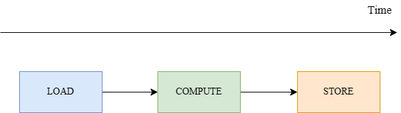
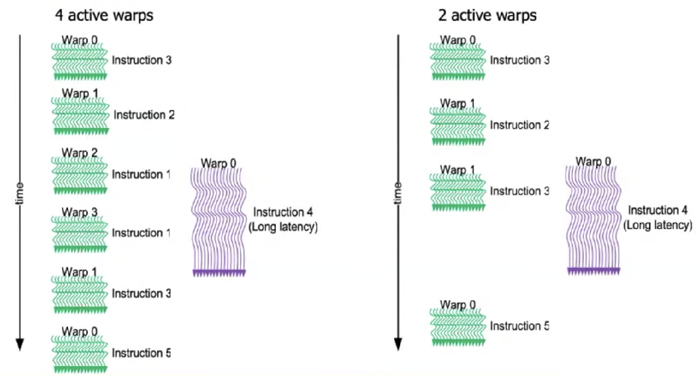
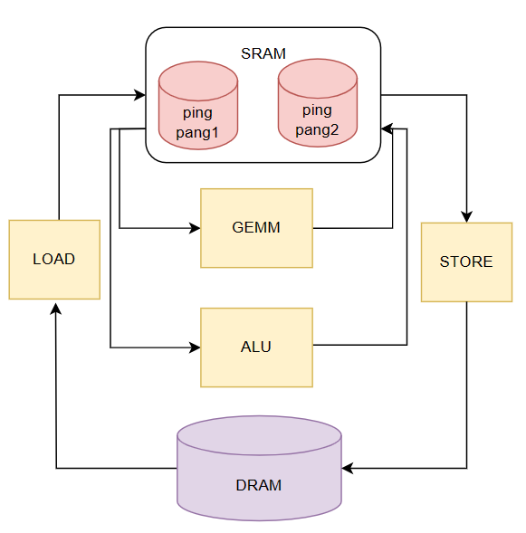

# 指令和存储优化

除了应用极广的循环优化，在 AI 编译器底层还存在指令和存储这两种不同优化。

## 指令优化

指令优化依赖于硬件提供的特殊加速计算指令。这些指令，如向量化和张量化，能够显著提高计算密度和执行效率。向量化允许我们并行处理数据，而张量化则进一步扩展了这一概念，通过将数据组织成更高维度的结构来实现更大规模的并行计算。这些技术使得算法能够充分利用现代处理器的多核和多线程特性，从而大幅提升性能。

### 向量化

在之前的循环优化中，已经介绍过了向量化的原理，它是一种数据级并行的优化。其硬件实现如下图所示，将多个连续存储的数据批量加载进向量寄存器中，对整个向量寄存器进行操作，从而同时对多个数据元素进行了计算。


假设两个整数的数组 A 和 B 计算元素和. 并将结果存储到 数组 C 当中。在非向量化的代码中，代码形式是这样的：

```python 
for (int i = 0; i < n; i++) {
    C[i] = A[i] + B[i];
}
```

在向量化的代码中，可能是这样的形式：

```python
for (int i = 0; i < n; i += 4) {
    C[i:i+3] = A[i:i+3] + B[i:i+3];
}
```

要实现加速，需要将其转换为硬件提供的向量化指令，例如：

```python
# Intel SSE
_mm_add_ps：将两个单精度浮点向量的对应元素相加。
_mm_mul_ps：将两个单精度浮点向量的对应元素相乘。

# Intel AVX/AVX2
mm256_add_ps：对两个 256 位宽的单精度浮点向量执行加法操作。
_mm256_mul_ps：对两个 256 位宽的单精度浮点向量执行乘法操作.

# ARM NEON
vaddq_f32：对两个单精度浮点向量执行加法操作。
vmulq_f32：对两个单精度浮点向量执行乘法操作。
```

### 张量化

在人工智能应用日益广泛的今天，程序运行的数据形式经历了显著的演变。特别是以神经网络为代表的深度学习模型，其内部数据形式为多维矩阵，通常称为张量。例如，在计算机视觉任务中，典型的输入数据具有 [N, C, H, W] 的维度，其中 N 代表批次大小，C 代表通道数，H 和 W 分别代表图像的高度和宽度。

在神经网络的内部计算过程中，特征图和参与计算的权重（如卷积核）也以类似的 4 维张量形式存在。传统的计算方法，如使用多层循环嵌套逐个计算数据元素，对于深度学习模型而言，效率极其低下。由于神经网络的计算具有高度的数据并行性，同一层内的元素之间几乎没有依赖关系。在理想情况下，如果能在硬件负载允许的范围内一次性将大量数据送入运算单元，将显著提升数据并行性，从而加速计算过程。

针对这一需求，NVIDIA 公司开发了 Tensor Core 技术，专门针对张量计算进行加速。Tensor Core 是一种特殊的硬件单元，设计用于高效执行深度学习中的张量运算，如矩阵乘法和累加操作，这些操作是深度学习模型中的核心组成部分。通过 Tensor Core，GPU 能够在保持精度的同时，大幅度提高张量运算的速度和效率。在 Volta 架构中，一个 SM 由 8 个 FP64 Cuda Cores，16 个 INT32 Cuda Core，16 个 FP32 Cuda Core，和 128 个 Tensor Core 组成，一共有 4 个 SM。

一个典型的 Tensor Core 指令如下所示，它可以在一条指令中计算 C[8x8] += A[8x32] * B[32x8]

```cpp
asm volatile ("mma.sync.aligned.m8n8k32.row.col.load.128b"
             " $0, $1, [$2], 0x7;"
             " mma.sync.aligned.m8n8k32.row.col.load.128b"
             " $0, $3, [$4], 0x7;");

// "mma.sync" 是矩阵乘累加操作的指令
// "aligned" 表示输入矩阵是内存对齐的
// "m8n8k32" 表示操作涉及的矩阵维度，这里 m=8, n=8, k=32
// "row" 和 "col" 表示矩阵 A 和 B 的布局，分别是行和列
// "load.128b" 表示以 128 位宽的块加载数据
// "$0" 是累加结果存储的寄存器
// "$1" 和 "$3" 是矩阵 A 和 B 的指针
// "$2" 和 "$4" 是矩阵 C 的指针，用于累加操作
// "[$2]" 和 "[$4]" 是内存地址
// "0x7" 是加载操作的控制码，表示使用 Tensor Core 进行计算
```

除了 NVIDIA 的 Tensor Core，Intel 也有类似的技术 Vector Neural Network Instructions（VNNI）。利用这些张量指令的一种常见方法是通过调用硬件厂商提供的算子库，如英伟达的 cuBLAS 和 cuDNN，以及英特尔的 oneDNN 等。然而，当深度学习模型中出现新的算子或开发者需要进一步榨取硬件性能时，单纯依赖硬件厂商提供的算子库就显示出其局限性。首先，算子库可能没有包含最新的或自定义的算子，这限制了模型的创新和多样性。其次，算子库的通用优化策略可能无法充分适应特定模型的特性，导致性能提升的空间没有被完全利用。

为了克服这些局限性，研究人员探索了更深层次的优化策略，例如使用自动算子生成工具，如 TVM。在之前的章节我们知道了算子的实现可以分为计算与调度，在调度部分可以使用更加丰富的指令和优化。TVM 可以通过分解一个算子，将其一部分操作映射为硬件实现或者高度优化的手工微内核，从而显著提高性能。我们使用伪代码来描述下如何将大的算子进行拆分，进而直接使用张量化指令。

```python
M=1024
K=1024
N=1024
InitTensor(A[K,M],B[K,N],C[M,N])
TILE_M=8
TILE_K=32
TIKE_N=8
# C = A^T * B
for m in range(M//TILE_M):
    for n in range(N//TILE_N):
        C_tile=C[m*TILE_M+TILE_M][n*TILE_n+TILE_n]
        zero_fill(C_tile)
        for k in range(K//TILE_K):
            A_tile=A[k*TILE_K:k*TILE_K+TILE_K][m*TILE_M+TILE_M]
            B_tile=B[k*TILE_K:k*TILE_K+TILE_K][n*TILE_n+TILE_n]
            tensorizate(C_tile,A_tile,B_tile)
```

## 存储优化

存储优化关乎于如何高效地管理数据在硬件中的存储和访问。在 AI 芯片硬件中，内存层次结构的设计至关重要。通过优化数据在不同层级内存之间的流动，我们可以减少数据传输的延迟和带宽消耗，从而提升整体的计算效率。例如，GPU 的内存管理策略包括全局内存、共享内存、常量内存等，每种内存类型都有其特定的用途和访问模式。

### 访存延迟隐藏

在纯串行执行的架构中，计算资源的利用受到显著限制，因为在同一时间点，通常只有一个运算单元处于活跃状态。以程序执行过程为例，其工作流程可概括为以下几个步骤：

1. **数据加载**：首先，系统从主存储器中检索所需数据，并将其加载到处理器的片上缓冲区（on-chip buffer）中。
2. **计算执行**：一旦数据加载完成，计算单元便开始执行预定的计算任务。
3. **数据写回**：最后，这些计算结果被从片上缓冲区写回到主存储器中，以供后续使用或存储。

这种串行处理模式虽然简单，却无法充分利用现代处理器的并行处理能力，导致计算效率和系统性能受限。



在这种情况下，每个运算部件的时间开销都累加得到最终的时延。为了克服这一局限，现代深度学习系统广泛采用并行计算架构，允许多个运算单元同时工作，显著提高了数据处理速度和整体系统性能。延迟隐藏（Latency Hiding）技术在这一领域得到了广泛的应用。该技术通过将内存操作与计算任务并行化，实现了两者的重叠执行，从而最大化了内存带宽和计算资源的利用效率。通过这种方式，即使在数据加载和写回阶段，也能持续执行计算任务，有效减少了因等待内存操作而产生的空闲时间。

CPU 实现延迟隐藏的过程主要依赖于多线程技术和硬件隐式数据预取机制。在多线程环境中，当一个线程等待内存访问时，CPU 可以切换到另一个线程继续执行计算任务，从而减少 CPU 的空闲时间。此外，现代 CPU 通常具备数据预取单元，能够预测程序接下来可能需要的数据，并提前从内存中加载到缓存中，这样当计算单元需要这些数据时，它们已经准备好了，减少了 CPU 等待内存访问的时间。

GPU 在实现延迟隐藏方面，主要依赖于其高度并行化的架构和先进的调度技术。Wrap Schedule 是一种用于管理多线程执行的技术，它允许 GPU 在等待内存操作完成时，动态地调度其他线程来继续执行计算任务。这种技术通过减少线程间的同步开销，提高了线程的执行效率。GPU 还采用了上下文切换机制，能够在不同的线程上下文之间快速切换，进一步隐藏内存访问的延迟。当一个线程因为内存访问而暂停时，GPU 可以立即切换到另一个准备好的线程继续执行，从而保持了 GPU 核心的持续工作。



NPU 采用了解耦访问/执行（Decoupled Access/Execute，DAE）架构。在 DAE 架构中，内存访问操作和计算操作是分开进行的，允许它们并行执行而不是顺序依赖。NPU 拥有专门的硬件单元来处理数据的加载和存储，这些单元独立于执行计算的核心。当计算核心需要数据时，它会发送请求，然后继续执行其他计算任务，而数据加载操作在后台进行。在这种情况下，一般需要使用双缓冲机制，来缓存不同 LOAD 指令得到的数据。



在这种模式下，执行指令会变为并行方式：


### 存储分配

从传统编译器的视角来看，内存被划分为几个关键区域，每个区域都有其特定的用途和生命周期。

- 局部变量是在程序的函数或代码块内部定义的。它们的存在周期仅限于定义它们的代码块。编译器在调用函数时，会在内存的栈空间中为这些局部变量分配一段内存。当函数执行完毕，这些局部变量的生命周期也随之结束，它们所占用的内存会被自动释放。

- 全局变量在程序的整个生命周期内都是可见的。它们在内存中的静态存储区分配空间，这意味着它们的内存分配在程序启动时完成，并在整个程序运行期间保持不变。全局变量为程序提供了跨函数和代码块的数据共享能力。

- 堆变量是在程序运行时，通过显式请求内存分配而创建的。它们在堆上申请一段内存空间，这为程序提供了极大的灵活性，允许在运行时根据需要动态地增长和缩减内存使用。

在 AI 系统中，这种视角下的内存管理显然无法支撑起 AI 应用。AI 系统通常需要处理大量的数据和复杂的算法，这就需要高效的内存分配和回收策略来支持它们的运行。专用硬件如 GPU 和 NPU 具有各自独特的内存管理机制，这些机制针对它们处理任务的特点进行了优化。

GPU 的内存管理机制包括：

- 全局内存：GPU 拥有自己的内存，称为全局内存或显存，它与 CPU 的内存分开。全局内存是 GPU 中最大的内存区域，但访问延迟较高。

- 共享内存：每个 GPU 线程块（block）可以访问的快速内存，通常比全局内存小得多，但访问速度更快。

- 寄存器：每个线程可以访问的非常快速的内存，但容量有限。

- 常量内存和纹理内存：这些是特殊类型的内存，它们可以提供对数据的缓存访问，以提高性能。

NPU 的内存管理机制包括：

- 片上内存：NPU 通常具有片上内存，用于存储权重和激活等数据，以减少与外部内存的通信开销。

- 内存访问模式：NPU 针对 AI 工作负载进行了优化，支持高并发的内存访问模式。

- 量化和压缩：使用数据量化和压缩技术，可以减少内存占用并提高能效。

- 专用内存控制器：NPU 可能具有专用的内存控制器，用于优化数据流和减少延迟。

## 小结

- 向量化允许并行处理数据，张量化则进一步扩展该概念，通过将数据组织成更高维度结构来实现更大规模的并行计算。

- 通过优化数据在不同层级内存之间的流动，我们可以减少数据传输的延迟和带宽消耗，从而提升整体的计算效率。

## 本节视频

<html>
<iframe src="https://player.bilibili.com/player.html?bvid=BV11d4y1a7J6&as_wide=1&high_quality=1&danmaku=0&t=30&autoplay=0" width="100%" height="500" scrolling="no" border="0" frameborder="no" framespacing="0" allowfullscreen="true"> </iframe>
</html>
