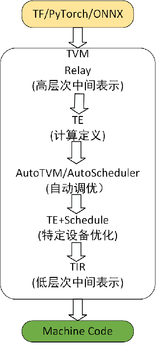
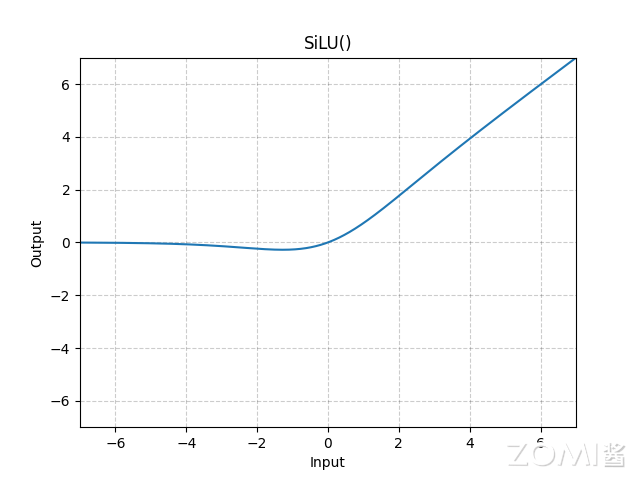
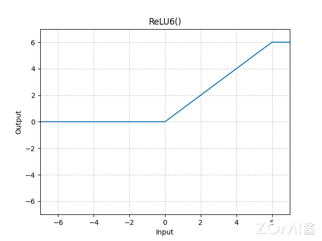
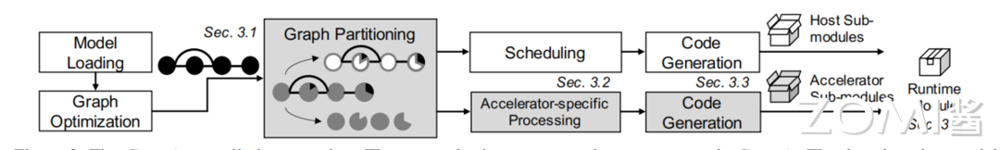
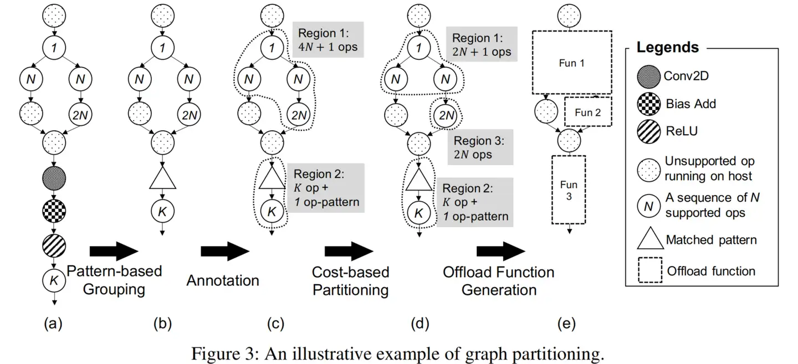
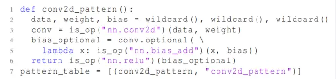
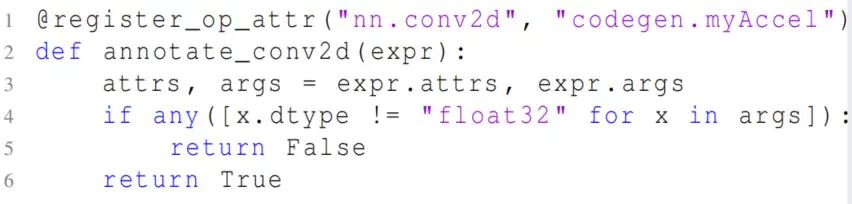
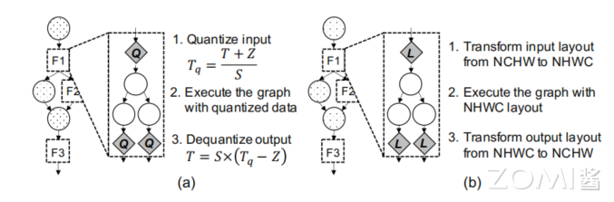
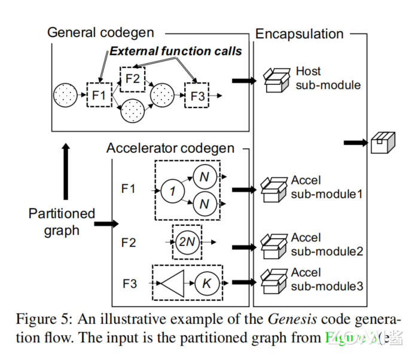
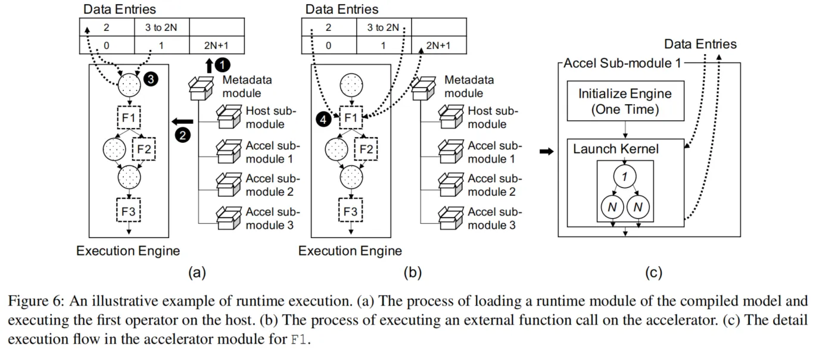

<!--Copyright © 适用于[License](https://github.com/chenzomi12/AISystem)版权许可-->

# TVM 实践案例

在本节我们探讨一下，如何利用 AI 编译器在新的硬件上部署一个神经网络，从算法设计到实际运行，有哪些需要考虑的地方？本节将以 TVM 为例，首先介绍一下 TVM 的工作流：



- 导入模型。TVM 可以从 TensorFlow、PyTorch、ONNX 等框架导入模型。
- 转换为 Relay。Relay 是 TVM 的中间表示形式，已导入 TVM 的模型以 Relay 表示。最新版本为 Relax。
- 转换为 TE（Tensor Expression，张量表达式）。在 Relay 应用图级优化后，将模型进行子图分割，并将子图降低为 TE 表示。
- 自动调优。使用 AutoTVM 或 AutoScheduler 搜索最佳调度，以更好利用硬件特性达到更高性能。生成最佳配置。在自动调优后，会生成调优记录日志，为每个子图选择最佳调度。
- 转换为 TIR（Tensor Intermediate Representation）。这是 TVM 的低级中间表示，特定于硬件平台。TIR 通过低层次优化进行优化。之后优化的 TIR 被降低到硬件平台的目标编译器。这是生成可部署到生产中的优化模型的最终代码生成阶段。
- 编译为机器码。TVM 支持不同硬件后端，包括：LLVM，针对任意微处理器架构，如 X86 和 ARM 处理器；专门的编译器，如 NVCC，NVIDIA 的编译器；嵌入式和专用目标平台，通过 TVM 的代码生成框架实现。

## 算法层

### 算子优化

在部署网络时，首先要考虑在目标硬件平台的可行性，如果目标硬件平台不支持某个算子，那么就需要替换为相似的受支持的算子。例如在 YoloV5 中，默认的激活函数为 SiLU，SiLU 的计算公式涉及自然指数和除法，对 FPGA 硬件非常不友好，其函数曲线如下：



而 YoloV5 中还提供了其他的激活函数如 ReLU6，其函数曲线如下图。经过实验发现二者在精度上面并无太大差异，而 ReLU6 的计算方式则简单的多，可以用 ReLU6 来替换 SiLU。



除了激活函数的替换，另一个典型例子是卷积的改进。为了改进普通卷积高额的计算开销，研究人员开发了多种紧凑卷积来压缩计算量：

- 压缩通道

    SqueezeNet 每个网络块利用小于输入通道数量的 1×1 filter 来减少挤压阶段的网络宽度，然后在扩展阶段利用多个 1×1 和 3×3 kernel。通过挤压宽度，计算复杂度明显降低，同时补偿了扩展阶段的精度。SqueezeNext 在扩展阶段利用了可分离的卷积；一个 k×k 的 filter 被分为一个 k×1 和一个 1×k 的 filter。与 SqueezeNet 相比，这种可分离的卷积进一步减少了参数的数量。

- 深度可分离卷积

    深度可分离卷积由 Depthwise Convolution 和 Pointwise Convolution 两部分构成。Depthwise Convolution 的计算非常简单，它对输入 feature map 的每个通道分别使用一个卷积核，然后将所有卷积核的输出再进行拼接得到它的最终输出，Pointwise Convolution 实际为 1×1 卷积。最大优点是计算效率非常高。典型实例如 Xception、MobileNet。

- 线性瓶颈层

    瓶颈结构是指将高维空间映射到低维空间，缩减通道数。线性瓶颈结构，就是末层卷积使用线性激活的瓶颈结构（将 ReLU 函数替换为线性函数）。该方法在 MobileNet V2 中提出，为了减缓在 MobileNet V1 中出现的 Relu 激活函数导致的信息丢失现象。

- 组卷积

    在组卷积方法中，输入通道分为几组，每组的通道分别与其他组进行卷积。例如，带有三组的输入通道需要三个独立的卷积。由于组卷积不与其他组中的通道进行交互，所以不同的组之间的交互将在单独的卷积之后进行。与使用常规卷积的 cnn 相比，组卷积方法减少了 MAC 操作的数量
    
### 量化

在算法层，还可以使用网络轻量化方法来对网络进行压缩。最常使用的方法是量化，在之前的章节已经介绍过量化的原理，在本节将以实践的角度介绍量化。

Pytorch 有两种量化 API，分为动态图（eager）量化和静态图（fx）量化。

在 torch.fx 出现之前（pytorch1.8 之前），量化可以在 eager 模式下进行。对一个 resnet18 进行量化感知训练的典型代码如下：

```python
import torch
import torchvision
import torch.nn as nn
import torch.optim as optim
import data_set

# 模型加载
device = torch.device("cuda:0" if torch.cuda.is_available() else "cpu")
net = torchvision.models.resnet18(pretrained= False)
names = [item[0] for item in net._modules.items()]
model_weight_path = "./weights/resnet18-f37072fd.pth"
net.load_state_dict(torch.load(model_weight_path), strict=False)

# 指定融合层
fused_layer = [['model_fp32.conv1', 'model_fp32.bn1', 'model_fp32.relu'],
    ['model_fp32.layer1.0.conv1', 'model_fp32.layer1.0.bn1', 'model_fp32.layer1.0.relu'],
    ['model_fp32.layer1.0.conv2', 'model_fp32.layer1.0.bn2'],
    ['model_fp32.layer1.1.conv1', 'model_fp32.layer1.1.bn1', 'model_fp32.layer1.1.relu'],
    ['model_fp32.layer1.1.conv2', 'model_fp32.layer1.1.bn2'],
    ['model_fp32.layer2.0.conv1', 'model_fp32.layer2.0.bn1', 'model_fp32.layer2.0.relu'],
    ['model_fp32.layer2.0.conv2', 'model_fp32.layer2.0.bn2'],
    ['model_fp32.layer2.1.conv1', 'model_fp32.layer2.1.bn1', 'model_fp32.layer2.1.relu'],
    ['model_fp32.layer2.1.conv2', 'model_fp32.layer2.1.bn2'],
    ['model_fp32.layer3.0.conv1', 'model_fp32.layer3.0.bn1', 'model_fp32.layer3.0.relu'],
    ['model_fp32.layer3.0.conv2', 'model_fp32.layer3.0.bn2'],
    ['model_fp32.layer3.1.conv1', 'model_fp32.layer3.1.bn1', 'model_fp32.layer3.1.relu'],
    ['model_fp32.layer3.1.conv2', 'model_fp32.layer3.1.bn2'],
    ['model_fp32.layer4.0.conv1', 'model_fp32.layer4.0.bn1', 'model_fp32.layer4.0.relu'],
    ['model_fp32.layer4.0.conv2', 'model_fp32.layer4.0.bn2'],
    ['model_fp32.layer4.1.conv1', 'model_fp32.layer4.1.bn1', 'model_fp32.layer4.1.relu'],
    ['model_fp32.layer4.1.conv2', 'model_fp32.layer4.1.bn2'],
    ]

# 插入量化与反量化节点
class QuantizedResNet18(nn.Module):
    def __init__(self, model_fp32):
        super(QuantizedResNet18, self).__init__()
        # QuantStub converts tensors from floating point to quantized.
        # This will only be used for inputs.
        self.quant = torch.quantization.QuantStub()
        # DeQuantStub converts tensors from quantized to floating point.
        # This will only be used for outputs.
        self.dequant = torch.quantization.DeQuantStub()
        # FP32 model
        self.model_fp32 = model_fp32

    def forward(self, x):
        # manually specify where tensors will be converted from floating
        # point to quantized in the quantized model
        x = self.quant(x)
        x = self.model_fp32.forward(x)
        # manually specify where tensors will be converted from quantized
        # to floating point in the quantized model
        x = self.dequant(x)
        return x


quantized_model = QuantizedResNet18(net)
quantized_model.eval()

# 层融合
quantized_model = torch.ao.quantization.fuse_modules(quantized_model, fused_layer)
quantized_model.train()

# 量化配置
quantization_config = torch.quantization.QConfig(activation=torch.quantization.MinMaxObserver.with_args(dtype=torch.quint16), weight=torch.quantization.MinMaxObserver.with_args(dtype=torch.qint8, qscheme=torch.per_tensor_affine))
quantized_model.qconfig = quantization_config
quantized_model=torch.ao.quantization.prepare_qat(quantized_model, inplace=True)
quantized_model.to(device)

#超参数
batch_size = 64
lr = 0.0001
epoch = 10


trainloader,testloader,test_num = data_set.load_data(batch_size)
loss_function = nn.CrossEntropyLoss()
optimizer = optim.Adam(quantized_model.parameters(), lr=lr)


# 训练
best_acc = 0.0
save_path_fp32 = './weights/resNet18_fp32.pth'
for epoch in range(epoch):
    # training
    quantized_model.train()
    running_loss = 0.0
    for step, data in enumerate(trainloader, start=0):
        images, labels = data
        optimizer.zero_grad()
        logits = quantized_model(images.to(device))
        loss = loss_function(logits, labels.to(device))
        loss.backward()
        optimizer.step()
        running_loss += loss.item()
        rate = (step + 1) / len(trainloader)
        a = "*" * int(rate * 50)
        b = "." * int((1 - rate) * 50)
        print("\rtrain loss: {:^3.0f}%[{}->{}]{:.4f}".format(int(rate * 100), a, b, loss), end="")

    quantized_model.eval()  # change into test model
    # int_model = torch.ao.quantization.convert(quantized_model, inplace=True)
    # int_model.eval()
    # 以上代码可以将模型转换为 int8 模型进行测试
    acc = 0.0  # accumulate accurate number / epoch
    with torch.no_grad():
        for val_data in testloader:
            val_images, val_labels = val_data
            outputs = quantized_model(val_images.to(device))  # eval model only have last output layer
            # loss = loss_function(outputs, test_labels)
            predict_y = torch.max(outputs, dim=1)[1]
            acc += (predict_y == val_labels.to(device)).sum().item()
        val_accurate = acc / test_num
        if val_accurate > best_acc:
            best_acc = val_accurate
            torch.save(quantized_model.state_dict(), save_path_fp32)
        print('[epoch %d] train_loss: %.3f  test_accuracy: %.3f' %
            (epoch + 1, running_loss / step, val_accurate))

save_path_int8 = './weights/resNet18_INT16.pth'
quantized_model.eval()  # change into test model

# 转换为 int8 模型进行保存
int_model = torch.quantization.convert(quantized_model, inplace=True)
torch.save(int_model.state_dict(), save_path_int8)
```

需要手动对模型有以下更改：

1.  插入 quant 量化节点与 dequant 反量化节点，进行显式的 float32 与 int8 数据类型的转换。如果模型中有无法量化或有意以浮点类型运行的层，需要用这对节点进行包裹。若模型比较复杂，手动修改的地方很多。
2.  在搭建模型的过程中，eager 模式量化必须将用到的所有算子在__init__中定义，并且引入的是 torch.nn 的形式，不能以 torch.nn.functional 的形式，哪怕这个算子没有参数，比如 ReLU，也要在__init__中定义，并且由于要统计量化 scale 和 zero_point，对不同输入 tensor 不能使用相同的算子，最好每个输入 tensor 用到的算子都单独定义。
3.  在推理时，有时要进行层融合（算子融合），典型模式如 Linear+ReLU、Conv+ReLU、Conv+BatchNorm，需要手动进行融合模式的指定，如代码开头一大串的 fused_layer。

整个过程需要对模型有较多修改，量化过程也有很多额外工作，过程很繁琐，特别是对于较复杂的模型，几乎要把模型代码修改一遍。

fx 模式量化首先会对模型 trace 一遍，跟踪 forward 函数中的执行代码，并记录网络中的每个节点。由于在运行量化前，fx 模式就获得了整个模型图的信息，因此不用像 eager 模式那样手动指定融合层，fx 模式会自动执行融合过程。

fx 模式也不用手动插入 quant 和 dequant 节点，在想要跳过量化的层指定量化 qconfig 为 None 就可以自动跳过这些层的量化，不用修改原模型代码。

fx 也有其局限性，例如不支持运行时动态的控制流，fx 在程序启动前就对模型 trace 完毕，所以无法获得运行时才知道的条件判断信息。

有些函数不支持直接的 trace，例如 arange、ones 等函数，可以通过@torch.fx.wrap 注解来使其支持。

fx 模式量化感知训练的典型代码如下：

```python
from torch.quantization.quantize_fx import prepare_qat_fx,convert_fx
import torch.quantization.observer as observer

#将模型转换为 QAT 版本模型，其他训练过程与正常训练类似
def qat_version_model(model):
    qconfig_dict = {
        # Global Config
        "":torch.ao.quantization.get_default_qat_qconfig('qnnpack'), #全局量化配置

        # # Disable by layer-name
        # "module_name": [(m, None) for m in disable_layers],

        # Or disable by layer-type
        "object_type": [
            (PositionalEmbedding, None),   #想要跳过量化层，可以设置为 None
            (torch.nn.Softmax, softmax_qconfig), #指定与全局量化配置不同的量化配置
            ......
        ],
    }
    model_to_quantize = copy.deepcopy(model)
    model_fp32_prepared = prepare_qat_fx(
        model_to_quantize, qconfig_dict)
    return model_fp32_prepared

qat_model=qat_version_model(float_model)

#********模型训练**********
for i in range(epoch_nums):
    train(qat_model,train_data_loader)
    ......

#********模型验证**********
quantized_model = convert_fx(qat_model)
evaluate(quantized_model,eval_data_loader)
......

# 保存量化版本的模型

# 以 torchScript 的形式
trace_model = torch.jit.trace(quantized_model, (input1, input2, input3))
torch.jit.save(trace_model, 'trace_model.pt')

#以 onnx 的形式
torch.onnx.export(quantized_model, (input1, input2, input3), "quantized_model.onnx",
input_names=['input1', 'input2', 'input3'], output_names=['result'],
opset_version=16, export_params=True)
```

1.  模型不同部分可以采用不同的量化配置，在 qconfig_dict 中支持以层名、层类型指定量化配置，想要跳过量化的层可以直接设置为 None。
2.  导出方式可以用 torchScript 的形式，也可以用 onnx 接口导出。

使用 fx 量化有一些值得注意的地方，总结如下：

- **在模型经过 prepare_qat_fx 时，出现函数不支持 trace，典型报错如下：**

    ```python
    xxxfunc(): argument 'xxx' (position 1) must be xxx, not Proxy
    ```

    这是由于 fx 对模型 trace 的时候，并没有真正喂入数据，而是用 proxy 的形式作为输入，生成记录网络节点的信息。可以用以下形式规避：

    ```python
    @torch.fx.wrap
    def abs_fx(dim1:int,dim2:int):
        return abs(dim1 - dim2)
    
    @torch.fx.wrap
    def ones_fx(dim1:int,dim2:int):
        return torch.ones(dim1, dim2)
    
    @torch.fx.wrap
    def triu_fx(dim1:int,dim2:int):
        return torch.triu(dim1,dim2)
    ```

    使用注解标注这个函数，然后调用该函数即可

+ **训练过程 loss 或量化参数出现 NAN**

    有两种可以尝试的方法：

    -   使用不同的量化 qconfig。不同的 qconfig 对于训练过程中 scale、zero_point 的生成是有区别的，可供探索的配置包括 observer、per_channel or per_tensor 等。
    -   在加入量化感知训练之前先预训练一段时间，最好待模型已经趋于收敛了再转为量化感知训练。

+ **量化感知训练时正确率和 loss 一直不变**

    这里有个细节，在模型训练过程中要选择 optimizer 来对模型参数更新，这个 optimizer 是与模型的参数关联的。在模型预训练后，转换为量化感知训练模型时，模型进行了深拷贝（model_to_quantize = copy.deepcopy(model)），模型参数的地址已经发生了改变，所以要重新生成一个与量化模型关联的 optimizer（或许也有学习率 scheduler）。

+ **量化感知训练收敛速度过慢**

    预训练至模型趋于收敛了再转为量化感知训练。

## 编译层

### 前端量化模型解析

TVM 使用 QNN Dialect 来解析量化模型。QNN 是为 TVM 开发的支持导入预量化模型的框架，具有以下特点：

-   QNN 为计算图级别的高层次 IR。在 QNN 中添加了新的算子，但未进行任何图级别或算子级别优化。而是将这些算子映射到已经定义好的图或算子级别优化。
-   QNN 量化算子表示比任何图级别算子的层次都高
-   可以定义新的 QNN 优化 pass 来转换图，使其适配特定硬件后端

以 PyTorch 模型为例从一个量化模型的导入到生成计算图来介绍 QNN 工作流程。TVM 为每一个训练框架的 Converter 都会维护一个`convert_map`，将该框架训练的模型算子转换为 relay 算子。例如`"quantized::linear": _linear()`，`"quantized::conv2d": _quantized_conv2d()` 。

以 `_quantized_conv2d()` 为例，解释下导入的过程：

```python
def _quantized_conv2d(with_relu=False):
    def _impl(inputs, _):
        # refer to src/ATen/native/quantized/cpu/qconv.cpp
        # inputs[0]: input tensor
        # inputs[1]: (weight, scale, zero_point, bias)
        # inputs[2-5]: stride, padding, dilation, groups
        # inputs[6]: output_scale
        # inputs[7]: output_zero_point
        # inputs[8]: input_scale (added manually by frontend)   input 的 scale 和 zero_point 在 QTensor 的属性中，需要提前运行_get_quant_param_for_input()函数获得。该函数有一个 output_quant_param_indices 的 dict，记录了算子输出结果的 scale 和 zero_point，作为下一个算子 input 的 scale 和 zero_point
        # inputs[9]: input_zero_point (added manually by frontend)
        conv_params = inputs[1]
        weight = conv_params[0]
        weight_scale = conv_params[1]
        weight_zero_point = conv_params[2]
        bias = conv_params[3]

        if len(conv_params) > 4:
            # Torch 1.6 or newer case
            strides = conv_params[4]
            padding = conv_params[5]
            dilation = conv_params[6]
            groups = conv_params[7]

            output_scale = _expr.const(inputs[2])
            output_zero_point = _expr.const(inputs[3])

            assert len(inputs) == 6, "Input quant params not found in op inputs"

            # These are manually added by add_input_quant_params_to_op_inputs above
            # In torch, they are retrieved from QTensor data structure at runtime
            input_scale = _expr.const(inputs[4])
            input_zero_point = _expr.const(inputs[5])
        else:
            strides = inputs[2]
            padding = inputs[3]
            dilation = inputs[4]
            groups = inputs[5]
            output_scale = _expr.const(inputs[6])
            output_zero_point = _expr.const(inputs[7])

            assert len(
                inputs) == 10, "Input quant params not found in op inputs"

            input_scale = _expr.const(inputs[8])
            input_zero_point = _expr.const(inputs[9])

        weight_shape = infer_shape(weight)
        kernel_size = (weight_shape[2], weight_shape[3])
        out_channels = weight_shape[0]

        if padding[0] != 0 or padding[1] != 0:
            pad_val = _get_scalar(input_zero_point)
            inp = _op.nn.pad(
                inputs[0],
                pad_width=((0, 0), (0, 0),
                           (padding[0], padding[0]), (padding[1], padding[1])),
                pad_value=float(pad_val), #padding 操作的值是输入的 zero_point，而不直接是 0
            )
        else:
            inp = inputs[0]

        # padding is (0, 0) because we did explicit pad op with
        # pad value being zero point above
        conv_out = relay.qnn.op.conv2d(  #对接了 qnn 的 conv2d 算子，该算子的实现在 cpp 端，并没有直接实现量化 conv2d 的 kernel，而是转换为一系列 relay 操作
            inp,
            weight,
            input_zero_point,
            weight_zero_point,
            input_scale,
            weight_scale,
            kernel_size=kernel_size,
            dilation=dilation,
            strides=strides,
            padding=(0, 0),
            groups=groups,
            channels=out_channels,
        )

        #在计算完 quantized::conv2d 后，需要进行再量化
        return _do_bias_and_requantize(
            conv_out, bias, input_scale, weight_scale, output_scale, output_zero_point, with_relu
        )

    return _impl
```

**关键函数：**

-   add_input_quant_params_to_op_inputs

将算子的 input 的 scale 和 zero_point 显式地提取出来。有一个`num_quantized_inputs`的 dict，记录了算子的量化输入的数量，例如 `"quantized::conv2d": 1`,`"quantized::add": 2`。如果有新的量化算子加入，需要在这里加入。

-   _get_quant_param_for_input

执行 add_input_quant_params_to_op_inputs 函数中量化参数提取，维护`output_quant_param_indices`的 dict，记录算子 output 的 scale 和 zero_point 的 index，index 数据的来源是 node 中注册算子时的属性顺序。如果有新的量化算子加入，需要在这里加入。

`quantized::conv2d`分解为已有的 relay 算子。这个分解流程的原理来源于 Tensor 的量化原理。

量化 tensor（以 A 代指原本的 input 的浮点数表示）可以表示为：

```python
A = scale_a x (QA - zp_A)
```

矩阵乘法的浮点表达式为：

```python
C(m, n) = Sigma(k) (A(m, k) * W(n, k)) // 表示在 k axis 进行 reduce
```

将上式替换为量化形式，则为：

```python
Sigma(k) ([QA(m, k) - zp_a] * [QW(n, k) - zp_w])
```

这里将式子展开，即为以下四项。QNN 选择以下分解的原因，是出于对编译器现有操作的复用和底层指令的可利用性。

```python
Sigma(k) QA(m, k) * QW(n, k)                         // Term1
- Sigma(k) zp_w * QA(m, k)                             // Term2
- Sigma(k) zp_a * QW(n, k)                             // Term3
- Sigma(k) * zp_a * zp_w                               // Term4
```

除此之外，还有一种计算形式，TensorFlow 采用了这种形式。在下面这个式子里，只需每个 input 和 weight 减去各自的 zero_point，再进行乘累加计算，这样也能得到卷积的计算结果，但是需要针对量化来重写 conv2d 的 kernel。

$$
\begin{aligned}&y_{scale}\cdot(y_{int}-y_{zero})=x_{scale}\cdot(x_{int}-x_{zero})\cdot w_{scale}\cdot(w_{int}-w_{zero})\\&y_{scale}\cdot(y_{int-}y_{zero})=(x_{scale}\cdot w_{scale})\cdot(x_{int-}x_{zero})\cdot(w_{int-}w_{zero})\\&y_{scale}\cdot(y_{int-}\cdot y_{zero})=(x_{scale}\cdot w_{scale})*INT32GEMM\\&y_{int}=(x_{scale}\cdot w_{scale}/y_{scale})\cdot INT32GEMM-y_{zero}\end{aligned}
$$

除了卷积层，这里再介绍下其他主要算子的量化流程：

- **乘法**

    一个原始的 float mul 伪代码如下，这里数值类型都是 float 的：

    ```python
    f_output = f_src0 * f_src1
    ```

    当其量化到 int8 时，计算当然不是简单的`i_output=i_src0*i_src1`，不然量化得到的尺度因子 scale 和零点 zero_point 完全没有用到。

    由于 f_output 和 i_output 是量化公式这层计算关系的，可以直接将量化公式带入浮点计算的式子，得到

    ```python
    (i_output-zero_point_output)*scale_output =((i_src0 - zero_point_0) * scale_0) * ((i_src1 - zero_point_1) * scale_1)
    
    //经过变换
    i_output = ((i_src0 - zero_point_0)*(i_src1 - zero_point_1)) * (scale_0*scale_1/scale_output) + zero_point_output
    ```

    在上述计算中，`((i_src0 - zero_point_0)*(i_src1 - zero_point_1))`是整数计算，但是`(scale_0*scale_1/scale_output)`是一个浮点数，难道要在计算中插入一段浮点计算吗？当然不是这样，这段计算叫做**requant**，是为了修正数据传导到不同层含有不同 scale 和零点所做的操作。其计算完全可以转换为整数计算。**那么量化乘法可以变为两个计算：整数的乘法计算和随后的 requant 计算。**

    我们也可以发现，如果使用对称量化，那么三个 zero_point 的值都等于 0，计算形式被大大简化了，变成了下面这样。这样指令数量和计算量减小了许多，因此如果神经网络不复杂或者数据分布够均匀，可以尽量使用对称量化来减小部署时的计算量。

    ```python
    i_output = i_src0 *i_src1 * (scale_0*scale_1/scale_output)
    ```

-  **requant 再量化操作**

    requant 中的难点是如何用整数计算来计算与`scale_0*scale_1/scale_output`这样一个浮点数的乘法。这一长串在运行时数据都是已知的，因此在编译期就可以将其提前计算，记作 s。假设 s=0.2，那么 s 可不可以表示为一串整数的计算？

    根据浮点数的存储原理，其可以分解为尾数**mantissa** 和阶数**exponent**，上面的 0.2 可以分解为尾数 0.8 和阶数-2，即 0.2=0.8*2^(-2)，公式化为**s = mantissa \* 2 ^ exponent**。尾数的值在（0.5,1）之间。如果量化的内部硬件在计算时以 int32 计算，那么 mantissa 可以表示为 mantissa*2^31*2^-31。在这个例子中 0.8 变为 1717986918*2^-31，右半部分可以用移位计算，那么 0.2 就变成了 1717986918*2^-31*2^(-2)。就完全变成了乘法和移位计算，之前的浮点数 s 变成了一个乘数和一个移位数。

    下面这段 tvm 中的代码就是将 s 分解为乘数和移位数的函数：

    ```python
    std::pair<int32_t, int32_t> GetFixedPointMultiplierShift(double double_multiplier) {
      int32_t significand, exponent;
      if (double_multiplier == 0.) {
        significand = 0;
        exponent = 0;
        return std::make_pair(significand, exponent);
      }
    
      //获得尾数和阶数
      double significand_d = std::frexp(double_multiplier, &exponent);
    
    
      significand_d = std::round(significand_d * (1ll << 31));
      auto significand_int64 = static_cast<int64_t>(significand_d);
      ICHECK_LE(significand_int64, (1ll << 31));
      if (significand_int64 == (1ll << 31)) {
        significand_int64 /= 2;
        ++exponent;
      } //如果乘积的结果等于 (1ll << 31)，即超出了 32 位有符号整数的范围，则进行一次右移操作，并将指数部分加 1，以保证结果可以正确表示。
      ICHECK_LE(significand_int64, std::numeric_limits<int32_t>::max());
      significand = static_cast<int32_t>(significand_int64);
      return std::make_pair(significand, exponent);
    }
    ```

- **加法**

    乘法和加法都是二元操作，但是他们的量化计算方式却是不同的。如果仍然按照乘法的那个思路，会变成下面这样：

    ```python
    f_output = f_src0 * f_src1  //原始浮点计算
    
    (i_output-zero_point_output)*scale_output =((i_src0 - zero_point_0) * scale_0) + ((i_src1 - zero_point_1) * scale_1)
    
    //转换
    i_output=((i_src0 - zero_point_0) * scale_0/scale_output) + ((i_src1 - zero_point_1) * scale_1/scale_output)+zero_point_output
    ```

    与上面的量化乘法不同，量化乘法可以在乘法之后加一个 requant 计算。但是量化加法的乘以一个浮点数无法提取出来，根据上面的计算公式，两个操作数需要在加法之前就做 requant 计算，之后再进行加法。concat 也是与 add 这样的方式。

- **激活函数**

    激活函数有需要经过复杂计算的，比如 tanh、sigmoid、exp、softmax 等，也有简单的例如 relu、relu6 等。

    对于复杂的激活函数，一般有两种方法，一种是拟合，另一种是使用查找表。

    - **拟合**

        拟合是使用一系列分段的多项式函数去逼近这一段的非线性计算的值。一般使用泰勒展开、傅里叶展开等形式，或者自己设计一个拟合函数。这个拟合函数的设计非常的影响精度，有时会使用一些魔法，看起来很不直观。

        例如对于 exp，其泰勒展开式为 $ exp(x)=1+x+\frac{x^2}{2!}+\frac{x^3}{3!}+R_4 $。这里只展开到 3 次项，为了更高的精度可以继续展开，但是计算也更复杂，如何处理余项也需要考虑。

    - **查找表**

        好在如果使用 int8 量化，那么输入的数据只有[-128,127]这 256 个数，经过激活函数后产生 256 个输出值，这是个一对一的映射关系，因此可以使用查找表提前保存这 256 个值，在运算时直接查表即可。查找表的生成可以模拟浮点计算的过程：将 input 到 output 的过程看作大小为 256 的一对一映射，把 input（int8 的整数）看作索引，LUT 看作数组，直接取值即可

        

        以 tanh 为例，获得 int8 范围内[-127,128]的 LUT 代码如下：

        ```python
        import torch
        import numpy as np
        
        def get_tanh_lut( data,scale):
        
        
            data=data*scale # dequant   
            lut=data.tanh() #activation func
            lut=lut/scale # quant
        
            lut=lut.round()
            lut=torch.clamp(lut,-128,127)
            lut.to(torch.int)
        
            return lut
        
        range_low=-128
        range_high=127
        scale = 0.2
        data=torch.tensor(np.linspace(range_low,range_high,range_high-range_low+1))
        
        lut = get_tanh_lut(data,scale)
        ```

        在使用时也非常简单，伪代码如下：

        ```python 
        int8 get_tanh_result(int8 input){
            # 这里偏移 128 是因为存放查找表时是-128，-127，...，126，127 这样的顺序， 对应的索引是 0,1,2，...，需要偏移 128
            return TANH_LUT[input+128]; 
        }
        ```

- **被动量化算子**

    不是所有算子的运算都需要改变量化参数，例如对于 padding、relu、clip、maxpooling 等，输入和输出共享 scale，也就是 scale 不会发生改变，不需要 requant 操作。对于这类算子，计算形式有时要发生一些小小的变化：
    - 对于 padding，一般是填充 0 值，量化后要填充这个数据对应的 zero_point。

    - 对于 relu，形式为 `output = max(input,0)`，量化后其运算变为 `output = max(input,zero_point)`

    - 涉及到常量的通常也要把常量值进行量化，例如 max，形式为`output=max(input,min)`，量化后为`output=max(input,min/scale+zero_point)`。add、mul 一个标量也需要这样。

    这些算子不需要使用 requant，因为没改变量化参数。

    在经过上面一系列逐算子的转换后，深度学习编译器或推理引擎还要经过计算图的优化，整个神经网络会被改写，增加或者删除或者更新一些算子。

在经过一系列的转换后，量化网络的结构会发生极大变化，这里有一个简要的示意图：


左边的原始网络会变成右边的结构。标号处是值得关注的地方：

1.   左边的 conv+relu6 可以组合为一个融合的大算子。右半部分是量化的大算子展开之后的计算。weight 和 bias 要在参与计算之前 quantize（编译器进行），这里 bias 要和 conv 的结果做加法，因此其量化的 scale 等于 input_scale x weight_scale。加完之后的结果的 scale 要转变为 output_scale，插入了 requantize 操作，即用定点乘法和移位模拟与（ input_scale x weight_scale / output_scale）这个浮点数的乘积。具体的原理在上一节量化网络算子如何计算有提到。最后一个操作是 clip，即数值截断指令。数值截断指令在每一个大算子结尾都有，因为 input、output 均是 int8，中间的计算数据类型是 int32（为了防止溢出），在数据 store 回 ddr 时，需要进行截断以保证 output 仍然是 int8 的范围。这里 relu6 和本来的数值截断指令融合了，因为 relu6 本质也是数值截断，和原有 int8 数值截断的范围取个交集就同时完成了二者的计算。
2.   乘法操作之后需要插入 requantize。
3.   maxpool 是被动量化算子，未改变量化参数。不用插入 requantize 节点。
4.   conv+relu6+tanh 也可以融合为一个大算子，因为 relu6 和 tanh 都是逐元素、一对一映射计算的。在经过图变换后，量化需要的节点都已插入。之后需要去做低层的优化和指令生成。

### 计算图优化

统计了 TVM 中前端一些关键 Pass 的作用，探究在高层次计算图优化中，编译器都做了哪些事。

| 名称                                                         | 含义             | 作用                                                         |
| ------------------------------------------------------------ | ---------------- | ------------------------------------------------------------ |
| DeadCodeElimination                                          | 死节点消除       | 删除未被使用到的表达式。实现流程应该是用 UsageVisitor 遍历每个节点，计数每个节点被用到的次数，当其为 0 时，在 EliminatorMutator 中将其去除。 |
| LazyGradientInit                                             | 梯度延迟初始化   | 减小梯度张量的内存开销，对 ones, ones_like, zeros, zeros_like 这些算子只有使用到时再实例化 |
| FoldConstant（还有个 FoldConstantExpr，针对常量表达式）       | 常量折叠         | 折叠 relay 中的常量。在编译器就已知输入、权重、属性等信息的算子可以在编译器就完成计算，运行时直接使用计算好的常量值。 |
| FuseOps（其逆操作为 DefuseOps）                               | 算子融合         | 按照规则将算子融合为复合算子。                               |
| SimplifyInference                                            | 简化推理         | 对 batch_norm、dropout、instance_norm、layer_norm、group_norm、l2_norm 做了重写。 |
| FastMath                                                     | 快速数值计算     | 将非线性激活函数用更快的近似方法代替。包括 exp（自然指数）、erf（误差函数）、tanh、softmax 的 fast 版本 |
| DynamicToStatic                                              | 动态转静态       | 若动态算子的输入是静态，将其转换为静态算子，重新执行类型推理和常量折叠。包含算子：reshape、squeeze、tile、topk、broadcast_to、zeros、ones、one_hot、image.resize2d、full、nn.upsampling、nn.upsampling3d、nn.pad、strided_slice、sparse_to_dense |
| InferType                                                    | 推断类型         | 为输出等填入明确的类型信息。                                 |
| EliminateCommonSubexpr                                       | 消除公共子表达式 | 若多个表达式是相同（属性相同且输入相同）的值且在多处使用，创建一个公共的变量替换这些表达式 |
| CombineParallelConv2D（CombineParallelBatchMatmul 类似）      | 合并并行卷积     | 将共享相同输入节点和相同参数的卷积（除了输出通道的数量可以不同）替换为单一的卷积。新的 2d 卷积的权重是原始权重的 concat。conv2d 之后的加法广播运算也会尽可能合并。这可以防止在有多个卷积分支的网络中启动多个内核，如 Inception。 |
| CombineParallelDense                                         | 合并并行 Dense 层  | 取代了共享相同输入节点、相同形状、没有定义 " units "的 dense 操作，只用一个 batch MM 就可以。<br/>这可以防止在有多个 dense 分支的网络中启动多个内核，例如 BERT |
| FoldScaleAxis（ForwardFoldScaleAxis、BackwardFoldScaleAxis 类似） | 折叠在轴上的缩放 | 当某个轴上带有放缩时，将其融合进 dense 或 conv2d 的权重。        |
| CanonicalizeOps                                              | 规范化算子       | 将算子转换为其简化版本，在实现中仅涉及 bias_add_op，将其转换为 expand_dims+boradcast_add |
| AlterOpLayout（ConvertLayout 类似）                           | 替换算子布局     | 用于计算自定义布局的卷积或其他通用权重的预变换。             |
| Legalize                                                     | 合法化           | 用另一个表达式替换一个表达式，以实现目标平台相关的优化。该 pass 主要用于 QNN。 |
| PartitionGraph                                               | 划分图           | 根据插入的标注节点（即 compiler_begin 和 compiler_end），将一个输入函数分割成多个函数。这些节点被用作边界，将 Relay 函数划分为多个区域，可以卸载到不同的加速器后端。 每一个被分割的函数，也就是区域，都将被视为外部函数，并且它们将使用所提供的编译器进行代码生成。 |
| SimplifyExpr                                                 | 简化表达式       | 基于模式匹配和重写的方式简化 Relay 表达式。                    |
| AnnotateUsedMemory                                           | 标注使用的存储   | 通过分析每个函数调用的输入/输出张量的有效性并计算这些张量所需的总内存量，标注每个函数调用点的最小所需内存。不支持动态类型。 |
| FlattenAtrousConv                                            | 展平空洞卷积     | 这种转换将空洞卷积扁平化，它对应于操作序列"space_to_batch_nd"->"conv2d""batch_to_space_nd"，并将它们转换成带有修改过的 "dilation "和重新计算的 "padding "参数的卷积子图。 |

在实际开发中，这些 Pass 一般只需直接使用即可，前端优化已经比较收敛了。

### 后端 Codegen 接入

TVM 推荐的 BYOC（Bring Your Own Codegen to Deep Learning Compiler）方式，提出了一个统一的框架，允许不同的硬件加速器供应商通过以即插即用的方式集成他们的代码工具，复用尽可能多的硬件无关的优化。为开发人员提供了灵活的接口，以便 1）对计算图进行标注和分区；2）对分区图应用特定于硬件的优化。

该框架流程如下：



流程：

1.模型加载，转换为统一的 IR 表示

2.硬件无关的计算图优化，常数折叠、算子简化等

3.图划分，划分为 host 和 accelerator 两个部分。

#### 图划分

将模型切割为不同的子图，对加速器运行友好（例如加速器支持的算子，或者在加速器上执行效率更高的算子）的部分被卸载，其余部分仍然让 host 执行。深度学习编译器通常有多层 IR，比如 TVM 的 Relay 和 TensorIR，和 MLIR（顾名思义），因此需要决定在哪个 IR 级别进行划分。

该框架在高层 IR（即仍旧保留算子名称和属性的 IR）进行划分，出于以下考虑：

1）一些硬件供应商手工制作了一个内核库。在这种情况下，唯一需要的信息是将每个算子映射到对应的内核的名称和属性，而不是由低级 IR 合并的硬件信息。

2)一些硬件供应商使用自己的低级 IR，需要从高层 IR 转换



**基于模式的分组：**

许多硬件加速器使用指令执行算子。例如 Conv2d、Add、Relu 的序列通常可以映射到单个算子，以最小化处理中间结果的开销（算子融合）。因此，硬件供应商需要使用模式匹配算法来匹配 IR 节点序列，并用复合指令替换他们。

该框架提供了模式匹配机制，如下代码描述的匹配一个 Conv2d-add-relu





通过上述匹配模式表，可以将图 3（上）a 转换为 b


**注解：**

在根据模式将 node 进行分组后，下一步是根据编程模型指定支持的算子列表。例如下代码注册了一个函数，指示所有浮点类型的 Conv2D 节点被注释并卸载到 MyAccel 中



通过一组注解函数，在图中生成了多个区域，这些区域可以被卸载到目标加速器上，如上图 3（c） 。

在上图例中将区域都卸载到一个目标 MyAcc 上，但该框架支持将区域卸载到多个目标上，并可以指定优先级，将算子卸载到最高优先级的目标上。

**基于成本的划分：**

贪心的合并支持的算子以进行充分的算子融合是理想的，但由于资源限制（如片上存储大小、计算单元数量），对于一些加速器来说不适用。除了注解外，该框架还提供另一种基于成本的划分。用户设置最大可融合的数量，例如将 3N 设为阈值，图 3（c）中的区域应当分割为图 3(d)中的区域 1 和 3。

将一个区域从 host 卸载到 device 通常会引入数据传输和内核调用开销，如果没有耗时的计算，应该将区域留在 host 执行，该框架支持按用户指定的标准将区域回调到 host 上。

最后，每个可卸载区域被封装成一个单独的函数，并用一个 target 属性标记，该属性指示执行后端，如图 3（e）。

#### 特定加速器的处理

在划分之后，一个图被分割成多个不同后端处理的区域，在 host 上的区域可以有效利用从现有的深度学习编译器中进行的标准优化，然而卸载到加速器的区域可能需要一些特定于硬件的优化（例如融合、替换、存储布局转换、量化等），这些优化通常是专有的，无法在深度学习编译器中处理。





上图左边是量化，右边是存储布局转换。

#### 代码生成

编译流的最后一步是代码生成。



该框架通过遍历图并为每个图节点调用相应的代码生成来生成一个子模块。当遍历到 host 上的节点时，可以利用现有深度学习编译器中的代码生成，如 TVM 和 XLA，它们能为通用设备（如 CPU 和 GPU）生成代码。当遍历到特定 target 标注的节点（即划分函数）时，生成一个外部函数调用作为运行时内核调用的 hook。同时调用加速器特定的代码生成，其包含了硬件供应商提供的代码生成工具和编译流，为该节点中的划分函数生成一个“加速器子模块”。

加速器子模块中生成的代码必须以一定的格式表示，以便在运行时可以被加速器的执行引擎消耗。该框架提供了一下代码生成格式：

1.  **标准图表示** 使用 json 文件记录算子名称、属性和数据流，这种格式易读。例如 NVIDIA TensorRT 和 Arm 计算库使用该框架的 json 生成器来搭建与运行时之间的桥梁。
2.  **标准 C 代码**

尽管选项 1 易于实现和部署，但它需要一个图引擎来包含所有受支持的算子的实现，这可能会导致较大的二进制大小。

该框架提供了一个标准的 C 代码生成器，可以发射内核库函数调用并将它们与 host 子模块链接在一起来支持加速器的专有内核库，这个解决方案简化了代码打包，因为 host 代码通常是兼容 C 的。当库函数调用成为 host 子模块一部分时，硬件供应商可以充分利用现有的运行时系统。

  **3. 自定义图表示**

某些加速器有专用格式来表示神经网络，如 ARM Ethos-N 和 Xilinx Vitis AI，为了满足这种需求，该框架提供了一组统一的 API 来定制序列化的代码格式：1）将生成的代码编译和序列化为一个 bit 流，以便其可以与其他子模块一起实例化；2）在运行时反序列化来自子模块的 bit 流

至此，针对 DNN 模型的编译和打包模块已经完成，之后进入运行时系统加载模块并执行推理。

#### 运行时

运行时系统负责执行模型图的推理，并将算子和子图分发到目标平台。图执行引擎可以是一个简单的数据流图 visitor，处理大多数 CNN；也可以是一个虚拟机来执行字节码，处理现代模型中呈现出的动态性和控制流。



运行时系统流程如下：

1.  **初始化元数据模块**

DNN 模型的大量权重参数在推理时一般是常数，应该包含在运行时模块中。不同的子模块都需要这些权重，该框架提供了一个统一的模块来管理，称为元数据模块。如上图 6（a）中，元数据模块被设计为一个包含所有常量、host 子模块、加速器子模块的层次化模块。在初始化时，元数据模块将这些常量加载到运行时数据项中，这是在 host 或加速器上预分配的一组内存 buffer。（如上图 6**①**）

除了权重常量外，数据项还维护了模型的输入、输出以及中间结果。由于划分函数（即算子融合后的复合算子）已经是外部函数调用。因此其中间结果不会在数据项中得到维护。

2.   **执行 host 上的图节点**

当调用推理时，host 子模块加载模型图并启动执行引擎（上图 6**②**）,开始依次执行图节点。如上图 6**③**子模块可以直接访问数据项来读取输入，调用内核执行计算，将结果写入数据项

3.   **执行加速器上的图节点**

如上图 6（b），host 执行引擎执行 F1，这是对加速器的外部函数调用（图 6**④**）。执行细节如图 6（c）。

执行过程包含两个步骤：1）加载模块后初始化硬件供应商定制的 F1 执行引擎；2）启动内核，与数据项做交互。

基于该框架，目前已有 TensorRT、Xilinx Vitis AI 等多个推理引擎接入 TVM。

## 仿真层

### 算子仿真

当涉及到新硬件平台、新算子时，需要保证算子到网络整个层级的正确性。

在深度学习加速器的开发中，最小的运行单位是算子。在 TVM 测试新算子的正确性，有多个步骤：

1.   计算的正确性：使用 TVM 的 DSL 编写算子的计算流程，然后生成一个默认的调度，这个调度是在 CPU 上计算的，硬件上是绝对正确的。使用 Pytorch 的结果作为基准，测试通过后，可以认为计算的编写没问题。
2.   编译器仿真器：使用 TVM 的 DSL 编写算子的调度流程，生成针对该硬件的指令流。使用 C++实现在 CPU 上计算的仿真器，这个仿真器的编写模仿硬件端的计算逻辑，尽可能使得计算、同步、访存的方式一致，来验证指令生成，各个字段的数值以及同步的方式是否正确。
3.   硬件仿真：验证指令的正确性后，将虚拟的 ddr（运算前后）、指令等保存下来，送到硬件端进行 CSIM 和 RTL 测试，此时基准为编译器仿真器运算后的虚拟 ddr 中的值。这里测试目标为加速器硬件的正确性。
4.   硬件实际测试：仿真通过后，编译器对接硬件进行实际的上板测试。

### 网络仿真

在单个算子通过后，如果直接测试整个网络，则跨度太大。整个网络中间涉及到图优化、所有算子的组合，更容易出问题。好在许多神经网络都是由相似的模式堆叠而成的，可以将这些模式抽离出来测试。我们可以构建一个子网络的 Benchmark，将全部网络的各种模式抽离出来，形成多个子网络的集合，在算子单测全部通过后，逐个测试子网络。

在子网络的 Benchmark 全部通过后，可以测试整个网络。这时有两个评价指标可供衡量。一个是与模型在 CPU 上的推理结果进行对比，得出相对 CPU 计算的误差。然而，有时这个误差不是重要的，例如在一些模型中关注的是结果向量中相对排序的大小（分类模型）。这时，可以完善模型的前后处理，在测试集上进行端到端的测试，得出基于该任务的 Metric，例如 accuracy，评估该指标的性能。