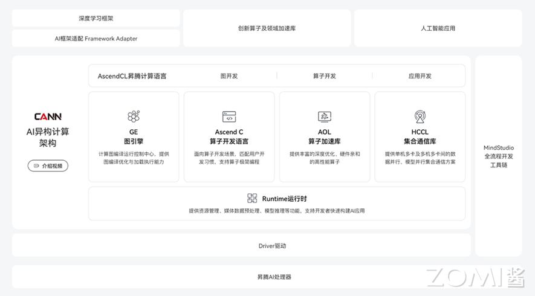
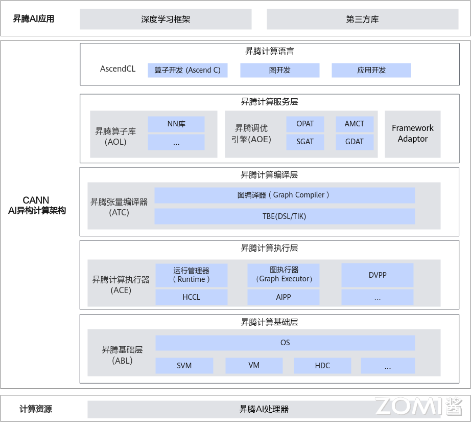
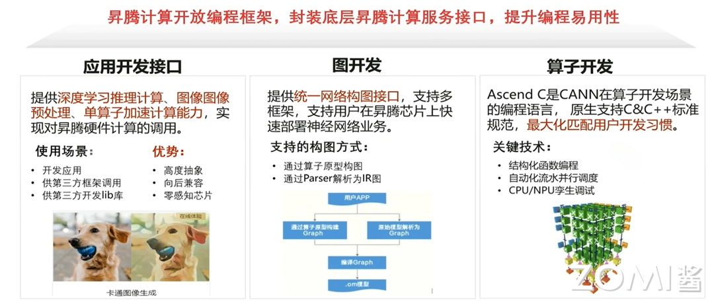
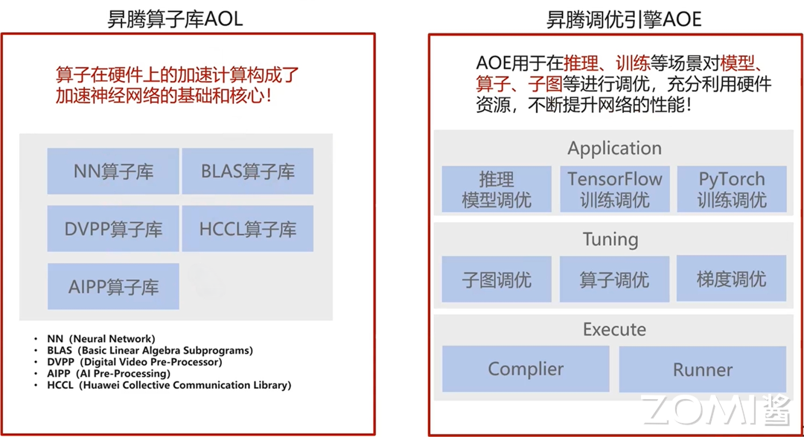
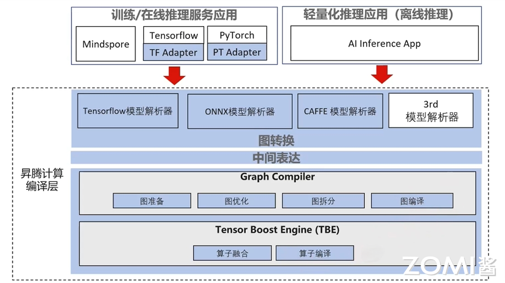
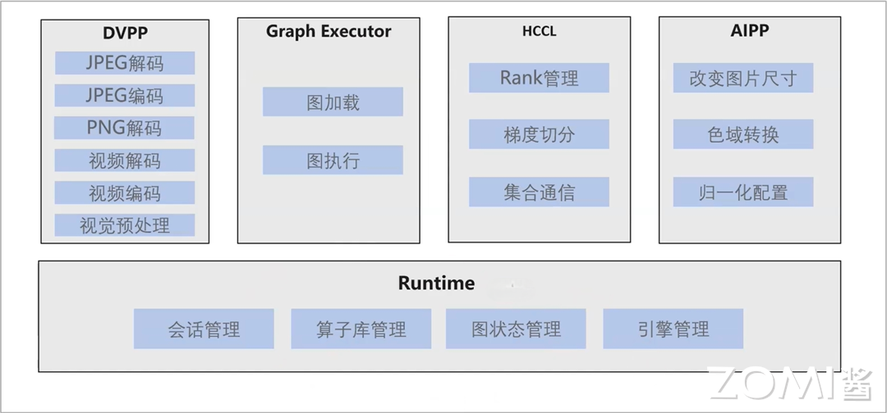
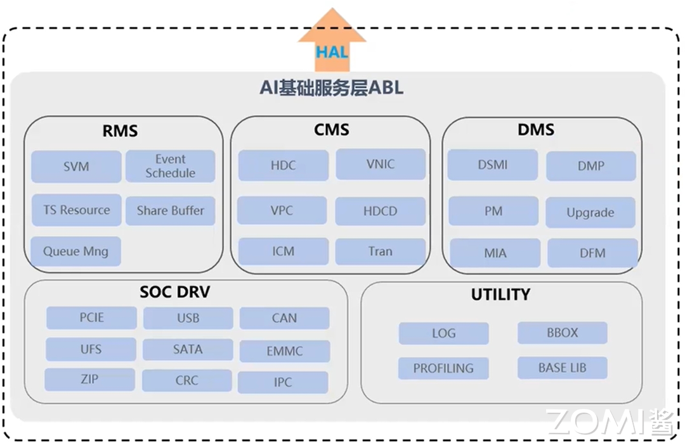

<!--适用于[License] (https://github.com/chenzomi12/AISystem/blob/main/LICENSE)版权许可-->

# 昇腾异构计算架构 CANN

本节将介绍昇腾 AI 异构计算架构 CANN（Compute Architecture for Neural Networks），这是一套为高性能神经网络计算需求专门设计和优化的架构。CANN 包括硬件层面的达·芬奇架构和软件层面的全栈支持，旨在提供强大的硬件基础和管理网络模型、计算流及数据流的软件栈，以支撑神经网络在异构处理器上的执行。

通过本节内容的学习，读者将能够理解 CANN 如何为深度学习提供全面的硬件和软件支持，以及如何通过其多层级架构实现高效的 AI 应用开发和性能优化。

## 总体架构

本节参考文献：《Ascend C 异构并行程序设计》——苏统华，杜鹏，闫长江，2024

昇腾 AI 异构计算架构（Compute Architecture for Neural Networks，CANN）是专门为高性能神经网络计算需求所设计和优化的一套架构。在硬件层面，昇腾 AI 处理器所包含的达·芬奇架构在硬件设计上进行计算资源的定制化设计，在功能实现上进行深度适配，为神经网络计算性能的提升提供了强大的硬件基础。在软件层面，CANN 所包含的软件栈则提供了管理网络模型、计算流以及数据流的功能，支撑起神经网络在异构处理器上的执行流程。

如下图所示，CANN 作为昇腾 AI 处理器的异构计算架构，支持业界多种主流的 AI 框架，包括 MindSpore、TensorFlow、PyTorch、Jittor 等。Ascend C 算子开发语言，开放全量低阶 API 接口使能开发者完成高性能自定义算子开发；开放高阶 API 接口，降低开发难度，开发者可快速实现复杂自定义算子开发。GE 图引擎（Graph Engine），包括图优化、图编译、图执行等，便于开发者使用，优化整网性能。HCCL 集合通信库（Huawei Collective Communication Library），可供开发者直接调用，改善网络拥塞，提升网络资源利用率和运维效率。AOL 算子加速库（Ascend Operator Library），提供基础算子和大模型融合算子 API 接口对外开放，供开发者直接调用，使能大模型极致性能优化。Runtime 运行时，将硬件资源（计算、通信、内存管理等）的 API 接口对外开放，满足开发者对模型开发、系统优化、第三方 AI 框架对接等不同场景诉求。

CANN 提供了功能强大、适配性好、可自定义开发的 AI 异构计算架构，自顶向下分为 5 部分。

昇腾计算语言（Ascend Computing Language，简称 AscendCL）：AscendCL 接口是昇腾计算开放编程框架，是对底层昇腾计算服务接口的封装。它提供设备（Device）管理、上下文（Context）管理、流（Stream）管理、内存管理、模型加载与执行、算子加载与执行、媒体数据处理、图（Graph）管理等 API 库，供用户开发 AI 应用。

昇腾计算服务层（Ascend Computing Service Layer）： 主要提供昇腾算子库 AOL（Ascend Operator Library），通用神经网络（Neural Network，NN）库、线性代数计算库（Basic Linear Algebra Subprograms，BLAS）等高性能算子加速计算；昇腾调优引擎 AOE（Ascend Optimization Engine），通过算子调优 OPAT、子图调优 SGAT、梯度调优 GDAT、模型压缩 AMCT 提升模型端到端运行速度。同时提供 AI 框架适配器 Framework Adaptor 用于兼容 TensorFlow、PyTorch 等主流 AI 框架。

昇腾计算编译层（Ascend Computing Compilation Layer）：昇腾计算编译层通过图编译器（Graph Compiler）将用户输入中间表达（Intermediate Representation，IR）的计算图编译成昇腾硬件可执行模型；同时借助张量加速引擎 TBE（Tensor Boost Engine）的自动调度机制，高效编译算子。

昇腾计算执行层（Ascend Computing Execution Layer）：负责模型和算子的执行，提供运行时库（Runtime）、图执行器（Graph Executor）、数字视觉预处理（Digital Vision Pre-Processing，DVPP）、 AI 预处理（Artificial Intelligence Pre-Processing，AIPP）、华为集合通信库（Huawei Collective Communication Library，HCCL）等功能单元。

昇腾计算基础层（Ascend Computing Base Layer）：主要为其上各层提供基础服务，如共享虚拟内存（Shared Virtual Memory，SVM）、设备虚拟化（Virtual Machine，VM）、主机-设备通信（Host Device Communication，HDC）等。

## 关键功能特性

### 推理应用开发

CANN 提供了在昇腾平台上开发神经网络应用的昇腾计算语言 AscendCL（Ascend Computing Language），提供运行资源管理、内存管理、模型加载与执行、算子加载与执行、媒体数据处理等 API，实现利用昇腾硬件计算资源、在昇腾 CANN 平台上进行深度学习推理计算、图形图像预处理、单算子加速计算等能力。简单来说，就是统一的 API 框架，实现对所有资源的调用。

### 模型训练

CANN 针对训练任务提供了完备的支持，针对 PyTorch、TensorFlow 等开源框架网络模型，CANN 提供了模型迁移工具，支持将其快速迁移到昇腾平台。此外，CANN 还提供了多种自动化调测工具，支持数据异常检测、融合异常检测、整网数据比对等，帮助开发者高效问题定位。

### 算子开发

CANN 提供了超过 1400 个硬件亲和的高性能算子，可覆盖主流 AI 框架的算子加速需求，同时，为满足开发者的算法创新需求，CANN 开放了自定义算子开发的能力，开发者可根据自身需求选择不同的算子开发方式。

### 特性与优点

1. 统一 APP 编程语言：提供一套标准的 AscendCL 编程接口，对应用程序开发者屏蔽底层多种芯片差异，提升用户 APP 编程易用性。

2. 统一的网络构图接口：提供了标准的昇腾计算 AIR，支持多宽广，支持用户在昇腾处理器上快速部署神经网络业务。

3. 高性能计算引擎及算子库：通过高性能编程引擎/执行引擎/调优引擎和预置高性能算子库，支持用户快速部署神经网络业务，降低部署成本并最大程度发挥昇腾计算能力。

4. 基础业务：驱动、虚拟化、媒体、集合通信等能力。

## CANN 各层面能力

CANN 包含许多硬件无关的优化，但是到 Low Level 优化层面，由于各家厂商芯片特点不同，每家芯片都存在一些硬件耦合的 Low Level 优化，CANN 也如此，通过 CANN，对上层保持用户使用界面的兼容和统一，尽可能让用户较少感知硬件差异，对下则根据不同代际芯片的特点提升能力。

### 昇腾计算语言

昇腾计算开放了编程框架，封装底层昇腾计算服务接口，提升编程易用性，该开放编程框架名字叫做 AscendCL（AscendCL Computing Language）。其中包含了三个部分：

1. 应用开发接口

该系列接口提供深度学习推理计算、图形图像预处理以及单算子调用及加速能力，通过这些能力实现对昇腾硬件计算的调用。该系列接口通常用于开发离线推理应用，或供第三方框架调用以及供第三方系统开发 lib 调用。

2. 图开发接口

该系列接口提供了统一的网络构图接口，支持多种框架调用，支持用户在昇腾 AI 处理器上快速部署神经网络业务。通过该系列接口可以支持基于算子原型进行构图，也可以利用 Parsar 进行神经网络解析输出 IR。

3. 算子开发接口

该系列接口有一个单独的名称——Ascend C。Ascend C 是 CANN 在算子开发场景为开发者提供的编程语言，原生支持 C&C++标准规范，最大化匹配用户的开发习惯。Ascend C 支持结构化的核函数编程，自动流水并行调度以及 CPU/NPU 孪生调试等特性。

### 昇腾计算服务层

昇腾计算服务层是基于底层框架封装出来的一些能力集合，包含一套完善的昇腾算子库（Ascend Operator Library，AOL）以及调优工具的集合——昇腾调优引擎（Ascend Optimize Engine，AOE）。算子库中包含了 NN（Neural Network）算子库，BLAS（Basic Linear Algebra Subprograms）算子库，DVPP（Digital Vision Pre-Processing）算子库，AIPP（AI Pre-Processing）算子库，HCCL（Huawei Collective Communication Library）算子库以及融合算子库等，支持单个算子直接调用，也支持将算子集成到框架中进行调用。

昇腾调优引擎用于在推理、训练等场景对模型、算子、子图等进行调优，充分利用硬件资源，不断提升网络的性能。支持整图调优，调度调优，以及分布式场景下通信梯度的调优。调优是门槛相对较高的一项开发活动，以算子调优为例，需要开发者了解诸如片内高速缓存大小、数据搬运逻辑、调度策略等，人工调优是一项耗时耗力的工作，昇腾调优引擎通过将一些常见调优手段、分析方法固化到工具中，使开发者只需通过调优工具对模型进行分析，生成知识库，再运行模型时性能将有一定程度的提升。

### 昇腾计算编译层

昇腾计算编译层包含对计算图的编译和对算子的编译。向上可以与各类 AI 框架对接，为其提供构图接口，并通过提供各类解析器解析框架的计算图（比如 TensorFlow Parser）。解析好的 IR 在图编译阶段做一些计算无关的优化，如图准备（形状推导，常量折叠，死边消除等等），图优化（图融合、图切分、流水执行、缓存复用、算子引擎选择、cost model 建立等）、图编译（整图内存复用、连续内存分配、Task 生成等）。算子编译阶段负责 UB（Unified Buffer）融合，CCE-C 代码生成等。

### 昇腾计算执行层

包括 DVPP、Graph Executor、HCCL、AIPP 以及 Runtime 等组件。其中 Runtime 包含了对执行流管理、上下文管理、事件管理、任务管理以及其他资源申请及管理等能力。Graph Executor 中包含对计算图的加载和执行能力。HCCL 则包含对子通信域的管理，Rank 管理、梯度切分、集合通信等能力。DVPP 和 AIPP 则在两种不同维度上对数据做预处理操作。

### 昇腾计算基础层

昇腾计算基础层包含于驱动和 OS 相关的基础能力，包括资源管理（Resource Management Service，RMS）、通信管理（Communication Management Service，CMS）、设备管理（Device Management Service，DMS）、驱动（Driver，DRV）、公共服务（Utility）等组件。

其中 RMS 负责管理与调度昇腾设备的计算、Device 内存等关键资源；CMS 负责提供片内、片间高效通信；DMS 负责对昇腾设备进行配置、切分、升级、故障检测等管理；DRV 负责使能硬件；UTILITY 负责提供基础库和系统维测能力。

昇腾计算基础层提供的关键竞争力包括：

1. 高性能：微秒级确定性调度，数据零拷贝登记书打造高性能数据面；

2. 高可信：五道安全防线构建昇腾解决方案可信底座；

3. 归一化：一套架构-接口-代码支持多芯、多板、多场景；

4. 弹性：端/边/云灵活适应，虚机/容器/裸金属快速部署，算力细粒度按需切分。

## 小结与思考

- 昇腾 AI 异构计算架构 CANN：专为神经网络设计的硬件和软件架构，提供定制化计算资源和深度适配，支持多种 AI 框架和算子开发。

- CANN 的多层级架构：包含 AscendCL、Ascend Computing Service Layer、Ascend Computing Compilation Layer、Ascend Computing Execution Layer 和 Ascend Computing Base Layer，提供从应用开发到硬件资源管理的全面支持。

- CANN 的关键功能特性：包括统一编程语言、网络构图接口、高性能计算引擎、算子库和基础业务支持，以及硬件无关优化和芯片特定优化，以提升性能和易用性。