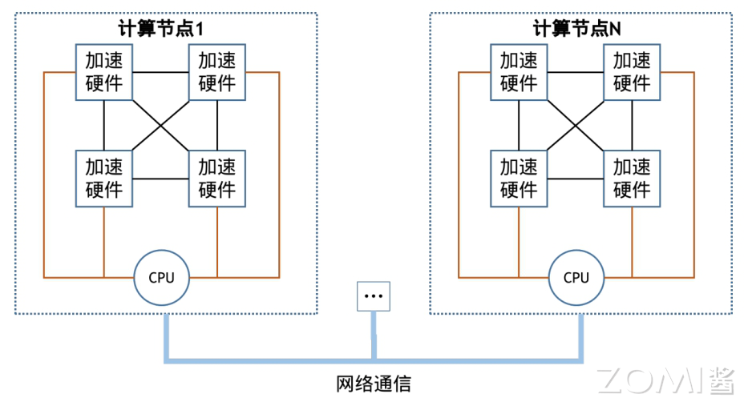
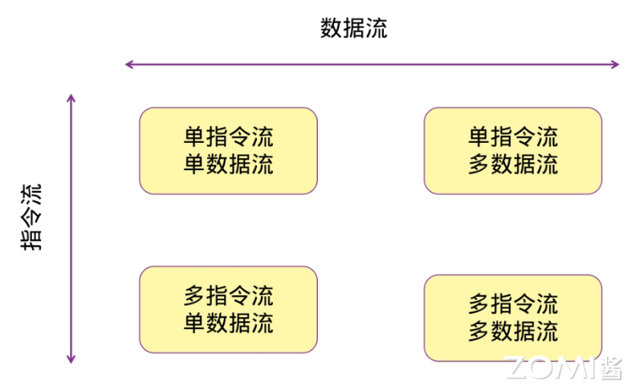
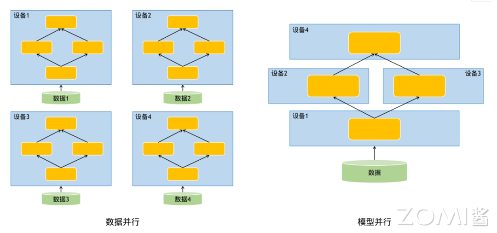
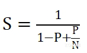
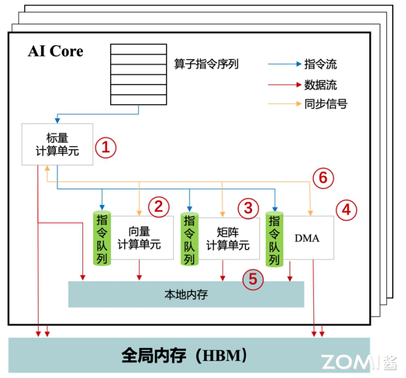
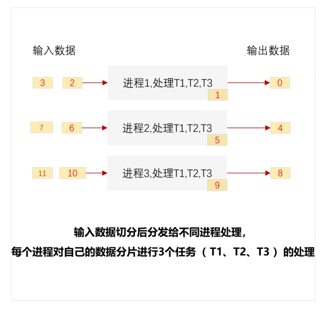
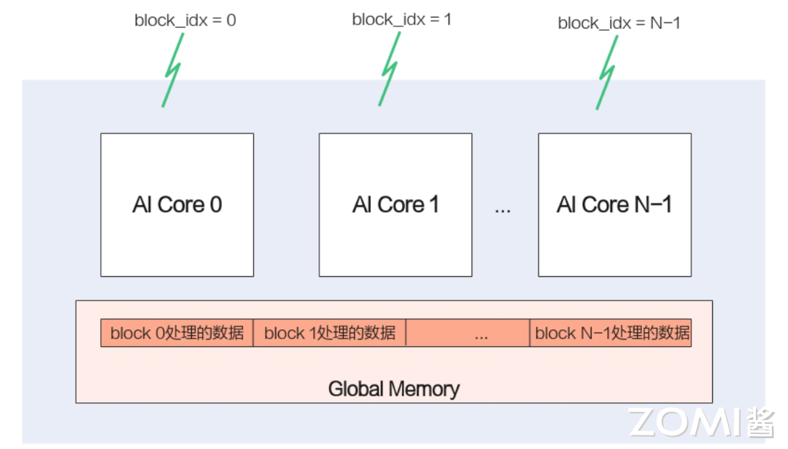
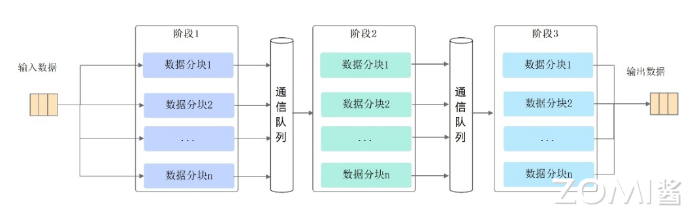
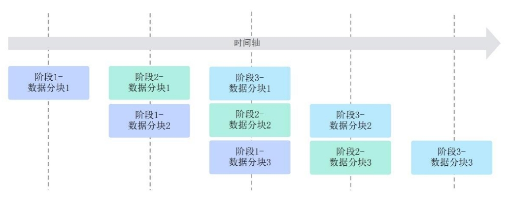

<!--适用于[License] (https://github.com/chenzomi12/AISystem/blob/main/LICENSE)版权许可-->

# 昇腾算子开发编程语言Ascend C

本节将深入探讨昇腾算子开发编程语言Ascend C，这是一种专为昇腾AI处理器算子开发设计的编程语言，它原生支持C和C++标准规范，最大化匹配用户的开发习惯。Ascend C通过多层接口抽象、自动并行计算、孪生调试等关键技术，极大提高算子开发效率，助力AI开发者低成本完成算子开发和模型调优部署。

通过本节内容的学习，读者将能够理解Ascend C编程语言的核心概念、编程模型和优势，以及如何利用这些工具提高AI算子的开发效率和性能。

本节参考文献：《Ascend C异构并行程序设计》——苏统华，杜鹏，闫长江，2024

## 并行计算基本原理

并行计算是一种计算模式，它涉及同时执行多个计算任务或同时执行多个进程。串行计算是按顺序执行一个任务，然后再执行下一个任务。与串行计算不同，并行计算是多个任务或进程可以同时执行，以提高整体计算性能和效率。
并行计算可以在多个硬件处理单元（如多个处理器、多个加速硬件、多个计算节点等）上同时执行任务，如下图所示。加速硬件既可以是前述的昇腾AI处理器，也可以是GPU、TPU和FPGA等设备。并行硬件有助于处理大规模的计算密集型问题，加快计算速度，提高系统的吞吐量。并行计算可以应用于各种领域，包括科学研究、工程设计、图形处理、数据分析等。

本节将首先对并行体系结构进行分类，然后介绍大模型并行加速基础原理，最后为了分析并行计算性能介绍并行效率相关量化原理。

### 并行体系结构分类

从计算机硬件、系统以及应用三个层面，大致包含三类并行体系结构，分别是指令级并行、线程级并行以及请求级并行。

**指令级并行(Instruction-Level Parallelism，ILP)**是指在处理器内部多个机器指令能够在同一时钟周期执行。这种并行性不需要程序员手动优化代码，可由处理器自身的硬件来管理。有几种技术可以用来提升指令级并行：
- **超标量架构（Superscalar）**：允许每个时钟周期发射多条指令到不同的执行单元。它们具备多个执行单元，如整数运算、浮点运算、加载/存储等，可以同时执行多个操作。
- **流水线（Pipelining）**：将指令分解为小步骤，每个步骤由不同的处理器部件顺序完成，一个指令的各个阶段可以与其他指令的阶段重叠，从而同一时刻有多个指令处于不同的执行阶段。例如，一个典型的四段流水线包括取指(IF)、译码(ID)、执行(EXE)、写回(WB)等阶段。

**线程级并行(Thread-Level Parallelism，TLP)**是通过创建多个线程来实现并行计算。在多核和多处理器系统中，这些线程可以真正并行地运行在不同的处理器或核心上。线程级并行常见于操作系统、数据库系统以及服务端应用等领域，并且通常需要程序员显式地通过编程来创建和管理线程。

**请求级并行(Request-Level Parallelism，RLP)**通常出现在应用服务中，比如当多个独立的客户端发送请求到服务器时，服务器会创建不同的处理流程来同时处理这些请求。每个请求可能涉及到不同的资源和计算路径，因此可以并行处理，从而提高各种服务的执行能力和响应速度。

从软件设计和编程模型的角度来看，并行体系结构可划分成数据级并行和任务级并行。

**数据级并行(Data-Level Parallelism)**是指将较大数据块分割成较小的块，然后在多个处理单元上并行处理这些数据块。每个处理单元上运行相同的操作，但作用于不同的数据片段上。数据并行特别适合数组、向量和矩阵等数据结构，常在科学计算和图像处理等领域中使用。
**任务级并行(Task-Level Parallelism)**涉及将工作分解成独立的任务，这些任务可以同时在不同的处理单元上执行。这些任务可能互相依赖也可能完全独立，任务并行通常需要程序员设计能够有效利用并行硬件特性的算法和程序结构，比如在软件工程、复杂事件处理和多媒体应用中广泛使用。

关于数据级并行和任务级并行，我们可以用一个大型企业发工资的例子来进行形象理解。假设一个大型企业每个月需要发放数百万名员工的工资。从数据级并行的角度看，全部员工的工资计算过程会被分割成小块，每块包含一部分员工的工资数据。然后将这些数据块发送到不同的处理器上。每个处理器执行完全相同的计算任务，但仅处理其分配到的数据块，例如处理器A负责计算员工列表1～1000的工资，处理器B负责计算员工列表1001～2000的工资，以此类推。每个处理器都会独立完成工资计算，包括税务扣除、福利计算等，并最终生成各自负责的员工工资条。而从任务级并行的角度看，各个处理器可能负责不同的计算任务，例如处理器A负责计算所有员工的税务扣除，处理器B负责计算所有员工的福利待遇等等。在这种情况下，每个处理器同时读取全部的工资数据集，但仅对数据执行其特定的任务，最后，所有处理器的输出将被合并以生成最终的工资条。
此外，迈克尔·费林（Michael Flynn）于1972年提出了费林分类法。该分类法根据计算机体系结构中指令流和数据流的组织方式，将计算机系统划分为下图所示的四类。

- **单指令流单数据流**：顺序执行一串指令，每个指令作用于单个数据元素上。这类系统代表了单处理器系统，任何时刻只有一条指令在执行，并且该指令只操作一份数据。大多数早期的计算机和现代的非并行处理器都遵循单指令流单数据流**（Single Instruction Stream, Single Data Stream，SISD）**架构。
- **单指令流多数据流**：允许不同处理器同时对多个数据元素执行同一条指令操作。这类体系结构适合于数据并行任务，比如图像和视频处理、矩阵运算等，它们可以在多个处理单元上同时执行相同的操作序列。向量处理器和图形处理单元（GPU）可以归结到单指令流多数据流**（Single Instruction Stream，Multiple Data Stream, SIMD）**架构范畴之下。

- **多指令流单数据流**：多指令流单数据流**（Multiple Instruction Stream, Single Data Stream，MISD）**同一时间有多条指令操作同一个数据流。这一类相较其他类别而言实际应用较少，因为它们的使用场景相对特殊。一个理论上的例子是容错计算，即多个处理单元可以对相同的数据执行不同的操作以检测错误。

- **多指令流多数据流**：支持多个独立的指令流，每个都操作不同的数据流。这意味着每个处理器可以执行不同的任务，针对不同的数据集。超标量体系结构的处理器、大多数现代的多核和多处理器系统都属于多指令流多数据流 **（Multiple Instruction Stream, Multiple Data Stream，MIMD）**架构，另外昇腾 AI 处理器的向量计算单元与矩阵计算单元也可以视为MIMD架构。这使得它们非常适合执行需要复杂任务协调的问题，比如服务器处理多个用户请求，或者超级计算机执行科学模拟。

费林分类法在简化并行计算理解方面很有帮助，但GPU和众核处理器的出现以及异构计算的流行，这种分类已经不能完全覆盖所有类型的并行计算模式，因而引入了更加复杂的并行处理模式。例如**单程序多数据 (Single Program Multiple Data, SPMD)**，它在SIMD基础上做了扩展。SPMD属于并行计算的编程模型，当硬件的各处理器有自己独立控制部件时，可通过软件编程让各处理器并行地执行同一个程序，但每个处理器处理不同的数据，Ascend C就是基于昇腾AI Core形成了SPMD编程模型。

### 大模型并行原理

随着深度学习技术的快速进步，模型的规模和复杂性正以前所未有的速度增长。语言大模型（LLM）与视觉大模型（VLM）在提升任务性能方面取得了显著成果，但同时也遇到了计算上的巨大挑战。例如OpenAI 推出的自然语言处理领域大模型ChatGPT拥有1750亿个参数。传统的单机训练方法在处理这些庞大模型时遇到了内存限制、计算速度过慢和训练时间过长等不可逾越的问题。为了解决这些瓶颈，大规模并行计算技术成为了提高大规模模型训练效率和性能的关键。这里阐述的大模型并行加速策略结合Ascend C算子开发语言是华为昇腾大模型解决方案的基石。

目前针对AI大模型的并行化训练主要常用两类并行方式：数据并行和模型并行。下图显示了数据并行和模型并行的基本思想。

数据并行通过将大规模的数据集划分为多个批次（batch），分配给不同的计算节点并行处理。具体来说，每个计算节点都有一个模型副本，它们独立地执行前向和后向传播，并计算出梯度。之后，所有的计算节点通过通信协议交换梯度信息并进行汇总。最终，通过聚合得到的全局梯度来更新模型参数，确保所有节点上的模型副本保持同步。数据并行使得模型训练可以扩展到更多的数据和计算资源，从而加速训练过程。

模型并行是当单个模型太大而无法放入单个计算节点的内存时，将模型的不同部分（如不同的层或子网络）分布到不同的节点上。在模型并行中，各个分布式节点负责模型的一部分计算，并可能需要频繁地进行跨节点通信以同步中间状态和梯度信息。这种方式允许处理更大的模型，但由于通信开销较大，因此如何设计和优化模型的分割和通信策略就显得尤为重要。

在模型并行中存在一种特殊的形式，即张量并行，它专注于模型中单个层的并行。例如，对于一个巨大的矩阵乘法操作，张量并行会将矩阵分割成更小的块，并在不同的计算节点上执行这些较小规模的乘法操作。这要求跨节点协调执行和数据交换，以完成整个层的运算。张量并行常用于全连接层、卷积层等参数量大的层，它可以减少单个节点所需处理的参数数量，从而克服内存限制问题。

### 并行效率量化原理

> 阿姆达尔定律（Amdahl's Law）由吉恩·阿姆达尔在1967年提出。它用于估计程序在并行化后的理论性能提升。该定律指出，一个程序的加速比上限受到其串行部分比例的限制。阿姆达尔定律的公式可以表述为如下公式：

其中，加速比S表示加速后总体性能的提升倍数，是程序中可以并行化的代码部分所占的比例（介于0和1之间），是用于并行处理的处理器数量。

阿姆达尔定律的核心观点是，并行计算的最大性能提升受限于程序中无法并行化的部分。根据上述公式，即使并行部分的速度被无限加速（即N） ，总体加速比S也永远不会超过。因此，如果一个程序有10%的代码是串行的（=0.9），那么即使在无限多的处理器上运行，最大加速比也只能达到10倍，因为串行部分的执行时间成了瓶颈。

阿姆达尔定律强调了优化程序性能的一个重要策略，即尽可能增加程序的可并行化比例。同时它也揭示了并行计算面临的挑战，特别是对于那些难以大幅度并行化的应用或算法。实际应用中，程序员和系统设计师会使用阿姆达尔定律来评估并行化的潜在价值以及决定在硬件和软件层面需要投入多少资源进行并行优化。

## Ascend C 编程体系

算子是编程和数学中的重要概念，它们是用于执行特定操作的符号或函数，以便处理输入值并生成输出值。一元算子通过对单个操作数进行操作，如取反或递增，而二元算子对两个操作数执行操作，例如加法或赋值。关系算子用于比较值之间的关系，逻辑算子用于在逻辑表达式中组合条件。位运算符操作二进制位，而赋值算子将值分配给变量。算子在编程语言中定义了基本操作，而在数学中，它们描述了对数学对象的操作，如微积分中的导数和积分算子。算子的理解对于正确理解和编写代码以及解决数学问题至关重要。

面向算子开发场景的编程语言Ascend C，原生支持C和C++标准规范，最大化匹配用户开发习惯；通过多层接口抽象、自动并行计算、孪生调试等关键技术，极大提高算子开发效率，助力AI开发者低成本完成算子开发和模型调优部署。

使用Ascend C进行自定义算子开发的突出优势有：

- C/C++原语编程
- 编程模型屏蔽硬件差异，编程范式提高开发效率
- 类库API封装，从简单到灵活，兼顾易用与高效
- 孪生调试，CPU侧模拟NPU侧的行为，可优先在CPU侧调试

### Ascend C的编程模型

AI Core是昇腾AI处理器执行计算密集型任务的真正算力担当。本节将首先介绍AI Core的硬件抽象，介绍其中的计算、存储和DMA搬运单元。随后，将介绍SPMD模型和流水线编程范式，两者可以有效提高使用Ascend C开发算子的并行执行效率，实现更高加速比的计算任务。

#### AI Core硬件抽象

使用Ascend C编程语言开发的算子运行在AI Core上，AI Core是昇腾AI处理器中的计算核心。一个AI处理器内部有多个AI Core，AI Core中包含计算单元、存储单元、搬运单元、控制单元等核心部件。为了屏蔽不同 AI Core硬件资源上可能存在的差异性，进行硬件的统一抽象表示，如下图所示。

计算单元包括了三种基础计算资源：矩阵计算单元、向量计算单元和标量计算单元。存储单元即为AI Core的内部存储，统称为本地内存（Local Memory），与此相对应，AI Core的外部存储称之为全局内存（Global Memory）。DMA搬运单元负责在全局内存和本地内存之间搬运数据。

AI Core内部的异步并行计算过程：标量计算单元读取指令序列，并把向量计算、矩阵计算、数据搬运指令发射给对应单元的指令队列，向量计算单元、矩阵计算单元、数据搬运单元异步地并行执行接收到的指令。该过程可以参考上图中蓝色箭头所示的指令流。
不同的指令间有可能存在依赖关系，为了保证不同指令队列间的指令按照正确的逻辑关系执行，Scalar计算单元也会给对应单元下发同步指令。各单元之间的同步过程可以参考上图中的绿色箭头所示的同步信号流。

AI Core内部数据处理的基本过程：DMA搬入单元把数据搬运到Local Memory，Vector/Cube计算单元完成数据计算，并把计算结果写回Local Memory，DMA搬出单元把处理好的数据搬运回Global Memory。该过程可以参考上图中的红色箭头所示的数据流。

#### SPMD编程模型

SPMD（Single-Program Multiple-Data）数据并行是典型的并行计算方法。其原理如下：假设从输入数据到输出数据需要经过3个阶段任务的处理（T1、T2、T3）。如下图所示，SPMD会启动一组进程，并行处理待处理的数据。对待处理数据切分，把切分后数据分片分发给不同进程处理，每个进程对自己的数据分片进行3个任务的处理。

Ascend C算子编程是SPMD编程，具体到Ascend C编程模型中的应用，是将需要处理的数据拆分并同时在多个计算核心上运行，从而获取更高的性能。多个AI Core共享相同的指令代码，每个核上的运行实例唯一的区别是block_idx不同，每个核通过不同的block_idx来识别自己的身份。block的概念类似于上文介绍SPMD中进程的概念，其与物理概念上芯片中固定的核数是不同的，可以自行定义设置，block_idx就是标识进程唯一性的进程ID。一般而言，为了充分利用计算资源，block数量设置为物理核数的整数倍。并行计算过程的示意图如下图所示。

#### 流水线编程范式

在计算机编程方法中，做到软件与硬件的结合对性能提升有很大帮助，其中很关键的一点是在代码流执行过程中让所有计算资源（硬件）都处于高占用率状态并进行有效的运算，从而让所有计算资源都得到有效的运用，不会出现长时间空闲的情况。将程序流水化则是达到上述效果最好的方法，把完整的任务进行模块化处理，多个模块之间形成流水关系，并使用队列来处理不同模块之间的异步并行。

Ascend C编程范式是一种流水线式的编程范式，把算子核内的处理程序，分成多个流水任务，通过队列（TQue）完成任务间通信和同步，并通过统一的内存管理模块（TPipe）管理任务间通信内存。流水编程范式的关键是流水任务设计。流水任务指的是单核处理程序中主程序调度的并行任务。在核函数内部，可以通过流水任务实现数据的并行处理，进一步提升性能。下面举例来说明，流水任务如何进行并行调度。以下图为例，单核处理程序的功能被拆分成3个流水任务：阶段1、阶段2、阶段3，每个任务专注于完成单一功能；需要处理的数据被切分成n片，使用数据分块1~n表示，每个任务需要依次完成n个数据切片的处理。阶段间的箭头表达数据间的依赖关系，比如阶段1处理完数据分块1之后，阶段2才能对数据分块1进行处理。

若n=3，即待处理的数据被切分成3片，则上图中的流水任务运行起来的示意图如下图。从运行图中可以看出，对于同一片数据，阶段1、阶段2、阶段3之间的处理具有依赖关系，需要串行处理；不同的数据切片，同一时间点，可以有多个任务在并行处理，由此达到任务并行、提升性能的目的。

Ascend C编程提供了一种通信队列实现各阶段间的数据通信与同步，其被称为TQue。TQue的分类大致有两种，分别是VECIN和VECOUT，对应计算前后数据的搬入和搬出。以向量算子为例，则阶段1为数据搬入阶段，阶段2为向量计算阶段，阶段3为数据搬出阶段，三者调用不同的芯片内单元，从而实现异步并行。对于特定的一块数据分块，在阶段1的最后，数据被放入VECIN队列中，随后在阶段2被取出，执行相关操作后放入VECOUT队列，最后在阶段3被从VECOUT队列中取出并搬出。由于不同算子需求的不同，每个数据分块需要经过的阶段数量和内容也有所差异。

## 小结与思考

- 并行计算基本原理：并行计算通过在多个硬件处理单元上同时执行任务来提升计算性能和效率，涵盖指令级并行（ILP）、线程级并行（TLP）和请求级并行（RLP），以及数据级并行和任务级并行，适用于多种领域如科学研究和工程设计。

- 并行体系结构与大模型加速：并行体系结构可分为ILP、TLP、RLP等类型，支持数据并行和模型并行以应对AI大模型的计算挑战，通过切分数据或模型来提升训练效率和处理能力。

- Ascend C编程语言：Ascend C是为昇腾AI处理器算子开发设计的编程语言，支持C/C++标准，提供SPMD编程模型和流水线编程范式，通过多层接口抽象和自动并行计算提高开发效率，助力AI开发者高效完成算子开发和模型调优。