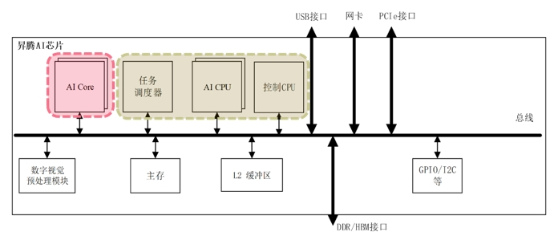

<!--适用于[License] (https://github.com/chenzomi12/AISystem/blob/main/LICENSE)版权许可-->

# CANN 算子类型

算子是编程和数学中的重要概念，它们是用于执行特定操作的符号或函数，以便处理输入值并生成输出值。本节将会介绍 CANN 算子类型及其在 AI 编程和神经网络中的应用，以及华为 CANN 算子在 AI CPU 的详细架构和开发要求。

## 算子基本介绍

一元算子通过对单个操作数进行操作，如取反或递增，而二元算子对两个操作数执行操作，例如加法或赋值。关系算子用于比较值之间的关系，逻辑算子用于在逻辑表达式中组合条件。位运算符操作二进制位，而赋值算子将值分配给变量。

算子在编程语言中定义了基本操作，而在数学中，它们描述了对数学对象的操作，如微积分中的导数和积分算子。算子的理解对于正确理解和编写代码以及解决数学问题至关重要。

在神经网络中，算子通常代表计算图中的张量处理节点，如卷积算子，全连接算子，激活算子等，这些算子无一例外地接受张量（及配置信息）作为输入，输出对张量的处理结果。

> 要注意，并非所有算子都具备完整的数学含义或数学表达，如调整数据排布格式的算子、数据类型转换的算子、广播与归纳类算子等等，属于纯编程操作，并无十分具体的数学含义。

在面向神经网络做优化的工作中，算子的开发与优化是一项较为重要的任务，许多新发明的神经网络或算法通常包含着新的算子的设计；另外，为了使这些算子达到最大的性能指标，算子的实现通常还要与具体的硬件平台相结合，同样一项算子操作（如卷积），在 CPU、GPU、NPU、TPU 上的实现存在着千差万别。

同一张神经网络中，不同算子适合运行的硬件平台也不尽相同，如在经典的 Host-Device 结构中，大部分涉及大量矩阵/向量计算的算子均适合放在专用计算内核上实施计算，但也不排除某些算子有过多分支、上下文切换等操作，适合放在 CPU 性质的设备上进行计算，下面将重点讨论这个话题。

## CANN 算子体系

CANN 是华为针对 AI 场景推出的异构计算架构，对上支持多种 AI 框架，对下服务 AI 处理器与编程，发挥承上启下的关键作用，是提升昇腾 AI 处理器计算效率的关键平台。而 CANN 算子又包括两类，分别是 AI Core 算子和 AI CPU 算子。与算子名称相符，两种算子分别执行在昇腾 AI 处理器的 AI Core 和 AI CPU 上，昇腾 AI 处理器中 AI Core 与 AI CPU 的相互关联如下图所示：

其中，AI Core 是昇腾 AI 处理器的计算核心，负责执行矩阵、向量、标量计算密集的算子任务；AI CPU 负责执行不适合在 AI Core 上运行的算子任务，即非矩阵类复杂计算。

大多数场景下的算子开发均为针对 AI Core 的算子开发任务，然而昇腾框架并非只能进行 AI Core 算子开发，也可以进行 AI CPU 算子开发。AI CPU 负责执行昇腾 AI 处理器的 CPU 类算子（包括控制算子、标量和向量等通用计算）。

### AI CPU 算子涉及组件

AI CPU 算子编译执行所涉及组件如下：

- GE（Graph Engine）：Graph Engine 是基于昇腾 AI 软件栈对不同的机器学习框架提供统一的 IR 接口，对接上层网络模型框架，例如 Tensorflow、PyTorch 等，GE 的主要功能包括图准备、图拆分、图优化、图编译、图加载、图执行和图管理等（此处图指网络模型拓扑图）。

- AI CPU Engine：AI CPU 子图编译引擎，负责对接 GE，提供 AI CPU 算子信息库，进行算子注册、算子内存需求计算、子图优化和 Task 生成的能力。

- AI CPU Schedule：AI CPU 的模型调度器，与 Task Schedule 配合完成 NN 模型的调度和执行。

- AI CPU Processor：AI CPU 的 Task 执行器，完成算子运算。AI CPU Processor 包含算子实现库，算子实现库完成 AI CPU 算子的执行实现。

- Data Processor：训练场景下，用于进行训练样本的数据预处理。

### AI CPU 适用场景

在以下三种场景下，可以使用 AI CPU 的方式实现自定义算子：

- 场景一：不适合跑在 AI Core 上的算子，例如非矩阵类的复杂计算，逻辑比较复杂的分支密集型算子等；例如离散数据类的计算，资源管理类的计算，依赖随机数生成类的计算。

- 场景二：AI Core 不支持的算子，例如算子需要某些数据类型，但 AI Core 不支持；例如 Complex32、Complex64。

- 场景三：某些场景下，为了快速打通模型执行流程，在 AI Core 算子实现较为困难的情况下，可通过自定义 AI CPU 算子进行功能调测，提升调测效率；功能调通之后，后续性能调测过程中再将 AI CPU 自定义算子转换为 AI Core 算子实现。

### AI CPU 开发要求

针对 AI CPU 算子，CANN 未提供封装的计算接口，完全是由 C++语言进行计算逻辑的实现。但 AI CPU 算子的实现有如下三步的基本要求。

- 第一步，自定义算子的类需要为 CpuKernel 类的派生类，并且需要在命名空间“aicpu”中进行类的声明和实现。AI CPU 提供了算子的基类“CpuKernel”，“CpuKernel” 提供了算子计算函数的定义。

- 第二步，实现算子类“xxxCpuKernel”中的 Compute 函数，即实现算子的计算逻辑。

- 第三步，算子计算逻辑实现结束后，用“REGISTER_CPU_KERNEL(算子类型，算子类名) ”进行算子的注册。

## 小结与思考

- 算子是编程和数学中用于处理输入值并生成输出值的函数或符号，包括一元和二元算子、关系和逻辑算子、位运算符和赋值算子。

- 在神经网络中，算子代表计算图中的张量处理节点，如卷积和激活算子，它们接受张量输入并输出处理结果，且算子开发与优化对性能提升至关重要。

- CANN 是华为推出的 AI 异构计算架构，包括 AI Core 算子和 AI CPU 算子，分别在昇腾 AI 处理器的不同部分执行，而 AI CPU 算子开发要求使用 C++实现计算逻辑并进行注册。

## 其他

- 更多 Ascend C 相关内容，请参考昇腾社区文档：https://www.hiascend.com/zh/document

- 本节参考文献《Ascend C 异构并行程序设计》——苏统华，杜鹏，闫长江，2024
