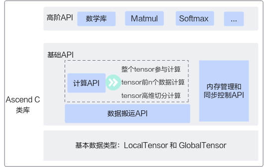
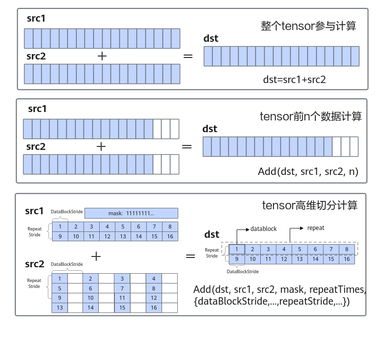
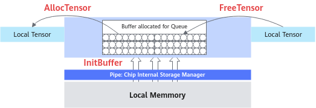

<!--适用于[License] (https://github.com/chenzomi12/AISystem/blob/main/LICENSE)版权许可-->

# Ascend C 语法扩展

Ascend C 的本质构成其实是标准 C++加上一组扩展的语法和 API。本节首先对 Ascend C 的基础语法扩展进行简要介绍，随后讨论 Ascend C 的两种 API——基础 API 和高阶 API。

接下来针对 Ascend C 的几种关键编程对象——数据存储、任务间通信与同步，资源管理以及临时变量进行详细解读，为后续讲解 Ascend C 的编程范式打下理论基础。

## 语法扩展概述

Ascend C 采用华为自研的毕昇编译器，设备侧编程采用 C/C++语法扩展允许函数执行空间和地址空间作为合法的类型限定符，提供在主机（Host）侧和设备（Device）侧独立执行的能力，同时提供针对不同地址空间的访问能力。

### 函数执行限定符

函数执行空间限定符指示函数是在主机上执行还是在设备上执行，以及它是否可从主机或设备调用。主要有以下三种声明方式：

- 首先是`__global__`执行空间限定符。它声明一个 kernel 函数（Ascend C 算子的入口函数，后文会详细介绍），具有如下性质：

	1.  在设备上执行；
	2. 只能被主机侧函数调用；
	3. `__global__`只是表示这是设备侧函数的入口，并不表示具体的设备类型；
	4. 一个`__global__`函数必须返回 void 类型，并且不能是 class 的成员函数；
	5. 主机侧调用`__global__`函数必须使用<<<>>>（内核调用符）异构调用语法；
	6. `__global__`的调用是异步的，意味着函数返回，并不表示 kernel 函数在设备侧已经执行完成，如果需要同步，须使用运行时提供的同步接口显式同步，如`aclrtSynchronizeStream(…)`。

- 第二类是`__aicore__`执行空间限定符。它声明的函数，具有如下属性。

	1. 在 AI Core 设备上执行；
	2. 只能被`__global__`函数，或者其他 AI Core 函数调用。

- 第三类是`__host__`执行空间限定符。它声明的函数（通常不显示声明）具有如下属性。

	1. 只能在主机侧执行；
	2. 只能被主机侧函数调用；
	3. `__global__`和`__host__`不能一起使用。

典型使用函数执行空间限定符的示例：

```
//定义 aicore 函数
__aicore__ void bar() {}

// 定义核函数
__global__ __aicore__ void foo() { bar();}

//定义 Host 函数
int () {}
```

### 地址空间限定符

地址空间限定符可以在变量声明中使用，用于指定对象分配的区域。AI Core 具备多级独立片上存储，各个地址空间独立编址，具备各自的访存指令。如果对象的类型被地址空间名称限定，那么该对象将被分配在指定的地址空间中。同样地，对于指针，指向的类型可以通过地址空间进行限定，以指示所指向的对象所在的地址空间。

**private 地址空间**：private 地址空间是大多数变量的默认地址空间，特别是局部变量，代码中不显示标识所在局部地址空间类型。

**`__g'm__`地址空间**：`__gm__`地址空间限定符用来表示分配于设备侧全局内存的对象，全局内存对象可以声明为标量、用户自定义结构体的指针。

## Ascend C API 概述

Ascend C 算子采用标准 C++ 语法和一组编程类库 API 进行编程，可以根据自己的需求选择合适的 API。Ascend C 编程类库 API 示意图如下图所示，Ascend C API 的操作数都是 Tensor 类型：`GlobalTensor`（外部数据存储空间）和 `LocalTensor`（核上内存空间）；类库 API 分为高阶 API 和基础 API。



### 基础 API

实现基础功能的 API，包括计算类、数据搬运、内存管理和任务同步等。使用基础 API 自由度更高，可以通过 API 组合实现自己的算子逻辑。基础 API 是对计算能力的表达。

1. 基础 API 分类

- **计算类 API**：包括标量计算 API、向量计算 API、矩阵计算 API，分别实现调用标量计算单元、向量计算单元、矩阵计算单元执行计算的功能。

- **数据搬运 API**：计算 API 基于本地内存（Local Memory）数据进行计算，所以数据需要先从全局内存（Global Memory）搬运至本地内存，再使用计算接口完成计算，最后从本地内存搬出至全局内存。执行搬运过程的接口称之为数据搬运接口，比如 DataCopy 接口。

- **内存管理 API**：用于分配板上管理内存，比如 AllocTensor、FreeTensor 接口。这个 API 的出现是由于板上内存较小，通常无法存储完整数据，因此采用动态内存的方式进行内存管理，实现板上内存的复用。

- **任务同步 API**：完成任务间的通信和同步，比如 EnQue、DeQue 接口。不同的 API 指令间有可能存在依赖关系，不同的指令异步并行执行，为了保证不同指令队列间的指令按照正确的逻辑关系执行，需要向不同的组件发送同步指令。任务同步类 API 内部即完成这个发送同步指令的过程，开发者无需关注内部实现逻辑，使用简单的 API 接口即可完成。

2. 基础 API 计算方式

对于基础 API 中的计算 API，根据对数据操作方法的不同，分为下表所示的几种计算方式：

| 命名                | 说明                                                         |
| ------------------- | ------------------------------------------------------------ |
| 整个 Tensor 参与计算  | 整个 Tensor 参与计算：通过运算符重载的方式实现，支持+, -, *, /, \|, &, <, >, <=,  >=, ==, !=，实现计算的简化表达。例如：dst=src1+src2 |
| Tensor 前 n 个数据计算 | Tensor 前 n 个数据计算：针对源操作数的连续 n 个数据进行计算并连续写入目的操作数，解决一维 Tensor 的连续计算问题。例如：Add(dst, src1, src2, n); |
| Tensor 高维切分计算  | 功能灵活的计算 API，充分发挥硬件优势，支持对每个操作数的 Repeat  times（迭代的次数）、  Block stride（单次迭代内不同 block 间地址步长）、Repeat stride（相邻迭代间相同 block 的地址步长）、Mask（用于控制参与运算的计算单元）的操作。 |

下图以向量加法计算为例，展示了不同级别向量计算类 API 的特点。从图中我们可以初步看出，Tensor 高维切分计算操作单元最小，可以针对不同步长实现最为细致的操作，针对 Tensor 高维切分计算更加细致的介绍会在附录 Ascend C API 中呈现。

Tensor 前 n 个数据计算可以实现一维的连续计算，可以指定 Tensor 的特定长度参与计算，Tensor 前 n 个数据计算也是一般开发过程中使用最为频繁的接口，兼具较强的功能性和易用性；整个 Tensor 参与计算是易用性最强的，使用难度最低的，针对整个 Tensor 进行计算，但是功能性较低。开发者可以根据自身水平和不同的需要去灵活地选择各种层级的接口。



### 高阶 API

封装常用算法逻辑的 API，比如 Matmul、Softmax 等，可减少重复开发，提高开发者开发效率。使用高阶 API 可以快速的实现相对复杂的算法逻辑，高阶 API 是对于某种特定算法的表达。

例如使用高阶 API 完成 Matmul 算子时，需要创建一个矩阵乘法类进行运算，其中入参包含两个相乘的矩阵（一般称为 A 矩阵与 B 矩阵）信息、输出结果矩阵（一般称为 C 矩阵）信息、矩阵乘偏置（一般称为 Bias）信息，上述信息中包括了对应矩阵数据的内存逻辑位置、数据存储格式、数据类型、转置使能参数。

创建完这样的一个矩阵乘法类后，使用 Ascend C 高阶 API 可以直接完成对左右矩阵 A、B 和 Bias 的设置和矩阵乘法操作以及结果的输出，开发者不用再自主实现复杂的数据通路和运算操作。

## 数据存储

根据 Ascend C 对于 AI Core 的硬件抽象设计，AI Core 内部的存储统一用 Local Memory 来表示，AI Core 外部的存储统一用 Global Memory 来表示。

Ascend C 使用 `GlobalTensor` 作为 Global Memory 的数据基本操作单元，与之对应的，用 `LocalTensor` 作为 Local Lemory 的数据基本操作单元。数据的基本操作单元（Tensor，张量）是各种指令 API 直接处理的对象，也是数据的载体。本节具体介绍这两个关键的数据结构的原型定义和用法。

### 外部存储数据空间

外部存储数据空间（GlobalTensor）用来存放 AI Core 外部存储（Global Memory）的全局数据。

其原型定义如下：

```
template <typename T> class GlobalTensor {
	void SetGlobalBuffer(__gm__ T* buffer, uint32_t bufferSize); 
	const __gm__ T* GetPhyAddr();                                
	uint64_t GetSize();                                          
	GlobalTensor operator[](const uint64_t offset);              
}
```

在上边的程序中，第 2 行代码的作用是传入全局数据的指针，并手动设置一个 buffer size，初始化 `GlobalTensor`；第 3 行代码的作用是返回全局数据的地址类型 T 支持所有数据类型，但需要遵循使用此 `GlobalTensor` 的指令的数据类型支持情况；第 4 行代码的作用是返回 Tensor 中的 element 个数；第 5 行代码的作用是指定偏移返回一个 `GlobalTensor`，offset 单位为 element。

### 核内数据存储空间

核内数据存储空间（LocalTensor）用于存放 AI Core 中内部存储（Local Memory）的数据。其原型定义如下：

```
template <typename T> class LocalTensor {
	T GetValue(const uint32_t offset) const;
	template <typename T1> void SetValue(const uint32_t offset, const T1 value) const;
	LocalTensor operator[](const uint32_t offset) const;
	uint32_t GetSize() const;
	void SetUserTag(const TTagType tag);
	TTagType GetUserTag() const;
}
```

在上边的程序片段中，第 2 行代码的作用是获取 `LocalTensor` 中的某个值，返回 T 类型的立即数；第 3 行代码的作用是设置`LocalTensor`中的某个值，offset 单位为 element；第 4 行代码的作用是获取距原`LocalTensor`起始地址偏移量为 offset 的新`LocalTensor`，注意 offset 不能超过原有`LocalTensor`的 size 大小，offset 单位为 element；第 5 行代码的作用是获取当前`LocalTensor`尺寸大小。第 6 行代码的作用是让开发者自定义设置 Tag 信息；第 7 行代码的作用是获取 Tag 信息。

## 任务通信与同步

Ascend C 使用 `TQue` 队列完成任务之间的数据通信和同步，在 `TQue` 队列管理不同层级的物理内存时，用一种抽象的逻辑位置（TPosition）来表达各级别的存储，代替了片上物理存储的概念，开发者无需感知硬件架构。

TPosition 类型包括：VECIN、VECCALC、VECOUT、A1、A2、B1、B2、CO1、CO2。其中 VECIN、VECCALC、VECOUT 主要用于向量编程；A1、A2、B1、B2、CO1、CO2 用于矩阵编程。TPosition 的枚举值定义见下表。

| TPosition | 具体含义                                                     |
| --------- | ------------------------------------------------------------ |
| GM        | 全局内存（Global  Memory），对应 AI Core 的外部存储。          |
| VECIN     | 用于向量计算，搬入数据的存放位置，在数据搬入矩阵计算单元时使用此位置 |
| VECOUT    | 用于向量计算，搬出数据的存放位置，在将矩阵计算单元结果搬出时使用此位置 |
| VECCALC   | 用于向量计算/矩阵计算，在计算需要临时变量时使用此位置        |
| A1        | 用于矩阵计算，存放整块 A 矩阵，可类比 CPU 多级缓存中的二级缓存   |
| B1        | 用于矩阵计算，存放整块 B 矩阵，可类比 CPU 多级缓存中的二级缓存   |
| A2        | 用于矩阵计算，存放切分后的小块 A 矩阵，可类比 CPU 多级缓存中的一级缓存 |
| B2        | 用于矩阵计算，存放切分后的小块 B 矩阵，可类比 CPU 多级缓存中的一级缓存 |
| CO1       | 用于矩阵计算，存放小块结果 C 矩阵，可理解为 Cube  Out           |
| CO2       | 用于矩阵计算，存放整块结果 C 矩阵，可理解为 Cube  Out           |

一个使用 `TQue` 数据结构的样例程序如下所示：

```
TQue<TPosition::VECIN, BUFFER_NUM> que;
LocalTensor<half> tensor1 = que.AllocTensor();
que.FreeTensor<half>(tensor1);
que.EnQue(tensor1);
LocalTensor<half> tensor1 = que.DeQue<half>();
```

在上边程序片段中呈现的内容只是 `TQue` 数据结构使用的一个样例，读者需要根据自己的需求在程序中合理的位置进行使用。其中第 1 行代码的作用是创建队列，VECIN 是 TPosition 枚举中的一员；BUFFER_NUM 参数是队列的深度，que 参数是自定义队列名称；第 2 行代码的作用是使用 `TQue` 的一个功能：

`AllocTensor()`，在片上分配空间给一个 `LocalTensor`，分配的默认大小为 que 在初始化时设置的一块的大小，也可以手动设置大小的值但是不能超过分配的大小；第 3 行代码的作用是释放 Tensor，使用 `FreeTensor()` 方法，需要与 `AllocTensor()` 成对使用；第 4 行代码的作用是将 `LocalTensor` 加入到指定队列中，从而利用队列来进行不同任务之间的数据同步与通信；第 5 行代码的作用是将 `LocalTensor` 从队列中取出，以能够进行后续的计算等操作。

## 资源管理

在 Ascend C 中，流水任务间数据传递使用到的内存统一由资源管理模块 `TPipe` 进行管理。`TPipe` 作为片上内存管理者，通过 InitBuffer 接口对外提供 `TQue` 内存初始化功能，开发者可以通过该接口为指定的 `TQue` 分配内存。

`TQue` 队列内存初始化完成后，需要使用内存时，通过调用 AllocTensor 来为 `LocalTensor` 分配内存，当创建的 `LocalTensor` 完成相关计算无需再使用时，再调用 FreeTensor 来回收 `LocalTensor` 的内存。内存管理示意图如下图所示：



一个使用 `TPipe` 数据结构的样例展示如下所示：

```
TPipe pipe;
pipe.InitBuffer(que, num, len);
```

在上述程序中呈现的内容只是 Tbuf 数据结构使用的一个样例，读者需要根据自己的需求在程序中合理的位置进行使用。其中第 1 行代码的作用是实例化 `TPipe` 数据结构，名称为 pipe；第 2 行代码的作用是使用 `TPipe` 的一个功能：初始化片上内存（队列），其中参数 que 为指定的已经创建的队列名称；参数 num 为分配的内存块数，num=2 时开启 double buffer 优化；参数 len 为分配的一块内存大小（单位 Bytes）。

在这里简单介绍一下 double buffer 优化机制。执行于 AI Core 上的指令队列主要包括如下几类，即 Vector 指令队列（V）、Matrix 指令队列（M）和存储移动指令队列（MTE2、MTE3）。不同指令队列间的相互独立性和可并行执行特性，是 double buffer 优化机制的基石。double buffer 基于 MTE 指令队列与 Vector 指令队列的独立性和可并行性，通过将数据搬运与 Vector 计算并行执行以隐藏数据搬运时间并降低 Vector 指令的等待时间，最终提高 Vector 单元的利用效率。

## 临时变量

使用 Ascend C 编程的过程中，可能会用到一些临时变量，例如在 Compute 阶段开发者会使用到一些复杂的数据结构。这些临时变量占用的内存可以使用 `TBuf` 来管理，存储位置通过模板参数来设置，可以设置为不同的 TPosition 逻辑位置。

在使用 TBuf 时，建议将临时变量初始化成为算子类成员中的一个，不需要重复地申请与释放，能达到提升算子性能的效果。

`TBuf` 占用的存储空间通过 `TPipe` 进行管理，您可以通过 InitBuffer 接口为 `TBuf` 进行内存初始化操作，之后即可通过 Get 获取指定长度的 Tensor 参与计算。

使用 InitBuffer 为 `TBuf` 分配内存和为 `TQue` 分配内存有以下差异：

- 为 `TBuf` 分配的内存空间只能参与计算，无法执行 `TQue` 队列的入队出队操作。

- 调用一次内存初始化接口，`TPipe` 只会为 `TBuf` 分配一块内存，`TQue` 队列可以通过参数设置申请多块内存。如果要使用多个临时变量，需要定义多个 `TBuf` 数据结构，对每个 Tbuf 数据结构分别调用 InitBuffer 接口进行内存初始化。

- 使用 `TBuf` 时可以不需要重复进行申请释放内存操作。

一个使用 `TBuf` 数据结构的样例展示如下所示：

```
TBuf<TPosition::pos> calcBuf;
pipe.InitBuffer(calcBuf, len);
LocalTensor<half> temtensor1 = calcBuf.Get<half>();
LocalTensor<half> temtensor1 = calcBuf.Get<half>(128);
```

在上一段程序中呈现的内容只是 `TBuf` 数据结构使用的一个样例，读者需要根据自己的需求在程序中合理的位置进行使用。其中第 1 行代码的作用是进行临时变量声明，其中 pos 参数为队列逻辑位置 TPosition，可以为 VECIN、VECCALC、VECOUT、A1、A2、B1、B2、CO1、CO2。第 2 行代码的作用是进行临时变量初始化，pipe 为实例化的一个 `TPipe` 数据结构，同样使用 `TPipe` 数据结构中的 InitBuffer 操作对临时变量进行初始化，但只需要声明名称和长度 len 即可，长度的单位仍然是 Bytes。第 3、4 行代码的作用是分配临时的 `LocalTensor`，使用 `TBuf` 数据结构中的 `Get()` 方法进行临时 Tensor 的分配，若不引入入参则分配的空间大小为初始化时 len 的大小，单位为 Bytes，若引入入参，可以指定长度地分配临时 Tensor 的大小，但是长度不能超过 len。

## 小结与思考

- Ascend C 是标准 C++的扩展，提供特定语法和 API，支持在华为自研毕昇编译器上的设备侧编程，包括函数执行和地址空间限定符，以及数据存储和任务同步机制。

- Ascend C 通过基础 API 和高阶 API 提供灵活的编程方式，基础 API 涉及计算、数据搬运、内存管理和任务同步，而高阶 API 封装特定算法逻辑，简化开发过程。

- Ascend C 的数据存储涉及 `GlobalTensor` 和 `LocalTensor`，分别代表全局和局部存储空间，任务通信与同步使用 `TQue` 队列，资源管理通过 `TPipe` 进行，临时变量内存由 `TBuf` 管理，并通过 `TPipe` 初始化。更多详细信息可在昇腾社区文档中找到。
