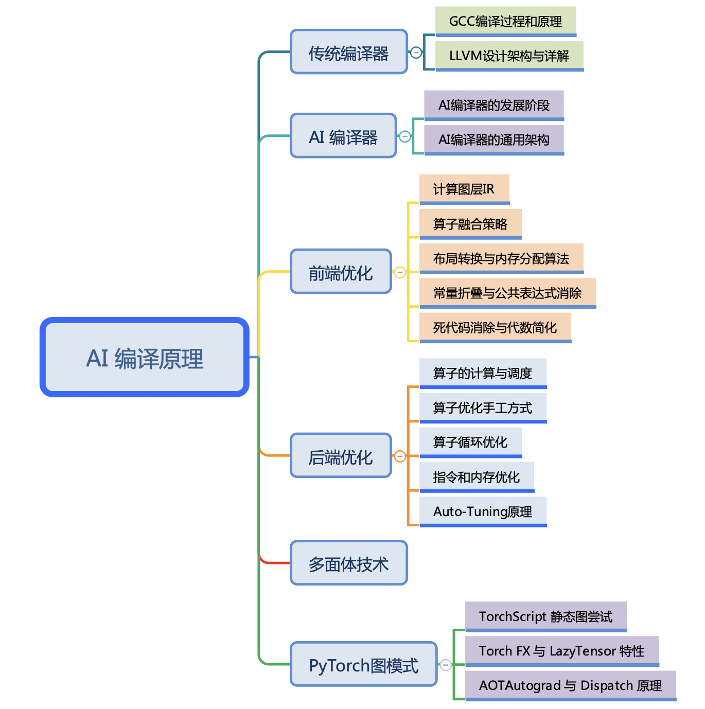

<!--Copyright © ZOMI 适用于[License](https://github.com/chenzomi12/AISystem)版权许可-->

# AI 编译原理概述

随着深度学习的应用场景的不断泛化，深度学习计算任务也需要部署在不同的计算设备和硬件架构上；同时，实际部署或训练场景对性能往往也有着更为激进的要求，例如针对硬件特点定制计算代码。

这些需求在通用的 AI 框架中已经难已得到满足。由于深度学习计算任务在现有的 AI 框架中往往以 DSL（Domain Specific Language）的方式进行编程和表达，这本身使得深度学习计算任务的优化和执行天然符合传统计算机语言的编译和优化过程。因此，深度学习的编译与优化就是将当前的深度学习计算任务通过一层或多层中间表达进行翻译和优化，最终转化成目标硬件上的可执行代码的过程。本章将围绕现有 AI 编译器中的编译和优化工作的内容展开介绍。

> 希望这个系列能够给大家、朋友们带来一些些帮助，也希望自己能够继续坚持完成所有内容哈！

## 课程简介

- [**《传统编译器》**](./01Tradition/)会粗略地回顾传统编译器中的前端、后端、IR 中间表达等主要的概念，并对目前最常用的 GCC 和 LLVM 的发展历史，GCC 的使用方式和 LLVM 的架构前后端优化划分，两大编译器 GCC 和 LLVM 进行简单的展开，去了解 GCC 的编译流程和编译方式，并回顾 LLVM 的整体架构，了解传统编译器的整体架构和脉络。

- [**《AI 编译器》**](./02AICompiler/)是本节的概览重点，去了解本章的主要内容 AI 编译器的整体架构，包括他的发展阶段，目前主要的组成模块，整体的技术演进方向等概念性的内容，因为近年来 AI 编译器发展迅猛，可以横向去了解 AI 编译器整体技术。AI 编译器发展时间并不长，从第一代开始到目前进入第二代，AI 编译器整体架构基本上已经清晰，可是也会遇到很多挑战和技术难点。 

- [**《前端优化》**](./03Frontend/)前端优化作为 AI 编译器的整体架构主要模块，主要优化的对象是计算图，而计算图是通过 AI 框架产生的，值得注意的是并不是所有的 AI 框架都会生成计算图，有了计算图就可以结合深度学习的原理知识进行图的优化。前端优化包括图算融合、数据排布、内存优化等跟深度学习相结合的优化手段，同时把传统编译器关于代数优化的技术引入到计算图中。

- [**《后端优化》**](./04Backend/)后端优化作为 AI 编译器跟硬件之间的相连接的模块，更多的是算子或者 Kernel 进行优化，而优化之前需要把计算图转换称为调度树等 IR 格式，AI 编译器为了更好地跟硬件打交道，充分赋能硬件，需要后端优化来支持，于是后端针对调度树或者底层 IR，在每一个算子/Kernel 进行循环优化、指令优化和内存优化等技术。

- [**《多面体技术》**](./)多面体不属于新的技术，反而是传统编译器的一种优化手段，得益于深度学习中的主要特征（循环、张量），因此多面体技术可以发挥更大的作用，对循环展开、内存映射等优化工作。多面体表示技术作为统一化的程序变换表示技术, 可以通过迭代域、仿射调度、访存函数等操作对算子或者 Kernel 进行循环优化和内存映射优化，作为 AI 编译器的前言研究方向。

- [**《PyTorch 图模式》**](./06PyTorch/)在充分了解 AI 编译器后，来深度剖析 PyTorch2.0 关于图模式的 Dynamo 是如何实现的，如何对 PyTorch 的后端执行进行加速。本节会以实际的 AI 框架 PyTorch 2.0 为主线，去把其主打特性 Dynamo 和 AOTAutograd 进行展开，并回顾 PyTorch 对图模式的尝试，了解现今最热门的 AI 框架如何进行编译器优化的。

## 课程细节

> `PPT`和`字幕`需要到 [Github](https://github.com/chenzomi12/AISystem) 下载，网页课程版链接会失效哦~
> 
> 建议优先下载 PDF 版本，PPT 版本会因为字体缺失等原因导致版本很丑哦~

### 课程脑图

### [课程介绍](./01Tradition/)

| 小节 | 链接 |
|:----------:|:----------------------------------------------------------------------------------------------------------------------------------------------:|
| 01 编译器基础概念 | [文章](), [PPT](./01Tradition/01Introduction.pdf), [视频](https://www.bilibili.com/video/BV1D84y1y73v/), [文章](./01Tradition/01.introduction.md), [字幕](./01Tradition/srt/01.srt) |

### [传统编译器](./01Tradition/)

《传统编译器》会粗略地回顾传统编译器中的前端、后端、IR 中间表达等主要的概念，并对目前最常用的 GCC 和 LLVM 的发展历史，GCC 的使用方式和 LLVM 的架构前后端优化划分，两大编译器 GCC 和 LLVM 进行简单的展开，去了解 GCC 的编译流程和编译方式，并回顾 LLVM 的整体架构，了解传统编译器的整体架构和脉络。

| 小节 | 链接 |
|:------------- |:-------------------------------------------------------------------------------------------------- |
| 02 开源编译器的发展   | [文章](./01Tradition/02History.md), [PPT](./01Tradition/02History.pdf), [视频](https://www.bilibili.com/video/BV1sM411C7Vr/), [字幕](./01Tradition/srt/02.srt) |
| 03 GCC 编译过程和原理 | [文章](./01Tradition/03GCC.md), [PPT](./01Tradition/03GCC.pdf), [视频](https://www.bilibili.com/video/BV1LR4y1f7et/), [字幕](./01Tradition/srt/03.srt) |
| 04 LLVM 设计架构   | [文章](./01Tradition/04LLVM.md), [PPT](./01Tradition/04LLVM.pdf), [视频](https://www.bilibili.com/video/BV1CG4y1V7Dn/), [字幕](./01Tradition/srt/04.srt) |
| 05 LLVM IR 详解  | [文章](./01Tradition/05LLVMDetail01.md), [PPT](./01Tradition/05LLVMDetail01.pdf), [视频](https://www.bilibili.com/video/BV1LR4y1f7et/), [字幕](./01Tradition/srt/05.srt) |
| 06 LLVM 前端和优化层 | [文章](./01Tradition/05LLVMDetail02.md), [PPT](./01Tradition/05LLVMDetail02.pdf), [视频](https://www.bilibili.com/video/BV1vd4y1t7vS), [字幕](./01Tradition/srt/06.srt) |
| 07 LLVM 后端代码生成 | [文章](./01Tradition/05LLVMDetail03.md), [PPT](./01Tradition/05LLVMDetail03.pdf), [视频](https://www.bilibili.com/video/BV1cd4y1b7ho), [字幕](./01Tradition/srt/07.srt) |

### [AI 编译器](./02AICompiler/)

《AI 编译器》是本节的概览重点，去了解本章的主要内容 AI 编译器的整体架构，包括他的发展阶段，目前主要的组成模块，整体的技术演进方向等概念性的内容，因为近年来 AI 编译器发展迅猛，可以横向去了解 AI 编译器整体技术。AI 编译器发展时间并不长，从第一代开始到目前进入第二代，AI 编译器整体架构基本上已经清晰，可是也会遇到很多挑战和技术难点。 

| 小节 | 链接 |
|:-------------- |:-------------------------------------------------------------------------------------------------------------------------------------------------------------------------------------- |
| 01 为什么需要 AI 编译器  | [文章](./02AICompiler/01Appear.md), [PPT](./02AICompiler/01Appear.pdf), [视频](https://www.bilibili.com/video/BV1pM41167KP), [字幕](./02AICompiler/srt/01.srt) |
| 02 AI 编译器的发展阶段  | [文章](./02AICompiler/02Stage.md), [PPT](./02AICompiler/02Stage.pdf), [视频](https://www.bilibili.com/video/BV1QK411R7iy/), [字幕](./02AICompiler/srt/02.srt) |
| 03 AI 编译器的通用架构  | [文章](./02AICompiler/03Architecture.md), [PPT](./02AICompiler/03Architecture.pdf), [视频](https://www.bilibili.com/video/BV1qD4y1Y73e/), [字幕](./02AICompiler/srt/03.srt) |
| 04 AI 编译器的挑战与思考 | [文章](./02AICompiler/04Future.md), [PPT](./02AICompiler/04Future.pdf),[视频](https://www.bilibili.com/video/BV1Hv4y1R7uc/), [字幕](./02AICompiler/srt/04.srt) |

### [前端优化](./03Frontend/)

《前端优化》前端优化作为 AI 编译器 的整体架构主要模块，主要优化的对象是计算图，而计算图是通过 AI 框架产生的，值得注意的是并不是所有的 AI 框架都会生成计算图，有了计算图就可以结合深度学习的原理知识进行图的优化。前端优化包括图算融合、数据排布、内存优化等跟深度学习相结合的优化手段，同时把传统编译器关于代数优化的技术引入到计算图中。

| 小节 | 链接 |
|:-----------:|:----------------------------------------------------------------------------------------------------------------------------------:|
| 01 内容介绍     | [PPT](./03Frontend/01Introduction.pdf), [视频](https://www.bilibili.com/video/BV1ne411w7n2/), [文章](./03Frontend/01Introduction.md), [字幕](./03Frontend/srt/01.srt)   |
| 02 计算图层 IR   | [PPT](./03Frontend/02GraphIR.pdf), [视频](https://www.bilibili.com/video/BV1kV4y1w72W/), [文章](./03Frontend/02GraphIR.md), [字幕](./03Frontend/srt/02.srt)           |
| 03 算子融合策略   | [PPT](./03Frontend/03OPFusion.pdf), [视频](https://www.bilibili.com/video/BV1P24y1D7RV/), [文章](./03Frontend/03OPFusion.md), [字幕](./03Frontend/srt/03.srt)         |
| 04 布局转换原理   | [PPT](./03Frontend/04LayoutPrinc.pdf), [视频](https://www.bilibili.com/video/BV1xK411z7Uw/), [文章](./03Frontend/04LayoutPrinc.md), [字幕](./03Frontend/srt/04.srt)   |
| 05 布局转换算法   | [PPT](./03Frontend/05LayoutAlgo.pdf), [视频](https://www.bilibili.com/video/BV1gd4y1Y7dc/), [文章](./03Frontend/05LayoutAlgo.md), [字幕](./03Frontend/srt/05.srt)     |
| 06 内存分配算法   | [PPT](./03Frontend/06.memory.pdf), [视频](https://www.bilibili.com/video/BV1nM411879s/), [文章](./03Frontend/06.memory.md), [字幕](./03Frontend/srt/06.srt)               |
| 07 常量折叠原理   | [PPT](./03Frontend/07.constant_fold.pdf), [视频](https://www.bilibili.com/video/BV1P8411W7dY/), [文章](./03Frontend/07.constant_fold.md), [字幕](./03Frontend/srt/07.srt) |
| 08 公共表达式消除  | [PPT](./03Frontend/08.cse.pdf), [视频](https://www.bilibili.com/video/BV1rv4y1Q7tp/), [文章](./03Frontend/08.cse.md), [字幕](./03Frontend/srt/08.srt)                     |
| 09 死代码消除    | [PPT](./03Frontend/09.dce.pdf), [视频](https://www.bilibili.com/video/BV1hD4y1h7nh/), [文章](./03Frontend/09.dce.md), [字幕](./03Frontend/srt/09.srt)                     |
| 10 代数简化     | [PPT](./03Frontend/10.algebraic.pdf), [视频](https://www.bilibili.com/video/BV1g24y1Q7qC/), [文章](./03Frontend/10.algebraic.md), [字幕](./03Frontend/srt/10.srt)         |
| 11 优化 Pass 排序 | [PPT](./03Frontend/11.summary.pdf), [视频](https://www.bilibili.com/video/BV1L14y1P7ku/), [文章](./03Frontend/11.summary.md), [字幕](./03Frontend/srt/11.srt)             |

### [后端优化](./04Backend/)

《后端优化》后端优化作为 AI 编译器跟硬件之间的相连接的模块，更多的是算子或者 Kernel 进行优化，而优化之前需要把计算图转换称为调度树等 IR 格式，AI 编译器为了更好地跟硬件打交道，充分赋能硬件，需要后端优化来支持，于是后端针对调度树或者底层 IR，在每一个算子/Kernel 进行循环优化、指令优化和内存优化等技术。

| 小节 | 链接 |
|:---------------- |:-------------------------------------------------------------------------------------------------------------------------------- |
| 01 AI 编译器后端优化介绍   | [PPT](./04Backend/01.introduction.pdf), [视频](https://www.bilibili.com/video/BV17D4y177bP/), [文章](./04Backend/01.introduction.md), [字幕](./04Backend/srt/01.srt) |
| 02 算子的计算与调度     | [PPT](./04Backend/02.ops_compute.pdf), [视频](https://www.bilibili.com/video/BV1K84y1x7Be/), [文章](./04Backend/02.ops_compute.md), [字幕](./04Backend/srt/02.srt)   |
| 03 算子优化手工方式      | [PPT](./04Backend/03.optimization.pdf), [视频](https://www.bilibili.com/video/BV1ZA411X7WZ/), [文章](./04Backend/03.optimization.md), [字幕](./04Backend/srt/03.srt) |
| 04 算子循环优化        | [PPT](./04Backend/04.loop_opt.pdf), [视频](https://www.bilibili.com/video/BV17D4y177bP/), [文章](./04Backend/04.loop_opt.md), [字幕](./04Backend/srt/04.srt)         |
| 05 指令和内存优化       | [PPT](./04Backend/05.other_opt.pdf), [视频](https://www.bilibili.com/video/BV11d4y1a7J6/), [文章](./04Backend/05.other_opt.md), [字幕](./04Backend/srt/05.srt)       |
| 06 Auto-Tuning 原理 | [PPT](./04Backend/06.auto_tuning.pdf), [视频](https://www.bilibili.com/video/BV1uA411D7JF/), [文章](./04Backend/06.auto_tuning.md), [字幕](./04Backend/srt/05.srt)   |

### 多面体技术

《多面体技术》多面体不属于新的技术，反而是传统编译器的一种优化手段，得益于深度学习中的主要特征（循环、张量），因此多面体技术可以发挥更大的作用，对循环展开、内存映射等优化工作。多面体表示技术作为统一化的程序变换表示技术, 可以通过迭代域、仿射调度、访存函数等操作对算子或者 Kernel 进行循环优化和内存映射优化，作为 AI 编译器的前言研究方向。

### [PyTorch 图模式](./06PyTorch)

《PyTorch 图模式》在充分了解 AI 编译器后，来深度剖析 PyTorch2.0 关于图模式的 Dynamo 是如何实现的，如何对 PyTorch 的后端执行进行加速。本节会以实际的 AI 框架 PyTorch 2.0 为主线，去把其主打特性 Dynamo 和 AOTAutograd 进行展开，并回顾 PyTorch 对图模式的尝试，了解现今最热门的 AI 框架如何进行编译器优化的。

| 小节 | 链接 |
|:---------------------------:|:--------------------------------------------------------------------------------------------------------------------------------:|
| 01 PyTorch2.0 特性串讲 | [PPT](./06PyTorch/01.introduction.pdf), [视频](https://www.bilibili.com/video/BV1p84y1675B/), [文章](./06PyTorch/01.introduction.md), [字幕](./06PyTorch/srt/01.srt) |
| 02 TorchScript 静态图尝试 | [PPT](./06PyTorch/02.torchscript.pdf), [视频](https://www.bilibili.com/video/BV1JV4y1P7gB/), [文章](./06PyTorch/02.torchscript.md), [字幕](./06PyTorch/srt/02.srt) |
| 03 Torch FX 与 LazyTensor 特性 | [PPT](./06PyTorch/03.torchfx_lazy.pdf), [视频](https://www.bilibili.com/video/BV1944y1m7fU/), [文章](./06PyTorch/03.torchfx_lazy.md), [字幕](./06PyTorch/srt/03.srt) |
| 04 TorchDynamo 来啦 | [PPT](./06PyTorch/04.torchdynamo.pdf), [视频](https://www.bilibili.com/video/BV1Hv4y1R7uc/), [文章](./06PyTorch/04.torchdynamo.md), [字幕](./06PyTorch/srt/04.srt) |
| 05 AOTAutograd 原理 | [PPT](./06PyTorch/05.aotatuograd.pdf), [视频](https://www.bilibili.com/video/BV1Me4y1V7Ke/), [文章](./06PyTorch/05.aotatuograd.md), [字幕](./06PyTorch/srt/05.srt) |
| 06 Dispatch 机制 | [PPT](./06PyTorch/06.dispatch.pdf), [视频](https://www.bilibili.com/video/BV1L3411d7SM/), [文章](./06PyTorch/06.dispatch.md), [字幕](./06PyTorch/srt/06.srt) |

## 备注

文字课程内容正在一节节补充更新，每晚会抽空继续更新正在 [AISys](https://chenzomi12.github.io/) ，希望您多多鼓励和参与进来！！！

文字课程开源在 [AISys](https://chenzomi12.github.io/)，系列视频托管[B 站](https://space.bilibili.com/517221395)和[油管](https://www.youtube.com/@ZOMI666/videos)，PPT 开源在[github](https://github.com/chenzomi12/AISystem)，欢迎取用！！！

> 非常希望您也参与到这个开源项目中，B 站给 ZOMI 留言哦！
> 
> 欢迎大家使用的过程中发现 bug 或者勘误直接提交代码 PR 到开源社区哦！
> 
> 希望这个系列能够给大家、朋友们带来一些些帮助，也希望自己能够继续坚持完成所有内容哈！
