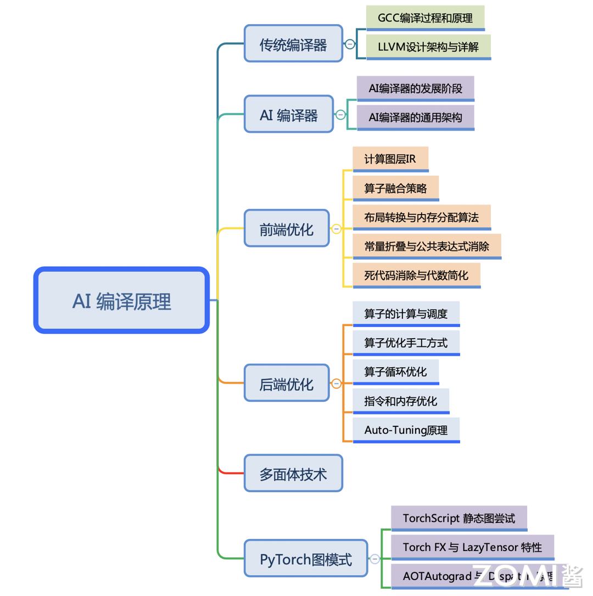

<!--Copyright © ZOMI 适用于[License](https://github.com/chenzomi12/AISystem)版权许可-->

# AI 编译原理概述

随着深度学习的应用场景不断泛化，深度学习计算任务也需要部署在不同的计算设备和硬件架构上；同时，实际部署或训练场景对性能往往也有着更为激进的要求，例如针对硬件的特点进行定制化。

这些需求在通用的 AI 框架中已经难已得到满足。由于深度学习计算任务在现有的 AI 框架中往往以 DSL（Domain Specific Language）的方式进行编程和表达，这本身使得深度学习计算任务的优化和执行天然符合传统计算机语言的编译和优化过程。因此，深度学习的编译与优化就是将当前的深度学习计算任务通过一层或多层中间表达进行翻译和优化，最终转化成目标硬件上的可执行代码的过程。本节将围绕现有 AI 编译器中的编译和优化工作的内容展开介绍。

## 课程简介

- [**《传统编译器》**](./01Tradition/)会粗略地回顾传统编译器中的前端、后端、IR 中间表达等主要的概念，并对目前最常用的 GCC 和 LLVM 的发展历史，GCC 的使用方式和 LLVM 的架构前后端优化划分，两大编译器 GCC 和 LLVM 进行简单的展开，去了解 GCC 的编译流程和编译方式，并回顾 LLVM 的整体架构，了解传统编译器的整体架构和脉络。

- [**《AI 编译器》**](./02AICompiler/)是本节的概览重点，去了解本节的主要内容 AI 编译器的整体架构，包括他的发展阶段，目前主要的组成模块，整体的技术演进方向等概念性的内容，因为近年来 AI 编译器发展迅猛，可以横向去了解 AI 编译器整体技术。AI 编译器发展时间并不长，从第一代开始到目前进入第二代，AI 编译器整体架构基本上已经清晰，可是也会遇到很多挑战和技术难点。

- [**《前端优化》**](./03Frontend/)前端优化作为 AI 编译器的整体架构主要模块，主要优化的对象是计算图，而计算图是通过 AI 框架产生的，值得注意的是并不是所有的 AI 框架都会生成计算图，有了计算图就可以结合深度学习的原理知识进行图的优化。前端优化包括图算融合、数据排布、内存优化等跟深度学习相结合的优化手段，同时把传统编译器关于代数优化的技术引入到计算图中。

- [**《后端优化》**](./04Backend/)后端优化作为 AI 编译器跟硬件之间的相连接的模块，更多的是算子或者 Kernel 进行优化，而优化之前需要把计算图转换称为调度树等 IR 格式，AI 编译器为了更好地跟硬件打交道，充分赋能硬件，需要后端优化来支持，于是后端针对调度树或者底层 IR，在每一个算子/Kernel 进行循环优化、指令优化和内存优化等技术。

- **《多面体技术》**多面体不属于新的技术，反而是传统编译器的一种优化手段，得益于深度学习中的主要特征（循环、张量），因此多面体技术可以发挥更大的作用，对循环展开、内存映射等优化工作。多面体表示技术作为统一化的程序变换表示技术, 可以通过迭代域、仿射调度、访存函数等操作对算子或者 Kernel 进行循环优化和内存映射优化，作为 AI 编译器的前言研究方向。

- [**《PyTorch 图模式》**](./06PyTorch/)在充分了解 AI 编译器后，来深度剖析 PyTorch2.0 关于图模式的 Dynamo 是如何实现的，如何对 PyTorch 的后端执行进行加速。本节会以实际的 AI 框架 PyTorch 2.0 为主线，去把其主打特性 Dynamo 和 AOTAutograd 进行展开，并回顾 PyTorch 对图模式的尝试，了解现今最热门的 AI 框架如何进行编译器优化的。

## 课程脑图

## 备注

文字课程开源在 [AISys](https://chenzomi12.github.io/)，系列视频托管[B 站](https://space.bilibili.com/517221395)和[油管](https://www.youtube.com/@ZOMI666/videos)，PPT 开源在[github](https://github.com/chenzomi12/AISystem)，欢迎取用！！！

> 非常希望您也参与到这个开源课程中，B 站给 ZOMI 留言哦！
> 
> 欢迎大家使用的过程中发现 bug 或者勘误直接提交代码 PR 到开源社区哦！
>
> 欢迎大家使用的过程中发现 bug 或者勘误直接提交 PR 到开源社区哦！
>
> 请大家尊重开源和 ZOMI 的努力，引用 PPT 的内容请规范转载标明出处哦！