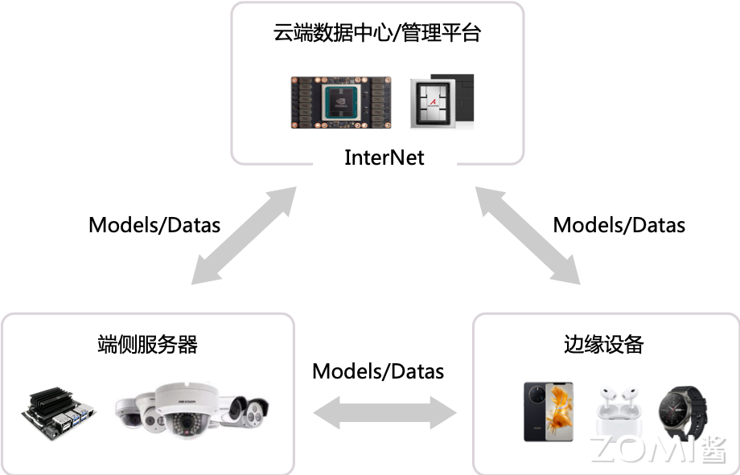
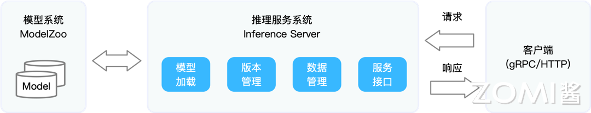
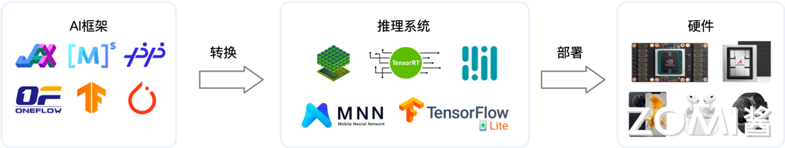

<!--Copyright © 适用于[License](https://github.com/chenzomi12/AISystem)版权许可-->

# 推理流程全景

本节介绍神经网络模型在部署态中的两种方式：云侧部署和边缘侧部署。其中，云侧部署适用于云服务器等具备强大计算能力和存储空间的环境，可以实现高吞吐量和集中的数据管理，但可能面临高成本、网络延迟和数据隐私等挑战。

边缘侧部署适用于边缘设备和移动设备等资源受限的环境，可以通过模型优化、硬件加速和分布式计算等方式降低延迟和能耗，但也面临有限算力、数据分散和安全性风险等挑战。两种部署方式都有自己的优势和局限性，需要根据具体应用场景来选择合适的部署方式。

## 部署态

模型的生命周期包含训练态和部署态，分别指的是 AI 模型在训练过程中的学习状态和在实际应用中的状态，它们代表了 AI 生命周期中的两个不同阶段，各自具有独特的目标、过程、环境和关注点。

部署态中的 AI 模型已经完成了训练阶段，被部署到实际应用环境中，如云端服务器、边缘设备、移动应用等，用于实时或近实时地进行推理预测的过程。此时，AI 模型不再处于学习状态，而是作为服务的一部分，接受输入数据并输出预测结果。

云端部署的推理系统更像传统 Web 服务，在边缘侧部署的模型更像手机应用和 IOT 应用系统。通常指互联网上的数据中心、云服务平台或远程服务器集群，其特点是拥有强大计算能力、海量存储空间、高带宽网络连接以及丰富的管理服务。

边缘端是指靠近数据生成源或用户终端的计算与网络设备，其目的是减少数据传输延迟、节省带宽、保护隐私或确保服务在离线或网络不稳定情况下的可用性。边缘端部署的设备主要包括：

1. 边缘服务器：小型化、低功耗的服务器，如微型服务器、嵌入式服务器，用于在靠近数据源处处理计算密集型任务。这类服务器可能配备较低功耗的 CPU、适量内存和存储，并可能集成特定领域的加速硬件。

2. 物联网网关：作为连接传感器、设备与云端的桥梁，物联网网关负责数据采集、初步处理、协议转换和安全传输。它们可能具备一定的计算能力以支持本地数据分析和简单推理。

3. 嵌入式设备：包括各种单板计算机（如 Raspberry Pi、Arduino）、微控制器（MCU）、智能模组等，这些设备通常具有低功耗、小体积等特点，常用于智能家居、工业控制、自动驾驶等场景中的数据采集、控制输出和本地推理。

4. 移动设备：如智能手机、平板电脑、智能穿戴设备等，它们内置处理器、内存和操作系统，能够运行轻量级推理应用，实现基于 AI 的个性化服务、实时分析或设备自主决策。

5. 专用硬件加速器：如 AI 加速卡（如 Intel Movidius、NVIDIA Jetson 系列）、视觉处理单元（VPU）、现场可编程门阵列（FPGA）等，用于在边缘设备上高效执行特定的 AI 算法，如深度神经网络推理。

6. 网络设备：在边缘场景中，可能还包括无线接入点（WAP）、LoRa 网关、NB-IoT 基站等，提供无线连接，支持物联网设备接入和数据传输。

图 1. 深度学习可以在边缘设备和云数据中心上执行

### 云侧部署特点与挑战

云端部署推理系统，即在云端（如云服务器、云平台）上运行的神经网络模型推理服务，相比边缘侧可以达到更高的推理吞吐量。以下详述云端部署态的特点及其带来的挑战：

首先来看一下云端部署态的特点：

- 对功耗(Power Consumption)、温度还有模型大小是没有太严格的限制的。

- 强大硬件支持。因为云端的资源非常的丰富的，通常配备高性能 CPU、GPU、TPU 等硬件加速器，能够高效处理大规模、复杂度高的推理任务。

- 集中的数据管理。在云侧有集中的数据管理，数据管理是训练环节中的一个很大的挑战，因为数据不仅是数据库的数据，而且更多的是一些非结构化的数据。同时云端提供了近乎无限的存储空间，便于存储大规模训练数据集、模型文件、中间结果及日志等。这对于需要频繁访问大数据或存储大量模型版本的应用尤为重要。

- 模型更容易在云端得到保护。云服务商通常具备完善的安全防护机制，如防火墙、身份验证、加密技术等，有助于保护数据安全和满足合规性要求。同时，云端部署有利于实施集中式安全策略和审计。

- 神经网络模型的执行平台和 AI 框架统一。云端环境通常提供标准化的基础设施和服务，支持广泛使用的 AI 框架（如 TensorFlow、PyTorch、MXNet 等）。开发者可以利用这些通用平台，无需顾虑底层硬件差异，直接部署训练好的模型，实现模型执行平台和 AI 框架的高度统一。这种一致性不仅简化了模型迁移和部署流程，还促进了跨团队、跨课程的协作与资源共享。

云端部署推理系统的确具备诸多显著优点，使其成为众多企业和课程首选的部署方式。然而，云端部署并非万能解决方案，也伴随着一些特定的挑战。

- 人工智能的服务成本非常高昂。因为需要云端的服务你就需要大量的机器，大量的容灾，大量的各种设备维护机房，所以它整体的成本是很高的。

- 推理服务对网络的依赖高。用户请求需要通过网络传输到云端进行处理，再返回结果，可能导致一定延迟。对于对实时性要求极高的应用（如实时语音识别、远程操控），网络延迟可能成为关键瓶颈。

- 数据隐私问题。在某些应用场景下，数据可能包含敏感信息，直接上传至云端进行推理可能引发隐私问题或不符合数据保护法规的要求。此时，可能需要采用加密、差分隐私等技术，或考虑边缘端推理以减少数据外传。

- 数据传输成本。当推理过程中涉及大量数据传输（如高清视频流分析）时，可能会产生较高的带宽费用，尤其是在大规模部署和高并发情况下。数据传输成本不仅是网络带宽使用费，也可能包括因数据传输而产生的电力消耗、硬件磨损等间接成本。

- 难以定制化模型。云端一般都会做一些通用的模型，很难定制化模型。

### 边缘侧部署特点与挑战

部署态的另外一面就是边缘侧部署，边缘侧部署是一种可行的解决方案，可以满足前面描述的延迟、数据传输、安全性挑战。在边缘侧部署中，计算资源的精细化网格提供了接近于终端设备的计算能力。然而，边缘环境也具有其特有的限制与挑战，下面详细阐述其特点与挑战：

图 2. 边缘侧部署推理系统流程

首先在端侧部署会遇到的挑战：

- 严格约束功耗、热量、模型尺寸小于设备内存：边缘设备，特别是移动设备，如智能手机、物联网传感器等，通常受到严格的电池续航和散热条件限制。部署推理系统时必须精细管理能源消耗，避免过热导致性能下降或设备损坏。这要求模型在设计时考虑低功耗特性，使用高效的计算图执行策略，并可能需要配合动态电压频率调整（DVFS）等硬件节能技术来平衡性能与能耗。

- 有限的硬件算力：边缘设备的计算能力相比云端服务器通常相差悬殊。即使是高端移动设备，其 CPU、GPU 或专用 AI 处理器的算力对于复杂的神经网络模型来说仍可能显得捉襟见肘。因此，部署在边缘的模型必须高度精简，或者通过异步计算、模型拆分（如 Edgent 框架所提出的 DNN 分区）等方式，将部分计算任务卸载到边缘服务器或云端，以减轻设备端的计算压力。

- 数据分散且难以训练：边缘设备产生的数据高度分散，分布在网络边缘的各个节点，且由于隐私、带宽、法规等因素，这些数据往往难以集中用于模型训练。这要求采用分布式或联邦学习等技术，允许在数据不出本地的前提下进行模型更新，或者设计能够在有限样本下进行有效学习和适应的在线学习算法。

- 安全性风险增加：由于边缘设备更接近物理世界，直接面对用户或攻击者，其上的推理系统更容易受到恶意攻击，如模型窃取、对抗样本攻击、侧信道攻击等。保障边缘推理的安全性需要强化模型加密、完整性验证、反逆向工程等防护措施，以及实施实时监控与异常检测机制。

- 平台多样性与缺乏通用解决方案：边缘设备类型繁多，操作系统各异，硬件架构差异明显，导致没有一种通用的 DNN 平台或解决方案能无缝适配所有设备。开发者需要面对跨平台兼容性问题，可能需要为不同设备定制化模型编译与优化过程，增加了部署与维护成本。

其次就是在边缘部署要做的工作：

- 应用的算法优化。边缘设备推理系统的特点在于对应用层算法的高度优化，以适应有限的硬件资源。这通常涉及使用轻量级模型结构、知识蒸馏、模型量化、剪枝等技术，减小模型尺寸，降低计算复杂度，确保模型能够在设备内存中完整加载。此外，针对移动端特定的应用场景，开发人员会设计并训练专门的 AI 模型，这些模型在保持较高精度的同时，显著减少参数数量和运算需求。

- 高效率的模型的设计。通过模型压缩，量化，神经网络结构搜索（NAS）等技术，提升移动端的模型效率。

- 移动端是有非常多的推理引擎的。移动端专用的推理引擎如 TensorFlow Lite、MACE、Core ML、ONNX Runtime Mobile 等，通过优化编译器、运行时库以及硬件加速器接口，进一步提升模型推理速度，降低能耗，确保在资源受限的边缘设备上流畅运行。

- 丰富的移动端芯片支持。各类专为边缘推理优化的芯片（如 ARM Cortex-A 系列、 Qualcomm Snapdragon、Apple Bionic、华为 HiSilicon Kirin 等）集成硬件加速单元（如 GPU、DSP、NPU），增强本地计算性能，为边缘设备上的推理任务提供硬件支撑。

总结来说，边缘设备上的推理系统具备应用层算法优化、高效率模型设计、丰富的移动端框架与芯片支持等优点，但同时也面临着严格的功耗与热量约束、有限的硬件算力、数据分散与训练困难、安全性风险增加以及平台多样性带来的挑战。解决这些挑战需要持续的技术创新与跨学科合作，以推动边缘智能的广泛应用与健康发展。

### 云测与边缘部署区别

了解了部署态在云侧与边缘侧的特点与挑战后，我们分开算力、时间、网络能耗等方面对两者进行对比。

|      | 云端部署                           | 端侧部署                    |
|:- | --- | -- |
| 算力   | 算力强大（TFLOPS，行可扩展），适合训练和推理阶段计算 | 算力有限，水平扩展性差，更适合推理阶段前向计算 |
| 时延   | 主要的时延来自网络传输和计算开销               | 本地计算无网络开销或者开销很低，实时响应要求高 |
| 网络依赖 | 强依赖                            | 弱依赖                     |
| 能耗   | 百瓦以上                           | 几十瓦，能耗比高                |
| 系统架构 | 开放，高度集中                        | 封闭，架构分散                 |
| 多样性  | 标准化程度高，CPU/GPU/NPU             | 多样性芯片架构，SOC 多            |
| 研发成本 | 配套完善，可移植性高                     | 配套不完善，可移植性受限            |

## 云侧部署和推理方式

推理系统在云侧可能会做很多的请求，监控、调度还有推力引擎，更多的是模型的管理这些相关的工作。如图所示，推理系统中常常涉及相应模块并完成相应功能，我们将在后面章节中逐步展开。首先从流程上来看，推理系统完成以下处理并涉及以下系统设计问题：

图 3. 云侧部署的推理系统

1. 请求与响应处理：请求与响应处理的模块主要是为了实现一个低延迟高吞吐的系统。系统需要序列化与反序列化请求，并通过后端高效执行，满足一定的响应延迟。相比传统的 web 服务，推理系统常常需要接受图像、文本、音频等非结构化数据，单请求或响应数据量一般更大，这就需要对这类数据有高效的传输，序列化，压缩和解压缩机制。

2. 请求调度：系统可以根据后端资源利用率，动态调整整批尺寸，模型的资源分配，进而提升资源利用率，吞吐量。同时如果是通过加速器进行的加速推理，还要考虑主存与加速器内存之间的数据拷贝，通过调度或预取等策略在计算的间歇做好数据的准备。

3. 推理引擎执行：推理引擎将请求映射到模型作为输入，并在运行时调度神经网络模型的内核进行多阶段的处理。如果是部署在异构硬件或多样化的环境，还可以利用编译器进行代码生成与内核算子优化，让模型自动化转换为高效的特定平台的可执行机器码。

4. 模型版本管理：在云端算法工程师不断验证和开发新的版本模型，需要有一定的协议保证版本更新与回滚。定期或满足一定条件的新模型不断上线替换线上模型，以提升推理服务的效果，但是由于有些指标只能线上测试，有可能线上测试效果较差还需要支持回滚机制，让模型能回滚到稳定的旧版本模型。

5. 健康监控：云端的服务系统应该是可观测的，才能让服务端工程师监控，报警和修复服务，保证服务的稳定性和 SLA。例如，一段时间内响应变慢，通过可观测的日志，运维工程师能诊断是哪个环节成为瓶颈，进而可以快速定位，应用策略，防止整个服务突发性无法响应（例如，OOM 造成服务程序崩溃）。

6. 推理硬件：在边缘端等场景会面对更多样的硬件，驱动和开发库，需要通过编译器进行一定代码生成让模型可以跨设备高效运行，并通过编译器实现性能优化。

7. 推理系统和训练系统间可以通过模型库与上线的协议建立起联系，一般训练系统有一套完整的 DevOps 流水线，也被称作 MLOps。算法工程师不断在训练流水线中提交模型设计与算法调优的实验，待满足一定的精度需求后，模型进入模型库并触发上线动作。之后就是模型被压缩优化或加载进推理系统了。

综上所述，云侧推理和部署的全流程涵盖了模型全生命周期管理、服务接口设计、请求处理与调度、推理执行、系统监控以及硬件优化等多个环节，旨在构建一个高效、稳定、可扩展的云上 AI 服务环境。

## 边缘部署和推理方式

除了云端的部署，神经网络模型的另一大场景就是边缘（Edge）部署，随着越来越多的物联网设备智能化，越来越多的移动端系统中开始部署神经网络模型。移动端部署应用常常有以下场景：智能设备，智慧城市，智能工业互联网，智慧办公室等。

边缘部署和推理方式常见的为以下几种：

### 方式一：边缘设备计算

第一种就是纯粹在边缘里面去做一个推理的，包括在手机、耳机还有手环上面，去做一个简单的推理，如下图所示。许多研究工作都集中在如何减少深度学习在资源受限的设备上执行时的延迟。

在这里，我们描述了在高效硬件和 DNN 模型设计方面的主要优化：

1. 模型设计：在为资源受限的设备设计 DNN 模型时，机器学习研究人员往往侧重于设计 DNN 模型中参数量较少的模型，从而减少内存和执行延迟，同时保持较高的准确性。这些模型包括 MobileNets, SqueezeNet 等。

2. 模型压缩：通过模型量化、剪枝和知识蒸馏等压缩手段对模型进行压缩。

3. 硬件：设计针对神经网络的专用芯片。

### 方式二：安全计算 + 卸载云端

将模型部署于数据中心，边缘侧通过安全通信协议将请求发送到云端，云端推理返回结果，相当于将计算卸载（Offloading）到云端。这种方式好处是利用云端运行提升模型安全性，适合部署端侧无法部署的大模型。完全卸载到云端有可能违背实时性的需求。过渡方法是可以将模型切片，移动端和边缘端各有部分模型切片。

### 方式三：边缘设备 + 云端服务器

卸载方式是利用深度学习的结构特点，将一部分层切分放置在设备端进行计算，其他放置在云端，这种方式也被称作深度学习切片。这种方式一定程度上能够比方式二降低延迟，由于其利用了边缘设备的算力，但是与云端通信和计算还是会带来额外开销。这种方式的动机是，经过前几层的计算后，中间结果变得非常少。

使用这种方式部署很多时候是由于有一些数据是不出端的，用户对这些数据的隐私的保护要求非常严格。例如相册的推荐，华为相册中对人像、事物、美食做了归类，这种归类数据是不出端的，用户对这些数据的隐私要求非常高。这个时候会做一个小模型，在端内做一个简单的决策，这个小模型会通过大模型对大量的数据进行训练，训练完之后再推过来。

### 方式四：分布式计算

上述方法主要考虑将计算从终端设备卸载到其他更强大的设备（如边缘服务器或云）。另一种工作是从分布式计算的角度考虑问题。此类工作从分布式系统角度抽象问题，AI 计算在多个辅助边缘设备上切片，例如，MoDNN[17] 和 DeepThings[18] 通过细粒度的切片策略，将模型切片部署在设备，例如，树莓派和安卓手机，进行执行。切片策略根据设备计算能力，内存约束。在运行期，DeepThings 输入数据通过负载均衡策略进行调度，MoDNN 抽象了一层类 MapReduce 计算模型进行调度。

### 方式五：跨设备卸载

最后一种方式是利用 DNN 独特的层的结构，让一些层在边缘设备上计算，一些层由边缘服务器或云端计算。这种方法可以通过利用其他边缘设备的计算周期来潜在地提供延迟减少，但是还需要注意的是，在 DNN 分区点传递中间结果的延迟会影响总体的收益。

## 小结与思考

- 云端部署：在云服务器上进行 AI 模型推理，具有高吞吐量和集中管理的优势，但需要解决网络延迟、高成本和数据隐私保护的问题。

- 边缘侧部署：在边缘设备上执行 AI 模型推理，以降低延迟和节省带宽，面临硬件资源有限、数据分散和安全性风险等挑战。

## 本节视频

<html>
<iframe src="https://player.bilibili.com/player.html?isOutside=true&aid=692565613&bvid=BV1M24y1v7rK&cid=959085059&p=1&as_wide=1&high_quality=1&danmaku=0&t=30&autoplay=0" width="100%" height="500" scrolling="no" border="0" frameborder="no" framespacing="0" allowfullscreen="true"> </iframe>
</html>
