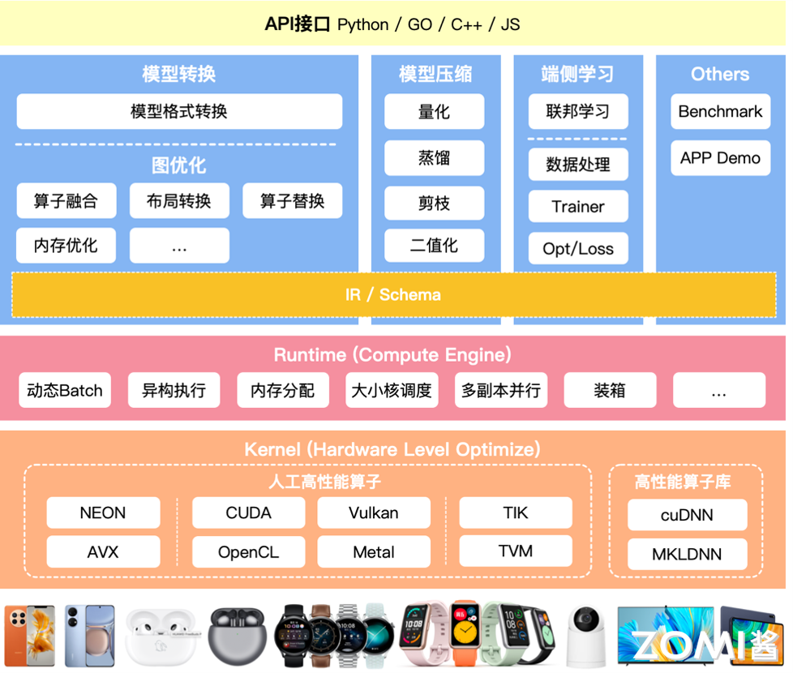
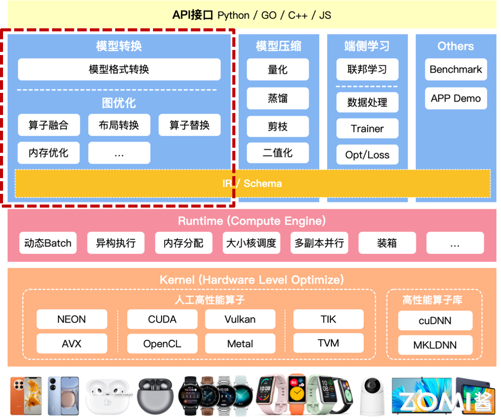
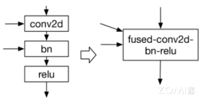
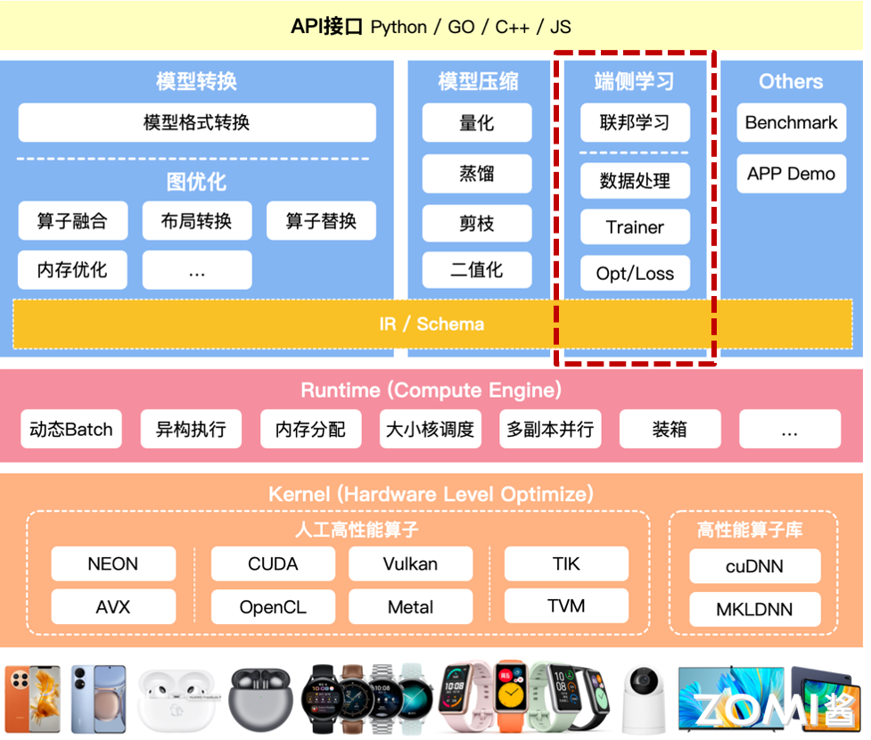
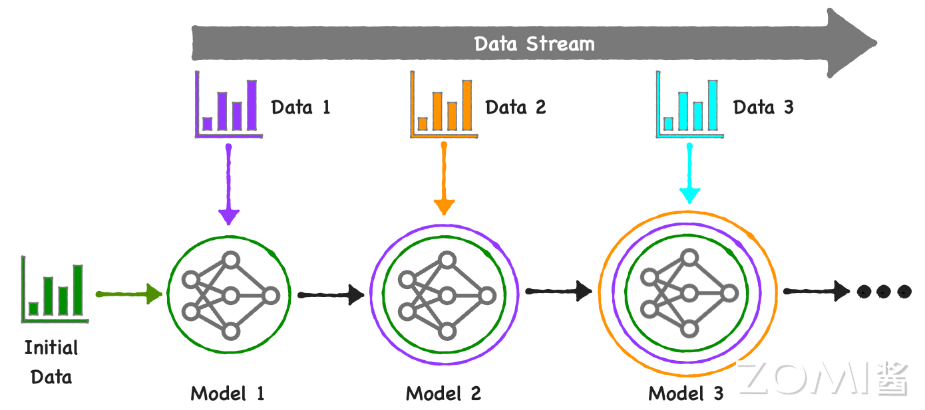
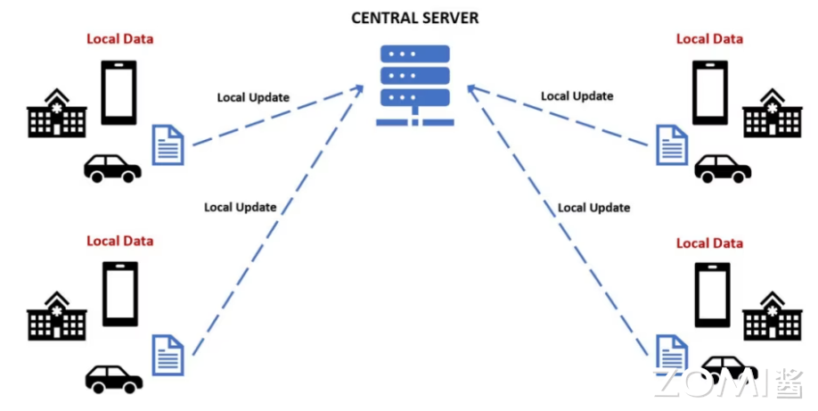
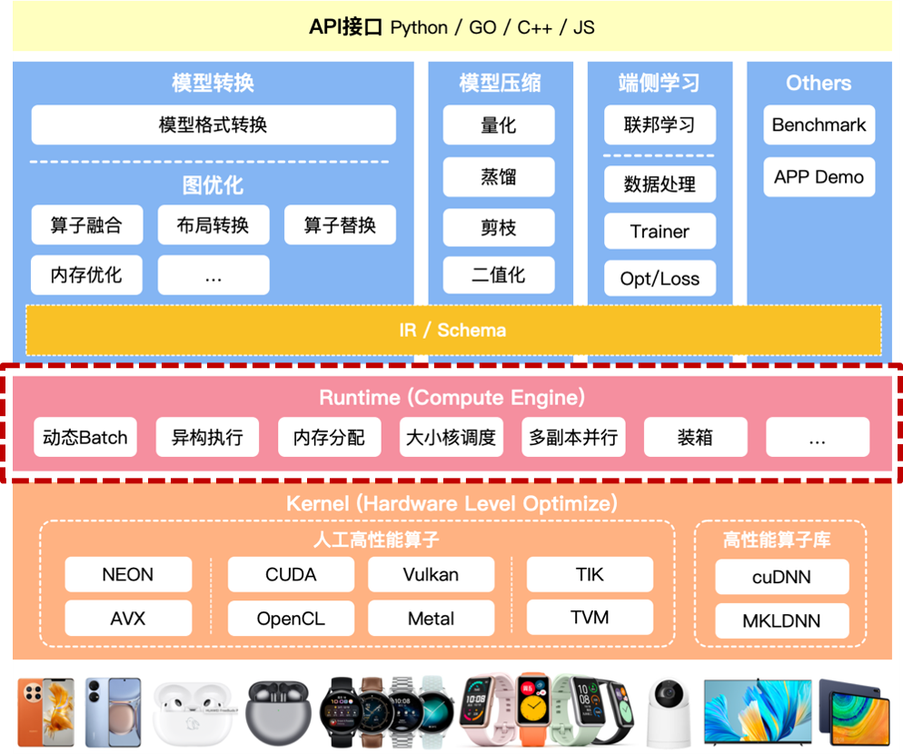
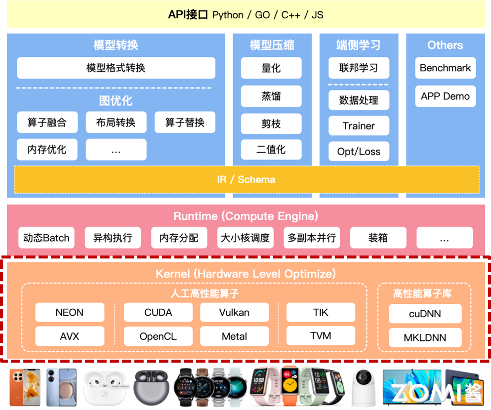
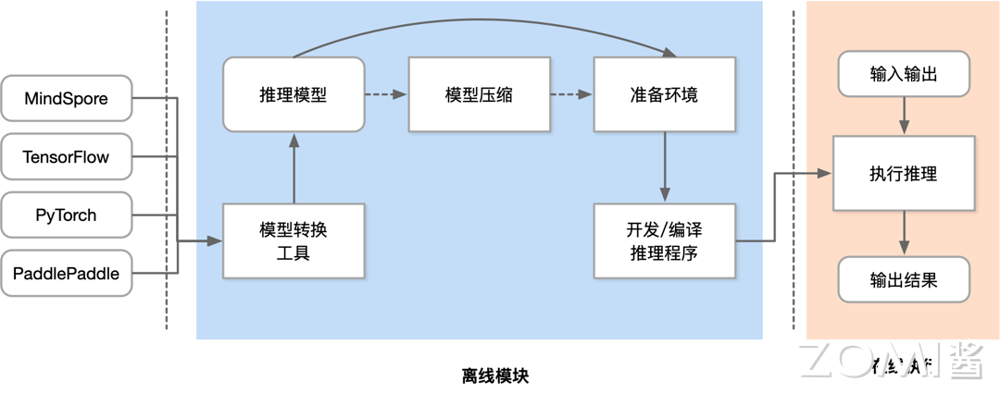

<!--Copyright © 适用于[License](https://github.com/chenzomi12/AISystem)版权许可-->

# 推理引擎架构(DONE)

在深入探讨推理引擎的架构之前，让我们先来概述一下推理引擎的基本概念。推理引擎作为人工智能系统中的关键组件，负责将训练好的模型部署到实际应用中，执行推理任务，从而实现智能决策和自动化处理。随着 AI 技术的快速发展，推理引擎的设计和实现面临着诸多挑战，同时也展现出独特的优势。

本节将详细阐述推理引擎的特点、技术挑战以及如何应对这些挑战，为读者提供一个较为全面的视角。同时，我们将深入探讨推理引擎的架构设计，从模型转换工具到端侧学习，再到性能优化和算子层的高效实现，通过对这些关键技术点的一一解析，以期为构建高效、可靠的推理引擎提供理论支持和实践指导。

## 推理引擎特点

推理引擎，作为人工智能和机器学习领域的重要组成部分，其设计目标在于提供一个灵活、高效且易于使用的平台，用于部署和运行已经训练好的模型，完成从数据输入到预测输出的全过程。推理引擎拥有轻量、通用、易用和高效四个特点：

- **轻量**:

  - **资源占用少**：轻量级推理引擎设计时会注重减少对计算资源（如 CPU、内存）的需求，使其能在低功耗设备上运行，如移动端设备、边缘计算节点等。

  - **体积小**：引擎本身的代码库和依赖较小，便于快速部署和更新，减少存储空间需求。

  - **快速启动**：启动速度快，能够迅速进入工作状态，这对于需要即时响应的应用场景尤为重要。

- **通用**:

  - **多模型支持**：支持广泛的机器学习和神经网络模型格式，包括但不限于 TensorFlow、PyTorch、ONNX 等，确保了不同框架训练的模型都能被兼容和部署。

  - **跨平台能力**：推理引擎能够在多种操作系统和硬件平台上运行，无论是 Linux、Windows 还是嵌入式系统，都能保证服务的连续性和一致性。

  - **广泛应用领域**：适用于图像识别、语音处理、自然语言处理等多个领域，满足不同行业和场景的 AI 应用需求。

- **易用**:

  - **简化部署流程**：提供简洁的 API 和工具链，使得用户无需深入了解底层技术细节即可快速部署模型。

  - **可视化工具**：很多推理引擎会配套图形界面或 Web 管理面板，便于用户监控模型性能、调整参数和管理服务。

  - **文档与社区支持**：良好的文档资料和活跃的开发者社区，可以帮助新用户快速上手，解决遇到的技术问题。

- **高效**:

  - **高性能推理**：通过优化算法、并行计算、硬件加速（如 GPU、TPU）等方式，最大化提升推理速度，降低延迟。

  - **资源管理**：动态调整计算资源分配，根据负载自动扩缩容，确保高吞吐量的同时，也保持资源使用效率。

  - **模型优化**：支持模型压缩、量化等技术，减小模型体积，提高推理效率，尤其适合资源受限环境。

其中，"易用"与"高效"两大特性尤为关键，它们直接关系到技术解决方案的普及度与实际成效。一方面，易用性确保了技术的可接近性，加速了 AI 解决方案从概念验证到生产环境的转化过程，是推动 AI 技术从实验室走向广泛商用的桥梁。另一方面，高效性关乎推理速度和延迟，还涉及到资源的有效管理与优化，不仅是技术实力的体现，也是实现商业价值最大化的关键所在。

### 轻量级

轻量级推理引擎的设计哲学围绕着“简约而不简单”的原则展开，旨在打造既功能完备又资源友好的解决方案，使之成为连接智能应用与广泛设备的桥梁。其核心优势不仅仅局限于体积小和资源占用低，更在于如何在有限的资源约束下，最大化地发挥出 AI 模型的潜力。

1. 零依赖

轻量级推理引擎从架构设计之初就追求极致的纯净与独立，确保主体功能无任何外部依赖。这意味着，它的代码库经过精心裁剪与优化，只保留最关键、最核心的部分，从而能够轻松部署到资源受限的环境中，比如移动设备、IoT 传感器、乃至各类嵌入式系统中。这种零依赖的特性，大大简化了部署流程，降低了维护成本，使得即便是计算和存储资源有限的设备也能享受到 AI 技术带来的便利。


2. Mini 编辑选项

为了进一步缩减推理引擎的体积，许多轻量级引擎引入了 Mini 编辑选项。这一创新机制允许开发者和用户根据实际应用场景的需要，定制化选择引擎中的组件和服务，剔除不必要的功能模块。这一灵活的配置方式，好比为引擎做了一次“精准减肥”，在不影响核心功能的前提下，大约能将原有库的体积再缩减一个可观的比例。对于那些极度重视存储空间的应用场景，如可穿戴设备或微型机器人，这一特性无疑是个巨大的福音。


3. 压缩与量化

面对模型体积大、部署不便的挑战，轻量级推理引擎通过支持 FP16/Int8 精度的模型更新与量化技术，巧妙地在模型精度与体积之间找到了平衡点。FP16（半精度浮点数）相较于传统的 FP32（单精度浮点数），可以将模型大小几乎减半，而 Int8（8 位整数）量化则更为激进，通常能将模型体积压缩至原始大小的 25% 到 50% 之间，同时尽量保持模型的预测精度。这种压缩与量化策略，在不牺牲过多性能的基础上，大幅提升了模型部署的便捷性，让即使是复杂的神经网络模型也能轻松运行在各种轻型设备上。

### 通用性

通用性作为推理引擎的核心特性之一，其设计目的旨在打破技术壁垒，实现无缝对接多样化需求，无论是在模型兼容性、网络结构支持、设备与操作系统适配性上，都展现了极高的灵活性与包容性，确保了 AI 技术在广阔的应用场景中畅通无阻。

1. 广泛兼容

推理引擎的通用性首先体现在对主流模型文件格式的广泛支持上，无论是 TensorFlow、PyTorch 这类深度学习领域的重量级框架，还是 MindSpore、ONNX 这样新兴的开放标准，都能被顺利读取与执行。这意味着开发者无需担心模型来源，可以自由选择最适合课程的训练工具，享受技术栈的多样性。此外，对于卷积神经网络(CNN)、循环神经网络(RNN)、生成对抗网络(GAN)、Transformer 等当前主流的网络结构，引擎均能提供全面的支持，满足从图像识别、自然语言处理到复杂序列生成等多样的任务需求。

2. 动态处理

在实际应用中，模型往往需要处理不同维度、多变的数据类型。通用性推理引擎通过支持多输入多输出、任意维度的输入输出配置，以及动态输入处理能力，为复杂模型部署提供了坚实的基础。特别是对于那些含有条件分支、循环等控制流逻辑的模型，引擎同样能提供有效支持，确保这些高级功能在推理阶段得到准确执行，这对于实现更智能化、适应性更强的应用至关重要。

3. 跨平台部署

从服务器集群到个人电脑，再到手机乃至嵌入式设备，通用性推理引擎的足迹遍布所有具备 POSIX 接口的计算平台。这种跨平台的能力不仅限于硬件层面，更深入到操作系统级别，无论是 Windows、iOS、Android 这样的消费级操作系统，还是 Linux、ROS（Robot Operating System）这类面向专业应用的操作系统，都能找到推理引擎的身影。这种广泛的兼容性，极大拓宽了 AI 技术的应用范围，无论是云端大规模服务、桌面应用程序，还是移动终端乃至物联网设备，都能轻松集成 AI 能力，释放智能潜能。


### 易用性

易用性是衡量一个 AI 推理引擎是否能够被广泛采纳和高效利用的关键指标。它不仅要求技术解决方案对用户友好，还要能够降低开发门槛，提高工作效率，让开发者能够聚焦于创新，推动 AI 技术的广泛应用。

1. 算子丰富

推理引擎内置了丰富的算子库，这些算子设计用于执行常见的数值计算任务，如矩阵运算、统计分析、线性代数操作等，其功能广泛覆盖了 numpy 这一科学计算库中的常用功能。这种设计让熟悉 numpy 的开发者能够无缝过渡，利用熟悉的语法快速实现数据预处理和后处理逻辑，无需从头学习新的数学运算方法，大大提升了开发效率与代码的可读性。此外，通过直接映射 numpy 接口，工程师可以轻松复用现有的 numpy 代码片段，减少重复工作，加速课程进度。

2. 特定模块支持

推理引擎会对特定领域，如针对计算机视觉(CV)和自然语言处理(NLP)这两大核心 AI 领域，提供专门的模块与工具包，封装大量经过优化的算法与模型，使得开发者能够快速搭建起复杂的应用系统。例如，在 CV 领域，引擎一般会包含了图像增强、目标检测、图像分类等预置模块；而在 NLP 方面，则会提供词嵌入、语义分析、机器翻译等功能。这些模块不仅简化了模型的构建过程，还通过高度优化的实现，保障了应用的性能表现，使得开发者能够更加专注于业务逻辑的实现，而非底层技术细节。


3. 跨平台训练能力

为了满足不同场景下模型开发的需求，推理引擎不仅支持模型的跨平台推理，还扩展到了模型训练阶段。无论开发者身处何种操作系统环境，都能够便捷地进行模型的训练与微调。这种灵活性意味着研究者可以在资源丰富的服务器上训练复杂模型，随后无缝迁移到其他平台进行测试或部署，极大地促进了研发流程的连贯性和效率。同时，跨平台训练支持也意味着团队成员即便使用不同的开发环境，也能保持工作的协同性，降低了协作成本。

4. 丰富的接口与文档

强大的 API 接口是推理引擎易用性的另一大体现。良好的 API 设计应当简洁直观，同时涵盖广泛的功能，允许开发者通过少量代码就能调用复杂的内部逻辑。从模型加载、数据输入输出，到模型预测、性能监控，每一个环节都应有详尽的 API 支持。此外，高质量的文档与示例代码是不可或缺的，它们能够帮助新用户迅速上手，也为资深开发者提供深入探索的路径。通过文档和教程，用户可以快速了解如何最有效地利用引擎的各项功能，从而缩短从想法到实现的距离。

### 高性能

高性能是推理引擎的灵魂，它直接决定了 AI 应用的响应速度、资源消耗以及用户体验。为了在多样化的硬件平台上实现最佳推理性能，推理引擎采用了多方面的策略和技术优化，确保在 iOS、Android、PC 等不同设备上，无论是哪种硬件架构或操作系统，都能充分挖掘设备潜能，实现高效运行。

1. 深度适配

针对不同设备的硬件架构和操作系统，推理引擎实现了精细的适配策略。这不仅仅是要支持在前几个小节中提到的“跨平台”，而是更进一步，无论是基于 ARM 还是 x86 的处理器，亦或是 iOS、Android、Windows、Linux 等操作系统，引擎都能智能识别并调整运行模式，确保在单线程下也能高效运行神经网络模型，逼近甚至达到设备的算力极限。这种深层次的适配不仅考虑了硬件的基本特性，还优化了系统调度，减少了不必要的开销，确保每一滴计算资源都被有效利用。

2. 定制优化

对于搭载 GPU、NPU 等加速芯片的设备，推理引擎进行了针对性的深度调优。例如，利用 OpenCL 框架对图形处理器进行极致的推理性能优化，确保计算密集型任务能够快速执行；而 Vulkan 方案则在减少初始化时间和优化渲染管道上展现出优势，特别适合需要快速启动和连续推理的场景。这些定制化的优化策略，确保了在各类加速硬件上的高效推理，进一步提升了整体性能表现。

- OpenCL (Open Computing Language) 是一种开放的、跨平台的标准，用于编写能够在不同类型的硬件平台上执行并行计算的程序。在深度学习推理场景中，OpenCL 能够充分发挥图形处理器的强大并行计算能力，通过直接访问底层硬件资源，实现对计算密集型任务的高度优化。开发者可以精细控制数据的分配、任务的调度以及内存管理，从而在图形处理器上实现高效的数据处理和计算。OpenCL 的核心优势在于其高度的灵活性和对计算资源的精细控制，使得针对特定模型或算法的优化成为可能，进而达到极致的推理性能。

- Vulkan 是新一代图形和计算 API，由 Khronos Group 开发，旨在提供更低的开销和更直接的硬件控制，以提高图形应用和游戏的性能与效率。尽管 Vulkan 最初设计用于图形渲染，但其高度模块化和低层特性同样适用于计算密集型任务，包括深度学习推理。Vulkan 的一大特点是减少了初始化时间和优化了渲染管道，这意味着在需要频繁启动和连续执行推理任务的场景下，Vulkan 能够更快地准备就绪并执行计算，减少了等待时间。此外，Vulkan 的高效内存管理和多线程设计也有助于提高整体的计算效率和响应速度，特别是在移动设备和实时应用中，这些特性显得尤为重要。

3. 低级优化

为了榨干硬件最后一丝算力，推理引擎在核心运算部分采用了 SIMD（单指令多数据）指令集和手写汇编代码。SIMD 技术允许一条指令同时对多个数据进行操作，大大提高了并行处理能力，尤其是在向量运算和矩阵乘法等常见于深度学习计算的任务中。而手写汇编则针对特定硬件指令集（如 ARMv8.2、AVX512）进行编码，通过直接控制硬件资源，实现了对特定 kernel 算法的性能优化，这在计算密集型任务中效果显著。

4. 多精度计算

针对不同场景的性能需求，推理引擎支持 FP32、FP16、INT8 等多种精度的计算模式。这种灵活性不仅有助于在保持模型预测精度的同时，显著降低计算和内存需求，还使得引擎能够更好地匹配不同硬件对精度支持的偏好。通过采用低精度计算，推理引擎能够在一些受支持的平台上实现更高的推理速度和能效比。


一款好的推理引擎可以为用户服务带来实质性的收益，如上图中展示的柱状图，每个柱状图代表不同推理引擎在不同型号手机上的性能对比。图中出现推理引擎有 NCNN、MACE、TF-Lite、CoreML 和 MNN。

- **NCNN**：NCNN 是由腾讯优图实验室开发的一个轻量级、高性能的神经网络推理框架，设计初衷是为了在移动端和嵌入式设备上实现极致的推理速度。它支持离线模型转换，能够直接加载和执行从 Caffe、TensorFlow、PyTorch 等框架训练得到的模型。NCNN 的一个显著特点是无第三方依赖，且完全针对移动端优化，通过直接利用 CPU 的 SIMD 指令集来实现高性能计算，同时支持 GPU 加速。它的设计使得开发者可以在没有 GPU 的情况下，仍然获得较快的推理速度。

- **MACE**：MACE 是小米推出的移动端 AI 计算引擎，全称为 Mobile AI Compute Engine。MACE 设计用于优化在移动设备上的神经网络模型推理效率，支持 CPU、GPU 和 DSP 等多种硬件加速。它提供了一套完整的模型转换工具链，能够将 Caffe、TensorFlow、PyTorch 等框架训练的模型转换成 MACE 的运行格式。MACE 通过高度优化的内核库和硬件加速，实现模型在移动端的高效运行，特别关注功耗和性能的平衡。

- **TF-Lite**：TF-Lite 是谷歌 TensorFlow 团队推出的一个轻量级解决方案，专为移动和嵌入式设备设计。它是 TensorFlow 框架的一个子集，专注于模型的推理部分，旨在提供低延迟和低功耗的机器学习推理。TF-Lite 支持模型量化和自定义算子，能够显著减少模型体积和提高运行效率。它支持 CPU、GPU 和 NNAPI（Android 神经网络 API）等多种后端，便于开发者根据设备特性选择最佳推理策略。

- **CoreML**：CoreML 是 Apple 为 iOS 设备设计的机器学习框架，支持在 iPhone 和 iPad 上运行预先训练好的机器学习模型，无需互联网连接。CoreML 不仅限于神经网络，还支持多种机器学习模型，如支持向量机、决策树等。它紧密集成于 iOS、macOS、watchOS 和 tvOS 生态系统中，提供了非常低的延迟和高效的推理性能，特别适合苹果生态内的应用开发。

- **MNN**：MNN 是阿里巴巴达摩院开发的轻量级深度学习推理引擎，旨在为移动端和边缘设备提供高性能的推理能力。MNN 在设计上特别聚焦于内部业务模型的优化，如针对人脸检测等任务进行了深度优化，能够在老旧的硬件上（如 iPhone 6）实现快速推理。它支持多平台部署，包括 iOS、Android、Linux 等，以及 CPU、GPU 等多种硬件加速。MNN 通过半自动搜索的方式优化模型执行，实现了模型和设备多样性的高效支持，同时保持了模型更新的灵活性。

## 推理引擎技术挑战

在 AI 技术的快速发展与普及过程中，推理引擎作为连接模型与实际应用的桥梁，面临着一系列复杂的技术挑战，这些挑战主要集中在需求复杂性与程序大小的权衡、算力需求与资源碎片化的矛盾，以及执行效率与模型精度的双重要求上。

### 需求复杂性与程序大小

随着 AI 应用领域的不断拓宽，模型的多样性和复杂度急剧增加，这给推理引擎提出了首个挑战：如何在有限的程序大小内实现对广泛模型的支持。AI 模型通常由成千上万的算子构成，涵盖了从基础的矩阵运算到复杂的卷积、递归网络等，而推理引擎必须设计出一套精简而又强大的算子集，用以模拟这些多样化的运算。这意味着引擎开发团队需要不断创新，通过算法优化、算子融合等技术，以少量的核心算子实现对各类模型的高效支持，同时还要考虑程序的可扩展性，以便未来容纳更多新型模型的接入，这无疑是一项既考验技术深度又考验策略智慧的任务。

应对 AI 推理引擎在需求复杂性与程序大小之间权衡的挑战，可以采取一系列综合策略和技术革新，确保在满足日益增长的模型复杂性需求的同时，保持程序的高效和精简：

- **模块化与插件化设计**：设计高度模块化的架构，使得每个模块专注于处理特定类型的计算或操作。这样不仅可以使核心程序保持精简，还能通过插件形式轻松添加或替换模块来支持新的模型或算子，增强系统的灵活性和可扩展性。

- **算子优化与融合**：深入分析模型中的算子，通过算法优化减少计算冗余，提高单个算子的执行效率。算子融合技术则是将多个连续且兼容的算子合并为一个，减少数据搬运和内存访问次数，从而在不增加程序大小的前提下提升运行速度。

- **动态编译与代码生成**：利用即时（JIT）编译或者静态编译时的优化技术，根据输入模型的具体结构动态生成最优化的执行代码。这种方法可以针对特定模型定制化生成执行逻辑，避免了通用解决方案带来的额外开销，有效平衡了性能与代码体积。

### 算力需求与资源碎片化

AI 模型的运行离不开强大的计算资源支持，尤其是面对诸如图像识别、自然语言处理等高计算量任务时。然而，实际应用场景中计算资源往往是碎片化的，从高性能服务器到低功耗的移动设备，算力和内存资源差异巨大。推理引擎需要在这片资源的“拼图”中寻找最优解，既要保证模型的高效执行，又要适应各类硬件环境。这要求引擎具备出色的适配能力，包括但不限于硬件加速技术的运用（如 GPU、NPU 加速）、动态调整算法策略以适应不同计算单元，以及智能的资源调度算法，以确保在有限的资源下也能发挥出最大的算力效能。


应对 AI 推理引擎在算力需求与资源碎片化之间的矛盾，也有一些新兴的技术方案，实现灵活应对算力需求，实现高效、低耗的模型推理，满足不同场景下的应用需求：

- **模型分层与多级缓存**：将模型拆分为不同的计算层，每层根据其计算特性和资源需求部署在最适合的硬件上。采用多级缓存策略，减少跨硬件的数据传输延迟，提高整体执行效率。

- **自适应推理技术**：开发自适应推理算法，根据当前设备的硬件配置动态调整模型的精度与计算复杂度。例如，在资源有限的设备上运行轻量级模型或进行模型裁剪，而在资源丰富的环境中则加载完整模型以追求更高精度。

- **异构计算整合**：充分利用异构计算资源，通过有效的任务分解和负载均衡机制，将计算密集型任务分配给高性能硬件（如 GPU），而将控制流和轻量级计算留给 CPU，实现整体性能的最大化。

- **动态资源调度**：设计智能的资源调度算法，实时监控系统资源状态和任务队列，动态调整任务优先级和资源分配，确保高优先级或时间敏感型任务得到及时处理。

- **边缘计算与分布式推理**：利用边缘计算将部分计算任务从云端转移到靠近数据产生的边缘设备上，减少数据传输延迟。对于特别复杂的模型，可以采用分布式推理技术，将模型分割并在多台设备上并行计算，最后汇总结果。

### 执行效率与模型精度

在追求高速推理的同时，保持模型预测的准确性是另一个核心挑战。一方面，为了提高执行效率，模型压缩、量化技术常被采用，这虽然能显著减少模型体积、加快推理速度，但可能以牺牲部分精度为代价。另一方面，业务场景往往对模型的精度有着严格要求，特别是在医疗诊断、金融风险评估等领域，任何微小的精度损失都可能导致重大后果。因此，推理引擎在设计上必须巧妙平衡这两方面的需求，通过算法优化、混合精度推理、以及对特定模型结构的定制优化等策略，力求在不明显影响模型精度的前提下，实现推理效率的最大化。这不仅是一个技术挑战，也是对工程实践智慧的考验，需要不断地试错、优化与迭代，以找到最合适的平衡点。

应对 AI 推理引擎在执行效率与模型精度的双重要求，则可以使用以下的关键策略，满足多样化业务场景的严苛要求：

- **知识蒸馏**：通过知识蒸馏技术，用一个大而精确的教师模型去训练一个较小的学生模型，让学生模型在保持较高精度的同时拥有更快的推理速度。这种方法可以在不直接牺牲模型精度的前提下，实现模型的小型化和效率提升。

- **量化与微调**：虽然量化技术会降低模型的精度，但通过细致的量化方案选择（如对敏感层采取不同的量化策略）和后续的微调步骤，可以在很大程度上恢复丢失的精度。微调过程可以让模型在量化后的新精度水平上重新学习，优化权重，最小化精度损失。

- **模型剪枝与稀疏化**：通过对模型进行剪枝，移除对最终预测贡献较小的权重或神经元，减少计算量。同时，利用稀疏计算技术进一步减少计算负担，许多现代硬件已支持高效的稀疏矩阵运算。精心设计的剪枝策略可以大幅降低计算需求而不显著影响模型表现。

- **缓存与预计算策略**：对频繁访问的数据或计算结果进行缓存，减少重复计算，特别是在循环或递归模型中。预计算某些静态或几乎不变的特征，进一步加速推理流程。

## 整体架构

推理引擎作为人工智能应用的核心组件，其架构设计直接关系到模型在实际部署环境中的效率、灵活性和资源利用率。整体架构可以细分为优化阶段和运行阶段，每个阶段都包含了一系列关键技术以确保模型能够高效、准确地运行于目标设备上。



**优化阶段**聚焦于将训练好的模型转换并优化成适合部署的形式：

- **模型转换工具**负责将模型从研究阶段的格式转换为高效执行的格式，并进行图优化，减少计算负担。

- **模型压缩**通过技术如剪枝、量化、知识蒸馏等减小模型大小，使之更适用于资源有限的环境。

- **端侧学习**允许模型在部署后继续学习和适应新数据，无需返回服务器重新训练，提升了模型在特定场景或用户个性化需求下的表现。

- **其他组件**包括 Benchmarking 工具，用于性能评测和调优指导，以及应用演示（App Demos），服务于模型能力展示与实战反馈收集，共同助力模型的高效部署与持续优化。

**运行阶段**确保模型在目标设备上的高效执行：

- **调度层**管理模型加载、资源分配及任务调度，根据设备情况灵活安排计算任务。

- **执行层**直接执行模型计算，针对不同硬件优化运算逻辑，有效利用 CPU、GPU 等资源。

### 模型转换工具

模型转换工具是 AI 应用部署流程中的基石，它不仅涉及将模型从训练环境迁移到推理环境的基本格式转换，还深入到计算图级别的精细优化，以确保模型在目标平台上高效、稳定地运行。



1. 模型格式转换

模型转换首先面临的是格式的跨越。想象一个模型，最初在如 TensorFlow、PyTorch 或 MindSpore 这样的科研友好型框架下被训练出来，它的原始形态并不直接适用于生产环境中的推理引擎。因此，转换工具承担起了“翻译者”的角色，将模型从其诞生的框架语言翻译成一种或多种行业广泛接受的标准格式，如 ONNX，这不仅增强了模型的可移植性，也为模型的后续处理和部署提供了通用的接口。

- **跨框架兼容性**：支持将模型从一种框架（如 TensorFlow、PyTorch）转换为另一种（如 ONNX、TensorRT），使得模型能够在不同的推理引擎上执行，增强了应用开发的灵活性和平台的通用性。

- **版本适应性**：解决因框架升级导致的模型兼容问题，确保旧模型可以在新版推理引擎上正确运行，或新模型能回溯支持老版本系统。

- **标准化输出**：转换后的模型通常被格式化为一种或多种行业标准格式，如 ONNX，这种标准化促进了生态系统中工具和服务的互操作性。

2. 计算图优化

然而，格式转换仅仅是冰山一角。真正的挑战在于如何对计算图进行深度优化，这是决定模型能否高效执行的关键。计算图，作为神经网络结构的数学抽象，其优化涉及到对图结构的精细剖析与重塑。其中，算子融合、布局转换、算子替换与内存优化，构成了优化的核心四部曲，每一步都是对模型性能极限的深刻探索与精心雕琢。

- **算子融合**

算子融合，宛若匠人之手，将计算图中相邻且兼容的多个基本运算合并为一个复合操作。这一过程减少了运算间的数据传输成本，消除了不必要的内存读写，使得数据流动更为顺畅。例如，将 Conv 卷积操作紧随其后的 BatchNorm 归一化和 ReLU 激活函数融合为一体，不仅缩减了计算图的复杂度，还充分利用了现代硬件对连续计算的支持，加速了计算流程。融合策略的巧妙应用，要求对底层硬件架构有着深刻的理解，确保每一步融合都精准贴合硬件的并行计算优势。



- **布局转换**

布局，即数据在内存中的组织方式。布局转换优化，是对数据存取路径的重构，旨在最小化内存访问延迟，最大化数据复用，特别是在神经网络模型广泛依赖的矩阵运算中，合理的布局选择能显著提升计算密集型任务的执行速度。例如，从 NHWC 到 NCHW 的转换，或是其他特定硬件偏好的布局格式调整，虽看似简单，实则深刻影响着内存访问模式与带宽利用。

如 **NHWC** 是 TensorFlow 等一些框架默认使用的布局，尤其在 CPU 上较为常见。这里的字母分别代表：**N**：批量大小（Batch Size），**H**：高度（Height），**W**：宽度（Width），**C**：通道数（Channels），对于 RGB 图像，C=3；

**NCHW** 布局更受 CUDA 和 CuDNN 等 GPU 库的青睐，尤其是在进行深度学习加速时。布局变为：**N**：批量大小，**C**：通道数，**H**：高度，**W**：宽度。

例如，一个处理单张 RGB 图像的张量布局为 NHWC 时，形状表示为[1, 224, 224, 3]，意味着 1 个样本，图像尺寸为 224x224 像素，3 个颜色通道。同样的例子，在 NCHW 布局下，张量形状会是[1, 3, 224, 224]。

假设我们要在一个简单的 CNN 层中应用卷积核，对于每个输出位置，都需要对输入图像的所有通道执行卷积运算。

NHWC 布局下，每次卷积操作需要从内存中顺序读取不同通道的数据（因为通道数据交错存储），导致频繁
的内存访问和较低的缓存命中率。

NCHW 布局下，由于同一通道的数据连续存储，GPU 可以一次性高效地加载所有通道的数据到高速缓存中，减少了内存访问次数，提升了计算效率。

因此，虽然布局转换本身是一个数据重排的过程，但它能够显著改善内存访问模式，减少内存带宽瓶颈，最终加速模型的训练或推理过程，特别是在硬件（如 GPU）对特定布局有优化的情况下。

3. **算子替换**

面对多样化的硬件平台，原生模型中的某些算子可能并非最优选择。算子替换技术，正是基于此洞察而生，通过对计算图的深度剖析，识别那些性能瓶颈或不兼容的算子，并以硬件友好、效率更高的等效算法予以替代。这一替换策略，如同为模型量身定制的高性能组件升级，不仅解决了兼容性问题，更是在不牺牲模型准确性的前提下，挖掘出了硬件潜能的深层价值。

4. **内存优化**

在计算资源有限的环境下，内存优化是决定模型能否高效运行的关键。这包括但不限于：通过循环展开减少临时变量，采用张量复用策略以减小内存占用，以及智能地实施缓存策略来加速重复数据的访问。内存优化是一场对空间与时间的精密权衡，它确保模型在推理过程中，既能迅速响应，又能保持较低的内存足迹，尤其在嵌入式系统或边缘设备上，这一优化的重要性尤为凸显。

### 模型压缩

模型压缩作为 AI 领域的一项核心技术，也是推理引擎架构中不可缺少的一部分，它旨在通过一系列精巧的策略减少模型的大小，同时保持其预测性能尽可能不变，甚至在某些情况下加速训练和推理过程。这一目标的实现，离不开量化、知识蒸馏、剪枝以及二值化等关键技术的综合运用，它们各自以独特的方式对模型进行“瘦身”，而又尽可能不牺牲其表现力。这些内容将会在后续章节中详细讲解，故此处只作简单介绍。

1. **量化**

量化技术的核心思想在于，将模型中的权重和激活函数从高精度浮点数转换为低精度数据类型，如 8 位整数或更甚者，二进制形式。这一转换不仅显著降低了模型的存储需求，也因为低精度运算在现代硬件上的高效实现而加速了推理过程。当然，量化过程中需要精心设计量化方案，如选择合适的量化区间、量化策略和误差补偿方法，以确保精度损失控制在可接受范围内，实现性能与精度的平衡。

2. **知识蒸馏**

知识蒸馏，一个形象的比喻，是指利用一个庞大而复杂的“教师”模型（通常是准确率较高的模型）来指导一个较小的“学生”模型学习，使其在保持相对较高精度的同时，模型规模大幅减小。这一过程通过让学生模型模仿教师模型的输出分布或者直接利用教师模型的软标签进行训练，实现了知识的传递。知识蒸馏不仅限于模型大小的缩小，还为模型的轻量化设计开辟了新的思路，尤其是在资源受限的设备上部署模型时。

3. **剪枝技术**

剪枝技术，正如其名，旨在去除模型中对预测贡献较小或冗余的权重和连接，实现模型结构的简化。这包括但不限于权重剪枝、通道剪枝和结构化剪枝等策略。通过设定一定的剪枝阈值或利用稀疏性约束，模型中的“无用枝条”被逐一识别并移除，留下的是更为精炼的核心结构。值得注意的是，剪枝过程往往伴随有重新训练或微调步骤，以恢复因剪枝可能带来的精度损失，确保模型性能不受影响。

4. **二值化**

二值化，顾名思义，是将模型中的权重乃至激活值限制为仅有的两个离散值（通常是 +1 和 -1）。这种极端的量化方式进一步压缩了模型体积，简化了计算复杂度，因为二值运算可以在位级别高效实现。尽管二值化模型在理论上极具吸引力，实践中却面临着精度下降的挑战，需要通过精心设计的训练策略和高级优化技术来弥补。

### 端侧学习

端侧学习，作为人工智能领域的一个前沿分支，致力于克服传统云中心化模型训练的局限，通过将学习能力直接赋予边缘设备，如手机、物联网传感器等，实现数据处理的本地化和即时性。这一范式的两大核心概念——增量学习和联邦学习，正在重新定义 AI 模型的训练和应用方式，为解决数据隐私、网络延迟和计算资源分配等问题提供了创新途径。



为了支撑高效的端侧学习，一个完备的推理引擎不仅仅是模型执行的平台，它还需要集成数据预处理、模型训练（Trainer）、优化器（Opt）以及损失函数（Loss）等核心模块，形成一个闭环的端到端解决方案。

1. **数据处理模块**

在端侧学习场景下，数据处理模块需要特别考虑资源限制和隐私保护。它负责对原始数据进行清洗、转换和标准化，确保数据格式符合模型输入要求。考虑到端设备的计算和存储限制，此模块还应实现高效的数据压缩和缓存策略，减少内存占用和 I/O 操作。例如，采用差分编码或量化技术减少数据传输量，并利用局部数据增强技术提高模型泛化能力，而无需频繁访问云端数据。

2. **Trainer 模块**

Trainer 模块在端侧学习中扮演着模型更新与优化的关键角色。不同于云侧的大规模训练，端侧训练往往侧重于模型的微调或增量学习。此模块需要实现轻量级的训练循环，支持快速迭代和低功耗运行。它通过与优化器模块紧密集成，根据从数据处理模块接收到的数据，逐步调整模型权重。在资源受限环境下，Trainer 还需支持断点续训和模型检查点保存，确保训练过程的连续性和可靠性。

3. **优化器（Opt）模块**

优化器模块选择和实施合适的算法来最小化损失函数，指导模型权重的更新。在端侧学习中，常用的优化器如 Adam、RMSprop 等需要进行定制优化，以减少内存使用和计算复杂度。例如，采用稀疏梯度优化或低精度计算（如 16 位浮点数）来加速训练过程，同时保持模型性能。

4. **损失函数（Loss）模块**

损失函数定义了模型学习的目标，直接影响模型的预测能力和泛化能力。在端侧学习场景中，损失函数的设计不仅要考虑标准的分类或回归任务需求，还要能反映特定的业务目标或约束条件，比如模型的大小、推理速度或隐私保护需求。例如，可能会采用带有正则化项的损失函数，以促进模型的稀疏性，减少模型尺寸，或者设计隐私保护相关的损失函数，确保模型学习过程中数据的隐私安全。

#### 增量学习

增量学习，顾名思义，是一种让模型在部署后继续学习新数据、适应新环境的能力。不同于一次性大规模训练后便固定不变的传统模型，增量学习模型能够根据设备端接收到的新信息逐步自我更新，实现持续的性能优化。这一过程类似于人类的渐进式学习，模型在不断接触新案例的过程中，逐渐积累知识，优化决策边界。技术上，增量学习需克服遗忘旧知识（灾难性遗忘）的问题，通过算法如学习率调整、正则化策略、经验回放等手段保持模型的泛化能力，确保新旧知识的和谐共存。



个性化推荐系统是增量学习的一个典型应用领域。在新闻、音乐或购物应用中，用户每次的点击、评分或购买行为都能被模型捕捉并即时反馈至模型，通过增量学习调整推荐算法，使得推荐结果随着时间推移更加贴合用户的个性化偏好。例如，Spotify 的 Discover Weekly 功能，就能通过持续学习用户的听歌习惯，每周生成个性化的播放列表，展现了增量学习在提升用户体验方面的巨大潜力。

#### 联邦学习

联邦学习，则为解决数据隐私和跨设备模型训练提供了一条创新路径。在这一框架下，用户的个人数据无需上传至云端，而是在本地设备上进行模型参数的更新，之后仅分享这些更新（而非原始数据）至中心服务器进行聚合，形成全局模型。这一过程反复进行，直至模型收敛。联邦学习不仅保护了用户隐私，减少了数据传输的负担和风险，还允许模型从分布式数据中学习到更加丰富和多样化的特征，提升了模型的普遍适用性。其技术挑战在于设计高效且安全的参数聚合算法，以及处理设备异构性和通信不稳定性带来的问题。



1. 横向联邦

横向联邦学习聚焦于那些拥有相同特征空间（即模型输入维度相同）但样本空间不同（覆盖不同用户或数据实例）的参与方。想象一个跨国企业，其在全球不同地区设有分支，每个分支收集了当地用户的购买数据，尽管数据包含的属性（如年龄、性别、购买历史）一致，但记录的顾客群体各异。在横向联邦学习中，这些分支机构无需交换各自的具体用户数据，而是各自利用本地数据训练模型，仅分享模型参数的更新（如梯度或权重变化）到中央服务器。服务器汇总这些更新，更新全局模型后，再分发回各个分支。如此循环，直至模型收敛。这种方式适用于用户特征重叠度高而用户覆盖范围广的场景，如多银行间联合欺诈检测。

2. 纵向联邦

与横向联邦学习相反，纵向联邦学习适用于那些数据集中包含大量重叠用户（样本空间相同）但特征维度不同（即各参与方掌握的用户属性不同）的场景。以银行与电商平台的合作为例，银行掌握用户的财务信息（如信用记录、收入水平），而电商平台则拥有消费者的购物行为数据（浏览历史、购买偏好）。两者虽然覆盖的用户群体可能高度重叠，但所拥有的数据特征却互为补充。在纵向联邦学习中，通过在服务器端设计特殊的协议，使得不同特征的数据能够在不直接交换的前提下，协同参与模型训练。这可能涉及特征对齐、安全多方计算等技术，以确保特征的隐私和安全。通过这种合作，银行和电商可以共同构建一个更全面的用户画像模型，用于个性化推荐或风险评估，而无需泄露各自的敏感数据。

### 其他模块

性能对比与集成模块的便捷性成为衡量一个推理引擎优劣的关键指标，它们直接影响着开发者的选择和最终用户的体验。


#### 性能对比

性能对比不仅仅是对推理速度、资源消耗（如 CPU、GPU、内存）的量化评估，更是对引擎优化能力、兼容性和可扩展性的全面考量。优秀的推理引擎会通过详实的数据和实际应用场景下的对比测试，来证明其相对于竞品的优势。这包括但不限于：

- **低延迟与高吞吐量**：在诸如自动驾驶、金融风控等对实时性要求极高的场景下，推理引擎能够以微秒乃至纳秒级的响应时间处理请求，同时保证高并发下的稳定吞吐，是其性能卓越的直接体现。

- **资源效率**：在边缘计算设备或资源受限环境中，推理引擎通过算法优化、模型剪枝、量化等技术，最大限度减少对硬件资源的需求，实现高效能比。

- **跨平台兼容性**：无论是云端服务器、桌面端还是移动端、IoT 设备，优秀的推理引擎都能确保模型无缝运行，且性能表现一致，展现了强大的平台适应性和灵活性。

- **模型支持广泛**：支持多样化的模型格式和框架，如 TensorFlow、PyTorch 等，以及对最新模型技术的快速跟进，确保开发者可以自由选择最适合业务需求的模型而无后顾之忧。

#### 集成模块

为了降低开发门槛，加速 AI 技术的应用普及，推理引擎通常会提供一系列集成模块和示例代码，帮助开发者快速上手并在不同平台上部署模型。这些模块往往涵盖：

- **简单易用的 Demo**：通过提供覆盖常见应用场景（如图像识别、语音转文字、自然语言处理）的示例代码和详细文档，开发者可以快速理解如何调用 API、配置模型及优化参数，从而快速验证想法。

- **跨平台开发指南**：鉴于不同操作系统（如 Linux、Windows）、硬件架构（x86、ARM）及编程语言（C++, Python, Java）的差异，推理引擎需提供清晰的开发指南，指导开发者如何针对特定平台进行编译、配置和优化，确保模型部署的顺利进行。

- **可视化工具与监控系统**：为了便于调试和性能监控，一些推理引擎还集成了可视化界面，允许开发者直观查看模型推理过程中的数据流、资源占用情况及潜在瓶颈，进一步提升开发和维护效率。

### 中间表达

在现代推理引擎的设计与实现中，"中间表达"（Intermediate Representation, IR）扮演了至关重要的角色，它是连接模型训练与实际推理执行之间的桥梁。中间表达的核心目标是提供一种统一、高效的模型描述方式，使得不同来源、不同架构的模型能够被标准化处理，进而优化执行效率并增强平台间的兼容性。这一概念深入到模型优化、编译及执行的每一个环节，其重要性不言而喻。


中间表达为模型提供了丰富的优化空间。对计算图的优化工作大都集中在对模型进行中间表达之后，通过静态分析、图优化等技术，可以对模型进行裁剪、融合、量化等操作，减少计算量和内存占用，提升推理速度。这一过程如同将高级编程语言编译为机器码，但面向的是神经网络模型。

统一的中间表达形式确保模型能够在云、边、端等多类型硬件上自由部署，实现一次转换、处处运行的目标。它简化了针对特定硬件的适配工作，使得模型能在不同环境间无缝迁移，满足多样化应用需求。

围绕中间表达，可以形成一个包含工具链、库函数、社区支持在内的完整生态系统。开发者可以利用这些资源快速实现模型的调试、性能监控和持续优化，加速产品从原型到生产的整个周期。

#### Schema

Schema，作为中间表达的一部分，定义了一套规则或者说是结构化框架，用于描述模型的组成要素及其相互关系。它类似于一种“词汇表”和“语法规则”，使得模型的每一层、每个操作都被赋予了明确且规范的意义。通过 Schema，复杂的神经网络结构可以被抽象为一系列基本操作单元的组合，如卷积、池化、全连接层等，这不仅简化了模型的表示，也为后续的优化提供了基础。

#### 统一表达

“统一表达”的理念在于打破模型表述的壁垒，无论原始模型是基于 TensorFlow、PyTorch、MXNet 还是其他任何框架构建，一旦转换为中间表达形式，它们都将遵循一套共同的语言体系。这种统一性极大降低了模型迁移的成本，使得开发者无需担心底层实现细节，就能在不同的推理引擎或硬件平台上复用模型。更重要的是，它促进了模型优化技术的共享与迭代，因为优化算法可以直接作用于这种标准表示之上，而无需针对每种框架单独开发适配器。

### Runtime

Runtime，即推理引擎的执行引擎，负责将中间表达形式的模型转换为可执行的指令序列，并将其部署到目标设备上执行。执行引擎不仅仅涉及模型的加载与执行两个基本步骤，还深入涵盖了多种策略和技术，以优化资源利用、提升运行效率，确保在多样化的硬件平台上都能实现高性能表现。我们以自动驾驶为例，来介绍 Runtime 技术在模型推理中的作用。



#### 动态 Batch 处理

动态批处理（Batch）技术为推理引擎带来了前所未有的灵活性，它允许系统根据实时的系统负载状况动态地调整批次大小。在负载较轻的时段，如清晨或深夜，当车辆较少、系统接收的图像帧数量降低时，推理引擎能够智能地将多个图像帧合并成一个较大的批次进行处理。这一策略不仅显著提高了硬件资源的利用率，如 GPU 的大规模并行处理能力，而且减少了单位请求的计算开销，使系统能够在较低的负载下维持高效的推理性能。

反之，在高峰时段或紧急情况下，当系统面临高负载的挑战时，动态批处理技术能够迅速减少批次大小，确保每个请求都能得到及时响应，从而保证了自动驾驶系统的即时性和安全性。这种能够根据实时负载动态调整批次大小的能力，对于自动驾驶系统应对不可预测的流量波动至关重要，它不仅提升了系统的稳定性，还确保了在不同负载情况下系统都能保持高效运行。

#### 异构执行

现代硬件平台融合了多元化的计算单元，包括 CPU、GPU 以及 NPU（神经网络处理器）等，每种处理器都拥有其独特的优势。异构执行策略通过智能分配计算任务，能够充分利用这些不同处理器的性能特点。具体而言，该策略会根据模型的不同部分特性和当前硬件状态，将计算任务分配给最合适的处理器执行。例如，对于计算密集型的卷积操作，它们通常会被卸载到 GPU 或 NPU 上执行，因为这类处理器在处理大量矩阵运算时表现出色；而涉及复杂控制流和数据预处理的任务，则更适合交由 CPU 来处理。

对于自动驾驶，物体检测模型经常需要执行多种类型的计算任务。其中，卷积层由于其计算密集型的特性，非常适合在 GPU 或 NPU 上执行，以充分利用其强大的并行处理能力。而逻辑判断、数据筛选等依赖复杂控制流的操作，则更适合在 CPU 上执行。通过采用异构执行策略，自动驾驶系统的推理引擎能够自动将卷积层任务调度到 GPU 等高性能处理器上，同时将数据预处理和后处理任务分配给 CPU 处理，从而实现整体计算流程的高效与快速。这种策略不仅提升了系统的性能，还确保了自动驾驶系统在各种场景下都能保持出色的响应速度和准确性。

#### 内存管理与分配

在推理过程中，高效的内存管理和分配策略是确保运行效率的重中之重。这些策略涵盖了多个方面，如重用内存缓冲区以减少不必要的数据复制，智能地预加载模型的部分数据到高速缓存中以降低访问延迟，以及实施内存碎片整理机制来最大化可用内存资源。这些措施不仅有助于降低内存占用，还能显著提升数据读写速度，对模型的快速执行起到至关重要的作用。

在自动驾驶车辆的过程中，实时处理高分辨率图像对内存资源提出了极高的挑战。为了应对这一挑战，推理引擎一般采用智能化的内存管理策略。例如，通过循环缓冲区重用技术，推理引擎能够在处理新图像帧之前，复用先前帧所占用的内存空间来存储特征图等中间结果。这种做法不仅避免了频繁的内存分配与释放操作，减少了内存碎片的产生，还显著提高了内存使用效率和系统的整体响应速度。这些精细化的内存管理策略确保了自动驾驶系统能够高效、稳定地运行，为实时、准确的决策提供支持。

#### 大小核调度

在移动设备上，大核（高性能核心）与小核（低功耗核心）之间的性能差异显著，为了最大化硬件资源的使用效率，推理引擎必须能够动态调整计算任务在这两种核心之间的分配。这要求推理引擎具备先进的调度能力，以便根据当前的任务负载和类型，智能地将任务分配给最合适的处理器核心。

对于采用大小核（big.LITTLE 架构）的处理器，推理引擎可以采用精细化的任务调度策略。具体来说，它可以将计算密集型、对性能要求高的任务，如自动驾驶中的车辆路径规划等复杂逻辑运算，分配给高性能大核处理，以确保足够的计算能力和处理速度。而对于数据预处理、简单状态监控等轻量级任务，则可以交给低功耗小核完成，以节约能耗并延长续航时间。

在自动驾驶的场景下，推理引擎的这种动态负载均衡能力显得尤为重要。它可以根据车辆实际运行中的任务需求，实时调整任务在大小核之间的分配，从而在确保处理复杂任务时拥有足够算力的同时，也能在执行轻量级任务时有效降低能耗，为自动驾驶系统提供更为高效、稳定和节能的运行环境。

#### 多副本并行与装箱技术

在分布式系统或多核处理器架构中，多副本并行技术展现出其独特的优势。该技术通过创建模型的多个副本，并分配给不同的计算单元进行并行执行，实现了线性或接近线性的性能加速。与此同时，装箱（Batching）技术作为一种有效的并行处理策略，通过将多个独立的请求合并成一个批次进行集中处理，显著提升了系统在面对大量小型请求时的吞吐量和资源利用率。

在自动驾驶的实时应用中，对延迟响应的要求极为严格。多副本并行技术在这里得到了完美的应用，特别是在多 GPU 系统中。每个 GPU 运行模型的一个副本，能够同时处理多个传感器数据流，实现并行推理，从而大幅缩短决策时间，确保车辆能够快速响应各种路况。另一方面，装箱技术在处理单个高分辨率图像帧时同样表现出色。通过将图像分割成多个小区域，每个区域作为一个小批次进行处理，不仅保证了实时性，还显著提高了系统的整体吞吐量，使自动驾驶系统能够在复杂的驾驶环境中保持高效运行。

### 高性能算子

高性能算子层是推理引擎架构中的关键组成部分，它主要负责对模型中的数学运算进行优化、执行和调度。该层的主要任务是将模型中的计算任务分解为一系列基础算子，然后通过各种方法对这些算子进行优化，以提高模型的运行效率。



#### 算子优化

算子优化是提高模型运行效率的关键。通过对模型中的算子进行优化，可以有效地减少计算量、降低内存使用、提高计算速度。常见的优化方法包括：

- **融合优化**：在神经网络模型中，许多算子之间可能存在冗余的计算步骤或内存拷贝操作。融合优化旨在将相邻的算子合并成一个单一的算子，从而减少整体的计算次数和内存使用。这种优化策略能够显著提高模型的计算效率，特别是在硬件加速器（如 GPU 或 TPU）上运行时效果更为显著。

- **量化优化**：量化是一种将浮点数运算转换为整数运算的技术，以减少计算复杂性和提高模型运行速度。通过降低数据的表示精度，量化可以减少计算所需的资源，并可能使模型在资源受限的设备上运行。尽管量化可能会导致模型精度的轻微下降，但在许多应用中，这种精度损失是可以接受的。

- **稀疏优化**：稀疏优化是针对稀疏矩阵或稀疏张量进行的特殊优化。在神经网络模型中，权重矩阵或特征张量可能包含大量的零值元素，这些零值元素在计算过程中不会产生任何贡献。通过稀疏优化，我们可以跳过这些无效计算，只处理非零元素，从而提高计算效率。例如，使用稀疏矩阵乘法算法来替代常规的矩阵乘法算法，可以显著减少计算量。此外，稀疏优化还可以与量化优化相结合，进一步降低计算复杂度和内存占用。

#### 算子执行

算子执行是指将优化后的算子在硬件上执行的过程。不同的硬件平台有不同的执行方式。

1. **CPU 执行**

在 CPU 上执行算子时，通常会利用 CPU 的 SIMD（单指令多数据流）指令集来加速计算。SIMD 指令集允许 CPU 同时处理多个数据元素，通过并行执行相同的操作来显著提高计算速度。常见的 SIMD 指令集包括 Intel 的 AVX 和 ARM 的 NEON 等。这些指令集可以极大地提升矩阵运算、图像处理等任务的执行效率。通过优化算子以充分利用这些指令集，我们可以在 CPU 上实现更快的计算速度。

2. **GPU 执行**

在 GPU 上执行算子时，通常会使用 CUDA、OpenCL 或 Metal 等接口来编写并行计算代码。这些接口提供了丰富的并行计算功能和高效的内存访问机制，使得开发者能够轻松地在 GPU 上实现大规模并行计算。通过利用 GPU 的并行计算能力，我们可以显著加速神经网络模型的训练和推理过程。

与 CPU 相比，GPU 在并行计算方面具有明显的优势。GPU 拥有更多的计算核心和更高的内存带宽，能够同时处理更多的数据。此外，GPU 还支持更高级别的并行性，如线程级并行和指令级并行等。这使得 GPU 在执行深度学习算子时，能够更充分地利用硬件资源，实现更高的计算效率。

#### 算子调度

算子调度是高性能计算中至关重要的一个环节，它涉及到根据硬件资源的实际可用性和算子的特性，来合理规划和决定算子的执行顺序以及执行位置。在构建高性能算子层时，算子调度策略的选择直接影响到整个系统的计算效率和性能。

1. **异构调度**

异构调度是一种智能的算子调度策略，它根据算子的类型、复杂度和计算需求，结合不同硬件的特性（如 CPU、GPU、FPGA 等），将算子分配到最适合其执行的硬件上。例如，对于计算密集型算子，可能会优先将其调度到 GPU 上执行，因为 GPU 拥有更多的计算核心和更高的并行计算能力；而对于需要频繁内存访问的算子，可能会选择在 CPU 上执行，因为 CPU 在内存访问方面更具优势。通过异构调度，可以充分发挥不同硬件的优势，实现计算资源的最大化利用，从而提高整体的计算效率。

2. **流水线调度**

流水线调度是一种高效的算子调度策略，它将多个算子按照一定的逻辑顺序排列，形成一条计算流水线。在流水线上，每个算子都有自己的处理单元和缓冲区，可以独立地进行计算，而无需等待前一个算子完成全部计算。当第一个算子完成一部分计算并将结果传递给下一个算子时，第一个算子可以继续处理新的数据，从而实现连续的、并发的计算。流水线调度可以极大地提高计算速度，减少等待时间，使得整个系统的吞吐量得到显著提升。

## 推理流程

根据以上的推理引擎结构介绍，我们可以得出以下的推理流程，这个流程涉及多个步骤和组件，包括其在离线模块中的准备工作和在线执行的过程，它们共同协作以完成推理任务。



首先，推理引擎需要处理来自不同 AI 框架的模型，比如 MindSpore、TensorFlow、PyTorch 或者 PaddlePaddle。这些框架训练得到的模型将被送至模型转换工具，进行格式转换，以适配推理引擎的特定格式。

转换后得到的推理模型，需要进行压缩处理。压缩模型是推理引擎中常见的步骤，因为未压缩的模型在实际应用中很少见。压缩后的模型，接下来需要进行环境准备，这一步骤涉及大量的配置工作，包括大小核的调度、模型文档的获取等，确保模型能够在正确的环境中运行。

完成环境准备后，推理引擎会进行开发和编译，生成用于执行推理的进程。这个推理进程是实际执行推理任务的核心组件，它依赖于推理引擎提供的 API，为用户提供模块或任务开发所需的接口。

开发工程师会按照这个流程进行工作，开发完成后，推理引擎将执行推理任务，使其在运行时(Runtime)中运行。此时，推理引擎的执行依赖于输入和输出的结果，这涉及到在线执行的部分。

## 开发推理程序

开发推理程序是一个复杂的过程，涉及到模型的加载、配置、数据预处理、推理执行以及结果的后处理等多个步骤。下面仅简单提供一个示例，介绍如何开发一个推理程序。


1. **模型转换**

首先，需要将训练得到的模型转换为推理引擎能够理解的格式。这一步骤通常由模型转换工具完成，形成一个统一表达的格式。

2. **配置推理选项**

这通常涉及到设置模型路径、选择运行的设备（如 CPU、GPU 等）、以及是否开启计算图优化等。一个AI 框架会提供相关的 API 来设置这些选项,并在模型加载时自动应用。

```C++
Config config;
config.setModelPath("path_to_model");
config.setDeviceType("GPU");
config.setOptimizeGraph(true); 
config.setFusion(true);       // 开启算子融合
config.setMemoryOptimization(true); // 开启内存优化
```

3. **创建推理引擎对象**

一旦配置选项设置完毕，下一步就是创建推理引擎对象。这个对象将负责管理整个推理过程，包括加载模型、执行推理等。创建推理引擎对象通常需要传递配置对象作为参数。

```C++
Predictor predictor(config);
```

4. **准备输入数据**

在执行推理之前，必须准备好输入数据。这包括对原始数据进行预处理，比如减去均值、缩放等，以满足模型的输入要求。然后，需要获取模型所有输入 Tensor 的名称，并通过推理引擎获取每个输入 Tensor 的指针，最后将预处理后的数据复制到这些 Tensor 中。

```C++
// 预处理数据
auto preprocessed_data = preprocess(raw_data);

// 获取输入 Tensor 名称和指针
auto input_names = predictor->GetInputNames();
for (const auto& name : input_names) {
   auto tensor = predictor->GetInputTensor(name);
   tensor->copy(preprocessed_data);
}
```

5. **执行推理**

一旦输入数据准备好，就可以执行推理了。这通常涉及到调用推理引擎的 Run 方法，该方法会启动模型的推理过程。

```C++
predictor->Run();
```

6. **获得推理结果并进行后处理**

推理执行完成后，需要获取输出 Tensor，并将推理结果复制出来。然后，根据模型的输出进行后处理，比如在目标检测任务中，需要根据检测框的位置来裁剪图像。

```C++
// 获取输出 Tensor 名称和指针
auto out_names = predictor->GetOutputNames();
std::vector<ProcessedOutput> results;
for (const auto& name : out_names) {
   auto tensor = predictor->GetOutputTensor(name);
   ProcessedOutput data;
   tensor->copy(data);
   results.push_back(processOutput(data));
}

// 后处理，例如裁剪图像等
for (auto& result : results) {
   postprocess(result);
}
```

## 小节与思考

- 推理引擎特点：推理引擎需具备轻量、通用、易用和高效四大特点，以确保其在多种硬件平台上的高效运行和易部署性。

- 技术挑战：推理引擎在设计和实现过程中面临需求复杂性与程序大小的权衡、算力需求与资源碎片化的矛盾，以及执行效率与模型精度的双重要求等挑战。

- 整体架构：推理引擎的整体架构包括优化阶段和运行阶段，涉及模型转换工具、模型压缩、端侧学习、性能对比与集成模块、中间表达和 Runtime 等关键组件，共同确保模型的高效推理。

## 本节视频

<html>
<iframe src="https://player.bilibili.com/player.html?isOutside=true&aid=990231519&bvid=BV1Mx4y137Er&cid=961999806&p=1&as_wide=1&high_quality=1&danmaku=0&t=30&autoplay=0" width="100%" height="500" scrolling="no" border="0" frameborder="no" framespacing="0" allowfullscreen="true"> </iframe>
</html>

<html>
<iframe src="https://player.bilibili.com/player.html?isOutside=true&aid=862797903&bvid=BV1FG4y1C7Mn&cid=964527046&p=1&as_wide=1&high_quality=1&danmaku=0&t=30&autoplay=0" width="100%" height="500" scrolling="no" border="0" frameborder="no" framespacing="0" allowfullscreen="true"> </iframe>
</html>
