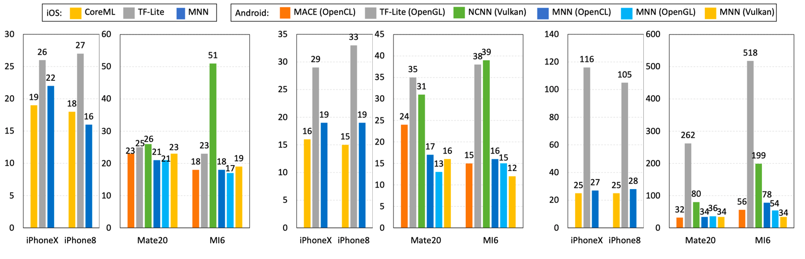

<!--Copyright © 适用于[License](https://github.com/chenzomi12/AISystem)版权许可-->

# 推理引擎架构（上）

在深入探讨推理引擎的架构之前，让我们先来概述一下推理引擎的基本概念。推理引擎作为人工智能系统中的关键组件，负责将训练好的模型部署到实际应用中，执行推理任务，从而实现智能决策和自动化处理。随着 AI 技术的快速发展，推理引擎的设计和实现面临着诸多挑战，同时也展现出独特的优势。本节将详细阐述推理引擎的特点、技术挑战以及如何应对这些挑战，为读者提供一个较为全面的视角。

## 推理引擎特点

推理引擎，作为人工智能和机器学习领域的重要组成部分，其设计目标在于提供一个灵活、高效且易于使用的平台，用于部署和运行已经训练好的模型，完成从数据输入到预测输出的全过程。推理引擎拥有轻量、通用、易用和高效四个特点：

- **轻量**:

  - **资源占用少**：轻量级推理引擎设计时会注重减少对计算资源（如 CPU、内存）的需求，使其能在低功耗设备上运行，如移动端设备、边缘计算节点等。

  - **体积小**：引擎本身的代码库和依赖较小，便于快速部署和更新，减少存储空间需求。

  - **快速启动**：启动速度快，能够迅速进入工作状态，这对于需要即时响应的应用场景尤为重要。

- **通用**:

  - **多模型支持**：支持广泛的机器学习和深度学习模型格式，包括但不限于 TensorFlow、PyTorch、ONNX 等，确保了不同框架训练的模型都能被兼容和部署。

  - **跨平台能力**：推理引擎能够在多种操作系统和硬件平台上运行，无论是 Linux、Windows 还是嵌入式系统，都能保证服务的连续性和一致性。

  - **广泛应用领域**：适用于图像识别、语音处理、自然语言处理等多个领域，满足不同行业和场景的 AI 应用需求。

- **易用**:

  - **简化部署流程**：提供简洁的 API 和工具链，使得用户无需深入了解底层技术细节即可快速部署模型。

  - **可视化工具**：很多推理引擎会配套图形界面或 Web 管理面板，便于用户监控模型性能、调整参数和管理服务。

  - **文档与社区支持**：良好的文档资料和活跃的开发者社区，可以帮助新用户快速上手，解决遇到的技术问题。

- **高效**:

  - **高性能推理**：通过优化算法、并行计算、硬件加速（如 GPU、TPU）等方式，最大化提升推理速度，降低延迟。

  - **资源管理**：动态调整计算资源分配，根据负载自动扩缩容，确保高吞吐量的同时，也保持资源使用效率。

  - **模型优化**：支持模型压缩、量化等技术，减小模型体积，提高推理效率，尤其适合资源受限环境。

其中，"易用"与"高效"两大特性尤为关键，它们直接关系到技术解决方案的普及度与实际成效。一方面，易用性确保了技术的可接近性，加速了 AI 解决方案从概念验证到生产环境的转化过程，是推动 AI 技术从实验室走向广泛商用的桥梁。另一方面，高效性关乎推理速度和延迟，还涉及到资源的有效管理与优化，不仅是技术实力的体现，也是实现商业价值最大化的关键所在。

### 轻量级

轻量级推理引擎的设计哲学围绕着“简约而不简单”的原则展开，旨在打造既功能完备又资源友好的解决方案，使之成为连接智能应用与广泛设备的桥梁。其核心优势不仅仅局限于体积小和资源占用低，更在于如何在有限的资源约束下，最大化地发挥出 AI 模型的潜力。

#### 零依赖

轻量级推理引擎从架构设计之初就追求极致的纯净与独立，确保主体功能无任何外部依赖。这意味着，它的代码库经过精心裁剪与优化，只保留最关键、最核心的部分，从而能够轻松部署到资源受限的环境中，比如移动设备、IoT 传感器、乃至各类嵌入式系统中。这种零依赖的特性，大大简化了部署流程，降低了维护成本，使得即便是计算和存储资源有限的设备也能享受到 AI 技术带来的便利。

#### Mini 编辑选项

为了进一步缩减推理引擎的体积，许多轻量级引擎引入了 Mini 编辑选项。这一创新机制允许开发者和用户根据实际应用场景的需要，定制化选择引擎中的组件和服务，剔除不必要的功能模块。这一灵活的配置方式，好比为引擎做了一次“精准减肥”，在不影响核心功能的前提下，大约能将原有库的体积再缩减一个可观的比例。对于那些极度重视存储空间的应用场景，如可穿戴设备或微型机器人，这一特性无疑是个巨大的福音。

#### 压缩与量化

面对模型体积大、部署不便的挑战，轻量级推理引擎通过支持 FP16/Int8 精度的模型更新与量化技术，巧妙地在模型精度与体积之间找到了平衡点。FP16（半精度浮点数）相较于传统的 FP32（单精度浮点数），可以将模型大小几乎减半，而 Int8（8 位整数）量化则更为激进，通常能将模型体积压缩至原始大小的 25% 到 50% 之间，同时尽量保持模型的预测精度。这种压缩与量化策略，在不牺牲过多性能的基础上，大幅提升了模型部署的便捷性，让即使是复杂的深度学习模型也能轻松运行在各种轻型设备上。

### 通用性

通用性作为推理引擎的核心特性之一，其设计目的旨在打破技术壁垒，实现无缝对接多样化需求，无论是在模型兼容性、网络结构支持、设备与操作系统适配性上，都展现了极高的灵活性与包容性，确保了 AI 技术在广阔的应用场景中畅通无阻。

#### 广泛兼容

推理引擎的通用性首先体现在对主流模型文件格式的广泛支持上，无论是 TensorFlow、PyTorch 这类深度学习领域的重量级框架，还是 MindSpore、ONNX 这样新兴的开放标准，都能被顺利读取与执行。这意味着开发者无需担心模型来源，可以自由选择最适合项目的训练工具，享受技术栈的多样性。此外，对于卷积神经网络(CNN)、循环神经网络(RNN)、生成对抗网络(GAN)、Transformer 等当前主流的网络结构，引擎均能提供全面的支持，满足从图像识别、自然语言处理到复杂序列生成等多样的任务需求。

#### 动态处理

在实际应用中，模型往往需要处理不同维度、多变的数据类型。通用性推理引擎通过支持多输入多输出、任意维度的输入输出配置，以及动态输入处理能力，为复杂模型部署提供了坚实的基础。特别是对于那些含有条件分支、循环等控制流逻辑的模型，引擎同样能提供有效支持，确保这些高级功能在推理阶段得到准确执行，这对于实现更智能化、适应性更强的应用至关重要。

#### 跨平台部署

从服务器集群到个人电脑，再到手机乃至嵌入式设备，通用性推理引擎的足迹遍布所有具备 POSIX 接口的计算平台。这种跨平台的能力不仅限于硬件层面，更深入到操作系统级别，无论是 Windows、iOS、Android 这样的消费级操作系统，还是 Linux、ROS（Robot Operating System）这类面向专业应用的操作系统，都能找到推理引擎的身影。这种广泛的兼容性，极大拓宽了 AI 技术的应用范围，无论是云端大规模服务、桌面应用程序，还是移动终端乃至物联网设备，都能轻松集成 AI 能力，释放智能潜能。

### 易用性

易用性是衡量一个 AI 推理引擎是否能够被广泛采纳和高效利用的关键指标。它不仅要求技术解决方案对用户友好，还要能够降低开发门槛，提高工作效率，让开发者能够聚焦于创新，推动 AI 技术的广泛应用。

#### 算子丰富

推理引擎内置了丰富的算子库，这些算子设计用于执行常见的数值计算任务，如矩阵运算、统计分析、线性代数操作等，其功能广泛覆盖了 numpy 这一科学计算库中的常用功能。这种设计让熟悉 numpy 的开发者能够无缝过渡，利用熟悉的语法快速实现数据预处理和后处理逻辑，无需从头学习新的数学运算方法，大大提升了开发效率与代码的可读性。此外，通过直接映射 numpy 接口，工程师可以轻松复用现有的 numpy 代码片段，减少重复工作，加速项目进度。

#### 特定模块支持

推理引擎会对特定领域，如针对计算机视觉(CV)和自然语言处理(NLP)这两大核心 AI 领域，提供专门的模块与工具包，封装大量经过优化的算法与模型，使得开发者能够快速搭建起复杂的应用系统。例如，在 CV 领域，引擎一般会包含了图像增强、目标检测、图像分类等预置模块；而在 NLP 方面，则会提供词嵌入、语义分析、机器翻译等功能。这些模块不仅简化了模型的构建过程，还通过高度优化的实现，保障了应用的性能表现，使得开发者能够更加专注于业务逻辑的实现，而非底层技术细节。

#### 跨平台训练能力

为了满足不同场景下模型开发的需求，推理引擎不仅支持模型的跨平台推理，还扩展到了模型训练阶段。无论开发者身处何种操作系统环境，都能够便捷地进行模型的训练与微调。这种灵活性意味着研究者可以在资源丰富的服务器上训练复杂模型，随后无缝迁移到其他平台进行测试或部署，极大地促进了研发流程的连贯性和效率。同时，跨平台训练支持也意味着团队成员即便使用不同的开发环境，也能保持工作的协同性，降低了协作成本。

#### 丰富的接口与文档

强大的 API 接口是推理引擎易用性的另一大体现。良好的 API 设计应当简洁直观，同时涵盖广泛的功能，允许开发者通过少量代码就能调用复杂的内部逻辑。从模型加载、数据输入输出，到模型预测、性能监控，每一个环节都应有详尽的 API 支持。此外，高质量的文档与示例代码是不可或缺的，它们能够帮助新用户迅速上手，也为资深开发者提供深入探索的路径。通过文档和教程，用户可以快速了解如何最有效地利用引擎的各项功能，从而缩短从想法到实现的距离。

### 高性能

高性能是推理引擎的灵魂，它直接决定了 AI 应用的响应速度、资源消耗以及用户体验。为了在多样化的硬件平台上实现最佳推理性能，推理引擎采用了多方面的策略和技术优化，确保在 iOS、Android、PC 等不同设备上，无论是哪种硬件架构或操作系统，都能充分挖掘设备潜能，实现高效运行。

#### 深度适配

针对不同设备的硬件架构和操作系统，推理引擎实现了精细的适配策略。这不仅仅是要支持在前几个小节中提到的“跨平台”，而是更进一步，无论是基于 ARM 还是 x86 的处理器，亦或是 iOS、Android、Windows、Linux 等操作系统，引擎都能智能识别并调整运行模式，确保在单线程下也能高效运行深度学习模型，逼近甚至达到设备的算力极限。这种深层次的适配不仅考虑了硬件的基本特性，还优化了系统调度，减少了不必要的开销，确保每一滴计算资源都被有效利用。

#### 定制优化

对于搭载 GPU、NPU 等加速芯片的设备，推理引擎进行了针对性的深度调优。例如，利用 OpenCL 框架对图形处理器进行极致的推理性能优化，确保计算密集型任务能够快速执行；而 Vulkan 方案则在减少初始化时间和优化渲染管道上展现出优势，特别适合需要快速启动和连续推理的场景。这些定制化的优化策略，确保了在各类加速硬件上的高效推理，进一步提升了整体性能表现。

- OpenCL (Open Computing Language) 是一种开放的、跨平台的标准，用于编写能够在不同类型的硬件平台上执行并行计算的程序。在深度学习推理场景中，OpenCL 能够充分发挥图形处理器的强大并行计算能力，通过直接访问底层硬件资源，实现对计算密集型任务的高度优化。开发者可以精细控制数据的分配、任务的调度以及内存管理，从而在图形处理器上实现高效的数据处理和计算。OpenCL 的核心优势在于其高度的灵活性和对计算资源的精细控制，使得针对特定模型或算法的优化成为可能，进而达到极致的推理性能。

- Vulkan 是新一代图形和计算 API，由 Khronos Group 开发，旨在提供更低的开销和更直接的硬件控制，以提高图形应用和游戏的性能与效率。尽管 Vulkan 最初设计用于图形渲染，但其高度模块化和低层特性同样适用于计算密集型任务，包括深度学习推理。Vulkan 的一大特点是减少了初始化时间和优化了渲染管道，这意味着在需要频繁启动和连续执行推理任务的场景下，Vulkan 能够更快地准备就绪并执行计算，减少了等待时间。此外，Vulkan 的高效内存管理和多线程设计也有助于提高整体的计算效率和响应速度，特别是在移动设备和实时应用中，这些特性显得尤为重要。

#### 低级优化

为了榨干硬件最后一丝算力，推理引擎在核心运算部分采用了 SIMD（单指令多数据）指令集和手写汇编代码。SIMD 技术允许一条指令同时对多个数据进行操作，大大提高了并行处理能力，尤其是在向量运算和矩阵乘法等常见于深度学习计算的任务中。而手写汇编则针对特定硬件指令集（如 ARMv8.2、AVX512）进行编码，通过直接控制硬件资源，实现了对特定 kernel 算法的性能优化，这在计算密集型任务中效果显著。

#### 多精度计算

针对不同场景的性能需求，推理引擎支持 FP32、FP16、INT8 等多种精度的计算模式。这种灵活性不仅有助于在保持模型预测精度的同时，显著降低计算和内存需求，还使得引擎能够更好地匹配不同硬件对精度支持的偏好。通过采用低精度计算，推理引擎能够在一些受支持的平台上实现更高的推理速度和能效比。

一款好的推理引擎可以为用户服务带来实质性的收益，如上图中展示的柱状图，每个柱状图代表不同推理引擎在不同型号手机上的性能对比。图中出现推理引擎有 NCNN、MACE、TF-Lite、CoreML 和 MNN。

- **NCNN**：NCNN 是由腾讯优图实验室开发的一个轻量级、高性能的神经网络推理框架，设计初衷是为了在移动端和嵌入式设备上实现极致的推理速度。它支持离线模型转换，能够直接加载和执行从 Caffe、TensorFlow、PyTorch 等框架训练得到的模型。NCNN 的一个显著特点是无第三方依赖，且完全针对移动端优化，通过直接利用 CPU 的 SIMD 指令集来实现高性能计算，同时支持 GPU 加速。它的设计使得开发者可以在没有 GPU 的情况下，仍然获得较快的推理速度。

- **MACE**：MACE 是小米推出的移动端 AI 计算引擎，全称为 Mobile AI Compute Engine。MACE 设计用于优化在移动设备上的深度学习模型推理效率，支持 CPU、GPU 和 DSP 等多种硬件加速。它提供了一套完整的模型转换工具链，能够将 Caffe、TensorFlow、PyTorch 等框架训练的模型转换成 MACE 的运行格式。MACE 通过高度优化的内核库和硬件加速，实现模型在移动端的高效运行，特别关注功耗和性能的平衡。

- **TF-Lite**：TF-Lite 是 Google TensorFlow 团队推出的一个轻量级解决方案，专为移动和嵌入式设备设计。它是 TensorFlow 框架的一个子集，专注于模型的推理部分，旨在提供低延迟和低功耗的机器学习推理。TF-Lite 支持模型量化和自定义算子，能够显著减少模型体积和提高运行效率。它支持 CPU、GPU 和 NNAPI（Android 神经网络 API）等多种后端，便于开发者根据设备特性选择最佳推理策略。

- **CoreML**：CoreML 是 Apple 为 iOS 设备设计的机器学习框架，支持在 iPhone 和 iPad 上运行预先训练好的机器学习模型，无需互联网连接。CoreML 不仅限于神经网络，还支持多种机器学习模型，如支持向量机、决策树等。它紧密集成于 iOS、macOS、watchOS 和 tvOS 生态系统中，提供了非常低的延迟和高效的推理性能，特别适合苹果生态内的应用开发。

- **MNN**：MNN 是阿里巴巴达摩院开发的轻量级深度学习推理引擎，旨在为移动端和边缘设备提供高性能的推理能力。MNN 在设计上特别聚焦于内部业务模型的优化，如针对人脸检测等任务进行了深度优化，能够在老旧的硬件上（如 iPhone 6）实现快速推理。它支持多平台部署，包括 iOS、Android、Linux 等，以及 CPU、GPU 等多种硬件加速。MNN 通过半自动搜索的方式优化模型执行，实现了模型和设备多样性的高效支持，同时保持了模型更新的灵活性。

## 推理引擎技术挑战

在 AI 技术的快速发展与普及过程中，推理引擎作为连接模型与实际应用的桥梁，面临着一系列复杂的技术挑战，这些挑战主要集中在需求复杂性与程序大小的权衡、算力需求与资源碎片化的矛盾，以及执行效率与模型精度的双重要求上。

### 需求复杂性与程序大小的权衡

随着 AI 应用领域的不断拓宽，模型的多样性和复杂度急剧增加，这给推理引擎提出了首个挑战：如何在有限的程序大小内实现对广泛模型的支持。AI 模型通常由成千上万的算子构成，涵盖了从基础的矩阵运算到复杂的卷积、递归网络等，而推理引擎必须设计出一套精简而又强大的算子集，用以模拟这些多样化的运算。这意味着引擎开发团队需要不断创新，通过算法优化、算子融合等技术，以少量的核心算子实现对各类模型的高效支持，同时还要考虑程序的可扩展性，以便未来容纳更多新型模型的接入，这无疑是一项既考验技术深度又考验策略智慧的任务。

应对 AI 推理引擎在需求复杂性与程序大小之间权衡的挑战，可以采取一系列综合策略和技术革新，确保在满足日益增长的模型复杂性需求的同时，保持程序的高效和精简：

- **模块化与插件化设计**：设计高度模块化的架构，使得每个模块专注于处理特定类型的计算或操作。这样不仅可以使核心程序保持精简，还能通过插件形式轻松添加或替换模块来支持新的模型或算子，增强系统的灵活性和可扩展性。

- **算子优化与融合**：深入分析模型中的算子，通过算法优化减少计算冗余，提高单个算子的执行效率。算子融合技术则是将多个连续且兼容的算子合并为一个，减少数据搬运和内存访问次数，从而在不增加程序大小的前提下提升运行速度。

- **动态编译与代码生成**：利用即时（JIT）编译或者静态编译时的优化技术，根据输入模型的具体结构动态生成最优化的执行代码。这种方法可以针对特定模型定制化生成执行逻辑，避免了通用解决方案带来的额外开销，有效平衡了性能与代码体积。

### 算力需求与资源碎片化的矛盾

AI 模型的运行离不开强大的计算资源支持，尤其是面对诸如图像识别、自然语言处理等高计算量任务时。然而，实际应用场景中计算资源往往是碎片化的，从高性能服务器到低功耗的移动设备，算力和内存资源差异巨大。推理引擎需要在这片资源的“拼图”中寻找最优解，既要保证模型的高效执行，又要适应各类硬件环境。这要求引擎具备出色的适配能力，包括但不限于硬件加速技术的运用（如 GPU、NPU 加速）、动态调整算法策略以适应不同计算单元，以及智能的资源调度算法，以确保在有限的资源下也能发挥出最大的算力效能。

应对 AI 推理引擎在算力需求与资源碎片化之间的矛盾，也有一些新兴的技术方案，实现灵活应对算力需求，实现高效、低耗的模型推理，满足不同场景下的应用需求：

- **模型分层与多级缓存**：将模型拆分为不同的计算层，每层根据其计算特性和资源需求部署在最适合的硬件上。采用多级缓存策略，减少跨硬件的数据传输延迟，提高整体执行效率。

- **自适应推理技术**：开发自适应推理算法，根据当前设备的硬件配置动态调整模型的精度与计算复杂度。例如，在资源有限的设备上运行轻量级模型或进行模型裁剪，而在资源丰富的环境中则加载完整模型以追求更高精度。

- **异构计算整合**：充分利用异构计算资源，通过有效的任务分解和负载均衡机制，将计算密集型任务分配给高性能硬件（如 GPU），而将控制流和轻量级计算留给 CPU，实现整体性能的最大化。

- **动态资源调度**：设计智能的资源调度算法，实时监控系统资源状态和任务队列，动态调整任务优先级和资源分配，确保高优先级或时间敏感型任务得到及时处理。

- **边缘计算与分布式推理**：利用边缘计算将部分计算任务从云端转移到靠近数据产生的边缘设备上，减少数据传输延迟。对于特别复杂的模型，可以采用分布式推理技术，将模型分割并在多台设备上并行计算，最后汇总结果。

### 执行效率与模型精度的双重要求

在追求高速推理的同时，保持模型预测的准确性是另一个核心挑战。一方面，为了提高执行效率，模型压缩、量化技术常被采用，这虽然能显著减少模型体积、加快推理速度，但可能以牺牲部分精度为代价。另一方面，业务场景往往对模型的精度有着严格要求，特别是在医疗诊断、金融风险评估等领域，任何微小的精度损失都可能导致重大后果。因此，推理引擎在设计上必须巧妙平衡这两方面的需求，通过算法优化、混合精度推理、以及对特定模型结构的定制优化等策略，力求在不明显影响模型精度的前提下，实现推理效率的最大化。这不仅是一个技术挑战，也是对工程实践智慧的考验，需要不断地试错、优化与迭代，以找到最合适的平衡点。

应对 AI 推理引擎在执行效率与模型精度的双重要求，则可以使用以下的关键策略，满足多样化业务场景的严苛要求：

- **知识蒸馏**：通过知识蒸馏技术，用一个大而精确的教师模型去训练一个较小的学生模型，让学生模型在保持较高精度的同时拥有更快的推理速度。这种方法可以在不直接牺牲模型精度的前提下，实现模型的小型化和效率提升。

- **量化与微调**：虽然量化技术会降低模型的精度，但通过细致的量化方案选择（如对敏感层采取不同的量化策略）和后续的微调步骤，可以在很大程度上恢复丢失的精度。微调过程可以让模型在量化后的新精度水平上重新学习，优化权重，最小化精度损失。

- **模型剪枝与稀疏化**：通过对模型进行剪枝，移除对最终预测贡献较小的权重或神经元，减少计算量。同时，利用稀疏计算技术进一步减少计算负担，许多现代硬件已支持高效的稀疏矩阵运算。精心设计的剪枝策略可以大幅降低计算需求而不显著影响模型表现。

- **缓存与预计算策略**：对频繁访问的数据或计算结果进行缓存，减少重复计算，特别是在循环或递归模型中。预计算某些静态或几乎不变的特征，进一步加速推理流程。

## 本节视频

<html>
<iframe src="https://player.bilibili.com/player.html?bvid=BV1Mx4y137Er&as_wide=1&high_quality=1&danmaku=0&t=30&autoplay=0" width="100%" height="500" scrolling="no" border="0" frameborder="no" framespacing="0" allowfullscreen="true"> </iframe>
</html>
