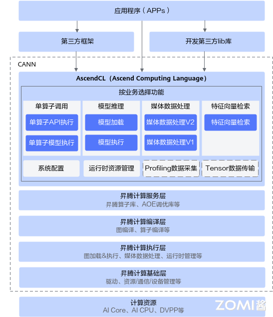
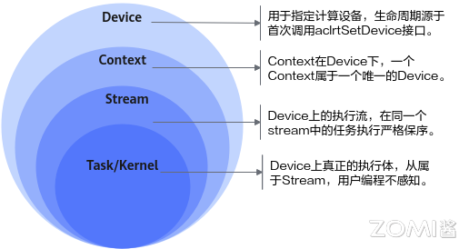
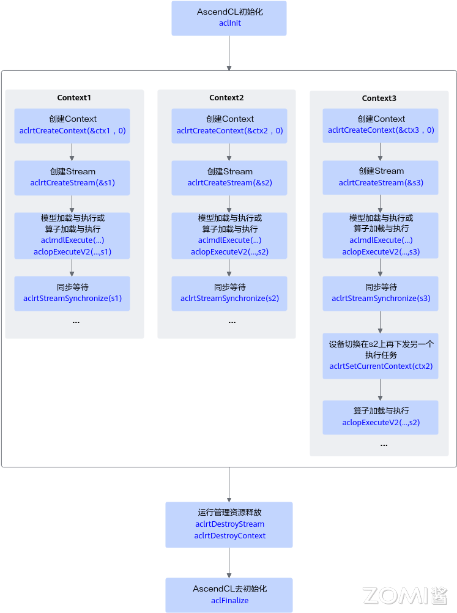
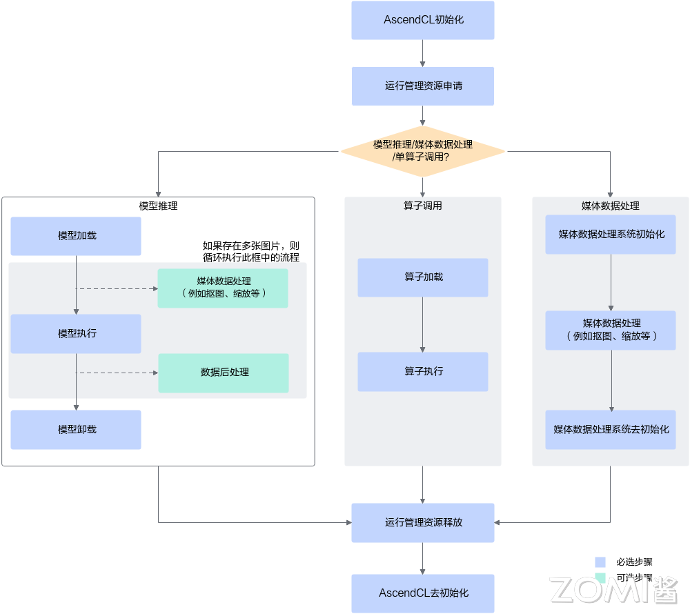

<!--适用于[License] (https://github.com/chenzomi12/AISystem/blob/main/LICENSE)版权许可-->

# 推理引擎示例：AscendCL

AscendCL 作为华为 Ascend 系列 AI 处理器的软件开发框架，为用户提供了强大的编程支持。通过 AscendCL，开发者可以更加高效地进行 AI 应用的开发和优化，从而加速 AI 技术在各个领域的应用和落地。AscendCL 的易用性和高效性，使得它成为开发 AI 应用的重要工具之一。

本节将介绍 AscendCL 的概念、优势、应用场景以及基本开发流程。

## AscendCL 基本介绍

AscendCL（Ascend Computing Language）是一套用于在昇腾平台上开发深度神经网络应用的 C 语言 API 库，提供运行资源管理、内存管理、模型加载与执行、算子加载与执行、媒体数据处理等 API，能够实现利用昇腾硬件计算资源、在昇腾 CANN 平台上进行深度学习推理计算、图形图像预处理、单算子加速计算等能力。

简单来说，就是统一的 API 框架，实现对所有资源的调用。其中，计算资源层是昇腾 AI 处理器的硬件算力基础，主要完成神经网络的矩阵相关计算、完成控制算子/标量/向量等通用计算和执行控制功能、完成图像和视频数据的预处理，为深度神经网络计算提供了执行上的保障。

### AscendCL 优势

AscendCL 优势主要有三个要点：

- 高度抽象：算子编译、加载、执行的 API 归一，相比每个算子一个 API，AscendCL 大幅减少 API 数量，降低复杂度。

- 向后兼容：AscendCL 具备向后兼容，确保软件升级后，基于旧版本编译的程序依然可以在新版本上运行。

- 零感知芯片：一套 AscendCL 接口可以实现应用代码统一，多款昇腾 AI 处理器无差异。

### AscendCL 应用场景

- 开发应用：用户可以直接调用 AscendCL 提供的接口开发图片分类应用、目标识别应用等。

- 供第三方框架调用：用户可以通过第三方框架调用 AscendCL 接口，以便使用昇腾 AI 处理器的计算能力。

- 供第三方开发 lib 库：用户还可以使用 AscendCL 封装实现第三方 lib 库，以便提供昇腾 AI 处理器的运行管理、资源管理等能力。

## 基本概念

| 概念                 | 描述                                                         |
| -------------------- | ------------------------------------------------------------ |
| 同步/异步            | 本文中提及的同步、异步是站在调用者和执行者的角度：若在调用 AscendCL 接口后**不等待**Device 侧的任务执行完成再返回，则表示调度是**异步**的；若在调用 AscendCL 接口后**需等待**Device 侧的任务执行完成再返回，则表示调度是**同步**的。 |
| 进程/线程            | 本文中提及的进程、线程，若无特别注明，则表示 Host 上的进程、线程。 |
| Host                 | Host 指与 Device 相连接的 X86 服务器、ARM 服务器，会利用 Device 提供的 NN（Neural-Network ）计算能力，完成业务。 |
| Device               | Device 指安装了昇腾 AI 处理器的硬件设备，利用 PCIe 接口与 Host 侧连接，为 Host 提供 NN 计算能力。若存在多个 Device，多个 Device 之间的内存资源不能共享。 |
| Context              | Context 作为一个容器，管理了所有对象（包括 Stream、Event、设备内存等）的生命周期。不同 Context 的 Stream、不同 Context 的 Event 是完全隔离的，无法建立同步等待关系。Context 分为两种：默认 Context：调用[aclrtSetDevice](https://www.hiascend.com/document/detail/zh/canncommercial/80RC1/apiref/appdevgapi/aclcppdevg_03_0038.html)接口指定用于运算的 Device 时，系统会自动隐式创建一个默认 Context，一个 Device 对应一个默认 Context，默认 Context 不能通过[aclrtDestroyContext](https://www.hiascend.com/document/detail/zh/canncommercial/80RC1/apiref/appdevgapi/aclcppdevg_03_0052.html)接口来释放。显式创建 Context：**推荐，**在进程或线程中调用[aclrtCreateContext](https://www.hiascend.com/document/detail/zh/canncommercial/80RC1/apiref/appdevgapi/aclcppdevg_03_0051.html)接口显式创建一个 Context。 |
| Stream               | Stream 用于维护一些异步操作的执行顺序，确保按照应用程序中的代码调用顺序在 Device 上执行。基于 Stream 的 kernel 执行和数据传输能够实现 Host 运算操作、Host 与 Device 间的数据传输、Device 内的运算并行。Stream 分两种：默认 Stream：调用[aclrtSetDevice](https://www.hiascend.com/document/detail/zh/canncommercial/80RC1/apiref/appdevgapi/aclcppdevg_03_0038.html)接口指定用于运算的 Device 时，系统会自动隐式创建一个默认 Stream，一个 Device 对应一个默认 Stream，默认 Stream 不能通过[aclrtDestroyStream](https://www.hiascend.com/document/detail/zh/canncommercial/80RC1/apiref/appdevgapi/aclcppdevg_03_0064.html)接口来释放。显式创建 Stream：**推荐，**在进程或线程中调用[aclrtCreateStream](https://www.hiascend.com/document/detail/zh/canncommercial/80RC1/apiref/appdevgapi/aclcppdevg_03_0060.html)接口显式创建一个 Stream。 |
| Event                | 支持调用 AscendCL 接口同步 Stream 之间的任务，例如同一个 Device 上的多个任务。例如，若 stream2 的任务依赖 stream1 的任务，想保证 stream1 中的任务先完成，这时可创建一个 Event，并将 Event 插入到 stream1，在执行 stream2 的任务前，先同步等待 Event 完成。 |
| AIPP                 | AIPP（Artificial Intelligence Pre-Processing）用于在 AI Core 上完成图像预处理，包括色域转换（转换图像格式）、图像归一化（减均值/乘系数）和抠图（指定抠图起始点，抠出神经网络需要大小的图片）等。AIPP 区分为静态 AIPP 和动态 AIPP。您只能选择静态 AIPP 或动态 AIPP 方式来处理图片，不能同时配置静态 AIPP 和动态 AIPP 两种方式。静态 AIPP：模型转换时设置 AIPP 模式为静态，同时设置 AIPP 参数，模型生成后，AIPP 参数值被保存在离线模型（*.om）中，每次模型推理过程采用固定的 AIPP 预处理参数（无法修改）。如果使用静态 AIPP 方式，多 Batch 情况下共用同一份 AIPP 参数。动态 AIPP：模型转换时设置 AIPP 模式为动态，每次模型推理前，根据需求，在执行模型前设置动态 AIPP 参数值，然后在模型执行时可使用不同的 AIPP 参数。如果使用动态 AIPP 方式，多 Batch 可使用不同的 AIPP 参数。 |
| 动态 Batch/动态分辨率 | 在某些场景下，模型每次输入的 batch size 或分辨率是不固定的，如检测出目标后再执行目标识别网络，由于目标个数不固定导致目标识别网络输入 BatchSize 不固定。动态 Batch：用户执行推理时，其 batch size 是动态可变的。动态分辨率: 用户执行推理时，每张图片的分辨率 H*W 是动态可变的。 |
| 动态维度（ND 格式）   | 为了支持 Transformer 等网络在输入格式的维度不确定的场景，需要支持 ND 格式下任意维度的动态设置。ND 表示支持任意格式，当前 N<=4。 |
| 通道                 | 在 RGB 色彩模式下，图像通道就是指单独的红色 R、绿色 G、蓝色 B 部分。也就是说，一幅完整的图像，是由红色绿色蓝色三个通道组成的，它们共同作用产生了完整的图像。同样在 HSV 色系中指的是色调 H，饱和度 S，亮度 V 三个通道。 |
| 标准形态             | 指 Device 做为 EP，通过 PCIe 配合主设备（X86、ARM 等各种服务器）进行工作，此时 Device 上的 CPU 资源仅能通过 Host 调用，相关推理应用程序运行在 Host。Device 只为服务器提供 NN 计算能力。 |
| EP 模式               | 以昇腾 AI 处理器的 PCIe 的工作模式进行区分，如果 PCIe 工作在从模式，则称为 EP 模式。 |
| RC 模式               | 以昇腾 AI 处理器的 PCIe 的工作模式进行区分，如果 PCIe 工作在主模式，可以扩展外设，则称为 RC 模式。 |

### Device、Context、Stream 关系

下面将会介绍 Device、Context 和 Stream 在 AscendCL 框架中的作用及其相互关系：

1. Device，用于指定计算设备。

Device 的生命周期源于首次调用 aclrtSetDevice 接口。每次调用 aclrtSetDevice 接口，系统会进行引用计数加 1；调用 aclrtResetdevice 接口，系统会进行引用计数减 1。当引用计数减为零时，在本进程中 Device 上的资源不可用。

2 Context，在 Device 下，一个 Context 一定属于一个唯一的 Device。

Context 分隐式创建和显式创建。隐式创建的 Context（即默认 Context），生命周期始于调用 aclrtSetDevice 接口，终结于调用 aclrtResetdevice 接口使引用计数为零时。隐式 Context 只会被创建一次，调用 aclrtSetDevice 接口重复指定同一个 Device，只增加隐式创建的 Context 的引用计数。

显式创建的 Context，生命周期始于调用 aclrtCreateContext 接口，终结于调用 aclrtDestroyContext 接口。若在某一进程内创建多个 Context（Context 的数量与 Stream 相关，Stream 数量有限制，请参见 aclrtCreateStream），当前线程在同一时刻内只能使用其中一个 Context，建议通过 aclrtSetCurrentContext 接口明确指定当前线程的 Context，增加程序的可维护性。

值得注意的是，进程内的 Context 是共享的，可以通过 aclrtSetCurrentContext 进行切换。

3. Stream，是 Device 上的执行流，在同一个 stream 中的任务执行严格保序。

其 Stream 分隐式创建和显式创建。每个 Context 都会包含一个默认 Stream，这个属于隐式创建，隐式创建的 stream 生命周期同归属的 Context。

用户可以显式创建 stream，显式创建的 stream 生命周期始于调用 aclrtCreateStream，终结于调用 aclrtDestroyStream 接口。显式创建的 stream 归属的 Context 被销毁或生命周期结束后，会影响该 stream 的使用，虽然此时 stream 没有被销毁，但不可再用。

4. Task/Kernel，是 Device 上真正的任务执行体。

### 线程、Context、Stream 关系

一个用户线程一定会绑定一个 Context，所有 Device 的资源使用或调度，都必须基于 Context。一个线程中当前会有一个唯一的 Context 在用，Context 中已经关联了本线程要使用的 Device。此时可以通过 aclrtSetCurrentContext 进行 Device 的快速切换。

一个线程中可以创建多个 Stream，不同的 Stream 上计算任务是可以并行执行；多线程场景下，推荐每个线程创建一个 Stream，线程之间的 Stream 在 Device 上相互独立，每个 Stream 内部的任务是按照 Stream 下发的顺序执行。

多线程的调度依赖于运行应用的操作系统调度，多 Stream 在 Device 侧的调度，由 Device 上调度组件进行调度。

### 进程内多线程间 Context 切换

- 一个进程中可以创建多个 Context，但一个线程同一时刻只能使用一个 Context。
- 线程中创建的多个 Context，线程缺省使用最后一次创建的 Context。
- 进程内创建的多个 Context，可以通过 aclrtSetCurrentContext 设置当前需要使用的 Context。

### 默认 Context 和默认 Stream

Device 上执行操作下发前，必须有 Context 和 Stream，这个 Context、Stream 可以显式创建，也可以隐式创建。隐式创建的 Context、Stream 就是默认 Context、默认 Stream。

> 默认 Stream 作为接口入参时，直接传 NULL。

默认 Context 不允许用户执行 aclrtGetCurrentContext 或 aclrtSetCurrentContext 操作，也不允许执行 aclrtDestroyContext 操作。

默认 Context、默认 Stream 一般适用于简单应用，用户仅仅需要一个 Device 的计算场景下。多线程应用程序建议全部使用显式创建的 Context 和 Stream。

### 多线程、多 Stream 性能考虑

线程调度依赖运行的操作系统，Stream 上下发了任务后，Stream 的调度由 Device 的调度单元调度，但如果一个进程内的多 Stream 上的任务在 Device 存在资源争抢的时候，性能可能会比单 Stream 低。

当前昇腾 AI 处理器有不同的执行部件，如 AI Core、AI CPU、Vector Core 等，对应使用不同执行部件的任务，建议多 Stream 的创建按照算子执行引擎划分。

单线程多 Stream 与多线程多 Stream（一个进程中可以包含多个线程，每个线程中一个 Stream）性能上哪个更优，具体取决于应用本身的逻辑实现，一般来说前者性能略好，原因是相对后者，应用层少了线程调度开销。

## 基本开发流程

调用 AscendCL 接口，可开发包含模型推理、媒体数据处理、单算子调用等功能的应用，这些功能可以独立存在，也可以组合存在。下图给出了使用 AscendCL 接口开发 AI 应用的整体接口调用流程。

上图根据应用开发中的典型功能抽象出主要的接口调用流程。例如，如果模型对输入图片的宽高要求与用户提供的源图不一致，则需要媒体数据处理，将源图裁剪成符合模型的要求；如果需要实现模型推理的功能，则需要先加载模型，模型推理结束后，则需要卸载模型；如果模型推理后，需要从推理结果中查找最大置信度的类别标识对图片分类，则需要数据后处理。

其基本流程如下所示：

1. AscendCL 初始化：调用 aclInit 接口实现初始化 AscendCL。

2. 运行资源管理申请：申请运行管理资源（Device、Context、Stream 等）的具体流程。

3. 具体计算：分为模型推理/单算子调用/媒体数据处理三部分。

   - 模型推理
      - 模型加载：模型推理前，需要先将对应的模型加载到系统中。注意加载模型前需要有适配昇腾 AI 处理器的离线模型。
      - （可选）媒体数据处理：可实现 JPEG 图片编/解码、视频解码、抠图/图片缩放/格式转换等功能。
      - 模型执行：使用模型实现图片分类、目标识别等推理功能。
      - （可选）数据后处理：处理模型推理的结果，此处根据用户的实际需求来处理推理结果，例如用户可以将获取到的推理结果写入文件、从推理结果中找到每张图片最大置信度的类别标识等。
      - 模型卸载：调用 aclmdlUnload 接口卸载模型。
   
   - 算子调用
      - 如果 AI 应用中不仅仅包括模型推理，还有数学运算（例如 BLAS 基础线性代数运算）、数据类型转换等功能，也想使用昇腾的算力，直接通过 AscendCL 接口加载并执行单个算子，省去模型构建、训练的过程，相对轻量级，又可以使用昇腾的算力。
      - 另外，自定义的算子，也可以通过单算子调用的方式来验证算子的功能。

4. 运行管理资源释放：所有数据处理都结束后，需要依次释放运行管理资源。

5. AscendCL 去初始化：调用 aclFinalize 接口实现 AscendCL 去初始化。

## 小结与思考

- 高度抽象与兼容性：AscendCL 通过统一的 API 框架简化了算子编译、加载和执行过程，减少了 API 数量，降低了开发复杂度，并确保了向后兼容性，使得基于旧版本编译的程序可以运行在新版本上。

- 多场景应用：AscendCL 支持多种应用场景，包括直接开发图片分类和目标识别等应用，供第三方框架调用以使用昇腾 AI 处理器的计算能力，以及封装实现第三方库以提供运行管理和资源管理能力。

- 资源管理与开发流程：AscendCL 提供详细的资源管理机制，包括 Device、Context 和 Stream 的概念和关系，以及如何显式创建和管理这些资源。基本开发流程涵盖从 AscendCL 初始化、资源申请、模型推理或单算子调用、数据处理到资源释放和去初始化的完整过程。