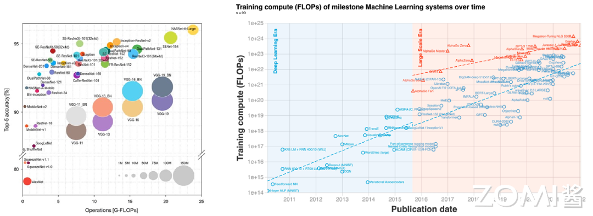

<!--Copyright © XcodeHW 适用于[License](https://github.com/chenzomi12/AISystem)版权许可-->

# 推理参数

本节将介绍 AI 模型网络参数方面的一些基本概念，以及硬件相关的性能指标，为后面让大家更了解模型轻量化做初步准备。值得让人思考的是，随着深度学习的发展，神经网络被广泛应用于各种领域，模型性能的提高同时也引入了巨大的参数量和计算量（如下图右所示），一般来说模型参数量越大，精度越高，性能越好(如下图左所示)。

但由于大部分的深度神经网络模型的参数量很大，无法满足直接部署到移动端的条件，因此在不严重影响模型性能的前提下对模型进行重新设计，来减少网络参数量和计算复杂度，提升运算能力是目前相当热门的研究方向。同时也希望在后续的章节中，让大家更了解模型轻量化的一些经典网络结构。

## 复杂度分析

模型参数量和计算量是两个重要的考量因素。模型参数量指的是模型中的参数数量，对应于数据结构中空间复杂度的概念。而计算量则对应于时间复杂度的概念，与网络执行时间的长短有关。

计算量和复杂度的衡量指标主要是 FLOPs（浮点运算次数），FLOPS（每秒所执行的浮点运算次数），MACCs（乘-加操作次数），Params（模型含有多少参数），MAC（内存访问代价），内存带宽（内存带宽），下面将对每个计算指标进行详细讲解。

### FLOPs

FLOPs 是 floating point operations 的缩写（s 表复数），指浮点运算次数，可以用来衡量算法/模型的复杂度，表示计算量。论文中常用的还有 GFLOPs 和 TFLOPs。

### FLOPS

每秒所执行的浮点运算次数（Floating-point Operations Per Second），理解为计算速度，是一个衡量硬件性能/模型速度的指标，即一个芯片的算力。

### 单位换算

- 一个 MFLOPS（MegaFLOPS）等于每秒一百万（$=10^{6}$）次浮点运算。

- 一个 GFLOPS（GigaFLOPS）等于每秒十亿（$=10^{9}$）次浮点运算。

- 一个 TFLOPS（TeraFLOPS）等于每秒一万亿（$=10^{12}$）次浮点运算。

- 一个 PFLOPS（PetaFLOPS）等于每秒一千万亿（$=10^{15}$）次浮点运算。

- 一个 EFLOPS（ExaFLOPS）等于每秒一百京（$=10^{18}$）次浮点运算。

- 一个 ZFLOPS（ZettaFLOPS）等于每秒十万京（$=10^{1}$）次浮点运算。

GFLOPS 就是 Giga FLoating-point Operations Per Second，即每秒 10 亿次浮点运算，常作为 GPU 性能参数但不一定代表 GPU 的实际表现，因为还要考虑具体如何拆分多边形和像素、以及纹理填充，理论上该数值越高越好。1GFLOPs = 1000MFLOPs。

### MACCs

乘-加操作次数（Multiply-accumulate Operations），MACCs 大约是 FLOPs 的一半，将 $w*x+b$ 视为一个乘法累加或 1 个 MACC。

### MAdds

MACs 全称 Multiply–Accumulate Operations，即乘加累积操作，**1MACs 包含一个乘法操作与一个加法操作，大约包含 2FLOPs**。通常 MACs 与 FLOPs 存在一个 2 倍的关系，而 MACs 和 MAdds 是同一个含义。
关于神经网络利用率

假设用一个简单的 CNN 网络做 forward 时，对于硬件资源的利用情况称之为利用率，所以利用率的计算简单描述为：

- 计算网络的计算量，通常是乘累加的次数

- 测量网络运行耗时

- 乘累加次数除以耗时，计算该网络的 GFLOPS

- 用计算的网络 GFLOPS 除以硬件资源的理论 GFLOPS，即利用率

### Params

模型含有多少参数，直接决定模型的大小，也影响推断时对内存的占用量，单位通常为 M，通常参数用 float32 表示，所以模型大小是参数数量的 4 倍。

### MAC

内存访问代价（Memory Access Cost），指的是输入单个样本，模型/卷积层完成一次前向传播所发生的内存交换总量，即模型的空间复杂度，单位是 Byte。

### 内存带宽

内存带宽决定了它将数据从内存（vRAM）移动到计算核心的速度，是比计算速度更具代表性的指标，内存带宽值取决于内存和计算核心之间数据传输速度，以及这两个部分之间总线中单独并行链路数量。

### 神经网络的计算量

网络前向计算时，卷积运算占据耗时 90%以上。重点关注下如何计算卷积的运算量。为简化问题，以下讨论认为：卷积采用滑动窗口且忽略非线性计算的开销。

假设对于 CNN 网络，有卷积层的参数包括：输入 feature map 的 Cin，宽 Hin，高 Win，输出 feature map 的 Cout，宽 Hout，高 Wout，卷积核的尺寸 K，卷积核通道等于 Cin，卷积核个数等于 Cout。

则该卷积核与 feature map 做卷积的运算量为：

$$
W_{out}=W_{in}/strie_{w},H_{out}=H_{in}/stride_{h}
$$

$$
FLOP_{s}=(K*K*C_{in}*2+1)*W_{out}*H_{out}*C_{out}
$$

其中的 1 表示偏置量。偏置值每个卷积核对应 1 个，共有 Cout 个。

## 典型结构对比

下面将会对神经网络模型的典型结构的参数进行对比，标注其参数计算方式。

### 标准卷积层

- Params

模型参数量计算公式为：

$$
k_{h}\times k_{w}\times c_{in}\times c_{out}
$$

其中 $k_{h}$ 是卷积核的高度，$k_{w}$ 是卷积核的宽度； $c_{in}$ 是输入的通道数； $c_{out}$ 是输出的通道数

- FLOPs

浮点运算数即计算量。可以用来衡量算法/模型的复杂度，公式如下:

$$
k_{h}\times k_{w}\times c_{in}\times c_{out}\times H \times W
$$

其中 $k_{h}$ 与 $k_{w}$ 分别为卷积核的高宽,$c_{in}$ 与 $c_{out}$ 分别是输入输出维度。

### Group 卷积

- Params

$$
(k_{h}\times k_{w}\times c_{in}/g\times c_{out}/g)\times g  = k_{h}\times k_{w}\times c_{in}\times c_{out}/g
$$

- FLOPs

$$
k_{h}\times k_{w}\times c_{in}\times c_{out}\times H \times W /g
$$

### Depth-wise 卷积

- Params

$$
k_{h}\times k_{w}\times c_{in}\times c_{out}/c_{in} = k_{h}\times k_{w}\times c_{out}
$$

- FLOPs

$$
k_{h}\times k_{w}\times c_{out}\times H \times W
$$

### 全连接层 FC

- Params
$$
c_{in}\times c_{out}
$$

- FLOPs

$$
c_{in}\times c_{out}
$$

其中 $c_{in}$ 与 $c_{out}$ 分别是输入输出维度。

## 小结与思考

- 神经网络模型性能提升伴随着参数量和计算量的大幅增加，导致模型难以部署到资源受限的移动端，因此模型轻量化成为研究热点。

- 模型的计算复杂度主要通过参数量、FLOPs、MACCs 等指标衡量，这些指标影响模型的运算能力和硬件资源的利用率。

- 神经网络模型的典型结构，如标准卷积层、Group 卷积、Depth-wise 卷积和全连接层，具有不同的参数量和 FLOPs 计算公式，对模型大小和运算效率有直接影响。

## 本节视频

<html>
<iframe src="https://player.bilibili.com/player.html?bvid=BV1KW4y1G75J&as_wide=1&high_quality=1&danmaku=0&t=30&autoplay=0" width="100%" height="500" scrolling="no" border="0" frameborder="no" framespacing="0" allowfullscreen="true"> </iframe>
</html>
