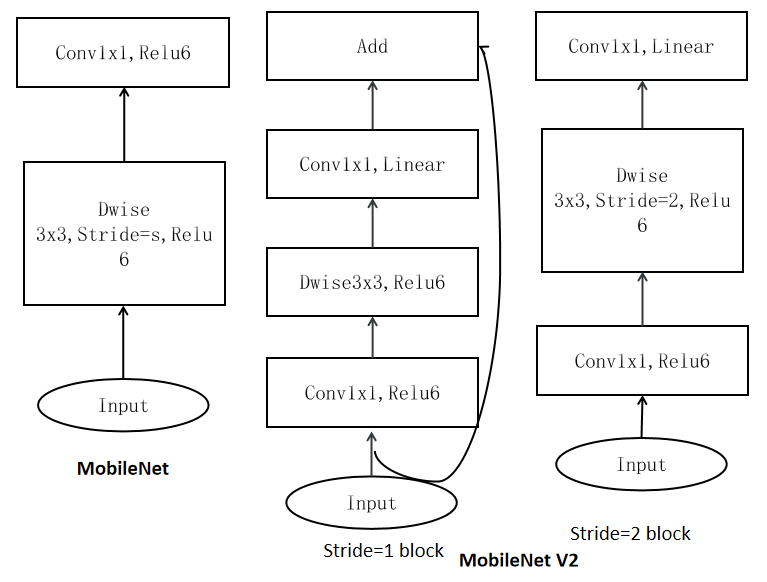
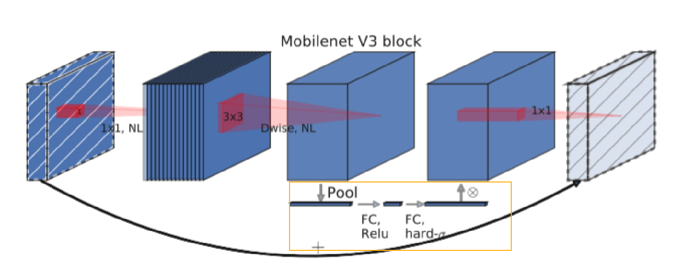
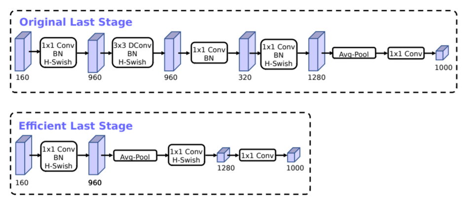

<!--适用于[License](https://github.com/chenzomi12/DeepLearningSystem/blob/main/LICENSE)版权许可-->

# CNN 模型小型化（上）
深度神经网络模型被广泛的应用于工业领域，并取得了巨大成功。然而，由于存储空间以及算力的限制，大而复杂的神经网络模型是难以被应用的。首先由于模型过于庞大，面临内存不足的问题。其次某些场景要求低延迟，或者响应要快。所以，研究小而高效的 CNN 模型至关重要。

本章将介绍一些常见的 CNN 小型化结构，如：SqueezeNet 系列(2016)，ShuffleNet 系列(2017)，MobileNet 系列(2017)，ESPNet 系列(2018)，FBNet 系列(2018)，EfficientNet 系列(2019)，GhostNet 系列(2019)。

## SqueezeNet 系列(2016)

### 贡献概述

**SqueezeNet**:是轻量化主干网络中比较著名的，它发表于 ICLR 2017，在达到了 AlexNet 相同的精度的同时，只用了 AlexNet 1/50 的参数量。SqueezeNet 核心贡献在于使用 **Fire Module**(如下图所示)，即使用 1x1 卷积降低通道数目(squeeze)，然后用 1x1 和 3x3 卷积提升通道数(expand)。

### 设计思路

SqueezeNet 算法的主要目标是构建轻量参数的 CNN 架构，同时不损失精度。为了实现这一目标，作者总共采用了三种策略来设计 CNN 架构，具体如下：

- **将 3×3 卷积替换成 1×1 卷积，可以使参数量减少 9 倍**。

- **减少 3×3 卷积的通道数，一个 3×3 卷积的计算量是 3 × 3 × M × N ，通过将 M 和 N 减少以降低参数数量**。

- **将下采样操作延后，这样卷积层就有了大的激活图，保留更多信息**。

### 网络结构

在**Fire Module**的基础上搭建 SqueezeNet 神经网络,结构如下图所示。它以卷积层开始，后面是 8 个 Fire Module，最后以卷积层结束，每个 Fire Module 中的通道数目逐渐增加，另外网络在 conv1、fire4、fire8、conv10 的后面使用了 最大池化。

### 总结

SqueezeNet 通过更深的网络置换更多的参数，虽然有更低的参数量，但是网络的测试阶段耗时会增加，当然 SqueezeNet 也影响了后续的一些工作。

### 改进版本(SqueezeNext)

**SqueezeNext**:设计基于残差结构并使用了分离卷积，采用了降低参数的策略:

- 采用 **two-stage bottleneck modules**来减少权值参数，即采用两个 1x1 的 Conv，使得参数显著减少。

- **Low Rank Filters** 低秩分解的核心思想就是将大矩阵分解成多个小矩阵，这里使用 Canonical Polyadic Decomposition，将 KxK 卷积，参数量能从$k^2$降为 2K，在 SqueezeNext 中也加入了 Shortut Connection。

SqueezeNext 的 block，下图所示

- **两个 1x1 的 Conv 以减少参数**。

- **3x3 卷积变成 1x3 卷积与 3x1 卷积的组合**。

### 总结

SqueezeNext 使用标准卷积，对网络整体结构的进行了优化，但性能并没有落后。

- **优点:方便移植部署**。

- **缺点:SqueezeNext 使用广泛度小**。

## ShuffleNet 系列(2017)

### 贡献概述

**ShuffleNet**: 发表于 CVPR2018，针对极小的网络上的计算效率依然不高，1x1 卷积又特别消耗计算资源。它的贡献在于，使用 Point-Wise 分组卷积和 Channel Shuffle 两个操作，在降低计算量同时保持准确率。网络使用更多的通道来帮助编码阶段提取更多的信息，同时又针对小网络提出了 ShuffleNet Unit,主要策略如下:

- **使用 Pointwise Group Convolution 卷积来降低 1x1 卷积的计算量**。

- **使用 Channel Shuffle 让不同通道的进行信息交互**。

- **使用 ShuffleNet Unit 来构建小模型**。

### 网络结构

#### Pointwise Group Convolution 与 Channel Shuffle

一般采用更稀疏的通道策略来解决 1x1 卷积带来的计算量问题，比如在 1x1 卷积内部也使用分组卷积。但由于 1x1 卷积的输出会是下一层 block 的输入，当在 1x1 卷积中使用分组策略，则 1x1 瓶颈层的输出特征的每个通道并没有接收其他前面的所有输入(如图 a)。为了解决图 a 中的问题，将每个组再细分，细分后放入不同的组内(图 b)，这个过程可以叫做 Channel Shuffle，打乱后如图 c 所示。

#### ShuffleNet Unit

基于残差块（residual block）和 通道洗牌（channel shuffle）设计的 `ShuffleNet Unit` ：

- **深度卷积 **。

- **逐点分组卷积**。

- **逐点分组卷积 ( stride=2 )**。

### 总结

- **优点：极大减小计算量**。

- **缺点：边界效应产生，即某个输出 channel 仅仅来自输入 channel 的一小部分**。

### 改进版本(ShuffleNet V2)

**ShuffleNet V2**:在 V1 的 Channel Shuffle 的基础上，又提出了 Channel Split，增强特征的重用性的同时也减少了计算量，并提出了 4 条设计高效网络的方法：

- **G1：输入输出通道相同的时候，MAC 最小，模型最快**。

- **G2：当分组卷积的分组数增大时(保持 FLOPs 不变时)，MAC 也会增大，所以建议针对不同的硬件和需求，更好的设计对应的分组数，而非盲目的增加**。

- **G3：网络设计的碎片化程度越高，速度越慢**。

- **G4：不要过多的使用逐点运算**。

ShuffleNet V2 中提出了 Channel Split，如图 c、d 所示。在每个单元的开始将通道拆分为 2 个分支，一个分支做恒等映射，另一个分支经过多层卷积保证输入通道数与输出通道数相同。不同于 ShuffleNet V1 ，ShuffleNet V2 的 1×1 没有再使用分组卷积，两条分支最后使用通道级联 concatenate 操作，没有使用 TensorAdd。

### 总结

- **优点:ShuffleNetV2 通过引入逐通道组卷积和通道重排操作，减少了模型的计算量和参数数量。显著减小模型的大小和计算资源的使用。逐通道组卷积和通道重排操作的引入使得 ShuffleNetV2 能够在计算资源有限的情况下，仍然保持较高的准确率。结构具有较强的可扩展性，通过调整分组数和通道数的大小，可以满足不同的计算资源限制和应用场景需求**。

- **缺点：特征表示能力相对有限，由于 ShuffleNetV2 采用了逐通道组卷积和通道重排操作，模型的信息传递能力有一定的限制。相对于一些更深层次的模型，在某些复杂任务上表现不如其他模型。由于网络结构相对较浅，对于小目标的检测效果可能不如一些更深层次的模型**。

## MobileNet 系列(2017)

### 贡献概述

**MobileNet**系列:主要是为了在保持模型性能的前提下降低模型大小，同时可以提升模型速度，主要有 V1，V2，V3 版本。

### 网络结构

#### MobileNet v1

主要贡献在于提出了 Depthwise Separable Convolutions（深度可分离卷积），深度可分离卷积主要包括两种卷积变体，逐通道卷积（Depthwise Convolution）和逐点卷积（Pointwise Convolution）。

##### 逐通道卷积（Depthwise Convolution）

Depthwise Convolution 的一个卷积核只有一个通道，输入信息的一个通道只被一个卷积核卷积，这个过程产生的 feature map 通道数和输入的通道数完全一样，如下图所示：

##### 逐点卷积（Pointwise Convolution）
Pointwise Convolution 的本质就是 1X1 的卷积，它的卷积核的尺寸为 1×1×M，M 为上一层输出信息的通道数。所以这里 Pointwise Convolution 的每个卷积核会将上一步的特征图在通道方向上进行加权组合，生成新的特征图，如下图所示：

##### MBconv

MBconv 由 Depthwise Convolution，BN，ReLU 组成，基本结构如下图右面所示：

整体网络就是通过不断堆叠 MBconv 组件，这种深度可分离卷积的操作方式在减少计算量的同时保持了模型的表达能力。

##### 分别是宽度乘子（α）和分辨率乘子（ρ）

宽度和分辨率调整系数用于调整模型的大小和计算复杂性。
- **宽度系数（α）：宽度系数是一个介于 0 和 1 之间的比例因子。通过降低每个卷积层的通道数，可以减少模型中的参数数量和计算量，从而使模型更轻量化**。
- **分辨率系数（ρ）：分辨率系数是一个介于 0 和 1 之间的比例因子。通过降低输入图像的分辨率，可以减少卷积操作的计算量和内存消耗**。

### 总结

- **优点: 采用深度可分离卷积将传统卷积分解为两个独立操作，大幅减少了计算复杂性和参数数量，降低了计算成本和存储需求。引入宽度和分辨率调整系数来调整模型的大小和计算复杂性。用户可以根据设备性能和应用场景选择合适的参数，权衡模型精度和速度。低延迟、低计算资源占用，适合实时应用和边缘计算**。

- **缺点: depthwise 部分的卷积核容易废掉，即卷积核参数大部分为零**。

### 改进版本(MobileNet V2)

2018 年在 MobileNet V1 的基础上又提出了改进版本 MobileNet V2，V2 中主要用到了 Inverted Residuals 和 Linear Bottlnecks。

### 网络结构

#### Inverted Residuals

在 Inverted Residual block 中，3x3 卷积变成 Depthwise 了，计算量更少了，通过 1x1 卷积先提升通道数，再 Depthwise 3x3 卷积，最后用 1x1 卷积降低通道数。两端的通道数都很小，所以整体计算量并不大。

#### Linear Bottleneck

Linear Bottlnecks 上面的 Inverted Residuals block 中的 bottleneck 处的 ReLU 去掉。整体的网络模型就是由堆叠下图右图的 Bottlenecks 搭建成的。

#### 关于 ReLU6

卷积之后通常会接一个 ReLU 非线性激活，在 MobileNet 中使用 ReLU6。ReLU6 在普通的 ReLU 基础上限制最大输出为 6，这是为了在移动端设备 float16/int8 的低精度的时候也能有很好的数值分辨率。如果对 ReLU 的激活范围不加限制，输出范围为 0 到正无穷，如果激活值非常大，分布在一个很大的范围内，则低精度的 float16/int8 无法很好地精确描述如此大范围的数值，带来精度损失。

### 总结

- **优点:通过采用 Inverted Residuals 和 Linear Bottlnecks 方法,相比 MobileNet V1，MobileNet V2 在保持轻量化、低延迟和低计算资源占用的基础上，进一步提升了性能**。

- **缺点:MobileNetV2 集中于瓶颈结构的网络连接方式可能会造成优化过程中的梯度回传抖动，进而影响模型收敛趋势，导致模型性能降低**。

### 改进版本(MobileNet V3)

### 网络结构

MobileNetV3 的整体架构基本沿用了 MobileNetV2 的设计，采用了轻量级的深度可分离卷积和残差块等结构，依然是由多个模块组成，但是每个模块得到了优化和升级。主要贡献点在于:

- **神经网络搜索技术:由资源受限的 NAS 执行模块级搜索，NetAdapt 执行局部搜索**。

- **网络结构改进:将最后一步的平均池化层前移并移除最后一个卷积层，引入 h-swish 激活函数**。

#### SE 结构

首先使用一个全局池化层将每个通道变成一个具体的数值，然后接两个全连接层，最后通过一个 H-Sigmoid 函数获取最终的权重，赋值给最初的特征图。

#### 重新设计耗时层结构

首先，减少网络第一个卷积层的卷积核个数，从 32 减到 16，然后精简了最后的 Stage，将原来搜索到的最后阶段的人工精简，删除了多余的卷积层，将延迟较少了 7 毫秒，将近全部运行时间的 11%，并减少了 3000 万的乘加操作次数，几乎没有损失准确性。

#### 重新设计激活函数

引入新的非线性激活函数：h-swish。swish 公式：

$$
Swish x = x*α(x)
$$

这里σ(x)是 sigmoid 函数。swish 虽然提高了精度，但 sigmoid 函数计算是极为昂贵的，在嵌入式移动端不适合它的存在，因此，MobileNet_V3 提出了计算更为简便的 h-swish 函数，其定义如下：

$$
h-swish[x] = x\frac{ReLU6(x+3)}{6}
$$

#### NAS 搜索全局结构（Block-wise Search）

采用 NSA 方法来搜寻全局网络结构，另外需要针对轻量模型进行优化，用一个多目标奖励。

$$
{ACC(m)x[LAT(m)/TAR]}^{w}
$$

来近似 pareto 最优解，根据目标延迟 TAR 为每个模型 m 平衡模型精度 ACC(m)和延迟 LAT(m)。用较小的权重因子 w =-0.15 来弥补不同的延迟的更大精度变化。从头训练了一个新的架构搜索，找到了初始的 seed 模型，然后应用 NetAdapt 和其他优化来获得最终的 MobilenetV3-Small 模型。

#### NetAdapt 搜索层结构（Layer-wise Search）

$$
\frac{ΔACC}{ΔLatency}
$$

给定一个 K conv and FC layers 的网络 Net，在每一步的结构更改中，需要减少一个给定个值 deltaR，然后调整每层的卷积核数，生成一个 Net_simp 集合，从中找到目标延时的网络。保持循环，直到满足给定条件后 finetune 网络。V3 用了两种减少延迟的方法来产生网络：

- **减少 expansion layer 的 size**。

- **减少所有共享相同 bottleneck size 模块的瓶颈**。

##### 总结

- **优点:MobileNetV3 large 采用轻量级设计具有很快的推理速度，扩展性较好，准确率高。MobileNetV3 small 推理速度更快，体积更小**。

- **缺点:MobileNetV3 large 模型较大，计算量较大。MobileNetV3 small 精度度较低，设计简单扩展性较差**。

<html>

<iframe src="https://player.bilibili.com/player.html?bvid=BV1Y84y1b7xj&as_wide=1&high_quality=1&danmaku=0&t=30&autoplay=0" width="100%" height="500" scrolling="no" border="0" frameborder="no" framespacing="0" allowfullscreen="true"> </iframe>

</html>

