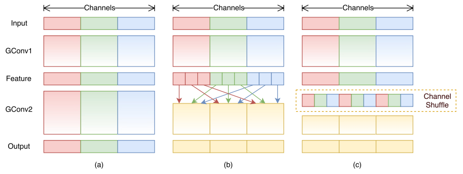
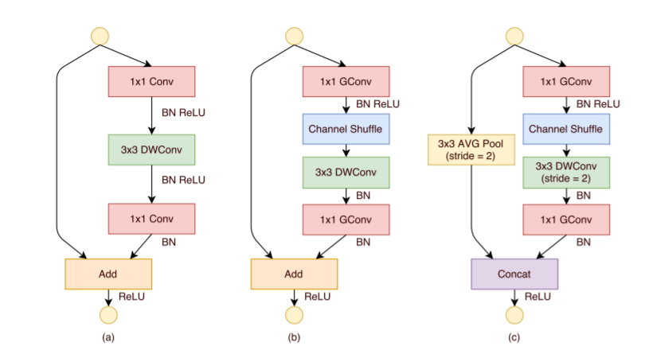
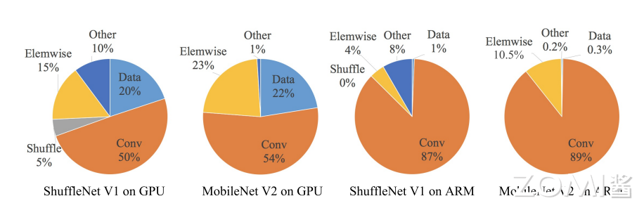
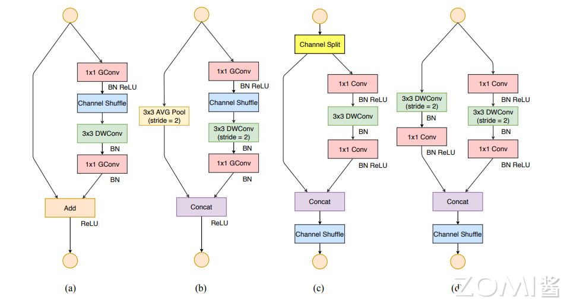

<!--Copyright © XcodeHw 适用于[License](https://github.com/chenzomi12/AISystem)版权许可-->

# ShuffleNet 系列

本章节会介绍 ShuffleNet 系列，重点在于其模型结构的轻量化设计，涉及如何降低深度网络计算量，在本节中会着重会讲解逐点分组卷积(Pointwise Group Convolution)和通道混洗(Channel Shuffle)两种新的运算，而 V2 版本则会从设备运算速度方面考虑将网络进行轻量化。

## ShuffleNet V1 模型

**ShuffleNet V1**: 它的贡献在于，使用 Point-Wise 分组卷积和 Channel Shuffle 两个操作，在降低计算量同时保持准确率。网络使用更多的通道来帮助编码阶段提取更多的信息，同时又针对小网络提出了 ShuffleNet Unit。

ShuffleNet V1 比  MobileNet 在 ImageNet 分类任务上的 top-1 误差更低 (绝对 7.8%)；在基于 ARM 的移动设备上，ShuffleNet 比 AlexNet 实现了约 13 倍的实际加速，同时保持了相当的精度；

### 设计思路

ShuffleNet V1 网络结构同样沿袭了稀疏连接的设计理念。作者通过分析 Xception 和 ResNeXt 模型，发现这两种结构通过卷积核拆分虽然计算复杂度均较原始卷积运算有所下降，然而拆分所产生的逐点卷积计算量却相当可观，成为了新的瓶颈。

例如对于 ResNeXt 模型逐点卷积占据了 93.4%的运算复杂度。可见，为了进一步提升模型的速度，就必须寻求更为高效的结构来取代逐点卷积。

受 ResNeXt 的启发，作者提出使用分组逐点卷积（group pointwise convolution）来代替原来的结构。通过将卷积运算的输入限制在每个组内，模型的计算量取得了显著的下降。

但在多层逐点卷积堆叠时，模型的信息流被分割在各个组内，组与组之间没有信息交换（如下 图(a)所示）。这将可能影响到模型的表征能力和识别精度。

因此，在使用分组逐点卷积的同时，需要引入组间信息交换的机制。也就是说，对于第二层卷积而言，每个卷积核需要同时接收各组的特征作为输入，如下图 (b)所示。作者指出，通过引入“通道重排”（channel shuffle，见下图 (c)）可以很方便地实现这一机制；并且由于通道重排操作是可导的，因此可以嵌在网络结构中实现端到端的学习。



### 逐点分组卷积

pointwise group convolutions，其实就是带分组的卷积核为 $1 \times 1$ 的卷积，也就是说 pointwise convolution 是卷积核为 $1\times1 $ 的卷积。在 ResNeXt 中主要是对 $3x3$ 的卷积做分组操作，但是在 ShuffleNet 中，作者是对 $1 \times 1$ 的卷积做分组的操作，因为作者认为 $1 \times1$ 的卷积操作的计算量不可忽视。

分组就是将输入与输出的通道分成几组，比如输出与输入的通道数都是 4 个且分成 2 组，那第 1、2 通道的输出只使用第 1、2 通道的输入，同样那第 3、4 通道的输出只使用第 1、2 通道的输入。

也就是说，不同组的输出与输入没有关系了，减少联系必然会使计算量减小，但同时也会导致信息的丢失。当分成 g 组后，一层参赛量的大小由 $C_{out}\times(C_{in}\times K_{h}\times k_{w})$ 变成 $C_{out}\times(C_{in}\times K_{h}\times k_{w}/g)$ 。

特征图大小虽然没变化，但是每一组的使用量是原来的 $1/g$，卷积也只用到所有参数的 $1/g$。然后再循环 $g$ 次，那么参数量与计算量如下:

$$
Params=C_{out}/g\times(C_{in}\times K_{h}\times k_{w}/g)\times (C_{in}\times K_{h}\times k_{w}/g)=C_{out}/g\times(H_{out}\times W_{out})
$$

$$
Computation=C_{out}/g\times H_{out}\times W_{out} \times(C_{in}/g\times K_{h}\times K_{w}/g )^{2}
$$

### 通道重排

不同组之间是没有任何联系的，即得到的特征图只和对应组别的输入有关系。论文中也有这样的描述，这种分组因不同组之间没有任何联系，学习到的特征会非常有限，也很容易导致信息丢失，因此论文提出了通道重排(channel shuffle)。

通道重排的思想如上面图中所示。一般卷积操作中输入特征图的数量比如是 N，该卷积层的卷积核数量是 M，那么 M 个卷积核中的每一个卷积核都要和 N 个特征图的某个区域做卷积，然后相加作为一个卷积的结果。

假设你引入分组操作，设组数 为 g，那么 N 个输入特征图就被分成 g 个组，M 个卷积核就被分成 g 个组，然后在做卷积操作的时候，第一个组的 $M/g$ 个卷积核中的每一个都和第一个组的 $ N/g $ 个输入特征图做卷积得到结果，第二组同理，直到最后一组，如上图 a。不同的颜色代表不同的组，图中有三个组。

这种操作可以大大减少计算量，因为你每个卷积核不再是和输入的全部特征图做卷积，而是和一个组的特征图做卷积。但是如果多个组操作叠加在一起，如上图 a 的两个卷积层都有组操作，显然就会产生边界效应。

即某个输出通道 仅仅来自输入通道 的一小部分。这种计算方式使得网络模型学习得到的特征会非常局限。于是就有了 通道重排来解决这个问题，先看上图 b，在进行 GConv2 之前，对其输入图做一个分配，也就是每个组分成几个次组，然后将不同组的下面的组作为 GConv2 的一个组的输入，使得 GConv2 的每一个组都能卷积输入的所有组的特征图，这和图 c 的通道重排的思想是一样的。

```python
# 通道混洗
def shuffle_channels(x, groups):
    # 先得到输入特征图的 shape，b:batch size，h,w:一张图的 size，c:通道数
    batch_size, channels, height, width = x.size()
    assert channels % groups == 0
    channels_per_group = channels // groups
    #在通道维度上将特征图 reshape 为 groups 行 channels_per_group 列的矩阵
    x = x.view(batch_size, groups, channels_per_group,height, width)
    #  矩阵转置
    x = x.transpose(1, 2).contiguous()
    x = x.view(batch_size, channels, height, width)
    #返回通道维度交叉排序后的 tensor
    return x
```

### ShuffleNet 单元

基于残差块（residual block）和 通道重排（channel shuffle）设计的 ShuffleNet Unit 主要由深度卷积、逐点分组卷积和逐点分组卷积组成。



```python
# ShuffleNet 中 stride=1 的基本单元
class ShuffleNetUnitA(nn.Module):
    """ShuffleNet unit for stride=1"""
    def __init__(self, in_channels, out_channels, groups=3):
        super(ShuffleNetUnitA, self).__init__()
        assert in_channels == out_channels
        assert out_channels % 4 == 0
        bottleneck_channels = out_channels // 4
        self.groups = groups
        # 1*1 分组卷积降维
        self.group_conv1 = nn.Conv2d(in_channels, bottleneck_channels,
                                        1, groups=groups, stride=1)
        self.bn2 = nn.BatchNorm2d(bottleneck_channels)
        self.depthwise_conv3 = nn.Conv2d(bottleneck_channels,
                                         bottleneck_channels,
                                         3, padding=1, stride=1,
                                         groups=bottleneck_channels)
        self.bn4 = nn.BatchNorm2d(bottleneck_channels)
        # 1*1 分组卷积升维
        self.group_conv5 = nn.Conv2d(bottleneck_channels, out_channels,
                                     1, stride=1, groups=groups)
        self.bn6 = nn.BatchNorm2d(out_channels)

    def forward(self, x):
        out = self.group_conv1(x)
        out = F.relu(self.bn2(out))
        out = shuffle_channels(out, groups=self.groups)
        out = self.depthwise_conv3(out)
        out = self.bn4(out)
        out = self.group_conv5(out)
        out = self.bn6(out)
        out = F.relu(x + out)
        return out
```

```python
# ShuffleNet 中 stride=2 的基本单元,下采样模块(下采样模块，concat)
class ShuffleNetUnitB(nn.Module):
    """ShuffleNet unit for stride=2"""
    def __init__(self, in_channels, out_channels, groups=3):
        super(ShuffleNetUnitB, self).__init__()
        # 右分支的通道数和左分支的通道数叠加 == 输出特征图的通道数 out_channel(重点，和上面的残差是不一样的)
        out_channels -= in_channels
        assert out_channels % 4 == 0
        bottleneck_channels = out_channels // 4
        self.groups = groups
        self.group_conv1 = nn.Conv2d(in_channels, bottleneck_channels,
                                     1, groups=groups, stride=1)
        self.bn2 = nn.BatchNorm2d(bottleneck_channels)
        self.depthwise_conv3 = nn.Conv2d(bottleneck_channels,
                                         bottleneck_channels,
                                         3, padding=1, stride=2,
                                         groups=bottleneck_channels)
        self.bn4 = nn.BatchNorm2d(bottleneck_channels)
        self.group_conv5 = nn.Conv2d(bottleneck_channels, out_channels,
                                     1, stride=1, groups=groups)
        self.bn6 = nn.BatchNorm2d(out_channels)

    def forward(self, x):
        # 右分支
        out = self.group_conv1(x)
        out = F.relu(self.bn2(out))
        ## Channel Shuffle
        out = shuffle_channels(out, groups=self.groups)
        out = self.depthwise_conv3(out)
        out = self.bn4(out)
        out = self.group_conv5(out)
        out = self.bn6(out)
        # 左分支:3*3 AVG Pool,stride=2
        x = F.avg_pool2d(x, 3, stride=2, padding=1)
        out = F.relu(torch.cat([x, out], dim=1))
        return out
```

### 网络结构与实现

ShuffleNet V1 架构主要由一组 ShuffleNet 单元组成，分为三个阶段。每个阶段的第一个构建块应用 stride = 2。一个阶段内的其他超参数保持不变，下一个阶段的输出通道加倍。，我们将每个 ShuffleNet 的瓶颈通道数设置为输出通道的 1/4。stage2 的第一个 block 上不用 GConv,用普通的 $1\times 1$ 卷积，因为此时输入通道数只有 24，太少了。且每个 stage 中的第一个 block 的 stride=2（对应 ShuffleNet Unit 中的下采样模块,上图 c），其他 block 的 stride=1(对应 ShuffleNet 基本模块，上图 b)

```python
#shuffleNet 网络
class ShuffleNet(nn.Module):
    """ShuffleNet for groups=3"""
    def __init__(self, groups=3, in_channels=3, num_classes=1000):
        super(ShuffleNet, self).__init__()

        self.conv1 = nn.Conv2d(in_channels, 24, 3, stride=2, padding=1)
        stage2_seq = [ShuffleNetUnitB(24, 240, groups=3)] + \
            [ShuffleNetUnitA(240, 240, groups=3) for i in range(3)]
        self.stage2 = nn.Sequential(*stage2_seq)
        stage3_seq = [ShuffleNetUnitB(240, 480, groups=3)] + \
            [ShuffleNetUnitA(480, 480, groups=3) for i in range(7)]
        self.stage3 = nn.Sequential(*stage3_seq)
        stage4_seq = [ShuffleNetUnitB(480, 960, groups=3)] + \
                     [ShuffleNetUnitA(960, 960, groups=3) for i in range(3)]
        self.stage4 = nn.Sequential(*stage4_seq)
        self.fc = nn.Linear(960, num_classes)

    def forward(self, x):
        net = self.conv1(x)
        net = F.max_pool2d(net, 3, stride=2, padding=1)
        net = self.stage2(net)
        net = self.stage3(net)
        net = self.stage4(net)
        net = F.avg_pool2d(net, 7)
        net = net.view(net.size(0), -1)
        net = self.fc(net)
        logits = F.softmax(net)
        return logits
```

## ShuffleNet V2 模型

**ShuffleNet v2**: V2 的框架结构与 V1 基本相同，包括了 Conv1、Maxpool、Stage 2~5、Global pool 和 FC 等部分。唯一的不同是 V2 比 V1 多了一个 $1 \times 1$Conv5。V2 最大的贡献在于看到了 GPU 访存带宽（内存访问代价 MAC）对于模型推理时间的影响，而不仅仅是模型复杂度，也就是 FLOPs 和参数量 Params 对于推理时间的影响，并由此提出了 4 个轻量级网络设计的原则和一个新颖的卷积 block 架构。

### 设计思路

首先，作者分析了两个经典结构 ShuffleNet v1 和 MobileNet v2 的运行时间(如下图所示)。提出了一个关键点，之前的轻量级网络都是通过计算网络复杂度的一个间接度量，通过计算浮点运算量来描述轻量级网络的快慢。但是从来不直接考虑运行的速度。

在移动设备中的运行速度不仅仅需要考虑 FLOPs，还需要考虑其他的因素，比如内存访问成本(memory access cost)和平台特点(platform characterics)。所以，ShuffleNet v2 通过控制不同的环境来测试网络在设备上运行速度的快慢，而不是通过 FLOPs 来判断性能指标。



因此，ShuffleNetv2 提出了设计应该考虑两个原则：

- 应该使用直接度量(如速度)而不是间接度量(如 FLOPs)；
- 这些指标应该在目标平台上进行评估。

然后 根据这两个原则，提出了四种有效的网络设计原则：

- G1: 相同的通道宽度最小化内存访问成本(MAC)；
- G2: 过多的群卷积增加 MAC；
- G3: 网络碎片降低了并行度；
- G4: 元素操作是不可忽略的。

### 通道分割 

在 ShuffleNet V1 block 的基础上，ShuffleNet V2 block 引入通道分割（Channel Split）这个简单的算子来实现上述目的，如下图 (c) 所示。在每个单元 (block) 的开始，我们将输入特征图的 c 个通道切分成 (split) 两个分支 (branches)：$c-c'$ 个通道和 $c'$ 个通道。

```python
#特征图 C 个通道进行切分
def split(x, groups):
    out = x.chunk(groups, dim=1)
    return out
```

根据 G3 网络碎片尽可能少，其中一个分支保持不变（shortcut connection），另外一个分支包含三个通道数一样的卷积来满足 G1。和 v1 不同，v2 block 的两个 $1\times1$ 卷积不再使用分组卷积，一部分原因是为了满足 G2，另外一部分原因是一开始的通道切分 （split）操作已经完成了分组效果。

最后，对两个分支的结果进行拼接（concatnate），这样对于卷积 block 来说，输入输出通道数是一样的，符合 G1 原则。和 ShuffleNet v1 一样都使用通道打乱（channel shuffle）操作来保证两个分支的信息进行交互。

通道打乱之后的输出，就是下一个单元的输入。ShuffleNet v1 的 “Add” 操作不再使用，逐元素操作算子如：ReLU 和 DW 卷积 只存在于在右边的分支。

与此同时，我们将三个连续的逐元素操作算子：拼接（“Concat”）、通道打乱（“Channel Shuffle”）和通道拆分（“Channel Split”）合并成一个逐元素算子。根据 G4 原则，这些改变是有利的。

针对需要进行空间下采样的 block，卷积单元（block）进行了修改，通道切分算子被移除，然后 block 的输出通道数变为两倍，详细信息如下图(d) 所示。



```python
#Shuffle V2 block
class ShuffleUnit(nn.Module):
    def __init__(self, input_c: int, output_c: int, stride: int):
        super(ShuffleUnit, self).__init__()
        # 步长必须在 1 和 2 之间
        if stride not in [1, 2]:
            raise ValueError("illegal stride value.")
        self.stride = stride

        # 输出通道必须能二被等分
        assert output_c % 2 == 0
        branch_features = output_c // 2

        # 当 stride 为 1 时，input_channel 是 branch_features 的两倍
        # '<<' 是位运算，可理解为计算×2 的快速方法
        assert (self.stride != 1) or (input_c == branch_features << 1)

        # 捷径分支
        if self.stride == 2:
            # 进行下采样:3×3 深度卷积+1×1 卷积
            self.branch1 = nn.Sequential(
                self.depthwise_conv(input_c, input_c, kernel_s=3, stride=self.stride, padding=1),
                nn.BatchNorm2d(input_c),
                nn.Conv2d(input_c, branch_features, kernel_size=1, stride=1, padding=0, bias=False),
                nn.BatchNorm2d(branch_features),
                nn.ReLU(inplace=True)
            )
        else:
            # 不进行下采样:保持原状
            self.branch1 = nn.Sequential()

        # 主干分支
        self.branch2 = nn.Sequential(
            # 1×1 卷积+3×3 深度卷积+1×1 卷积
            nn.Conv2d(input_c if self.stride > 1 else branch_features, branch_features, kernel_size=1,
                      stride=1, padding=0, bias=False),
            nn.BatchNorm2d(branch_features),
            nn.ReLU(inplace=True),
            self.depthwise_conv(branch_features, branch_features, kernel_s=3, stride=self.stride, padding=1),
            nn.BatchNorm2d(branch_features),
            nn.Conv2d(branch_features, branch_features, kernel_size=1, stride=1, padding=0, bias=False),
            nn.BatchNorm2d(branch_features),
            nn.ReLU(inplace=True)
        )

    # 深度卷积
    @staticmethod
    def depthwise_conv(input_c, output_c, kernel_s, stride, padding, bias= False):
        return nn.Conv2d(in_channels=input_c, out_channels=output_c, kernel_size=kernel_s,
                         stride=stride, padding=padding, bias=bias, groups=input_c)

    def forward(self, x):
        if self.stride == 1:
            # 通道切分
            x1, x2 = split(x, 2)
            # 主干分支和捷径分支拼接
            out = torch.cat((x1, self.branch2(x2)), dim=1)
        else:
            # 通道切分被移除
            # 主干分支和捷径分支拼接
            out = torch.cat((self.branch1(x), self.branch2(x)), dim=1)
        # 通道混洗
        out = channel_shuffle(out, 2)
        return out
```

### 网络结构实现

上图 c,d 显示的卷积 block 叠加起来即组成了最后的 ShuffleNet v2 模型，这样堆叠后的网络是类似 ShuffleNet v1 模型的，v1 和 v2 block 的区别在于，v2 在全局平均池化层（global averaged pooling）之前添加了一个 卷积来混合特征（mix up features），而 v1 没有。但与 v1 一样，v2 的 block 的通道数是按照 0.5x 1x 等比例进行缩放，以生成不同复杂度的 ShuffleNet v2 网络，并标记为 ShuffleNet V2 0.5×、ShuffleNet V2 1× 等模型。

```python
# V2 网络结构
class ShuffleNetV2(nn.Module):
    def __init__(self, stages_repeats, stages_out_channels, num_classes=1000, ShuffleUnit=ShuffleUnit):
        super(ShuffleNetV2, self).__init__()

        if len(stages_repeats) != 3:
            raise ValueError("expected stages_repeats as list of 3 positive ints")
        if len(stages_out_channels) != 5:
            raise ValueError("expected stages_out_channels as list of 5 positive ints")
        self._stage_out_channels = stages_out_channels

        # 输入通道
        input_channels = 3
        output_channels = self._stage_out_channels[0]

        self.conv1 = nn.Sequential(
            nn.Conv2d(input_channels, output_channels, kernel_size=3, stride=2, padding=1, bias=False),
            nn.BatchNorm2d(output_channels),
            nn.ReLU(inplace=True)
        )
        input_channels = output_channels
        self.maxpool = nn.MaxPool2d(kernel_size=3, stride=2, padding=1)

        # 三个基本单元组层
        self.stage2: nn.Sequential
        self.stage3: nn.Sequential
        self.stage4: nn.Sequential

        stage_names = ["stage{}".format(i) for i in [2, 3, 4]]
        for name, repeats, output_channels in zip(stage_names, stages_repeats,
                                                  self._stage_out_channels[1:]):
            # 每个 Stage 的首个基础单元都需要进行下采样,其他单元不需要
            seq = [ShuffleUnit(input_channels, output_channels, 2)]
            for i in range(repeats - 1):
                seq.append(ShuffleUnit(output_channels, output_channels, 1))
            setattr(self, name, nn.Sequential(*seq))
            input_channels = output_channels
        output_channels = self._stage_out_channels[-1]
        self.conv5 = nn.Sequential(
            nn.Conv2d(input_channels, output_channels, kernel_size=1, stride=1, padding=0, bias=False),
            nn.BatchNorm2d(output_channels),
            nn.ReLU(inplace=True)
        )
        # 全局平局池化
        self.global_pool = nn.AdaptiveAvgPool2d((1, 1))
        # 全连接层
        self.fc = nn.Linear(output_channels, num_classes)
        # 权重初始化
        self.init_params()
    def init_params(self):
        for m in self.modules():
            if isinstance(m, nn.Conv2d):
                nn.init.kaiming_normal_(m.weight, mode='fan_out')
                if m.bias is not None:
                    nn.init.zeros_(m.bias)
            elif isinstance(m, nn.BatchNorm2d):
                nn.init.ones_(m.weight)
                nn.init.zeros_(m.bias)
            elif isinstance(m, nn.Linear):
                nn.init.normal_(m.weight, 0, 0.01)
                nn.init.zeros_(m.bias)

    def forward(self, x):
        x = self.conv1(x)
        x = self.maxpool(x)
        x = self.stage2(x)
        x = self.stage3(x)
        x = self.stage4(x)
        x = self.conv5(x)
        x = self.global_pool(x)
        x = x.view(x.size(0), -1)
        x = self.fc(x)
        return x

def shufflenet_v2_x0_5(num_classes=1000):
    """
    weight: https://download.pytorch.org/models/shufflenetv2_x0.5-f707e7126e.pth
    """
    model = ShuffleNetV2(stages_repeats=[4, 8, 4],
                         stages_out_channels=[24, 48, 96, 192, 1024],
                         num_classes=num_classes)
```

## 小结与思考

- ShuffleNet系列网络专注于模型结构的轻量化设计，通过引入逐点分组卷积(Pointwise Group Convolution)和通道混洗(Channel Shuffle)两种新的运算，有效降低深度网络的计算量。

- ShuffleNet V1利用分组逐点卷积减少计算量，并通过通道重排来交换组间信息，保持模型的表征能力；V1版本在ImageNet分类任务上达到较低的top-1误差，并且在移动设备上实现了显著的加速。

- ShuffleNet V2进一步考虑了设备运算速度，提出了4个轻量级网络设计原则，并通过通道分割(Channel Split)和改进的卷积block架构来最小化内存访问成本，提高网络在目标平台上的运行速度。

## 本节视频

<html>
<iframe src="https://player.bilibili.com/player.html?bvid=BV1Y84y1b7xj&as_wide=1&high_quality=1&danmaku=0&t=30&autoplay=0" width="100%" height="500" scrolling="no" border="0" frameborder="no" framespacing="0" allowfullscreen="true"> </iframe>
</html>


