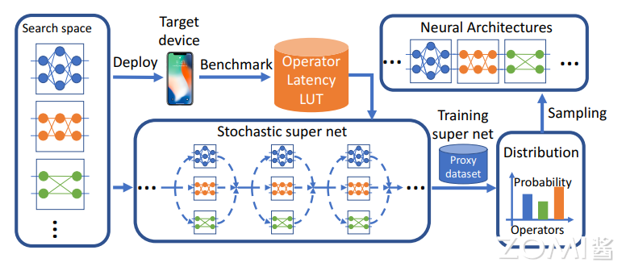
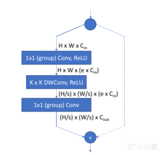
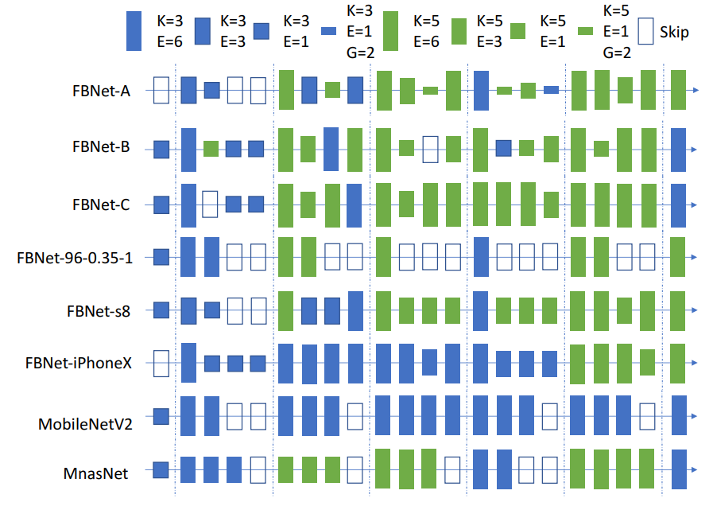
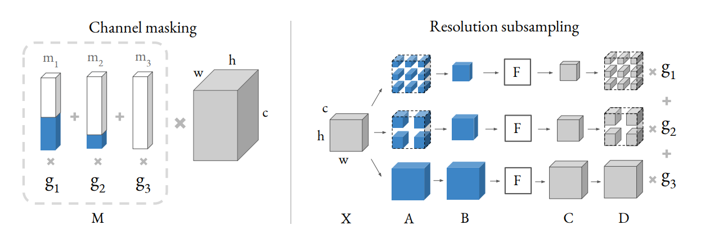
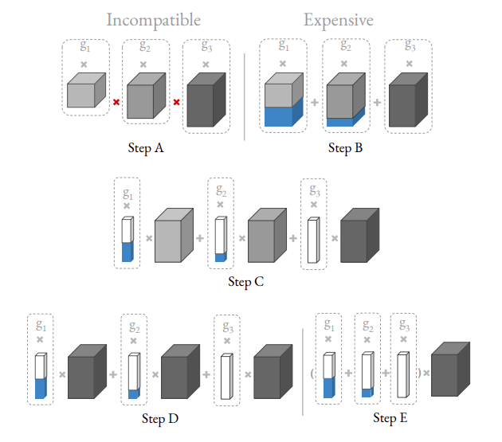
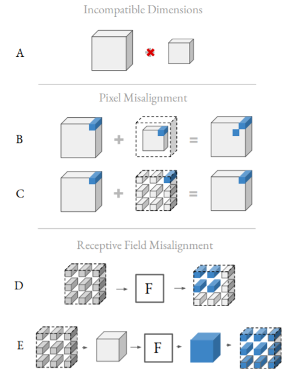
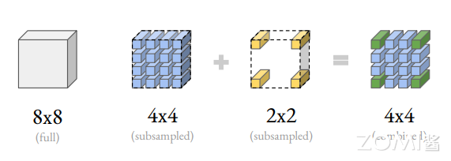
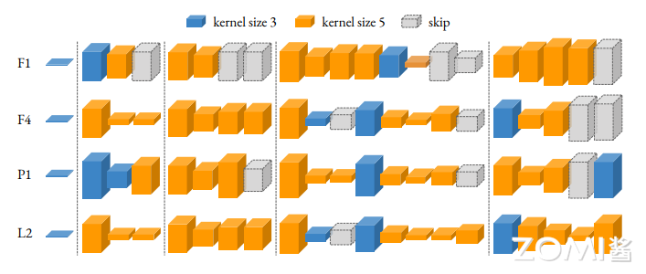
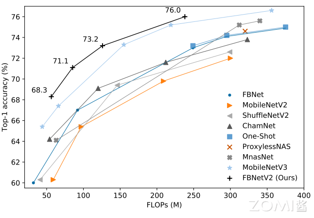
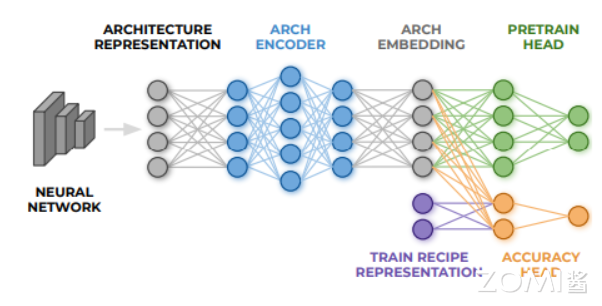

<!--Copyright © XcodeHw 适用于[License](https://github.com/chenzomi12/AISystem)版权许可-->

#  FBNet 系列

本节主要介绍 FBNet 系列，在这一章会给大家带来三种版本的 FBNet 网络，从基本 NAS 搜索方法开始，到 v3 版本的独特方法。在本节中读者会了解到如何用 NAS 搜索出最好的网络和训练参数。

## FBNet V1 模型

**FBNetV1**:完全基于 NAS 搜索的轻量级网络系列，结合了 DNAS 和资源约束。采用梯度优化的方法优化卷积结构，避免像以前的方法那样分别枚举和训练各个体系结构。FBNets-B 在 ImageNet 上 top-1 准确率为 74.1%，295M FLOPs。

### DNAS 方法

FBNet v1 的训练方法和构建网络的方法基本上沿用了 DARTS 的方法，不同的是 DARTS 的 Super net 主要体现在 Cell 结构里，搜索空间包括 cell 内部的连接和路径上的操作；而 FBNet 体现在整个网络的主体里，连接是确定的，只搜索路径上的操作。流程如下图所示。DNAS 方法将整体的搜索空间表示为超网，将寻找最优网络结构问题转换为寻找最优的候选 block 分布，通过梯度下降来训练 block 的分布，而且可以为网络每层选择不同的 block。为了更好的估计网络的时延，预先测量并记录了每个候选 block 的实际时延，在估算时直接根据网络结构和对应的时延累计即可。

DNAS 将网络结构搜索问题公式化为：

$$\underset {a∈A}{min}  \underset {w_{a}}{min} L(a,w_{a}) \tag{1}$$

给定结构空间 A，寻找最优的结构 $a∈A$，在训练好权值后 $w_{a}$，可以满足最小化损失 $L(a,w_{a})$，论文主要集中于 3 个因素：搜索空间、考虑实际时延的损失函数以及高效的搜索算法。



<<<<<<< HEAD:04Inference/02Mobilenet/06FBNet.md

=======
>>>>>>> upstream/main:04Inference/02Mobilenet/025FBNet.md
### 搜索空间

之前的方法大都搜索单元结构，然后堆叠成完整的网络，但实际上，相同的单元结构在不同的层对网络的准确率和时延的影响是大不相同的。为此，论文构造了整体网络结构(macro-architecture)固定的 layer-wise 搜索空间，每层可以选择不同结构的 block，整体网络结构如表 1 所示，前一层和后三层的结构是固定的，其余层的结构需要进行搜索。前面的层由于特征分辨率较大，人工设定了较小的核数量以保证网络的轻量性。layer-wise 搜索空间如下图所示，基于 MobileNetV2 和 ShuffleNet 的经典结构设计，通过设定不同的卷积核大小(3 或 5)、扩展率以及分组数来构造成不同的候选 block。若 block 的输入和输出分辨率一致，则添加 element-wise 的 shortcut，而若使用了分组卷积，则需要对卷积输出进行 channel shuffle。



<<<<<<< HEAD:04Inference/02Mobilenet/06FBNet.md
### Latency-Aware 损失函数
=======
### Latency-Aware 损失
>>>>>>> upstream/main:04Inference/02Mobilenet/025FBNet.md

公式 1 中的损失函数不仅要反映准确率，也要反应目标硬件上的时延。因此，定义以下损失函数：

$$L(a,w_{a}) = CE(a,w_{a})\cdot αlog(LAT(a)^{β})\tag{2}$$

$CE(a,w_{a})$ 表示交叉熵损失，LAT(a)表示当前结构在目标硬件上的时延，α控制整体损失函数的幅值，β调整时延项的幅值。时延的计算可能比较耗时，论文使用 block 的时延 lookup 表格来估计网络的的整体：

$$LAT(a) = \sum_{l}LAT(b_{l}^{(a)})\tag{3} $$

其中 $b_{l}^{(a)}$ 为结构 a 中 l 层的 block，这种估计方法假设 block 间的计算相互独立，对 CPUs 和 DSPs 等串行计算设备有效，通过这种方法，能够快速估计 $10^{21}$ 种网络的实际时延。

```python
class SupernetLoss(nn.Module):
    def __init__(self):
        super(SupernetLoss, self).__init__()
        '''
        损失函数中的超参设置，以及有关函数初始化
        '''
        self.alpha = CONFIG_SUPERNET['loss']['alpha']
        self.beta = CONFIG_SUPERNET['loss']['beta']
        self.weight_criterion = nn.CrossEntropyLoss()
    
    def forward(self, outs, targets, latency, losses_ce, losses_lat, N):
        
        '''
        根据公式 2
        '''
        ce = self.weight_criterion(outs, targets)
        lat = torch.log(latency ** self.beta)
        
        losses_ce.update(ce.item(), N)
        losses_lat.update(lat.item(), N)
        
        loss = self.alpha * ce * lat
        return loss #.unsqueeze(0)
```

<<<<<<< HEAD:04Inference/02Mobilenet/06FBNet.md
#### 搜索算法

=======
>>>>>>> upstream/main:04Inference/02Mobilenet/025FBNet.md
论文将搜索空间表示为随机超网，每层包含 9 个表 2 的并行 block。在推理的时候，候选 block 被执行的概率为：

$$P_{θ_{l}(b_{l}=b_{l,i})} = softmax(θ_{l,i};θ_{l}) = \frac{exp(θ_{l,i})} {\sum_{i=1}exp(θ_{l,i})}\tag{4}$$

$θ_{l}$ 含决定 l 层每个候选 block 采样概率的参数，l 层的输出可表示为：

$$x_{l+1} = \sum_{i}m_{l,i} \cdot b_{l,i}(x_{l}) \tag{5}$$

$m_{l,i}$ 是{0,1}是随机变量，根据采样概率随机赋值，层输出为所有 block 的输出之和。因此，网络结构 a 的采样概率可表示为:

$$P_{θ}(a)=\mathop{\prod}\limits_lP_{θ_{l}} (b_{l}=b_{l,i}^{(a)}) \tag{6} $$

$θ$ 包含所有 block 的 $θ_{l,i}$，基于上面的定义，可以将公式 1 的离散优化问题转化为:

$$ \mathop{min}\limits_θ \mathop{min}\limits_{w_{a}} E_{a}~P_{θ}{L((a,w_{a}))}\tag{7} $$

 这样，权值 $w_{a}$ 是可导的，但θ仍然不可导，因为 $m_{l,i}$ 的定义是离散的，为此将 $m_{l,i}$ 的生成方法转换为 Gumbel Softmax：

$$
m_{l,i}=GumbelSoftmax(θ_{l,i}|θ_{l})
       =\frac{exp[(θ_{l,i}+g_{l,i})/ τ]}{\sum_{i}exp[(θ_{l,i}+g_{l,i})/ τ} \tag{8}
$$

$g_{l,i}\sim Gumbel(0,1)$ 为 Gumbel 分布的随机噪声，τ为温度参数。当τ接近 0 时，$m_{l,i}$ 类似于 one-shot，当τ越大时，$m_{l,i}$ 类似于连续随机变量。这样，公式 2 的交叉熵损失就可以对 $w_{a}$ 和θ求导，而时延项 LAT 也可以改写为：

$$LAT(a) =  \sum_{l}\sum_{i}m_{l,i}\cdot LAT(b_{l,i}) \tag{9}$$

由于使用 lookup 表格，所以 $$LAT(b_{l,i})$$ 是个常量因子，网络 a 的整体时延对和也是可导的。至此，损失函数对权值 $w_{a}$ 和结构变量θ都是可导的，可以使用 SGD 来高效优化损失函数。

搜索过程等同于随机超网的训练过程，在训练时，计算 $∂L/∂w_{a}$ 更新超网每个 block 的权值，在 block 训练后，每个 block 对准确率和时延的贡献不同，计算 $∂L/∂θ$ 来更新每个 block 的采样概率 $P_{θ}$。在超网训练完后，通过采样网络分布 $P_{θ}$ 得到最优的网络结构。

```python

class MixedOperation(nn.Module):
    '''
    搜索算法过程 
    '''
    def __init__(self, layer_parameters, proposed_operations, latency, layer_num):
        super(MixedOperation, self).__init__()
        ops_names = [op_name for op_name in proposed_operations]
        self.ops = nn.ModuleList([proposed_operations[op_name](*layer_parameters[idx])
                                  for idx, op_name in enumerate(ops_names)])
        self.latency = [latency[op_name] for op_name in ops_names]
        self.thetas = nn.Parameter(torch.Tensor([1.0 / len(ops_names) for i in range(len(ops_names))]))
    
    def forward(self, x, temperature, latency_to_accumulate):
        '''
        根据上述公式的代码实现
        '''
        soft_mask_variables = nn.functional.gumbel_softmax(self.thetas, temperature)
        output  = sum(m * op(x) for m, op in zip(soft_mask_variables, self.ops))
        latency = sum(m * lat for m, lat in zip(soft_mask_variables, self.latency))
        latency_to_accumulate = latency_to_accumulate + latency
        return output, latency_to_accumulate
```

### 网络结构

FBNet 是通过 DNAS 神经架构搜索发现的一种卷积神经架构。它采用受 MobileNetv2 启发的基本类型图像模型块，该模型利用深度卷积和反向残差结构（请参阅组件，见下图）。其中，FBNet-A 和 FBNet-B、FBNet-C 的区别在于最后一个卷积的输出 channel 不一样



<<<<<<< HEAD:04Inference/02Mobilenet/06FBNet.md
## FBNet V2
=======
## FBNet V2 模型
>>>>>>> upstream/main:04Inference/02Mobilenet/025FBNet.md

**FBNetV2**: 提出了 DMaskingNAS，将 channel 数和输入分辨率分别以 mask 和采样的方式加入到超网中，在带来少量内存和计算量的情况下，大幅增加搜索空间。同时采用一种用于特征映射重用的屏蔽机制，使得随着搜索空间的扩大，存储和计算成本几乎保持不变。此外，本文采用有效的形状传播来最大化每个触发器或每个参数的精度。与所有以前的架构相比，搜索到的 FBNetV2s 具有一流的性能。

### 通道搜索

把不同的 channel 加入搜索空间，之前的 DNAS 方法就是把不同的选项融进超网，这样会带来接近 o(N2)种选择的可能。为了减少搜索 channel 时候的计算量，作者构造了 channel masking 的机制，把不同 channel 的最终输出，表征为和一个 mask 相乘的形式，如下图所示。



其中右边那个灰色的长方体表示一个 shape 为(c, h, w)的 tensor，和左边的 mask 向量 M 相乘的结果。M 可以拆解为多个 mask，m1，m2，m3...和对应 3 的 Gumbel Softmax 的系数 g1，g2，g3...的乘积和。通过调节左边的 mask，就能得到等价的不同 channel 的结果。相当于对一个大的 tensor，mask 掉额外的 channel，得到相应的别的 channel 的结果。

在通道搜索中，作者假设不同的每一层的通道路径都共享一个卷积核参数，不同 channel 的输出取决于一个叫做 mask 的向量。比如图中 g1 g2 和 g3 是不同 channel 选择的架构参数，对应的白蓝条状是 mask 向量，其中白色表示 1，蓝色表示 0，分别和卷积相乘，那么白色对应的部分表示该路径上的输出 channel 个数，蓝色部分表示该路径上没有这部分 channel，但是在整体计算上维度是保持一致的，不同 mask 向量分别和卷积核参数相乘，再用 channel 的架构参数加权和。这样在搜索的过程中，通过架构参数就可以知道每个 stage 中的卷积核该选择多少个输出 channel。

想要进行加权和，首先就会遇到下图 Step A 中的问题：channel 不同，对应的 tensor shape 不同，无法直接相加。为了解决这个问题，可以引入 Step B 中的方法：对输出做 zero padding，使之 shape 对齐（图中蓝色部分），然后加权求和。Step B 和 Step C 是等价的,Step C 相当于对卷积的 filter 进行 mask,随后作者又进行了一个简化的假设，假设所有的 weighting 共享，也就是 Step D 的形式。Step E 和 Step D 是等效的，即为最终的 channel masking 机制。

给定输入 x，Gumbel Softmax 输出如下，Gumbel 权重为 gi:

$$
y = \sum^{k}_{i=1}g_{i}P_{AD}(b_{i}(x),k) \tag{1}
$$

注意，这相当于将所有卷积的滤波器数量增加到 k，并屏蔽掉额外的通道(下图，步骤 C)。$l_{i} \in R^{k}$ 是一个列向量，I 以 1 开头，k-i 以 0 结尾。注意，搜索方法对于 1 和 0 的排序是不变的。由于所有块 bi 具有相同数量的滤波器，可以通过共享权重来近似，使得 bi = b(下图，步骤 D)：

$$
y = \sum^{k}_{i=1}g_{i}(b(x)\circ l_{i}) \tag{2}
$$

最后，利用这种近似，可以处理原始信道搜索方法的计算复杂性:这相当于计算集合掩码并且只运行块 b 一次(下图，步骤 E)

$$
y=b(x)\circ \underbrace{\sum^{k}_{i=1}g_{i}l_{i}}_{M} \tag{3}
$$

这种近似只需要一个正向传递和一个特征映射，除了等式 3 中可忽略的 M 项之外，不会引起额外的 FLOP 或存储器成本。(图 Channel Masking for channel search（DMaskingNAS），通道屏蔽)。此外，这种近似并不等价，只是因为权重是共享的，这在 DNAS 被证明可以减少训练时间和提高准确性[Single-path nas: Device-aware efficient convnet design]。这使本文能够搜索任何模块的输出通道数，包括相关的架构决策，如反向残差模块中的扩展速率。



### 输入分辨率搜索

对于空间维度，本文搜索输入分辨率。与通道一样，以前的 DNAS 方法只是用每个输入分辨率实例化每个块。这种不太成熟的方法有两个缺点:增加了内存成本和不兼容的维度。和以前一样，通过对结果进行零填充来直接解决这两个问题。但是，有两点需要注意:

像素错位

意味着填充不能像以前那样自然地发生。对图像的外围进行零填充是没有意义的，会导致像素错位(下图 b)。

空间搜索挑战

A:不同空间维度的张量因维度不兼容而无法求和。

B:沿较小特征图外围的零填充使得求和成为可能。但是，右上角的像素(蓝色)没有正确对齐。

C:在空间上散布零填充导致正确对齐像素的和。注意，两个特征图的右上角像素在总和中正确重叠。

D:假设 F 是一个 3 × 3 核的卷积。与包含一个子集(灰色)的特征图进行简单卷积，会导致该子集的感受野(2 × 2，蓝色)减小。

E:为了保留所有搜索到的输入分辨率的感受域，在卷积之前必须对输入进行二次抽样。注意感受野（蓝色）仍然是 3 × 3。

此外，注意到可以实现相同的效果，而不需要构造一个更小的张量，具有适当步长的膨胀卷积；进行子采样以避免修改 F 运算。

上面说了在 channel 维度的做法。在空间维度的做法也是类似的，作者也想构造一种加权和的形式表征不同分辨率的特征图。如图 A 所示，不同分辨率的 tensor 不能直接相加。图 B 说明了在边缘 padding 的方式不行，像素无法对齐。图 C 这种方式会又带来感受野错位的问题：如图 D 所示，Interspersing zero-padding 之后，一个 3x3 的 kenel 有效感受野变成了 2x2。所以图 E 才是作者最终的解决方法：和 F 运算完之后再 padding。



为了处理像素错位，进行零填充，使零点在空间上分散(上图 c)。这种零填充模式是统一的；除了零，这是最近邻上采样。例如，大小增加 2 倍将涉及每隔一行和一列进行零填充。补零而不是上采样可以最大限度地减少输入分辨率的“像素污染”，如下图所示。



在最左边，本文有原始的 8×8 特征图。蓝色的 4×4 是使用最近邻进行二次采样的特征图，并且均匀地进行零填充。黄色的 2 × 2 也是二次抽样和零填充。将 2 × 2 与 4 × 4 相加得到最右边的组合特征图。只有角落中的绿色像素保存两种特征地图大小的值；这些绿色值被较低分辨率的特征图“污染"。

感受野错位:由于特征图的子集对应于不同的分辨率，简单地卷积整个特征图会导致感受野的减小。为了处理感受野错位，本文转而对二次抽样输入进行卷积。使用 Gumbel Softmax，得到了分辨率子采样。

NASNet 引入了组合隐藏状态的类似概念。这些组合也用于有效地探索组合大的搜索空间，但用于确定——而不是输入分辨率或通道——重复搜索单元的次数。根据上述观点，输入分辨率搜索会导致恒定的存储成本，而不管输入分辨率的数量。另一方面，随着分辨率数量的增加，计算成本呈次线性增加。

### 有效形状传播

请注意，这种有效形状的计算仅在训练期间使用。在本文的加权求和公式(1)中。输出 y 保留最大数量的通道。然而，存在非整数数量的有效通道:假设 16 通道输出具有 Gumbel 权重 gi = 0.8，12 通道输出具有权重 gi = 0.2。这意味着有效通道数为 0.8 ∗ 16 + 0.2 ∗ 12 = 15.2 0.8*16+0.2*12 = 15.20.8∗16+0.2∗12=15.2。

这些有效通道对于 FLOP 和参数计算都是必要的，因为将较高的权重分配给更多的通道会导致较大的成本损失。这种有效形状就是本文如何实现在以前的工作中介绍的有效资源成本:首先，定义 gumbel softmax 权重为：

$$
g^{l}_{i} = \frac{exp[\frac{\alpha_{l,i}+{\epsilon_{l,i}}}{\mathcal{T}}]}{\sum_{i}exp[\frac{\alpha_{l,i}+{\epsilon_{l,i}}}{\mathcal{T}}]} \tag{4}
$$

采样参数为α时，Gumbel 噪声 $ \mathcal{E}$，温度 $\mathcal{T}$。对于第 l 层中与 Gumbel Softmax 的卷积，本文在等式（7）中定义其有效输出形状 $\overline{S}_{out}^l $

$$
\overline{C}_{out}^l = \sum_ig^{l}_{i}\cdot C^{l}_{i,out} \tag{5}
$$

$$
\overline{h}_{out}^l = \sum_ig^{l}_{i}\cdot \overline{h}_{in}^l \cdot \overline{w}_{out}^l = \sum_ig^{l}_{i}\overline{w}_{in}^l \tag{6}
$$

$$
\overline{S}_{out}^l = (n,\overline{C}_{out}^l,\overline{h}_{out}^l,\overline{S}_{out}^l) \tag{7}
$$

批量大小为 n 时，有效输入宽度 $ \overline{w}_{in}^l$ 和高度 $ \overline{h}_{in}^l$。

对于没有 Gumbel Softmax 的卷积层，有效输出形状简化为等式 8。其中有效信道计数等于实际信道计数。对于深度方向卷积，有效输出形状简化为等式 9。其中有效信道计数被简单地传播。

$$
\overline{C}_{out}^l = C^{l}_{out}\tag{8}
$$

$$
\overline{C}_{out}^l = C^{l}_{in}\tag{9}
$$

用实际输出通道计数 $C_{out}$，有效输入通道计数 $C_{in}$。然后，本文将第 l 层的成本函数定义如下:

$$
cost^{l} = 
  \begin{cases} 
   k^{2}\cdot \overline{h}_{out}^l \cdot \overline{w}_{out}^l \cdot \overline{C}_{in}^l \cdot \overline{C}_{out}^l / γ    & \text{if FLOP} \\
   k^{2} \cdot \overline{C}_{in}^l \cdot \overline{C}_{out}^l / γ      & \text{if param }
  \end{cases} \tag{10}
$$

具有γ卷积群。第(l + 1)层的有效输入通道是 $$\overline{C}^{l+1}_{in} = \overline{C}^l_{out} $$
。总训练损失由(1)交叉熵损失和(2)总成本组成，总成本是来自所有层的成本之和:$cost_{total} =\sum_lcost^l$。在正向传递中，对于所有卷积，本文计算并返回输出张量和有效输出形状。此外，Gumbel Softmax 等式 4 中的 $\mathcal{T}$。在整个训练期间下降，迫使 $g^{l}$ 接近 one-hot 分布。$argmax_{i}g^{l}_{i}$ 将因此在超图中选择块的路径；每个块的单通道和扩展速率选项；和整个网络的单一输入分辨率。然后这个最终的架构被训练。请注意，这种最终模型不使用 mask，也不需要有效的形状。

### 网络结构实现

首先使用 DMaskingNAS 寻找低计算预算的紧凑模型(见下图):



搜索出来的 FBNetV2 架构，颜色表示不同的内核大小，高度表示不同的膨胀率。高度是按比例绘制的。模型范围为 50 MFLOPs 至 300 MFLOPs，如下图所示。搜索到的 FBNetV2s 优于所有现有网络。


<<<<<<< HEAD:04Inference/02Mobilenet/06FBNet.md

**代码**
=======
>>>>>>> upstream/main:04Inference/02Mobilenet/025FBNet.md

```python
def py2_round(x):
    return math.floor(x + 0.5) if x >= 0.0 else math.ceil(x - 0.5)

def get_divisible_by(num, divisible_by=8, min_val=None):
    ret = int(num)
    if min_val is None:
        min_val = divisible_by
    if divisible_by > 0 and num % divisible_by != 0:
        ret = int((py2_round(num / divisible_by) or 1) * divisible_by)
        if ret < 0.95 * num:
            ret += divisible_by
    if ret < min_val:
        ret = min_val
    return ret

class InvertedResidual(Layer):
    def __init__(self, in_channels, channels, out_channels, kernel_size, stride, act='relu', with_se=True, drop_path=0.0):
        super().__init__()
        self.with_se = with_se
        if in_channels != channels:
            self.expand = Conv2d(in_channels, channels, kernel_size=1,
                                 norm='bn', act=act)
        else:
            self.expand = Identity()

        self.dwconv = Conv2d(channels, channels, kernel_size, stride, groups=channels,
                             norm='bn', act=act)

        if self.with_se:
            self.se = SELayer(channels, reduction=4, act=act, gating_fn='hsigmoid',
                              min_se_channels=8, divisible=8)

        self.project = Conv2d(channels, out_channels, kernel_size=1,
                              norm='bn')
        self.use_res_connect = stride == 1 and in_channels == out_channels
        self.drop_path = DropPath(drop_path) if drop_path and self.use_res_connect else Identity()

    def forward(self, x):
        identity = x
        x = self.expand(x)
        x = self.dwconv(x)
        if self.with_se:
            x = self.se(x)
        x = self.project(x)
        if self.use_res_connect:
            x = self.drop_path(x)
            x += identity
        return x

class FBNetV2(Model):
    def __init__(self, setting, num_classes=1000, dropout=0, drop_path=0):
        super().__init__()
        in_channels = setting['init_channels']
        last_channels = setting['last_channels']

        self.stem = Conv2d(3, in_channels, kernel_size=3, stride=2,
                           norm='bn', act='hswish')

        for i, stage_setting in enumerate(setting['stages']):
            stage = []
            for k, c, s, n, e, se, nl in stage_setting:
                mid_channels = get_divisible_by(in_channels * e, 8)
                out_channels = c
                if k == 1:
                    stage.append(Conv2d(
                        in_channels, out_channels, kernel_size=1, stride=s, norm='bn', act=nl))
                else:
                    stage.append(InvertedResidual(
                        in_channels, mid_channels, out_channels, k, s, nl, se, drop_path))
                in_channels = out_channels
                name = f"stage{i+1}"
                setattr(self, name, Sequential(stage))

        if drop_path:
            init_layer_ascending_drop_path(self, drop_path)

        self.last_pw = Conv2d(in_channels, in_channels * 6, kernel_size=1,
                              norm='bn', act='hswish')
        self.avgpool = GlobalAvgPool(keep_dim=True)
        self.last_fc = Conv2d(in_channels * 6, last_channels, kernel_size=1, act='hswish')
        self.dropout = Dropout(dropout) if dropout else None
        self.fc = Conv2d(last_channels, num_classes, kernel_size=1,
                         kernel_init=RandomNormal(stddev=0.01), bias_init='zeros')

    def forward(self, x):
        x = self.stem(x)
        x = self.stage1(x)
        x = self.stage2(x)
        x = self.stage3(x)
        x = self.stage4(x)
        x = self.stage5(x)

        x = self.last_pw(x)
        x = self.avgpool(x)
        x = self.last_fc(x)
        if self.dropout is not None:
            x = self.dropout(x)
        x = self.fc(x)
       
        return x
```

<<<<<<< HEAD:04Inference/02Mobilenet/06FBNet.md
## FBNet V3
=======
## FBNet V3 模型
>>>>>>> upstream/main:04Inference/02Mobilenet/025FBNet.md

**FBNetV3**：论文认为目前的 NAS 方法大都只满足网络结构的搜索，而没有在意网络性能验证时的训练参数的设置是否合适，这可能导致模型性能下降。为此，论文提出 JointNAS，在资源约束的情况下，搜索最准确的训练参数以及网络结构。

### 联合搜索

JointNAS，分粗粒度和细粒度两个阶段，对网络架构和训练超参都进行搜索。JointNAS 优化目标可公式化为:

$$
\underset{(A,h)∈Ω}{max} acc(A,h),subject to g_{i}(A)\leqslant C_{i} for i=1,..,τ \tag{1}
$$

A，h，Ω分别表示网络架构、训练策略以及搜索空间；$g_{i}(A)$，$τ$ 分别表示资源约束信息资源消耗计算和资源数量，acc 计算当前结构和训练参数下的准确率。

- **粗粒度阶段(coarse-grained)：**该阶段主要迭代式地寻找高性能的候选网络结构-超参数对以及训练准确率预测器。

- **细粒度阶段(fine-grained)：**借助粗粒度阶段训练的准确率预测器，对候选网络进行快速的进化算法搜索，该搜索集成了论文提出的超参数优化器 Auto Train。

** 粗粒度阶段

粗粒度搜索生成准确率预测器和一个高性能候选网络集,这个预测器是一个多层感知器构成的小型网络，这个预测器是一个多层感知器构成的小型网络这个预测器是一个多层感知器构成的小型网络，包含了两个部分，一个代理预测器，一个是准确率预测器。

预测器的结构如下图所示，包含一个结构编码器以及两个 head，分别为辅助的代理 head 以及准确率 head。代理 head 预测网络的属性(FLOPs 或参数量等)，主要在编码器预训练时使用，准确率 head 根据训练参数以及网络结构预测准确率，使用代理 head 预训练的编码器在迭代优化过程中进行 fine-tuned。



Neural Acquisition Function，即预测器，见上图。它包含编码架构与两个 head：

- Auxiliary proxy head 用于预训练编码架构、预测架构统计信息（比如 FLOPs 与参数两）。注：网络架构通过 one-hot 方式进行编码；

- 精度预测器，它接收训练策略与网路架构，同时迭代优化给出架构的精度评估。

上图左边的 architecture presentation 指的是网络架构的编码描述，以 one-hot 或者 int 的形成一组矩阵向量，用来表示网络的结构（参考 DARTS 的架构参数），architecture encoder 就是多层感知器，用来提取架构描述的特征，生成 architecture embedding，也就是低维特征向量。这个低维特征向量首先用于 Proxy Predictor 的训练过程，由于任何一个网络架构描述都可以对应到一个实际的网络模型，同时也能对应它的计算量和参数量数值，所以在这个阶段的训练，并不需要额外的数据。

在预训练好第一排的网络后，就要来迭代训练第二排的准确率预测器了，这个预测器的输入数据为训练超参表示加上低维特征向量，而输出数据则是这个网络架构+训练超参的结果准确率。迭代优化的算法参考图 2 中 Stage1 部分，具体迭代步骤为：

基于已经预测的准确率，选择一组候选集，选择的方法为 quosi 蒙特卡洛（QMC）；
训练和评估候选集的网络模型，得到评估准确率；
使用所有历史候选集的准确率和表示输入（架构+超参）去更新这个预测器。
在第一步迭代的时候，还要确定早停方案，早停主要是为了找到样本训练（网络本身的训练，不是对 Predictor 的训练）的 epoch 参数，确定方法为：

- 选取 n 个网络，对完整训练的结果和早停训练的结果分别作排序；
- 计算两种排序的相关性；
- 如果早停 epoch 达到某个值时，两种排序的相关性达到阈值（文中是 0.92），则认为确定好了早停的 epoch，否则重新加大 epoch，进入步骤 1 重新开始。

使用早停策略得到的网络准确率，就可以用来训练更新预测器了，在更新预测器时也有几点 tricks。首先，使用 Huber Loss 减少不正常样本的影响；其次，开始时冻结 embedding 层，只训练 accuracy Predictor，50 个 epoch；最后，再训练整个 Predictor，逐步减少学习率，50 个 epoch。

** 细粒度阶段

细粒度搜索的空间是网络架构+训练超参，搜索的方法是自适应遗传算法，搜索步骤为：

- 选择最好的几个样本作为种群（第一代从粗粒度中选）；
  
- 在给定约束的条件下，对这些样本使用变异的方法产生一个子代的种群；

- 使用准确率预测器生成子代种群的得分，如果最好的个体不再更新了，就停止迭代，否则进入步骤 1。

需要注意，当资源约束改变时，预测器依然可以重复使用，能够快速地使用细粒度阶段搜索到合适的网络结构和训练参数。

### 搜索空间

FBNetV3 的搜索空间包括了训练超参和网络架构。训练超参的搜索空间包括了优化器类型、初始学习率、参数正则化比例、mixup 比例、dropout 比例、随机深度 drop 比例和是否使用 EMA 等。网络架构的搜索空间是逆残差模型的参数，包括输入分辨率、卷积核大小、中间通道放大比例、每一 stage 网络的通道数和深度等。

```python
def py2_round(x):
    return math.floor(x + 0.5) if x >= 0.0 else math.ceil(x - 0.5)

def get_divisible_by(num, divisible_by=8, min_val=None):
    ret = int(num)
    if min_val is None:
        min_val = divisible_by
    if divisible_by > 0 and num % divisible_by != 0:
        ret = int((py2_round(num / divisible_by) or 1) * divisible_by)
        if ret < 0.95 * num:
            ret += divisible_by
    if ret < min_val:
        ret = min_val
    return ret

class InvertedResidual(Layer):
    def __init__(self, in_channels, channels, out_channels, kernel_size, stride, act='relu', with_se=True, drop_path=0.0):
        super().__init__()
        self.with_se = with_se
        self.use_res_connect = stride == 1 and in_channels == out_channels

        if in_channels != channels:
            self.expand = Conv2d(in_channels, channels, kernel_size=1,
                                 norm='bn', act=act)
        else:
            self.expand = Identity()

        self.dwconv = Conv2d(channels, channels, kernel_size, stride, groups=channels,
                             norm='bn', act=act)

        if self.with_se:
            se_channels = int(in_channels // 4) if less_se_channels else int(channels // 4)
            if less_se_channels:
                self.se = SELayer(channels, se_channels=se_channels, act=act, gating_fn='hsigmoid',
                                  min_se_channels=8, divisible=8)

        self.project = Conv2d(channels, out_channels, kernel_size=1,
                              norm='bn', gamma_init='zeros' if zero_last_bn_gamma and self.use_res_connect else 'ones')
        self.drop_path = DropPath(drop_path) if drop_path and self.use_res_connect else Identity()

    def forward(self, x):
        identity = x
        x = self.expand(x)
        x = self.dwconv(x)
        if self.with_se:
            x = self.se(x)
        x = self.project(x)
        if self.use_res_connect:
            x = self.drop_path(x)
            x += identity
        return x

class FBNetV3(Model):

    def __init__(self, setting, num_classes=1000, dropout=0, drop_path=0):
        super().__init__()
        in_channels = setting['init_channels']
        last_channels = setting['last_channels']

        # Original code has bias=True
        self.stem = Conv2d(3, in_channels, kernel_size=3, stride=2,
                           norm='bn', act='hswish')

        for i, stage_setting in enumerate(setting['stages']):
            stage = []
            for k, c, s, n, e, se, nl in stage_setting:
                mid_channels = get_divisible_by(in_channels * e, 8)
                out_channels = c
                if k == 1:
                    stage.append(Conv2d(
                        in_channels, out_channels, kernel_size=1, stride=s, norm='bn', act=nl))
                else:
                    stage.append(InvertedResidual(
                        in_channels, mid_channels, out_channels, k, s, nl, se, drop_path))
                    in_channels = out_channels

                    mid_channels = get_divisible_by(in_channels * e, 8)
                    for j in range(n-1):
                        stage.append(InvertedResidual(
                            in_channels, mid_channels, out_channels, k, 1, nl, se))
                name = f"stage{i+1}"
                setattr(self, name, Sequential(stage))

        if drop_path:
            init_layer_ascending_drop_path(self, drop_path)

        self.last_pw = Conv2d(in_channels, in_channels * 6, kernel_size=1,
                              norm='bn', act='hswish')
        self.avgpool = GlobalAvgPool(keep_dim=True)
        # Original code has bias=False
        self.last_fc = Conv2d(in_channels * 6, last_channels, kernel_size=1, act='hswish')
        self.dropout = Dropout(dropout) if dropout else None
        self.fc = Conv2d(last_channels, num_classes, kernel_size=1,
                         kernel_init=RandomNormal(stddev=0.01), bias_init='zeros')

    def forward(self, x):
        x = self.stem(x)
        x = self.stage1(x)
        x = self.stage2(x)
        x = self.stage3(x)
        x = self.stage4(x)
        x = self.stage5(x)

        x = self.last_pw(x)
        x = self.avgpool(x)
        x = self.last_fc(x)
        if self.dropout is not None:
            x = self.dropout(x)
        x = self.fc(x)
       
        return x
```

## 小结与思考

- FBNet 系列是完全基于 NAS 方法的轻量级网络系列，分析当前搜索方法的缺点，逐步增加创新性改进。

- FBNetV1 结合了 DNAS 和资源约束，FBNetV2 加入了 channel 和输入分辨率的搜索，FBNetV3 则是使用准确率预测来进行快速的网络结构搜索，期待官方更完整的代码开源。

## 本节视频

<iframe src="https://player.bilibili.com/player.html?bvid=BV1DK411k7qt&as_wide=1&high_quality=1&danmaku=0&t=30&autoplay=0" width="100%" height="500" scrolling="no" border="0" frameborder="no" framespacing="0" allowfullscreen="true"> </iframe>
