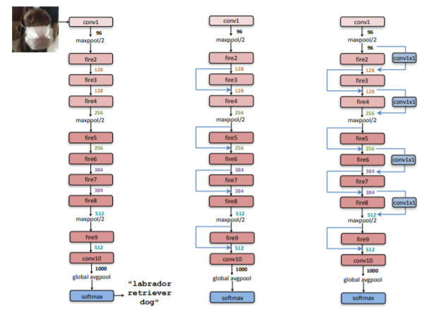

<!--Copyright © XcodeHw 适用于[License](https://github.com/chenzomi12/AISystem)版权许可-->

# SqueezeNet 系列

本节将介绍 SqueezeNet 网络，在轻量化模型这个范畴中，Squeezenet 是最早的一个，其针对 ImageNet 数据集分类任务的模型大小只有 4.8M，这还包括了最后 512*1000 分类的全连接层。这个论文刚刚出现的时候，是非常惊艳的，毕竟之前一个模型动不动就有大几十兆，而一个不到 0.5M 的模型可以得到 alxnet 相似的准确率是很难得的，这使得模型向移动端部署成为可能，虽然 SqueezeNet 系列不如 MobieNet 使用广泛，但其架构思想和实验结论还是可以值得借鉴的。

本节将介绍 SqueezeNet 的衍生版本-SqueezeNext 网络，以往的网络都只讲网络如何设计。而 SqueezeNext 则从硬件角度分析如何加速，从而了解网络结构的设计。

======= 开篇总结介绍 SqueezeNet 系列，可以合并一下上面的讲述哈。感觉改完你可以发知乎了。

## SqueezeNet

**SqueezeNet**：是轻量化主干网络中比较著名的，它发表于 ICLR 2017，在达到了 AlexNet 相同的精度的同时，只用了 AlexNet 1/50 的参数量。SqueezeNet 核心贡献在于使用 **Fire Module**(如下图所示)，即由 Squeeze 部分和 Expand 部分组成，Squeeze 部分是一组连续的 $1 \times 1$ 卷积组成，Expand 部分则是由一组连续的 $1 \times 1$ 卷积和 $3 \times 3$ 卷积 cancatnate 组成，在 Fire 模块中，Squeeze 部分的 $1\times1$ 卷积的通道数记做 $s_{1x1}$，Expand 部分 $1 \times 1$ 卷积和 $3 \times 3$ 卷积的通道数分别记做 $e_{1x1}$ 和 $e_{3x3}$。

在 Fire 中，建议 $s_{1x1}<e_{1x1}+e_{3x3}$，这么做相当于两个 $3 \times 3$ 卷积中加入了瓶颈层。


### 压缩策略

SqueezeNet 算法的主要目标是构建轻量参数的 CNN 架构，同时不损失精度。为了实现这一目标，作者总共采用了三种策略来设计 CNN 架构，具体如下：

1. 减少卷积核大小：将 3×3 卷积替换成 1×1 卷积，可以使参数量减少 9 倍；
2. 减少卷积通道：减少 3×3 卷积通道数，一个 3×3 卷积的计算量是 3 × 3 × M × N ，通过将 M 和 N 减少以降低参数数量；
3. 下采样延后：将下采样操作延后，这样卷积层就有了大的激活图，保留更多信息。

### Fire Module

**Fire Module**组成：主要包括 挤压层（squeeze） 和 拓展层（expand）；

- **Squeeze**：只有 1×1 卷积滤波器 ；
- **Expand**：混合有 1×1 和 3×3 卷积滤波器 ；

并引入了三个调节维度的超参数 ：

- $s_{1\times1}$：squeeze 中 1 x 1 卷积滤波器个数；
- $e_{1\times1}$：expand 中 1 x 1 卷积滤波器个数；
- $e_{3\times3}$：expand 中 3 x 3 卷积滤波器个数；

```python
#Fire Module
class fire(nn.Module):
    def __init__(self,in_channel, out_channel):
        super(fire, self).__init__()
        self.conv1 = nn.Conv2d(in_channel,out_channel//8,kernel_size=1)        #  1x1 卷积
        self.conv2_1 = nn.Conv2d(out_channel//8,out_channel//2,kernel_size=1)   # 1x1 卷积
        self.conv2_2 = nn.Conv2d(out_channel//8,out_channel//2,kernel_size=3,padding= 3//2)   # 3x3 卷积
        self.BN1 = nn.BatchNorm2d(out_channel//4) # BN
        self.ReLU = nn.ReLU() #ReLU 激活函数
        
	#Fire Module 前向过程
    def forward(self,x):
        out = self.ReLU(self.BN1(self.conv1(x)))
        out1 = self.conv2_1(out)
        out2 = self.conv2_2(out)
        out  = self.ReLU(torch.cat([out1,out2],1)) # cat 进行拼接特征图
        return out
```

### 模型结构

在**Fire Module**的基础上搭建 SqueezeNet 神经网络，结构如下图所示。以卷积层开始，后面是 8 个 Fire Module，最后以卷积层结束，激活函数默认使用 ReLU，每个 Fire Module 中的通道数目逐渐增加，另外网络在 conv1、fire4、fire8、conv10 的后面使用了 最大池化。

相同分辨率的 Fire Module 数量前面要少一点，后面要多一点，通道数通常以 32 或 64 的倍数增加。在通道数相同的层之间，添加旁路相加结构（short-cut）可以明显提升准确性（top-1 和 top-5 分别提升 2.9% 和 2.2%）。带有卷积的旁路结构可以在任意层之间添加（1*1 卷积调控 depth），准确性提升较小，模型增大。



```python
#导入所需的 pytorch 库
import torch
import torch.nn as nn

#SqueezeNet 网络
class SQUEEZENET(nn.Module):
    #初始化一些层和变量
    def __init__(self,in_channel, classses):
        super(SQUEEZENET, self).__init__()
        channels = [96,128,128,256,256,384,384,512,512]
        self.conv1 = nn.Conv2d(in_channel,channels[0],7,2,padding=7//2) #7x7 卷积
        self.pool1 = nn.MaxPool2d(kernel_size=3,stride=2) #最大池化
        self.BN1 = nn.BatchNorm2d(channels[0])
        self.block = fire  #fire Module
        self.block1 = nn.ModuleList([])
        #block 叠加
        for i in range(7):
            self.block1.append(self.block(in_channel = channels[i],out_channel = channels[i+1]))
            if i in [3,6]:
                self.block1.append(nn.MaxPool2d(kernel_size=3,stride=2))
        self.block1.append(self.block(channels[-2],channels[-1]))
        #Dropout 1x1 卷积 激活函数
        self.conv10 = nn.Sequential(
            nn.Dropout(0.5),
            nn.Conv2d(channels[-1],classses,kernel_size=1,stride=1),
            nn.ReLU())

        self.pool2 = nn.MaxPool2d(kernel_size=13) #最大池化
	
    #SQUEEZENET 前向过程
    def forward(self,x):
        x = self.conv1(x)
        x = self.pool1(x)
        x = self.BN1(x)
        for block in self.block1:
            x = block(x)
        x = self.conv10(x)
        out = self.pool2(x)
        return out
```

## SqueezeNext

现有神经网络需要大的内存和计算资源是将其部署到嵌入式设备上的最大障碍。本文 SqueezeNext 是 SqueezeNet 的进化版本，同时引入了神经网络加速技术。本文介绍的 SqueezeNext 可以达到 AlexNet 的准确度且参数数量比前者少 112 倍。另一版本的 SqueezeNext 模型可以达到 VGG-19 的精度且参数数量比原始 VGG-19 网络少 31 倍，仅为 4.4 Million。

SqueezeNext 在比 MobeilNet 参数数量少 1.3 倍的情况下取得了比其更好的 Top-5 分类精度，同时也没有使用在很多移动式设备上不足够高效的分离卷积。作者在相比 SqueezeNet/AlexNet 没有精度损失的情况下，设计出了比其运算速度快 2.59/8.26 倍的网络，且耗能比原来少 2.25/7.5 倍。

### Bottle 模块

改进 Fire 模块，加入 shortcut 后的新模块。

======== 把最重要的修改，或者独立的修改点独立出来解释介绍。补充下上面的话和对应下面的代码哈。

```python
class Bottle(nn.Module):
    def __init__(self,in_channel,out_channel, stride):
        super(Bottle, self).__init__()
        self.block = nn.Sequential(
            CONV_BN_RELU(in_channel, in_channel // 2, kernel_size=1,stride = stride,padding=0),
            CONV_BN_RELU(in_channel // 2, in_channel // 4, kernel_size=1,padding=0),
            CONV_BN_RELU(in_channel // 4, in_channel // 2, kernel_size=(1,3), padding=(0,3//2)),
            CONV_BN_RELU(in_channel // 2, in_channel//2, kernel_size=(3,1),padding=(3//2,0)),
            CONV_BN_RELU(in_channel//2 , out_channel, kernel_size=1,padding=0),
        )
        self.shortcut = nn.Sequential()
        if stride==2 or out_channel!=in_channel:
            self.shortcut = nn.Sequential(
                nn.Conv2d(in_channel, out_channel, kernel_size=3,stride = stride, padding=1),
                nn.BatchNorm2d(out_channel)
            )

    def forward(self,x):
        out1 = self.block(x)
        out2 = self.shortcut(x)
        x = out1+out2
        return x
```

### 模型结构

**SqueezeNext**:设计基于残差结构并使用了分离卷积，采用了降低参数的策略。其中

1. Two-stage Bottleneck modules

    每一个卷积层中的参数数量正比于 $C_{i}$ 和 $C_{o}$ 的乘积。所以，减少输入通道的数量可以有效减少模型的大小。一种思路是使用分离卷积减少参数数量，但是某些嵌入式系统由于其用于计算的带宽的限制，分离卷积的性能较差。另一种思路是 squeezeNet 中提出的在 $3 \times 3$ 卷积之前使用 squeeze 层以减少 $3 \times3$ 卷积的输入通道数目。这里作者在 SqueezeNet 的基础上进行了演化，使用了如下图所示的两层 squeeze 层。

    在 SqueezeNext 模块中，使用了两层 bottleneck，每一层都将通道数减小为原来的 1/2，然后使用了两个分离卷积层。最后使用了一层 $1 \times 1$ 卷积的扩充层，进一步减少了分离卷积输出数据的通道数。

    

    ====== 这个内容是否放在上面 Bottle 模块？

2. Low Rank Filters

    假设网络第 $i$ 层的输入为 $x∈R^{H\times W \times C_{i}}$，卷积核大小为 $K \times K$，输出大小为 $y∈R^{H\times W \times C_{o}}$，这里假设输入和输出的空间尺寸相同，输入和输出的通道数分别是 $C_{i}$ 和 $C_{o}$。该层的总的参数数量为 $K^{2}C_{i}C_{o}$，即 $C_{o}$ 个大小为 $K \times K \times C_{i}$ 的卷积核。

    在对已有模型进行压缩的实现中，尝试对现有参数 W 压缩成 $\hat{W}$ 可以通过 CP 或者 Tucker 分解获取 $ \hat{W}$。通过这些方法减小的参数量正比于原始参数矩阵 W 的秩。

    然而，检查当前各主流模型的参数 W，可以发现其都有比较高的秩。所以，当前模型压缩方法都进行了一定的重训练以恢复准确率。主流的模型压缩方法包括对参数进行剪枝以减少非零参数的数量，或者减小参数的精度。

    另外一种思路是使用低秩参数矩阵 $\hat{W}$ 重新设计网络，这也是本文作者所采用的方法。作者所作的第一个变化是将 $K \times K$ 的矩阵分解为两个独立的 $1 \times K$ 和 $ K \times 1$ 卷积。这样做有效地将参数数量从 $K^2$ 减少成了 2K，同时增加了网络的深度。两个卷积层后都使用了 ReLu 激活函数和 BN 层。

3. 全连接层

    AlexNet96%的参数来自于全连接层，SqueezeNet 和 ResNet 中都只包含一个全连接层。假设输入数据为 $H \times W \times C_{i}$ ，那么最后的全连接层的参数数量为 $H \times W \times C_{i} \times L_{i}$，L 表示输出的类别数。SqueezeNext 在最后一个全连接层之前使用了一个 bottleneck 层，进一步减少了参数数量。


SqueezeNext 的设计就是不断的堆叠上图的 block，在模拟硬件性能实验结果中发现，维度越低，计算性能也越低效，于是将更多的层操作集中在维度较高的 block。

SqueezeNext-23 结构如下图所示:


### 代码

```python
import torch
import torch.nn as nn

#卷积+BN+激活函数
class CONV_BN_RELU(nn.Module):
    def __init__(self,in_channel,out_channel,kernel_size,padding,stride=1):
        super(CONV_BN_RELU, self).__init__()

        self.conv = nn.Sequential(
            nn.Conv2d(in_channel,out_channel,kernel_size,stride = stride, padding = padding),
            nn.BatchNorm2d(out_channel),
            nn.ReLU()
        )
    def forward(self,x):
        x = self.conv(x)
        return x

#SqueezeNext 网络
class SQUEEZENEXT(nn.Module):
    
    #初始化一些层和变量
    def __init__(self, in_channel, classes):
        super(SQUEEZENEXT, self).__init__()
        channels = [64,32,64,128,256]
        depth = [6,6,8,1]

        self.conv1 = nn.Sequential(nn.Conv2d(in_channel,channels[0],7,2,padding=7//2),
                                   nn.MaxPool2d(kernel_size=3,stride=2),
                                   nn.BatchNorm2d(channels[0]),
                                   nn.ReLU())
        self.block = Bottle
        self.stage1 = self._make_stage(6,channels[0],channels[1],stride = 1)
        self.stage2 = self._make_stage(6, channels[1], channels[2], stride=2)
        self.stage3 = self._make_stage(8, channels[2], channels[3], stride=2)
        self.stage4 = self._make_stage(1, channels[3], channels[4], stride=2)
        self.pool = nn.MaxPool2d(7)
        self.fc = nn.Linear(channels[4],classes)
        
	#每个 stage 层中所含的 block
    def _make_stage(self, num_stage, inchannel, ouchannel, stride):
        strides = [stride] + [1]*(num_stage-1)
        layer = []
        for i in range(num_stage):
            layer.append(self.block(inchannel,ouchannel,strides[i]))
            inchannel = ouchannel
        return nn.Sequential(*layer)

	#前向传播过程
    def forward(self,x):
        x = self.conv1(x)
        x = self.stage1(x)
        x = self.stage2(x)
        x = self.stage3(x)
        x = self.stage4(x)
        x = self.pool(x)
        x = x.view(x.size(0),-1)
        x = self.fc(x)
        return x
```

## 小结

SqueezeNet 系列是比较早期且经典的轻量级网络，SqueezeNet 使用 Fire 模块进行参数压缩，而 SqueezeNext 则在此基础上加入分离卷积进行改进。虽然 SqueezeNet 系列不如 MobieNet 使用广泛，但其架构思想和实验结论还是可以值得借鉴的。

## 本节视频

<html>
<iframe src="https://player.bilibili.com/player.html?bvid=BV1Y84y1b7xj&as_wide=1&high_quality=1&danmaku=0&t=30&autoplay=0" width="100%" height="500" scrolling="no" border="0" frameborder="no" framespacing="0" allowfullscreen="true"> </iframe>
</html>

## 参考文献

1.[Khalid Ashraf, Bichen Wu, Forrest N. Iandola, Matthew W. Moskewicz, and Kurt Keutzer. Shallow networks for high-accuracy road object-detection. arXiv:1606.01561, 2016.](https://arxiv.org/abs/1606.01561v1)

2.[Vijay Badrinarayanan, Alex Kendall, and Roberto Cipolla. SegNet: A deep convolutional encoderdecoder architecture for image segmentation. arxiv:1511.00561, 2015.](https://arxiv.org/pdf/1807.10221v1.pdf)

3.[Tianqi Chen, Mu Li, Yutian Li, Min Lin, Naiyan Wang, Minjie Wang, Tianjun Xiao, Bing Xu,
Chiyuan Zhang, and Zheng Zhang. Mxnet: A flexible and efficient machine learning library for
heterogeneous distributed systems. arXiv:1512.01274, 2015a.](https://arxiv.org/abs/1512.01274)

4.[Jeff Donahue, Yangqing Jia, Oriol Vinyals, Judy Hoffman, Ning Zhang, Eric Tzeng, and Trevor
Darrell. Decaf: A deep convolutional activation feature for generic visual recognition.
arXiv:1310.1531, 2013.](https://arxiv.org/abs/1310.1531v1)

5.[Song Han, Jeff Pool, Sharan Narang, Huizi Mao, Shijian Tang, Erich Elsen, Bryan Catanzaro, John Tran, and William J. Dally. Dsd: Regularizing deep neural networks with dense-sparse-dense training flow. arXiv:1607.04381, 2016b](https://arxiv.org/abs/1607.04381v1)

6.[C. Farabet, B. Martini, B. Corda, P. Akselrod, E. Culurciello, and Y. LeCun. Neuflow: A runtime reconfigurable dataflow processor for vision. In Computer Vision and Pattern Recognition Workshops (CVPRW),2011 IEEE Computer Society Conference on, pages109–116, 2011.](https://ieeexplore.ieee.org/document/5981829/)

7.[M. Jaderberg, A. Vedaldi, and A. Zisserman. Speeding up convolutional neural networks with low rank expansions. arXiv preprint arXiv:1405.3866, 2014.](https://arxiv.org/pdf/1405.3866.pdf)

8.[M. Rastegari, V. Ordonez, J. Redmon, and A. Farhadi.Xnor-net: Imagenet classification using binary convolutional neural networks. In European Conference on Computer Vision, pages 525–542, 2016.](http://allenai.org/plato/xnornet)

9.[ S. Williams, A. Waterman, and D. Patterson. Roofline:an insightful visual performance model for multicore architectures. Communications of the ACM, 52(4):65–76, 2009.](https://dl.acm.org/doi/10.1145/1498765.1498785)

10.[B. Wu, A. Wan, X. Yue, and K. Keutzer. Squeezeseg: Convolutional neural nets with recurrent crf for real-time road-object segmentation from 3d lidar point cloud. arXiv preprint arXiv:1710.07368, 2017.](https://arxiv.org/abs/1710.07368)

11.[K. Simonyan and A. Zisserman. Very deep convolutional networks for large-scale image recognition.arXiv preprint arXiv:1409.1556, 2014.](https://arxiv.org/abs/1409.1556)

12.[K. He, X. Zhang, S. Ren, and J. Sun. Deep residual learning for image recognition. In Proceedings of the IEEE conference on computer vision and pattern recognition, pages 770–778, 2016.](https://arxiv.org/abs/1512.03385)

13.[S. Ioffe and C. Szegedy. Batch normalization: Accelerating deep network training by reducing internal covariate shift. In International conference on machine
learning, pages 448–456, 2015.](https://arxiv.org/abs/1502.03167v3)

14.[S. Han, H. Mao, and W. J. Dally. Deep compression: Compressing deep neural networks with pruning, trained quantization and huffman coding. International Conference on Learning Representations(ICLR), 2016.](https://arxiv.org/pdf/1510.00149.pdf)

15.[A. G. Howard, M. Zhu, B. Chen, D. Kalenichenko,W. Wang, T. Weyand, M. Andreetto, and H. Adam.Mobilenets: Efficient convolutional neural networks for mobile vision applications. arXiv preprint arXiv:1704.04861, 2017.](https://arxiv.org/pdf/1704.04861.pdf)
