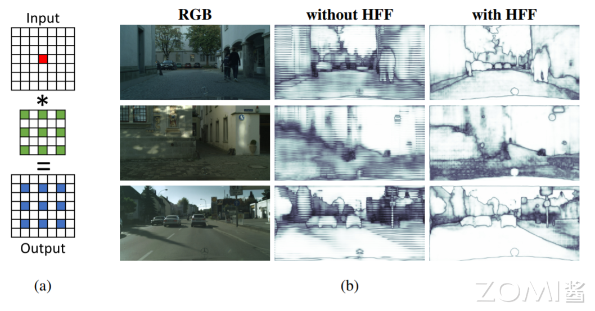
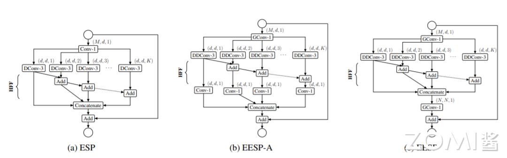
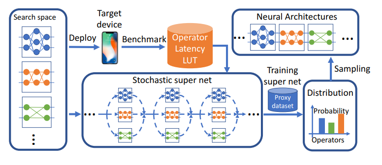
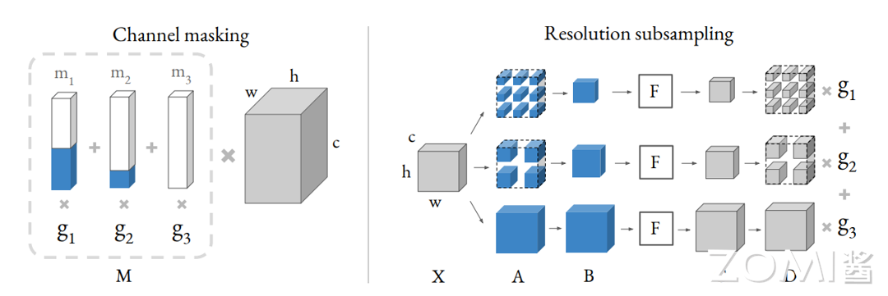
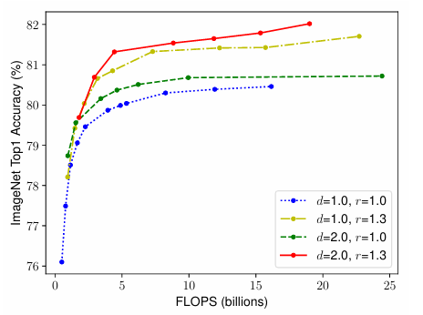

<!--适用于[License](https://github.com/chenzomi12/AISystem/blob/main/LICENSE)版权许可-->

# CNN 模型小型化（下）

在本章节会接着介绍 CNN 模型的小型化，除了第二节提到的三个模型外，在本章节会继续介绍 ESPNet 系列，FBNet 系列，EfficientNet 系列和 GhostNet 系列。

## ESPNet 系列

### ESPNetV1

**ESPNet V1**：应用在高分辨图像下的语义分割，在计算、内存占用、功耗方面都非常高效。主要贡献在于基于传统卷积模块，提出高效空间金子塔卷积模块（ESP Module），有助于减少模型运算量和内存、功率消耗，来提升终端设备适用性，方便部署到移动端。

#### ESP 模块

基于卷积因子分解的原则，ESP（Efficient spatial pyramid）模块将标准卷积分解成 point-wise 卷积和空洞卷积金字塔（spatial pyramid of dilated convolutions）。point-wise 卷积将输入的特征映射到低维特征空间，即采用 K 个 1x1xM 的小卷积核对输入的特征进行卷积操作，1x1 卷积的作用其实就是为了降低维度，这样就可以减少参数。空洞卷积金字塔使用 K 组空洞卷积的同时下采样得到低维特征，这种分解方法能够大量减少 ESP 模块的参数和内存，并且保证了较大的感受野(如下图 a 所示)。

#### HFF 特性

虽然将扩张卷积的输出拼接在一起会给 ESP 模块带来一个较大的有效感受野，但也会引入不必要的棋盘或网格假象，如下图所示。

上图(a)举例说明一个网格伪像，其中单个活动像素（红色）与膨胀率 r = 2 的 3×3 膨胀卷积核卷积。

上图(b)具有和不具有层次特征融合（Hierarchical feature fusion，HFF）的 ESP 模块特征图可视化。ESP 中的 HFF 消除了网格伪影。彩色观看效果最佳。

为了解决 ESP 中的网格问题，使用不同膨胀率的核获得的特征映射在拼接之前会进行层次化添加（上图 b 中的 HFF）。该解决方案简单有效，且不会增加 ESP 模块的复杂性，这与现有方法不同，现有方法通过使用膨胀率较小的卷积核学习更多参数来消除网格误差[Dilated residual networks,Understanding convolution for semantic segmentation]。为了改善网络内部的梯度流动，ESP 模块的输入和输出特征映射使用元素求和[Deep residual learning for image recognition]进行组合。

### ESPNetV2

### EESP 模块

EESP 模块结构如下图，图 b 中相比于 ESPNet，输入层采用分组卷积，DDConv+Conv1x1 取代标准空洞卷积，依然采用 HFF 的融合方式，（c）是（b）的等价模式。当输入通道数 M=240，g=K=4, d=M/K=60，EESP 比 ESP 少 7 倍的参数。

描述了一个新的网络模块 EESP，它利用深度可分离扩张和组逐点卷积设计，专为边缘设备而设计。该模块受 ESPNet 架构的启发，基于 ESP 模块构建，使用了减少-分割-变换-合并的策略。通过组逐点和深度可分离扩张卷积，该模块的计算复杂度得到了显著的降低。进一步，描述了一种带有捷径连接到输入图像的分层 EESP 模块，以更有效地学习多尺度的表示。

如上图中 b 所示，能够降低 $\frac{Md+n^{2}d^{2}K}{\frac{Md}{g}+(n^{2}+d)dK}$ 倍计算复杂度，K 为空洞卷积金字塔层数。考虑到单独计算 K 个 point-wise 卷积等同于单个分组数为 K 的 point-wise 分组卷积，而分组卷积的在实现上更高效，于是改进为上图 c 的最终结构。

## FBNet 系列

### FBNet V1

**FBNetV1**:完全基于 NAS 搜索的轻量级网络系列，结合了 DNAS 和资源约束。采用梯度优化的方法优化卷积结构，避免像以前的方法那样分别枚举和训练各个体系结构。FBNets-B 在 ImageNet 上 top-1 准确率为 74.1%，295M FLOPs。

#### DNAS 方法

FBNet v1 的训练方法和构建网络的方法基本上沿用了 DARTS 的方法，不同的是 DARTS 的 Super net 主要体现在 Cell 结构里，搜索空间包括 cell 内部的连接和路径上的操作；而 FBNet 体现在整个网络的主体里，连接是确定的，只搜索路径上的操作。流程如下图所示。DNAS 方法将整体的搜索空间表示为超网，将寻找最优网络结构问题转换为寻找最优的候选 block 分布，通过梯度下降来训练 block 的分布，而且可以为网络每层选择不同的 block。为了更好的估计网络的时延，预先测量并记录了每个候选 block 的实际时延，在估算时直接根据网络结构和对应的时延累计即可。

DNAS 将网络结构搜索问题公式化为：

$$\underset {a∈A}{min}  \underset {w_{a}}{min} L(a,w_{a}) \tag{1}$$

给定结构空间 A，寻找最优的结构 $a∈A$，在训练好权值后 $w_{a}$，可以满足最小化损失 $L(a,w_{a})$，论文主要集中于 3 个因素：搜索空间、考虑实际时延的损失函数以及高效的搜索算法。

#### Latency-Aware 损失函数

公式 1 中的损失函数不仅要反映准确率，也要反应目标硬件上的时延。因此，定义以下损失函数：

$$L(a,w_{a}) = CE(a,w_{a})\cdot αlog(LAT(a)^{β})\tag{2}$$

$CE(a,w_{a})$ 表示交叉熵损失，LAT(a)表示当前结构在目标硬件上的时延，α控制整体损失函数的幅值，β调整时延项的幅值。时延的计算可能比较耗时，论文使用 block 的时延 lookup 表格来估计网络的的整体：

$$LAT(a) = \sum_{l}LAT(b_{l}^{(a)})\tag{3} $$

其中 $b_{l}^{(a)}$ 为结构 a 中 l 层的 block，这种估计方法假设 block 间的计算相互独立，对 CPUs 和 DSPs 等串行计算设备有效，通过这种方法，能够快速估计 $10^{21}$ 种网络的实际时延。

### FBNet V2

**FBNetV2**: 提出了 DMaskingNAS，将 channel 数和输入分辨率分别以 mask 和采样的方式加入到超网中，在带来少量内存和计算量的情况下，大幅增加搜索空间。同时采用一种用于特征映射重用的屏蔽机制，使得随着搜索空间的扩大，存储和计算成本几乎保持不变。此外，本文采用有效的形状传播来最大化每个触发器或每个参数的精度。与所有以前的架构相比，搜索到的 FBNetV2s 具有一流的性能。

### 通道搜索

把不同的 channel 加入搜索空间，之前的 DNAS 方法就是把不同的选项融进超网，这样会带来接近 o(N2)种选择的可能。为了减少搜索 channel 时候的计算量，作者构造了 channel masking 的机制，把不同 channel 的最终输出，表征为和一个 mask 相乘的形式，如下图所示。

其中右边那个灰色的长方体表示一个 shape 为(c, h, w)的 tensor，和左边的 mask 向量 M 相乘的结果。M 可以拆解为多个 mask，m1，m2，m3...和对应 3 的 Gumbel Softmax 的系数 g1，g2，g3...的乘积和。通过调节左边的 mask，就能得到等价的不同 channel 的结果。相当于对一个大的 tensor，mask 掉额外的 channel，得到相应的别的 channel 的结果。

在通道搜索中，作者假设不同的每一层的通道路径都共享一个卷积核参数，不同 channel 的输出取决于一个叫做 mask 的向量。比如图中 g1 g2 和 g3 是不同 channel 选择的架构参数，对应的白蓝条状是 mask 向量，其中白色表示 1，蓝色表示 0，分别和卷积相乘，那么白色对应的部分表示该路径上的输出 channel 个数，蓝色部分表示该路径上没有这部分 channel，但是在整体计算上维度是保持一致的，不同 mask 向量分别和卷积核参数相乘，再用 channel 的架构参数加权和。这样在搜索的过程中，通过架构参数就可以知道每个 stage 中的卷积核该选择多少个输出 channel。

想要进行加权和，首先就会遇到下图 Step A 中的问题：channel 不同，对应的 tensor shape 不同，无法直接相加。为了解决这个问题，可以引入 Step B 中的方法：对输出做 zero padding，使之 shape 对齐（图中蓝色部分），然后加权求和。Step B 和 Step C 是等价的,Step C 相当于对卷积的 filter 进行 mask,随后作者又进行了一个简化的假设，假设所有的 weighting 共享，也就是 Step D 的形式。Step E 和 Step D 是等效的，即为最终的 channel masking 机制。

给定输入 x，Gumbel Softmax 输出如下，Gumbel 权重为 gi:

$$
y = \sum^{k}_{i=1}g_{i}P_{AD}(b_{i}(x),k) \tag{1}
$$

注意，这相当于将所有卷积的滤波器数量增加到 k，并屏蔽掉额外的通道(下图，步骤 C)。$l_{i} \in R^{k}$ 是一个列向量，I 以 1 开头，k-i 以 0 结尾。注意，搜索方法对于 1 和 0 的排序是不变的。由于所有块 bi 具有相同数量的滤波器，可以通过共享权重来近似，使得 bi = b(下图，步骤 D)：

$$
y = \sum^{k}_{i=1}g_{i}(b(x)\circ l_{i}) \tag{2}
$$

最后，利用这种近似，可以处理原始信道搜索方法的计算复杂性:这相当于计算集合掩码并且只运行块 b 一次(下图，步骤 E)

$$
y=b(x)\circ \underbrace{\sum^{k}_{i=1}g_{i}l_{i}}_{M} \tag{3}
$$

这种近似只需要一个正向传递和一个特征映射，除了等式 3 中可忽略的 M 项之外，不会引起额外的 FLOP 或存储器成本。(图 Channel Masking for channel search（DMaskingNAS），通道屏蔽)。此外，这种近似并不等价，只是因为权重是共享的，这在 DNAS 被证明可以减少训练时间和提高准确性[Single-path nas: Device-aware efficient convnet design]。这使本文能够搜索任何模块的输出通道数，包括相关的架构决策，如反向残差模块中的扩展速率。

#### FBNetV3

**FBNetV3**：论文认为目前的 NAS 方法大都只满足网络结构的搜索，而没有在意网络性能验证时的训练参数的设置是否合适，这可能导致模型性能下降。为此，论文提出 JointNAS，在资源约束的情况下，搜索最准确的训练参数以及网络结构。

### 联合搜索

JointNAS，分粗粒度和细粒度两个阶段，对网络架构和训练超参都进行搜索。JointNAS 优化目标可公式化为:

$$
\underset{(A,h)∈Ω}{max} acc(A,h),subject to g_{i}(A)\leqslant C_{i} for i=1,..,τ \tag{1}
$$

A，h，Ω分别表示网络架构、训练策略以及搜索空间；$g_{i}(A)$，$τ$ 分别表示资源约束信息资源消耗计算和资源数量，acc 计算当前结构和训练参数下的准确率。

- **粗粒度阶段(coarse-grained)：**该阶段主要迭代式地寻找高性能的候选网络结构-超参数对以及训练准确率预测器。

- **细粒度阶段(fine-grained)：**借助粗粒度阶段训练的准确率预测器，对候选网络进行快速的进化算法搜索，该搜索集成了论文提出的超参数优化器 Auto Train。

## EfficientNet 系列

### EfficientNet V1

**EfficientNetV1**:重点分析了卷积网络的深度，宽度和输入图像大小对卷积网络性能表现的影响，提出了一种混合模型尺度的方法，通过设置一定的参数值平衡调节卷积网络的深度，宽度和输入图像大小，使卷积网络的表现达到最好。

#### 复合缩放

为了追求更好的精度和效率，在连续网络缩放过程中平衡网络宽度、深度和分辨率的所有维度是至关重要的。如下图所示。

不同维度的 Scaling 并不相互独立，需要协调和平衡不同维度的 Scaling，而不是常规的单维度 Scaling。EfficientNet 提出了 compound scaling method（复合缩放方法），这种方法是通过一个复合系数φ去统一缩放网络的宽度，深度和分辨率，公式表示如下：
$$
depth:d=α^{φ}
$$

$$
width:w=β^{φ}
$$

$$
resolution:r=γ^{φ}
$$

$$
s.t. α\cdotβ^{2}\cotγ^{2}\approx 2
$$

$$
α\geq1,β\geq1,γ\geq1
$$
其中，α、β以及γ是常数，可以通过在 baseline 上做 small grid search 来得到。ϕ 是用户指定的系数，用于控制有多少其他计算资源可用于模型缩放，而 α，β，γ 指定如何分别将这些额外资源分配给网络宽度，深度和分辨率。

需要注意的是：常规卷积运算的 FLOPS 与 d，$w^{2}$，$r^{2}$ 成正比，即网络深度增加 1 倍会使 FLOPS 增加 1 倍，网络宽度或分辨率增加 1 倍会使 FLOPS 增加 4 倍。

由于卷积运算通常在 ConvNets 中占主导地位，因此根据上述的等式，缩放 ConvNets 将使总 FLOPS 大约增加 $(α⋅β^{2}⋅γ^{2})ϕ$。在本文中，作者做了 $α⋅β^{2}⋅γ^{2}≈2$ 的约束，这样对于任何新的 ϕ ，总 FLOPS 大约会增加 $2^{ϕ}$

###  EfficientNet V2

####  训练感知 NAS 和缩放

**NAS 搜索**

这里采用的是 trainning-aware NAS framework，搜索工作主要还是基于之前的 Mnasnet 以及 EfficientNet. 但是这次的优化目标联合了 accuracy、parameter efficiency 以及 trainning efficiency 三个维度。这里是以 EfficientNet 作为 backbone，设计空间包含:

- convolutional operation type : MBConv, Fused-MBConv

- number of layer

- kernel size : 3x3, 5x5

- expansion ratio : 1, 4, 6

另外，作者通过以下方法来减小搜索空间的范围：

移除不需要的搜索选项，重用 EfficientNet 中搜索的 channel sizes，接着在搜索空间中随机采样了 1000 个模型，并针对每个模型训练 10 个 epochs（使用较小的图像尺度）。搜索奖励结合了模型准确率 A，标准训练一个 step 所需时间 S 以及模型参数大小 P，奖励函数可写成：
$$
A \cdot S^{w}\cdot P^{v}
$$

其中，A 是模型精度、S 是归一化训练时长，P 是参数量，w=-0.07 和 v=-005。

与 V1 的不同：

  1.除了使用 MBConv 之外还使用了 Fused-MBConv 模块，加快训练速度与提升性能。

  2.使用较小的 expansion ratio (之前是 6)，从而减少内存的访问量。

  3.趋向于选择 kernel 大小为 3 的卷积核，但是会增加多个卷积用以提升感受野。

  4.移除了最后一个 stride 为 1 的 stage，从而减少部分参数和内存访问。

**EfficientNetV2 缩放**

作者在 EfficientNetV2-S 的基础上采用类似 EfficientNet 的复合缩放，并添加几个额外的优化，得到 EfficientNetV2-M/L。

额外的优化描述如下：

  1.限制最大推理图像尺寸为 480。

  2.在网络的后期添加更多的层提升模型容量且不引入过多耗时。

## GhostNet 系列

### GhostNet V1

**GhostNet V1**:提供了一个全新的 Ghost Module，旨在通过廉价操作生成更多的特征图。基于一组原始的特征图，作者应用一系列廉价的线性变换(cheap linear operations)，以很小的代价生成许多能从原始特征发掘所需信息的 Ghost 特征图。该 Ghost 模块即插即用，通过堆叠 Ghost Module 得出 Ghost bottleneck，进而搭建轻量级神经网络——GhostNet。在 ImageNet 分类任务，GhostNet 在相似计算量情况下 Top-1 正确率达 75.7%，高于 MobileNetV3 的 75.2%。

####  Ghost Module

利用`Ghost Module`生成与普通卷积层相同数量的特征图，我们可以轻松地将`Ghost Module`替换卷积层，集成到现有设计好的神经网络结构中，以减少计算成本。第一、先通过普通的 conv 生成一些特征图。第二、对生成的特征图进行 cheap 操作生成冗余特征图，这步使用的卷积是 DW 卷积。第三将 conv 生成的特征图与 cheap 操作生成的特征图进行 concat 操作。如下图（b）所示，展示了 Ghost 模块和普通卷积的过程。

### GhostNet V2

**GhostNet V2**：GhostV2 的主要工作就是在 Ghost module 的基础上，添加了一个改进的注意力块。文中称为解耦全连接注意力机制 DFC（Decouplod fully connected）。它不仅可以在普通硬件上快速执行，还可以捕获远程像素之间的依赖关系。大量的实验表明，GhostNetV2 优于现有的体系结构。例如，它在具有 167M FLOPs 的 ImageNet 上实现了 75.3%的 top-1 精度，显著高于 GhostNetV1 (74.5%)，但计算成本相似。

####   解耦全连接注意力机制 DFC

虽然自注意力操作可以很好地建模长距离依赖，但是部署效率低。相比自注意力机制，具有固定权重的 FC 层更简单，更容易实现，也可以用于生成具有全局感受野的 attention maps。

给定特征图 $Z ∈ R ^{H \times W\times C}$，它可以看作 hw 的 tokens，记作 $z_{i}\in R^{C}$，也就是 $Z={z_{11},z_{12},...,z_{hw}}$。FC 层生成 attention map 的公式表达如下:

$$
a_{hw} = \sum_{h',w'} F_{h,w,h',w'}\odot z_{h',w'}\tag{1}
$$

其中，$\odot$ 表示 element-wise multiplication，F 是 FC 层中可学习的权重，$A={a_{11},a_{12},...,a_{HW}}$。根据上述公式，将所有 tokens 与可学习的权重聚合在一起以提取全局信息，该过程比经典的自注意力简单的多。然而，该过程的计算复杂度仍然是二次方，特征图的大小为 $ \mathcal{O}({H^{2}W^{2}})$，这在实际情况下是不可接受的，特别是当输入的图像是高分辨率时。

## 总结

- ESPNet 与 GhostNet 系列延续了 SqueezeNet 等系列，从模型结构的改进来进行参数量计算量的减少；
- FBNet 与 EfficientNet 系列则是利用并优化了 NAS 搜索技术从而获得了轻量化的模型结构；

## 本节视频

<iframe src="https://player.bilibili.com/player.html?bvid=BV1DK411k7qt&as_wide=1&high_quality=1&danmaku=0&t=30&autoplay=0" width="100%" height="500" scrolling="no" border="0" frameborder="no" framespacing="0" allowfullscreen="true"> </iframe>
