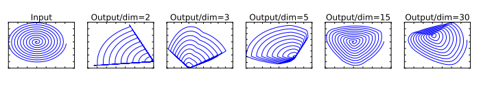
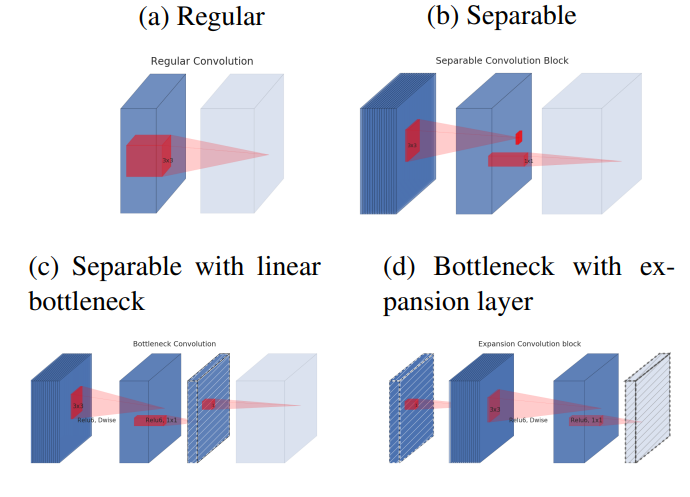
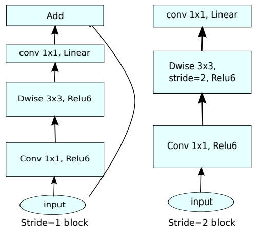

<!--Copyright © XcodeHw 适用于[License](https://github.com/chenzomi12/AISystem)版权许可-->

# MobileNetV1

本章节会介绍MobileNet v1，重点在于其模型结构的轻量化设计，主要介绍详细的轻量化设计原则，基于这原则，MobileNetV1是如何设计成一个小型，低延迟，低功耗的参数化模型，可以满足各种用例的资源约束。可以更方便的实现分类，检测，嵌入和分割等功能。

## 贡献概述

MobileNet v1是一种体积较小、计算量较少、适用于移动设备的卷积神经网络。mobileNet V1的主要创新点是用深度可分离卷积(depthwise separable convolution)代替普通的卷积，并使用宽度乘数(width multiply)减少参数量，在ImageNet图像分类、Stanford Dog 细粒度图像分类、目标检测、人脸属性识别、人脸编码、以图搜地等计算机视觉任务上，结合知识蒸馏进行评估，MobileNet表现出极致的轻量化和速度性能。

## 设计思路

### 逐通道卷积（Depthwise Convolution）

Depthwise Convolution的一个卷积核只有一个通道，输入信息的一个通道只被一个卷积核卷积，这个过程产生的feature map通道数和输入的通道数完全一样，如下图所示：


深度分离卷积把输入特征图的所有通道进行分离， 每个通道对应的一个卷积核对该通道的特征图进行单独的卷积操作(也就是说，第m个深度卷积核作用在输入的第m个通道上，得到输出结果的第m个通道)。在深度分离卷积中，每个卷积核的深度固定为1。

参数量:$D_{k}\times D_{k}\times M$

计算量 :$D_{k}\times  D_{k}\times M\times D_{f}\times D_{f}$

其中$D_{k}$为卷积核尺寸，$D_{f}$为特征图尺寸，M为输入通道数，输出通道数为1。

### 逐点卷积（Pointwise Convolution）
Pointwise Convolution的本质就是$1\times 1$的卷积，它的卷积核的尺寸为$1\times 1\times M$，M为上一层输出信息的通道数。所以这里Pointwise Convolution的每个卷积核会将上一步的特征图在通道方向上进行加权组合，生成新的特征图，如下图所示：


参数量:$1\times 1\times M\times N$

计算量:$1\times 1\times M\times N\times D_{f}\times D_{f}$

其中卷积核尺寸是$1\times1$，$D_{f}$为特征图尺寸，$M$为输入通道数，$N$为输出通道数。

因此计算一次深度可分离卷积的总体计算量为:

$$
D_{k}\cdot D_{k}\cdot M\cdot D_{F}\cdot D_{F} + M\cdot N\cdot D_{F}\cdot D_{F}
$$

它们减少计算量的比例(参数量比例同计算量)为:

$$
\frac{D_{k}\cdot D_{k}\cdot M\cdot D_{F}\cdot D_{F} + M\cdot N\cdot D_{F}\cdot D_{F}}{D_{k}\cdot D_{k}\cdot M\cdot N\cdot D_{F}\cdot D_{F}}=\frac{1}{N}+\frac{1}{D_{k}^{2}}
$$

### 宽度乘子（α）和分辨率乘子（ρ）

宽度和分辨率调整系数用于调整模型的大小和计算复杂性。

- **宽度系数（α）**：宽度系数是一个介于0和1之间的比例因子。通过降低每个卷积层的通道数，可以减少模型中的参数数量和计算量，从而使模型更轻量化。

- **分辨率系数（ρ）**：分辨率系数是一个介于0和1之间的比例因子。通过降低输入图像的分辨率，可以减少卷积操作的计算量和内存消耗。

计算量:
$$
D_{k}\cdot D_{k} \cdot αM\cdotρD_{F}\cdotρD_{F}+ αM\cdot αN\cdotρD_{F}\cdotρD_{F}
$$
计算量减少了:
$$
\frac{D_{k}\cdot D_{k} \cdot αM\cdotρD_{F}\cdotρD_{F}+ αM\cdot αN\cdotρD_{F}\cdotρD_{F}}{D_{k}\cdot D_{k} \cdot M\cdot N\cdot D_{F}\cdot D_{F}} =\frac{αρ}{N}+\frac{α^{2}ρ^{2}}{D_{k}^{2}}
$$

## 网络结构

MBconv由Depthwise Convolution，BN，ReLU组成，基本结构如下图右面所示：


## 代码

```python
import torch.nn as nn
import torch

class MobileNetV1(nn.Module):
    def __init__(self, ch_in, n_classes):
        super(MobileNetV1, self).__init__()

        # 定义普通卷积、BN、激活模块
        def conv_bn(inp, oup, stride):
            return nn.Sequential(
                nn.Conv2d(inp, oup, 3, stride, 1, bias=False),
                nn.BatchNorm2d(oup),
                nn.ReLU(inplace=True)
                )
        # 定义DW、PW卷积模块
        def conv_dw(inp, oup, stride):
            return nn.Sequential(
                # dw
                nn.Conv2d(inp, inp, 3, stride, 1, groups=inp, bias=False),   # DW卷积的卷积核输入与输出的数量一致，且等于分组数
                nn.BatchNorm2d(inp),
                nn.ReLU(inplace=True),

                # pw
                nn.Conv2d(inp, oup, 1, 1, 0, bias=False),
                nn.BatchNorm2d(oup),
                nn.ReLU(inplace=True),
                )

        self.model = nn.Sequential(
            conv_bn(ch_in, 32, 2),
            conv_dw(32, 64, 1),
            conv_dw(64, 128, 2),
            conv_dw(128, 128, 1),
            conv_dw(128, 256, 2),
            conv_dw(256, 256, 1),
            conv_dw(256, 512, 2),
            conv_dw(512, 512, 1),
            conv_dw(512, 512, 1),
            conv_dw(512, 512, 1),
            conv_dw(512, 512, 1),
            conv_dw(512, 512, 1),
            conv_dw(512, 1024, 2),
            conv_dw(1024, 1024, 1),
            nn.AdaptiveAvgPool2d(1)
        )
        self.fc = nn.Linear(1024, n_classes)

    def forward(self, x):
        x = self.model(x)
        x = x.view(-1, 1024)
        x = self.fc(x)
        return x


```
# MobileNetV2

在上一章节中介绍了MobileNetV1版本，主要是将普通卷积转成逐点和逐通道卷积，也讲到了用于调整模型的大小和计算复杂性的宽度和分辨率因子。在本章节中主要会讲解基于V1构建的更高效更 轻量的网络结构。 

## 贡献概述

MobileNet-v2的主要思想就是在v1的基础上引入了线性瓶颈 (Linear Bottleneck)和逆残差 (Inverted Residual)来提高网络的表征能力，同样也是一种轻量级的卷积神经网络。

## 设计思路

### Linear Bottlenecks(线性瓶颈层)

MobileNetV1中引入α参数来做模型通道的缩减，相当于给模型“瘦身”，这样特征信息就能更集中在缩减后的通道中。但研究人员发现深度可分离卷积中有大量卷积核为0，即有很多卷积核没有参与实际计算。研究后发现是ReLU激活函数的问题，认为 ReLU这个激活函数，在低维空间运算中会损失很多信息，而在高维空间中会保留较多有用信息 。ReLU会对维度较低的张量造成较大的信息损耗。
维度越低，损失信息越多。（如下图2和3已经没有螺旋的样子了）；维度越高，损失信息越少（当原始输入维度数增加到15以后再加ReLU，基本不会丢失太多的信息，接近输入）。



如果"manifold of interest"（兴趣流形）都为非零值，则经过ReLU相当于只做了一个线性变换，没有信息丢失，维度足够多时，ReLU能够保留"manifold of interest"（兴趣流形）的完整信息。

论文针对这个问题在Bottleneck末尾使用Linear Bottleneck(即不使用ReLU激活，做了线性变换)来代替原本的非线性激活变换。具体到V2网络中就是将最后的Point-Wise卷积的ReLU6都换成线性函数。

实验证据表明，使用线性层至关重要，因为它可以防止非线性破坏太多的信息。


### 可分离卷积块的演化

可分离卷积块的演化如下图所示:
(a)：标准卷积（一个大方块）；
(b)：深度可分离卷积(=Depthwise convolution+Pointwise Convolution=薄片片+方块块)；
(c)：linear bottleneck，(高维后)relu6-dw-relu6-pw，降维-升维-；
(d)：和图(c)等效，(线性激活后)pw升维-relu6-dw-relu6-pw，降维-线性激活；



### Inverted residuals(反向残差）
反向残差如下图所示


- Original residual block：reduce – transfer – expand （中间窄两头宽）

Residual block先用1x1卷积降通道过ReLU，再3x3卷积过ReLU，最后再用1x1卷积过ReLU恢复通道，并和输入相加。之所以要1*1卷积降通道，是为了减少计算量，不然中间的3x3卷积计算量太大。所以Residual block是中间窄两头宽。

- Inverted residual block：expand – transfer – reduce （中间宽两头窄）

在Inverted Residual block中，3x3卷积变成Depthwise了，计算量很少了，所以通道数可以多一点，效果更好，所以通过1x1卷积先提升通道数，再Depthwise3x3卷积，最后用1x1卷积降低通道数。两端的通道数都很小，所以1x1卷积升通道和降通道计算量都并不大，而中间的通道数虽然多，但是Depthwise 的卷积计算量也不。

### 关于ReLU6

卷积之后通常会接一个 ReLU 非线性激活，在 MobileNet 中使用 ReLU6。ReLU6在普通的 ReLU 基础上限制最大输出为 6，这是为了在移动端设备 float16/int8 的低精度的时候也能有很好的数值分辨率。如果对 ReLU 的激活范围不加限制，输出范围为 0 到正无穷，如果激活值非常大，分布在一个很大的范围内，则低精度的 float16/int8无法很好地精确描述如此大范围的数值，带来精度损失。

## 网络结构

v2的加入了1×1升维，引入Shortcut并且去掉了最后的ReLU，改为Linear。步长为1时，先进行1×1卷积升维，再进行深度卷积提取特征，再通过Linear的逐点卷积降维。将input与output相加，形成残差结构。步长为2时，因为input与output的尺寸不符，因此不添加shortcut结构。整个结构由v2 block堆叠而成。



## 代码

```python
from torch import nn
import torch

def _make_divisible(ch, divisor=8, min_ch=None):
    """
        将输入的通道数(ch)调整到divisor的整数倍，方便硬件加速
    This function is taken from the original tf repo.
    It ensures that all layers have a channel number that is divisible by 8
    It can be seen here:
    https://github.com/tensorflow/models/blob/master/research/slim/nets/mobilenet/mobilenet.py
    """
    if min_ch is None:
        min_ch = divisor
    new_ch = max(min_ch, int(ch + divisor / 2) // divisor * divisor)
    # Make sure that round down does not go down by more than 10%.
    if new_ch < 0.9 * ch:
        new_ch += divisor
    return new_ch

# 定义普通卷积、BN结构
class ConvBNReLU(nn.Sequential):
    def __init__(self, in_channel, out_channel, kernel_size=3, stride=1, groups=1):
        padding = (kernel_size - 1) // 2  # padding的设置根据kernel_size来定，如果kernel_size为3，则padding设置为1；如果kernel_size为1，为padding为0
        super(ConvBNReLU, self).__init__(
            # 在pytorch中，如果设置的 group=1的话，就为普通卷积；如果设置的值为输入特征矩阵的深度的话（即in_channel），则为深度卷积（deptwise conv），并且Dw卷积的输出特征矩阵的深度等于输入特征矩阵的深度
            nn.Conv2d(in_channel, out_channel, kernel_size, stride, padding, groups=groups, bias=False),  # groups=1,表示普通的卷积；因为接下来要使用的是BN层，此处的偏置不起任何作用，所以设置为1
            nn.BatchNorm2d(out_channel),
            nn.ReLU6(inplace=True)    # 此处使用的是Relu6激活函数
        )

# 定义mobile网络基本结构--即到残差结构
class InvertedResidual(nn.Module):
    def __init__(self, in_channel, out_channel, stride, expand_ratio):
        super(InvertedResidual, self).__init__()
        hidden_channel = in_channel * expand_ratio
        self.use_shortcut = stride == 1 and in_channel == out_channel  # stride == 1 and in_channel == out_channel：保证输入矩阵与输出矩阵的shape一致，且通道数也一致，这样才可以进行shurtcut

        layers = []
        if expand_ratio != 1:  # 表示如果扩展因子不为1时，则使用1x1的卷积层（即对输入特征矩阵的深度进行扩充）
            # 1x1 pointwise conv
            layers.append(ConvBNReLU(in_channel, hidden_channel, kernel_size=1))
        layers.extend([
            # 3x3 depthwise conv
            # 在pytorch中，如果设置的 group=1的话，就为普通卷积；如果设置的值为输入特征矩阵的深度的话（即in_channel），则为深度卷积（deptwise conv），并且Dw卷积的输出特征矩阵的深度等于输入特征矩阵的深度
            ConvBNReLU(hidden_channel, hidden_channel, stride=stride, groups=hidden_channel),
            # 1x1 pointwise conv(linear)  因为其后跟随的是线性激活函数，即y=x，所以其后面不在跟随激活函数
            nn.Conv2d(hidden_channel, out_channel, kernel_size=1, bias=False),
            nn.BatchNorm2d(out_channel),
        ])

        self.conv = nn.Sequential(*layers)

    def forward(self, x):
        if self.use_shortcut:
            return x + self.conv(x)
        else:
            return self.conv(x)

# 定义mobileNetV2网络
class MobileNetV2(nn.Module):
    def __init__(self, num_classes=1000, alpha=1.0, round_nearest=8):
        super(MobileNetV2, self).__init__()
        block = InvertedResidual
        input_channel = _make_divisible(32 * alpha, round_nearest)  # 将卷积核的个数调整为8的整数倍
        last_channel = _make_divisible(1280 * alpha, round_nearest)

        inverted_residual_setting = [
            # t, c, n, s
            [1, 16, 1, 1],
            [6, 24, 2, 2],
            [6, 32, 3, 2],
            [6, 64, 4, 2],
            [6, 96, 3, 1],
            [6, 160, 3, 2],
            [6, 320, 1, 1],
        ]

        features = []
        # conv1 layer
        features.append(ConvBNReLU(3, input_channel, stride=2))   # 添加第一层普通卷积层
        # building inverted residual residual blockes
        for t, c, n, s in inverted_residual_setting:
            output_channel = _make_divisible(c * alpha, round_nearest)   # 根据alpha因子调整卷积核的个数
            for i in range(n):   # 循环添加倒残差模块
                stride = s if i == 0 else 1  # s表示的是倒残差模块结构中第一层卷积对应的步距，剩余层都是1
                features.append(block(input_channel, output_channel, stride, expand_ratio=t))  # 添加一系列倒残差结构
                input_channel = output_channel
        # building last several layers
        features.append(ConvBNReLU(input_channel, last_channel, 1))  # 构建最后一层卷积层
        # combine feature layers
        self.features = nn.Sequential(*features)

        # building classifier
        self.avgpool = nn.AdaptiveAvgPool2d((1, 1))  # 采用自适应平均采样层
        self.classifier = nn.Sequential(
            nn.Dropout(0.2),
            nn.Linear(last_channel, num_classes)
        )

        # weight initialization  初始化全只能怪
        for m in self.modules():
            if isinstance(m, nn.Conv2d):
                nn.init.kaiming_normal_(m.weight, mode='fan_out')
                if m.bias is not None:
                    nn.init.zeros_(m.bias)
            elif isinstance(m, nn.BatchNorm2d):
                nn.init.ones_(m.weight)
                nn.init.zeros_(m.bias)
            elif isinstance(m, nn.Linear):
                nn.init.normal_(m.weight, 0, 0.01)   # 初始化为正态分布的函数，均值为0，方差为0.01
                nn.init.zeros_(m.bias)

    def forward(self, x):
        x = self.features(x)
        x = self.avgpool(x)
        x = torch.flatten(x, 1)
        x = self.classifier(x)
        return x

```

# MobileNetV3

在本章节会主要介绍MobileNetV3相对于V1，V2的改进之处，除了介绍更轻量的网络结构外，还会给大家带来新的技术，什么是神经网络结构搜索(Nas)，以及Nas如何与MobileNet进行结合。

## 贡献概述

MobileNetV3 是由 google 团队在 2019 年提出的轻量化网络模型，传统的卷积神经网络，内容需求大，运算量大，无法再移动设备以及嵌入式设备上运行，为了解决这一问题，MobileNet网络应运而生。MobileNetV3在移动端图像分类、目标检测、语义分割等任务上均取得了优秀的表现。MobileNetV3采用了很多新的技术，包括针对通道注意力的Squeeze-and-Excitation模块、NAS搜索方法等，这些方法都有利于进一步提升网络的性能。

## 设计原则

### 重新设计耗时层结构

首先，减少网络第一个卷积层的卷积核个数，从32减到16，然后精简了最后的Stage，将原来搜索到的最后阶段的人工精简，删除了多余的卷积层，将延迟较少了7毫秒，将近全部运行时间的11%，并减少了3000万的乘加操作次数，几乎没有损失准确性。


### 重新设计激活函数

引入新的非线性激活函数：h-swish。swish公式：

$$
Swish x = x*α(x)
$$

这里σ(x)是sigmoid函数。swish虽然提高了精度，但sigmoid函数计算是极为昂贵的，在嵌入式移动端不适合它的存在，因此，MobileNet_V3提出了计算更为简便的h-swish函数，其定义如下：

$$
h-swish[x] = x\frac{ReLU6(x+3)}{6}
$$

替换前后能够对swish进行一个很好的近似，如下图所示:


在网络结构搜索中，作者结合两种技术：资源受限的NAS（platform-aware NAS）与NetAdapt，前者用于在计算和参数量受限的前提下搜索网络的各个模块，所以称之为模块级的搜索（Block-wise Search） ，后者用于对各个模块确定之后网络层的微调。

### NAS 搜索全局结构（Block-wise Search）

采用NSA方法来搜寻全局网络结构，另外需要针对轻量模型进行优化，用一个多目标奖励。

$$
{ACC(m)x[LAT(m)/TAR]}^{w}
$$

来近似pareto最优解，根据目标延迟TAR为每个模型m平衡模型精度ACC(m)和延迟LAT(m)。用较小的权重因子w =-0.15来弥补不同的延迟的更大精度变化。从头训练了一个新的架构搜索，找到了初始的seed模型，然后应用NetAdapt和其他优化来获得最终的MobilenetV3-Small模型。

### NetAdapt 搜索层结构（Layer-wise Search）

$$
\frac{ΔACC}{ΔLatency}
$$

给定一个K conv and FC layers的网络Net，在每一步的结构更改中，需要减少一个给定个值deltaR，然后调整每层的卷积核数，生成一个Net_simp集合，从中找到目标延时的网络。保持循环，直到满足给定条件后finetune网络。V3用了两种减少延迟的方法来产生网络：

- 减少expansion layer的size。

- 减少所有共享相同bottleneck size模块的瓶颈。


## 网络结构

### SE结构

首先使用一个全局池化层将每个通道变成一个具体的数值，然后接两个全连接层，最后通过一个H-Sigmoid函数获取最终的权重，赋值给最初的特征图。


### MobileNet v3 block

核心模块，也是网络的基本模块。主要实现了通道可分离卷积+SE通道注意力机制+残差连接。结构图如下：


## 代码

```python
from typing import Callable, List, Optional

import torch
from torch import nn, Tensor
from torch.nn import functional as F
from functools import partial

# 得到同传入数据最近的8的整数倍数值
def _make_divisible(ch, divisor=8, min_ch=None):
    """
    This function is taken from the original tf repo.
    It ensures that all layers have a channel number that is divisible by 8
    It can be seen here:
    https://github.com/tensorflow/models/blob/master/research/slim/nets/mobilenet/mobilenet.py
    """
    if min_ch is None:
        min_ch = divisor
    new_ch = max(min_ch, int(ch + divisor / 2) // divisor * divisor)
    # Make sure that round down does not go down by more than 10%.
    if new_ch < 0.9 * ch:
        new_ch += divisor
    return new_ch

# 普通卷积、BN、激活层模块
class ConvBNActivation(nn.Sequential):
    def __init__(self,
                 in_planes: int,   # 输入特征矩阵的通道
                 out_planes: int,  # 输出特征矩阵的通道
                 kernel_size: int = 3,
                 stride: int = 1,
                 groups: int = 1,
                 norm_layer: Optional[Callable[..., nn.Module]] = None,   # 在卷积后的BN层
                 activation_layer: Optional[Callable[..., nn.Module]] = None):  # 激活函数
        padding = (kernel_size - 1) // 2
        if norm_layer is None:
            norm_layer = nn.BatchNorm2d
        if activation_layer is None:
            activation_layer = nn.ReLU6
        super(ConvBNActivation, self).__init__(nn.Conv2d(in_channels=in_planes,
                                                         out_channels=out_planes,
                                                         kernel_size=kernel_size,
                                                         stride=stride,
                                                         padding=padding,
                                                         groups=groups,
                                                         bias=False),
                                               norm_layer(out_planes),   # BN层
                                               activation_layer(inplace=True))

# 注意力机制模块（SE模块，即两个全连接层）   该模块的基本流程是：先进行自适应平均池化(1x1)———>1x1的卷积层———>relu激活层———>1x1的卷积池化———>hardsigmoid()激活函数激活
class SqueezeExcitation(nn.Module):
    def __init__(self, input_c: int, squeeze_factor: int = 4):
        super(SqueezeExcitation, self).__init__()
        squeeze_c = _make_divisible(input_c // squeeze_factor, 8)    # 获得距离该数最近的8的整数倍的数字
        self.fc1 = nn.Conv2d(input_c, squeeze_c, 1)    # 该卷积的输出的squeeze_c是输入input_c的1/4  其作用与全连接层一样
        self.fc2 = nn.Conv2d(squeeze_c, input_c, 1)

    def forward(self, x: Tensor) -> Tensor:
        scale = F.adaptive_avg_pool2d(x, output_size=(1, 1))   # 将特征矩阵每一个channel上的数据给平均池化到1x1的大小
        scale = self.fc1(scale)
        scale = F.relu(scale, inplace=True)
        scale = self.fc2(scale)
        scale = F.hardsigmoid(scale, inplace=True)   # 激活函数
        return scale * x   # 将得到的数据与传入的对应channel数据进行相乘


# 定义block的配置类
class InvertedResidualConfig:
    def __init__(self,
                 input_c: int,  # block模块中的第一个1x1卷积层的输入channel数
                 kernel: int,   # depthwise卷积的卷积核大小
                 expanded_c: int,   # block模块中的第一个1x1卷积层的输出channel数
                 out_c: int,  # 经过block模块中第二个1x1卷积层处理过后得到的channel数
                 use_se: bool,  # 是否使用注意力机制模块
                 activation: str,   # 激活方式
                 stride: int,       # 步长
                 width_multi: float):  # width_multi：调节每个卷积层所使用channel的倍率因子
        self.input_c = self.adjust_channels(input_c, width_multi)
        self.kernel = kernel
        self.expanded_c = self.adjust_channels(expanded_c, width_multi)
        self.out_c = self.adjust_channels(out_c, width_multi)
        self.use_se = use_se
        self.use_hs = activation == "HS"  # whether using h-swish activation
        self.stride = stride

    @staticmethod
    def adjust_channels(channels: int, width_multi: float):
        return _make_divisible(channels * width_multi, 8)


# 定义block模块
# 此为block模块，其包含第一个1x1卷积层、DeptWis卷积层、SE注意力机制层（判断是否需求）、第二个1x1卷积层、激活函数（需要判断是否是非线性激活）
class InvertedResidual(nn.Module):
    def __init__(self,
                 cnf: InvertedResidualConfig,   # cnf:配置类参数
                 norm_layer: Callable[..., nn.Module]):      # norm_layer：# BN层
        super(InvertedResidual, self).__init__()

        if cnf.stride not in [1, 2]:  # 判断某一层的配置文件，其步长是否满足条件
            raise ValueError("illegal stride value.")

        # 判断是否进行短连接
        self.use_res_connect = (cnf.stride == 1 and cnf.input_c == cnf.out_c)  # 只有当步长为1，并且输入通道等于输出通道数

        layers: List[nn.Module] = []
        activation_layer = nn.Hardswish if cnf.use_hs else nn.ReLU    # 判断当前的激活函数类型

        # expand
        # 判断是否相等，如果相等，则不适用1x1的卷积层增加channel维度；不相等的话，才使用该层进行升维度
        if cnf.expanded_c != cnf.input_c:
            layers.append(ConvBNActivation(cnf.input_c,
                                           cnf.expanded_c,
                                           kernel_size=1,
                                           norm_layer=norm_layer,
                                           activation_layer=activation_layer))

        # depthwise
        layers.append(ConvBNActivation(cnf.expanded_c,
                                       cnf.expanded_c,
                                       kernel_size=cnf.kernel,   # depthwise卷积的卷积核大小
                                       stride=cnf.stride,
                                       groups=cnf.expanded_c,    # 深度DW卷积
                                       norm_layer=norm_layer,   # BN层
                                       activation_layer=activation_layer))

        # 判断是否需要添加SE模块
        if cnf.use_se:
            layers.append(SqueezeExcitation(cnf.expanded_c))

        # project
        layers.append(ConvBNActivation(cnf.expanded_c,
                                       cnf.out_c,
                                       kernel_size=1,
                                       norm_layer=norm_layer,  # BN 层
                                       activation_layer=nn.Identity))   # 此层的activation_layer就是进行里普通的线性激活，没有做任何的处理

        self.block = nn.Sequential(*layers)
        self.out_channels = cnf.out_c
        self.is_strided = cnf.stride > 1

    def forward(self, x: Tensor) -> Tensor:
        result = self.block(x)
        if self.use_res_connect:
            result += x   # 进行shortcut连接

        return result


# MobileNetV3网络结构基础框架：其包括：模型的第一层卷积层———>nx【bneckBlock模块】———>1x1的卷积层———>自适应平均池化层———>全连接层———>全连接层
class MobileNetV3(nn.Module):
    def __init__(self,
                 inverted_residual_setting: List[InvertedResidualConfig],           # beneckBlock结构一系列参数列表
                 last_channel: int,   # 对应的是倒数第二个全连接层输出节点数  1280
                 num_classes: int = 1000,  # 类别个数
                 block: Optional[Callable[..., nn.Module]] = None,   # InvertedResidual核心模块
                 norm_layer: Optional[Callable[..., nn.Module]] = None):
        super(MobileNetV3, self).__init__()

        if not inverted_residual_setting:
            raise ValueError("The inverted_residual_setting should not be empty.")
        elif not (isinstance(inverted_residual_setting, List) and
                  all([isinstance(s, InvertedResidualConfig) for s in inverted_residual_setting])):
            raise TypeError("The inverted_residual_setting should be List[InvertedResidualConfig]")

        if block is None:
            block = InvertedResidual   # block类

        if norm_layer is None:
            norm_layer = partial(nn.BatchNorm2d, eps=0.001, momentum=0.01)  # partial()为python方法，即为nn.BatchNorm2d传入默认的两个参数

        layers: List[nn.Module] = []

        # building first layer
        # 构建第一层卷积结构
        firstconv_output_c = inverted_residual_setting[0].input_c   # 表示第一个卷积层输出的channel数
        layers.append(ConvBNActivation(3,   # 输入图像数据的channel数
                                       firstconv_output_c,    # 输出channel
                                       kernel_size=3,
                                       stride=2,
                                       norm_layer=norm_layer,
                                       activation_layer=nn.Hardswish))
        # building inverted residual blocks
        # 利用循环的方式添加block模块，将每层的配置文件传给block
        for cnf in inverted_residual_setting:
            layers.append(block(cnf, norm_layer))

        # building last several layers
        lastconv_input_c = inverted_residual_setting[-1].out_c  # 最后的bneckblock的输出channel
        lastconv_output_c = 6 * lastconv_input_c    # lastconv_output_c 与 最后的bneckblock的输出channel数是六倍的关系

        # 定义最后一层的卷积层
        layers.append(ConvBNActivation(lastconv_input_c,   # 最后的bneckblock的输出channel数
                                       lastconv_output_c,   # lastconv_output_c 与 最后的bneckblock的输出channel数是六倍的关系
                                       kernel_size=1,
                                       norm_layer=norm_layer,
                                       activation_layer=nn.Hardswish))
        self.features = nn.Sequential(*layers)
        self.avgpool = nn.AdaptiveAvgPool2d(1)
        self.classifier = nn.Sequential(nn.Linear(lastconv_output_c, last_channel),
                                        nn.Hardswish(inplace=True),
                                        nn.Dropout(p=0.2, inplace=True),
                                        nn.Linear(last_channel, num_classes))

        # initial weights
        for m in self.modules():
            if isinstance(m, nn.Conv2d):
                nn.init.kaiming_normal_(m.weight, mode="fan_out")
                if m.bias is not None:
                    nn.init.zeros_(m.bias)
            elif isinstance(m, (nn.BatchNorm2d, nn.GroupNorm)):
                nn.init.ones_(m.weight)
                nn.init.zeros_(m.bias)
            elif isinstance(m, nn.Linear):
                nn.init.normal_(m.weight, 0, 0.01)
                nn.init.zeros_(m.bias)

    def _forward_impl(self, x: Tensor) -> Tensor:
        x = self.features(x)
        x = self.avgpool(x)
        x = torch.flatten(x, 1)
        x = self.classifier(x)

        return x

    def forward(self, x: Tensor) -> Tensor:
        return self._forward_impl(x)


### 构建large基础mobilenet_v3_large模型
def mobilenet_v3_large(num_classes: int = 1000,
                       reduced_tail: bool = False) -> MobileNetV3:
    """
    Constructs a large MobileNetV3 architecture from
    "Searching for MobileNetV3" <https://arxiv.org/abs/1905.02244>.

    weights_link:
    https://download.pytorch.org/models/mobilenet_v3_large-8738ca79.pth

    Args:
        num_classes (int): number of classes
        reduced_tail (bool): If True, reduces the channel counts of all feature layers
            between C4 and C5 by 2. It is used to reduce the channel redundancy in the
            backbone for Detection and Segmentation.
    """
    width_multi = 1.0
    bneck_conf = partial(InvertedResidualConfig, width_multi=width_multi)
    adjust_channels = partial(InvertedResidualConfig.adjust_channels, width_multi=width_multi)

    reduce_divider = 2 if reduced_tail else 1   # 是否较少网络参数标志，默认是False，即不减少

    # # beneckBlock结构一系列参数列表
    inverted_residual_setting = [
        # input_c, kernel, expanded_c, out_c, use_se, activation, stride
        bneck_conf(16, 3, 16, 16, False, "RE", 1),
        bneck_conf(16, 3, 64, 24, False, "RE", 2),  # C1
        bneck_conf(24, 3, 72, 24, False, "RE", 1),
        bneck_conf(24, 5, 72, 40, True, "RE", 2),  # C2
        bneck_conf(40, 5, 120, 40, True, "RE", 1),
        bneck_conf(40, 5, 120, 40, True, "RE", 1),
        bneck_conf(40, 3, 240, 80, False, "HS", 2),  # C3
        bneck_conf(80, 3, 200, 80, False, "HS", 1),
        bneck_conf(80, 3, 184, 80, False, "HS", 1),
        bneck_conf(80, 3, 184, 80, False, "HS", 1),
        bneck_conf(80, 3, 480, 112, True, "HS", 1),
        bneck_conf(112, 3, 672, 112, True, "HS", 1),
        bneck_conf(112, 5, 672, 160 // reduce_divider, True, "HS", 2),  # C4
        bneck_conf(160 // reduce_divider, 5, 960 // reduce_divider, 160 // reduce_divider, True, "HS", 1),
        bneck_conf(160 // reduce_divider, 5, 960 // reduce_divider, 160 // reduce_divider, True, "HS", 1),
    ]
    last_channel = adjust_channels(1280 // reduce_divider)  # C5

    return MobileNetV3(inverted_residual_setting=inverted_residual_setting,
                       last_channel=last_channel,
                       num_classes=num_classes)

### 构建small基础mobilenet_v3_small模型
def mobilenet_v3_small(num_classes: int = 1000,
                       reduced_tail: bool = False) -> MobileNetV3:
    """
    Constructs a large MobileNetV3 architecture from
    "Searching for MobileNetV3" <https://arxiv.org/abs/1905.02244>.

    weights_link:
    https://download.pytorch.org/models/mobilenet_v3_small-047dcff4.pth

    Args:
        num_classes (int): number of classes
        reduced_tail (bool): If True, reduces the channel counts of all feature layers
            between C4 and C5 by 2. It is used to reduce the channel redundancy in the
            backbone for Detection and Segmentation.
    """
    width_multi = 1.0
    bneck_conf = partial(InvertedResidualConfig, width_multi=width_multi)
    adjust_channels = partial(InvertedResidualConfig.adjust_channels, width_multi=width_multi)

    reduce_divider = 2 if reduced_tail else 1

    inverted_residual_setting = [
        # input_c, kernel, expanded_c, out_c, use_se, activation, stride
        bneck_conf(16, 3, 16, 16, True, "RE", 2),  # C1
        bneck_conf(16, 3, 72, 24, False, "RE", 2),  # C2
        bneck_conf(24, 3, 88, 24, False, "RE", 1),
        bneck_conf(24, 5, 96, 40, True, "HS", 2),  # C3
        bneck_conf(40, 5, 240, 40, True, "HS", 1),
        bneck_conf(40, 5, 240, 40, True, "HS", 1),
        bneck_conf(40, 5, 120, 48, True, "HS", 1),
        bneck_conf(48, 5, 144, 48, True, "HS", 1),
        bneck_conf(48, 5, 288, 96 // reduce_divider, True, "HS", 2),  # C4
        bneck_conf(96 // reduce_divider, 5, 576 // reduce_divider, 96 // reduce_divider, True, "HS", 1),
        bneck_conf(96 // reduce_divider, 5, 576 // reduce_divider, 96 // reduce_divider, True, "HS", 1)
    ]
    last_channel = adjust_channels(1024 // reduce_divider)  # C5

    return MobileNetV3(inverted_residual_setting=inverted_residual_setting,
                       last_channel=last_channel,
                       num_classes=num_classes)


```


# 小结

MobileNet V1是一种高效、轻量级的深度学习模型，适用于移动设备和嵌入式系统。其主要特点包括采用深度可分离卷积技术、具有宽度和分辨率调整系数、低延迟、低计算资源占用，以及广泛应用于多种计算机视觉任务。MobileNet V2是在V1基础上提出的升级版轻量级深度学习卷积神经网络（CNN）架构。它在提高性能的同时保持了低计算复杂性和参数数量的优势，适用于移动设备和嵌入式系统。MobileNet V3是在 V2基础上进一步优化的轻量级深度学习卷积神经网络（CNN）架构。它继承了MobileNet V1和MobileNet V2的优点，同时融合了神经网络架构搜索技术（Neural Architecture Search，NAS），在性能和效率方面取得了更大的提升。

## 参考文献

1.[M. Abadi, A. Agarwal, P. Barham, E. Brevdo, Z. Chen,C. Citro, G. S. Corrado, A. Davis, J. Dean, M. Devin, et al.Tensorflow: Large-scale machine learning on heterogeneous  systems, 2015. Software available from tensorflow. org, 1,2015.](https://arxiv.org/abs/1603.04467)

2.[I. Hubara, M. Courbariaux, D. Soudry, R. El-Yaniv, and Y. Bengio. Quantized neural networks: Training neural networks with low precision weights and activations. arXiv preprint arXiv:1609.07061, 2016. 2](https://arxiv.org/pdf/1609.07061.pdf)

3.[F. N. Iandola, M. W. Moskewicz, K. Ashraf, S. Han, W. J.Dally, and K. Keutzer. Squeezenet: Alexnet-level accuracy with 50x fewer parameters and¡ 1mb model size. arXiv preprint arXiv:1602.07360, 2016. 1, 6](https://arxiv.org/pdf/1602.07360.pdf)

4.[S. Ioffe and C. Szegedy. Batch normalization: Accelerating deep network training by reducing internal covariate shift.arXiv preprint arXiv:1502.03167, 2015.](https://arxiv.org/abs/1502.03167)

5.[M. Jaderberg, A. Vedaldi, and A. Zisserman. Speeding up convolutional neural networks with low rank expansions.arXiv preprint arXiv:1405.3866, 2014. 2](https://arxiv.org/abs/1405.3866)

6.[Y. Jia, E. Shelhamer, J. Donahue, S. Karayev, J. Long, R. Girshick, S. Guadarrama, and T. Darrell. Caffe: Convolutional architecture for fast feature embedding. arXiv preprint arXiv:1408.5093, 2014. 4](https://dl.acm.org/doi/10.1145/2647868.2654889)

7.[ J. Jin, A. Dundar, and E. Culurciello. Flattened convolutional neural networks for feedforward acceleration. arXiv preprint arXiv:1412.5474, 2014. 1, 3](https://arxiv.org/abs/1412.5474v4)

8.[A. Khosla, N. Jayadevaprakash, B. Yao, and L. Fei-Fei.Novel dataset for fine-grained image categorization. In First Workshop on Fine-Grained Visual Categorization, IEEE Conference on Computer Vision and Pattern Recognition,Colorado Springs, CO, June 2011. 6](http://vision.stanford.edu/aditya86/ImageNetDogs)

9.[J. Krause, B. Sapp, A. Howard, H. Zhou, A. Toshev,T. Duerig, J. Philbin, and L. Fei-Fei. The unreasonable effectiveness of noisy data for fine-grained recognition. arXiv preprint arXiv:1511.06789, 2015. 6](https://arxiv.org/abs/1511.06789v1)

10.[R. Avenash and P. Vishawanth. Semantic segmentation of satellite images using a modified cnn with hard-swish activation function. In VISIGRAPP, 2019. 2, 4](https://www.scitepress.org/Papers/2019/74696/74696.pdf)

11.[ Jonathan Huang, Vivek Rathod, Chen Sun, Menglong Zhu, Anoop Korattikara, Alireza Fathi,Ian Fischer, Zbigniew Wojna, Yang Song, Sergio Guadarrama, et al. Speed/accuracy trade-offs for modern convolutional object detectors. In CVPR,2017. 7](https://openaccess.thecvf.com/content_cvpr_2017/html/Huang_SpeedAccuracy_Trade-Offs_for_CVPR_2017_paper.html)

12.[Wei Liu, Dragomir Anguelov, Dumitru Erhan,Christian Szegedy, Scott Reed, Cheng-Yang Fu,and Alexander C Berg. Ssd: Single shot multibox detector. In ECCV, 2016.]()

13.[Jonathan Huang, Vivek Rathod, Derek Chow,Chen Sun, and Menglong Zhu. Tensorflow object detection api, 2017. 7](https://arxiv.longhoe.net/abs/1512.02325)

14.[Liang-Chieh Chen, George Papandreou, Florian Schroff, and Hartwig Adam. Rethinking atrous convolution for semantic image segmentation. CoRR, abs/1706.05587, 2017. 7](https://arxiv.org/abs/1706.05587)

15.[Matthias Holschneider, Richard KronlandMartinet, Jean Morlet, and Ph Tchamitchian.A real-time algorithm for signal analysis with the help of the wavelet transform. In Wavelets:Time-Frequency Methods and Phase Space, pages 289–297. 1989. 7](https://cir.nii.ac.jp/crid/1573668925020519424)

16.[Pierre Sermanet, David Eigen, Xiang Zhang,Michael Mathieu, Rob Fergus, and Yann Le- ¨Cun. Overfeat: Integrated recognition, localization and detection using convolutional networks.arXiv:1312.6229, 2013. 7](https://cir.nii.ac.jp/crid/1573668925020519424)

17.[George Papandreou, Iasonas Kokkinos, and PierreAndre Savalle. Modeling local and global deformations in deep learning: Epitomic convolution,multiple instance learning, and sliding window detection. In CVPR, 2015. 7](https://www.cv-foundation.org/openaccess/content_cvpr_2015/html/Papandreou_Modeling_Local_and_2015_CVPR_paper.html)

18.[T.-Y. Lin, M. Maire, S. Belongie, J. Hays, P. Perona, D. Ramanan, P. Dollar, and C. L. Zitnick. Microsoft COCO: Common objects in context. In ECCV, 2014. 7](https://ui.adsabs.harvard.edu/abs/2014arXiv1405.0312L/abstract)

19[C. Liu, B. Zoph, J. Shlens, W. Hua, L. Li, L. Fei-Fei, A. L.Yuille, J. Huang, and K. Murphy.Progressive neural architecture search. CoRR, abs/1712.00559, 2017. 2](https://openaccess.thecvf.com/content_ECCV_2018/html/Chenxi_Liu_Progressive_Neural_Architecture_ECCV_2018_paper.html)

20.[H. Liu, K. Simonyan, and Y. Yang. DARTS: differentiable architecture search. CoRR, abs/1806.09055, 2018. 2](https://arxiv.longhoe.net/abs/1806.09055)

21.[W. Liu, A. Rabinovich, and A. C. Berg. Parsenet: Looking wider to see better. CoRR, abs/1506.04579, 2015. 7](https://arxiv.longhoe.net/abs/1506.04579)

22.[ J. Long, E. Shelhamer, and T. Darrell. Fully convolutional networks for semantic segmentation. In CVPR, 2015. 8](https://openaccess.thecvf.com/content_cvpr_2015/html/Long_Fully_Convolutional_Networks_2015_CVPR_paper.html)

22.[S. Mehta, M. Rastegari, A. Caspi, L. G. Shapiro, and H. Hajishirzi. Espnet: Efficient spatial pyramid of dilated convolutions for semantic segmentation. In Computer Vision -ECCV 2018 - 15th European Conference, Munich, Germany,September 8-14, 2018, Proceedings, Part X, pages 561–580,2018. 8](https://arxiv.longhoe.net/abs/1803.06815)

23.[S. Mehta, M. Rastegari, L. G. Shapiro, and H. Hajishirzi. Espnetv2: A light-weight, power efficient, and general purpose convolutional neural network. CoRR, abs/1811.11431, 2018.](https://arxiv.longhoe.net/abs/1811.11431)

24.[H. Park, Y. Yoo, G. Seo, D. Han, S. Yun, and N. Kwak.Concentrated-comprehensive convolutions for lightweightsemantic segmentation. CoRR, abs/1812.04920, 2018. 8](https://www.researchgate.net/publication/329607971_Concentrated-Comprehensive_Convolutions_for_lightweight_semantic_segmentation)

25.[H. Pham, M. Y. Guan, B. Zoph, Q. V. Le, and J. Dean.Efficient neural architecture search via parameter sharing.CoRR, abs/1802.03268, 2018. 2](https://arxiv.longhoe.net/abs/1802.03268)

26.[P. Ramachandran, B. Zoph, and Q. V. Le. Searching for activation functions. CoRR, abs/1710.05941, 2017. 2, 4](https://arxiv.longhoe.net/abs/1710.05941)

27.[F. N. Iandola, M. W. Moskewicz, K. Ashraf, S. Han, W. J.Dally, and K. Keutzer. Squeezenet: Alexnet-level accuracy  with 50x fewer parameters and <1mb model size. CoRR,abs/1602.07360, 2016. 2](https://arxiv.longhoe.net/abs/1602.07360)

28.[J. Wu, C. Leng, Y. Wang, Q. Hu, and J. Cheng. Quantized convolutional neural networks for mobile devices. CoRR,abs/1512.06473, 2015. 2](https://openaccess.thecvf.com/content_cvpr_2016/html/Wu_Quantized_Convolutional_Neural_CVPR_2016_paper.html)

29.[S. Zhou, Z. Ni, X. Zhou, H. Wen, Y. Wu, and Y. Zou. Dorefanet: Training low bitwidth convolutional neural networks with low bitwidth gradients. CoRR, abs/1606.06160, 2016.](https://arxiv.longhoe.net/abs/1606.06160)


## 本节视频

<html>

<iframe src="https://player.bilibili.com/player.html?bvid=BV1Y84y1b7xj&as_wide=1&high_quality=1&danmaku=0&t=30&autoplay=0" width="100%" height="500" scrolling="no" border="0" frameborder="no" framespacing="0" allowfullscreen="true"> </iframe>

</html>

