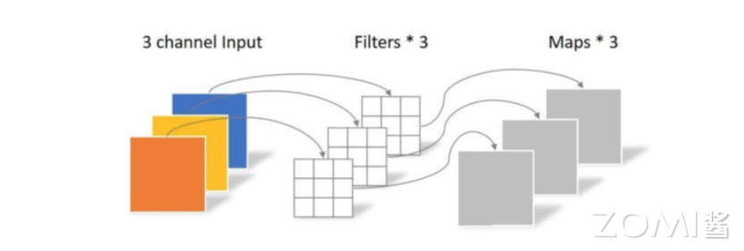
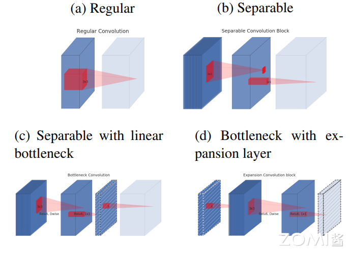
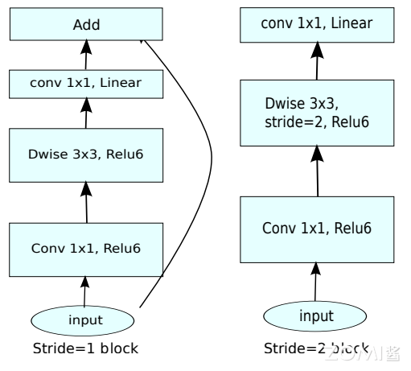
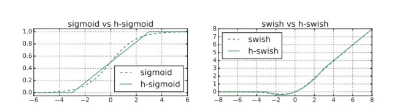
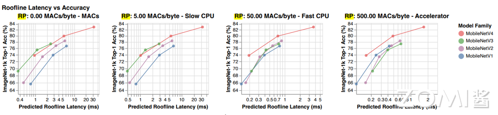
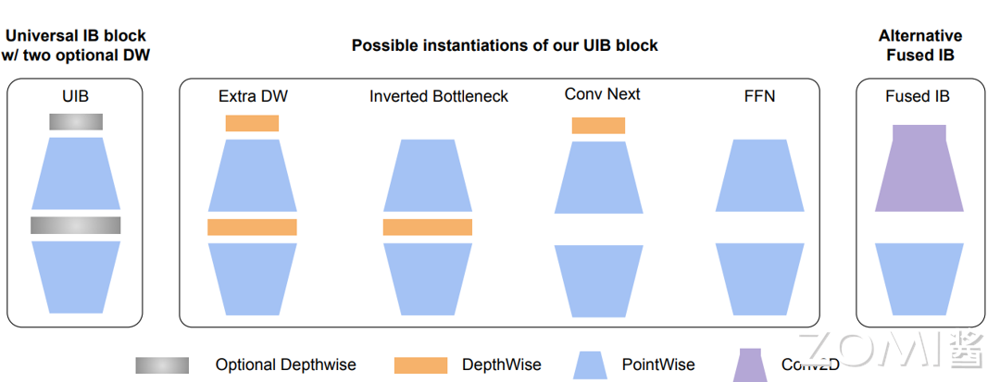

<!--Copyright © XcodeHw 适用于[License](https://github.com/chenzomi12/AISystem)版权许可-->

# MobileNet 系列

在本章节会介绍 MobileNet 系列，重点在于其模型结构的轻量化设计，主要介绍详细的轻量化设计原则，基于这原则，MobileNetV1 是如何设计成一个小型，低延迟，低功耗的参数化模型，可以满足各种用例的资源约束。可以更方便的实现分类，检测，嵌入和分割等功能。会结合目前较流行的深度学习技术，在V1的基础会分别讲解V2，V3，V4做出的改进升级，让读者们更深入了解轻量级网络结构的设计思路与过程。

## MobileNet V1

MobileNet V1 是一种体积较小、计算量较少、适用于移动设备的卷积神经网络。mobileNet V1 的主要创新点是用深度可分离卷积(depthwise separable convolution)代替普通的卷积，并使用宽度乘数(width multiply)减少参数量，在 ImageNet 图像分类、Stanford Dog 细粒度图像分类、目标检测、人脸属性识别、人脸编码、以图搜地等计算机视觉任务上，结合知识蒸馏进行评估，MobileNet 表现出极致的轻量化和速度性能。

### 逐通道卷积

逐通道卷积（Depthwise Convolution）的一个卷积核只有一个通道，输入信息的一个通道只被一个卷积核卷积，这个过程产生的 feature map 通道数和输入的通道数完全一样，如下图所示：



深度分离卷积把输入特征图的所有通道进行分离，每个通道对应的一个卷积核对该通道的特征图进行单独的卷积操作(也就是说，第 m 个深度卷积核作用在输入的第 m 个通道上，得到输出结果的第 m 个通道)。在深度分离卷积中，每个卷积核的深度固定为 1。

参数量:$D_{k}\times D_{k}\times M$

计算量 :$D_{k}\times  D_{k}\times M\times D_{f}\times D_{f}$

其中 $D_{k}$ 为卷积核尺寸，$D_{f}$ 为特征图尺寸，M 为输入通道数，输出通道数为 1。

### 逐点卷积

逐点卷积（Pointwise Convolution）的本质就是 $1\times 1$ 的卷积，它的卷积核的尺寸为 $1\times 1\times M$，M 为上一层输出信息的通道数。所以这里 Pointwise Convolution 的每个卷积核会将上一步的特征图在通道方向上进行加权组合，生成新的特征图，如下图所示：


参数量:$1\times 1\times M\times N$

计算量:$1\times 1\times M\times N\times D_{f}\times D_{f}$

其中卷积核尺寸是 $1\times1$，$D_{f}$ 为特征图尺寸，$M$ 为输入通道数，$N$ 为输出通道数。

因此计算一次深度可分离卷积的总体计算量为:

$$
D_{k}\cdot D_{k}\cdot M\cdot D_{F}\cdot D_{F} + M\cdot N\cdot D_{F}\cdot D_{F}
$$

它们减少计算量的比例(参数量比例同计算量)为:

$$
\frac{D_{k}\cdot D_{k}\cdot M\cdot D_{F}\cdot D_{F} + M\cdot N\cdot D_{F}\cdot D_{F}}{D_{k}\cdot D_{k}\cdot M\cdot N\cdot D_{F}\cdot D_{F}}=\frac{1}{N}+\frac{1}{D_{k}^{2}}
$$

**代码**

```python
# 定义 DW、PW 卷积模块
def conv_dw(inp, oup, stride):
    
    return nn.Sequential(
                # DW  DW 卷积的卷积核输入与输出的数量一致，且等于分组数
                nn.Conv2d(inp, inp, 3, stride, 1, groups=inp, bias=False),  
                nn.BatchNorm2d(inp),
                nn.ReLU(inplace=True),

                # PW
                nn.Conv2d(inp, oup, 1, 1, 0, bias=False),
                nn.BatchNorm2d(oup),
                nn.ReLU(inplace=True),
                )
```


### 宽度&分辨率乘子

宽度和分辨率调整系数用于调整模型的大小和计算复杂性。

- **宽度系数（α）**：宽度系数是一个介于 0 和 1 之间的比例因子。通过降低每个卷积层的通道数，可以减少模型中的参数数量和计算量，从而使模型更轻量化。

- **分辨率系数（ρ）**：分辨率系数是一个介于 0 和 1 之间的比例因子。通过降低输入图像的分辨率，可以减少卷积操作的计算量和内存消耗。

计算量:

$$
D_{k}\cdot D_{k} \cdot αM\cdotρD_{F}\cdotρD_{F}+ αM\cdot αN\cdotρD_{F}\cdotρD_{F}
$$

计算量减少了:

$$
\frac{D_{k}\cdot D_{k} \cdot αM\cdotρD_{F}\cdotρD_{F}+ αM\cdot αN\cdotρD_{F}\cdotρD_{F}}{D_{k}\cdot D_{k} \cdot M\cdot N\cdot D_{F}\cdot D_{F}} =\frac{αρ}{N}+\frac{α^{2}ρ^{2}}{D_{k}^{2}}
$$

### 网络结构

在V1结构中会加入BN，并使用ReLU激活函数，所以depthwise separable convolution的基本结构如下图右面所示, 左面是正常的conv：


**代码**

```python
import torch.nn as nn
import torch
# 定义普通卷积、BN、激活模块
def conv_bn(inp, oup, stride):
    return nn.Sequential(
                nn.Conv2d(inp, oup, 3, stride, 1, bias=False),
                nn.BatchNorm2d(oup),
                nn.ReLU(inplace=True)
                )
# 定义 DW、PW 卷积模块
def conv_dw(inp, oup, stride):
    return nn.Sequential(
                # dw
                nn.Conv2d(inp, inp, 3, stride, 1, groups=inp, bias=False),   # DW 卷积的卷积核输入与输出的数量一致，且等于分组数
                nn.BatchNorm2d(inp),
                nn.ReLU(inplace=True),

                # pw
                nn.Conv2d(inp, oup, 1, 1, 0, bias=False),
                nn.BatchNorm2d(oup),
                nn.ReLU(inplace=True),
                )

```

整体网络就是通过不断堆叠MBconv组件组成的,首先是一个3x3的标准卷积，然后后面就是堆积depthwise separable convolution，并且可以看到其中的部分depthwise convolution会通过strides=2进行down sampling。经过 卷积提取特征后再采用average pooling将feature变成1x1，根据预测类别大小加上全连接层，最后是一个softmax层。

**代码**

```python
import torch.nn as nn
import torch

class MobileNetV1(nn.Module):
    def __init__(self, ch_in, n_classes):
        super(MobileNetV1, self).__init__()

        self.model = nn.Sequential(
            conv_bn(ch_in, 32, 2), #普通卷积
            conv_dw(32, 64, 1),    #DW卷积
            conv_dw(64, 128, 2),
            conv_dw(128, 128, 1),
            conv_dw(128, 256, 2),
            conv_dw(256, 256, 1),
            conv_dw(256, 512, 2),
            conv_dw(512, 512, 1),
            conv_dw(512, 512, 1),
            conv_dw(512, 512, 1),
            conv_dw(512, 512, 1),
            conv_dw(512, 512, 1),
            conv_dw(512, 1024, 2),
            conv_dw(1024, 1024, 1),
            nn.AdaptiveAvgPool2d(1)  #自适应平均池化
        )
        self.fc = nn.Linear(1024, n_classes) #线性层

    def forward(self, x):
        x = self.model(x)
        x = x.view(-1, 1024)
        x = self.fc(x)
        return x
```


## MobileNet V2

**MobileNet-V2** 的主要思想就是在 v1 的基础上引入了线性瓶颈 (Linear Bottleneck)和逆残差 (Inverted Residual)来提高网络的表征能力，同样也是一种轻量级的卷积神经网络。

### Linear Bottlenecks

MobileNetV1 中引入α参数来做模型通道的缩减，相当于给模型“瘦身”，这样特征信息就能更集中在缩减后的通道中。但研究人员发现深度可分离卷积中有大量卷积核为 0，即有很多卷积核没有参与实际计算。研究后发现是 ReLU 激活函数的问题，认为 ReLU 这个激活函数，在低维空间运算中会损失很多信息，而在高维空间中会保留较多有用信息 。ReLU 会对维度较低的张量造成较大的信息损耗。

维度越低，损失信息越多。（如下图 2 和 3 已经没有螺旋的样子了）；维度越高，损失信息越少（当原始输入维度数增加到 15 以后再加 ReLU，基本不会丢失太多的信息，接近输入）。


如果"manifold of interest"（兴趣流形）都为非零值，则经过 ReLU 相当于只做了一个线性变换，没有信息丢失，维度足够多时，ReLU 能够保留"manifold of interest"（兴趣流形）的完整信息。

论文针对这个问题在 Bottleneck 末尾使用 Linear Bottleneck(即不使用 ReLU 激活，做了线性变换)来代替原本的非线性激活变换。具体到 V2 网络中就是将最后的 Point-Wise 卷积的 ReLU6 都换成线性函数。

实验证据表明，使用线性层至关重要，因为它可以防止非线性破坏太多的信息。

### 可分离卷积块的演化

可分离卷积块的演化如下图所示：

1. 标准卷积（一个大方块）；
2. 深度可分离卷积(=Depthwise convolution+Pointwise Convolution=薄片片+方块块)；
3. linear bottleneck，(高维后)relu6-dw-relu6-pw，降维-升维-；
4. 和图(c)等效，(线性激活后)pw 升维-relu6-dw-relu6-pw，降维-线性激活；



### 反向残差

反向残差（Inverted residuals ）如下图所示：


- Original residual block：reduce – transfer – expand （中间窄两头宽）

Residual block 先用 $1 \times 1$卷积降通道过 ReLU，再 $3 \times 3$ 卷积过 ReLU，最后再用 $1 \times 1$卷积过 ReLU 恢复通道，并和输入相加。之所以要$1 \times 1$卷积降通道，是为了减少计算量，不然中间的$ 3 \times 3$ 卷积计算量太大。所以 Residual block 是中间窄两头宽。

- Inverted residual block：expand – transfer – reduce （中间宽两头窄）

在 Inverted Residual block 中，$ 3 \times 3$ 卷积变成 Depthwise 了，计算量很少了，所以通道数可以多一点，效果更好，所以通过 $1 \times 1$ 卷积先提升通道数，再 Depthwise $ 3 \times 3$卷积，最后用$1 \times 1$卷积降低通道数。两端的通道数都很小，所以 $1 \times 1$卷积升通道和降通道计算量都并不大，而中间的通道数虽然多，但是 Depthwise 的卷积计算量也不。

**代码**

```python
# 定义 mobile 网络基本结构--即到残差结构
class InvertedResidual(nn.Module):
    def __init__(self, in_channel, out_channel, stride, expand_ratio):
        super(InvertedResidual, self).__init__()
        hidden_channel = in_channel * expand_ratio
        self.use_shortcut = stride == 1 and in_channel == out_channel  # stride == 1 and in_channel == out_channel：保证输入矩阵与输出矩阵的 shape 一致，且通道数也一致，这样才可以进行 shurtcut

        layers = []
        if expand_ratio != 1:  # 表示如果扩展因子不为 1 时，则使用 1x1 的卷积层（即对输入特征矩阵的深度进行扩充）
            # 1x1 pointwise conv
            layers.append(ConvBNReLU(in_channel, hidden_channel, kernel_size=1))
        layers.extend([
            # 3x3 depthwise conv
            # 在 pytorch 中，如果设置的 group=1 的话，就为普通卷积；如果设置的值为输入特征矩阵的深度的话（即 in_channel），则为深度卷积（deptwise conv），并且 Dw 卷积的输出特征矩阵的深度等于输入特征矩阵的深度
            ConvBNReLU(hidden_channel, hidden_channel, stride=stride, groups=hidden_channel),
            # 1x1 pointwise conv(linear)  因为其后跟随的是线性激活函数，即 y=x，所以其后面不在跟随激活函数
            nn.Conv2d(hidden_channel, out_channel, kernel_size=1, bias=False),
            nn.BatchNorm2d(out_channel),
        ])

        self.conv = nn.Sequential(*layers)

    def forward(self, x):
        if self.use_shortcut:
            return x + self.conv(x)
        else:
            return self.conv(x)
```


### ReLU6 激活

卷积之后通常会接一个 ReLU 非线性激活，在 MobileNet 中使用 ReLU6。ReLU6 在普通的 ReLU 基础上限制最大输出为 6，这是为了在移动端设备 float16/int8 的低精度的时候也能有很好的数值分辨率。

如果对 ReLU 的激活范围不加限制，输出范围为 0 到正无穷，如果激活值非常大，分布在一个很大的范围内，则低精度的 float16/int8 无法很好地精确描述如此大范围的数值，带来精度损失。

**代码**

```python
# 定义普通卷积、BN 结构
class ConvBNReLU(nn.Sequential):
    def __init__(self, in_channel, out_channel, kernel_size=3, stride=1, groups=1):
        padding = (kernel_size - 1) // 2  # padding 的设置根据 kernel_size 来定，如果 kernel_size 为 3，则 padding 设置为 1；如果 kernel_size 为 1，为 padding 为 0
        super(ConvBNReLU, self).__init__(
            # 在 pytorch 中，如果设置的 group=1 的话，就为普通卷积；如果设置的值为输入特征矩阵的深度的话（即 in_channel），则为深度卷积（deptwise conv），并且 Dw 卷积的输出特征矩阵的深度等于输入特征矩阵的深度
            nn.Conv2d(in_channel, out_channel, kernel_size, stride, padding, groups=groups, bias=False),  # groups=1，示普通的卷积；因为接下来要使用的是 BN 层，此处的偏置不起任何作用，所以设置为 1
            nn.BatchNorm2d(out_channel),
            nn.ReLU6(inplace=True)    # 此处使用的是 Relu6 激活函数
        )

```


### 网络结构

V2 的加入了$1 \times 1$ 升维，引入 Shortcut 并且去掉了最后的 ReLU，改为 Linear。步长为 1 时，先进行 $1 \times 1$ 卷积升维，再进行深度卷积提取特征，再通过 Linear 的逐点卷积降维。

将 input 与 output 相加，形成残差结构。步长为 2 时，因为 input 与 output 的尺寸不符，因此不添加 shortcut 结构。整个结构由 V2 block 堆叠而成。



### 代码

```python
from torch import nn
import torch

def _make_divisible(ch, divisor=8, min_ch=None):
    """
     将输入的通道数(ch)调整到 divisor 的整数倍，方便硬件加速
    This function is taken from the original tf repo.
    It ensures that all layers have a channel number that is divisible by 8
    It can be seen here:
    """
    if min_ch is None:
        min_ch = divisor
    new_ch = max(min_ch, int(ch + divisor / 2) // divisor * divisor)
    # Make sure that round down does not go down by more than 10%.
    if new_ch < 0.9 * ch:
        new_ch += divisor
    return new_ch


# 定义 mobileNetV2 网络
class MobileNetV2(nn.Module):
    def __init__(self, num_classes=1000, alpha=1.0, round_nearest=8):
        super(MobileNetV2, self).__init__()
        block = InvertedResidual
        input_channel = _make_divisible(32 * alpha, round_nearest)  # 将卷积核的个数调整为 8 的整数倍
        last_channel = _make_divisible(1280 * alpha, round_nearest)

        inverted_residual_setting = [
            # t, c, n, s
            [1, 16, 1, 1],
            [6, 24, 2, 2],
            [6, 32, 3, 2],
            [6, 64, 4, 2],
            [6, 96, 3, 1],
            [6, 160, 3, 2],
            [6, 320, 1, 1],
        ]

        features = []
        # conv1 layer
        features.append(ConvBNReLU(3, input_channel, stride=2))   # 添加第一层普通卷积层
        # building inverted residual residual blockes
        for t, c, n, s in inverted_residual_setting:
            output_channel = _make_divisible(c * alpha, round_nearest)   # 根据 alpha 因子调整卷积核的个数
            for i in range(n):   # 循环添加倒残差模块
                stride = s if i == 0 else 1  # s 表示的是倒残差模块结构中第一层卷积对应的步距，剩余层都是 1
                features.append(block(input_channel, output_channel, stride, expand_ratio=t))  # 添加一系列倒残差结构
                input_channel = output_channel
        # building last several layers
        features.append(ConvBNReLU(input_channel, last_channel, 1))  # 构建最后一层卷积层
        # combine feature layers
        self.features = nn.Sequential(*features)

        # building classifier
        self.avgpool = nn.AdaptiveAvgPool2d((1, 1))  # 采用自适应平均采样层
        self.classifier = nn.Sequential(
            nn.Dropout(0.2),
            nn.Linear(last_channel, num_classes)
        )

        # weight initialization  初始化全只能怪
        for m in self.modules():
            if isinstance(m, nn.Conv2d):
                nn.init.kaiming_normal_(m.weight, mode='fan_out')
                if m.bias is not None:
                    nn.init.zeros_(m.bias)
            elif isinstance(m, nn.BatchNorm2d):
                nn.init.ones_(m.weight)
                nn.init.zeros_(m.bias)
            elif isinstance(m, nn.Linear):
                nn.init.normal_(m.weight, 0, 0.01)   # 初始化为正态分布的函数，均值为 0，方差为 0.01
                nn.init.zeros_(m.bias)

    def forward(self, x):
        x = self.features(x)
        x = self.avgpool(x)
        x = torch.flatten(x, 1)
        x = self.classifier(x)
        return x
```

## MobileNet V3

**MobileNetV3** 是由谷歌团队在 2019 年提出的轻量化网络模型，传统的卷积神经网络，内容需求大，运算量大，无法再移动设备以及嵌入式设备上运行，为了解决这一问题，MobileNet V3网络应运而生。在移动端图像分类、目标检测、语义分割等任务上均取得了优秀的表现。MobileNetV3 采用了很多新的技术，包括针对通道注意力的 Squeeze-and-Excitation 模块、NAS 搜索方法等，这些方法都有利于进一步提升网络的性能。

### 重新设计耗时层结构

首先，减少网络第一个卷积层的卷积核个数，从 32 减到 16，然后精简了最后的 Stage，将原来搜索到的最后阶段的人工精简，删除了多余的卷积层，将延迟较少了 7 毫秒，将近全部运行时间的 11%，并减少了 3000 万的乘加操作次数，几乎没有损失准确性。


### 重新设计激活函数

引入新的非线性激活函数：h-swish。swish 公式：

$$
Swish x = x*α(x)
$$

这里σ(x)是 sigmoid 函数。swish 虽然提高了精度，但 sigmoid 函数计算是极为昂贵的，在嵌入式移动端不适合它的存在，因此，MobileNet_V3 提出了计算更为简便的 h-swish 函数，其定义如下：

$$
h-swish[x] = x\frac{ReLU6(x+3)}{6}
$$

替换前后能够对 swish 进行一个很好的近似，如下图所示:



在网络结构搜索中，作者结合两种技术：资源受限的 NAS（platform-aware NAS）与 NetAdapt，前者用于在计算和参数量受限的前提下搜索网络的各个模块，所以称之为模块级的搜索（Block-wise Search），后者用于对各个模块确定之后网络层的微调。

### NAS 搜索全局结构（Block-wise Search）

采用 NSA 方法来搜寻全局网络结构，另外需要针对轻量模型进行优化，用一个多目标奖励。

$$
{ACC(m)x[LAT(m)/TAR]}^{w}
$$

来近似 pareto 最优解，根据目标延迟 TAR 为每个模型 m 平衡模型精度 ACC(m)和延迟 LAT(m)。用较小的权重因子 w =-0.15 来弥补不同的延迟的更大精度变化。从头训练了一个新的架构搜索，找到了初始的 seed 模型，然后应用 NetAdapt 和其他优化来获得最终的 MobilenetV3-Small 模型。

### NetAdapt 搜索层结构（Layer-wise Search）

$$
\frac{ΔACC}{ΔLatency}
$$

给定一个 K conv and FC layers 的网络 Net，在每一步的结构更改中，需要减少一个给定个值 deltaR，然后调整每层的卷积核数，生成一个 Net_simp 集合，从中找到目标延时的网络。保持循环，直到满足给定条件后 finetune 网络。V3 用了两种减少延迟的方法来产生网络：

- 减少 expansion layer 的 size。

- 减少所有共享相同 bottleneck size 模块的瓶颈。

### SE 结构

首先使用一个全局池化层将每个通道变成一个具体的数值，然后接两个全连接层，最后通过一个 H-Sigmoid 函数获取最终的权重，赋值给最初的特征图。


**代码**

```python
# 注意力机制模块（SE 模块，即两个全连接层）
# 该模块的基本流程是：
# 先进行自适应平均池化(1x1)———>1x1 的卷积层———>relu 激活层———>1x1 的卷积池化———>hardsigmoid()激活函数激活
class SqueezeExcitation(nn.Module):
    def __init__(self, input_c: int, squeeze_factor: int = 4):
        super(SqueezeExcitation, self).__init__()
        squeeze_c = _make_divisible(input_c // squeeze_factor, 8)    # 获得距离该数最近的 8 的整数倍的数字
        self.fc1 = nn.Conv2d(input_c, squeeze_c, 1)    # 该卷积的输出的 squeeze_c 是输入 input_c 的 1/4  其作用与全连接层一样
        self.fc2 = nn.Conv2d(squeeze_c, input_c, 1)

    def forward(self, x: Tensor) -> Tensor:
        scale = F.adaptive_avg_pool2d(x, output_size=(1, 1))   # 将特征矩阵每一个 channel 上的数据给平均池化到 1x1 的大小
        scale = self.fc1(scale)
        scale = F.relu(scale, inplace=True)
        scale = self.fc2(scale)
        scale = F.hardsigmoid(scale, inplace=True)   # 激活函数
        return scale * x   # 将得到的数据与传入的对应 channel 数据进行相乘
```

### 反向残差结构(Inverted Residuals)

相对于MobileNets_V2，MobileNets_V3的反向残差结构发生改变，在MobileNets_V2的反向残差结构基础上加入了SE模块。

**代码**

```python
# 定义 block 的配置类
class InvertedResidualConfig:
    def __init__(self,
                 input_c: int,  # block 模块中的第一个 1x1 卷积层的输入 channel 数
                 kernel: int,   # depthwise 卷积的卷积核大小
                 expanded_c: int,   # block 模块中的第一个 1x1 卷积层的输出 channel 数
                 out_c: int,  # 经过 block 模块中第二个 1x1 卷积层处理过后得到的 channel 数
                 use_se: bool,  # 是否使用注意力机制模块
                 activation: str,   # 激活方式
                 stride: int,       # 步长
                 width_multi: float):  # width_multi：调节每个卷积层所使用 channel 的倍率因子
        self.input_c = self.adjust_channels(input_c, width_multi)
        self.kernel = kernel
        self.expanded_c = self.adjust_channels(expanded_c, width_multi)
        self.out_c = self.adjust_channels(out_c, width_multi)
        self.use_se = use_se
        self.use_hs = activation == "HS"  # whether using h-swish activation
        self.stride = stride

    @staticmethod
    def adjust_channels(channels: int, width_multi: float):
        return _make_divisible(channels * width_multi, 8)


# 此为 block 模块，其包含第一个 1x1 卷积层、DeptWis 卷积层、SE 注意力机制层（判断是否需求）、第二个 1x1 卷积层、激活函数（需要判断是否是非线性激活）,ConvBNActivation为普通卷积块卷积层
class InvertedResidual(nn.Module):
    def __init__(self,
                 cnf: InvertedResidualConfig,   # cnf:配置类参数
                 norm_layer: Callable[..., nn.Module]):      # norm_layer：# BN 层
        super(InvertedResidual, self).__init__()

        if cnf.stride not in [1, 2]:  # 判断某一层的配置文件，其步长是否满足条件
            raise ValueError("illegal stride value.")

        # 判断是否进行短连接
        self.use_res_connect = (cnf.stride == 1 and cnf.input_c == cnf.out_c)  # 只有当步长为 1，并且输入通道等于输出通道数

        layers: List[nn.Module] = []
        activation_layer = nn.Hardswish if cnf.use_hs else nn.ReLU    # 判断当前的激活函数类型

        # expand
        # 判断是否相等，如果相等，则不适用 1x1 的卷积层增加 channel 维度；不相等的话，才使用该层进行升维度
        if cnf.expanded_c != cnf.input_c:
            layers.append(ConvBNActivation(cnf.input_c,
                                           cnf.expanded_c,
                                           kernel_size=1,
                                           norm_layer=norm_layer,
                                           activation_layer=activation_layer))

        # depthwise  
        layers.append(ConvBNActivation(cnf.expanded_c,
                                       cnf.expanded_c,
                                       kernel_size=cnf.kernel,   # depthwise 卷积的卷积核大小
                                       stride=cnf.stride,
                                       groups=cnf.expanded_c,    # 深度 DW 卷积
                                       norm_layer=norm_layer,   # BN 层
                                       activation_layer=activation_layer))

        # 判断是否需要添加 SE 模块
        if cnf.use_se:
            layers.append(SqueezeExcitation(cnf.expanded_c))

        # project
        layers.append(ConvBNActivation(cnf.expanded_c,
                                       cnf.out_c,
                                       kernel_size=1,
                                       norm_layer=norm_layer,  # BN 层
                                       activation_layer=nn.Identity))   # 此层的 activation_layer 就是进行里普通的线性激活，没有做任何的处理

        self.block = nn.Sequential(*layers)
        self.out_channels = cnf.out_c
        self.is_strided = cnf.stride > 1

    def forward(self, x: Tensor) -> Tensor:
        result = self.block(x)
        if self.use_res_connect:
            result += x   # 进行 shortcut 连接

        return result
```


### MobileNet V3 block

核心模块，也是网络的基本模块。主要实现了通道可分离卷积+SE 通道注意力机制+残差连接。结构图如下：


### 代码

```python
from typing import Callable, List, Optional

import torch
from torch import nn, Tensor
from torch.nn import functional as F
from functools import partial


# MobileNetV3 网络结构基础框架：其包括：模型的第一层卷积层———>nx【bneckBlock 模块】———>1x1 的卷积层———>自适应平均池化层———>全连接层———>全连接层
class MobileNetV3(nn.Module):
    def __init__(self,
                 inverted_residual_setting: List[InvertedResidualConfig],           # beneckBlock 结构一系列参数列表
                 last_channel: int,   # 对应的是倒数第二个全连接层输出节点数  1280
                 num_classes: int = 1000,  # 类别个数
                 block: Optional[Callable[..., nn.Module]] = None,   # InvertedResidual 核心模块
                 norm_layer: Optional[Callable[..., nn.Module]] = None):
        super(MobileNetV3, self).__init__()

        if not inverted_residual_setting:
            raise ValueError("The inverted_residual_setting should not be empty.")
        elif not (isinstance(inverted_residual_setting, List) and
                  all([isinstance(s, InvertedResidualConfig) for s in inverted_residual_setting])):
            raise TypeError("The inverted_residual_setting should be List[InvertedResidualConfig]")

        if block is None:
            block = InvertedResidual   # block 类

        if norm_layer is None:
            norm_layer = partial(nn.BatchNorm2d, eps=0.001, momentum=0.01)  # partial()为 python 方法，即为 nn.BatchNorm2d 传入默认的两个参数

        layers: List[nn.Module] = []

        # building first layer
        # 构建第一层卷积结构
        firstconv_output_c = inverted_residual_setting[0].input_c   # 表示第一个卷积层输出的 channel 数
        layers.append(ConvBNActivation(3,   # 输入图像数据的 channel 数
                                       firstconv_output_c,    # 输出 channel
                                       kernel_size=3,
                                       stride=2,
                                       norm_layer=norm_layer,
                                       activation_layer=nn.Hardswish))
        # building inverted residual blocks
        # 利用循环的方式添加 block 模块，将每层的配置文件传给 block
        for cnf in inverted_residual_setting:
            layers.append(block(cnf, norm_layer))

        # building last several layers
        lastconv_input_c = inverted_residual_setting[-1].out_c  # 最后的 bneckblock 的输出 channel
        lastconv_output_c = 6 * lastconv_input_c    # lastconv_output_c 与最后的 bneckblock 的输出 channel 数是六倍的关系

        # 定义最后一层的卷积层
        layers.append(ConvBNActivation(lastconv_input_c,   # 最后的 bneckblock 的输出 channel 数
                                       lastconv_output_c,   # lastconv_output_c 与最后的 bneckblock 的输出 channel 数是六倍的关系
                                       kernel_size=1,
                                       norm_layer=norm_layer,
                                       activation_layer=nn.Hardswish))
        self.features = nn.Sequential(*layers)
        self.avgpool = nn.AdaptiveAvgPool2d(1)
        self.classifier = nn.Sequential(nn.Linear(lastconv_output_c, last_channel),
                                        nn.Hardswish(inplace=True),
                                        nn.Dropout(p=0.2, inplace=True),
                                        nn.Linear(last_channel, num_classes))

        # initial weights
        for m in self.modules():
            if isinstance(m, nn.Conv2d):
                nn.init.kaiming_normal_(m.weight, mode="fan_out")
                if m.bias is not None:
                    nn.init.zeros_(m.bias)
            elif isinstance(m, (nn.BatchNorm2d, nn.GroupNorm)):
                nn.init.ones_(m.weight)
                nn.init.zeros_(m.bias)
            elif isinstance(m, nn.Linear):
                nn.init.normal_(m.weight, 0, 0.01)
                nn.init.zeros_(m.bias)

    def _forward_impl(self, x: Tensor) -> Tensor:
        x = self.features(x)
        x = self.avgpool(x)
        x = torch.flatten(x, 1)
        x = self.classifier(x)

        return x

    def forward(self, x: Tensor) -> Tensor:
        return self._forward_impl(x)

```

## MobileNet V4

**MobileNetV4**:主要是针对移动设备设计的通用高效架构。在其核心部分，引入了通用倒瓶颈（UIB）搜索块，Mobile MQA，带来了 39%速度提升。同时还带来了一种优化的神经架构搜索（NAS）方法，它提高了 MobileNetV4 搜索的有效性。同时UIB、Mobile MQA 以及精细化的 NAS 方法的整合，使得 MNv4 模型系列在移动 CPU、DSP、GPU 以及像苹果神经引擎和谷歌 Pixel EdgeTPU 这样的专用加速器上几乎达到了帕累托最优——这是其他测试模型所不具备的特性。最后，为了进一步提升准确度，引入了一种新颖的蒸馏技术。借助这项技术，MNv4-Hybrid-Large 模型在 ImageNet-1K 上的准确度达到了 87%，在 Pixel 8 EdgeTPU 上的运行时间仅为 3.8ms。

### 设计原则

MobileNetV4 在平衡 MACs 和内存带宽方面进行了投资，旨在以最低的成本获得最大的回报，特别关注网络的起始和结束部分。

在网络的开头，MobileNetV4 使用大而昂贵的前几层来显著提高模型的容量和下游准确性。这些初始层主要由大量的 MACs 组成，因此它们仅在低 Ridge Point 硬件上成本较高。在网络的末端，所有 MobileNetV4 变体使用相同大小的最终全连接(FC)层以最大化准确性，尽管这导致较小尺寸的 MNV4 变体在高 Ridge Point 硬件上遭受更高的 FC 延迟。

由于大的初始卷积层在低 RP 硬件上成本高，但在高 RP 硬件上并不昂贵，而最终的全连接层在高 Ridge Point 硬件上成本高，在低 Ridge Point 硬件上却不贵，MobileNetV4 模型不会同时遭受这两种减速。

换句话说，MNV4 模型能够使用提高准确性的昂贵层，但不会同时承受这些层的组合成本，从而在所有脊点上都实现了几乎是最优的 Pareto 性能。经过一系列的研究，MobileNet V4 提出了以下的设计原则 :

- 多路径效率问题：组卷积和类似的多路径设计，尽管具有更低的浮点运算次数（FLOPcounts），但由于内存访问复杂度，可能效率较低。

- 硬件支持很重要：像 SqueezeandExcite（SE）这样的高级模块，

- GELU、LayerNorm 在 DSPs 上的支持并不好，LayerNorm 的速度也比 BatchNorm 慢，而 SE 在加速器上的表现也比较慢。

- 简洁的力量：深度卷积和逐点卷积、ReLU、批量归一化以及简单的注意力机制（例如，MHSA）——展示了卓越的效率和硬件兼容性。

MobileNet V4 具有以下原则:

- 标准组件：优先考虑广泛支持的元素，以实现无缝部署和硬件效率。

- 灵活的 UIB 模块：作者新颖的可搜索 UIB 构建块支持可适应的空间和通道混合，接收场调整，以及最大化的计算利用率，通过网络架构搜索（NAS），促进了效率和准确性之间的平衡妥协。

- 采用直接注意力机制：作者的 MobileMQA 机制为了最佳性能而优先考虑简单性。

这些原则使得 MobileNetV4 在所有评估的硬件上大多数情况下都是帕累托最优的。

### Hardware-Independent Pareto Efficiency

屋顶线模型：为了使一个模型在普遍情况下都高效，它必须能够在其理论的计算复杂度与实际硬件性能之间找到平衡。

在硬件目标上表现出色，这些硬件目标的瓶颈极大地限制了模型性能，这些瓶颈主要由硬件的最高计算吞吐量和最高内存带宽决定。

为此，作者使用了屋顶线模型，该模型估计给定工作负载的性能，并预测它是受内存瓶颈还是计算瓶颈的限制。简而言之，它忽略了特定的硬件细节，只考虑工作负载的操作强度 LayerMACs/(WeightBytes + ActivationBytes) 与硬件处理器和内存系统的理论极限之间的关系。

内存和计算操作大致是并行发生的，因此两个中较慢的那个大约决定了延迟瓶颈。为了将屋顶线模型应用于以为索引的神经网络层，作者可以以下述方式计算模型推理延迟：

$$
MACTime_{i}=\frac{LayerMAC_{s_{i}}}{PeakMA_{s}}
$$

$$
ModelTime=\sum_{i}max(MACTime_{i},MemTime_{i})
$$

$$
MemTime_{i}=\frac{WeightBytes_{i}+AtivationBytes_{i}}{PeakMemmBW}
$$

在屋顶线模型中，硬件行为由_脊点_（RP）来总结，即硬件的峰值 MACs 与峰值 MemBW 之比。也就是说，这是实现最大性能所需的最小操作强度。

如下图 2,3 所示，作者从 RP 预期的最低值（0MAC/字节）扫描到最高值（500MACs/字节）。屋顶线模型仅依赖于数据传输与计算的比率，因此具有相同 RP 的所有硬件通过延迟对工作负载的排名是相同的。3 这意味着，如果新目标的 RP 包含在扫描范围内，那么扫描-RP 的屋顶线分析（见下一段）同样适用于未来的硬件和软件。



脊点扫描分析：如图 2 和图 3 所示，屋顶线模型揭示了 MobileNetV4 模型如何与其他卷积 MobileNets 相比，实现硬件独立的几乎帕累托最优性能。在低脊点硬件（例如 CPU）上，模型更可能受计算限制而非内存限制。

因此，为了提高延迟，即使以增加内存复杂度为代价（如 MobileNetV3Large-1.5x），也要最小化总的 MAC 数量。

在高脊点硬件上，数据移动是瓶颈，所以 MAC 不会显著减慢模型速度，但可以增加模型容量（如 MobileNetV1-1.5x）。因此，为低脊点优化的模型在高脊点上运行缓慢，因为内存密集和低 MAC 的全连接（FC）层受到内存带宽的限制，不能利用高可用的峰值 MAC。

### Universal Inverted Bottlenecks

作者提出了通用逆瓶颈（UniversalInvertedBottleneck, UIB）模块，这是一个适用于高效网络设计的可适应构建块，它具有灵活地适应各种优化目标的能力，而不会使搜索复杂度爆炸性增长。

倒瓶颈（IB）模块，由 MobileNetV2 提出，已成为高效网络的标准化构建模块。

基于最成功的 MobileNet 要素——可分离的深度卷积（DW）和点式（PW）扩展及倒瓶颈结构，本文引入了一种新的构建块——通用倒瓶颈（UIB）块，如下图所示。其结构相当简单。

作者在倒瓶颈块中引入了两个可选的 DW，一个在扩展层之前，另一个在扩展层和投影层之间。这些 DW 的存在与否是神经网络架构搜索（NAS）优化过程的一部分，从而产生新的架构。尽管这种修改很简单，但作者的新构建块很好地统一了几个重要现有块，包括原始的 IB 块、ConvNext 块以及 ViT 中的 FFN 块。此外，UIB 还引入了一种新的变体：额外的深度卷积 IB（ExtraDW）块。



除了在神经网络架构搜索（NAS）过程中允许灵活的中间层（IB）结构外，作者还避免了任何人为设计的缩放规则，比如在 EfficientNet 中使用的那种，而是为每个模型大小单独优化结构。

为了防止 NAS 超级网络的大小爆炸性增长，作者共享了通用组件（逐点扩展和投影）并简单地将深度可分离卷积（DWs）作为额外的搜索选项添加进去。结合基于超级网络的网络架构搜索算法，这种方法使得大多数参数（大于 95%）可以在不同的实例之间共享，使得 NAS 变得极其高效。

倒瓶颈（IB）- 在扩展的特征激活上进行空间混合，以增加成本为代价提供更大的模型容量。

ConvNext 通过在扩展之前执行空间混合，实现了使用更大核尺寸进行更廉价的空间混合。

ExtraDW 是本文提出的一种新变体，它允许廉价地增加网络的深度和感受野。它提供了以下几点优势：结合 ConvNext 与 IB.4 的优势。

FFN 是由两个 1x1 的点状卷积（PW）堆叠而成，并在它们之间加入激活和标准化层。PW 是最受加速器友好的操作之一，但最好与其他模块一起使用。

**代码**

```python
#倒瓶颈层实现        
class UniversalInvertedBottleneckBlock(nn.Module):
    def __init__(self, 
            inp, 
            oup, 
            start_dw_kernel_size, 
            middle_dw_kernel_size, 
            middle_dw_downsample,
            stride,
            expand_ratio
        ):
        super().__init__()
        # Starting depthwise conv.
        self.start_dw_kernel_size = start_dw_kernel_size
        if self.start_dw_kernel_size:            
            stride_ = stride if not middle_dw_downsample else 1
            self._start_dw_ = conv_2d(inp, inp, kernel_size=start_dw_kernel_size, stride=stride_, groups=inp, act=False)
        # Expansion with 1x1 convs.
        expand_filters = make_divisible(inp * expand_ratio, 8)
        self._expand_conv = conv_2d(inp, expand_filters, kernel_size=1)
        # Middle depthwise conv.
        self.middle_dw_kernel_size = middle_dw_kernel_size
        if self.middle_dw_kernel_size:
            stride_ = stride if middle_dw_downsample else 1
            self._middle_dw = conv_2d(expand_filters, expand_filters, kernel_size=middle_dw_kernel_size, stride=stride_, groups=expand_filters)
        # Projection with 1x1 convs.
        self._proj_conv = conv_2d(expand_filters, oup, kernel_size=1, stride=1, act=False)
        
    def forward(self, x):
        if self.start_dw_kernel_size:
            x = self._start_dw_(x)
          
        x = self._expand_conv(x)

        if self.middle_dw_kernel_size:
            x = self._middle_dw(x)
        x = self._proj_conv(x)
        return x
```


### MobileMQA

在本节中，作者介绍了 MobileMQA，这是一个专门为加速器优化的新型注意力块，它能提供超过 39%的推理速度提升。

操作强度的重要性：近期在视觉模型的研究中，人们大多致力于减少算术运算（MACs）以提高效率。然而，在移动加速器上性能的真正瓶颈往往不是计算而是内存访问。这是因为加速器提供的计算能力远大于内存带宽。因此，仅仅最小化 MACs 可能并不会导致更好的性能。相反，作者必须考虑操作强度，即算术运算与内存访问的比率。

MQA 在混合模型中是高效的：MHSA 将 Query、键和值投影到多个空间以捕捉信息的不同方面。多 Query 注意力（MQA）通过在所有头之间使用共享的键和值简化了这一点。尽管多个 Query 头是必要的，但大型语言模型可以有效共享单个键和值的头，而不会牺牲准确度。对于键和值使用一个共享的头，当批处理的 Token 数量相对于特征维度较小时，可以大大减少内存访问需求，从而显著提高操作强度。

这对于面向移动应用的混合视觉模型通常是这种情况，在这种情况下，仅在具有高特征维度的低分辨率后期阶段使用注意力，并且批大小通常为 1。作者的实验证实了 MQA 在混合模型中的优势。如表 1 所示，与 MHSA 相比，MQA 在 EdgeTPUs 和三星 S23GPU 上实现了超过 39%的加速，而质量损失可以忽略不计（-0.03%）。MQA 还将 MACs 和模型参数减少了 25%以上。据作者所知，作者是第一个在移动视觉中使用 MQA 的。

采用非对称空间下采样：受到 MQA 的启发，它在 Query、键和值之间使用非对称计算，作者将空间缩减注意力（SRA）融合到作者优化的 MQA 模块中，以降低键和值的分辨率，同时保持高分辨率 Query。这一策略是由混合模型中空间相邻标记之间的观察到的相关性所启发的，这归因于早期层中的空间混合卷积滤波器。

通过非对称空间下采样，作者在输入和输出之间保持了相同的标记数量，保持了注意力的高分辨率并显著提高了效率。与不同，作者的方法用步长为 2 的 3x3 深度卷积替换了 AvgPooling，为提高模型容量提供了一种成本效益高的方式。

移动 MQA 这里作者提出了作者的移动 MQA 模块：

$$
Mobile_MQA(X)=Concat(attention_{1},...,attention_{n})W^{o}
$$

$$
where attention_{j}=softmax(\frac{(XW^{Q_{j}})(SR(X)W^K)^T}{\sqrt{d_{k}}})(SR(X)W^{V})
$$

其中 SR 表示空间缩减，在作者设计中是指步长为 2 的深度可分离卷积（DW），或者在未使用空间缩减的情况下的恒等函数。结合非对称空间下采样可以在极小的精度损失（-0.06%）情况下，带来超过 20%的效率提升。

### Refining NAS for Enhanced Architectures

为了有效地实例化 UIB 块，作者采用了针对性能改进定制的 TuNAS。

增强搜索策略：作者的方法通过实施两阶段搜索，减轻了 TuNAS 因参数共享而偏向于较小滤波器和扩展因子的偏见。这种策略解决了 UIB 的深度层与其他搜索选项之间参数数量方差的问题。

粗粒度搜索：起初，作者专注于确定最优的滤波器大小，同时保持参数固定：一个默认扩展因子为 4 的反向瓶颈块和一个 3x3 的深度可分核。

细粒度搜索：在初步搜索结果的基础上，作者搜索 UIB 的两个深度可分层的配置（包括它们的存在以及 3x3 或 5x5 的核大小），同时保持扩展因子恒定为 4。

增强 TuNAS 的鲁棒训练 TuNAS 的成功取决于对架构质量的准确评估，这对于奖励计算和政策学习至关重要。最初，TuNAS 利用 ImageNet-1k 来训练超级网络，以便进行架构评估。然而，这种做法忽略了实际应用中网络可能遇到的噪声和扰动。为了解决这个问题，作者建议在训练过程中加入鲁棒性训练。具体来说，作者在训练集中引入了多种数据增强和对抗样本，以此来增强模型的鲁棒性。

通过这种方式，TuNAS 可以更好地评估架构在嘈杂环境下的性能，从而提高最终学到的网络架构的质量。然而模型在 ImageNet 上的性能显著受到数据增强、正则化以及超参数选择的影响。鉴于 TuNAS 的架构样本在不断发展变化，找到一个稳定的超参数集合是具有挑战性的。

作者通过一个离线的蒸馏数据集来解决这一问题，这样就不需要额外的增强方法，并减少了对正则化和优化设置的敏感性。最后作者将 TuNAS 的训练扩展到 750 个周期，产生了更深、质量更高的模型。

关于 NAS，作者方法如下:

搜索空间构建

- 固定初始层：首先在第一阶段使用了一个 Conv2D 层（3x3 核，步长 2）以便快速降低分辨率，随后在第二阶段采用了 NAS 优化的融合 IB 块（步长 2），以平衡效率和准确性。

- NAS 驱动的优化：NAS 过程精确地确定了在剩余四个阶段中 UIB 块的数量和参数实例化，确保了性能的最优结构。

- 固定 Head 层：作者使用了与 MobileNetV3 相同的 Head 层配置。

观察到在 UIB 块内的点式卷积在高分辨率下往往表现出较低的运算强度，作者优先在初始层中使用计算密度更高的操作，以平衡效率和准确度。

优化目标

- MNv4-Conv-S：双重目标——285MMACs 和 0.2ms 延迟（Pixel6EdgeTPU，224px 输入）。

- MNv4-Conv-M：0.6 毫秒延迟（Pixel6EdgeTPU，256 像素输入）。

- MNv4-Conv-L：针对 384px 输入，双重延迟目标为 2.3ms（Pixel6EdgeTPU）和 2.0ms（Pixel7EdgeTPU）。

需要注意的是，通过将作者的搜索空间限制在跨设备具有良好相关成本模型的组件上，作者发现 EdgeTPU 延迟优化可以直接产生普遍高效的模型。


```python
from typing import Any, Callable, Dict, List, Mapping, Optional, Tuple, Union

import torch
import torch.nn as nn

from mobilenet.model_config import MODEL_SPECS 

#通过配置参数构建Mobile v4 block
def build_blocks(layer_spec):
    if not layer_spec.get('block_name'):
        return nn.Sequential()
    block_names = layer_spec['block_name']
    layers = nn.Sequential()
    if block_names == "convbn":
        schema_ = ['inp', 'oup', 'kernel_size', 'stride']
        args = {}
        for i in range(layer_spec['num_blocks']):
            args = dict(zip(schema_, layer_spec['block_specs'][i]))
            layers.add_module(f"convbn_{i}", conv_2d(**args))
    elif block_names == "uib":
        schema_ =  ['inp', 'oup', 'start_dw_kernel_size', 'middle_dw_kernel_size', 'middle_dw_downsample', 'stride', 'expand_ratio']
        args = {}
        for i in range(layer_spec['num_blocks']):
            args = dict(zip(schema_, layer_spec['block_specs'][i]))
            layers.add_module(f"uib_{i}", UniversalInvertedBottleneckBlock(**args))
    elif block_names == "fused_ib":
        schema_ = ['inp', 'oup', 'stride', 'expand_ratio', 'act']
        args = {}
        for i in range(layer_spec['num_blocks']):
            args = dict(zip(schema_, layer_spec['block_specs'][i]))
            layers.add_module(f"fused_ib_{i}", InvertedResidual(**args))
    else:
        raise NotImplementedError
    return layers

#构建 Mobilenet v4
class MobileNetV4(nn.Module):
    def __init__(self, model):
        # MobileNetV4ConvSmall  MobileNetV4ConvMedium  MobileNetV4ConvLarge
        # MobileNetV4HybridMedium  MobileNetV4HybridLarge
        """Params to initiate MobilenNetV4
        Args:
            model : support 5 types of models as indicated in 
    
        """
        super().__init__()
        assert model in MODEL_SPECS.keys()
        self.model = model
        self.spec = MODEL_SPECS[self.model]
       
        # conv0
        self.conv0 = build_blocks(self.spec['conv0'])
        # layer1
        self.layer1 = build_blocks(self.spec['layer1'])
        # layer2
        self.layer2 = build_blocks(self.spec['layer2'])
        # layer3
        self.layer3 = build_blocks(self.spec['layer3'])
        # layer4
        self.layer4 = build_blocks(self.spec['layer4'])
        # layer5   
        self.layer5 = build_blocks(self.spec['layer5'])       
               
    def forward(self, x):
        x0 = self.conv0(x)
        x1 = self.layer1(x0)
        x2 = self.layer2(x1)
        x3 = self.layer3(x2)
        x4 = self.layer4(x3)
        x5 = self.layer5(x4)
        x5 = nn.functional.adaptive_avg_pool2d(x5, 1 )
        return [x1, x2, x3, x4, x5]
```


## 小结与思考

- MobileNet V1 是一种高效、轻量级的神经网络模型，适用于移动设备和嵌入式系统。其主要特点包括采用深度可分离卷积技术、具有宽度和分辨率调整系数、低延迟、低计算资源占用，以及广泛应用于多种计算机视觉任务。

- MobileNet V2 是在 V1 基础上提出的升级版轻量级深度学习卷积神经网络（CNN）架构。在提高性能的同时保持了低计算复杂性和参数数量的优势，适用于移动设备和嵌入式系统。

- MobileNet V3 是在 V2 基础上进一步优化的轻量级深度学习卷积神经网络（CNN）架构。它继承了 MobileNet V1 和 MobileNet V2 的优点，同时融合了神经网络架构搜索技术（Neural Architecture Search，NAS），在性能和效率方面取得了更大的提升。

- MobileNet V4 引入了新的通用反转瓶颈和移动 MQA 层，并结合了改进的神经架构搜索（NAS）方法。将这些与一种新颖的、最先进的蒸馏方法相结合，作者在 Pixel8EdgeTPU 上以 3.8 毫秒的延迟达到了 87%的 ImageNet-1K 准确度，推进了移动计算机视觉的最新技术水平。

## 本节视频

<html>
<iframe src="https://player.bilibili.com/player.html?bvid=BV1Y84y1b7xj&as_wide=1&high_quality=1&danmaku=0&t=30&autoplay=0" width="100%" height="500" scrolling="no" border="0" frameborder="no" framespacing="0" allowfullscreen="true"> </iframe>
</html>


