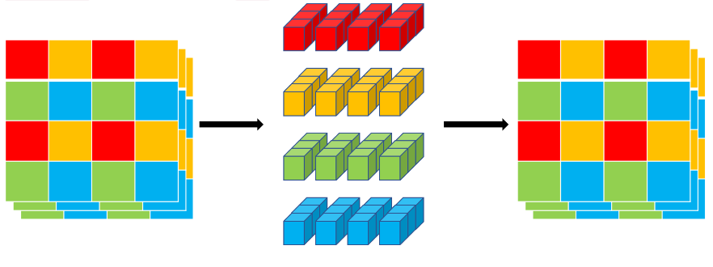
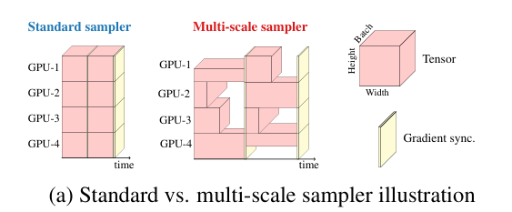

<!--适用于[License](https://github.com/chenzomi12/AISystem/blob/main/LICENSE)版权许可-->

# Transformer模型小型化

自 Vision Transformer 出现之后，人们发现 Transformer 也可以应用在计算机视觉领域，并且效果还是非常不错的。但是基于 Transformer 的网络模型通常具有数十亿或数百亿个参数，这使得它们的模型文件非常大，不仅占用大量存储空间，而且在训练和部署过程中也需要更多的计算资源。所以在本节中会介绍关于 Transformer 一些轻量化工作。

## MobileVit 系列

### MobileVit V1

**MobileVit  V1** ：MobileViT 是一种基于 ViT（Vision Transformer）架构的轻量级视觉模型，旨在适用于移动设备和嵌入式系统。ViT 是一种非常成功的神经网络模型，用于图像分类和其他计算机视觉任务，但通常需要大量的计算资源和参数。MobileViT 的目标是在保持高性能的同时，减少模型的大小和计算需求，以便在移动设备上运行，据作者介绍，这是第一次基于轻量级 CNN 网络性能的轻量级 ViT 工作，性能 SOTA。性能优于 MobileNetV3、CrossviT 等网络。

#### Mobile ViT 块

标准卷积涉及三个操作：展开+局部处理+折叠，利用 Transformer 将卷积中的局部建模替换为全局建模，这使得 MobileViT 具有 CNN 和 ViT 的性质。MobileViT Block 如下图所示:

从上面的模型可以看出，首先将特征图通过一个卷积层，卷积核大小为 $n\times n$，然后再通过一个卷积核大小为 $1\times 1$ 的卷积层进行通道调整，接着依次通过 Unfold、Transformer、Fold 结构进行全局特征建模，然后再通过一个卷积核大小为 $1\times 1$ 的卷积层将通道调整为原始大小，接着通过 shortcut 捷径分支与原始输入特征图按通道 concat 拼接，最后再通过一个卷积核大小为 $n\times n$ 的卷积层进行特征融合得到最终的输出。

#### 多尺度采样训练

给定一系列排序的空间分辨率$S = {(H_{1}, W_{1}), ··· , (H_{n}, W_{n})}$，最大空间分辨率有最小的batch，加快优化更新；在每个GPU第t次迭代中随机抽样一个空间分辨率，然后计算迭代大小；相较于以前多尺度采样，这次它不需要自己每隔几个iteration微调得到新的空间分辨率，并且改变batch提高了训练速度；使用多GPU进行训练（我猜不同空间分辨率在不同的GPU上运行）这个可以提高网络的泛化能力，减少训练和验证之间差距；并且适用于其他网络训练。

## MobileFormer系列

###  MobileFormer

**MobileFormer**：一种通过双线桥将 MobileNet 和 Transformer 并行的结构。这种方式融合了 MobileNet 局部性表达能力和 Transformer 全局表达能力的优点，这个桥能将局部性和全局性双向融合。和现有 Transformer 不同，Mobile-Former 使用很少的 tokens(例如 6 个或者更少)随机初始化学习全局先验，计算量更小。

### 并行结构

Mobile-Former 将 MobileNet 和 Transformer 并行化，并通过双向交叉注意力连接（下见图）。Mobile（指 MobileNet）采用图像作为输入（$X\in R^{HW \times 3}$），并应用反向瓶颈块提取局部特征。Former（指 Transformers）将可学习的参数（或 tokens）作为输入，表示为 $Z\in R^{M\times d}$，其中 M 和 d 分别是 tokens 的数量和维度，这些 tokens 随机初始化。与视觉 Transformer（ViT）不同，其中 tokens 将局部图像 patch 线性化，Former 的 tokens 明显较少（M≤6），每个代表图像的全局先验知识。这使得计算成本大大降低。

### 低成本双线桥

Mobile 和 Former 通过双线桥将局部和全局特征双向融合。这两个方向分别表示为 Mobile→Former 和 Mobile←Former。我们提出了一种轻量级的交叉注意力模型，其中映射（$W^{Q}$,$W^{K}$,$W^{V}$)从 Mobile 中移除，以节省计算，但在 Former 中保留。在通道数较少的 Mobile 瓶颈处计算交叉注意力。具体而言，从局部特征图 X 到全局 tokens Z 的轻量级交叉注意力计算如下：

$$
A_{X->Z} = [Attn(\widetilde{z_{i}}W_{i}^{Q},\widetilde{x_{i}},\widetilde{x_{i}})]_{i=1:h}W^{o}\tag{1}
$$

其中局部特征 X 和全局 tokens Z 被拆分进入 h 个头，即 $X=[\widetilde{x_{1}}...\widetilde{x_{h}}],Z=[\widetilde{z_{1}}...\widetilde{z_{h}}]$ 表示多头注意力。第 i 个头的拆分 $\widetilde{z_{1}}\in R^{M \times \frac {d}{h} }$ 与第 i 个 token$\widetilde{z_{1}}\in R^{d}$ 不同。$W_{i}^{Q}$ 是第 i 个头的查询映射矩阵。$W^{O}$ 用于将多个头组合在一起。Attn(Q,K,V)是查询 Q、键 K 和值 V 的标准注意力函数，即 ：

$$
softmax(\frac{QK^{T}}{\sqrt{d_{k}}})
$$
其中 $[.]_{1:h}$ 表示将 h 个元素 concat 到一起。需要注意的是，键和值的映射矩阵从 Mobile 中移除，而查询的映射矩阵 $W_{i}^{Q}$ 在 Former 中保留。类似地从全局到局部的交叉注意力计算如下：
$$
A_{Z->X} = [Attn(\widetilde{x_{i}},\widetilde{z_{i}}\odot W_{i}^{K},\widetilde{z_{i}}\odot W_{i}^{V})]_{i=1:h}\tag{2}
$$

其中 $W_{i}^{K}$ 和 $W_{i}^{V}$ 分别是 Former 中键和值的映射矩阵。而查询的映射矩阵从 Mobile 中移除。

### Mobile-Former 块

Mobile-Former 由 Mobile-Former 块组成。每个块包含四部分：Mobile 子块、Former 子块以及双向交叉注意力 Mobile←Former 和 Mobile→Former（如下图所示）。

输入和输出：Mobile-Former 块有两个输入：(a) 局部特征图 $X\in R^{HW\times C}$，为 C 通道、高度 H 和宽度 W，以及(b) 全局 tokens $Z\in R^{M\times d}$，其中 M 和 d 是分别是 tokens 的数量和维度，M 和 d 在所有块中一样。Mobile-Former 块输出更新的局部特征图 $X$ 和全局 tokens$Z$，用作下一个块的输入。

Mobile 子块：如上图所示，Mobile 子块将特征图 $X$ 作为输入，并将其输出作为 Mobile←Former 的输入。这和反向瓶颈块略有不同，其用动态 ReLU 替换 ReLU 作为激活函数。不同于原始的动态 ReLU，在平均池化特征图上应用两个 MLP 以生成参数。我们从 Former 的第一个全局 tokens 的输出 $z'_{1}$ 应用两个 MLP 层（上图中的θ）保存平均池化。其中所有块的 depth-wise 卷积的核大小为 3×3。

## EfficientFormer系列

### EfficientFormer V1

**EfficientFormer V1**：基于 ViT 的模型中使用的网络架构和具体的算子，找到端侧低效的原因。然后引入了维度一致的 Transformer Block 作为设计范式。最后，通过网络模型搜索获得不同系列的模型 —— EfficientFormer。

#### EfficientFormer 结构

基于延迟分析，作者提出了 EfficientFormer 的设计，如上图所示。该网络由 patch 嵌入（PatchEmbed）和 meta transformer 块堆栈组成，表示为 MB：
$$
y = \prod_{i}^{m}MB_{i}(PatchEmbed(X_{0}^{B,3,H,W}))
$$

其中 $X_{0}$ 是 Batch 大小为 B、空间大小为 $[H，W]$ 的输入图像，$y$ 是所需输出，$m$ 是块的总数（深度）。$MB$ 由未指定的 token 混合器（TokenMixer）和一个 MLP 块组成，可以表示为：

$$
X_{i+1} = MB_{i}(X_{i})=MLP(TokenMixer(X_{i}))
$$

其中，$X_{i|i>0}$ 是输入到第 $i$ 个 $MB$ 的中间特征。作者进一步将 Stage（或 S）定义为多个 MetaBlocks 的堆栈，这些 MetaBlocks 处理具有相同空间大小的特征，如上图中的 $N1×$ 表示 $S1$ 具有 $N1$ 个 MetaBlocks。该网络包括 4 个阶段。在每个阶段中，都有一个嵌入操作来投影嵌入维度和下采样 token 长度，如上图所示。在上述架构中，EfficientFormer 是一个完全基于 Transformer 的模型，无需集成 MobileNet 结构。接下来，作者深入研究了网络设计的细节。

#### Dimension-consistent Design

作者提出了一种维度一致性设计，该设计将网络分割为 4D 分区，其中操作符以卷积网络样式实现（MB4D），以及一个 3D 分区，其中线性投影和注意力在 3D 张量上执行，以在不牺牲效率的情况下享受 MHSA 的全局建模能力（MB3D），如上图所示。具体来说，网络从 4D 分区开始，而 3D 分区应用于最后阶段。注意，上图只是一个实例，4D 和 3D 分区的实际长度稍后通过架构搜索指定。

首先，输入图像由一个具有两个步长为 2，感受野为 3×3 卷积的 Conv stem 处理：

$$
X_{1}^{B,C_{j|j=1,\frac{H}{4},\frac{W}{4}}} = PatchEmbed(X_{0}^{B,3,H,W})
$$

其中，$C_{j}$ 是第 j 级的通道数量。然后，网络从 MB4D 开始，使用一个简单的池化混合器来提取低级特征：

$$
I_{i} = Pool(X_{i}^{B,C,\frac{H}{2^{j+1}},\frac{W}{2^{j+1}}})+X_{i}^{B,C,\frac{H}{2^{j+1}},\frac{W}{2^{j+1}}}
$$

$$
X_{i+1}^{B,C,\frac{H}{2^{j+1}},\frac{W}{2^{j+1}}}=Conv_{B}(Conv_{B,G(I_{i}))}+I_{i}
$$

其中，$Conv_{B,G}$ 表示卷积后分别接 BN 和 GeLU。注意，这里作者没有在池化混合器之前使用 LN，因为 4D 分区是基于 CONV-BN 的设计，因此每个池化混合器前面都有一个 BN。

在处理完所有 MB4D 块后，作者执行一次 reshape 以变换特征大小并进入 3D 分区。MB3D 遵循传统 ViT 结构，如上图所示：

$$
I_{i} = Linear(MHSA(Linear(LN(X_{i}^{B,\frac{HW}{4^{j+1}},C_{j}}))))+X_{i}^{B,\frac{HW}{4^{j+1}},C_{j}}
$$

$$
X_{i+1}^{B,\frac{HW}{4^{j+1}},C_{j}} = Linear(Linear_{G}(LN(I_{i})))+I_{i}
$$

其中，$Linear_{G}$ 表示线性，后跟 GeLU。

$$
MHSA(Q,K,V) = Softamax(\frac{Q\odot K^{T}}{\sqrt{C_{j}}}). V
$$

其中 Q、K、V 表示通过线性投影学习的查询、键和值，b 表示作为位置编码的参数化注意力 bias。

## 小结与思考

- MobileVit系列，MobileFormer系列是从模型结构上进行轻量化设计，在MobileNet的基础上，针对Transformer注意力模块去设计轻量化模型；

- EfficientFormer系列在Vit基础上结合了搜索算法设计轻量化的模型；

## 本节视频

<html>
<iframe src="https:&as_wide=1&high_quality=1&danmaku=0&t=30&autoplay=0" width="100%" height="500" scrolling="no" border="0" frameborder="no" framespacing="0" allowfullscreen="true"> </iframe>
</html>

# 轻量化网络总结

## 如何选择轻量化网络

- 不同网络架构，即使FLOPs相同，但其MAC也可能差异巨大;

- FLOPs低不等于latency低，结合具体硬件架构具体分析;

- 多数时候加速芯片算力的瓶颈在于访存带宽；

- 不同硬件平台部署轻量级模型需要根据具体业务选择对应指标;
