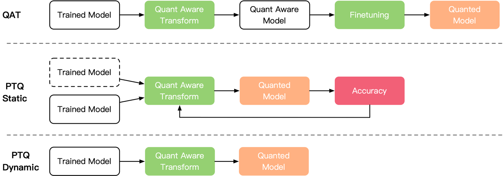
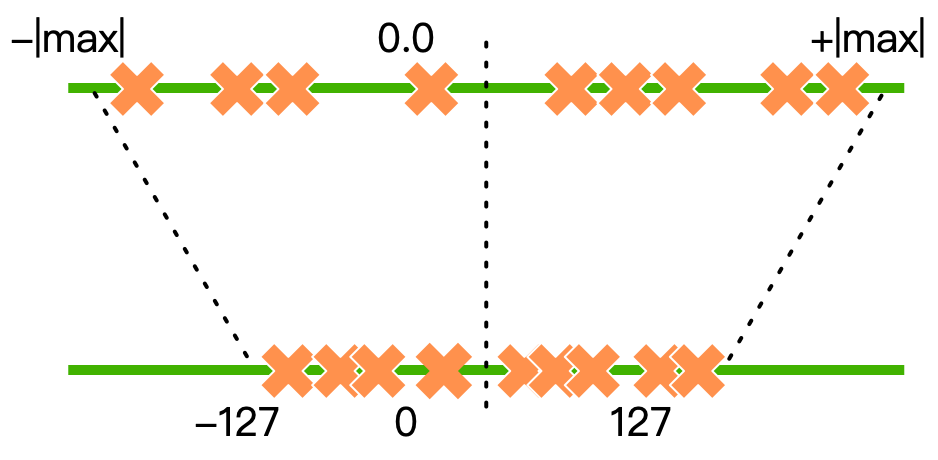

<!--Copyright © ZOMI 适用于[License](https://github.com/chenzomi12/AISystem)版权许可-->

# 低比特量化原理

计算机里面数值有很多种表示方式，如浮点表示的 FP32、FP16，整数表示的 INT32、INT16、INT8，量化一般是将 FP32、FP16 降低为 INT8 甚至 INT4 等低比特表示。

模型量化则是一种将浮点值映射到低比特离散值的技术，可以有效的减少模型的参数大小、内存消耗和推理延迟，但往往带来较大的精度损失。尤其是在极低比特（<4bit）、二值网络（1bit）、甚至将梯度进行量化时，带来的精度挑战更大。本节将会重点讲解低比特量化的通用基本原理。

## 神经网络特点和量化优势

### 神经网络特点

低比特量化主要用在推理的场景，因此以量化和推理的视角来看，神经网络一般具有以下特点：

1. **模型参数量大**：神经网络模型通常具有大量的参数，特别是在深度神经网络中，参数数量可能非常庞大。这导致了存储这些参数所需的空间也很大。

2. **计算量大**：神经网络的推理阶段通常需要大量的计算资源，尤其是在深度神经网络中，包含大量的矩阵乘法和非线性激活函数等操作。这些计算量大大增加了模型在实际部署和执行过程中的成本。

3. **内存占用大**：由于神经网络模型的参数量大、计算量大，因此在推理过程中需要大量的 NPU 内存来存储模型参数、中间计算结果等。这对于嵌入式设备、移动设备等资源受限的环境来说可能是一个挑战。

4. **模型精度高**：与传统的机器学习模型相比，神经网络模型通常具有较高的精度和表现能力。这使得在量化过程中需要考虑如何在减小模型尺寸和计算成本的同时，尽量保持模型的精度和性能。

部署神经网络时，我们希望网络越小越好，来降低部署成本，于是就需要模型量化等压缩手段。

### 模型量化优点

通过对神经网络模型进行合理的量化，可以实现以下优势：

1. **加速计算**：传统的卷积操作都是使用 FP32 浮点，低比特的位数减少少计算性能也更高，INT8 相对比 FP32 的加速比可达到 3 倍甚至更高。

2. **保持精度**：量化会损失精度，这相当于给网络引入了噪声，但是神经网络一般对噪声是不太敏感的，只要控制好量化的程度，对高级任务精度影响可以做到很小。

3. **节省内存**：与 FP32 类型相比，FP16、INT8、INT4 低精度类型所占用晶体管空间更小，对应存储空间和传输时间都可以大幅下降。

4. **节能和减少芯片面积**：每个数使用了更少的位数，做运算时需要搬运的数据量少了，减少了访存开销（节能），同时 NPU 所需的乘法器数目也减少（减少芯片面积）。

总之，模型量化主要是对模型的参数进行压缩，比如 200MB 的模型压缩到 50MB，达到提升运算速度，降低内存和功耗的效果。

## 落地挑战与思考

在实际部署时，量化技术的落地也有一些挑战，需要综合衡量是否需要使用模型量化。

### 精度挑战

1. **量化方法的精确性**：常见的量化方法如线性量化，对于数据分布的描述并不精确。线性量化将浮点数参数转换为固定位数的整数表示，这种精度的降低可能导致模型在量化后性能下降。对于特定任务和数据分布，需要设计更准确的量化方法以最小化精度损失。

2. **低比特数的影响**：将模型从高比特数（如 16 位）量化为低比特数（如 4 位）会导致更大的精度损失。随着比特数的减少，模型的表示能力下降，因此需要在精度和模型大小之间找到平衡点。

3. **任务复杂性对精度的影响**：在分类、检测、识别等任务中，任务的复杂性与模型所需的表示能力密切相关。通常情况下，任务越复杂，模型对精度的要求也越高，因此在量化过程中，需要针对不同的任务类型和复杂程度进行定制化的量化策略，以最大程度地保持模型的精度。

4. **模型大小对精度的影响**：模型大小与精度之间存在一种权衡关系。一般来说，模型越小，其表达能力和容纳参数的能力也越有限，因此在量化过程中，对于较小的模型，精度损失可能会更加显著。在进行模型量化时，需要综合考虑模型大小、精度要求以及实际应用场景，以确定最适合的量化策略。

### 硬件支持程度

在模型量化落地时，硬件支持是一个至关重要的因素。不同硬件平台对于低比特量化指令的支持程度不同，这会直接影响到模型在该硬件上的性能和效率。

1. **低比特指令支持差异**：不同的硬件架构对于低比特指令的支持程度有所不同。比如 NVIDIA 一些系列显卡支持 INT8 Tensor Core 计算。

2. **低比特指令计算方式差异**：即使硬件平台支持相同的低比特指令，不同的硬件架构可能采用不同的计算方式。例如，8bit 计算一些硬件平台可能支持 INT8 的计算，而另一些可能采用 FP8 计算。

3. **硬件体系结构的 Kernel 优化**：不同硬件平台具有不同的体系结构和优化方式。针对特定硬件的优化 Kernel 可以最大限度地利用硬件的并行计算能力和特定指令集，从而提高模型量化后的推理性能。因此，在将模型部署到特定硬件上时，需要进行相应的 Kernel 优化，以确保模型能够充分利用硬件的性能优势。

### 软件算法是否能加速

在模型量化落地过程中，软件算法的加速能力是一个至关重要的考量因素。尽管软件算法的优化可以提高模型量化的执行效率，但在某些情况下，软件算法也可能对性能造成负面影响。

1. **混合比特量化的影响**：对于混合比特量化（Mixed Precision Quantization）而言，需要进行量化和反向量化操作，同时可能需要插入 Cast 算子来确保数据格式一致性。这些操作会影响到 Kernel 的执行性能，尤其是在硬件平台不支持相关操作的情况下。因此，对于混合比特量化，需要进行针对性的软件算法优化，以尽量减少这些操作对执行性能的影响。

2. **运行时内存占用优化**：除了模型参数量的降低外，还需要关注运行时内存占用。降低模型参数量并不一定会降低运行时内存占用，因为在推理过程中可能需要同时存储模型参数、中间计算结果等数据。因此，软件算法需要考虑如何在保持模型精度的同时，尽量减少运行时内存占用，以提高模型的执行效率。

3. **模型参数量与内存占用的差异**：模型参数量的减少并不直接意味着执行内存占用的减少。一些优化技术可能会引入额外的计算和存储开销，从而影响到运行时内存占用。因此，在进行软件算法优化时，需要综合考虑模型参数量和内存占用之间的差异，以实现最优的性能和内存占用平衡。

## 量化原理

模型量化方法可以分为以下三种：

1. **量化训练 (Quant Aware Training, QAT)**

量化训练让模型感知量化运算对模型精度带来的影响，通过微调训练降低量化误差。QAT 对训练好的网络模型进行转换，插入伪量化算子，得到一个新的网络模型。接着对新的网络模型进行微调得到最终的量化模型，最后送到部署端进行推理部署。

2. **动态离线量化 (Post Training Quantization Dynamic, PTQ Dynamic)**

动态离线量化仅将模型中特定算子的权重从 FP32 类型映射成 INT8/INT16 类型。动态离线量化提前将模型的权重转换为 INT8，推理过程中，在真正执行计算之前根据激活输入的范围，动态地将激活即时转换为 INT8。

动态量化的关键思想是根据运行时观察到的数据范围动态确定激活的比例因子。这确保了比例因子被“调整”，以便尽可能多地保留有关每个观察到的数据集的信号。

3. **静态离线量化 (Post Training Quantization Static, PTQ Static)**

静态离线量化使用少量无标签校准数据，采用 KL 散度等方法计算量化比例因子。静态离线量化也是一种在训练完成后将模型参数转换为低比特表示的方法，但与动态离线量化不同的是，静态离线量化中的量化参数是在转换过程中固定的，而不是根据输入数据动态调整的。

### 量化方法对比

|         **量化方法**          | **功能**                                  | **经典适用场景**                                   | **使用条件**     | **易用性** | **精度损失** | **预期收益**                   |
| :---------------------------: | ----------------------------------------- | -------------------------------------------------- | ---------------- | ---------- | :----------: | ------------------------------ |
|        量化训练  (QAT)        | 通过  Finetune 训练将模型量化误差降到最小 | 对量化敏感的场景、模型，例如目标检测、分割、OCR 等 | 有大量带标签数据 | 好         |     极小     | 减少存续空间 4X，降低计算内存   |
| 静态离线量化   (PTQ  Static)  | 通过少量校准数据得到量化模型              | 对量化不敏感的场景，例如图像分类任务               | 有少量无标签数据 | 较好       |     较少     | 减少存续空间 4X，降低计算内存   |
| 动态离线量化    (PTQ Dynamic) | 仅量化模型的可学习权重                    | 模型体积大、访存开销大的模型，例如  BERT 模型      | 无               | 一般       |     一般     | 减少存续空间 2/4X，降低计算内存 |

总的来说，QAT 可以达到的精度较高，但是往往需要较多的量化训练时间，量化成本比较大。PTQ 的量化过程比较迅速，只需要少量数据集来校准，但是量化后精度往往损失较多。

### 量化方法（饱和与非饱和）

模型量化桥接了定点与浮点，建立了一种有效的数据映射关系，使得以较小的精度损失代价获得了较好的收益。模型量化有两种映射方法，以 INT8 量化为例子：

1. 非饱和量化 

非饱和量化方法计算浮点类型 Tensor 中绝对值的最大值 $abs\_max$，将其映射为 127，则量化比例因子（scale）等于 $abs\_max/127$。

:width:`450px`

2. 饱和量化

饱和量化方法使用 KL 散度计算一个合适的阈值 T ($0<T<abs\_max$)，将 $±|T|$ 映射为 ±127，超出阈值  $±|T|$ 外的直接映射为阈值 ±127，则量化比例因子（scale）等于 $T/127$。

:width:`450px`

### 量化类型（线性与非线性）

量化可以分为线性量化和非线性量化，目前主流的方法是线性量化。线性量化可以分为对称量化和非对称量化。要弄懂模型量化的原理就是要弄懂这种数据映射关系，浮点与定点数据的转换公式如下：

$$Q=R/S+Z$$
:eqlabel:`02Quant_eq1`

$$R=(Q-Z)*S$$
:eqlabel:`02Quant_eq2`

其中，$R$ 表示输入的浮点数据，$Q$ 表示量化之后的定点数据，$Z$ 表示零点（Zero Point）的数值，$S$ 表示缩放因子（Scale）的数值。

#### 对称量化

对称量化是非对称量化 $Z=0$时的特例，即 $R_{max}$ 和 $R_{min}$ 关于 Z 对称。对称量化常用的方法是最大绝对值量化 $(abs\_max)$，将输入缩放到 8 位范围 $[-128, 127]$，对称的量化算法原始浮点精度数据与量化后 INT8 数据的转换如下：

:width:`450px`

$$
int = round[\frac{float}{scale}]
$$
:eqlabel:`02Quant_eq3`

$$
scale = \frac{(2·max(|x_{min}|,x_{max}))}{Q_{max}-Q_{min}}
$$
:eqlabel:`02Quant_eq4`

其中，threshold 是阈值, 可以理解为 Tensor 的范围是 $[-threshold, threshold]$。一般来说，对于激活值，$scale=threshold/128$。对于权重，$scale=threshold/127$。

#### 非对称量化

非对称量化（**Affifine Quantization**）也称为 zero-point quantization，通过使用归一化动态范围 $n_{dx}$ 进行缩放，然后通过零点 $z_{px}$ 进行移位，将输入分布移动到完整范围 $[-128, 127]$ 或者 $[0, 255]$。通过这个仿射变换，任何输入张量都将使用数据类型的所有位，从而减小了非对称分布的量化误差。

:width:`450px`

以线性量化的 MinMax 方法为例来求解$S$和$Z$：

$$
S = \frac{R_{max}-R_{min}} {Q_{max}-Q_{min}}
$$
:eqlabel:`02Quant_eq5`

$$
Z = Q_{max}- \frac{R_{max}}{S}
$$
:eqlabel:`02Quant_eq6`

其中，$R_{max}$ 表示输入浮点数据中的最大值，$R_{min}$​ 表示输入浮点数据中的最小值，$Q_{max}$ 表示最大的定点值（127 / 255），$Q_{min}$ 表示最小的定点值（-128 / 0）。

量化算法原始浮点精度数据与量化后 INT8 数据的转换如下:

$$
float = scale \times (unit8-offset)
$$
:eqlabel:`02Quant_eq7`

确定后通过原始 float32 高精度数据计算得到 uint8 数据的转换即为如下公式所示:

$$
uint8 = round(\frac{float}{scale})+offset
$$
:eqlabel:`02Quant_eq8`

若待量化数据的取值范围为 $[X_{min}, X_{max}]$，则 $scale$ 的计算公式如下:

$$
scale = \frac{X_{max}-X_{min}}{Q_{max}-Q_{min}}
$$
:eqlabel:`02Quant_eq9`

offset 的计算方式如下：

$$
offset = Q_{min}-round(\frac{x_{min}}{scale})
$$
:eqlabel:`02Quant_eq10`

当量化到 INT8 时, $Q_{max}=127$,$Q_{min}=-128$; UINT8 时, $Q_{max}=255,Q_{min}=0$。

## 本节视频

<html>
<iframe src="https:&as_wide=1&high_quality=1&danmaku=0&t=30&autoplay=0" width="100%" height="500" scrolling="no" border="0" frameborder="no" framespacing="0" allowfullscreen="true"> </iframe>
</html>
