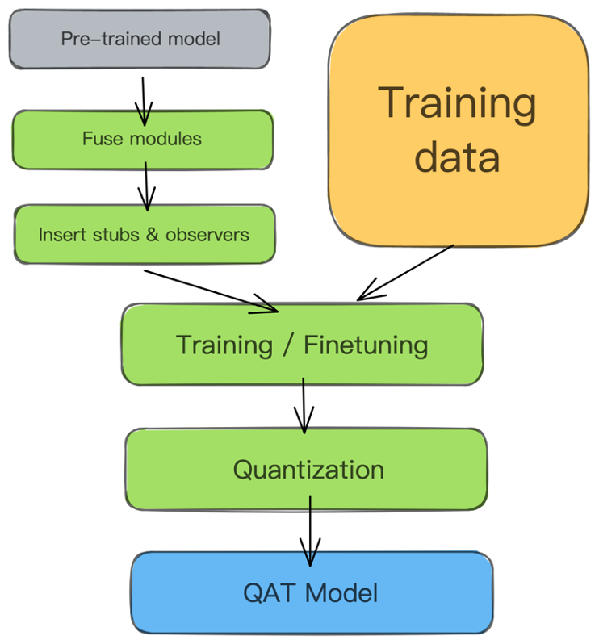
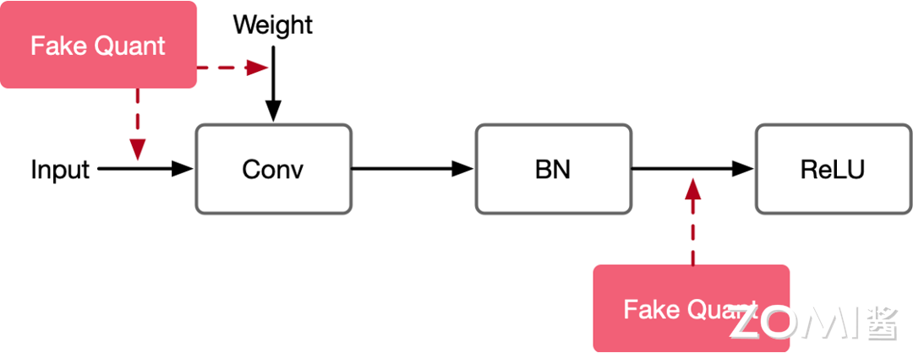
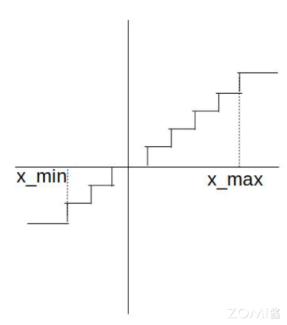
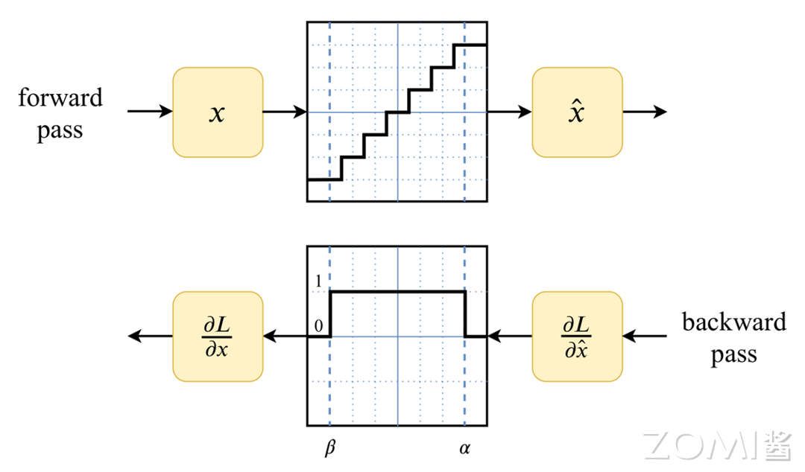
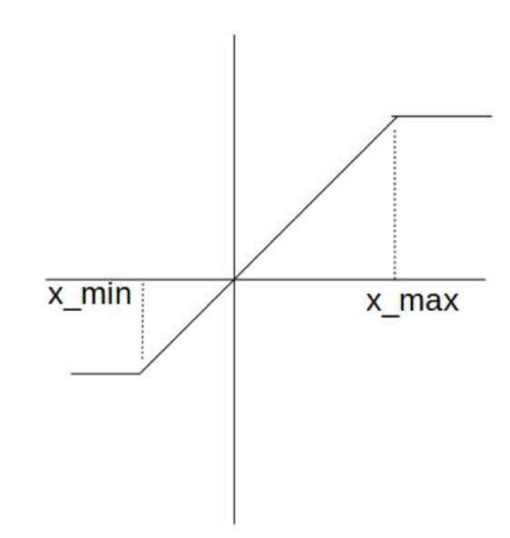

<!--Copyright © 适用于[License](https://github.com/chenzomi12/AISystem)版权许可-->

# 感知量化训练 QAT

传统的训练后量化将模型从 FP32 量化到 INT8 精度时会产生较大的数值精度损失。感知量化训练（Aware Quantization Training）通过在训练期间模拟量化操作，可以最大限度地减少量化带来的精度损失。

QAT 的流程如下图所示，首先基于预训练好的模型获取计算图，对计算图插入伪量化算子。准备好训练数据进行训练或者微调，在训练过程中最小化量化误差，最终得到 QAT 之后对神经网络模型。QAT 模型需要转换去掉伪量化算子，为推理部署做准备。

QAT 时会往模型中插入伪量化节点 FakeQuant 来模拟量化引入的误差。端测推理的时候折叠 FakeQuant 节点中的属性到 tensor 中，在端侧推理的过程中直接使用 tensor 中带有的量化属性参数。

## 伪量化节点

在 QAT 过程中，所有权重和偏差都以 FP32 格式存储，反向传播照常进行。然而，在正向传播中，通过 FakeQuant 节点模拟量化。之所以称之为“fake”量化，是因为它们对数据进行量化并立即反量化，添加了类似于在量化推理过程中可能遇到的量化噪声，以模拟训练期间量化的效果。最终损失 loss 值因此包含了预期内的量化误差，使得将模型量化为 INT8 不会显著影响精度。

FakeQuant 节点通常插入在模型的以下关键部分：

- 卷积层（Conv2D）前后：这可以帮助卷积操作在量化后适应低精度计算。
- 全连接层（Fully Connected Layer）前后：这对于处理密集矩阵运算的量化误差非常重要。
- 激活函数（如ReLU）前后：这有助于在非线性变换中保持量化精度。

这些插入位置可以确保模型在训练期间模拟量化引入的噪声，从而在推理阶段更好地适应量化环境。

下面是一个计算图，同时对输入和权重插入伪量化算子：

伪量化节点的作用：

1. 找到输入数据的分布，即找到 MIN 和 MAX 值；
2. 模拟量化到低比特操作的时候的精度损失，把该损失作用到网络模型中，传递给损失函数，让优化器去在训练过程中对该损失值进行优化。

### 正向传播

在正向传播中，FakeQuant 节点将输入数据量化为低精度（如 INT8），进行计算后再反量化为浮点数。这样，模型在训练期间就能体验到量化引入的误差，从而进行相应的调整。为了求得网络模型 tensor 数据精确的 Min 和 Max 值，因此在模型训练的时候插入伪量化节点来模拟引入的误差，得到数据的分布。对于每一个算子，量化参数通过下面的方式得到：

$$
Q = \frac{R}{S}+Z \\
 \\
S = \frac{R_{max}-R_{min}}{Q_{max}-Q_{min}}\\
 \\
Z=Q_{max}-\frac {R_{max}}{S}
$$

FakeQuant 量化和反量化的过程：

$$
\begin{align*}
Q(x) &= FakeQuant(x) \\
&= DeQuant(Quant(x)) \\
&= s * (Clamp(round(x/s)-z)+z)
\end{align*}
$$

原始权重为 W，伪量化之后得到浮点值Q(W)，同理得到激活的伪量化值Q(X)。这些伪量化得到的浮点值虽然表示为浮点数，但仅能取离散的量化级别。

正向传播的时候 FakeQuant 节点对数据进行了模拟量化规约的过程，如下图所示：

### 反向传播

在反向传播过程中，模型需要计算损失函数相对于每个权重和输入的梯度。梯度通过 FakeQuant 节点进行传递，这些节点将量化误差反映到梯度计算中。模型参数的更新因此包含了量化误差的影响，使模型更适应量化后的部署环境。按照正向传播的公式，因为量化后的权重是离散的，反向传播的时候对 $W$ 求导数为 0：

$$
\frac{\partial Q(W)}{\partial W} = 0
$$

因为梯度为0，所以网络学习不到任何内容，权重 $W$ 也不会更新：

$$
g_W = \frac{\partial L}{\partial W} = \frac{\partial L}{\partial Q(W)} \cdot \frac{\partial Q(W)}{\partial W}=0
$$

这里可以使用直通估计器（Straight-Through Estimator，简称STE）简单地将梯度通过量化传递，近似来计算梯度。这使得模型能够在前向传播中进行量化模拟，但在反向传播中仍然更新高精度的浮点数参数。STE 近似假设量化操作的梯度为1，从而允许梯度直接通过量化节点：

$$
g_W = \frac{\partial L}{\partial W} = \frac{\partial L}{\partial Q(W)}
$$

如果被量化的值在$[x_{min}, x_{max}] $范围内，STE 近似的结果为 1，否则为 0。这种方法使模型能够在训练期间适应量化噪声，从而在实际部署时能够更好地处理量化误差。如下图所示：

通过 QAT，深度学习模型能够在保持高效推理的同时，尽量减少量化带来的精度损失，是模型压缩和部署的重要技术之一。在大多数情况下，一旦应用量化感知训练，量化推理精度几乎与浮点精度完全相同。然而，在 QAT 中重新训练模型的计算成本可能是数百个 epoch。

## 本节视频

<html>
<iframe src="https:&as_wide=1&high_quality=1&danmaku=0&t=30&autoplay=0" width="100%" height="500" scrolling="no" border="0" frameborder="no" framespacing="0" allowfullscreen="true"> </iframe>
</html>

## 参考

- Learning Accurate Low-Bit Deep Neural Networks with Stochastic Quantization
- Differentiable Soft Quantization: Bridging Full-Precision and Low-Bit Neural Networks（ICCV 2019）
- IR-Net: Forward and Backward Information Retention for Highly Accurate Binary Neural Networks（CVPR 2020）
- Towards Unified INT8 Training for Convolutional Neural Network（CVPR 2020）
- Rotation Consistent Margin Loss for Efficient Low-bit Face Recognition（CVPR 2020）
- DMS: Differentiable diMension Search for Binary Neural Networks（ICLR 2020 Workshop）
- Nagel, Markus, et al. "A white paper on neural network quantization." arXiv preprint arXiv:2106.08295 (2021).
- Krishnamoorthi, Raghuraman. "Quantizing deep convolutional networks for efficient inference: A whitepaper." arXiv preprint arXiv:1806.08342 (2018)
- 全网最全-网络模型低比特量化 https://zhuanlan.zhihu.com/p/453992336
- [Practical Quantization in PyTorch](https://pytorch.org/blog/quantization-in-practice/)
- Jacob, Benoit, et al. "Quantization and training of neural networks for efficient integer-arithmetic-only inference." Proceedings of the IEEE conference on computer vision and pattern recognition. 2018.
- Wu, Hao, et al. "Integer quantization for deep learning inference: Principles and empirical evaluation." arXiv preprint arXiv:2004.09602 (2020).