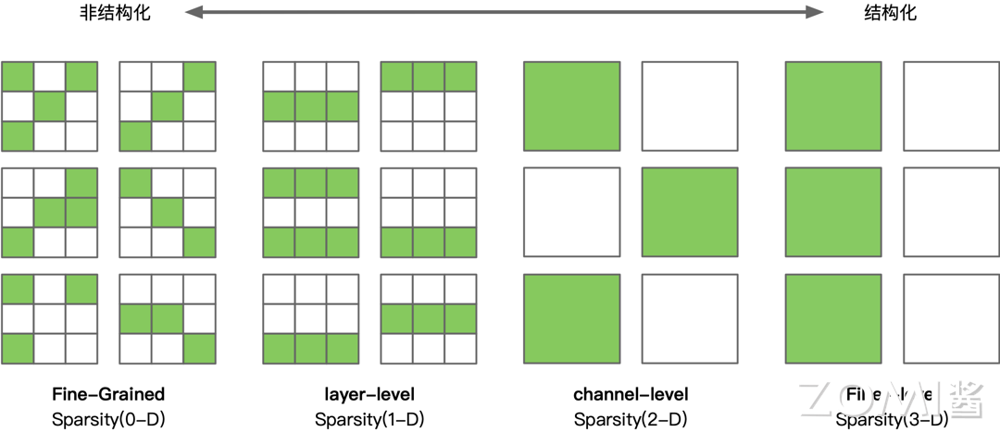
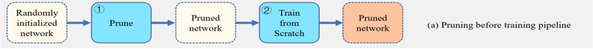
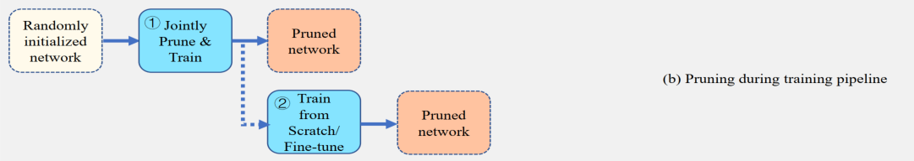
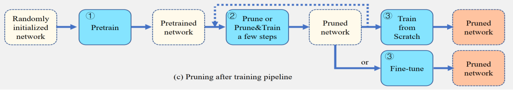
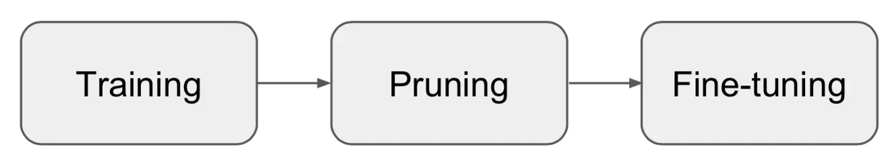
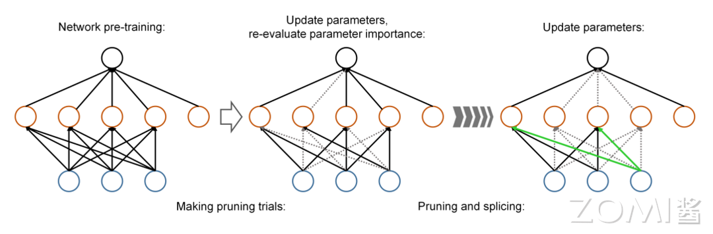
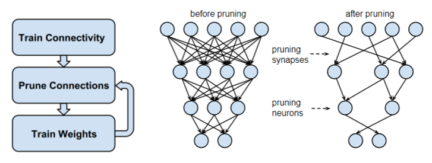
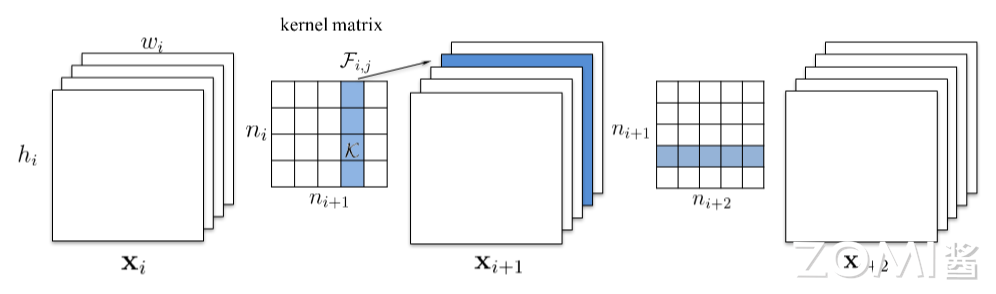
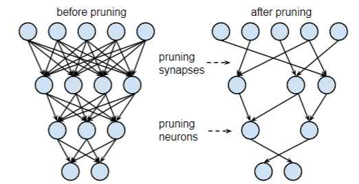

<!--Copyright © 适用于[License](https://github.com/chenzomi12/AISystem)版权许可-->

# 模型剪枝

本节将介绍模型剪枝的概念、方法和流程，这是一种通过移除神经网络中的冗余或不重要参数来减小模型规模和提高效率的模型压缩技术。

剪枝不仅可以减少模型的存储和计算需求，还能在保持模型性能的同时提高模型的泛化能力。我们将探讨剪枝的定义、分类、不同阶段的剪枝流程，以及多种剪枝算法，包括基于参数重要性的方法、结构化剪枝、动态剪枝和基于优化算法的全局剪枝策略。

## 模型剪枝概述

为了从海量的数据中学到更多“知识”，神经网络的规模变得越来越大。这些大型神经网络拥有庞大的参数，远远超出了人类能够直观理解和处理的范畴。这种规模的增加带来了模型训练和推理时巨大的计算和存储压力。为了减少神经网络模型对存储、带宽和计算等硬件资源的需求，将模型更好地应用到实际环境中，一些模型压缩方法被提出。

模型压缩将一个庞大而复杂的预训练模型转化为一个更精简的小模型，尽可能在不牺牲模型精确度的情况下，减少模型的存储和计算负载，从而使得模型更高效在各种硬件平台上部署和运行。模型压缩方法主要分为这几类：**量化（Quantization）**，**剪枝（Pruning）**，**知识蒸馏（Knowledge Distillation）** 和 **二值化网络（Binary Neural Network）** 等等。

其中，模型剪枝是一类重要而且应用广范的模型压缩方法，其通过移除神经网络中的冗余或不重要的参数（如权重、神经元或卷积核），在尽量保持模型准确度的前提下减少模型的大小，提高模型的计算速度和泛化能力。

### 剪枝定义

模型剪枝也叫模型稀疏化，不同于模型量化通过减少表示权重参数所需的比特数来压缩模型，它直接删除模型中 “不重要” 的权重，从而学习到一个参数更加稀疏化的神经网络，同时要尽可能的保持模型精度，下图展示了两种方法的区别。

给定一个数据集 $D = {(x_i,y_i)}^{n}_{i=1}$ 和一个稀疏度 $k$（例如非零权重参数的数量）模型剪枝可以形式化表述为下面条件约束的优化问题：

$$
\underset{m}{min}\  L(w;D)=\underset{m}{min}\ \frac{1}{n}\sum_{i=1}^n loss(w;(x_i,y_i)),\\
s.t. \ \ \ \ w\in R^m, \ \ ||w||_0 \leq k
$$

其中 $loss(\cdot)$ 是损失函数（例如交叉熵损失函数）， $w$ 是一组神经网络参数， $m$ 是参数的数量， $||\cdot||_0$ 是标准的 $L_0$ 范数。由于 $L_0$ 范数的存在，让该问题成为一个组合优化问题并且是 NP-hard 问题，无法在多项式时间内求得最优解，需要设计启发式的算法在合理的时间内求解。

模型剪枝基于这样的假设：神经网络模型是过度参数化的，存在大量的冗余参数和连接，这些参数和连接对于模型的性能并不是必要的。通过剪枝，可以识别和去除这些冗余部分，从而减少模型的大小和复杂度。此外，模型中的许多参数和连接可能对模型的输出影响较小，可以被视为稀疏的，剪枝可以进一步加速这些稀疏模型的推理速度。
根据上述假设，剪枝算法通常会采取一些策略来确定哪些参数和连接应该被保留，哪些应该被去除。这些策略可以包括基于参数重要性的方法（如通过权重大小或梯度信息来确定参数重要性）、基于结构的方法（如根据网络拓扑结构来进行剪枝）等。不同的剪枝算法可能会基于不同的假设和策略来实现模型的剪枝和优化。
  
### 剪枝方法分类

根据剪枝的粒度，剪枝方法主要可以分成两类：

1. **非结构化剪枝（Unstructured Pruning）**： 非结构化剪枝是对模型中的参数或连接进行剪枝操作，而不考虑其结构。它直接删除模型中的某些参数，从而实现模型的压缩和优化，但这种方法可能会破坏模型的整体结构。

2. **结构化剪枝（Structured Pruning）**： 结构化剪枝是对模型中的特定结构单元（如滤波器、层）进行剪枝操作。它通过删除整个结构单元来实现模型的压缩和优化，而不会破坏模型的整体结构。

上图展示了两种剪枝方法对比，从左到右，剪枝的粒度不断递增，最左边的非结构化剪枝粒度最小，右边结构化剪枝中的层级、通道级、滤波器级剪枝粒度依次增大。可以看出非结构化剪枝是不规则的，随机对独立的权重进行剪枝。而结构化剪枝对特定神经网络的 filter / channel / layer 等结构进行统一剪枝。

相较而言非结构化剪枝算法简单，模型压缩比高，一般剪掉的是绝对值很小、对输出影响较小相对不重要的参数，剪枝后的模型通常具有更高的稀疏性，这意味着大部分参数都是零值，缺点是一般的硬件对其进行计算加速，所以在实际运行速度上得不到提升，需要设计特定的硬件才可能加速。

结构化剪枝保留了模型的整体结构，只是去除了一些结构单元，因此不会破坏模型的整体结构。由于剪枝后的模型保持了原有的结构，因此在部署和推理时更加方便，无需对部署框架进行特殊处理，可以直接应用于各种硬件平台上进行计算加速。

此外，结构化剪枝通常可以通过控制剪枝单元的数量或比例来实现不同程度的压缩，剪枝率相对容易控制和调整。但是结构化剪枝的剪枝率受到结构单元数量的限制，无法实现非结构化剪枝那样灵活的剪枝率。在某些情况下，可能无法达到理想的压缩效果。由于剪枝的是整个结构单元，某些重要的参数或重要的结构单元被强制剪掉，可能会导致模型精度的损失较大。

## 剪枝方法

### 剪枝流程

具体的剪枝流程按照剪枝发生的时间可以分成四种： **训练前剪枝**、 **训练中剪枝**、 **训练后剪枝** 以及 **运行时剪枝**。前三种剪枝流程在模型实际部署推理之前，模型剪枝就已经完成且模型参数结构已确定，对不同的输入共享相同的模型结构和推理过程。运行时剪枝恰好相反，其根据输入的数据，在模型推理时动态地为每个输入数据点修剪模型并生成子网络，因此不同的数据实际所见的模型结构和参数是不同的。

#### 训练前剪枝

训练前剪枝(Pruning Before Training, PBT)也被称为初始化剪枝，它在网络被训练之前，基于随机初始化的权值对网络进行剪枝，其主要的动机是消除预训练的成本。PBT 通常分为两步: 

1. 首先根据特定的准则对未训练的稠密网络进行直接剪枝，目的是得到结构较稀疏的网络

2. 然后对此稀疏网络进行训练，使其收敛从而获得更高的精度。

具体过程如下图所示，PBT 没有耗时的预训练，使模型在训练和推理都获得加速。

#### 训练中剪枝

训练期间剪枝(Pruning During Training，PDT)将模型训练和参数修剪融合在一起，在模型训练中修剪神经网络，当模型训练结束剪枝也同时完成，不需要预训练或者或重训练微调。PDT 的具体过程如图 3.2 所示，其中以虚线表示后面的操作不是必要的。

由于 PDT 方法比较复杂，研究较少，具体的相关剪枝算法总结为三种类型:

1. **基于稀疏正则化的方法**：初始时模型是一个相对稠密的网络，为了让模型变得稀疏，需要对损失函数施加稀疏约束，例如给损失函数添加一个 $L_1$ 正则化项。训练过程中模型会逐渐变得稀疏，必要时需要将一些十分接近 0 的参数置零。

2. **基于动态基于动态稀疏训练的方法**：初始时模型是一个相对稀疏的网络，而不是密集网络。接下来修剪掉一部分不重要的权重，然后重新生长相同数量的新权重，以调整稀疏结构。通过在训练过程中反复进行修剪和生长循环，不断寻找更好的稀疏结构。

3. **基于评分的方法**: 在模型训练过程中评估参数的分数，直接修剪掉得分低的参数，同样地训练完成即剪枝完成，没有预训练和重训练。

基于稀疏正则化和评分的方法是稠密到稀疏的训练，而基于动态稀疏训练的方法是稀疏到稀疏的训练。

#### 训练后剪枝

训练后剪枝（Pruning After Training, PAT）是剪枝流程中最流行的一种 ，因为很多研究认为对稠密网络进行预训练是获得高效子网络的必要条件。这类修剪方法通常遵循 Pretrain-Prune-Retrain 过程，如下图所示。

剪枝的流程主要包括以下三个步骤：

1. **模型预训练**： 首先，使用标准的训练算法（如梯度下降）对原始模型进行训练，以获得一个基准模型。原始模型一般规模较大，被认为是过参数化的，在该阶段被训练以获得很好的精度。接下来，基准模型会在尽可能不损失精度的情况下被剪枝，以缩小模型规模、减小模型对硬件资源的需求，从而加速模型计算。

2. **模型剪枝**：这一阶段中，一般会先对训练好的模型进行参数重要性评估，这一步的目的是确定哪些参数对模型的性能影响较小，可以被剪枝。常见的评估方法包括基于参数权重大小、梯度信息、敏感度分析等。接下来，基于参数重要性评估的结果，选择适当的剪枝策略，对模型中的参数进行剪枝以达到减少模型大小和复杂度的目的。

3. **微调和重训练**： 在执行剪枝操作后，模型的参数或结构发生了变化，剪枝后模型的精度可能会受到一定程度的影响，通常需要进行微调和重训练，以恢复模型的性能。微调和重训练的过程可以帮助模型重新学习被剪枝的参数，并调整模型的参数以适应新的剪枝后结构。

4. **评估与再剪枝**： 剪枝完成后会对模型进行评估，以验证剪枝操作是否达到了预期的效果，评估通常包括性能指标（如准确率、速度、模型大小等）的比较和分析。如果剪枝结果未达到要求，会将微调之后的网络模型再送到剪枝模块中再次进行剪枝。如此不断迭代地进行模型剪枝优化，直到模型能够满足剪枝目标要求。

图 3.3 展示了整个流程，这个流程是一个一般性的框架，具体的剪枝流程可能会因任务需求、模型类型和剪枝策略的不同而有所差异。在实际应用中，会根据具体情况对剪枝流程进行调整和优化。

#### 运行时剪枝

上述的剪枝流程与运行时剪枝（runtime pruning）相比可以看作是静态的，基于这些流程的剪枝算法，修剪后的模型可以重复用于不同的输入。然而，运行时剪枝方法会根据每个输入数据的具体情况来动态地修剪神经网络。

该方法的思路是，对于同一个任务，不同输入数据的处理难度可能不同，模型在处理不同输入时所需的能力也会有所不同，因此可以根据输入动态地调整网络。例如，一些研究指出通道的重要性高度依赖于输入数据，神经网络中通道的重要性会根据输入数据而变化，因此他们提出为每个输入实例生成不同的子网络。在推理时，只需要计算那些重要性超过某个阈值的通道，而忽略不重要的特征。

### 剪枝算法

许多剪枝算法已经被提出以适应不同类型的神经网络和应用场景。这些算法的共同目标是通过剪枝来减小模型的大小和计算成本，同时尽可能地保持或最小化对模型精度的影响。这些算法在设计上有各自的特点，能够适应不同类型的神经网络。

在模型剪枝中，贪心法或称基于参数重要性的方法是其中常见的一种策略。其基本思想是先对模型中的参数或结构进行重要性评估，然后按照重要性的顺序对其进行排序，最后将不重要的部分剪除。然而，重要性的衡量方式是一个关键问题。在实际中，通常有多种方法来衡量参数或结构的重要性。

一个最简单方法就是按参数绝对值大小来评估参数的重要性，越接近 0 的参数一般对网络输出影响较小，重要性也越低，优先被剪掉。剪枝流程遵循如下图所示的三个步骤：

1. 首先通过正常的网络训练学习网络参数；
2. 接着修剪低权重的连接，权重低于阈值的所有连接都将从网络中删除，这将密集网络转换为稀疏网络；
3. 重新训练网络，以学习剩余稀疏连接的最终权值。

最后一步尤为重要，如果使用经过修剪的网络而不进行再训练，模型准确率会受到影响。其中第二步和第三步会不断迭代进行，直到模型达到目标稀疏度或没有参数可以剪掉。如果一个神经元的所有连接都被剪掉，该神经会被删除。

但这个剪枝算法存在一个问题，每个被剪掉的参数可能在之后的剪枝操作中重新变得重要，因此参数永久的被删除会导致模型精度永久的下降，即使模型被重训精度也不会恢复。为了解决这个问题，一种动态剪枝的算法被提出，该算法在每次迭代中，通过拼接操作来动态地恢复之前被剪掉但现在又变得重要的参数，过程如下图所示。

其中参数的恢复和剪枝是利用一个掩码矩阵 $T_k$ 来实现的，矩阵 $T_k$ 中只有 0 和 1 两种元素，0 表示对应参数被剪掉，1 表示未被剪掉。在每次迭代中，$T_k$ 被判定函数 $h_k(W_k)$ 以 $\sigma (iter)$ 的概率动态更新 ( $iter$ 为迭代次数, $W_k$ 为参数矩阵)，以剪掉不重要的参数或者重新恢复又变得重要的参数。

判定函数 $h_k(W_k)$ 被定义为：

其中 $a_k$ 和 $b_k$ 是自定义的阈值，用于判定 $W_k$ 中每个参数的重要性，如果参数绝对值小于 $a_k$， 掩码矩阵 $T_k$ 中对应的元素被置为 0，表示参数被剪掉。如果参数绝对值大于 $b_k$ 掩码矩阵 $T_k$ 中对应的元素被置为 1，表示参数被重新恢复。每次重训练时，每个参数都参与更新，即使该参数被剪掉，只是在正向传播和反向传播过程中，会将矩阵 $W_k$ 和 $T_k$ 进行哈达玛积(Hadamard product)来进行参数剪枝。

上述两种基于权重绝对值的细粒度剪枝方法会产生非规则的稀疏性，无法在一般硬件上得到计算加速。一种针对卷积神经网络，在滤波器级别的结构化剪枝方法被提出，通过删除网络中的整个过滤器及其连接的特征图，使之不需要专门的硬件也能加速神经网络的计算。对于含有多个卷积层的 CNN，该算法在第 $i$ 个卷积层修剪 $m$ 个滤波器的步骤如下：

1. 对于每个滤波器 $F_{i,j}$，计算卷积核的权重绝对值之和 $s_j = \sum^{n_i}_{l=1}\sum|K_l|$；
2. 根据 $s_j$ 的值排序每个滤波器；
3. 裁剪掉 $m$ 个卷积核绝对值权重和最小的滤波器，同时下一层的卷积层中与被剪枝的特征图相对应的卷积核也被移除；
4. 根据剪裁结果，为第 $i$ 层和第 $i + 1$ 层的卷积层创建新的卷积核矩阵。

上图展示了剪枝过程，对滤波器 $F_{i,j}$ 进行剪枝时，其对应的特征图 $x_{i+1,j}$ 会被移除，下一个卷积层的与被移除的特征图相对应的滤波器也要被删除。此外，在对连续的卷积层剪枝时，要考虑计算卷积核权重绝对值之和时是否要加上被上层裁剪掉的卷积核中的权值。

如下图所示，蓝色部分是输入的特征图被移除导致 $i+1$ 层中被剪裁的滤波器，可以看到黄色部分卷积核权重也被包含在其中，在下层计算权重之和时，需要考虑是否要将黄色部分卷积核权重纳入计算，此时产生两种权重求和策略。

滤波器剪枝后同样需要重训练来恢复精度，有两种策略： 每剪裁一层就进行一次重训练或者逐层裁剪完再重训练。前者适用于裁剪后精度比较难恢复的情况，但是相应的训练迭代也会增加。后者适用于裁剪后精度能迅速恢复的情况。

上述这些方法基于参数绝对值越小，其对最终结果影响越小的假设来估计参数的重要程度。然而这个假设未必成立，另一种思路是根据参数裁剪对 $loss$ 的影响来评估参数重要性，例如将归一化的损失函数相对于参数的导数的绝对值作为重要性的衡量指标，具体的剪枝算法不再赘述，要详细了解可以阅读相关文献。

另一种思路是依据权重剪枝对输出特征的可重建性的影响来评估参数是否要被修剪，即最小化裁剪后网络对于输出特征的重建误差 (Reconstruction Error)。这类方法对当前层进行裁剪，如果对该层输出影响很小，就说明裁掉的是相对不重要的参数。

这些基于参数重要性评估的方法通常忽略了参数间的关系，还有一些方法综合考虑参数间联系，试图找到全局最优解。这类方法将模型剪枝单纯的看作是一个优化问题，利用在一般问题上被广泛使用的优化算法来进行剪枝，例如遗传算法、强化学习算法。

## 小结与思考

- 模型剪枝的本质是一个条件约束下找到最优的模型结构来最大化模型精度的优化问题，和神经网络结构搜索（NAS）类似。

- 剪枝方法根据剪枝的粒度可以分为两类：结构化剪枝和非结构化剪枝。结构化剪枝的方法因为其能有效的加速模型计算，在实际中应用的更加广泛。

- 剪枝流程按照剪枝发生的时间可以分成四种： 训练前剪枝、 训练中剪枝、 训练后剪枝以及运行时剪枝，剪枝算法更多的遵循训练后剪枝这一流程。

- 先评估参数的重要性，再优先剪裁重要性低的参数是最常见的一种剪枝策略。非结构化剪枝以单个参数为单元来评估参数重要性并进行剪枝，而结构化剪枝以一簇参数（如层、滤波器）为单位评估参数重要性。

## 本节视频

<html>
<iframe src="https://player.bilibili.com/player.html?isOutside=true&aid=820776625&bvid=BV1y34y1Z7KQ&cid=978073849&p=1&as_wide=1&high_quality=1&danmaku=0&t=30&autoplay=0" width="100%" height="500" scrolling="no" border="0" frameborder="no" framespacing="0" allowfullscreen="true"> </iframe>
</html>
