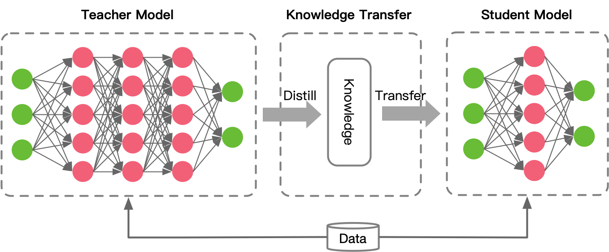
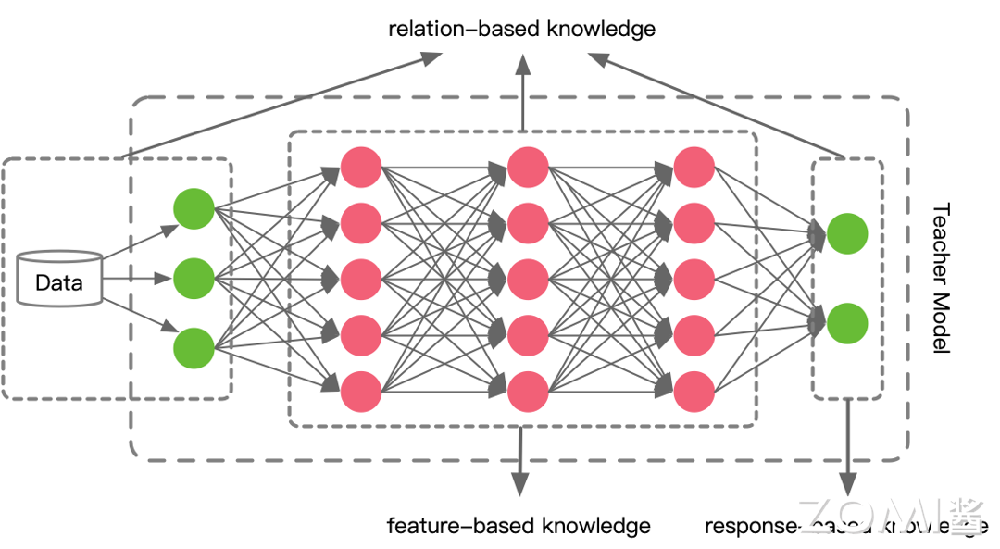
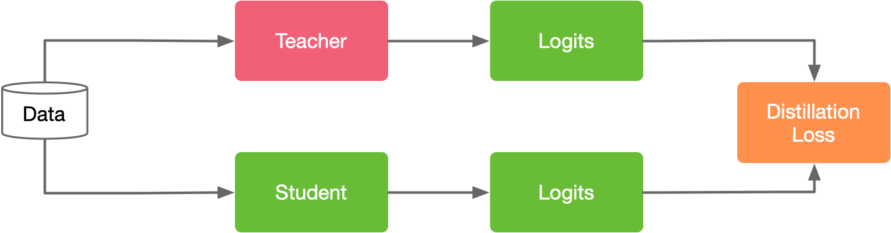
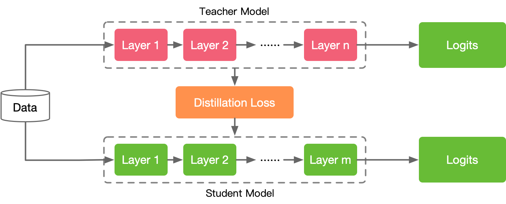
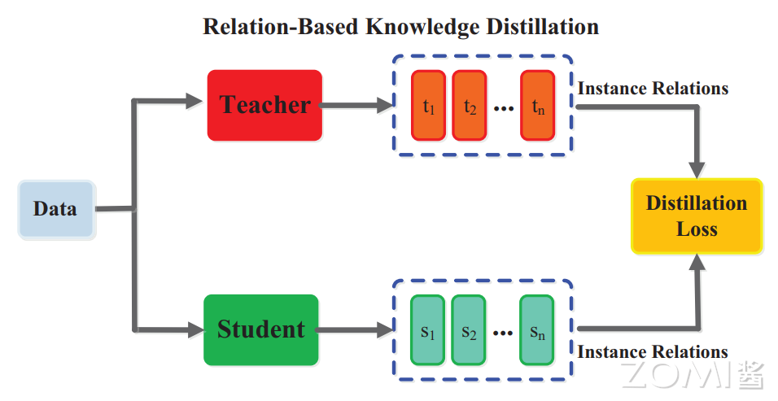

<!--Copyright © 适用于[License](https://github.com/chenzomi12/AISystem)版权许可-->

# 知识蒸馏

知识蒸馏 (Knowledge Distillation, KD) 是一种用于模型压缩和优化的技术，最初由 Hinton 在文章“Distilling the Knowledge in a Neural Network”中提出，核心思想是从一个复杂的较大的模型（通常称为教师模型）中提取知识，将这些知识转移到一个精简的小模型（通常称为学生模型）中。这个过程能够显著减少模型的复杂度和计算开销，同时尽可能保留较大模型的性能。Hinton 在文章中使用了一个生动形象的比喻，将神经网络的知识蒸馏与自然界中昆虫的变态发育进行了类比：为了更加轻松地从非常大的、高度冗余的数据集中提取知识，神经网络模型一般会被设计的非常庞大复杂，对该模型的训练就像幼虫从环境中吸收养分一样，通过这个过程，模型逐渐积累了丰富的知识和能力。而知识蒸馏过程类似于幼虫变为成虫，通过蒸馏技术，庞大复杂模型中的知识被压缩并转移到一个较小的模型中。这个较小的模型与之相比更紧凑，它保留了较大模型中的重要知识，具备了很强的泛化能力和实用性。蒸馏后的模型就像成虫一样，能够在不同的应用场景中高效地运行，执行各种实际任务，解决实际问题。

知识蒸馏通常应用于那些结构复杂的神经网络模型上，这些模型具有众多层次和大量参数，被当作教师模型来使用。如下图所示，在知识蒸馏过程中，一个小的“学生”模型通过模仿大的“教师”模型，学习和吸收教师模型中的知识，从而获得与教师模型相似甚至更高的准确度。随着深度学习在过去十年的迅猛发展，知识蒸馏技术已经在多个领域取得了显著的成功，包括语音识别、图像识别和自然语言处理等，知识蒸馏技术在实际应用中越来越受到重视，成为优化模型性能和部署效率的重要手段。

知识蒸馏系统通常由三部分组成，分别是知识（Knowledge）、蒸馏算法（Distillation algorithm）、师生架构（Teacher-student architecture）。知识部分指的是从教师模型中提取的有价值的信息，可以是输出的 logits（未归一化概率）、中间层的特征表示或者模型参数等。蒸馏算法是用于将教师模型的知识传递给学生模型的具体方法和技术，确保学生模型能够有效学习和吸收这些知识。师生架构则是指教师模型和学生模型的设计和配置方式，包括它们之间的交互模式和训练过程。通过这三部分的协同工作，知识蒸馏系统能够实现从大模型向小模型的高效知识传递。

## 知识类型

大型深度神经网络中的知识来源非常丰富，不仅仅局限于模型在训练过程中学习到的权重（weights）和偏置（biases），还包括其他多种形式的信息。
知识的类型可以分为四类，主要有 Response-based、Feature-based、Relation-based 三种，另外还有一种较少提及的类型，即 Architecture-based 的知识。

### response-based knowledge

基于响应的知识通常是指教师模型的输出，例如分类任务中通过 softmax 函数处理后输出的类型概率分布（软标签）。这种方法利用教师模型对输入数据的预测结果来帮助学生模型学习，从而提高其性能。当知识蒸馏对这部分知识进行转移时，学生模型直接学习教师模型的最终输出，以使学生模型获得与教师模型一样的预测性能。

通俗的说法就是老师充分学习知识后，直接将结论告诉学生。假设张量 $z_t$ 为教师模型的输出 logits，张量 $z_s$ 为学生模型的输出 logits，蒸馏学习的目标是让 $z_s$ 模仿 $z_t$，降低上图中的 distillation loss。图中基于响应的知识的 distillation loss 被表示为

$$L_{ResD}(z_t,z_s)=L_{R}(z_t,z_s)$$

其中，$L_{R}(\cdot)$ 为 $z_t$ 和 $z_s$ 的散度损失函数。使用基于响应的知识蒸馏方法的最大优势在于直接利用模型对样本的预测输出，而无需关注神经网络模型的内在结构或特征表达。这种方法简单而高效，适用于各种学习任务，包括普通的监督学习、涉及不同领域和模态的学习任务，以及一些特殊情况下的学习场景，如多模型学习、自监督学习。另外，基于响应的知识蒸馏与其他知识蒸馏方法的组合十分灵活，并且无需额外的设计，进一步提高了其适用性和实用性。

### feature-based knowledge

上面一种方法学习目标非常直接，学生模型直接学习教师模型的最后预测结果，然而输出层提供的信息是有限的。在深度神经网络中，数据通过多个层次的神经元进行传递和处理，每一层都可以看作是对数据的一种特征提取和变换。随着网络的深度增加，每一层提取的特征都越来越抽象和高级，可以捕捉到数据中更加复杂和抽象的模式和结构。考虑到深度神经网络擅长学习不同抽象级别的多层特征表示，因此模型中间层的输出，即特征图，也可以作为指导学生模型学习的知识。

这些来自中间层基于特征的知识是对基于响应的知识的良好扩展，特别适用于训练更瘦更深的网络。上图展示了 Feature-based knowledge 的知识蒸馏过程。
基于特征的知识转移的蒸馏损失函数可以表示为

$$L_{FeaD}(f_t(x),f_s(x)) = L_F(\phi_{t}(f_t(x)),\phi_{s}(f_s(x)))$$

其中 $f_t(x)$ 和 $f_s(x)$ 分别为教师模型和学生模型的中间层特征图。转换函数 $\phi_{t}(f_t(x))$ 和 $\phi_{s}(f_s(x))$ 通常在教师模型和学生模型的特征图形状不一致时使用。 $L_F(\cdot)$ 是教师模型和学生模型的中间层特征图的相似度函数。

虽然基于特征的知识转移为学生模型的学习提供了更多信息，但由于学生模型和教师模型的结构不一定相同，如何从教师模型中选择哪一层网络（提示层），从学生模型中选择哪一层（引导层）模仿教师模型的特征，是一个需要探究的问题。
另外，当提示层和引导层大小存在差异时，如何正确匹配教师与学生的特征表示也需要进一步探究。

### relation-based knowledge

上述两种方法都使用了教师模型中特定网络层中特征的输出，而基于关系的知识进一步探索了各网络层输出之间的关系或样本之间的关系。基于关系的知识蒸馏认为，知识的不仅仅是特征输出结果，而且还是网络层与层之间以及样本数据之间的关系。其重点在于提供一个一致的关系映射，使得学生模型能够更好地学习教师模型中的关系知识。例如将教师模型中某两层特征图的 Gram 矩阵（网络层输出之间的关系）作为知识，或者将数据样本之间的关系表示为数据样本在教师模型中的特征表征的概率分布，将这种概率分布（数据样本间的关系）作为知识供学生模型学习。

上图展示了数据样本之间的关系知识蒸馏的过程，其蒸馏损失函数可以表述为

$$
L_{RelD}(F_t,F_s) = L_{R^2}(\psi_{t}(t_i,t_j),\psi_{s}(s_i,s_j))
$$

其中，$F_s$ 和 $F_t$ 分别表示一组样本数据的从学生模型和教师模型得到的特征表征，而 $t_i$，$t_j\in F_t$ 表示单个样本在教师模型中的特征表征，同理 $s_i$ , $s_j\in F_s$ ，而 $\psi_{t}(\cdot)$ 与 $\psi_{s}(\cdot)$ 分别是 $(t_i,t_j)$ 和 $(s_i,s_j)$ 的相似度函数，$L_{R^2}(\cdot)$ 是关联函数（correlation function）。

基于网络层的关系蒸馏只关注每个样本在不同网络层之间的关系知识，而忽略了同样存在于教师模型的空间结构中不同样本之间的关系信息。基于样本间关系的特征知识蒸馏正是利用了这种知识，将教师模型中捕捉到的样本间关系信息传递到学生模型中。

## 知识蒸馏方式

类似于人类教师和学生之间的学习模式，神经网络的知识蒸馏在学习方式上也有多种模式，一般分为三种：离线蒸馏（offline distillation），在线蒸馏（online distillation）以及自蒸馏（self-distillation）。

### offline distillation

在离线蒸馏中，教师模型在学生模型训练之前已经完成训练，并且其参数在整个蒸馏过程中保持不变。这种方法是大部分知识蒸馏算法采用的方法，主要包含三个过程：

1. 蒸馏前教师模型预训练：首先，教师模型在大规模数据集上进行训练，达到理想的性能水平。这个过程通常耗时较长且需要大量计算资源。
2. 知识提取：将教师模型的知识提取出来，通常以教师模型对训练数据的输出（如概率分布或特征表示）的形式表示。
3. 学生模型的训练：在学生模型的训练过程中，使用教师模型的输出作为指导。学生模型通过一个额外的蒸馏损失函数，学习如何模拟教师模型的输出。常见的蒸馏损失函数包括交叉熵损失和均方误差损失。

该方法主要侧重于知识迁移部分，教师模型通常参数量大，一些庞大复杂模型会通过这种方式得到较小模型，比如 BERT 通过蒸馏学习得到 tinyBERT。它的主要优点在于能灵活选择预训练好的大型模型作教师，在蒸馏过程中教师模型不需要参数更新，而只需要关注学生模型的学习，这使得训练过程的部署简单可控，大
大减少了知识蒸馏的资源消耗和成本，但这种方法的缺点是学生模型非常依赖教师模型。

### online distillation

在线知识蒸馏中，教师模型和学生模型在同一训练过程中共同学习。教师模型不再是预先训练好的，而是与学生模型同步更新，教师模型和学生模型相互影响，共同提升性能，相互学习和调整。这种协同学习使得教师模型和学生模型可以动态适应数据变化和任务需求。

在线知识蒸馏能够在没有预训练模型的情况下，针对不同任务实现知识学习和蒸馏，有助于多个模型在学习过程中互相调整和更新学到的知识，实现优势互补。特别是对于多任务学习等特殊场景，具有很大优势。相比于模型压缩，在线学习更适合于知识融合以及多模态、跨领域等场景。然而训练过程中，增加的模型数量可能会导致计算资源的消耗增加。

### self-distillation

自蒸馏是一种比较特殊的知识蒸馏模式，可以看作是的一种特例，即教师模型和学生模型采用相同的网络模型的在线蒸馏。自蒸馏过程中，学生模型从自身的输出中进行学习，这意味着学生模型将深层的信息传递给浅层，以指导自身的训练过程，而无需依赖外部的教师模型。用学习过程比喻，离线蒸馏是知识渊博的老师向学生传授知识；在线蒸馏是老师和学生一起学习、共同进步；自蒸馏是学生自学成才。

自蒸馏的提出主要是为了解决传统两阶段蒸馏方法的一些问题。传统方法需要预先训练大型教师模型，这会消耗大量的时间和计算资源。而且，教师模型和学生模型之间可能存在能力不匹配的问题，导致学生无法有效地学习教师模型的表征。
自蒸馏方法克服了这些问题，它不需要依赖教师模型进行指导，而是通过学生模型自身的输出来提升性能。这种方法使得学生模型能够在没有外部指导的情况下自我提升，并且可以更加高效地进行模型训练。

## 经典算法解读

这一部分介绍 Hinton 在文章 "Distilling the Knowledge in a Neural Network" 中针对多分类任务提出的知识蒸馏方法。该算法流程主要可以概括为以下 4 个步骤：

1. 训练教师模型
2. 教师模型的 logits 输出，在高温 T 下生成 soft target
3. 使用 $\mathcal{L}_{soft}$ 与 $\mathcal{L}_{hard}$ 同时训练学生模型
4. 将温度 T 调为 1，学生模型用于线上推理

### 详细算法过程

对于用于多分类任务的神经网络模型，最后全连接层输出的未归一化类别概率向量 $z$ 被称为 logits，经过 softmax 函数处理后，这些 logits 会被转换成模型的类别预测概率。具体来说，softmax 函数会将每个 logit 值指数化，并对所有类别的指数化值进行归一化，使得它们的总和为 1。这样，softmax 函数输出的每个值都可以被解释为模型对相应类别的预测概率。这一过程使得 logits 转换为一组可以用于分类决策的概率分布，从而得出最终的预测类别。softmax 函数计算方法如下：

$$q_i = \frac{\exp(z_i)}{\sum_j \exp(z_j)}$$

其中 $q_i$ 表示不同类别的预测概率。这个预测结果是 soft target，而真实目标是 hard target，一般机器学习的目标就是让 soft target 逼近 hard target。

Hinton 等人引入“蒸馏”的概念，在上式基础上添加一个温度系数 $T$：

$$q_i = \frac{\exp(z_i/T)}{\sum_j \exp(z_j/T)}$$

当 $T=1$ 时，就是标准的 softmax 函数。T 越大，得到的概率分布的熵越大，负标签携带的信息会被放大，负标签的概率分布会对损失函数有更明显的影响，模型训练会更关注这部分信息。为什么要重视负标签的信息？

Hinton 举了一个例子，BMW 宝马被当做垃圾箱的概率很低，基本接近于 0，但还是比被当做胡萝卜的概率要高得多。当负标签的概率都很低时，负标签之间的概率差异仍然包含了一部分信息，而这部分信息往往被模型忽略（因为所有负标签概率接近于 0）。例如 MNIST 数据集中存在一个数字 2 的样本被预测为 3 的概率为 $10^{-6}$，被预测为 7 的概率为 $10^{-9}$，这部分负标签的信息就意味着这个数字 2 有可能与 3 和 7 有些相像。

通常，在蒸馏学习过程中，将 T 适当调高并保持不变，使得学生模型可以学习到负标签的信息，等学生模型训练完成后，将 T 设为 1，用于推理。
该蒸馏学习算法采用 offline distillation 的形式、教师-学生架构，其中教师是知识输出者，学生是知识接受者。算法过程分为两个部分：教师模型训练、学生模型蒸馏。教师模型特点是模型较为复杂，精度较高，对教师模型不做任何关于模型架构、参数量等方面的限制。

论文中，Hinton 将问题限定为分类问题，即模型最终输出会经过 softmax 处理，得到一个概率分布。蒸馏过程中除了教师模型和学生模型，一个重要的部分是数据集，数据集可以是训练教师模型所用的数据集，也可以是其他的辅助数据集，可以是有标签的数据集，也可以是无标签的数据集。
如果蒸馏过程中使用的数据集有标签，则学生模型的训练目标有两个，一个是模仿教师模型的输出，另一个是接近真实标签，而一般前者是主要目标，后者是次要目标。损失函数可写为：

$$\mathcal{L} = \mathcal{L}_{soft} + \lambda \mathcal{L}_{hard}$$

$$\mathcal{L}_{soft} = -\sum_j p_j^T log(q_j^T)$$

$$\mathcal{L}_{hard} = -\sum_j c_j log(q_j)$$

其中 $p_j^T$ 表示教师模型在 $T$ 下（$T$ 通常大于 1）的预测结果，$q_j^T$ 表示学生模型在 $T$ 下的预测结果，$c_j$ 表示真实标签，$q_j$ 表示学生模型在 $T=1$ 时的预测结果。当数据集无标签时，只能用 $\mathcal{L}_{soft}$。

### 补充

1. 知识蒸馏与物理蒸馏的相似之处：

    - 知识蒸馏通过 T 系数控制模型输出的熵；物理蒸馏通过温度改变混合物的形态，影响物理系统的熵

    - 温度系数 T 训练时提高，最后变回 1；物理蒸馏时温度先上升使液体变为气体，气体再回到常温变回液体

2. 知识从何说起：在神经网络模型中，对模型中的知识是难以观察的，从更抽象的角度理解，模型的知识就是模型输入向量和输出向量的映射关系。

## 小结

- 知识蒸馏将一个大型、复杂的“教师”模型中的知识提取出来，传递给一个较小、较简单的“学生”模型。目的是减少模型的复杂度和计算开销，同时尽可能保证模型的性能
- 知识蒸馏系统一般由知识、蒸馏算法和师生架构这三部分组成。
- 神经网络中的知识总体可以分为四类：response-based knowledge、feature-based knowledge 以及 relation-based knowledge。
- 神经网络的知识蒸馏在学习方式上有多种模式，一般分为三种：offline distillation、online distillation 及 self-distillation
- 介绍了Hinton针对多分类任务提出的知识蒸馏算法，通过调节softmax函数中的温度参数T，使得教师网络预测输出的软目标（soft targets，指预测输出的类别概率分布）包含更多的信息，学生网络通过这些软目标学习到更多知识。

## 本节视频

<html>
<iframe src="https://player.bilibili.com/player.html?isOutside=true&aid=778337476&bvid=BV1My4y197Tf&cid=979176124&p=1&as_wide=1&high_quality=1&danmaku=0&t=30&autoplay=0" width="100%" height="500" scrolling="no" border="0" frameborder="no" framespacing="0" allowfullscreen="true"> </iframe>
</html>

<html>
<iframe src="https://player.bilibili.com/player.html?isOutside=true&aid=308275683&bvid=BV1vA411d7MF&cid=980464383&p=1&as_wide=1&high_quality=1&danmaku=0&t=30&autoplay=0" width="100%" height="500" scrolling="no" border="0" frameborder="no" framespacing="0" allowfullscreen="true"> </iframe>
</html>

## 参考文献

1. Jianping Gou et al. Knowledge Distillation: A Survey. https://doi.org/10.1007/s11263-021-01453-z
2. Hinton et al. Distilling the Knowledge in a Neural Network. http://arxiv.org/abs/1503.02531
3. Longhui Wei et al. Circumventing outlier of autoaugment with knowledge distillation.  https://doi.org/10.1007/978-3-030-58580-8_36
4. Caruana et al. Model compression. https://doi.org/10.1145/1150402.1150464
5. 模型压缩（上）--知识蒸馏（Distilling Knowledge）https://www.jianshu.com/p/a6d87b338bcf
6. DeiT：注意力也能蒸馏 https://www.cnblogs.com/ZOMI/p/16496326.html
