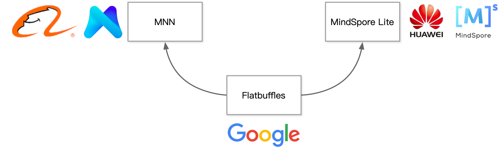

<!--Copyright © 适用于[License](https://github.com/chenzomi12/AISystem)版权许可-->

# 推理文件格式(DONE)

在训练好一个模型后，需要将其保存下来，以便在需要时重新加载并进行推理或进一步的训练。为了实现这一目标，需要一种有效的方式来将模型的参数、结构等保存起来。

本文主要介绍在推理引擎中，针对神经网络模型的序列化与反序列化、不同的模型序列化方法，以及 Protobuf 和 FlatBuffers 两种在端侧常用的模型文件格式。

## 模型序列化

模型序列化是模型部署的第一步，如何把训练好的模型存储起来，以供后续的模型预测使用，是模型部署的首先要考虑的问题。

### 序列化与反序列化

训练好的模型通常存储在计算机的内存中。然而，内存中的数据是暂时的，不具备长期存储的能力。因此，为了将模型保存供将来使用，我们需要将其从内存中移动到硬盘上进行永久存储。

这个过程被称为模型的保存和加载，或者说是序列化和反序列化。在这个过程中，模型的参数、结构和其他相关信息会被保存到硬盘上的文件中，以便在需要时重新加载到内存中。


- 模型序列化：模型序列化是模型部署的第一步，如何把训练好的模型存储起来，以供后续的模型预测使用，是模型部署的首先要考虑的问题。

- 模型反序列化：将硬盘当中的二进制数据反序列化的存储到内存中，得到网络模型对应的内存对象。无论是序列化与反序列的目的是将数据、模型长久的保存。

### 序列化分类

1. 跨平台跨语言通用序列化方法

常用的序列化主要有四种格式：XML（一种可扩展标记语言，非常适合存储和传输结构化数据），JSON（一种轻量级的数据交换格式），Protocol Buffers（谷歌开发的语言中立、平台中立、可扩展的序列化结构数据格式）和 Flatbuffer（谷歌开发的另一种高效序列化库，与 Protobuffer 类似）。前两种是文本格式，人和机器都可以理解，后两种是二进制格式，只有机器能理解，但在存储传输解析上有很大的速度优势。使用最广泛为 Protobuffer。

下图中的[ONNX](https://onnx.ai/)使用的就是 Protobuf 这个序列化数据结构去存储神经网络的权重信息。ONNX（Open Neural Network Exchange）是一个开放格式，用于机器学习模型的跨平台共享。通过使用 Protobuf，ONNX 能够在不同的深度学习框架之间高效地传输模型数据。

[CoreML](https://developer.apple.com/cn/documentation/coreml/)既是一种文件格式，又是一个强大的机器学习运行时环境，它使用了 Protocol Buffers 的二进制序列化格式，并在所有苹果操作系统平台上提供了高效的推理和重新训练功能。CoreML 允许开发者轻松地将机器学习模型集成到 iOS、macOS、watchOS 和 tvOS 应用中，利用苹果设备的硬件加速特性实现高效的模型推理。


2. 模型本身提供的自定义序列化方法
   
模型可以提供自定义的序列化方法，这些方法可以是文本格式或者二进制格式。自定义的序列化方法通常是根据特定的模型结构和需求来设计的，以优化存储和传输效率。

**文本格式：** 这类自定义方法通常采用类似 JSON 或 XML 的格式，方便调试和分析。例如，一些机器学习模型会输出人类可读的文本文件，包含模型参数和结构信息。

**二进制格式：** 与 Protobuf 和 Flatbuffer 类似，这类自定义方法采用高效的二进制格式，提升存储和解析速度。例如，TensorFlow 的 Checkpoint 文件和 PyTorch 的模型文件都是专门设计的二进制格式，能快速存取大量模型参数。

自定义的序列化方法可以是语言专有或者跨语言跨平台的格式：

**语言专有格式：** 某些机器学习框架提供了特定语言的序列化方法，比如 Scikit-Learn 的 .pkl 文件，专门用于 Python 环境中的模型保存和加载。

**跨语言跨平台格式：** 这类格式旨在实现不同编程语言和操作系统之间的互操作性。比如 ONNX 就是一种跨平台的模型序列化格式，可以在不同的深度学习框架和运行时环境之间共享模型。

3. 语言级通用序列化方法

不同编程语言提供了各自的通用序列化方法，以方便开发者保存和加载各种数据结构，包括机器学习模型。

**Python:**

- [pickle](https://docs.python.org/3/library/pickle.html)：Python 内置的对象序列化库，支持序列化几乎所有 Python 对象。其 C 实现版本 cPickle 提供了更高的序列化速度。以下是使用 pickle 保存和加载训练模型的简单示例：
  
```python
import pickle  # 导入 pickle 模块，用于序列化对象

# 训练模型并保存模型的代码段
model.fit(x_data, y_data)  # 使用训练数据 x_data 和标签 y_data 来训练模型
s = pickle.dumps(model)  # 将训练好的模型序列化为字节串并保存到变量 s 中
with open('myModel.model', 'wb+') as f:  # 打开一个文件 'myModel.model' 用于写入，并使用二进制模式
    f.write(s)  # 将序列化后的模型字节串写入到文件中

# 加载模型并进行预测的代码段
with open('myModel.model', 'rb') as f:  # 打开一个文件 'myModel.model' 用于读取，并使用二进制模式
    s = f.read()  # 读取文件中的内容（模型字节串）并保存到变量 s 中
    model = pickle.loads(s)  # 使用 pickle.loads() 函数将模型字节串反序列化为模型对象并保存到变量 model 中
```
- [joblib](https://joblib.readthedocs.io/en/latest/persistence.html)：专为大规模数据和数值数组设计的序列化库，在处理包含大量 NumPy 数组的模型时性能优异。Joblib 使用磁盘存储策略，能有效减少内存占用。
  
**R:**

- [rda](https://www.rdocumentation.org/packages/base/versions/3.6.1/topics/save)：R 语言中的一种数据保存格式，通常用于保存 R 对象以便在不同 R 会话之间共享。`save`函数可以将 R 对象序列化为二进制文件，支持复杂数据结构的高效存储和加载。

这些语言级的序列化方法，提供了方便的接口，开发者可以根据需要选择最合适的方法来存储和加载模型或数据。

4. 用户自定义序列化方法

在某些特殊情况下，以上所有方法都无法满足特定需求，用户可以设计自己的序列化格式。这种自定义方法通常用于满足特殊的部署需求，例如优化部署性能、减少模型大小或者满足特定的环境要求。

自定义序列化方法的设计需要考虑以下几个方面：

- 部署性能：如何在不牺牲运行时性能的情况下，快速加载和解析模型数据。
- 模型大小：如何最大限度地压缩模型数据以节省存储空间和传输带宽。
- 环境要求：如何确保序列化格式在目标环境中兼容运行，尤其是在资源受限的嵌入式系统或边缘设备上。

虽然自定义序列化方法可以精确满足特定需求，但其维护和版本兼容性可能成为挑战。每次模型升级或格式变更都需要确保兼容性和数据完整性。因此，选择模型序列化方法，可以优先使用跨平台跨语言通用序列化方法，最后再考虑使用自定义序列化方法。

### Pytorch 模型序列化方法

Pytorch 模型序列化有两种方法，一种是基于 Pytorch 内部格式，另一种是使用 ONNX。前者只保存了网络模型的参数、结构，不能保存网络模型的信息计算图。

1. [Pytorch 内部格式](https://pytorch.org/tutorials/beginner/saving_loading_models.html)

PyTorch 内部格式主要通过`torch.save`和`torch.load`函数实现模型的保存与加载。这种方法仅存储已训练模型的状态，包括网络模型的权重、偏置和优化器状态等信息。以下是详细步骤：

```python
# Saving & Loading Model for Inference

torch.save(model.state_dict(), PATH)

model = TheModelClass(*args, **kwargs)
model.load_state_dict(torch.load(PATH))
model.eval()
```

`torch.save` 将序列化对象保存到磁盘。该函数使用 Python 的 pickle 实用程序进行序列化。使用此函数可以保存各种对象的模型、张量和字典。

`torch.nn.Module.load_state_dict` 使用反序列化的 state_dict 加载模型的参数字典 。在 PyTorch 中，模型的可学习参数（即权重和偏差） `torch.nn.Module` 包含在模型的参数中 （通过访问 `model.parameters()`）。

`state_dict`只是一个 Python 字典对象，它将每个层映射到其参数张量。请注意，只有具有可学习参数的层（卷积层、线性层等）和注册缓冲区（batchnorm 的 running_mean）在模型的`state_dict`中具有条目。

优化器对象 `torch.optim` 还有一个`state_dict`，其中包含有关优化器状态以及所使用的超参数的信息。由于 state_dict 对象是 Python 字典，因此可以轻松保存、更新、更改和恢复它们，从而为 PyTorch 模型和优化器添加大量模块化功能。

当训练的模型在 GPU 中时，`torch.save`函数将其存储到磁盘中。当再次加载该模型时，会将该模型从磁盘先加载 CPU 中，再移动到指定的 GPU 中。但是，当重新加载的机器不存在 GPU 时，模型加载可能会出错。要将在 GPU 上训练的模型加载到 CPU 内存中，可以使用 PyTorch 库的`.to()`方法将模型转移到 CPU 设备。以下是一个示例代码：

```python
import torch
import torchvision.models as models

# 在 GPU 上训练模型
device = torch.device("cuda" if torch.cuda.is_available() else "cpu")
model = models.resnet50().to(device)
# 训练模型...

# 将模型加载到 CPU 内存中
model = model.to("cpu")
```

在这个示例中，首先检查是否有可用的 cuda 设备，然后将模型移动到 cuda 设备上进行训练。最后，使用`.to("cpu")`将模型加载到 CPU 内存中。将模型从 GPU 移动到 CPU 可能会导致一些性能损失，因为 GPU 设备通常比 CPU 设备更适合进行大规模并行计算。所以在通常情况下，在需要使用模型进行推理时再将其移动到 CPU 上。

2. [ONNX](https://pytorch.org/docs/master/onnx.html)

PyTorch 提供了内置支持，可以使用`torch.onnx.export`方法将 PyTorch 模型导出为 ONNX 格式。

以下代码将预训练的 AlexNet 导出到名为`alexnet.onnx`的 ONNX 文件。调用 `torch.onnx.export` 运行模型一次以跟踪其执行情况，然后将跟踪的模型导出到指定文件。

```python
import torch
import torchvision

dummy_input = torch.randn(10, 3, 224, 224, device="cuda")
model = torchvision.models.alexnet(pretrained=True).cuda()

input_names = [ "actual_input_1" ] + [ "learned_%d" % i for i in range(16) ]
output_names = [ "output1" ]

torch.onnx.export(model, dummy_input, "alexnet.onnx", verbose=True, input_names=input_names, output_names=output_names)
```

然后，可以运行如下代码来加载模型：

```python
import onnx

# Load the ONNX model
model = onnx.load("alexnet.onnx")

# Check that the model is well formed
onnx.checker.check_model(model)

# Print a human readable representation of the graph
print(onnx.helper.printable_graph(model.graph))
```

这种方法不仅保存了模型的参数，还包括完整的计算图信息，使得模型可以在支持 ONNX 的不同框架和平台之间进行转换和部署。

## 目标文件格式

在序列化与反序列化的过程中，选择合适的目标文件格式至关重要，它决定了数据的存储方式、传输效率和系统的整体性能。下文将介绍 Protobuf 和 FlatBuffers 两种流行的目标文件格式。

### Protocol Buffers

**Protobuf**是 “Protocol Buffers” 的缩写，是一种高效、与语言无关的数据序列化机制。它使开发人员能够在文件中定义结构化数据`.proto`，然后使用该文件生成可以从不同数据流写入和读取数据的源代码。

Protobuf 最初是由谷歌的工程师开发的，他们需要一种有效的方法来跨各种内部服务序列化结构化数据。其特点是语言无关、平台无关；比 XML 更小更快更为简单；扩展性、兼容性好。

#### 文件语法详解

- **基本语法：** 字段规则数据类型名称 = 域值 [选项 = 选项值]

```shell
// 字段规则数据类型名称 = 域值 [选项 = 选项值]

message Net{ // message 属于 Net 域；
  optional string name = 'conv_1*1_0_3';
  repeated Layer layer = 2;
}
```

- **字段规则**
  
  - required：一个格式良好的消息一定要含有 1 个这种字段。表示该值是必须要设置的。
  - optional：消息格式中该字段可以有 0 个或 1 个值（不超过 1 个）。
  - repeated：在一个格式良好的消息中，这种字段可以重复任意多次（包括 0 次）。重复的值的顺序会被保留。表示该值可以重复，相当于 java 中的 List。 

#### Protobuf 例子

我们将编写一个 caffe::NetParameter（或在 Python 中 caffe.proto.caffe_pb2.NetParameter）protobuf。

- 编写数据层

```
  layer {
  name: "mnist"
  type: "Data"
  transform_param {
      scale: 0.00390625
  }
  data_param {
      source: "mnist_train_lmdb"
      backend: LMDB
      batch_size: 64
  }
  top: "data"
  top: "label"
  }
```

- 编写卷积层

```
  layer {
  name: "conv1"
  type: "Convolution"
  param { lr_mult: 1 }
  param { lr_mult: 2 }
  convolution_param {
      num_output: 20
      kernel_size: 5
      stride: 1
      weight_filler {
      type: "xavier"
      }
      bias_filler {
      type: "constant"
      }
  }
  bottom: "data"
  top: "conv1"
  }
```

池化层、全连接层等内容可以参考[Training LeNet on MNIST with Caffe](https://github.com/BVLC/caffe/blob/master/examples/mnist/readme.md)。

#### TensorFlow 编码和解码

```
// 将给定的 Protocol Buffer 对象编码为字节字符串

tf.io.encode_proto(
    sizes: Annotated[Any, _atypes.Int32],
    values,
    field_names,
    message_type: str,
    descriptor_source: str = 'local://',
    name=None
) -> Annotated[Any, _atypes.String]

// 将给定的字节字符串解码为 Protocol Buffer 对象

tf.io.decode_proto(
    bytes: Annotated[Any, _atypes.String],
    message_type: str,
    field_names,
    output_types,
    descriptor_source: str = 'local://',
    message_format: str = 'binary',
    sanitize: bool = False,
    name=None
)
```

#### 编码模式

计算机里一般常用的是二进制编码，如 int 类型由 32 位组成，每位代表数值 2 的 n 次方，n 的范围
是 0-31。Protobuf 采用 TLV 编码模式，即把一个信息按照 tag-length-value 的模式进行编码。tag 和 value 部分类似于字典的 key 和 value，tag 标识字段的类型和唯一性，它是一个整数，表示字段号和数据类型。Protobuf 中，Tag 是通过字段号和数据类型组合编码的。length 表示 value 的长度，对于定长数据类型（如整数、浮点数），Length 可以省略，因为值的长度是已知的。对于可变长数据类型（如字符串、字节数组），Length 表示值的字节数。Value 是实际的数据内容。根据 Tag 和 Length，可以正确解析和理解 Value 部分。

在 Protobuf 中，Tag 的编码结合了字段号和数据类型，具体采用 Varint 编码方式：字段号（Field Number）唯一标识消息中的字段，值为正整数。线类型（Wire Type）表示字段的数据类型，如整数、浮点数、长度前缀的字符串等。Protobuf 使用 3 位来表示线类型（Wire Type），其余部分表示字段号（Field Number）。编码格式如下：

```Tag = (Field Number << 3) | Wire Type```

#### 编解码过程

Protobuf 的编解码过程是基于其 TLV 结构进行的。解析根消息（Root Message）时，会逐个解析其包含的字段。以下是具体的步骤：

**编码过程：** 首先构建消息结构，根据`.proto`文件定义的消息结构，构建消息对象；然后对逐个字段进行编码，编码 Tag（将字段号和线类型编码成 Tag）、Length（对于可变长数据类型，计算并编码值的长度）、Value（将实际数据编码成二进制格式）；然后将 Tag、Length 和 Value 组合成二进制格式的数据块，最后将所有字段的二进制数据块组合成完整的消息二进制流。

**解码过程：** 根 message 由多个 TLV 形式的 field 组成，解析 message 的时候逐个去解析 field。由于 field 是 TLV 形式，因此可以知道每个 field 的长度，然后通过偏移上一个 field 长度找到下一个 field 的起始地址。其中 field 的 value 有可能是一个嵌套的 message，这时候需要递归地应用相同的解析方法。在解析 field 时，首先解析其 tag，以获取 field_num（属性 ID）和 type。field_num 标识了该属性的唯一标识，而 type 则指示了用于解码 value 的编码算法。

### FlatBuffers

FlatBuffers 是一个开源的、跨平台的、高效的、提供了多种语言接口的序列化工具库。实现了与 Protocal Buffers 类似的序列化格式。主要由 Wouter van Oortmerssen 编写，并由谷歌开源。

FlatBuffers 主要针对部署和对性能有要求的应用。相对于 Protocol Buffers，FlatBuffers 不需要解析，只通过序列化后的二进制 buffer 即可完成数据访问。

FlatBuffers 具有数据访问不需要解析（将数据序列化成二进制 buffer，之后的数据访问直接读取这个 buffer）、内存高效且速度快（数据访问只在序列化后的二进制 buffer，不需额外的内存分配，数据访问速度接近原生的 struct，只多了一次解引用）、生成的代码量小（只需依赖一个头文件）、可扩展性强（支持灵活的 schema 定义，可以方便地扩展数据结构）、支持强类型检测（提供编译时的类型检查，确保数据结构的安全性和正确性）和易于使用（提供多种语言接口）等特点。

与 Protocol Buffers 类似，使用 FlatBuffers 需要先定义一个 schema 文件，用于描述要序列化的数据结构的组织关系。以下是一个简单的示例：

```
table Monster {
  name: string;
  mana: int = 150;
  hp: int;
  inventory: [ubyte];
  color: int;
}
root_type Monster;
```

通过 schema 文件，可以生成相应的代码，用于序列化和反序列化操作。

很多 AI 推理框架都是用的 FlatBuffers，最主要的有以下两个：

**[MNN](https://github.com/alibaba/MNN/blob/master/README_CN.md)：** 阿里巴巴的深度神经网络推理引擎，是一个轻量级的深度神经网络引擎，支持深度学习的推理与训练。适用于服务器/个人电脑/手机/嵌入式各类设备。目前，MNN 已经在阿里巴巴的手机淘宝、手机天猫、优酷等 30 多个 App 中使用，覆盖直播、短视频、搜索推荐、商品图像搜索、互动营销、权益发放、安全风控等场景。 MNN 模型文件采用的存储结构是 FlatBuffers。

**[MindSpore Lite](https://www.mindspore.cn/lite/en):**  一种适用于端边云场景的新型开源深度学习训练/推理框架，提供离线转换模型功能的工具，支持多种类型的模型转换，转换后的模型可用于推理。除了基本的模型转换功能之外，还支持用户对模型进行自定义的优化与构建，生成用户自定义算子的模型。

MindSpore Lite 提供了一套注册机制，允许用户基于转换工具进行能力扩展：包括节点解析扩展、模型解析扩展以及图优化扩展，用户可以根据自身的需要对模型实现自定义的解析与融合优化。节点解析扩展需要依赖 flatbuffers 和 protobuf 及三方框架的序列化文件。



### Protobuf VS FlatBuffers

下面的表格从支持的语言、版本、协议文件、代码生成工具及协议字段类型几个方面比较了 ProtoBufers 和 Flatbuffers 两种格式：

| | Proto Bufers  | Flatbuffers |
| -- | -- | --------------------------------------------------------------------------------------------- |
| 支持语言   | C/C++, C#, Go, Java, Python, Ruby, Objective-C, Dart    | C/C++, C#, Go, Java, JavaScript, TypeScript, Lua, PHP, Python, Rust, Lobster    |
| 版本     | 2.x/3.x，不相互兼容 | 1.x |
| 协议文件   | .proto，需指定协议文件版本     | .fbs |
| 代码生成工具 | 有（生成代码量较多）    | 有（生成代码量较少） |
| 协议字段类型 | bool, bytes, int32, int64, uint32, uint64, sint32, sint64, fixed32, fixed64, sfixed32, sfixed64, float, double, string | bool, int8, uint8, int16, uint16, int32, uint32, int64, uint64, float, double, string, vector |

## 小结

- 模型序列化：模型序列化是将训练好的模型从内存中保存到硬盘上，以供将来使用的必要步骤，涉及将模型的参数、结构等信息存储到文件中。

- 序列化分类：序列化方法分为跨平台跨语言通用序列化方法（如XML、JSON、Protocol Buffers和Flatbuffers）、模型本身提供的自定义序列化方法、语言级通用序列化方法（如Python的pickle和joblib、R的rda）以及用户自定义序列化方法。

- Pytorch模型序列化：PyTorch提供了基于内部格式和ONNX的序列化方法。内部格式通过torch.save和torch.load实现模型状态的保存与加载，而ONNX通过torch.onnx.export导出模型，支持不同框架和平台之间的模型转换与部署。

- 目标文件格式：Protobuf和FlatBuffers是两种流行的目标文件格式。Protobuf是一种高效、与语言无关的数据序列化机制，而FlatBuffers提供了无需解析即可直接访问序列化数据的能力，适合性能要求高的应用场景。

## 本节视频

<html>
<iframe src="https://player.bilibili.com/player.html?isOutside=true&aid=905905415&bvid=BV13P4y167sr&cid=983223956&p=1&as_wide=1&high_quality=1&danmaku=0&t=30&autoplay=0" width="100%" height="500" scrolling="no" border="0" frameborder="no" framespacing="0" allowfullscreen="true"> </iframe>
</html>

## 参考文章

1. [PyTorch 学习—19.模型的加载与保存（序列化与反序列化）](https://blog.csdn.net/weixin_46649052/article/details/119763872)
2. [开源 AI 模型序列化总结](https://github.com/aipredict/ai-models-serialization)
3. [ONNX 学习笔记](https://zhuanlan.zhihu.com/p/346511883)
4. [深入 CoreML 模型定义](https://blog.csdn.net/volvet/article/details/85013830)
5. [Swift loves TensorFlow and CoreML](https://medium.com/@JMangiaswift-loves-TensorFlow-and-coreml-2a11da25d44)
6. [什么是 Protobuf？](https://blog.postman.com/what-is-protobuf/)
7. [Protobuf 语法指南](https://colobu.com/2015/01/07/Protobuf-language-guide/)
8. [深入浅出 FlatBuffers 之 Schema](https://halfrost.com/flatbuffers_schema/)
9. [FlatBuffers，MNN 模型存储结构基础 ---- 无法解读 MNN 模型文件的秘密](https://www.jianshu.com/p/8eb153c12a4b)
10. [华为昇思 MindSpore 详细教程（一）](https://blog.csdn.net/m0_37605642/article/details/125691987)
11. [如何将在 GPU 上训练的模型加载到 CPU（系统）内存中？](https://www.volcengine.com/theme/9557712-R-7-1)
12. [11 模型的保存加载¶](http://121.199.45.168:13007/01-PyTorch%E4%BD%BF%E7%94%A8/11-%E6%A8%A1%E5%9E%8B%E7%9A%84%E4%BF%9D%E5%AD%98%E5%8A%A0%E8%BD%BD.html)
