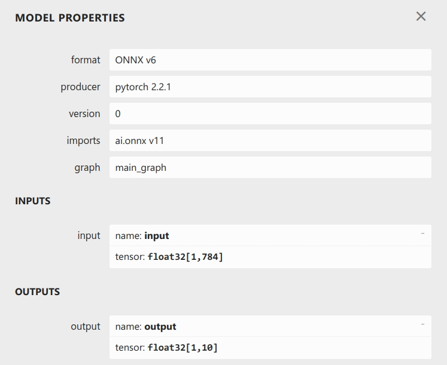
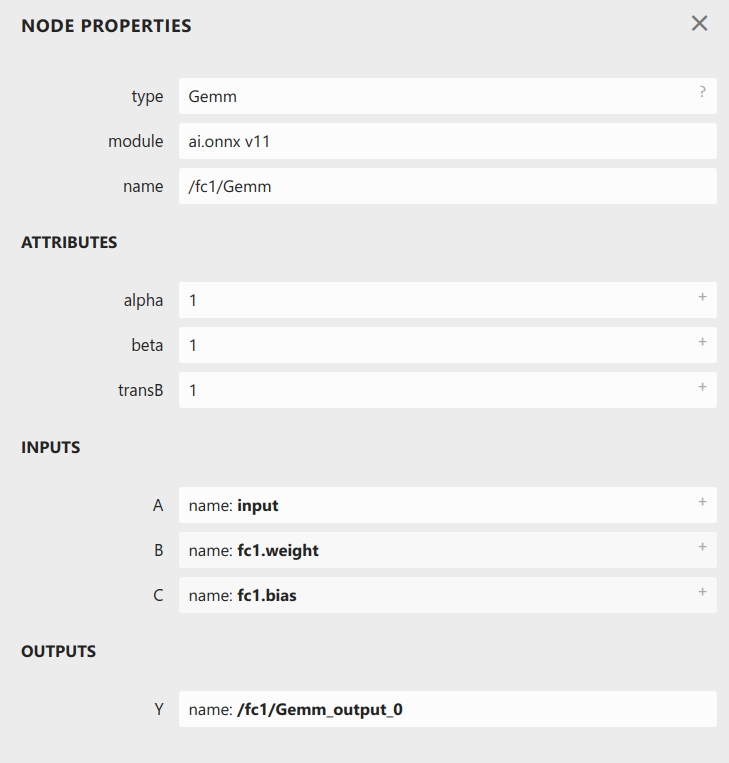

<!--Copyright © 适用于[License](https://github.com/chenzomi12/AISystem)版权许可-->

# 模型转换流程

======== 整体问题跟前面的几篇类似，因此统一审视以下哈。

用户在使用深度学习框架时，可能会遇到训练环境和部署环境不匹配的情况，比如用户用 Caffe 训练好了一个图像识别的模型，但是生产环境是使用 TensorFlow 做预测。

因此就需要将使用不同训练框架训练出来的模型相互联系起来，使用户可以进行快速的转换。模型转换主要有**直接转换**和**规范式转换**两种方式，本文将详细介绍这两种转换方式的流程以及相关的技术细节。

## 模型转换技术的设计思路

**直接转换**是将网络模型从 AI 框架直接转换为适合目标框架使用的格式。例如下图中的 MindSpore Converter 直接将 AI 框架 MindSpore 的格式转换成推理引擎 IR 的格式。

**规范式转换**设计了一种开放式的文件规范，使得主流 AI 框架可以实现对该规范标准的支持。例如不是直接转换 Pytorch 格式，而是把 Pytorch 转换为 ONNX 格式，或者把 MindSpore 转换成 ONNX 格式，再通过 ONNX Converter 转换成推理引擎 IR。主流 AI 框架基本上都是支持这两种转换技术的。


## 直接转换

### 直接转换的流程

直接转换的流程如下：

1. 内容读取：读取 AI 框架生成的模型文件，并识别模型网络中的张量数据的类型/格式、算子的类型和参数、计算图的结构和命名规范，以及它们之间的其他关联信息。
2. 格式转换：将第一步识别得到的模型结构、模型参数信息，直接代码层面翻译成推理引擎支持的格式。当算子较为复杂时，可在 Converter 中封装对应的算子转换函数来实现对推理引擎的算子转换。
3. 模型保存：在推理引擎下保存模型，可得到推理引擎支持的模型文件，即对应的计算图的显示表示。

### 直接转换实例

以下代码演示了如何加载一个预训练的 TensorFlow 模型并进行直接转换为 PyTorch 模型的过程：

```python
import tensorflow as tf
import torch
import torch.nn as nn

# 定义一个简单的 TensorFlow 模型
class SimpleModel(tf.keras.Model):
    def __init__(self):
        super(SimpleModel, self).__init__()
        self.dense1 = tf.keras.layers.Dense(64, activation='relu')
        self.dense2 = tf.keras.layers.Dense(10, activation='softmax')

    def call(self, inputs):
        x = self.dense1(inputs)
        return self.dense2(x)

# 1. 内容读取
# 创建并训练一个简单的 TensorFlow 模型
(x_train, y_train), _ = tf.keras.datasets.mnist.load_data()
x_train = x_train.reshape(-1, 784) / 255.0
y_train = tf.keras.utils.to_categorical(y_train, num_classes=10)
tf_model = SimpleModel()
tf_model.compile(optimizer='adam', loss='categorical_crossentropy', metrics=['accuracy'])
tf_model.fit(x_train, y_train, epochs=5)

# 2. 格式转换
# 定义对应的 PyTorch 模型结构
class PyTorchModel(nn.Module):
    def __init__(self):
        super(PyTorchModel, self).__init__()
        self.dense1 = nn.Linear(784, 64)
        self.relu = nn.ReLU()
        self.dense2 = nn.Linear(64, 10)

    def forward(self, x):
        x = x.view(-1, 784)
        x = self.dense1(x)
        x = self.relu(x)
        x = self.dense2(x)
        return x

# 将 TensorFlow 模型的参数转移到 PyTorch 模型中
pytorch_model = PyTorchModel()
with torch.no_grad():
    pytorch_model.dense1.weight = nn.Parameter(torch.tensor(tf_model.layers[0].get_weights()[0].T))
    pytorch_model.dense1.bias = nn.Parameter(torch.tensor(tf_model.layers[0].get_weights()[1]))
    pytorch_model.dense2.weight = nn.Parameter(torch.tensor(tf_model.layers[1].get_weights()[0].T))
    pytorch_model.dense2.bias = nn.Parameter(torch.tensor(tf_model.layers[1].get_weights()[1]))

# 3. 模型保存
# 保存转换后的 PyTorch 模型
torch.save(pytorch_model.state_dict(), 'pytorch_model.pth')

# 模型转换完成，可以使用 PyTorch 模型进行推理或继续训练
```

- 首先定义了一个简单的 TensorFlow 模型 SimpleModel 并在 MNIST 数据集上进行了训练。
- 定义一个对应的 PyTorch 模型 PyTorchModel，其结构与 TensorFlow 模型相同。
- 将 TensorFlow 模型中的参数转移到 PyTorch 模型中，确保权重参数正确地转移。
- 最后保存转换后的 PyTorch 模型，以便在 PyTorch 中进行推理。

### 模型转换工具

这里列出部分可实现不同框架迁移的模型转换器：

| convertor | [mxnet](http://data.dmlc.ml/models/) | [caffe](https://github.com/BVLC/caffe/wiki/Model-Zoo)   | [caffe2](https://github.com/caffe2/caffe2/wiki/Model-Zoo) | [CNTK](https://www.microsoft.com/en-us/cognitive-toolkit/features/model-gallery/) | [theano](https://github.com/Theano/Theano/wiki/Related-projects)/[lasagne](https://github.com/Lasagne/Recipes) | [neon](https://github.com/NervanaSystems/ModelZoo) | [pytorch](https://github.com/pytorch/vision) | [torch](https://github.com/torch/torch7/wiki/ModelZoo) | [keras](https://github.com/fchollet/deep-learning-models)  | [darknet](https://pjreddie.com/darknet/imagenet/) | [tensorflow](https://github.com/tensorflow/models)  | [chainer](http://docs.chainer.org/en/stable/reference/caffe.html) | [coreML/iOS](https://developer.apple.com/documentation/coreml) | [paddle](https://github.com/PaddlePaddle/models) | ONNX |
| --------- |:-----:|:-----:|:-----:|:-----:|:-----:|:----:|:-----:|:-----:|:-----:|:-----:|:-----:|:-----:|:-----:|:-----:|:-----:|
|**[mxnet](http://data.dmlc.ml/models/)**  |   -   | [MMdnn](https://github.com/Microsoft/MMdnn) [MXNet2Caffe](https://github.com/cypw/MXNet2Caffe) [Mxnet2Caffe](https://github.com/wranglerwong/Mxnet2Caffe) | [MMdnn (through ONNX)](https://github.com/Microsoft/MMdnn) | [MMdnn](https://github.com/Microsoft/MMdnn) | None | None | [MMdnn](https://github.com/Microsoft/MMdnn) [gluon2pytorch](https://github.com/nerox8664/gluon2pytorch) | None | [MMdnn](https://github.com/Microsoft/MMdnn) | None | [MMdnn](https://github.com/Microsoft/MMdnn) | None | [mxnet-to-coreml](https://github.com/apache/incubator-mxnet/tree/master/tools/coreml) [MMdnn](https://github.com/Microsoft/MMdnn) | None | None |
|**[caffe](https://github.com/BVLC/caffe/wiki/Model-Zoo)**  | [mxnet/tools/caffe_converter](https://github.com/dmlc/mxnet/tree/master/tools/caffe_converter) [ResNet_caffe2mxnet](https://github.com/nicklhy/ResNet_caffe2mxnet) [MMdnn](https://github.com/Microsoft/MMdnn) |  - | [CaffeToCaffe2](https://caffe2.ai/docs/caffe-migration.html#caffe-to-caffe2) [MMdnn (through ONNX)](https://github.com/Microsoft/MMdnn) | [crosstalkcaffe/CaffeConverter](https://github.com/Microsoft/CNTK/tree/master/bindings/python/cntk/contrib/crosstalkcaffe) [MMdnn](https://github.com/Microsoft/MMdnn) | [caffe_theano_conversion](https://github.com/an-kumar/caffe-theano-conversion) [caffe-model-convert](https://github.com/kencoken/caffe-model-convert) [caffe-to-theano](https://github.com/piergiaj/caffe-to-theano) |[caffe2neon](https://github.com/NervanaSystems/caffe2neon) | [MMdnn](https://github.com/Microsoft/MMdnn) [pytorch-caffe](https://github.com/marvis/pytorch-caffe) [pytorch-resnet](https://github.com/ruotianluo/pytorch-resnet) | [googlenet-caffe2torch](https://github.com/kmatzen/googlenet-caffe2torch) [mocha](https://github.com/kuangliu/mocha) [loadcaffe](https://github.com/szagoruyko/loadcaffe) | [keras-caffe-converter](https://github.com/AlexPasqua/keras-caffe-converter) [caffe_weight_converter](https://github.com/AlexPasqua/caffe_weight_converter) [caffe2keras](https://github.com/qxcv/caffe2keras) [nn_tools](https://github.com/hahnyuan/nn_tools) [keras](https://github.com/MarcBS/keras) [caffe2keras](https://github.com/OdinLin/caffe2keras) [Deep_Learning_Model_Converter](https://github.com/jamescfli/Deep_Learning_Model_Converter) [MMdnn](https://github.com/Microsoft/MMdnn) | [pytorch-caffe-darknet-convert](https://github.com/marvis/pytorch-caffe-darknet-convert) | [MMdnn](https://github.com/Microsoft/MMdnn) [nn_tools](https://github.com/hahnyuan/nn_tools) [caffe-tensorflow](https://github.com/ethereon/caffe-tensorflow) | None | [CoreMLZoo](https://github.com/mdering/CoreMLZoo) [apple/coremltools](https://apple.github.io/coremltools/) [MMdnn](https://github.com/Microsoft/MMdnn) | [X2Paddle](https://github.com/PaddlePaddle/X2Paddle) | [caffe2onnx](https://github.com/inisis/caffe2onnx) |
|**[caffe2](https://github.com/caffe2/caffe2/wiki/Model-Zoo)**| None | None | - | ONNX | None | None | ONNX | None | None | None | None | None | None | None | None |
|**[CNTK](https://www.microsoft.com/en-us/cognitive-toolkit/features/model-gallery/)**| [MMdnn](https://github.com/Microsoft/MMdnn) | [MMdnn](https://github.com/Microsoft/MMdnn) | ONNX [MMdnn (through ONNX)](https://github.com/Microsoft/MMdnn) | - | None | None | ONNX [MMdnn](https://github.com/Microsoft/MMdnn) | None | [MMdnn](https://github.com/Microsoft/MMdnn) | None | [MMdnn](https://github.com/Microsoft/MMdnn) | None | [MMdnn](https://github.com/Microsoft/MMdnn) | None | None |
|**[theano](https://github.com/Theano/Theano/wiki/Related-projects)/[lasagne](https://github.com/Lasagne/Recipes)**| None | None | None | None |   -   | None | None | None | None | None | None | None | None | None | None |
|**[neon](https://github.com/NervanaSystems/ModelZoo)**| None | None | None | None | None |   -   | None | None | None | None | None | None | None | None | None |
|**[pytorch](https://github.com/pytorch/vision)** | [MMdnn](https://github.com/Microsoft/MMdnn) | [brocolli](https://github.com/inisis/brocolli) [PytorchToCaffe](https://github.com/xxradon/PytorchToCaffe) [MMdnn](https://github.com/Microsoft/MMdnn) [pytorch2caffe](https://github.com/longcw/pytorch2caffe) [pytorch-caffe-darknet-convert](https://github.com/marvis/pytorch-caffe-darknet-convert) | [onnx-caffe2](https://github.com/onnx/onnx-caffe2) [MMdnn (through ONNX)](https://github.com/Microsoft/MMdnn) | ONNX [MMdnn](https://github.com/Microsoft/MMdnn) | None | None |   -   | None | [MMdnn](https://github.com/Microsoft/MMdnn) [pytorch2keras](https://github.com/nerox8664/pytorch2keras) [nn-transfer](https://github.com/gzuidhof/nn-transfer) | [pytorch-caffe-darknet-convert](https://github.com/marvis/pytorch-caffe-darknet-convert) | [MMdnn](https://github.com/Microsoft/MMdnn) [pytorch2keras](https://github.com/nerox8664/pytorch2keras) (over Keras) [pytorch-tf](https://github.com/leonidk/pytorch-tf) | None | [MMdnn](https://github.com/Microsoft/MMdnn) [onnx-coreml](https://github.com/onnx/onnx-coreml) | None | None |
|**[torch](https://github.com/torch/torch7/wiki/ModelZoo)** | None | [fb-caffe-exts/torch2caffe](https://github.com/facebook/fb-caffe-exts#torch2caffe) [mocha](https://github.com/kuangliu/mocha) [trans-torch](https://github.com/Teaonly/trans-torch) [th2caffe](https://github.com/e-lab/th2caffe) | [Torch2Caffe2](https://github.com/ca1773130n/Torch2Caffe2) | None | None | None |[convert_torch_to_pytorch](https://github.com/clcarwin/convert_torch_to_pytorch)|   -   | None | None | None | None | [torch2coreml](https://github.com/prisma-ai/torch2coreml) [torch2ios](https://github.com/woffle/torch2ios) | None | None |
|**[keras](https://github.com/fchollet/deep-learning-models)**  | [MMdnn](https://github.com/Microsoft/MMdnn) | [keras-caffe-converter](https://github.com/AlexPasqua/keras-caffe-converter) [MMdnn](https://github.com/Microsoft/MMdnn) [nn_tools](https://github.com/hahnyuan/nn_tools) [keras2caffe](https://github.com/uhfband/keras2caffe) | [MMdnn (through ONNX)](https://github.com/Microsoft/MMdnn) | [MMdnn](https://github.com/Microsoft/MMdnn) | None | None | [MMdnn](https://github.com/Microsoft/MMdnn) [nn-transfer](https://github.com/gzuidhof/nn-transfer) | None |   -   | None | [nn_tools](https://github.com/hahnyuan/nn_tools) [convert-to-tensorflow](https://github.com/goranrauker/convert-to-tensorflow) [keras_to_tensorflow](https://github.com/alanswx/keras_to_tensorflow) [keras_to_tensorflow](https://github.com/amir-abdi/keras_to_tensorflow) [MMdnn](https://github.com/Microsoft/MMdnn) | None | [apple/coremltools](https://apple.github.io/coremltools/)  [model-converters](https://github.com/triagemd/model-converters) [keras_models](https://github.com/Bulochkin/keras_models) [MMdnn](https://github.com/Microsoft/MMdnn) | None | None |
|**[darknet](https://pjreddie.com/darknet/imagenet/)**| None | [pytorch-caffe-darknet-convert](https://github.com/marvis/pytorch-caffe-darknet-convert) | None | [MMdnn](https://github.com/Microsoft/MMdnn) | None | None | [pytorch-caffe-darknet-convert](https://github.com/marvis/pytorch-caffe-darknet-convert) | None | [MMdnn](https://github.com/Microsoft/MMdnn) |   -   | [DW2TF](https://github.com/jinyu121/DW2TF) [darkflow](https://github.com/thtrieu/darkflow) [lego_yolo](https://github.com/dEcmir/lego_yolo) | None | None | None | None |
|**[tensorflow](https://github.com/tensorflow/models)**  | [MMdnn](https://github.com/Microsoft/MMdnn) | [MMdnn](https://github.com/Microsoft/MMdnn) [nn_tools](https://github.com/hahnyuan/nn_tools)| [MMdnn (through ONNX)](https://github.com/Microsoft/MMdnn) | [crosstalk](https://github.com/Microsoft/CNTK/tree/master/bindings/python/cntk/contrib/crosstalk) [MMdnn](https://github.com/Microsoft/MMdnn) | None | None | [pytorch-tf](https://github.com/leonidk/pytorch-tf) [MMdnn](https://github.com/Microsoft/MMdnn) | None | [model-converters](https://github.com/triagemd/model-converters) [nn_tools](https://github.com/hahnyuan/nn_tools) [convert-to-tensorflow](https://github.com/goranrauker/convert-to-tensorflow) [MMdnn](https://github.com/Microsoft/MMdnn) | None |   -   | None | [tfcoreml](https://github.com/tf-coreml/tf-coreml) [MMdnn](https://github.com/Microsoft/MMdnn) | [X2Paddle](https://github.com/PaddlePaddle/X2Paddle) | None |
|**[chainer](http://docs.chainer.org/en/stable/reference/caffe.html)**| None | None | None | None | None | None |[chainer2pytorch](https://github.com/vzhong/chainer2pytorch)| None | None | None | None | - | None | None | None |
|**[coreML/iOS](https://developer.apple.com/documentation/coreml)** | [MMdnn](https://github.com/Microsoft/MMdnn) | [MMdnn](https://github.com/Microsoft/MMdnn) | [MMdnn (through ONNX)](https://github.com/Microsoft/MMdnn) | [MMdnn](https://github.com/Microsoft/MMdnn) | None | None | [MMdnn](https://github.com/Microsoft/MMdnn) | None | [MMdnn](https://github.com/Microsoft/MMdnn) | None | [MMdnn](https://github.com/Microsoft/MMdnn) | None | - | None |
| [paddle](http://paddlepaddle.org/) | None | None | None | None | None | None | None | None | None | None | None | None | None | - | None |
|**[ONNX](https://github.com/onnx/onnx)**| None | None | None | None | None | None | [onnx2torch](https://github.com/inisis/onnx2torch) [onnx2torch](https://github.com/ENOT-AutoDL/onnx2torch) | None | None | None | None | None | None | [X2Paddle](https://github.com/PaddlePaddle/X2Paddle) | - |

## 规范式转换

下面以 ONNX 为代表介绍规范式转换技术。

### ONNX 概述

ONNX(Open Neural Network Exchange)是一种针对机器学习所设计的开放式的文件格式，用于存储训练好的模型。它使得不同的人工智能框架（如 Pytorch、MXNet）可以采用相同格式存储模型数据并交互。

ONNX 的规范及代码主要由微软，亚马逊，Facebook 和 IBM 等公司共同开发，以开放源代码的方式托管在 Github 上。目前官方支持加载 ONNX 模型并进行推理的深度学习框架有：Caffe2、PyTorch、MXNet、ML.NET、TensorRT 和 Microsoft CNTK，并且 TensorFlow 也非官方的支持 ONNX。

每个深度学习框架都有自己的图表示形式和特定的 API，这使得在不同框架之间转换模型变得复杂。此外，不同的深度学习框架针对不同的优化和特性进行了优化，例如快速训练、支持复杂网络架构、移动设备上的推理等。ONNX 可以提供计算图的通用表示，帮助开发人员能够在开发或部署的任何阶段选择最适合其项目的框架。

ONNX 定义了一种可扩展的计算图模型、一系列内置的运算单元（OP）和标准数据类型。每一个计算流图都定义为由节点组成的列表，并构建有向无环图。其中每一个节点都有一个或多个输入与输出，每一个节点称之为一个 OP。这相当于一种通用的计算图，不同深度学习框架构建的计算图都能转化为它。

### Pytorch 转 ONNX 实例

这里读取在直接转换中保存的 PyTorch 模型`pytorch_model.pth`，使用`torch.onnx.export()`函数来将其转换为 ONNX 格式。

```python
x = torch.randn(1, 784)

# 导出为 ONNX 格式
with torch.no_grad():
    torch.onnx.export(
        pytorch_model,
        x,
        "pytorch_model.onnx",
        opset_version=11,
        input_names=['input'],
        output_names=['output']
    )
```

如果上述代码运行成功，目录下会新增一个"srcnn.onnx"的 ONNX 模型文件。可以用下面的脚本来验证一下模型文件是否正确。

```python
import onnx 
 
onnx_model = onnx.load("pytorch_model.onnx") 
try: 
    onnx.checker.check_model(onnx_model) 
except Exception: 
    print("Model incorrect") 
else: 
    print("Model correct")
```

`onnx.load`函数用于读取一个 ONNX 模型。`onnx.checker.check_model`用于检查模型格式是否正确，如果有错误的话该函数会直接报错。我们的模型是正确的，控制台中应该会打印出"Model correct"。

使用 Netron（开源的模型可视化工具）来可视化 ONNX 模型：


点击 input 或者 output，可以查看 ONNX 模型的基本信息，包括模型的版本信息，以及模型输入、输出的名称和数据类型。



点击某一个算子节点，可以看到算子的具体信息。比如点击第一个 Gemm 可以看到：



每个算子记录了算子属性、图结构、权重三类信息:

- 算子属性信息即图中 attributes 里的信息，这些算子属性最终会用来生成一个具体的算子。
- 图结构信息指算子节点在计算图中的名称、邻边的信息。对于图中的 Gemm 来说，该算子节点叫做`/fc1/Gemm`，输入数据叫做`input`，输出数据叫做`/fc1/Gemm_output_0`。根据每个算子节点的图结构信息，就能完整地复原出网络的计算图。
- 权重信息指的是网络经过训练后，算子存储的权重信息。对于图中的 Gemm 来说，权重信息包括`fc1.weight`和`fc1.bias`。点击图中 `fc1.weight`和`fc1.bias`后面的加号即可看到权重信息的具体内容。

## 模型转换通用流程

1. AI 框架生成计算图（以静态图表示），常用基于源码 AST 转换和基于 Trace 的方式；
   - **基于源码 AST 转换：** 分析前端代码来将动态图代码自动转写为静态图代码，通过词法分析器和解析器对源代码进行分析，然后对抽象语法树进行转写，将动态图代码语法映射为静态图代码语法，从而避免控制流或数据依赖的缺失。
   - **基于 Trace：** 在动态图模式下执行并记录调度的算子，然后根据记录的调度顺序构建静态图模型，并将其保存下来。当再次调用模型时，直接使用保存的静态图模型执行计算。
2. 对接主流通用算子，并重点处理计算图中的自定义算子；
3. 目标格式转换，将模型转换到一种中间格式，即推理引擎的自定义 IR；
4. 根据推理引擎的中间格式 IR，导出并保存模型文件，用于后续真正推理执行使用。


## 总结

模型转换是指将不同框架的模型格式转换为推理引擎统一的计算图表示。本文介绍了直接转换和规范式转换两种主要方式：直接转换和规范式转换。

然后介绍了模型转换的通用流程，包括生成计算图、对接通用算子、目标格式转换和模型保存。模型转换直接关系到模型在不同框架间的部署和应用效果，因此在实践中需要结合具体需求和场景选择合适的转换方式和工具。

## 本节视频

<html>
<iframe src="https://www.bilibili.com/video/BV13341197zU/?spm_id_from=333.880.my_history.page.click&vd_source=57ec244afa109ba4ee6346389a5f32f7" width="100%" height="500" scrolling="no" border="0" frameborder="no" framespacing="0" allowfullscreen="true"> </iframe>
</html>

## 参考文章

1. [【AI】推理引擎的模型转换模块](https://blog.csdn.net/weixin_45651194/article/details/132921090)
2. [深度学习模型转换](https://blog.csdn.net/jasonaidm/article/details/90522615)
3. [deep-learning-model-convertor](https://github.com/ysh329/deep-learning-model-convertor)
4. [hb_mapper_tools_guide](https://developer.horizon.ai/api/v1/fileData/doc/ddk_doc/navigation/ai_toolchain/docs_cn/hb_mapper_tools_guide/01_model_conversion_details.html)
5. [模型转换：由 Pytorch 到 TFlite](https://zhuanlan.zhihu.com/p/363317178)
6. [AI 框架部署方案之模型转换](https://zhuanlan.zhihu.com/p/396781295)
7. [Open Neural Network Exchange Intermediate Representation (ONNX IR) Specification](https://github.com/onnx/onnx/blob/main/docs/IR.md)
8. [模型部署入门教程（一）：模型部署简介](https://zhuanlan.zhihu.com/p/477743341)
9. [模型部署入门教程（三）：PyTorch 转 ONNX 详解](https://zhuanlan.zhihu.com/p/498425043)
